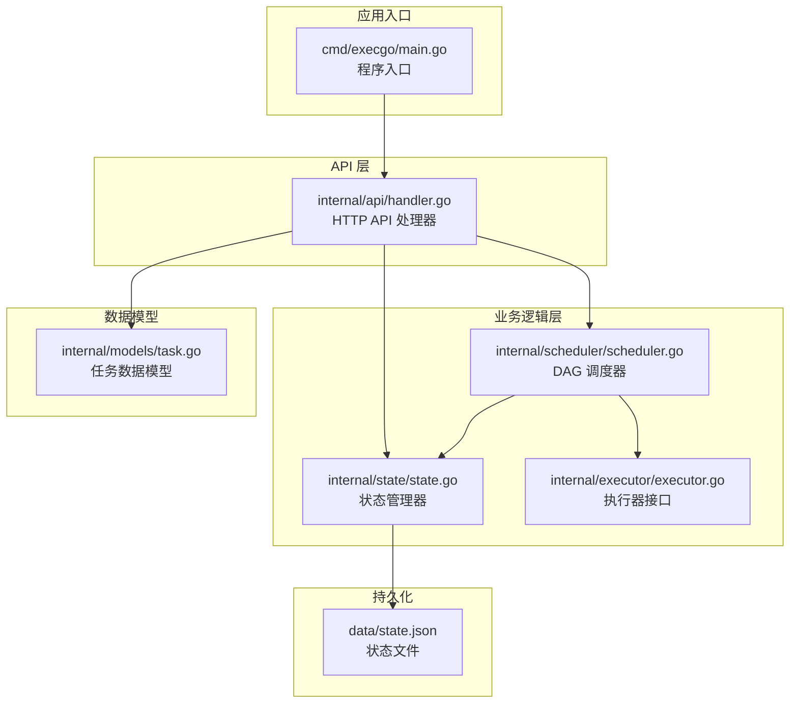
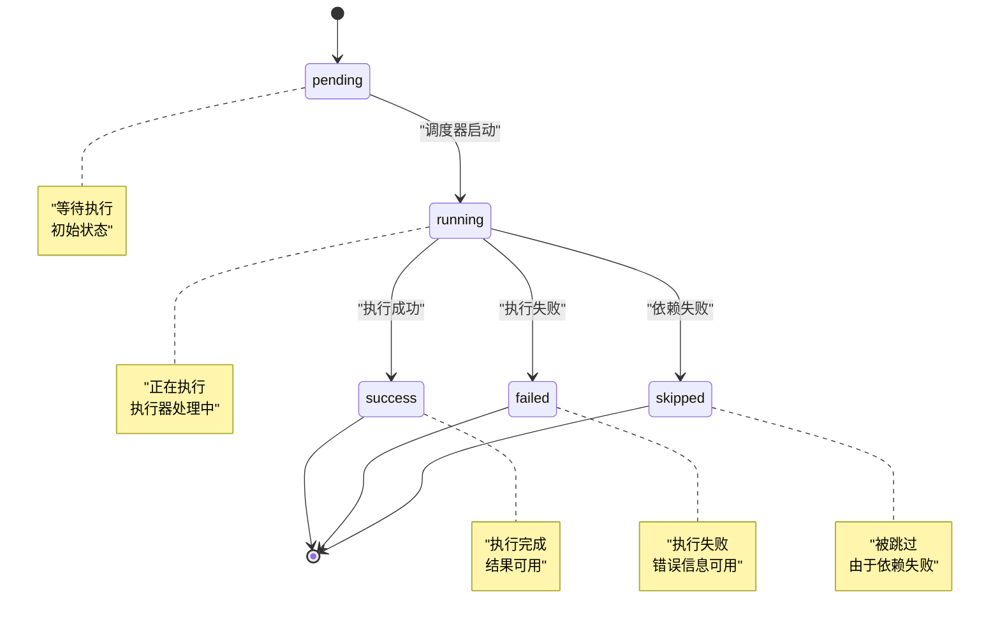
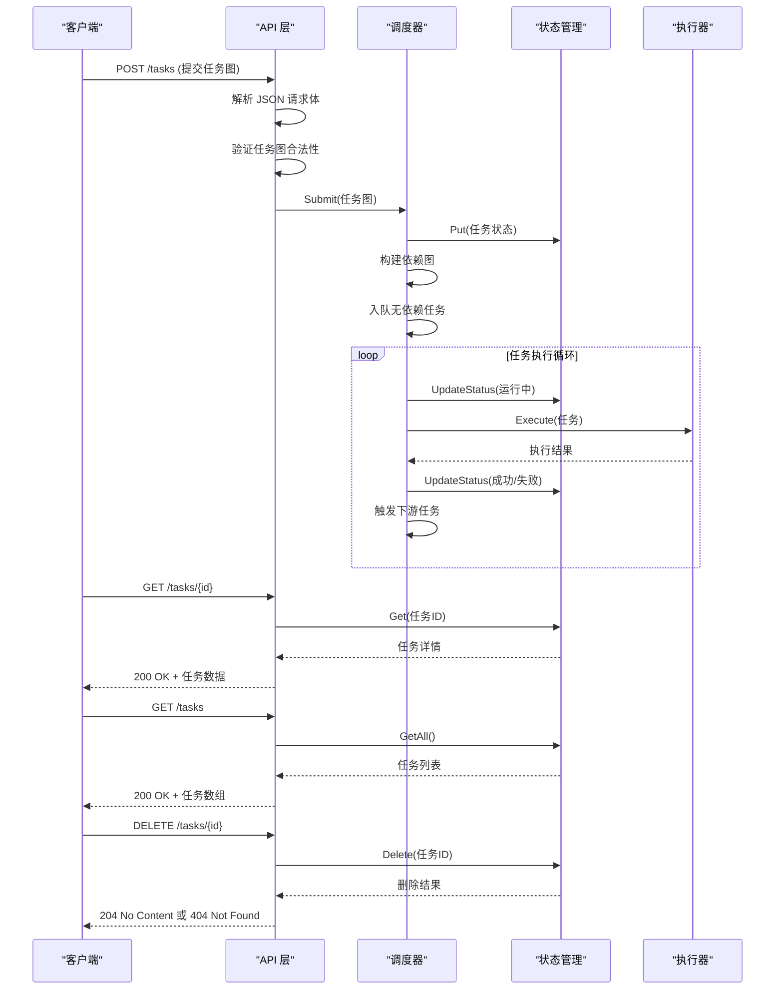
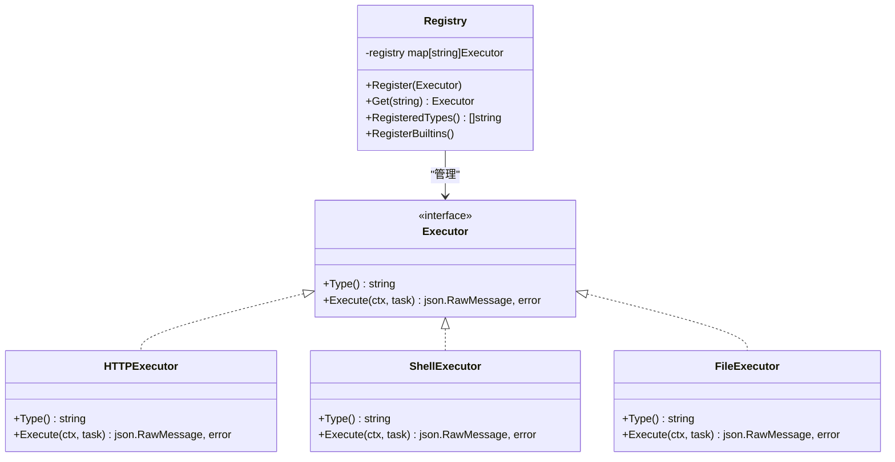
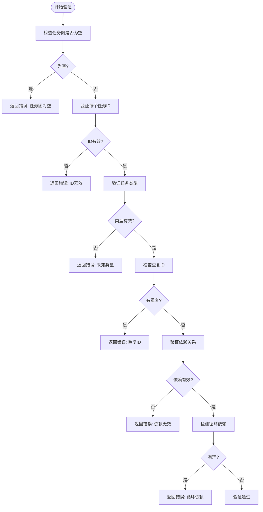

# 任务管理端点

<cite>
**本文档中引用的文件**
- [main.go](file://cmd/execgo/main.go)
- [handler.go](file://internal/api/handler.go)
- [task.go](file://internal/models/task.go)
- [state.go](file://internal/state/state.go)
- [scheduler.go](file://internal/scheduler/scheduler.go)
- [executor.go](file://internal/executor/executor.go)
- [state.json](file://data/state.json)
- [README.md](file://README.md)
</cite>

## 目录
1. [简介](#简介)
2. [项目结构](#项目结构)
3. [核心组件](#核心组件)
4. [架构概览](#架构概览)
5. [详细组件分析](#详细组件分析)
6. [依赖关系分析](#依赖关系分析)
7. [性能考虑](#性能考虑)
8. [故障排除指南](#故障排除指南)
9. [结论](#结论)

## 简介

ExecGo 是一个使用纯 Go 标准库构建的极简 AI 执行引擎，提供任务提交、DAG 调度、并发执行和可观测性的 HTTP 服务。本文档专注于任务管理相关的四个核心 API 端点，详细说明 POST /tasks（提交任务图）、GET /tasks/{id}（获取单个任务）、GET /tasks（列出所有任务）和 DELETE /tasks/{id}（删除任务）的完整规范。

## 项目结构

ExecGo 采用清晰的分层架构设计，主要组件包括：



**图表来源**
- [main.go:1-105](file://cmd/execgo/main.go#L1-L105)
- [handler.go:1-157](file://internal/api/handler.go#L1-L157)
- [scheduler.go:1-231](file://internal/scheduler/scheduler.go#L1-L231)
- [state.go:1-180](file://internal/state/state.go#L1-L180)
- [executor.go:1-68](file://internal/executor/executor.go#L1-L68)
- [task.go:1-149](file://internal/models/task.go#L1-L149)

**章节来源**
- [main.go:1-105](file://cmd/execgo/main.go#L1-L105)
- [README.md:149-177](file://README.md#L149-L177)

## 核心组件

### 任务状态管理

系统支持五种任务状态，每种状态都有明确的含义和转换规则：



**图表来源**
- [task.go:10-19](file://internal/models/task.go#L10-L19)

### 任务数据模型

任务对象包含以下核心字段：

| 字段名 | 类型 | 必填 | 描述 |
|--------|------|------|------|
| id | string | 是 | 任务唯一标识符 |
| type | string | 是 | 执行器类型（http/shell/file） |
| params | json.RawMessage | 否 | 执行器特定参数 |
| depends_on | []string | 否 | 依赖的任务ID列表 |
| retry | int | 否 | 重试次数（默认0） |
| timeout | int64 | 否 | 超时时间（毫秒） |
| status | TaskStatus | 是 | 当前任务状态 |
| result | json.RawMessage | 否 | 执行结果 |
| error | string | 否 | 错误信息 |
| created_at | time.Time | 是 | 创建时间 |
| updated_at | time.Time | 是 | 更新时间 |

**章节来源**
- [task.go:21-34](file://internal/models/task.go#L21-L34)

## 架构概览

ExecGo 的任务管理架构采用事件驱动的设计模式：



**图表来源**
- [handler.go:58-126](file://internal/api/handler.go#L58-L126)
- [scheduler.go:69-97](file://internal/scheduler/scheduler.go#L69-L97)
- [state.go:55-92](file://internal/state/state.go#L55-L92)

## 详细组件分析

### POST /tasks - 提交任务图

#### 端点规范

- **方法**: POST
- **路径**: `/tasks`
- **内容类型**: `application/json`
- **认证**: 无（开放访问）

#### 请求体格式

任务图必须包含一个 `tasks` 数组，每个任务对象遵循以下结构：

```json
{
  "tasks": [
    {
      "id": "string",
      "type": "http | shell | file",
      "params": {
        "url": "https://example.com",
        "method": "GET",
        "headers": {},
        "body": {}
      },
      "depends_on": ["task1", "task2"],
      "retry": 3,
      "timeout": 5000
    }
  ]
}
```

#### 请求验证规则

1. **任务图不能为空**: 至少包含一个任务
2. **任务ID要求**: 每个任务必须有唯一的非空ID
3. **类型验证**: 任务类型必须存在且在执行器注册表中
4. **依赖验证**: 
   - 依赖的任务必须存在于图中
   - 不能依赖自身
   - 不能形成循环依赖
5. **重复ID检查**: ID 在整个任务图中必须唯一

#### 成功响应

- **状态码**: 202 Accepted
- **响应体**: 包含接受的任务数量和任务ID列表

```json
{
  "accepted": 3,
  "task_ids": ["task1", "task2", "task3"]
}
```

#### 错误响应

- **400 Bad Request**: 请求格式无效或验证失败
- **400 Bad Request**: 未知任务类型
- **400 Bad Request**: 任务图验证失败

#### 常见使用场景

1. **单任务提交**: 提交简单的单一任务
2. **DAG 工作流**: 提交复杂的多任务依赖图
3. **批量任务**: 一次性提交多个相互独立的任务

**章节来源**
- [handler.go:58-99](file://internal/api/handler.go#L58-L99)
- [task.go:41-79](file://internal/models/task.go#L41-L79)

### GET /tasks/{id} - 获取单个任务

#### 端点规范

- **方法**: GET
- **路径**: `/tasks/{id}`
- **路径参数**: `id` - 任务唯一标识符
- **内容类型**: `application/json`
- **认证**: 无

#### 成功响应

- **状态码**: 200 OK
- **响应体**: 完整的任务对象

```json
{
  "id": "fetch-data",
  "type": "http",
  "params": {
    "url": "https://httpbin.org/json",
    "method": "GET"
  },
  "depends_on": [],
  "retry": 0,
  "timeout": 10000,
  "status": "success",
  "result": {
    "slideshow": {
      "title": "Sample Slide Show"
    }
  },
  "created_at": "2026-01-01T12:00:00Z",
  "updated_at": "2026-01-01T12:00:05Z"
}
```

#### 错误响应

- **404 Not Found**: 任务不存在

#### 最佳实践

1. **幂等性**: GET 请求是幂等的，可以安全重试
2. **轮询策略**: 建议使用指数退避策略进行状态轮询
3. **错误处理**: 始终检查响应状态码

**章节来源**
- [handler.go:101-110](file://internal/api/handler.go#L101-L110)
- [state.go:62-68](file://internal/state/state.go#L62-L68)

### GET /tasks - 列出所有任务

#### 端点规范

- **方法**: GET
- **路径**: `/tasks`
- **内容类型**: `application/json`
- **认证**: 无

#### 成功响应

- **状态码**: 200 OK
- **响应体**: 任务对象数组

```json
[
  {
    "id": "step1",
    "type": "file",
    "params": {
      "action": "write",
      "path": "data/test.txt",
      "content": "Hello from ExecGo DAG!"
    },
    "timeout": 3000,
    "status": "success",
    "result": {
      "bytes_written": 22
    },
    "created_at": "2026-03-25T11:41:12.1617732+08:00",
    "updated_at": "2026-03-25T11:41:12.1629204+08:00"
  }
]
```

#### 最佳实践

1. **分页处理**: 对于大量任务，建议实现分页机制
2. **过滤策略**: 可以在客户端实现按状态或类型过滤
3. **缓存策略**: 对于频繁查询的场景，可以实现本地缓存

**章节来源**
- [handler.go:112-116](file://internal/api/handler.go#L112-L116)
- [state.go:70-80](file://internal/state/state.go#L70-L80)

### DELETE /tasks/{id} - 删除任务

#### 端点规范

- **方法**: DELETE
- **路径**: `/tasks/{id}`
- **路径参数**: `id` - 任务唯一标识符
- **内容类型**: `application/json`
- **认证**: 无

#### 成功响应

- **状态码**: 204 No Content
- **响应体**: 无

#### 错误响应

- **404 Not Found**: 任务不存在

#### 注意事项

1. **不可逆操作**: 删除操作是不可逆的
2. **依赖影响**: 删除上游任务会影响下游任务的执行
3. **资源清理**: 删除后相关资源会被释放

**章节来源**
- [handler.go:118-126](file://internal/api/handler.go#L118-L126)
- [state.go:82-92](file://internal/state/state.go#L82-L92)

## 依赖关系分析

### 执行器注册机制

系统采用注册表模式管理执行器，支持动态扩展：



**图表来源**
- [executor.go:14-67](file://internal/executor/executor.go#L14-L67)

### 任务验证流程

任务图验证采用多阶段检查机制：



**图表来源**
- [task.go:41-79](file://internal/models/task.go#L41-L79)
- [task.go:81-121](file://internal/models/task.go#L81-L121)

**章节来源**
- [executor.go:31-67](file://internal/executor/executor.go#L31-L67)
- [task.go:41-121](file://internal/models/task.go#L41-L121)

## 性能考虑

### 并发控制

系统采用信号量机制控制最大并发执行数：

- **默认并发限制**: 10
- **可配置**: 通过命令行参数调整
- **动态调整**: 支持运行时配置

### 内存管理

- **状态存储**: 使用 `sync.RWMutex` 保证并发安全
- **内存优化**: 采用延迟加载和定期持久化策略
- **垃圾回收**: 通过上下文取消机制及时释放资源

### 网络性能

- **超时设置**: 默认读取超时15秒，写入超时30秒
- **连接复用**: 使用标准库 HTTP 客户端自动复用连接
- **优雅关闭**: 支持平滑关闭，确保资源正确释放

## 故障排除指南

### 常见错误及解决方案

| 错误类型 | 状态码 | 错误原因 | 解决方案 |
|----------|--------|----------|----------|
| JSON解析错误 | 400 | 请求体不是有效的JSON | 检查JSON格式，使用在线验证工具 |
| 验证失败 | 400 | 任务图不符合规范 | 检查任务ID、类型、依赖关系 |
| 未知类型 | 400 | 执行器未注册 | 确认任务类型是否正确 |
| 任务不存在 | 404 | ID不存在 | 检查任务ID是否正确 |
| 资源不足 | 503 | 并发达到上限 | 减少并发数或等待任务完成 |

### 调试技巧

1. **启用调试日志**: 查看系统日志了解详细错误信息
2. **健康检查**: 使用 `/health` 端点确认服务状态
3. **指标监控**: 通过 `/metrics` 端点查看系统指标
4. **状态持久化**: 检查 `data/state.json` 文件确认状态

### 性能优化建议

1. **批量提交**: 将相关任务合并为单个请求
2. **合理重试**: 设置适当的重试次数和超时时间
3. **依赖优化**: 合理设计任务依赖关系，避免不必要的串行
4. **资源管理**: 及时清理已完成的任务

**章节来源**
- [handler.go:64-85](file://internal/api/handler.go#L64-L85)
- [scheduler.go:127-190](file://internal/scheduler/scheduler.go#L127-L190)

## 结论

ExecGo 的任务管理 API 提供了简洁而强大的功能，支持复杂的工作流编排和状态管理。通过清晰的分层架构和严格的验证机制，系统能够可靠地处理各种任务场景。

### 主要优势

1. **简单易用**: RESTful API 设计直观，易于理解和使用
2. **功能完整**: 支持完整的任务生命周期管理
3. **可扩展性**: 基于注册表的执行器架构便于扩展
4. **可靠性**: 完善的错误处理和状态持久化机制
5. **可观测性**: 丰富的日志和指标支持

### 最佳实践总结

1. **任务设计**: 合理设计任务粒度，避免过细或过粗
2. **依赖管理**: 明确任务间的依赖关系，避免循环依赖
3. **错误处理**: 实现完善的错误处理和重试机制
4. **监控告警**: 建立监控体系，及时发现和解决问题
5. **资源管理**: 合理配置并发和资源，避免系统过载

通过遵循本文档的规范和最佳实践，开发者可以充分利用 ExecGo 的能力构建高效可靠的 AI 任务执行系统。