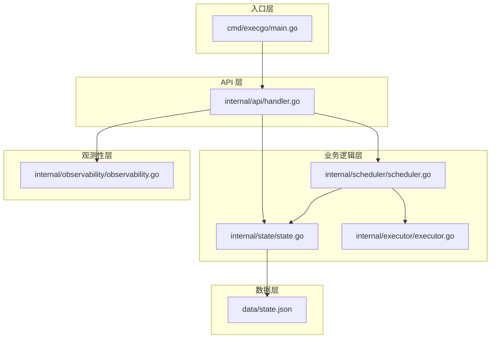
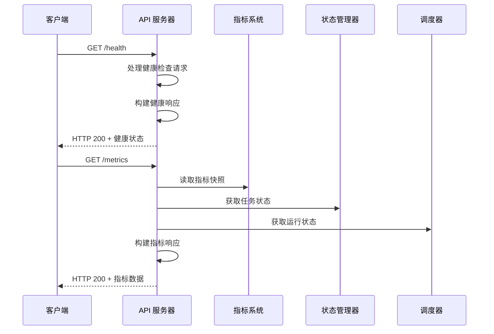
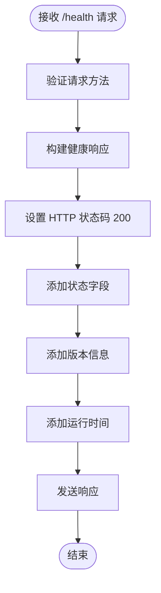
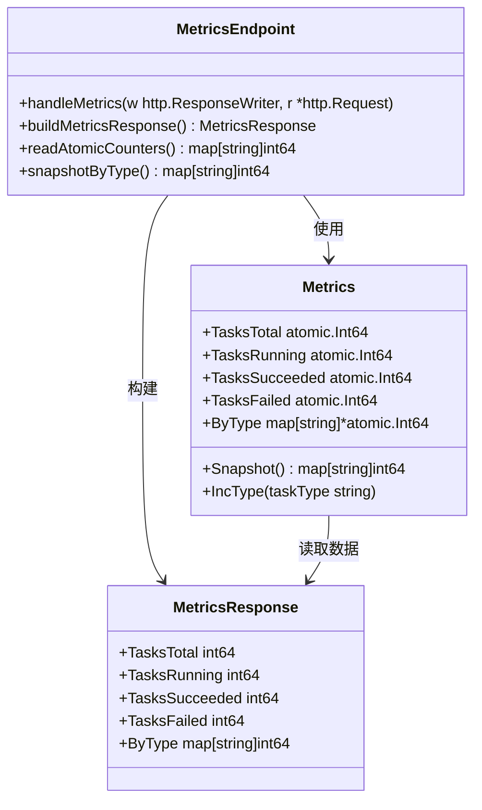
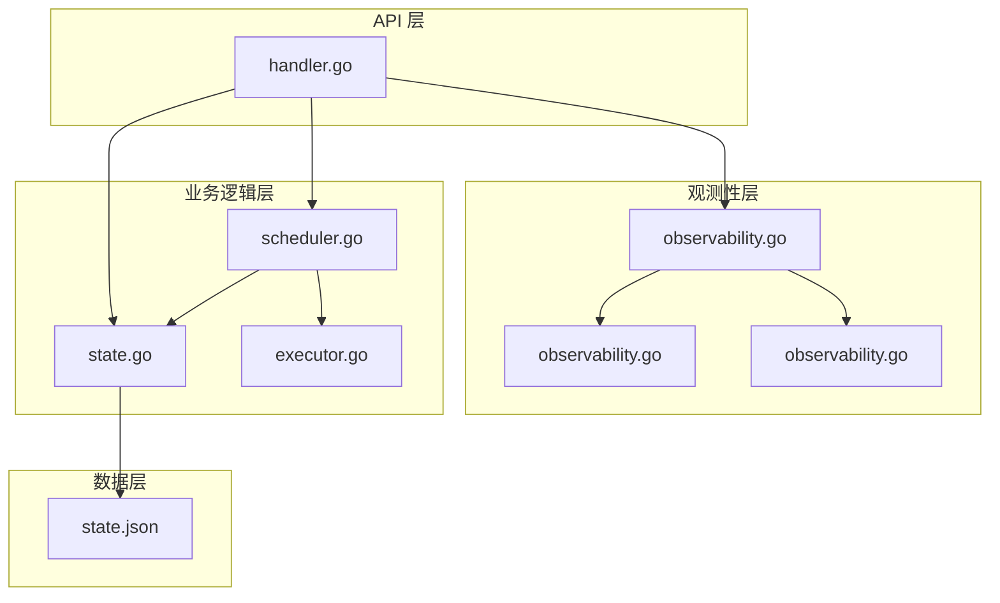

# 系统健康端点

<cite>
**本文档引用的文件**
- [main.go](file://cmd/execgo/main.go)
- [handler.go](file://internal/api/handler.go)
- [task.go](file://internal/models/task.go)
- [observability.go](file://internal/observability/observability.go)
- [scheduler.go](file://internal/scheduler/scheduler.go)
- [state.go](file://internal/state/state.go)
- [executor.go](file://internal/executor/executor.go)
- [state.json](file://data/state.json)
- [README.md](file://README.md)
</cite>

## 目录
1. [简介](#简介)
2. [项目结构](#项目结构)
3. [核心组件](#核心组件)
4. [架构概览](#架构概览)
5. [详细组件分析](#详细组件分析)
6. [依赖关系分析](#依赖关系分析)
7. [性能考虑](#性能考虑)
8. [故障排除指南](#故障排除指南)
9. [结论](#结论)

## 简介

ExecGo 是一个使用纯 Go 标准库构建的极简 AI 执行引擎，提供任务提交、DAG 调度、并发执行和可观测性的 HTTP 服务。本文档专注于系统健康检查和指标查询端点的详细说明，帮助用户理解和正确使用 `/health` 和 `/metrics` 端点进行系统监控和运维。

## 项目结构

ExecGo 采用清晰的分层架构设计，主要包含以下核心模块：



**图表来源**
- [main.go:25-62](file://cmd/execgo/main.go#L25-L62)
- [handler.go:19-37](file://internal/api/handler.go#L19-L37)

**章节来源**
- [main.go:1-105](file://cmd/execgo/main.go#L1-L105)
- [README.md:149-177](file://README.md#L149-L177)

## 核心组件

### 健康检查端点 (GET /health)

健康检查端点用于验证系统的基本运行状态，提供系统健康状况的快速检查能力。

**功能特性：**
- 返回系统基本健康状态
- 包含版本信息
- 显示系统运行时间
- 支持 HTTP 200 OK 响应

**响应格式：**
```json
{
  "status": "ok",
  "version": "v0.1.0",
  "uptime": "1h23m45s"
}
```

### 指标查询端点 (GET /metrics)

指标查询端点提供系统运行时的详细统计信息，支持监控系统的集成和数据分析。

**功能特性：**
- 返回任务总数统计
- 显示运行中任务数量
- 统计成功和失败任务数
- 按任务类型分类的统计数据
- 实时指标快照

**响应格式：**
```json
{
  "tasks_total": 150,
  "tasks_running": 5,
  "tasks_succeeded": 120,
  "tasks_failed": 25,
  "by_type": {
    "http": 45,
    "shell": 60,
    "file": 45
  }
}
```

**章节来源**
- [handler.go:128-146](file://internal/api/handler.go#L128-L146)
- [task.go:134-149](file://internal/models/task.go#L134-L149)

## 架构概览

ExecGo 的健康检查和指标系统采用事件驱动的架构设计，通过原子操作确保指标的线程安全性和准确性。



**图表来源**
- [handler.go:40-52](file://internal/api/handler.go#L40-L52)
- [handler.go:128-146](file://internal/api/handler.go#L128-L146)

## 详细组件分析

### 健康检查端点实现

健康检查端点通过 `handleHealth` 方法实现，提供系统基本运行状态的验证能力。



**图表来源**
- [handler.go:128-135](file://internal/api/handler.go#L128-L135)

**实现细节：**
- 使用 `time.Since(s.startTime)` 计算系统运行时间
- 版本号固定为 "v0.1.0"
- 响应状态始终为 "ok"
- 返回格式符合标准健康检查规范

**章节来源**
- [handler.go:128-135](file://internal/api/handler.go#L128-L135)
- [task.go:134-139](file://internal/models/task.go#L134-L139)

### 指标查询端点实现

指标查询端点通过 `handleMetrics` 方法实现，提供系统运行时的详细统计信息。



**图表来源**
- [handler.go:137-146](file://internal/api/handler.go#L137-L146)
- [observability.go:86-133](file://internal/observability/observability.go#L86-L133)
- [task.go:141-148](file://internal/models/task.go#L141-L148)

**实现细节：**
- 使用原子操作确保并发安全性
- 通过 `Snapshot()` 方法获取类型统计快照
- 实时读取当前指标状态
- 支持动态类型统计

**章节来源**
- [handler.go:137-146](file://internal/api/handler.go#L137-L146)
- [observability.go:104-133](file://internal/observability/observability.go#L104-L133)

### 指标数据结构

ExecGo 使用原子操作和互斥锁结合的方式实现线程安全的指标统计。

```mermaid
erDiagram
METRICS {
int64 TasksTotal
int64 TasksRunning
int64 TasksSucceeded
int64 TasksFailed
map~string, atomic~int64~~ ByType
}
ATOMIC_INT64 {
int64 value
+Add(delta int64)
+Load() int64
+Store(newValue int64)
}
METRICS ||--|| ATOMIC_INT64 : "使用"
METRICS ||--|| ATOMIC_INT64 : "按类型统计"
```

**图表来源**
- [observability.go:86-102](file://internal/observability/observability.go#L86-L102)

**数据持久性特点：**
- 指标数据存储在内存中，不进行持久化
- 系统重启后指标数据会重置
- 仅保存任务状态到磁盘文件

**章节来源**
- [observability.go:86-102](file://internal/observability/observability.go#L86-L102)
- [state.go:110-134](file://internal/state/state.go#L110-L134)

## 依赖关系分析

健康检查和指标端点的实现依赖于多个系统组件，形成了清晰的依赖关系。



**图表来源**
- [handler.go:19-37](file://internal/api/handler.go#L19-L37)
- [scheduler.go:18-45](file://internal/scheduler/scheduler.go#L18-L45)

**依赖关系说明：**
- API 层依赖观测性层提供的指标系统
- 调度器负责维护指标数据的更新
- 状态管理器提供任务状态的持久化
- 执行器负责实际的任务执行和状态变更

**章节来源**
- [handler.go:19-37](file://internal/api/handler.go#L19-L37)
- [scheduler.go:18-45](file://internal/scheduler/scheduler.go#L18-L45)

## 性能考虑

### 指标更新频率

ExecGo 的指标系统采用实时更新机制，确保监控数据的准确性：

- **任务总数**: 在任务提交时实时增加
- **运行中任务**: 在任务开始执行时增加，在执行完成时减少
- **成功/失败任务**: 在任务执行完成后更新
- **类型统计**: 在任务提交时增加，实时反映任务类型分布

### 数据持久性特点

- **指标数据**: 内存存储，系统重启后丢失
- **任务状态**: 文件持久化，支持崩溃恢复
- **日志数据**: 标准输出，需要外部日志收集系统处理

### 并发安全性

系统使用原子操作和互斥锁确保指标数据的线程安全：

- 使用 `atomic.Int64` 保证计数器的原子性
- 使用 `sync.RWMutex` 保护类型统计映射
- 读操作使用读锁，写操作使用写锁

## 故障排除指南

### 常见问题诊断

**健康检查失败：**
- 检查系统是否正常启动
- 验证 HTTP 服务器监听端口
- 查看应用启动日志

**指标查询异常：**
- 确认指标端点路径正确
- 检查系统是否有足够的权限访问指标数据
- 验证系统内存是否充足

**监控集成问题：**
- 确认监控系统能够访问正确的端点
- 检查网络连接和防火墙设置
- 验证监控系统的抓取间隔配置

### 性能优化建议

**监控系统配置：**
- 建议抓取间隔为 15-30 秒
- 避免过于频繁的查询导致系统负载增加
- 合理设置告警阈值

**系统调优：**
- 根据实际负载调整最大并发数
- 监控内存使用情况，避免指标过多导致内存压力
- 定期清理不需要的历史数据

**章节来源**
- [main.go:72-104](file://cmd/execgo/main.go#L72-L104)
- [scheduler.go:127-190](file://internal/scheduler/scheduler.go#L127-L190)

## 结论

ExecGo 的健康检查和指标查询端点提供了简单而有效的系统监控能力。通过 `/health` 端点可以快速验证系统运行状态，通过 `/metrics` 端点可以获得详细的运行时统计信息。

**主要优势：**
- 实现简洁，零第三方依赖
- 提供实时指标数据
- 支持多种监控系统的集成
- 具备良好的并发安全性

**使用建议：**
- 在生产环境中配置适当的监控告警
- 定期检查系统健康状态
- 根据业务需求调整监控策略
- 结合日志系统进行综合监控

该实现为系统运维和监控提供了坚实的基础，能够满足大多数 AI 执行引擎的监控需求。