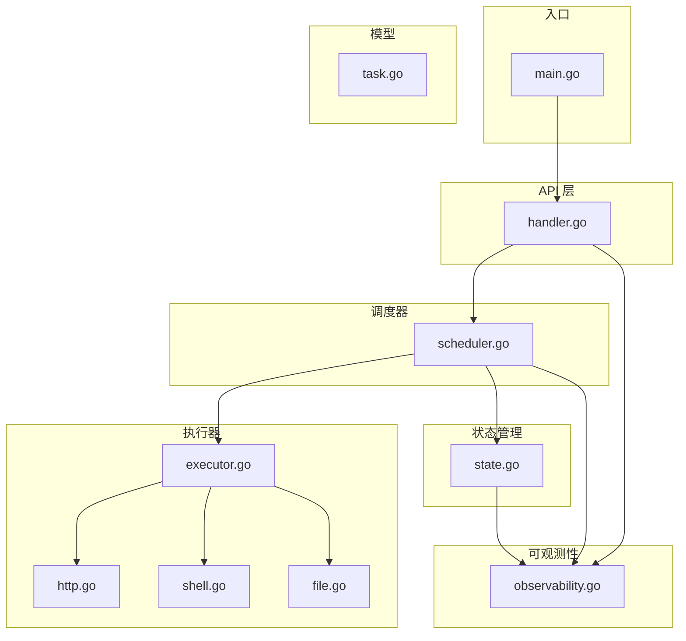
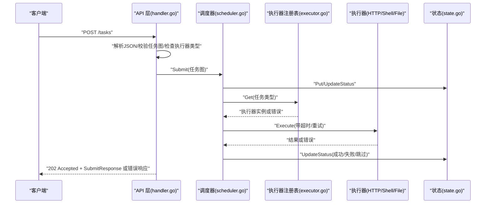
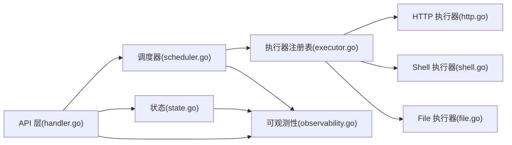

# 错误处理和状态码

<cite>
**本文引用的文件**
- [main.go](file://cmd/execgo/main.go)
- [handler.go](file://internal/api/handler.go)
- [task.go](file://internal/models/task.go)
- [executor.go](file://internal/executor/executor.go)
- [http.go](file://internal/executor/http.go)
- [shell.go](file://internal/executor/shell.go)
- [file.go](file://internal/executor/file.go)
- [scheduler.go](file://internal/scheduler/scheduler.go)
- [state.go](file://internal/state/state.go)
- [observability.go](file://internal/observability/observability.go)
- [README.md](file://README.md)
</cite>

## 目录
1. [简介](#简介)
2. [项目结构](#项目结构)
3. [核心组件](#核心组件)
4. [架构总览](#架构总览)
5. [详细组件分析](#详细组件分析)
6. [依赖分析](#依赖分析)
7. [性能考虑](#性能考虑)
8. [故障排查指南](#故障排查指南)
9. [结论](#结论)
10. [附录](#附录)

## 简介
本文件面向 ExecGo API 的使用者与集成者，系统性梳理错误处理机制与 HTTP 状态码规范，覆盖请求解析、任务验证、执行器选择、任务执行、状态更新与持久化等全流程中的错误场景与响应格式。同时给出客户端错误处理最佳实践，帮助区分可恢复与永久性错误，并提供重试、超时与错误恢复策略建议。

## 项目结构
ExecGo 采用分层架构：入口程序负责初始化与 HTTP 服务；API 层负责路由与错误响应；调度器负责 DAG 任务的并发执行与状态推进；执行器负责具体任务的执行；状态管理器负责内存与持久化；可观测性模块提供日志、追踪与指标。

图表来源
- [main.go:64-70](file://cmd/execgo/main.go#L64-L70)
- [handler.go:39-52](file://internal/api/handler.go#L39-L52)
- [scheduler.go:18-45](file://internal/scheduler/scheduler.go#L18-L45)
- [executor.go:14-67](file://internal/executor/executor.go#L14-L67)
- [http.go:22-75](file://internal/executor/http.go#L22-L75)
- [shell.go:31-79](file://internal/executor/shell.go#L31-L79)
- [file.go:20-113](file://internal/executor/file.go#L20-L113)
- [state.go:17-53](file://internal/state/state.go#L17-L53)
- [observability.go:69-80](file://internal/observability/observability.go#L69-L80)
- [task.go:21-39](file://internal/models/task.go#L21-L39)

章节来源
- [README.md:32-57](file://README.md#L32-L57)
- [main.go:64-70](file://cmd/execgo/main.go#L64-L70)
- [handler.go:39-52](file://internal/api/handler.go#L39-L52)

## 核心组件
- API 层：统一处理 HTTP 请求，进行 JSON 解析、任务图验证、执行器类型检查，并在错误时返回标准错误响应与相应状态码。
- 调度器：接收任务图，构建依赖关系，按并发上限调度执行，处理重试与超时，推进状态并级联下游。
- 执行器：HTTP、Shell、File 三种内置执行器，均在参数解析失败或执行失败时返回错误信息。
- 状态管理：提供任务的增删改查、状态原子更新与持久化。
- 模型：定义任务、任务图、统一错误响应等数据结构。
- 可观测性：提供结构化日志、请求追踪（traceID）与指标。

章节来源
- [handler.go:58-99](file://internal/api/handler.go#L58-L99)
- [scheduler.go:69-97](file://internal/scheduler/scheduler.go#L69-L97)
- [executor.go:14-67](file://internal/executor/executor.go#L14-L67)
- [state.go:55-108](file://internal/state/state.go#L55-L108)
- [task.go:123-149](file://internal/models/task.go#L123-L149)
- [observability.go:69-80](file://internal/observability/observability.go#L69-L80)

## 架构总览
下图展示 API 层到调度器与执行器的关键调用链路，以及错误在各层的传播与响应方式。

图表来源
- [handler.go:58-99](file://internal/api/handler.go#L58-L99)
- [scheduler.go:69-97](file://internal/scheduler/scheduler.go#L69-L97)
- [executor.go:38-48](file://internal/executor/executor.go#L38-L48)
- [http.go:27-75](file://internal/executor/http.go#L27-L75)
- [shell.go:36-79](file://internal/executor/shell.go#L36-L79)
- [file.go:25-52](file://internal/executor/file.go#L25-L52)
- [state.go:94-108](file://internal/state/state.go#L94-L108)

## 详细组件分析

### API 层错误处理与状态码
- POST /tasks
  - 无效 JSON：返回 400，错误响应体包含 error 字段，提示“invalid JSON”及底层错误详情。
  - 任务图验证失败：返回 400，错误响应体包含具体验证错误信息。
  - 未知任务类型：返回 400，错误响应体包含“unknown task type”及可用类型列表。
  - 成功提交：返回 202 Accepted，响应体包含 accepted 数量与 task_ids 列表。
- GET /tasks/{id}
  - 任务不存在：返回 404，错误响应体包含“task not found”。
- DELETE /tasks/{id}
  - 任务不存在：返回 404，错误响应体包含“task not found”。
  - 成功删除：返回 204 No Content。
- GET /tasks
  - 返回 200，列出所有任务。
- GET /health
  - 返回 200，包含健康状态、版本与运行时长。
- GET /metrics
  - 返回 200，包含任务总数、运行中、成功、失败与按类型统计。

章节来源
- [handler.go:58-99](file://internal/api/handler.go#L58-L99)
- [handler.go:101-126](file://internal/api/handler.go#L101-L126)
- [handler.go:128-146](file://internal/api/handler.go#L128-L146)
- [task.go:129-132](file://internal/models/task.go#L129-L132)

### 任务图验证与错误
- 任务图为空：返回 400。
- 任务缺少 id/type：返回 400。
- 重复 id：返回 400。
- 依赖引用不存在或自依赖：返回 400。
- 检测到环：返回 400。
- 通过验证后，API 层会逐项检查执行器是否存在，不存在则返回 400。

章节来源
- [task.go:41-79](file://internal/models/task.go#L41-L79)
- [handler.go:70-85](file://internal/api/handler.go#L70-L85)

### 执行器错误与状态推进
- HTTP 执行器
  - 参数解析失败：返回错误，调度器将其记录为失败。
  - URL/Method 缺失：返回错误，调度器将其记录为失败。
  - 请求失败：返回错误，调度器将其记录为失败。
  - 即使 HTTP 状态码 ≥ 400，仍返回结果但标记为失败。
- Shell 执行器
  - 参数解析失败：返回错误。
  - 命令不在白名单：返回错误。
  - 命令执行失败：返回结果（含 stdout/stderr/exit_code）并标记为失败。
- File 执行器
  - 参数解析失败：返回错误。
  - 路径缺失：返回错误。
  - 不支持的动作：返回错误。
  - 文件读写/删除/状态查询失败：返回错误。

章节来源
- [http.go:27-75](file://internal/executor/http.go#L27-L75)
- [shell.go:36-79](file://internal/executor/shell.go#L36-L79)
- [file.go:25-113](file://internal/executor/file.go#L25-L113)
- [scheduler.go:127-190](file://internal/scheduler/scheduler.go#L127-L190)

### 状态管理与持久化
- Put/Get/GetAll/Delete/UpdateStatus 提供原子更新与并发安全。
- 运行中任务在恢复时被重置为 pending，避免悬挂状态。
- 定期持久化与最终持久化保证崩溃后可恢复。

章节来源
- [state.go:55-108](file://internal/state/state.go#L55-L108)
- [state.go:160-179](file://internal/state/state.go#L160-L179)

### 统一错误响应格式
- 统一错误响应体包含一个字符串字段 error，用于描述错误原因。
- 响应头 Content-Type 设置为 application/json。
- API 层在错误时直接返回该格式，不包裹额外容器。

章节来源
- [task.go:129-132](file://internal/models/task.go#L129-L132)
- [handler.go:152-156](file://internal/api/handler.go#L152-L156)

### 可恢复与永久性错误
- 可恢复错误
  - 网络波动、临时性外部服务不可达、超时、执行器内部瞬时失败。
  - 调度器对任务执行采用指数退避重试（最多 retry+1 次），并在每次尝试前根据超时上下文控制执行时间。
- 永久性错误
  - 任务图验证失败（如缺少必要字段、自依赖、环依赖等）。
  - 未知任务类型或执行器未注册。
  - Shell 命令不在白名单。
  - File 执行器动作不支持或路径非法。
  - 任务不存在（查询/删除）。
- 区分建议
  - 对于 4xx（客户端错误）与 422（语义错误）类响应，通常为永久性错误，需修正请求后再提交。
  - 对于 5xx（服务端错误）与网络/超时导致的失败，可结合指数退避重试。

章节来源
- [scheduler.go:144-180](file://internal/scheduler/scheduler.go#L144-L180)
- [http.go:70-74](file://internal/executor/http.go#L70-L74)
- [shell.go:52-54](file://internal/executor/shell.go#L52-L54)
- [file.go:49-51](file://internal/executor/file.go#L49-L51)
- [handler.go:64-85](file://internal/api/handler.go#L64-L85)

## 依赖分析
- API 层依赖调度器与状态管理器，通过统一的错误响应格式对外输出。
- 调度器依赖执行器注册表与执行器实现，负责状态推进与持久化。
- 执行器实现各自参数解析与执行逻辑，失败时返回错误信息。
- 可观测性模块贯穿各层，提供日志与追踪。

图表来源
- [handler.go:39-52](file://internal/api/handler.go#L39-L52)
- [scheduler.go:18-45](file://internal/scheduler/scheduler.go#L18-L45)
- [executor.go:14-67](file://internal/executor/executor.go#L14-L67)
- [http.go:22-75](file://internal/executor/http.go#L22-L75)
- [shell.go:31-79](file://internal/executor/shell.go#L31-L79)
- [file.go:20-113](file://internal/executor/file.go#L20-L113)
- [state.go:17-53](file://internal/state/state.go#L17-L53)
- [observability.go:69-80](file://internal/observability/observability.go#L69-L80)

## 性能考虑
- 并发控制：调度器通过信号量限制最大并发，避免资源争用。
- 就绪队列：使用带缓冲通道承载就绪任务，减少锁竞争。
- 指数退避：重试间隔按 100ms·2^(attempt-2) 增长，上限 10 秒，降低抖动。
- 超时控制：每个执行尝试基于任务 timeout 构造带超时的上下文，避免长时间阻塞。
- 持久化：定期持久化与最终持久化确保崩溃恢复，避免丢失状态。

章节来源
- [scheduler.go:47-58](file://internal/scheduler/scheduler.go#L47-L58)
- [scheduler.go:99-107](file://internal/scheduler/scheduler.go#L99-L107)
- [scheduler.go:144-180](file://internal/scheduler/scheduler.go#L144-L180)
- [state.go:160-179](file://internal/state/state.go#L160-L179)

## 故障排查指南
- 常见错误与定位
  - 400 invalid JSON：检查请求体是否为合法 JSON，确认字段拼写与类型。
  - 400 验证失败：根据错误信息修正任务图，确保 id、type、依赖引用合法且无环。
  - 400 unknown task type：确认任务类型存在于已注册执行器列表中。
  - 404 任务不存在：确认任务 ID 是否正确，或是否已被删除。
  - 5xx 服务端错误：查看服务端日志（结构化 JSON），关注 trace_id 定位请求链路。
- 日志与追踪
  - API 层与调度器均使用结构化日志，包含 trace_id，便于跨组件关联。
  - 可通过 /metrics 查看任务总量、运行中、成功、失败与按类型统计。
- 恢复与重启
  - 重启后运行中任务会被重置为 pending，确保一致性。
  - 若持久化文件损坏，可删除后重新提交任务图重建状态。

章节来源
- [handler.go:64-85](file://internal/api/handler.go#L64-L85)
- [handler.go:101-126](file://internal/api/handler.go#L101-L126)
- [scheduler.go:127-190](file://internal/scheduler/scheduler.go#L127-L190)
- [state.go:41-50](file://internal/state/state.go#L41-L50)
- [state.go:136-158](file://internal/state/state.go#L136-L158)
- [observability.go:50-63](file://internal/observability/observability.go#L50-L63)

## 结论
ExecGo 的错误处理遵循“明确、一致、可观测”的原则：API 层统一返回 400/404/202/200 等状态码与标准化错误响应；调度器与执行器在失败时提供清晰的错误信息；可观测性贯穿始终，便于问题定位与恢复。客户端应区分可恢复与永久性错误，采用指数退避重试与合理超时策略，以提升整体鲁棒性。

## 附录

### HTTP 状态码与含义
- 200 OK
  - GET /tasks：返回所有任务列表。
  - GET /health：返回健康检查信息。
  - GET /metrics：返回指标信息。
- 201 Created
  - 本项目未实现该状态码。
- 202 Accepted
  - POST /tasks：任务图已接收并进入调度队列，返回 accepted 数量与 task_ids。
- 204 No Content
  - DELETE /tasks/{id}：删除成功。
- 400 Bad Request
  - 请求体非 JSON 或任务图验证失败。
  - 未知任务类型（包含可用类型列表）。
- 404 Not Found
  - 查询或删除的任务不存在。
- 500 Internal Server Error
  - 本项目未显式返回该状态码；若出现，通常为未捕获异常，建议查看服务端日志。

章节来源
- [handler.go:58-99](file://internal/api/handler.go#L58-L99)
- [handler.go:101-126](file://internal/api/handler.go#L101-L126)
- [handler.go:128-146](file://internal/api/handler.go#L128-L146)

### 错误响应格式
- 字段
  - error: 字符串，描述错误原因。
- 示例
  - 400 invalid JSON：包含 invalid JSON 与底层错误详情。
  - 400 验证失败：包含具体验证错误信息。
  - 400 unknown task type：包含 unknown task type 与可用类型列表。
  - 404 任务不存在：包含 task not found 与任务 ID。

章节来源
- [task.go:129-132](file://internal/models/task.go#L129-L132)
- [handler.go:64-85](file://internal/api/handler.go#L64-L85)

### 客户端错误处理最佳实践
- 重试策略
  - 指数退避：首次延迟 100ms，后续按 2 倍增长，上限 10 秒。
  - 最大重试次数：retry 字段决定最大尝试次数（至少 1 次）。
  - 超时控制：为每次重试设置合理的超时上下文，避免长时间阻塞。
- 超时设置
  - 读取超时：15 秒。
  - 写入超时：30 秒。
  - 空闲连接超时：60 秒。
- 错误恢复
  - 对于 400/404：修正请求后重试。
  - 对于 5xx/网络错误：指数退避重试，超过阈值后回退至人工干预。
  - 使用 trace_id 在日志中定位问题，结合 /metrics 观察趋势。

章节来源
- [main.go:64-70](file://cmd/execgo/main.go#L64-L70)
- [scheduler.go:144-180](file://internal/scheduler/scheduler.go#L144-L180)
- [observability.go:50-63](file://internal/observability/observability.go#L50-L63)