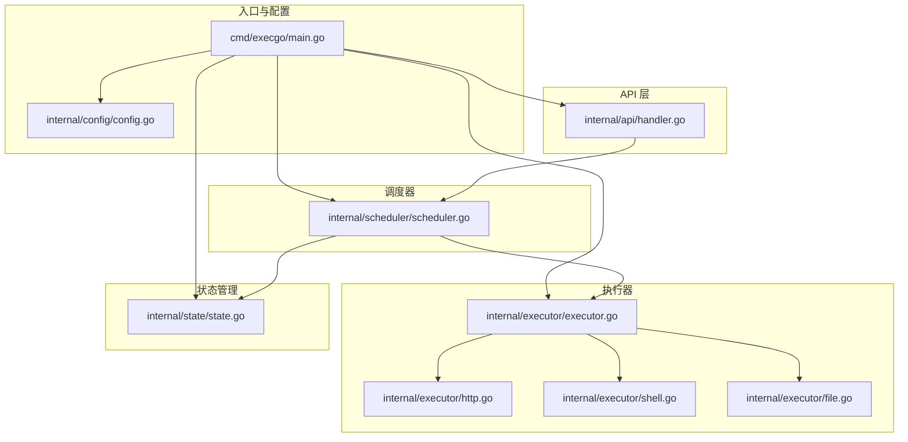
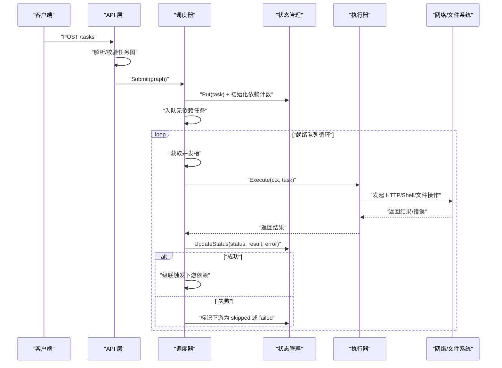
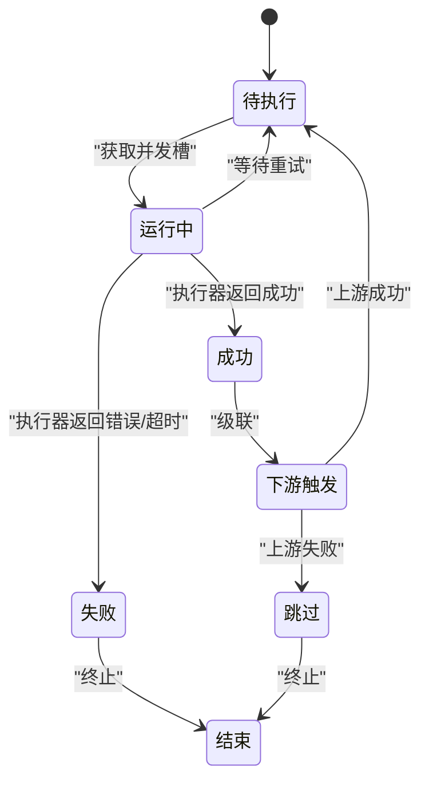
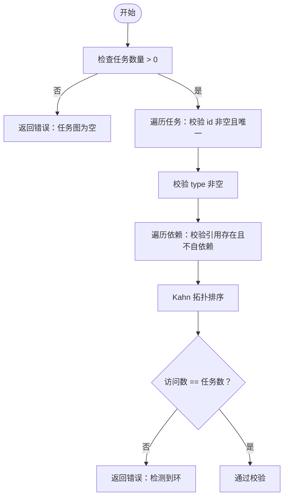
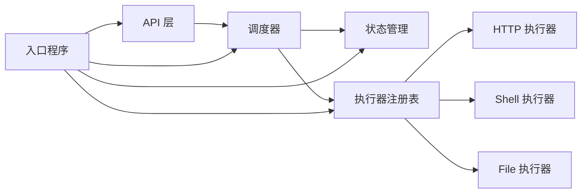

# 任务 DSL 规范

<cite>
**本文引用的文件**
- [main.go](file://cmd/execgo/main.go)
- [config.go](file://internal/config/config.go)
- [handler.go](file://internal/api/handler.go)
- [task.go](file://internal/models/task.go)
- [executor.go](file://internal/executor/executor.go)
- [http.go](file://internal/executor/http.go)
- [shell.go](file://internal/executor/shell.go)
- [file.go](file://internal/executor/file.go)
- [scheduler.go](file://internal/scheduler/scheduler.go)
- [state.go](file://internal/state/state.go)
- [README.md](file://README.md)
</cite>

## 目录
1. [简介](#简介)
2. [项目结构](#项目结构)
3. [核心组件](#核心组件)
4. [架构总览](#架构总览)
5. [详细组件分析](#详细组件分析)
6. [依赖关系分析](#依赖关系分析)
7. [性能考虑](#性能考虑)
8. [故障排查指南](#故障排查指南)
9. [结论](#结论)
10. [附录](#附录)

## 简介
本规范文档面向 ExecGo 任务 DSL（领域特定语言），系统性阐述任务对象的结构定义、字段语义与约束、任务类型参数规范、DAG 工作流定义示例、依赖关系与环检测机制、以及任务状态转换与生命周期管理。ExecGo 以纯 Go 标准库实现，提供 HTTP API、DAG 调度、并发执行、可观测性与状态持久化能力，适合作为 AI Agent 的轻量执行内核。

## 项目结构
ExecGo 采用分层架构：入口程序负责初始化配置、日志、执行器注册、状态管理器、调度器与 HTTP 服务；API 层处理任务提交与查询；调度器负责 DAG 编排与并发控制；执行器模块包含 HTTP/Shell/File 等内置执行器；状态管理器负责内存与磁盘持久化；可观测性模块提供日志、追踪与指标。

图表来源
- [main.go:25-104](file://cmd/execgo/main.go#L25-L104)
- [config.go:18-30](file://internal/config/config.go#L18-L30)
- [handler.go:39-52](file://internal/api/handler.go#L39-L52)
- [scheduler.go:34-45](file://internal/scheduler/scheduler.go#L34-L45)
- [executor.go:26-67](file://internal/executor/executor.go#L26-L67)
- [http.go:22-75](file://internal/executor/http.go#L22-L75)
- [shell.go:31-79](file://internal/executor/shell.go#L31-L79)
- [file.go:20-113](file://internal/executor/file.go#L20-L113)
- [state.go:17-53](file://internal/state/state.go#L17-L53)

章节来源
- [main.go:25-104](file://cmd/execgo/main.go#L25-L104)
- [README.md:149-177](file://README.md#L149-L177)

## 核心组件
- 任务模型与验证：定义任务对象字段、状态枚举、任务图结构与合法性校验（含依赖引用与环检测）。
- 执行器接口与注册表：统一执行器接口、全局注册表、内置执行器注册。
- 调度器：基于 DAG 的并发调度、就绪队列、信号量并发控制、重试与超时、状态变更与级联传播。
- 状态管理：内存任务映射、原子状态更新、周期性持久化与崩溃恢复。
- API 层：任务提交、查询、删除、健康检查、指标端点。

章节来源
- [task.go:21-79](file://internal/models/task.go#L21-L79)
- [executor.go:14-67](file://internal/executor/executor.go#L14-L67)
- [scheduler.go:18-97](file://internal/scheduler/scheduler.go#L18-L97)
- [state.go:17-134](file://internal/state/state.go#L17-L134)
- [handler.go:58-99](file://internal/api/handler.go#L58-L99)

## 架构总览
ExecGo 的任务执行链路如下：客户端通过 HTTP API 提交任务图，API 层进行校验与类型检查后提交给调度器；调度器根据依赖关系与并发限制将任务放入就绪队列，执行器按类型执行任务，完成后更新状态并级联触发下游任务。

图表来源
- [handler.go:58-99](file://internal/api/handler.go#L58-L99)
- [scheduler.go:69-97](file://internal/scheduler/scheduler.go#L69-L97)
- [scheduler.go:127-190](file://internal/scheduler/scheduler.go#L127-L190)
- [scheduler.go:192-222](file://internal/scheduler/scheduler.go#L192-L222)
- [state.go:94-108](file://internal/state/state.go#L94-L108)

## 详细组件分析

### 任务 DSL 字段定义与约束
- id：任务唯一标识，必填且在任务图中不可重复，不能为空字符串。
- type：任务类型，必填，需与已注册执行器类型一致。
- params：类型相关的参数，以 JSON 形式传入，不同执行器有不同的参数结构。
- depends_on：上游任务 ID 列表，引用必须存在于任务图中且不能自依赖。
- retry：重试次数，非负整数；实际尝试次数为 retry+1，首次尝试不计入重试。
- timeout：毫秒级超时时间，<=0 表示无超时；每次尝试均会创建带超时的 context。
- status：任务状态枚举，支持 pending、running、success、failed、skipped。
- result/error：执行结果与错误信息，由执行器返回并保存。
- created_at/updated_at：任务创建与最近更新时间戳。

任务图校验规则：
- 任务数量 > 0。
- id 唯一且非空。
- type 非空。
- depends_on 引用必须存在且不能自依赖。
- 使用拓扑排序检测环，若存在环则拒绝提交。

章节来源
- [task.go:21-34](file://internal/models/task.go#L21-L34)
- [task.go:41-79](file://internal/models/task.go#L41-L79)
- [task.go:81-121](file://internal/models/task.go#L81-L121)

### 任务状态转换与生命周期
- 提交阶段：调度器接收任务图，将每个任务状态置为 pending，并记录创建/更新时间。
- 执行阶段：调度器为每个任务获取并发槽，更新状态为 running，调用对应执行器执行。
- 成功：执行器返回成功，调度器更新为 success，指标增加成功计数，级联触发下游依赖。
- 失败：执行器返回错误或超时，调度器按重试策略指数退避多次尝试，最终失败则标记 failed。
- 跳过：当上游依赖失败时，下游任务被标记 skipped，并级联跳过其下游。
- 指标：维护 total、running、succeeded、failed 与按类型统计的指标。

图表来源
- [scheduler.go:127-190](file://internal/scheduler/scheduler.go#L127-L190)
- [scheduler.go:192-222](file://internal/scheduler/scheduler.go#L192-L222)
- [state.go:94-108](file://internal/state/state.go#L94-L108)

章节来源
- [scheduler.go:47-67](file://internal/scheduler/scheduler.go#L47-L67)
- [scheduler.go:127-190](file://internal/scheduler/scheduler.go#L127-L190)
- [scheduler.go:192-222](file://internal/scheduler/scheduler.go#L192-L222)

### 任务类型与参数规范

#### HTTP 执行器
- 类型标识：http
- 参数结构：
  - url：必填，目标 URL。
  - method：可选，默认 GET。
  - headers：可选，请求头键值对。
  - body：可选，请求体内容。
- 行为：
  - 使用 http.DefaultClient 发起请求。
  - 限制响应体大小为 1MB。
  - 状态码 >= 400 仍返回结果，但任务标记为失败。
  - 返回包含状态码与响应体的 JSON 结果。

章节来源
- [http.go:14-20](file://internal/executor/http.go#L14-L20)
- [http.go:27-75](file://internal/executor/http.go#L27-L75)

#### Shell 执行器
- 类型标识：shell
- 参数结构：
  - command：必填，命令名称（支持绝对/相对路径，白名单校验取基础名）。
  - args：可选，参数数组。
  - dir：可选，执行目录。
- 白名单命令（部分示例）：echo、cat、ls、date、whoami、hostname、uname、pwd、curl、wget、ping、dig、grep、awk、sed、head、tail、wc、sort、uniq、find、dir、where、type。
- 行为：
  - 仅允许白名单中的命令执行。
  - 收集 stdout、stderr 与退出码，返回 JSON 结果。
  - 执行失败返回错误信息与结果。

章节来源
- [shell.go:14-22](file://internal/executor/shell.go#L14-L22)
- [shell.go:24-29](file://internal/executor/shell.go#L24-L29)
- [shell.go:36-79](file://internal/executor/shell.go#L36-L79)

#### File 执行器
- 类型标识：file
- 参数结构：
  - action：必填，支持 read、write、append、delete、stat。
  - path：必填，文件路径（内部进行清理以防止目录穿越）。
  - content：可选，写入内容（仅 write/append 有效）。
- 行为：
  - read：返回内容与大小。
  - write/append：确保目录存在，写入内容，返回写入字节数。
  - delete：删除文件，返回删除成功标志。
  - stat：返回文件名、大小、权限、修改时间与是否目录等信息。
  - 不支持的 action 返回错误。

章节来源
- [file.go:13-18](file://internal/executor/file.go#L13-L18)
- [file.go:25-52](file://internal/executor/file.go#L25-L52)
- [file.go:54-113](file://internal/executor/file.go#L54-L113)

### 依赖关系与环检测
- 依赖声明：通过 depends_on 指定上游任务 ID 列表。
- 依赖验证：
  - 任务 ID 必须唯一且非空。
  - depends_on 引用必须存在于任务图中。
  - 不允许自依赖。
- 环检测：使用 Kahn 算法进行拓扑排序，若访问节点数小于任务总数，则判定存在环并拒绝提交。

图表来源
- [task.go:41-79](file://internal/models/task.go#L41-L79)
- [task.go:81-121](file://internal/models/task.go#L81-L121)

章节来源
- [task.go:41-79](file://internal/models/task.go#L41-L79)
- [task.go:81-121](file://internal/models/task.go#L81-L121)

### 任务定义示例

- 单任务示例（Shell）
  - 提交一个 Shell 任务，执行命令并设置重试与超时。
  - 示例请求体结构参见：[示例请求体:83-97](file://README.md#L83-L97)

- DAG 工作流示例（HTTP → File → File）
  - fetch-data：HTTP 执行器拉取数据。
  - save-result：File 执行器写入文件，依赖 fetch-data。
  - verify：File 执行器读取文件，依赖 save-result。
  - 示例请求体结构参见：[DAG 示例:101-126](file://README.md#L101-L126)

章节来源
- [README.md:79-126](file://README.md#L79-L126)

## 依赖关系分析
- API 层依赖调度器与状态管理器，负责任务提交、查询与指标输出。
- 调度器依赖状态管理器与执行器注册表，负责任务编排、并发控制与状态更新。
- 执行器模块提供统一接口与注册表，内置 HTTP/Shell/File 执行器。
- 状态管理器提供内存存储与磁盘持久化，支持崩溃恢复。
- 入口程序负责配置加载、日志初始化、执行器注册、调度器启动与 HTTP 服务启动。

图表来源
- [handler.go:39-52](file://internal/api/handler.go#L39-L52)
- [scheduler.go:34-45](file://internal/scheduler/scheduler.go#L34-L45)
- [executor.go:26-67](file://internal/executor/executor.go#L26-L67)
- [state.go:17-53](file://internal/state/state.go#L17-L53)
- [main.go:25-104](file://cmd/execgo/main.go#L25-L104)

章节来源
- [handler.go:39-52](file://internal/api/handler.go#L39-L52)
- [scheduler.go:34-45](file://internal/scheduler/scheduler.go#L34-L45)
- [executor.go:26-67](file://internal/executor/executor.go#L26-L67)
- [state.go:17-53](file://internal/state/state.go#L17-L53)
- [main.go:25-104](file://cmd/execgo/main.go#L25-L104)

## 性能考虑
- 并发控制：通过信号量限制最大并发执行数，避免资源争用。
- 超时与重试：每个任务可配置超时与重试次数，执行器在上下文中受控；重试采用指数退避，上限保护。
- 就绪队列：使用带缓冲通道承载就绪任务，避免阻塞。
- 状态持久化：定期将内存状态写入磁盘，保证崩溃后可恢复。
- I/O 限制：HTTP 响应体限制大小，防止过大响应占用内存。

章节来源
- [scheduler.go:47-67](file://internal/scheduler/scheduler.go#L47-L67)
- [scheduler.go:127-190](file://internal/scheduler/scheduler.go#L127-L190)
- [http.go:60-63](file://internal/executor/http.go#L60-L63)
- [state.go:160-179](file://internal/state/state.go#L160-L179)

## 故障排查指南
- 提交失败（400）：
  - 任务图为空或字段缺失：检查 id、type 是否存在。
  - 依赖引用不存在或自依赖：确认 depends_on 引用的任务 ID 存在且不指向自身。
  - 任务图存在环：修正依赖关系，确保 DAG 无环。
  - 未知任务类型：确认类型与已注册执行器一致。
- 执行失败：
  - HTTP：检查 URL、方法、超时与网络可达性；关注状态码与响应体。
  - Shell：确认命令在白名单中，检查工作目录与参数。
  - File：确认路径清理与权限，检查 action 是否支持。
- 状态异常：
  - 运行中任务在重启后自动重置为 pending，属预期行为。
  - 查看 /metrics 了解任务总数、运行中、成功与失败计数。
- 健康检查：
  - /health 返回服务状态、版本与运行时长。

章节来源
- [handler.go:58-99](file://internal/api/handler.go#L58-L99)
- [task.go:41-79](file://internal/models/task.go#L41-L79)
- [http.go:27-75](file://internal/executor/http.go#L27-L75)
- [shell.go:36-79](file://internal/executor/shell.go#L36-L79)
- [file.go:25-52](file://internal/executor/file.go#L25-L52)
- [state.go:25-53](file://internal/state/state.go#L25-L53)
- [state.go:136-158](file://internal/state/state.go#L136-L158)

## 结论
ExecGo 的任务 DSL 以简洁明确的字段与严格的校验保障了任务图的合法性与可执行性；内置执行器覆盖常见场景，同时通过注册表机制支持扩展；调度器与状态管理器提供了可靠的并发控制、重试与持久化能力。遵循本文规范可快速构建从简单任务到复杂 DAG 的工作流。

## 附录

### 任务 DSL 字段一览
- id：字符串，必填，唯一。
- type：字符串，必填，与执行器类型一致。
- params：JSON 对象，类型相关参数。
- depends_on：字符串数组，上游任务 ID 列表。
- retry：整数，非负，重试次数。
- timeout：整数，毫秒，<=0 表示无超时。
- status：字符串，枚举值之一。
- result/error：JSON 对象/字符串，执行结果与错误信息。
- created_at/updated_at：时间戳。

章节来源
- [task.go:21-34](file://internal/models/task.go#L21-L34)

### 执行器类型与参数对照
- HTTP：url、method、headers、body。
- Shell：command、args、dir。
- File：action、path、content。

章节来源
- [http.go:14-20](file://internal/executor/http.go#L14-L20)
- [shell.go:24-29](file://internal/executor/shell.go#L24-L29)
- [file.go:13-18](file://internal/executor/file.go#L13-L18)

### API 端点概览
- POST /tasks：提交任务图，返回已接受的任务数与任务 ID 列表。
- GET /tasks/{id}：查询单个任务。
- GET /tasks：列出所有任务。
- DELETE /tasks/{id}：删除任务。
- GET /health：健康检查。
- GET /metrics：指标端点。

章节来源
- [handler.go:39-52](file://internal/api/handler.go#L39-L52)
- [handler.go:101-146](file://internal/api/handler.go#L101-L146)