# 任务图验证机制

<cite>
**本文档中引用的文件**
- [task.go](file://internal/models/task.go)
- [handler.go](file://internal/api/handler.go)
- [scheduler.go](file://internal/scheduler/scheduler.go)
- [executor.go](file://internal/executor/executor.go)
- [main.go](file://cmd/execgo/main.go)
- [README.md](file://README.md)
</cite>

## 目录
1. [简介](#简介)
2. [项目结构](#项目结构)
3. [核心组件](#核心组件)
4. [架构概览](#架构概览)
5. [详细组件分析](#详细组件分析)
6. [依赖关系分析](#依赖关系分析)
7. [性能考虑](#性能考虑)
8. [故障排除指南](#故障排除指南)
9. [结论](#结论)

## 简介

ExecGo 是一个使用纯 Go 标准库构建的极简 AI 执行引擎，专为 AI Agent 提供任务提交、DAG 调度、并发执行和可观测性的 HTTP 服务。本文档专注于任务图验证机制，详细说明 TaskGraph.Validate() 方法的实现原理，包括空任务图检查、任务 ID 唯一性验证、必需字段完整性检查，以及依赖关系验证机制（包括未知依赖引用检测、自依赖检测、循环依赖检测算法）。

## 项目结构

ExecGo 采用清晰的分层架构设计，主要包含以下核心模块：

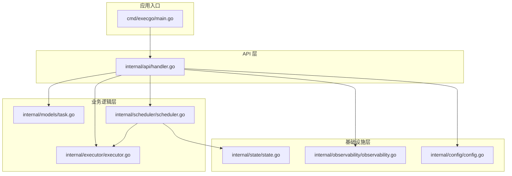

**图表来源**
- [main.go:1-105](file://cmd/execgo/main.go#L1-L105)
- [handler.go:1-157](file://internal/api/handler.go#L1-L157)
- [task.go:1-149](file://internal/models/task.go#L1-L149)
- [scheduler.go:1-231](file://internal/scheduler/scheduler.go#L1-L231)

**章节来源**
- [main.go:1-105](file://cmd/execgo/main.go#L1-L105)
- [README.md:149-177](file://README.md#L149-L177)

## 核心组件

### TaskGraph 数据结构

TaskGraph 是一次提交的任务 DAG，包含任务列表和验证方法：

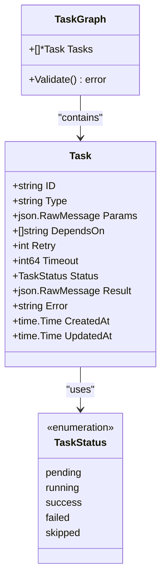

**图表来源**
- [task.go:21-39](file://internal/models/task.go#L21-L39)

### 验证流程

任务图验证采用多阶段检查机制，确保任务图的完整性和有效性：

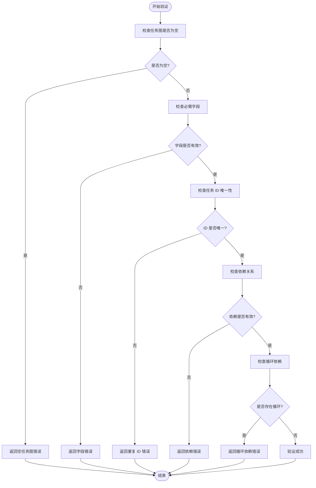

**图表来源**
- [task.go:41-79](file://internal/models/task.go#L41-L79)

**章节来源**
- [task.go:21-79](file://internal/models/task.go#L21-L79)

## 架构概览

ExecGo 的验证机制在整个系统架构中的位置如下：

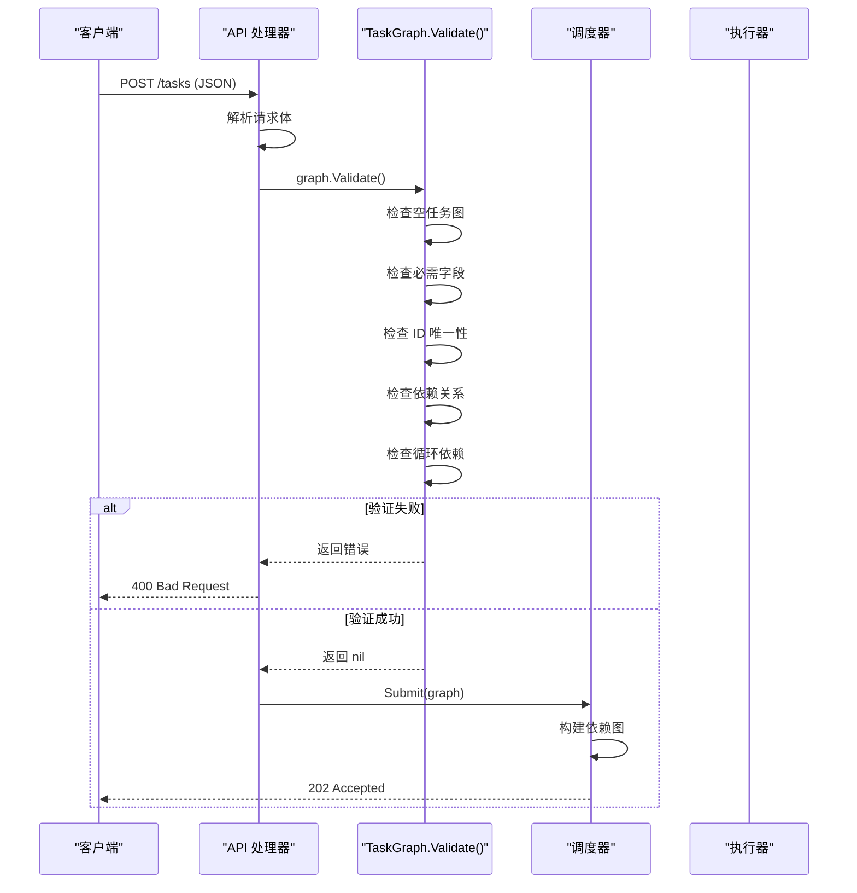

**图表来源**
- [handler.go:58-99](file://internal/api/handler.go#L58-L99)
- [task.go:41-79](file://internal/models/task.go#L41-L79)

## 详细组件分析

### TaskGraph.Validate() 方法实现

TaskGraph.Validate() 方法实现了完整的任务图验证逻辑，采用分阶段验证策略：

#### 1. 空任务图检查

验证过程首先检查任务图是否为空，这是最基本的验证步骤：

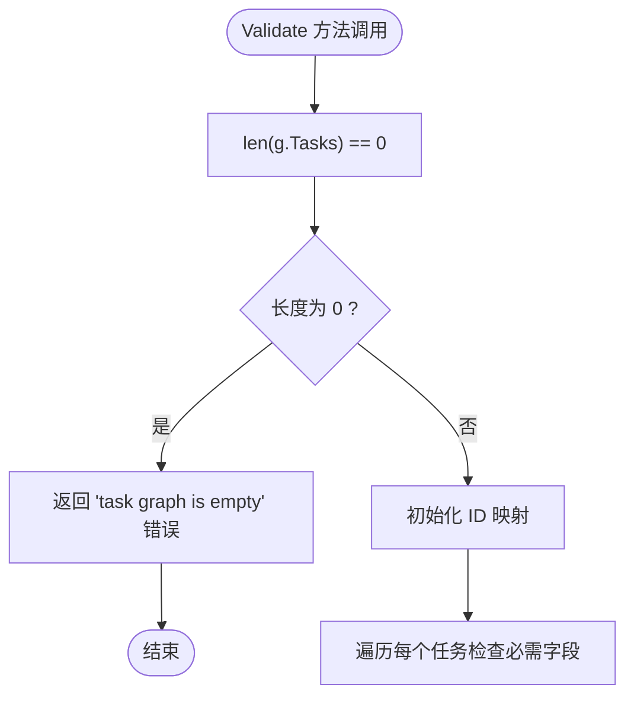

**图表来源**
- [task.go:42-59](file://internal/models/task.go#L42-L59)

#### 2. 必需字段完整性检查

对于每个任务，验证以下必需字段：
- `ID`: 任务唯一标识符
- `Type`: 任务类型，必须是非空字符串

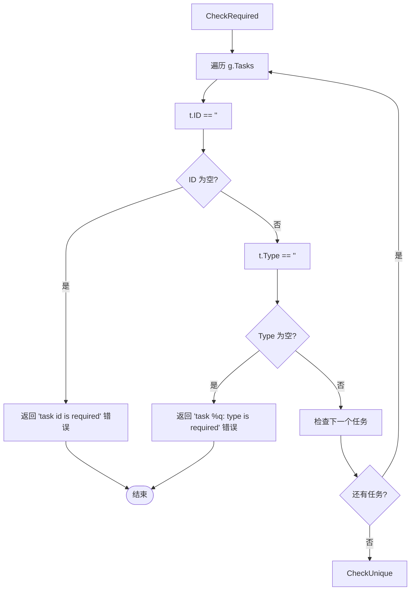

**图表来源**
- [task.go:48-58](file://internal/models/task.go#L48-L58)

#### 3. 任务 ID 唯一性验证

使用哈希映射确保每个任务 ID 在任务图中唯一：

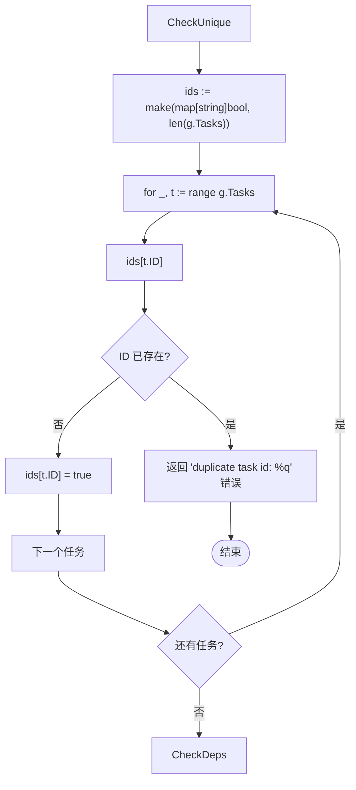

**图表来源**
- [task.go:47-58](file://internal/models/task.go#L47-L58)

#### 4. 依赖关系验证

依赖关系验证包含两个关键检查：未知依赖引用检测和自依赖检测。

##### 4.1 未知依赖引用检测

检查每个任务的 `DependsOn` 数组，确保所有依赖任务 ID 都存在于任务图中：

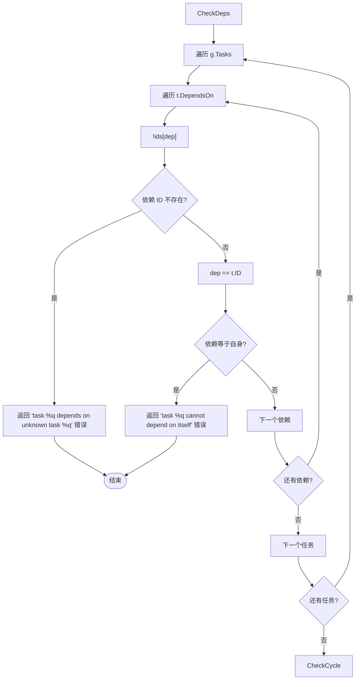

**图表来源**
- [task.go:62-71](file://internal/models/task.go#L62-L71)

##### 4.2 自依赖检测

防止任务直接或间接依赖自身，这会导致循环依赖问题。

#### 5. 循环依赖检测算法

使用 Kahn 算法进行拓扑排序检测，确保任务图没有循环依赖：

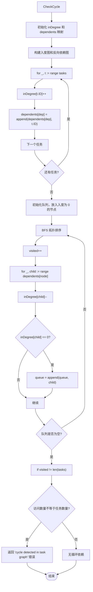

**图表来源**
- [task.go:81-121](file://internal/models/task.go#L81-L121)

**章节来源**
- [task.go:41-121](file://internal/models/task.go#L41-L121)

### API 层集成

API 处理器在接收到任务提交请求后，会调用 TaskGraph.Validate() 方法进行验证：

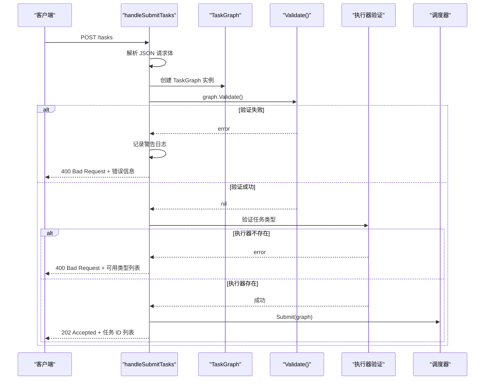

**图表来源**
- [handler.go:58-99](file://internal/api/handler.go#L58-L99)

**章节来源**
- [handler.go:58-99](file://internal/api/handler.go#L58-L99)

### 调度器集成

调度器在接收验证通过的任务图后，会构建内部的数据结构来支持并发执行：

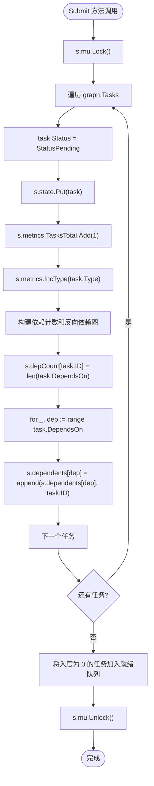

**图表来源**
- [scheduler.go:69-97](file://internal/scheduler/scheduler.go#L69-L97)

**章节来源**
- [scheduler.go:69-97](file://internal/scheduler/scheduler.go#L69-L97)

## 依赖关系分析

### 组件耦合度分析

ExecGo 的验证机制展现了良好的模块化设计：

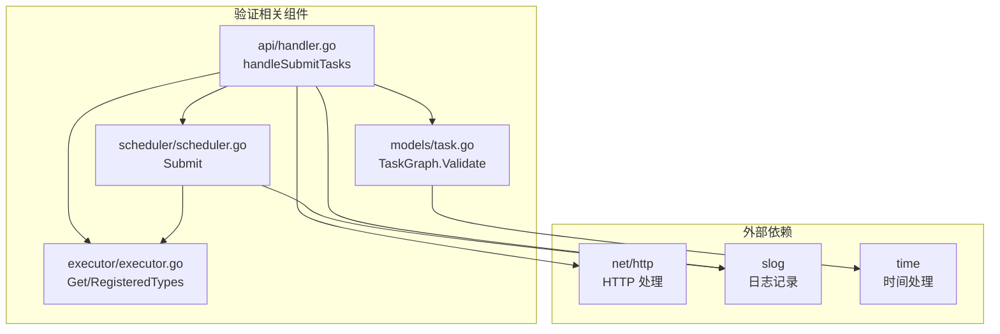

**图表来源**
- [task.go:1-149](file://internal/models/task.go#L1-L149)
- [handler.go:1-157](file://internal/api/handler.go#L1-L157)
- [scheduler.go:1-231](file://internal/scheduler/scheduler.go#L1-L231)
- [executor.go:1-68](file://internal/executor/executor.go#L1-L68)

### 错误处理策略

验证机制采用了统一的错误处理策略：

| 验证阶段 | 错误类型 | HTTP 状态码 | 错误消息格式 |
|---------|---------|------------|-------------|
| 空任务图检查 | EmptyGraphError | 400 | "task graph is empty" |
| 必需字段检查 | RequiredFieldError | 400 | "task id is required" 或 "task %q: type is required" |
| ID 唯一性检查 | DuplicateIDError | 400 | "duplicate task id: %q" |
| 依赖引用检查 | UnknownDepError | 400 | "task %q depends on unknown task %q" |
| 自依赖检查 | SelfDepError | 400 | "task %q cannot depend on itself" |
| 循环依赖检查 | CycleError | 400 | "cycle detected in task graph" |
| 执行器类型检查 | UnknownTypeError | 400 | "unknown task type: %q (available: %s)" |

**章节来源**
- [task.go:42-79](file://internal/models/task.go#L42-L79)
- [handler.go:70-85](file://internal/api/handler.go#L70-L85)

## 性能考虑

### 时间复杂度分析

- **空任务图检查**: O(1) - 单次数组长度检查
- **必需字段检查**: O(n) - n 为任务数量
- **ID 唯一性检查**: O(n) - 哈希映射插入和查找
- **依赖关系检查**: O(n + d) - n 为任务数量，d 为依赖关系总数
- **循环依赖检测**: O(n + d) - Kahn 算法的标准复杂度

总时间复杂度为 O(n + d)，空间复杂度为 O(n + d)。

### 优化建议

1. **早期短路**: 验证过程采用早期短路策略，一旦发现错误立即返回
2. **内存复用**: 使用预分配的哈希映射减少内存分配开销
3. **单次遍历**: 循环依赖检测与依赖关系检查结合，避免重复遍历

## 故障排除指南

### 常见验证失败场景

#### 1. 空任务图错误
**症状**: 提交空的任务数组
**解决方案**: 确保任务数组至少包含一个任务

#### 2. 缺少必需字段
**症状**: 任务缺少 `id` 或 `type` 字段
**解决方案**: 为每个任务提供唯一且非空的 `id` 和有效的 `type`

#### 3. 重复任务 ID
**症状**: 多个任务使用相同的 `id`
**解决方案**: 确保每个任务的 `id` 在整个任务图中唯一

#### 4. 未知依赖引用
**症状**: 任务依赖不存在的任务 ID
**解决方案**: 确保所有依赖的任务 ID 都存在于任务图中

#### 5. 自依赖问题
**症状**: 任务直接依赖自身
**解决方案**: 移除自依赖关系

#### 6. 循环依赖
**症状**: 任务之间形成循环依赖链
**解决方案**: 重新设计任务依赖关系，打破循环

### 调试技巧

1. **启用详细日志**: 查看 API 层的日志输出了解验证失败的具体原因
2. **逐步验证**: 先验证基本字段，再检查依赖关系
3. **使用健康检查**: 通过 `/health` 端点确认服务正常运行

**章节来源**
- [handler.go:69-74](file://internal/api/handler.go#L69-L74)
- [task.go:42-79](file://internal/models/task.go#L42-L79)

## 结论

ExecGo 的任务图验证机制通过多层次、渐进式的验证策略，确保了任务图的完整性和有效性。该机制具有以下特点：

1. **全面性**: 覆盖了从基础字段验证到高级依赖关系分析的所有必要检查
2. **高效性**: 采用优化的算法和数据结构，确保验证过程快速执行
3. **可维护性**: 清晰的模块化设计和统一的错误处理策略
4. **用户友好**: 提供详细的错误信息，帮助开发者快速定位和解决问题

通过 TaskGraph.Validate() 方法，ExecGo 为 AI Agent 提供了一个可靠的任务执行基础，确保复杂的工作流能够在保证正确性的前提下高效执行。