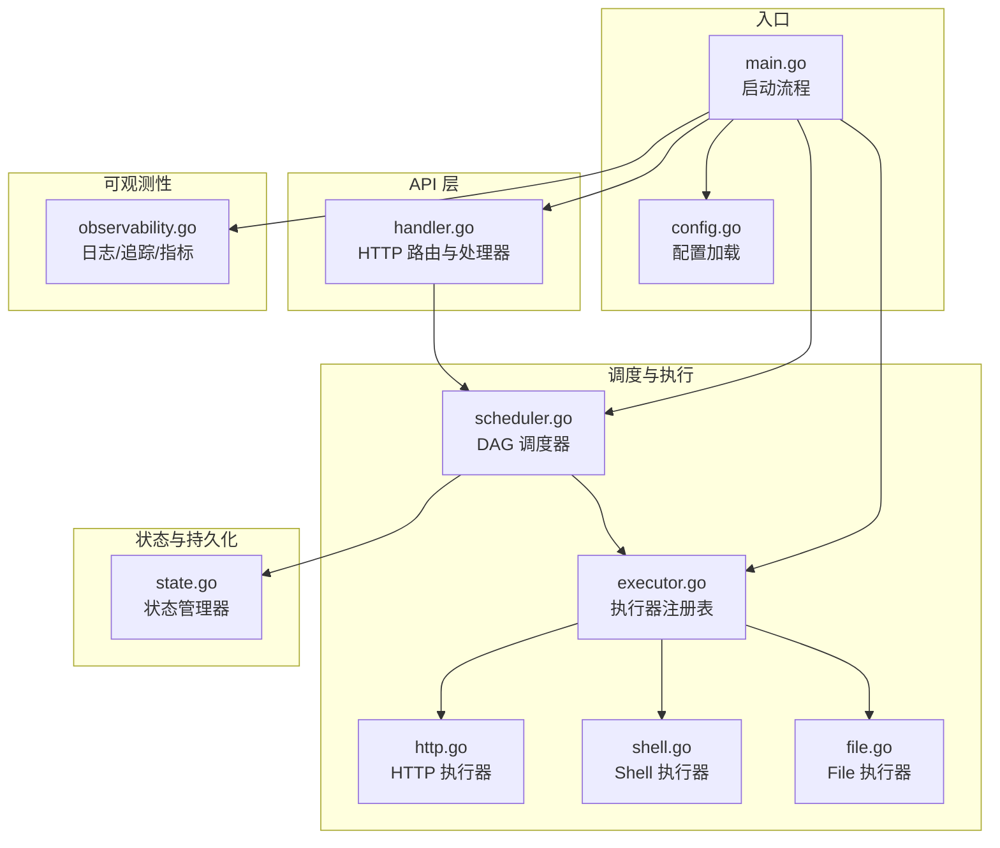
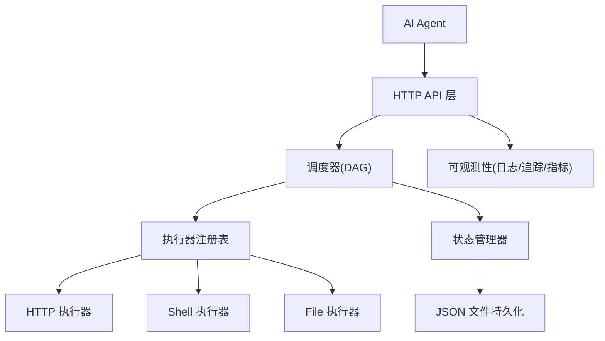
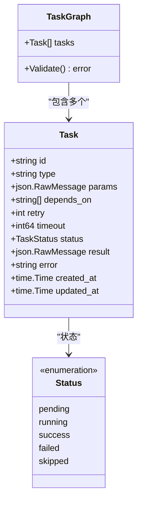
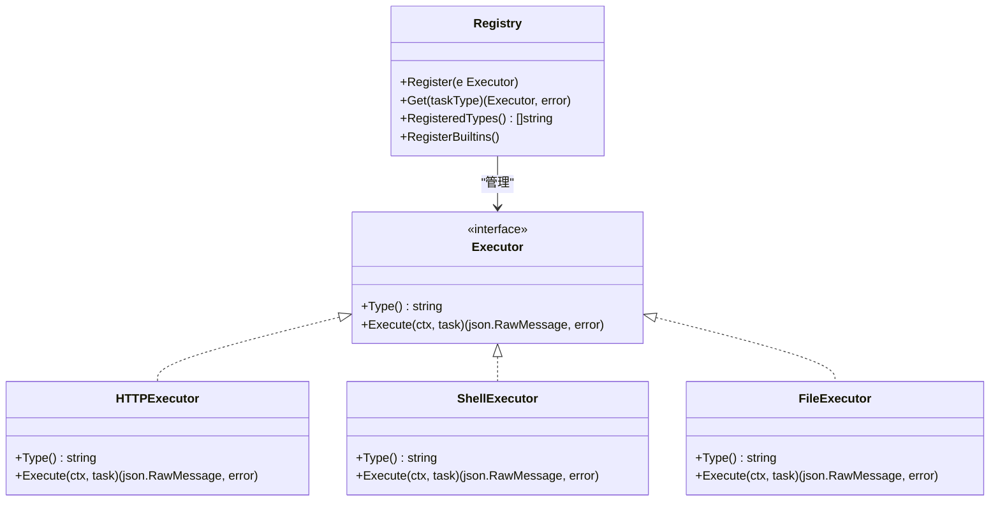
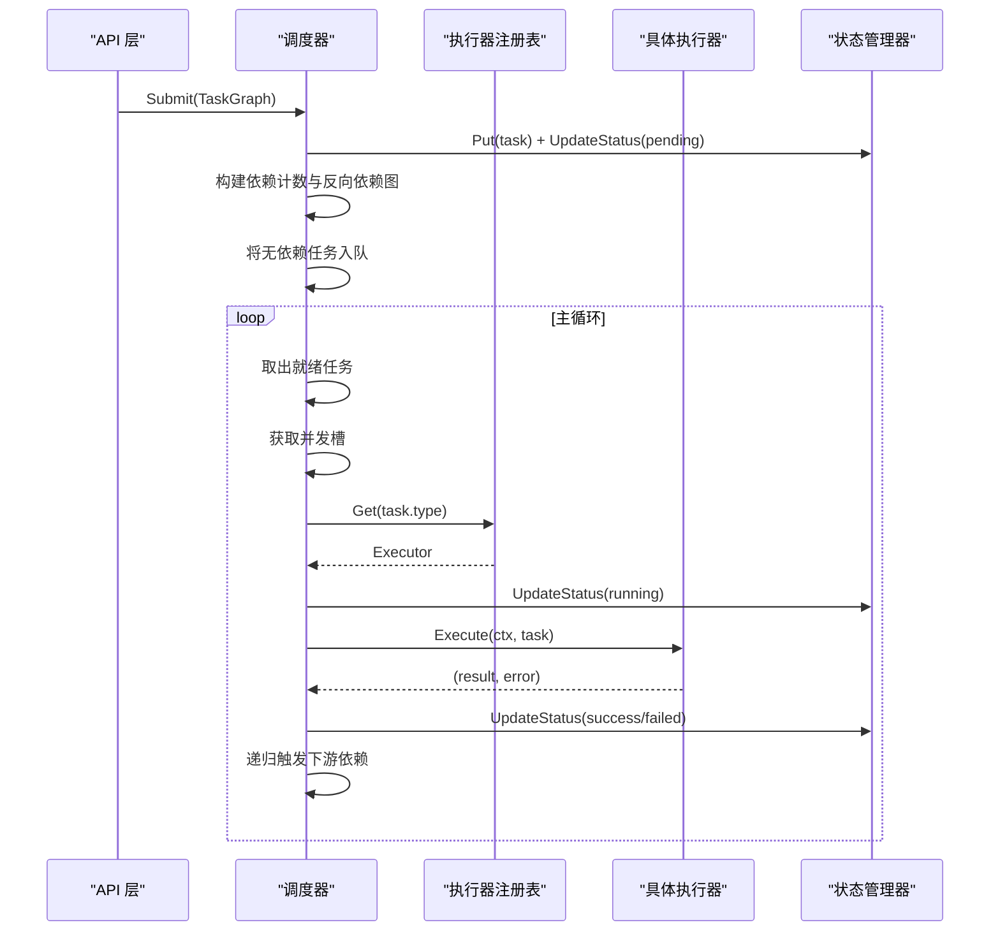
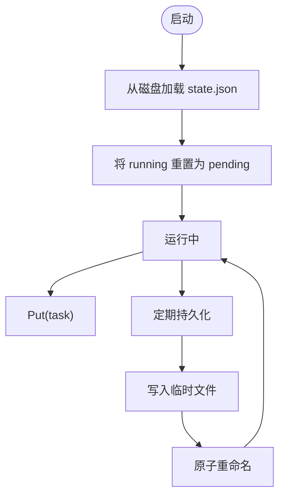
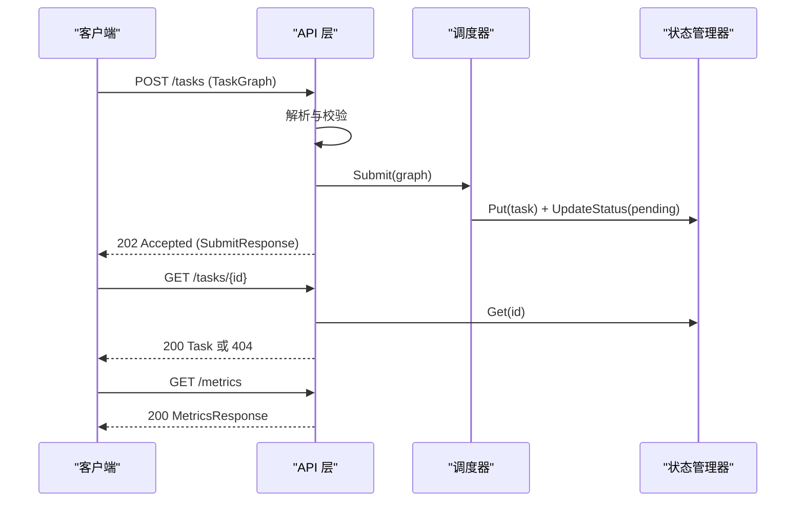
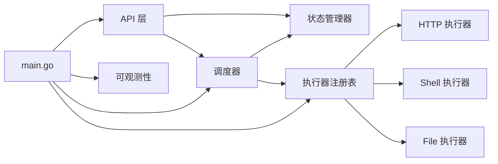

# 任务定义示例

<cite>
**本文档引用的文件**
- [main.go](file://cmd/execgo/main.go)
- [config.go](file://internal/config/config.go)
- [handler.go](file://internal/api/handler.go)
- [task.go](file://internal/models/task.go)
- [executor.go](file://internal/executor/executor.go)
- [http.go](file://internal/executor/http.go)
- [shell.go](file://internal/executor/shell.go)
- [file.go](file://internal/executor/file.go)
- [scheduler.go](file://internal/scheduler/scheduler.go)
- [state.go](file://internal/state/state.go)
- [observability.go](file://internal/observability/observability.go)
- [state.json](file://data/state.json)
- [README.md](file://README.md)
</cite>

## 目录
1. [简介](#简介)
2. [项目结构](#项目结构)
3. [核心组件](#核心组件)
4. [架构总览](#架构总览)
5. [详细组件分析](#详细组件分析)
6. [依赖关系分析](#依赖关系分析)
7. [性能考量](#性能考量)
8. [故障排查指南](#故障排查指南)
9. [结论](#结论)
10. [附录](#附录)

## 简介
本文件面向需要在 ExecGo 上编写任务定义的用户，提供从简单到复杂的任务示例集合，覆盖单任务执行、线性任务序列、并行任务组合、复杂 DAG 工作流等场景。每个示例均给出完整的 JSON 定义、预期行为说明以及执行结果预测，并结合内置执行器类型（HTTP、Shell、File）展示实际应用场景与最佳实践。

ExecGo 采用纯 Go 标准库实现，提供零依赖的极简执行内核，支持：
- 任务 DSL：id、type、params、depends_on、retry、timeout、status
- DAG 调度：基于 Kahn 算法的拓扑排序与环检测
- 并发执行：goroutine + channel + 信号量控制
- 可插拔执行器：HTTP/Shell/File 内置执行器，注册表机制便于扩展
- 重试与超时：指数退避重试 + context 超时控制
- 状态持久化：内存存储 + JSON 文件定期持久化
- 可观测性：结构化 JSON 日志 + traceID + /metrics 端点
- 优雅关闭：信号监听 → HTTP 关闭 → 调度器停止 → 状态持久化

## 项目结构
ExecGo 的核心模块按职责分层组织，入口程序负责初始化配置、注册执行器、启动调度器与 HTTP 服务；API 层负责任务提交与查询；调度器负责 DAG 编排与并发执行；状态管理器负责内存与磁盘持久化；可观测性模块提供日志、追踪与指标。

图表来源
- [main.go:25-104](file://cmd/execgo/main.go#L25-L104)
- [config.go:18-30](file://internal/config/config.go#L18-L30)
- [handler.go:39-52](file://internal/api/handler.go#L39-L52)
- [scheduler.go:34-45](file://internal/scheduler/scheduler.go#L34-L45)
- [executor.go:31-67](file://internal/executor/executor.go#L31-L67)
- [http.go:22-75](file://internal/executor/http.go#L22-L75)
- [shell.go:31-79](file://internal/executor/shell.go#L31-L79)
- [file.go:20-113](file://internal/executor/file.go#L20-L113)
- [state.go:17-53](file://internal/state/state.go#L17-L53)
- [observability.go:50-80](file://internal/observability/observability.go#L50-L80)

章节来源
- [main.go:25-104](file://cmd/execgo/main.go#L25-L104)
- [README.md:149-177](file://README.md#L149-L177)

## 核心组件
- 任务模型与验证：Task/TaskGraph、状态枚举、拓扑排序环检测
- 执行器接口与注册表：统一接口 + 全局注册表 + 内置执行器
- 调度器：就绪队列 + 并发信号量 + 依赖计数 + 反向依赖图
- 状态管理：内存 map + RWMutex + JSON 文件持久化
- API 层：任务提交/查询/删除/健康检查/指标端点
- 可观测性：结构化日志、traceID、指标收集

章节来源
- [task.go:10-79](file://internal/models/task.go#L10-L79)
- [executor.go:14-67](file://internal/executor/executor.go#L14-L67)
- [scheduler.go:18-32](file://internal/scheduler/scheduler.go#L18-L32)
- [state.go:17-53](file://internal/state/state.go#L17-L53)
- [handler.go:19-52](file://internal/api/handler.go#L19-L52)
- [observability.go:86-133](file://internal/observability/observability.go#L86-L133)

## 架构总览
ExecGo 的整体架构遵循“API → 调度器 → 执行器 → 状态”的分层设计，配合可观测性与持久化，形成闭环的执行内核。

图表来源
- [README.md:32-57](file://README.md#L32-L57)
- [handler.go:39-52](file://internal/api/handler.go#L39-L52)
- [scheduler.go:18-32](file://internal/scheduler/scheduler.go#L18-L32)
- [executor.go:31-67](file://internal/executor/executor.go#L31-L67)
- [state.go:110-134](file://internal/state/state.go#L110-L134)
- [observability.go:50-80](file://internal/observability/observability.go#L50-L80)

## 详细组件分析

### 任务模型与验证
- 任务字段：id、type、params、depends_on、retry、timeout、status、result、error、createdAt、updatedAt
- 任务图验证：非空校验、重复 id、未知依赖、自依赖、环检测（Kahn 算法）
- 状态流转：pending → running → success/failed/skipped

图表来源
- [task.go:22-34](file://internal/models/task.go#L22-L34)
- [task.go:37-39](file://internal/models/task.go#L37-L39)
- [task.go:10-19](file://internal/models/task.go#L10-L19)

章节来源
- [task.go:41-79](file://internal/models/task.go#L41-L79)

### 执行器接口与注册表
- 接口：Type()、Execute(ctx, task)
- 注册表：Register(Get/RegisteredTypes/RegisterBuiltins)
- 内置执行器：HTTP、Shell、File

图表来源
- [executor.go:14-20](file://internal/executor/executor.go#L14-L20)
- [executor.go:31-67](file://internal/executor/executor.go#L31-L67)
- [http.go:22-75](file://internal/executor/http.go#L22-L75)
- [shell.go:31-79](file://internal/executor/shell.go#L31-L79)
- [file.go:20-113](file://internal/executor/file.go#L20-L113)

章节来源
- [executor.go:14-67](file://internal/executor/executor.go#L14-L67)

### 调度器：DAG 与并发控制
- 初始化：就绪队列、并发信号量、依赖计数、反向依赖图
- 提交流程：设置状态、记录时间、构建依赖图、入队无依赖任务
- 执行流程：获取执行器、标记 running、重试（指数退避）、context 超时、完成回调
- 完成流程：成功/失败计数、级联触发下游、依赖失败则跳过

图表来源
- [scheduler.go:69-97](file://internal/scheduler/scheduler.go#L69-L97)
- [scheduler.go:109-125](file://internal/scheduler/scheduler.go#L109-L125)
- [scheduler.go:127-190](file://internal/scheduler/scheduler.go#L127-L190)
- [scheduler.go:192-230](file://internal/scheduler/scheduler.go#L192-L230)

章节来源
- [scheduler.go:18-32](file://internal/scheduler/scheduler.go#L18-L32)

### 状态管理与持久化
- 内存存储：map[string]*Task + RWMutex
- 持久化：JSON 文件，先写 tmp 再原子重命名
- 恢复策略：崩溃后将 running 状态重置为 pending

图表来源
- [state.go:25-53](file://internal/state/state.go#L25-L53)
- [state.go:110-134](file://internal/state/state.go#L110-L134)
- [state.go:136-158](file://internal/state/state.go#L136-L158)
- [state.go:160-179](file://internal/state/state.go#L160-L179)

章节来源
- [state.go:94-108](file://internal/state/state.go#L94-L108)

### API 层：任务提交与查询
- 路由：POST /tasks、GET /tasks/{id}、GET /tasks、DELETE /tasks/{id}、GET /health、GET /metrics
- 校验：JSON 解码、TaskGraph.Validate、执行器存在性检查
- 响应：SubmitResponse、Task、错误响应、健康检查、指标快照

图表来源
- [handler.go:58-99](file://internal/api/handler.go#L58-L99)
- [handler.go:101-116](file://internal/api/handler.go#L101-L116)
- [handler.go:137-146](file://internal/api/handler.go#L137-L146)

章节来源
- [handler.go:39-52](file://internal/api/handler.go#L39-L52)

## 依赖关系分析
- 组件耦合：API 层依赖调度器与状态管理器；调度器依赖执行器注册表与状态管理器；执行器注册表管理具体执行器；状态管理器独立于调度器；可观测性模块被多处使用。
- 外部依赖：纯标准库，零第三方依赖。
- 循环依赖：未发现循环依赖。

图表来源
- [handler.go:19-37](file://internal/api/handler.go#L19-L37)
- [scheduler.go:18-32](file://internal/scheduler/scheduler.go#L18-L32)
- [executor.go:31-67](file://internal/executor/executor.go#L31-L67)
- [main.go:17-23](file://cmd/execgo/main.go#L17-L23)

章节来源
- [main.go:17-23](file://cmd/execgo/main.go#L17-L23)

## 性能考量
- 并发控制：通过信号量限制最大并发，避免资源争用与系统过载。
- 就绪队列：使用带缓冲通道承载就绪任务，减少阻塞。
- 重试策略：指数退避（上限 10 秒），降低对上游系统的冲击。
- 超时控制：为每个任务构建带超时的 context，防止长时间阻塞。
- 持久化：定期持久化（默认 30 秒），保证崩溃恢复与数据安全。
- 指标监控：提供任务总数、运行中、成功、失败与按类型统计，便于容量规划与问题定位。

章节来源
- [scheduler.go:40-44](file://internal/scheduler/scheduler.go#L40-L44)
- [scheduler.go:152-180](file://internal/scheduler/scheduler.go#L152-L180)
- [scheduler.go:164-173](file://internal/scheduler/scheduler.go#L164-L173)
- [state.go:160-179](file://internal/state/state.go#L160-L179)
- [observability.go:86-133](file://internal/observability/observability.go#L86-L133)

## 故障排查指南
- 任务提交失败
  - JSON 格式错误：检查请求体是否为合法 JSON。
  - 任务图校验失败：确认 id、type、依赖引用、自依赖、环依赖。
  - 未知任务类型：确认执行器已注册且类型拼写正确。
- 任务执行异常
  - HTTP 执行器：检查 URL、方法、超时；关注 4xx/5xx 状态码但会返回结果。
  - Shell 执行器：检查命令是否在白名单中，工作目录是否存在。
  - File 执行器：检查路径是否有效，避免目录穿越。
- 任务状态异常
  - running 状态：系统恢复时会被重置为 pending。
  - failed/skipped：查看 error 字段与依赖链路。
- 指标与日志
  - 使用 /metrics 查看任务统计；通过 X-Trace-ID 进行请求追踪。

章节来源
- [handler.go:63-99](file://internal/api/handler.go#L63-L99)
- [http.go:27-75](file://internal/executor/http.go#L27-L75)
- [shell.go:36-79](file://internal/executor/shell.go#L36-L79)
- [file.go:25-113](file://internal/executor/file.go#L25-L113)
- [state.go:41-50](file://internal/state/state.go#L41-L50)
- [observability.go:69-80](file://internal/observability/observability.go#L69-L80)

## 结论
ExecGo 提供了简洁而强大的任务执行内核，通过清晰的 DSL 与 DAG 调度，能够覆盖从简单单任务到复杂并行/串行混合的工作流。内置执行器满足常见的 HTTP API 调用、Shell 命令执行、文件处理等场景，同时具备可观测性与持久化能力，适合在生产环境中稳定运行。

## 附录

### 任务定义示例集合

以下示例均以 JSON 形式给出，包含任务 id、type、params、depends_on、retry、timeout 等字段，并说明预期行为与执行结果预测。请根据实际环境调整参数（如 URL、命令、文件路径）。

- 单个任务执行（Shell）
  - 示例定义
    - id: "check-host"
    - type: "shell"
    - params: {"command": "hostname"}
    - retry: 2
    - timeout: 5000
  - 预期行为
    - 成功：输出主机名，状态 success，result 包含 stdout、stderr、exit_code。
    - 失败：命令不存在或权限不足，状态 failed，error 描述原因。
  - 执行结果预测
    - 若命令可用：success，exit_code 为 0，stdout 包含主机名。
    - 若命令不可用：failed，error 包含“command failed”及底层错误信息。

- 线性任务序列（HTTP → File → Shell）
  - 示例定义
    - fetch-data: type="http", params={"url": "https://httpbin.org/json", "method": "GET"}, timeout=10000
    - save-result: type="file", params={"action": "write", "path": "output.txt", "content": "fetched!"}, depends_on=["fetch-data"]
    - verify: type="file", params={"action": "read", "path": "output.txt"}, depends_on=["save-result"]
  - 预期行为
    - fetch-data 成功后触发 save-result；save-result 成功后触发 verify。
    - verify 读取文件内容并返回 content 与 size。
  - 执行结果预测
    - fetch-data：success，result 包含 status_code 与 body。
    - save-result：success，result 包含 bytes_written。
    - verify：success，result 包含 content 与 size。

- 并行任务组合（同源汇聚）
  - 示例定义
    - fetch-a: type="http", params={"url": "https://httpbin.org/get?q=a", "method": "GET"}, timeout=10000
    - fetch-b: type="http", params={"url": "https://httpbin.org/get?q=b", "method": "GET"}, timeout=10000
    - merge: type="file", params={"action": "write", "path": "merged.txt", "content": "a+b"}, depends_on=["fetch-a","fetch-b"]
  - 预期行为
    - fetch-a 与 fetch-b 并行执行，完成后合并。
  - 执行结果预测
    - fetch-a、fetch-b：success，result 包含 status_code 与 body。
    - merge：success，result 包含 bytes_written。

- 复杂 DAG 工作流（分支与汇聚）
  - 示例定义
    - ingest: type="http", params={"url": "https://httpbin.org/json", "method": "GET"}, timeout=10000
    - parse: type="shell", params={"command": "jq", "args": [".data"]}, depends_on=["ingest"]
    - validate: type="shell", params={"command": "jq", "args": [".valid"]}, depends_on=["ingest"]
    - transform: type="file", params={"action": "write", "path": "transformed.json", "content": "transformed"}, depends_on=["parse","validate"]
    - report: type="file", params={"action": "write", "path": "report.txt", "content": "done"}, depends_on=["transform"]
  - 预期行为
    - ingest 并发触发 parse 与 validate；两者完成后触发 transform；transform 完成后触发 report。
  - 执行结果预测
    - ingest：success，result 包含 status_code 与 body。
    - parse/validate：若 jq 可用则 success，否则 failed。
    - transform/report：success，分别返回 bytes_written。

- 带重试与超时的任务
  - 示例定义
    - unstable-api: type="http", params={"url": "https://httpbin.org/delay/2", "method": "GET"}, retry=3, timeout=3000
  - 预期行为
    - 超时前重试 3 次（指数退避），若仍失败则标记 failed。
  - 执行结果预测
    - 成功：success，result 包含 status_code 与 body。
    - 失败：failed，error 包含“task failed after all retries”。

- 文件处理任务
  - 示例定义
    - create: type="file", params={"action": "write", "path": "data/in.txt", "content": "hello world"}
    - append: type="file", params={"action": "append", "path": "data/in.txt", "content": " appended"}
    - stat: type="file", params={"action": "stat", "path": "data/in.txt"}, depends_on=["create","append"]
    - read: type="file", params={"action": "read", "path": "data/in.txt"}, depends_on=["stat"]
    - delete: type="file", params={"action": "delete", "path": "data/in.txt"}, depends_on=["read"]
  - 预期行为
    - 依次创建、追加、统计、读取、删除。
  - 执行结果预测
    - create/append：success，result 包含 bytes_written。
    - stat：success，result 包含 name、size、mode、mod_time、is_dir。
    - read：success，result 包含 content 与 size。
    - delete：success，result 包含 deleted=true。

- Shell 命令白名单与安全
  - 示例定义
    - echo-test: type="shell", params={"command": "echo", "args": ["hello"]}
    - hostname-test: type="shell", params={"command": "hostname"}
  - 预期行为
    - 白名单命令可执行；非白名单命令将被拒绝。
  - 执行结果预测
    - echo-test：success，result 包含 stdout、stderr、exit_code。
    - hostname-test：success，result 包含 stdout、stderr、exit_code。
    - 若使用非白名单命令：failed，error 包含“not in the allowed whitelist”。

- HTTP 执行器参数与错误处理
  - 示例定义
    - get-ok: type="http", params={"url": "https://httpbin.org/get", "method": "GET"}
    - post-json: type="http", params={"url": "https://httpbin.org/post", "method": "POST", "headers": {"Content-Type": "application/json"}, "body": "{\"key\":\"value\"}"}
    - bad-url: type="http", params={"url": "https://httpbin.org/status/500", "method": "GET"}
  - 预期行为
    - 2xx 成功，返回 status_code 与 body。
    - 4xx/5xx 仍返回结果，但标记为失败。
  - 执行结果预测
    - get-ok：success，result 包含 status_code 与 body。
    - post-json：success，result 包含 status_code 与 body。
    - bad-url：success（返回结果），但状态为 failed，error 包含底层网络错误或状态码描述。

### 最佳实践与性能优化建议
- 任务设计
  - 明确依赖关系，避免环依赖；合理拆分任务粒度，提升并行度。
  - 为易失败任务设置 retry（建议不超过 3 次），并配置合理的 timeout。
- 执行器选择
  - HTTP：使用 headers/body 传递必要信息；对大响应体注意内存限制。
  - Shell：严格使用白名单命令，避免危险操作；必要时指定工作目录。
  - File：使用相对路径或受控目录，避免目录穿越；批量写入时考虑 append 模式。
- 并发与资源
  - 根据系统资源设置 MaxConcurrency；观察 /metrics 调整并发。
  - 对外部依赖进行限流与熔断，避免雪崩效应。
- 可观测性
  - 为关键任务设置 traceID，结合日志与指标快速定位问题。
  - 定期检查 state.json 与持久化间隔，确保数据安全。
- 安全与合规
  - Shell 执行器严格限制命令集；HTTP 执行器避免泄露敏感头信息。
  - File 执行器对路径进行清理与校验，防止越权访问。

章节来源
- [README.md:79-145](file://README.md#L79-L145)
- [README.md:181-213](file://README.md#L181-L213)
- [README.md:229-249](file://README.md#L229-L249)
- [state.json:1-76](file://data/state.json#L1-L76)