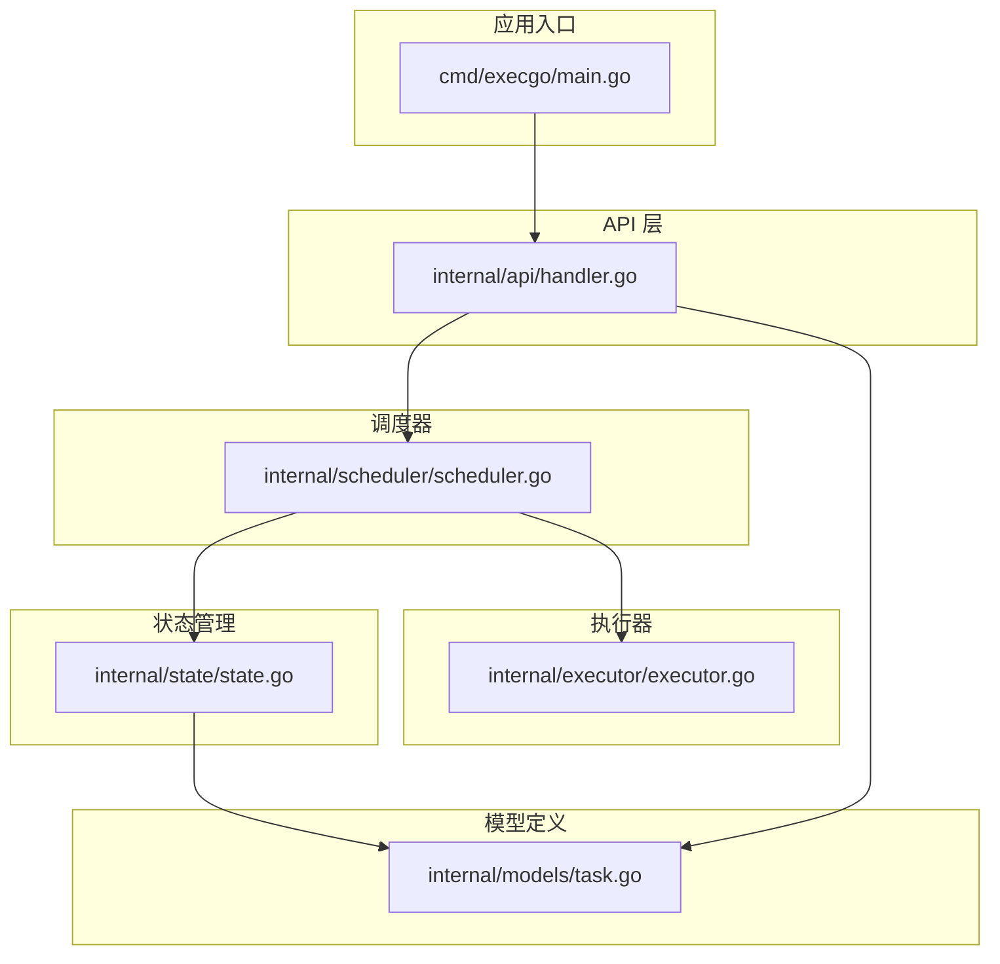
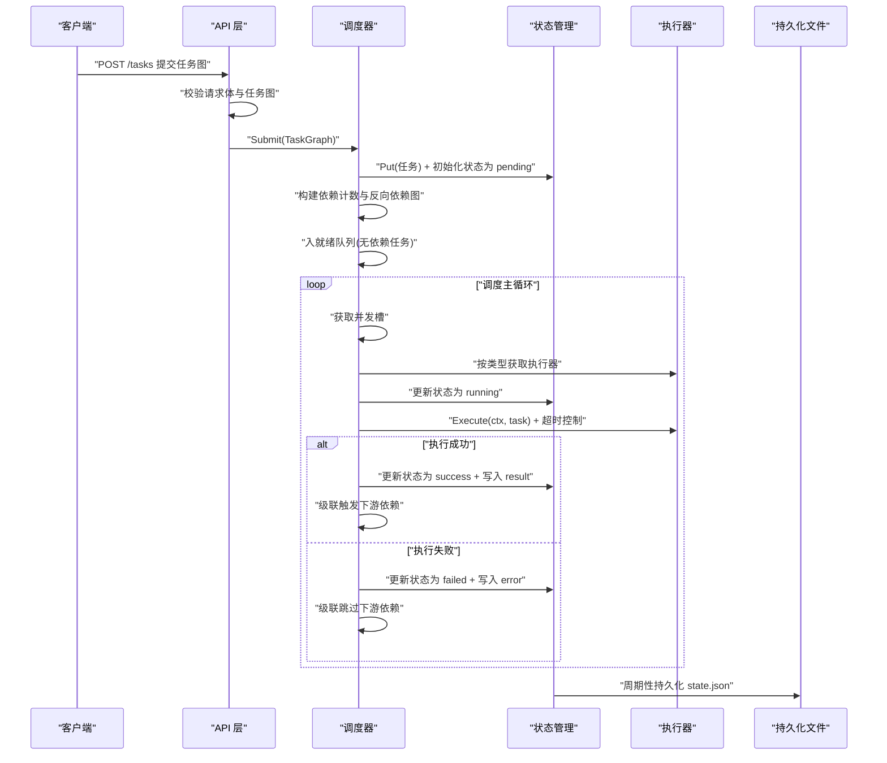
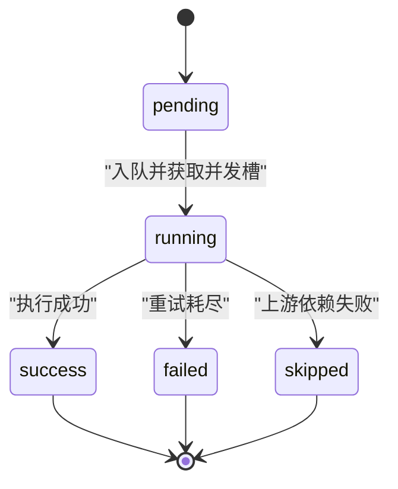
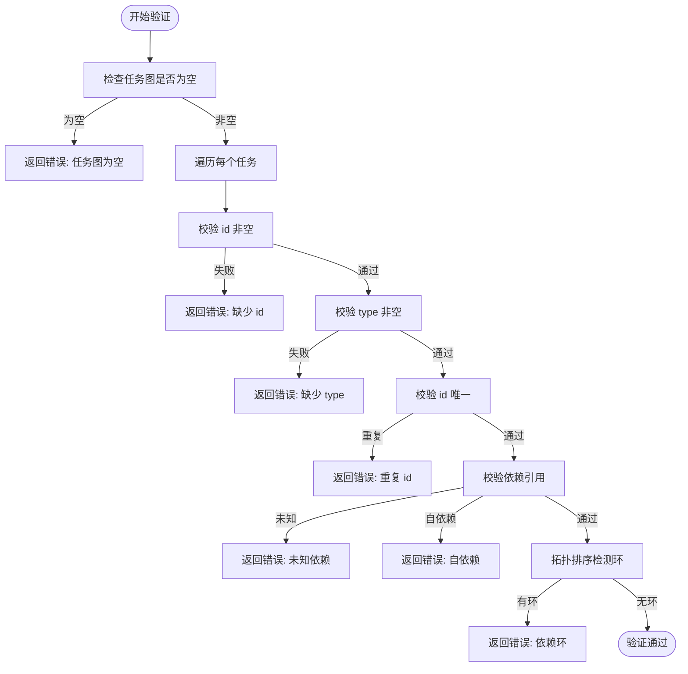
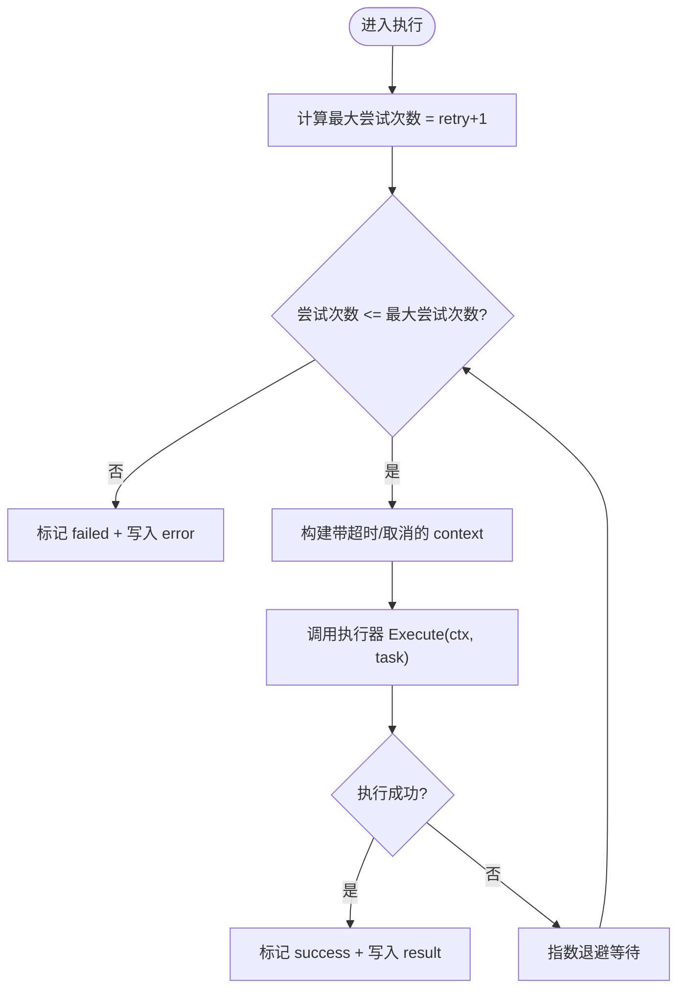
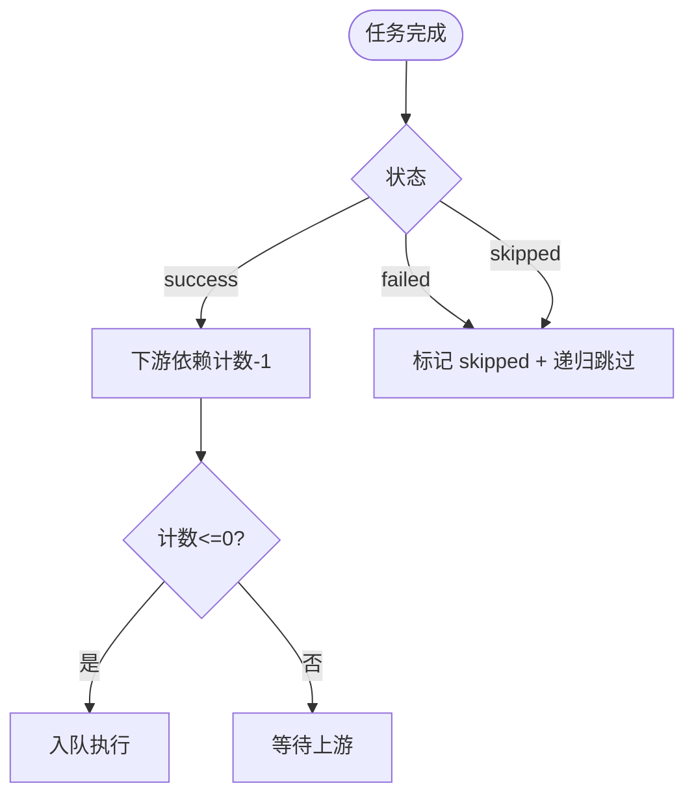
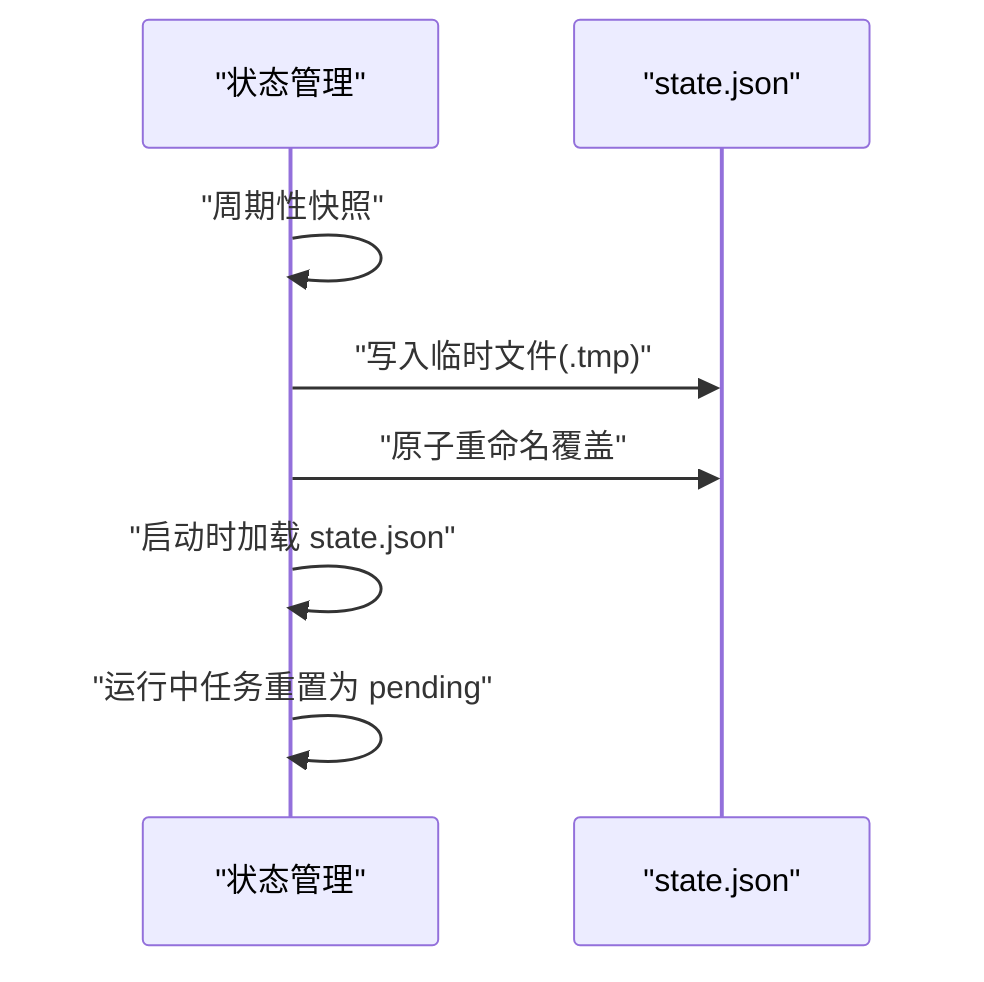
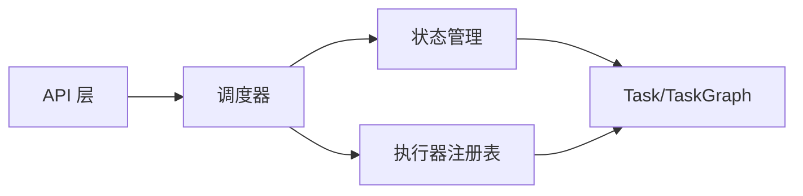

# 任务模型定义

<cite>
**本文档引用的文件**
- [internal/models/task.go](file://internal/models/task.go)
- [internal/scheduler/scheduler.go](file://internal/scheduler/scheduler.go)
- [internal/state/state.go](file://internal/state/state.go)
- [internal/api/handler.go](file://internal/api/handler.go)
- [internal/executor/executor.go](file://internal/executor/executor.go)
- [cmd/execgo/main.go](file://cmd/execgo/main.go)
- [README.md](file://README.md)
</cite>

## 目录
1. [简介](#简介)
2. [项目结构](#项目结构)
3. [核心组件](#核心组件)
4. [架构总览](#架构总览)
5. [详细组件分析](#详细组件分析)
6. [依赖关系分析](#依赖关系分析)
7. [性能考量](#性能考量)
8. [故障排查指南](#故障排查指南)
9. [结论](#结论)
10. [附录](#附录)

## 简介
本文件系统性地定义 ExecGo 的任务模型，聚焦 Task 结构体及其相关类型，明确每个字段的语义、约束与生命周期，并给出字段验证规则、状态转换与重试/超时策略。目标是帮助开发者在不深入源码的情况下，也能准确理解并正确使用 ExecGo 的任务 DSL。

## 项目结构
ExecGo 的任务模型位于 internal/models/task.go，围绕该模型展开的调度、状态持久化、API 层与执行器分别位于 internal/scheduler、internal/state、internal/api 与 internal/executor。入口程序 cmd/execgo/main.go 负责初始化组件并启动服务。

图表来源
- [cmd/execgo/main.go:25-104](file://cmd/execgo/main.go#L25-L104)
- [internal/api/handler.go:28-52](file://internal/api/handler.go#L28-L52)
- [internal/scheduler/scheduler.go:18-45](file://internal/scheduler/scheduler.go#L18-L45)
- [internal/state/state.go:17-53](file://internal/state/state.go#L17-L53)
- [internal/models/task.go:21-39](file://internal/models/task.go#L21-L39)
- [internal/executor/executor.go:14-67](file://internal/executor/executor.go#L14-L67)

章节来源
- [cmd/execgo/main.go:25-104](file://cmd/execgo/main.go#L25-L104)
- [README.md:149-177](file://README.md#L149-L177)

## 核心组件
本节聚焦 Task 结构体与相关类型，逐项解释字段含义、约束与默认行为。

- TaskStatus 枚举
  - pending：初始状态，等待调度
  - running：正在执行
  - success：执行成功
  - failed：执行失败
  - skipped：因上游依赖失败而被跳过

- Task 结构体字段
  - id：字符串，唯一标识符，必填且不可重复
  - type：字符串，任务类型，必填；需与已注册执行器类型一致
  - params：JSON 字节片段，类型相关参数，可选
  - depends_on：字符串数组，上游依赖任务 ID 列表，可选
  - retry：整数，最大重试次数（包含首次），默认 0 即仅尝试一次
  - timeout：整数（毫秒），执行超时时间，<=0 表示无超时
  - status：TaskStatus，任务状态
  - result：JSON 字节片段，执行结果，可选
  - error：字符串，错误信息，可选
  - created_at：时间戳，任务创建时间
  - updated_at：时间戳，最后更新时间

- TaskGraph
  - tasks：Task 数组，表示一次提交的任务 DAG

章节来源
- [internal/models/task.go:10-39](file://internal/models/task.go#L10-L39)
- [internal/models/task.go:41-79](file://internal/models/task.go#L41-L79)

## 架构总览
下图展示任务从提交到执行、状态更新与持久化的整体流程。

图表来源
- [internal/api/handler.go:58-99](file://internal/api/handler.go#L58-L99)
- [internal/scheduler/scheduler.go:69-97](file://internal/scheduler/scheduler.go#L69-L97)
- [internal/scheduler/scheduler.go:127-190](file://internal/scheduler/scheduler.go#L127-L190)
- [internal/scheduler/scheduler.go:192-222](file://internal/scheduler/scheduler.go#L192-L222)
- [internal/state/state.go:110-134](file://internal/state/state.go#L110-L134)

## 详细组件分析

### Task 结构体字段详解与约束
- id
  - 必填：提交时必须非空
  - 唯一：同一任务图内不可重复
  - 用途：状态管理、依赖解析、持久化键
- type
  - 必填：提交时必须非空
  - 约束：必须与已注册执行器类型一致
  - 作用：决定执行器选择
- params
  - 可选：未提供时视为空对象
  - 类型：JSON 字节片段，具体结构由执行器定义
- depends_on
  - 可选：未提供时为空数组
  - 约束：引用的 ID 必须存在于任务图中，且不可自依赖
- retry
  - 可选：默认 0，即仅尝试一次
  - 语义：最大重试次数（包含首次）
- timeout
  - 可选：单位毫秒，<=0 表示无超时
  - 控制：每次尝试均受独立的超时 context 控制
- status
  - 初始值：提交后为 pending
  - 生命周期：pending → running → success 或 failed 或 skipped
- result
  - 可选：仅在成功时写入
- error
  - 可选：仅在失败时写入
- created_at / updated_at
  - 时间戳：创建时与每次状态更新时写入

章节来源
- [internal/models/task.go:21-39](file://internal/models/task.go#L21-L39)
- [internal/scheduler/scheduler.go:76-79](file://internal/scheduler/scheduler.go#L76-L79)
- [internal/state/state.go:94-108](file://internal/state/state.go#L94-L108)

### TaskStatus 状态转换与生命周期
- 初始状态
  - Submit 后，所有任务状态设为 pending，created_at 与 updated_at 初始化
- 运行中
  - 从 pending 入队并获取并发槽后，状态更新为 running
- 成功
  - 执行成功则状态转为 success，写入 result，指标增加
- 失败
  - 所有重试耗尽后仍未成功，状态转为 failed，写入 error，指标增加
- 跳过
  - 上游依赖失败或被级联跳过时，状态转为 skipped，写入提示信息，指标增加
- 恢复
  - 重启后，运行中的任务会被重置为 pending，避免重复执行

图表来源
- [internal/scheduler/scheduler.go:139-142](file://internal/scheduler/scheduler.go#L139-L142)
- [internal/scheduler/scheduler.go:186-189](file://internal/scheduler/scheduler.go#L186-L189)
- [internal/scheduler/scheduler.go:207-211](file://internal/scheduler/scheduler.go#L207-L211)
- [internal/state/state.go:41-50](file://internal/state/state.go#L41-L50)

章节来源
- [internal/scheduler/scheduler.go:139-142](file://internal/scheduler/scheduler.go#L139-L142)
- [internal/scheduler/scheduler.go:186-189](file://internal/scheduler/scheduler.go#L186-L189)
- [internal/scheduler/scheduler.go:207-211](file://internal/scheduler/scheduler.go#L207-L211)
- [internal/state/state.go:41-50](file://internal/state/state.go#L41-L50)

### 字段验证规则与约束
- 任务图不能为空
- 每个任务必须满足：
  - id 非空
  - type 非空
  - id 在任务图内唯一
- 依赖关系：
  - 依赖的 ID 必须存在
  - 不可自依赖
  - 通过拓扑排序检测环（Kahn 算法）
- 执行器类型：
  - 提交前校验所有任务的 type 是否有对应执行器注册

图表来源
- [internal/models/task.go:41-79](file://internal/models/task.go#L41-L79)
- [internal/models/task.go:81-121](file://internal/models/task.go#L81-L121)
- [internal/api/handler.go:76-85](file://internal/api/handler.go#L76-L85)

章节来源
- [internal/models/task.go:41-79](file://internal/models/task.go#L41-L79)
- [internal/models/task.go:81-121](file://internal/models/task.go#L81-L121)
- [internal/api/handler.go:76-85](file://internal/api/handler.go#L76-L85)

### 重试与超时策略
- 重试
  - 最大尝试次数 = retry + 1（至少 1 次）
  - 指数退避：100ms × 2^(attempt-2)，上限 10 秒
- 超时
  - 每次尝试使用独立的 context，超时为 task.timeout 毫秒
  - 若 task.timeout <= 0，则使用取消 context
- 执行器选择
  - 按 task.type 从注册表获取执行器，不存在则直接标记失败

图表来源
- [internal/scheduler/scheduler.go:144-147](file://internal/scheduler/scheduler.go#L144-L147)
- [internal/scheduler/scheduler.go:152-180](file://internal/scheduler/scheduler.go#L152-L180)
- [internal/scheduler/scheduler.go:131-137](file://internal/scheduler/scheduler.go#L131-L137)

章节来源
- [internal/scheduler/scheduler.go:144-147](file://internal/scheduler/scheduler.go#L144-L147)
- [internal/scheduler/scheduler.go:152-180](file://internal/scheduler/scheduler.go#L152-L180)
- [internal/scheduler/scheduler.go:131-137](file://internal/scheduler/scheduler.go#L131-L137)

### 级联依赖处理
- 成功完成
  - 下游依赖的剩余依赖计数减一，归零则入队
- 失败/跳过
  - 标记下游为 skipped，并递归对下游的下游继续跳过
  - 指标相应增加

图表来源
- [internal/scheduler/scheduler.go:192-222](file://internal/scheduler/scheduler.go#L192-L222)
- [internal/scheduler/scheduler.go:224-230](file://internal/scheduler/scheduler.go#L224-L230)

章节来源
- [internal/scheduler/scheduler.go:192-222](file://internal/scheduler/scheduler.go#L192-L222)
- [internal/scheduler/scheduler.go:224-230](file://internal/scheduler/scheduler.go#L224-L230)

### 状态持久化与恢复
- 内存存储
  - 以 map[string]*Task 保存，读写锁保护
- 磁盘持久化
  - 定期将内存快照序列化为 JSON 文件，先写临时文件再原子重命名
- 恢复策略
  - 启动时加载 state.json，若存在则恢复；运行中任务在恢复时重置为 pending

图表来源
- [internal/state/state.go:110-134](file://internal/state/state.go#L110-L134)
- [internal/state/state.go:136-158](file://internal/state/state.go#L136-L158)
- [internal/state/state.go:41-50](file://internal/state/state.go#L41-L50)

章节来源
- [internal/state/state.go:110-134](file://internal/state/state.go#L110-L134)
- [internal/state/state.go:136-158](file://internal/state/state.go#L136-L158)
- [internal/state/state.go:41-50](file://internal/state/state.go#L41-L50)

## 依赖关系分析
- API 层负责接收任务图、进行校验与类型检查，然后提交给调度器
- 调度器负责：
  - 初始化任务状态与时间戳
  - 构建依赖计数与反向依赖图
  - 并发控制与执行
  - 状态更新与级联处理
- 状态管理器负责：
  - 任务存储与查询
  - 原子状态更新
  - 持久化与恢复
- 执行器通过注册表按类型动态选择

图表来源
- [internal/api/handler.go:58-99](file://internal/api/handler.go#L58-L99)
- [internal/scheduler/scheduler.go:69-97](file://internal/scheduler/scheduler.go#L69-L97)
- [internal/state/state.go:55-108](file://internal/state/state.go#L55-L108)
- [internal/executor/executor.go:31-67](file://internal/executor/executor.go#L31-L67)

章节来源
- [internal/api/handler.go:58-99](file://internal/api/handler.go#L58-L99)
- [internal/scheduler/scheduler.go:69-97](file://internal/scheduler/scheduler.go#L69-L97)
- [internal/state/state.go:55-108](file://internal/state/state.go#L55-L108)
- [internal/executor/executor.go:31-67](file://internal/executor/executor.go#L31-L67)

## 性能考量
- 并发控制
  - 使用固定大小的信号量限制最大并发，避免资源争用
- 就绪队列
  - 使用带缓冲通道承载就绪任务，减少阻塞
- 指数退避
  - 降低重试风暴风险，提升系统稳定性
- 持久化策略
  - 定期快照与原子重命名，降低写放大与损坏风险

章节来源
- [internal/scheduler/scheduler.go:18-45](file://internal/scheduler/scheduler.go#L18-L45)
- [internal/scheduler/scheduler.go:152-180](file://internal/scheduler/scheduler.go#L152-L180)
- [internal/state/state.go:160-179](file://internal/state/state.go#L160-L179)

## 故障排查指南
- 提交任务报错“缺少 id”
  - 检查任务图中是否存在空 id，确保每个任务都有唯一 id
- 提交任务报错“缺少 type”或“未知任务类型”
  - 确认 type 与已注册执行器类型一致；可通过 /metrics 查看已注册类型
- 提交任务报错“重复 id”
  - 确保任务图内 id 唯一
- 提交任务报错“未知依赖”
  - 确认 depends_on 引用的 id 存在于任务图中
- 提交任务报错“自依赖”
  - 删除自引用依赖
- 提交任务报错“依赖环”
  - 检查依赖链路，消除环形依赖
- 任务长时间处于 running
  - 检查 timeout 设置与执行器实现；确认执行器是否正确处理 context 取消
- 任务失败但未重试
  - 确认 retry 设置；注意指数退避与最大退避上限

章节来源
- [internal/models/task.go:41-79](file://internal/models/task.go#L41-L79)
- [internal/models/task.go:81-121](file://internal/models/task.go#L81-L121)
- [internal/api/handler.go:76-85](file://internal/api/handler.go#L76-L85)
- [internal/scheduler/scheduler.go:152-180](file://internal/scheduler/scheduler.go#L152-L180)

## 结论
ExecGo 的任务模型以简洁的 Task DSL 为核心，结合 DAG 调度、并发控制、重试与超时、状态持久化与可观测性，形成完整的执行闭环。遵循本文档的字段语义、验证规则与生命周期管理，可确保任务图的正确提交与稳定执行。

## 附录
- 任务 DSL 示例与参数规范可参考项目 README 的 Task DSL 规范与内置执行器参数说明
- 配置项与运行方式可参考 README 的快速开始与配置章节

章节来源
- [README.md:181-213](file://README.md#L181-L213)
- [README.md:216-226](file://README.md#L216-L226)