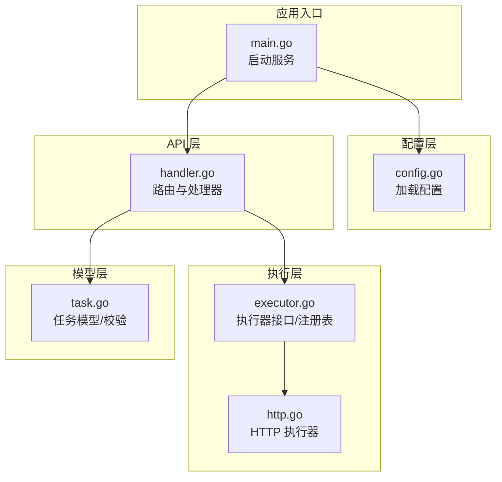
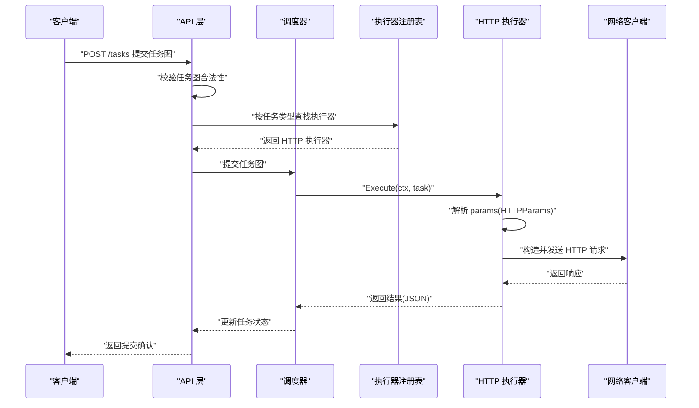
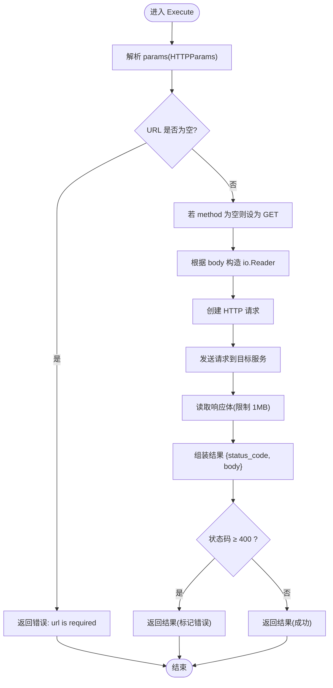
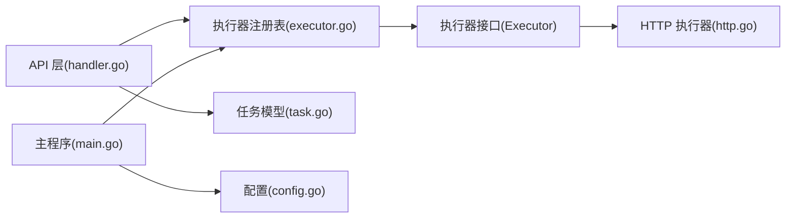

# HTTP 执行器参数

<cite>
**本文档引用的文件**
- [http.go](file://internal/executor/http.go)
- [executor.go](file://internal/executor/executor.go)
- [task.go](file://internal/models/task.go)
- [handler.go](file://internal/api/handler.go)
- [main.go](file://cmd/execgo/main.go)
- [config.go](file://internal/config/config.go)
- [README.md](file://README.md)
</cite>

## 目录
1. [简介](#简介)
2. [项目结构](#项目结构)
3. [核心组件](#核心组件)
4. [架构总览](#架构总览)
5. [详细组件分析](#详细组件分析)
6. [依赖关系分析](#依赖关系分析)
7. [性能考量](#性能考量)
8. [故障排除指南](#故障排除指南)
9. [结论](#结论)
10. [附录](#附录)

## 简介
本文件系统性阐述 ExecGo 中 HTTP 执行器的参数规范与行为，覆盖参数字段定义、URL 格式与验证规则、HTTP 方法类型使用方式、请求头设置格式与安全注意事项、请求体参数的 JSON 格式与编码要求，并提供常见场景的参数示例与错误处理机制说明。目标是帮助使用者在不深入源码的情况下，准确、安全地配置与使用 HTTP 执行器。

## 项目结构
ExecGo 采用分层架构，HTTP 执行器位于执行层，通过任务契约与 API 层交互。关键模块如下：
- 执行层：HTTP 执行器、Shell 执行器、文件执行器
- 任务模型：Task、TaskGraph 及校验逻辑
- API 层：HTTP 路由与处理器
- 配置层：启动参数与环境变量
- 主程序：初始化与服务启动

图表来源
- [main.go:25-104](file://cmd/execgo/main.go#L25-L104)
- [config.go:18-46](file://internal/config/config.go#L18-L46)
- [handler.go:39-52](file://internal/api/handler.go#L39-L52)
- [executor.go:31-67](file://internal/executor/executor.go#L31-L67)
- [http.go:23-75](file://internal/executor/http.go#L23-L75)
- [task.go:21-79](file://internal/models/task.go#L21-L79)

章节来源
- [main.go:25-104](file://cmd/execgo/main.go#L25-L104)
- [config.go:18-46](file://internal/config/config.go#L18-L46)
- [handler.go:39-52](file://internal/api/handler.go#L39-L52)
- [executor.go:31-67](file://internal/executor/executor.go#L31-L67)
- [http.go:23-75](file://internal/executor/http.go#L23-L75)
- [task.go:21-79](file://internal/models/task.go#L21-L79)

## 核心组件
- HTTPParams：HTTP 执行器的参数结构，包含 URL、方法、请求头、请求体。
- HTTPExecutor：实现执行器接口，负责解析参数、构造请求、发送请求并返回结果。
- 任务模型：Task 包含 type、params 等字段，HTTP 执行器通过 params 解析具体参数。
- API 层：负责接收任务提交请求、进行任务图校验、分发给调度器执行。

章节来源
- [http.go:14-20](file://internal/executor/http.go#L14-L20)
- [http.go:23-75](file://internal/executor/http.go#L23-L75)
- [task.go:21-34](file://internal/models/task.go#L21-L34)
- [handler.go:58-99](file://internal/api/handler.go#L58-L99)

## 架构总览
HTTP 执行器在任务生命周期中的调用流程如下：

图表来源
- [handler.go:58-99](file://internal/api/handler.go#L58-L99)
- [executor.go:31-67](file://internal/executor/executor.go#L31-L67)
- [http.go:27-75](file://internal/executor/http.go#L27-L75)

## 详细组件分析

### HTTPParams 参数结构
HTTP 执行器的参数通过 Task 的 params 字段传递，HTTPParams 定义如下：
- url：必填，HTTP(S) 地址字符串
- method：可选，默认 GET；支持任意 HTTP 方法
- headers：可选，键值对形式的请求头映射
- body：可选，原始字符串形式的请求体

参数解析与默认值处理：
- 若未提供 method，则默认使用 GET
- 若未提供 url，则执行会直接报错并返回“url is required”

请求体处理：
- body 以字符串形式读取并作为请求体
- 发送前不会自动设置 Content-Type，需要在 headers 中显式设置

章节来源
- [http.go:14-20](file://internal/executor/http.go#L14-L20)
- [http.go:27-38](file://internal/executor/http.go#L27-L38)

### HTTP 方法类型使用方式
- 支持任意 HTTP 方法（如 GET、POST、PUT、DELETE、PATCH、HEAD、OPTIONS 等）
- 若未指定 method，将默认使用 GET
- 方法名大小写遵循标准库约定，建议使用标准方法常量或大写形式

章节来源
- [http.go:36-38](file://internal/executor/http.go#L36-L38)

### 请求头设置格式与安全考虑
- headers 为字符串到字符串的映射
- 不会对敏感头进行特殊过滤或隐藏，建议在 headers 中设置认证信息（如 Authorization）
- Content-Type 由调用方自行设置，若需要 JSON 编码，请确保 headers 中包含正确的 Content-Type

安全建议：
- 将认证令牌放在 headers 中，避免硬编码在 URL 或 body 中
- 对外暴露的服务应配合反向代理或网关进行 TLS 终止与访问控制

章节来源
- [http.go:50-52](file://internal/executor/http.go#L50-L52)
- [README.md:197-200](file://README.md#L197-L200)

### 请求体参数的 JSON 格式与编码要求
- body 以字符串形式传入，不强制 JSON 格式
- 若需要发送 JSON，需确保 body 为合法 JSON 字符串，并在 headers 中设置正确的 Content-Type
- 响应体读取限制为 1MB，超过部分会被截断

章节来源
- [http.go:19](file://internal/executor/http.go#L19)
- [http.go:40-43](file://internal/executor/http.go#L40-L43)
- [http.go:60](file://internal/executor/http.go#L60)

### 参数验证规则与错误处理机制
- 必填字段：url
- 默认行为：method 缺省时使用 GET
- 错误分类：
  - 参数解析失败：返回“parse http params”错误
  - URL 缺失：返回“url is required”
  - 请求创建失败：返回“create request”错误
  - 网络请求失败：返回“http request failed”错误
  - 响应体读取失败：返回“read response”错误
- 响应状态码：当 HTTP 状态码 ≥ 400 时，仍返回结果，但表示执行层面的错误

章节来源
- [http.go:27-38](file://internal/executor/http.go#L27-L38)
- [http.go:45-57](file://internal/executor/http.go#L45-L57)
- [http.go:60-74](file://internal/executor/http.go#L60-L74)

### 执行流程与返回结果
- 解析 params -> 校验 URL -> 设置默认方法 -> 构造请求 -> 发送请求 -> 读取响应 -> 组装结果
- 结果包含 status_code 与 body 字段；即使状态码 ≥ 400 也会返回结果

图表来源
- [http.go:27-75](file://internal/executor/http.go#L27-L75)

## 依赖关系分析
- HTTP 执行器实现 Executor 接口并通过注册表对外提供
- API 层在提交任务时验证任务图合法性，并检查任务类型对应的执行器是否存在
- 主程序负责注册内置执行器并在启动时输出已注册类型列表

图表来源
- [executor.go:14-20](file://internal/executor/executor.go#L14-L20)
- [executor.go:31-67](file://internal/executor/executor.go#L31-L67)
- [http.go:23-25](file://internal/executor/http.go#L23-L25)
- [handler.go:58-99](file://internal/api/handler.go#L58-L99)
- [task.go:21-34](file://internal/models/task.go#L21-L34)
- [main.go:39-41](file://cmd/execgo/main.go#L39-L41)
- [config.go:18-46](file://internal/config/config.go#L18-L46)

章节来源
- [executor.go:14-20](file://internal/executor/executor.go#L14-L20)
- [executor.go:31-67](file://internal/executor/executor.go#L31-L67)
- [http.go:23-25](file://internal/executor/http.go#L23-L25)
- [handler.go:58-99](file://internal/api/handler.go#L58-L99)
- [task.go:21-34](file://internal/models/task.go#L21-L34)
- [main.go:39-41](file://cmd/execgo/main.go#L39-L41)
- [config.go:18-46](file://internal/config/config.go#L18-L46)

## 性能考量
- 响应体读取限制为 1MB，防止过大响应导致内存占用过高
- 使用默认 HTTP 客户端，未设置连接池或超时时间，建议在上游服务或反向代理层进行限流与超时控制
- 并发执行由调度器统一管理，HTTP 执行器本身不引入额外并发控制

章节来源
- [http.go:60](file://internal/executor/http.go#L60)

## 故障排除指南
- “parse http params”：params JSON 格式不正确或字段类型不符
- “url is required”：未提供 url 字段或为空
- “create request”：方法名非法或 URL 格式异常
- “http request failed”：网络不可达、DNS 解析失败、目标服务拒绝
- “read response”：响应读取异常（如连接中断）
- 状态码 ≥ 400：目标服务返回错误，但执行器仍返回结果

排查步骤：
1. 确认 params 的 JSON 结构与字段名称正确
2. 检查 URL 是否为有效的 HTTP(S) 地址
3. 如需 JSON 请求体，请在 headers 中设置正确的 Content-Type
4. 检查网络连通性与目标服务可用性
5. 查看上游日志与指标，定位错误来源

章节来源
- [http.go:27-38](file://internal/executor/http.go#L27-L38)
- [http.go:45-57](file://internal/executor/http.go#L45-L57)
- [http.go:60-74](file://internal/executor/http.go#L60-L74)

## 结论
HTTP 执行器提供了简洁而实用的参数模型：以 JSON 形式的 params 传递 URL、方法、请求头与请求体。其默认行为明确（缺省方法为 GET），错误处理清晰（参数解析、网络请求、响应读取均有明确错误信息）。结合 ExecGo 的任务图与调度机制，用户可以方便地在工作流中集成 HTTP 调用，并通过 headers 与 body 实现多样化的请求场景。

## 附录

### 参数字段定义与约束
- url：必填，字符串，HTTP(S) 地址
- method：可选，字符串，默认 GET；支持任意标准 HTTP 方法
- headers：可选，对象，键值对形式的请求头
- body：可选，字符串，原始请求体内容

章节来源
- [http.go:14-20](file://internal/executor/http.go#L14-L20)

### 常见场景参数示例（路径引用）
- 简单 GET 请求：参见 [README.md:108-110](file://README.md#L108-L110)
- 带参数 POST 请求：参见 [README.md:197-200](file://README.md#L197-L200)
- 带有认证头的请求：参见 [README.md:197-200](file://README.md#L197-L200)

### 任务图与执行器类型
- 任务图中每个任务的 type 字段用于选择执行器
- HTTP 执行器类型为 "http"

章节来源
- [task.go:21-34](file://internal/models/task.go#L21-L34)
- [executor.go:63-67](file://internal/executor/executor.go#L63-L67)