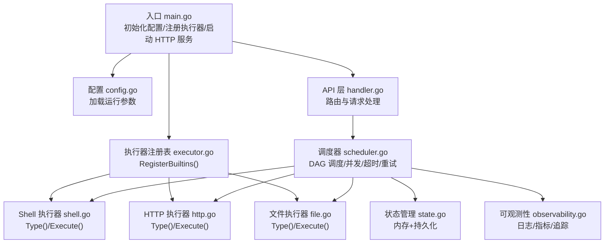
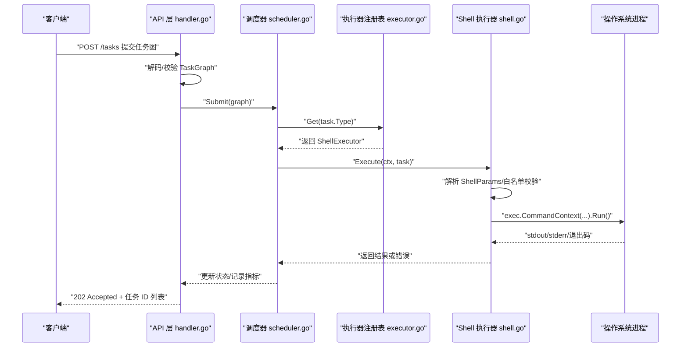
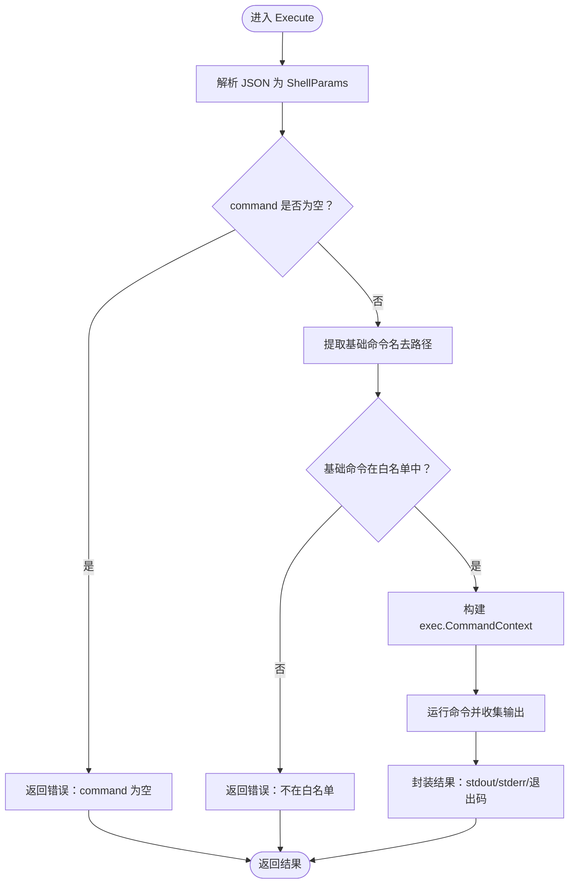
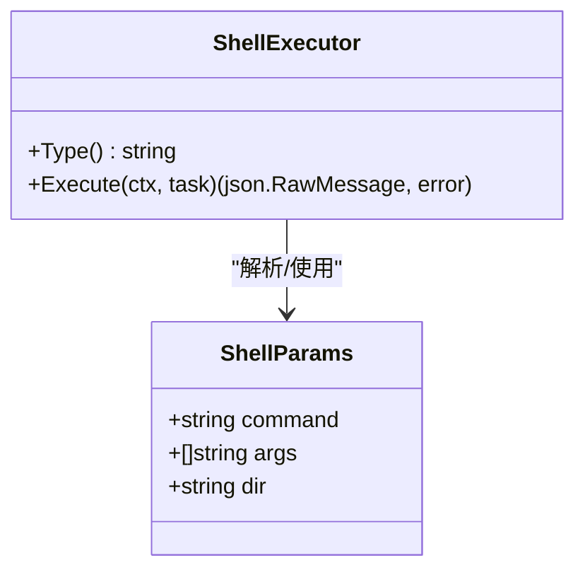
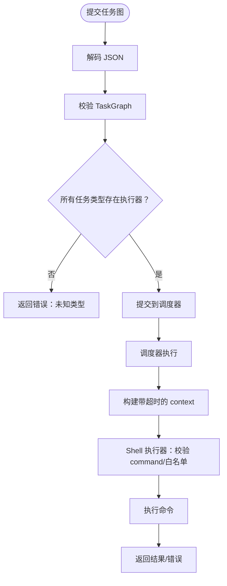
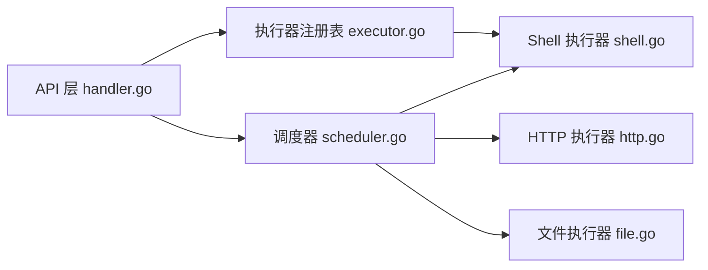

# Shell 执行器参数

<cite>
**本文引用的文件列表**
- [main.go](file://cmd/execgo/main.go)
- [shell.go](file://internal/executor/shell.go)
- [executor.go](file://internal/executor/executor.go)
- [http.go](file://internal/executor/http.go)
- [file.go](file://internal/executor/file.go)
- [task.go](file://internal/models/task.go)
- [handler.go](file://internal/api/handler.go)
- [scheduler.go](file://internal/scheduler/scheduler.go)
- [config.go](file://internal/config/config.go)
- [README.md](file://README.md)
</cite>

## 目录
1. [简介](#简介)
2. [项目结构](#项目结构)
3. [核心组件](#核心组件)
4. [架构总览](#架构总览)
5. [详细组件分析](#详细组件分析)
6. [依赖关系分析](#依赖关系分析)
7. [性能考量](#性能考量)
8. [故障排查指南](#故障排查指南)
9. [结论](#结论)
10. [附录](#附录)

## 简介
本文件聚焦于 Shell 执行器的参数规范与安全机制，围绕以下目标展开：
- 参数结构：执行命令字符串、工作目录设置、参数数组、超时控制等
- 安全机制：命令白名单配置与管理、参数转义与注入防护、执行沙箱环境限制
- 安全实践：安全的命令编写示例、常见风险与防范措施
- 参数验证与执行前安全检查：校验规则与前置检查流程

## 项目结构
ExecGo 采用分层架构，Shell 执行器作为内置执行器之一，通过统一的执行器注册表接入调度与状态管理。关键模块如下：
- 入口与配置：cmd/execgo/main.go、internal/config/config.go
- 执行器接口与注册表：internal/executor/executor.go
- Shell 执行器：internal/executor/shell.go
- HTTP 执行器与文件执行器：internal/executor/http.go、internal/executor/file.go
- 任务模型与校验：internal/models/task.go
- API 层：internal/api/handler.go
- 调度器：internal/scheduler/scheduler.go

图表来源
- [main.go:25-104](file://cmd/execgo/main.go#L25-L104)
- [config.go:18-47](file://internal/config/config.go#L18-L47)
- [executor.go:62-67](file://internal/executor/executor.go#L62-L67)
- [shell.go:34-79](file://internal/executor/shell.go#L34-L79)
- [http.go:27-75](file://internal/executor/http.go#L27-L75)
- [file.go:25-113](file://internal/executor/file.go#L25-L113)
- [handler.go:39-99](file://internal/api/handler.go#L39-L99)
- [scheduler.go:47-190](file://internal/scheduler/scheduler.go#L47-L190)

章节来源
- [main.go:25-104](file://cmd/execgo/main.go#L25-L104)
- [README.md:149-177](file://README.md#L149-L177)

## 核心组件
- 执行器接口与注册表：定义统一的执行器接口与全局注册表，支持按类型获取执行器实例，并在启动时注册内置执行器。
- Shell 执行器：实现 Type() 与 Execute()，负责解析 ShellParams、执行白名单校验、构造命令并运行。
- 任务模型：Task 结构包含 id、type、params、depends_on、retry、timeout、status 等字段；TaskGraph 提供校验与拓扑检测。
- API 层：接收任务提交请求，进行 JSON 解码与任务图校验，随后提交给调度器。
- 调度器：基于 DAG 的并发调度器，支持超时控制与指数退避重试。

章节来源
- [executor.go:14-67](file://internal/executor/executor.go#L14-L67)
- [shell.go:24-79](file://internal/executor/shell.go#L24-L79)
- [task.go:21-79](file://internal/models/task.go#L21-L79)
- [handler.go:58-99](file://internal/api/handler.go#L58-L99)
- [scheduler.go:18-190](file://internal/scheduler/scheduler.go#L18-L190)

## 架构总览
下图展示 Shell 执行器在整体系统中的位置与交互流程。

图表来源
- [handler.go:58-99](file://internal/api/handler.go#L58-L99)
- [scheduler.go:127-190](file://internal/scheduler/scheduler.go#L127-L190)
- [executor.go:38-48](file://internal/executor/executor.go#L38-L48)
- [shell.go:36-79](file://internal/executor/shell.go#L36-L79)

## 详细组件分析

### Shell 执行器参数规范
- 参数结构
  - command：必填，要执行的基础命令名称或绝对/相对路径
  - args：可选，命令参数数组
  - dir：可选，工作目录
- 执行流程
  - 解析 JSON 参数为 ShellParams
  - 校验 command 非空
  - 从 command 中提取基础命令名（去除路径部分）
  - 在白名单中查找基础命令
  - 构造 exec.CommandContext，设置 Dir（若提供）
  - 运行命令并收集 stdout、stderr、退出码
  - 返回结果或错误信息

图表来源
- [shell.go:36-79](file://internal/executor/shell.go#L36-L79)

章节来源
- [shell.go:24-29](file://internal/executor/shell.go#L24-L29)
- [shell.go:36-79](file://internal/executor/shell.go#L36-L79)
- [README.md:202-208](file://README.md#L202-L208)

### 命令白名单配置与管理
- 白名单定义：在 Shell 执行器内部维护允许执行的命令集合，覆盖常用系统工具与跨平台命令。
- 校验策略：仅对命令的基础名称进行匹配，避免路径绕过；不直接执行用户提供的完整命令路径。
- 管理方式：白名单集中维护，便于审计与更新；新增命令需评估安全影响后纳入。

图表来源
- [shell.go:32-29](file://internal/executor/shell.go#L32-L29)

章节来源
- [shell.go:14-22](file://internal/executor/shell.go#L14-L22)
- [shell.go:46-54](file://internal/executor/shell.go#L46-L54)

### 参数转义与注入防护
- 命令解析：Shell 执行器将参数拆分为 command 与 args 数组，避免将用户输入拼接为 shell 字符串导致的注入风险。
- 路径提取：从 command 中剥离路径，仅以基础命令名进行白名单匹配，降低路径绕过风险。
- 环境变量：当前实现未显式传入环境变量，避免污染执行上下文；如需扩展，建议通过独立字段显式传递并进行白名单过滤。

章节来源
- [shell.go:36-59](file://internal/executor/shell.go#L36-L59)

### 执行沙箱环境限制
- 工作目录：可通过 dir 字段指定工作目录，限制命令执行范围。
- 超时控制：调度器根据任务的 timeout 字段为每次执行创建带超时的 context，避免长时间阻塞。
- 并发与资源：调度器通过信号量控制最大并发，防止资源耗尽。
- 输出限制：当前未对 stdout/stderr 设置大小限制，建议在需要时增加限制以防止内存占用过高。

章节来源
- [shell.go:57-59](file://internal/executor/shell.go#L57-L59)
- [scheduler.go:163-173](file://internal/scheduler/scheduler.go#L163-L173)
- [scheduler.go:41](file://internal/scheduler/scheduler.go#L41)

### 参数验证规则与执行前安全检查
- 任务图校验：确保任务 ID 唯一、类型非空、依赖引用合法且无环。
- 执行器可用性：提交阶段检查任务类型是否存在对应执行器。
- Shell 执行器校验：command 非空、基础命令在白名单中。
- 超时与重试：调度器按任务 timeout 与 retry 配置执行带超时与指数退避的多次尝试。

图表来源
- [handler.go:63-99](file://internal/api/handler.go#L63-L99)
- [task.go:41-79](file://internal/models/task.go#L41-L79)
- [scheduler.go:127-190](file://internal/scheduler/scheduler.go#L127-L190)
- [shell.go:42-54](file://internal/executor/shell.go#L42-L54)

章节来源
- [handler.go:63-99](file://internal/api/handler.go#L63-L99)
- [task.go:41-79](file://internal/models/task.go#L41-L79)
- [scheduler.go:127-190](file://internal/scheduler/scheduler.go#L127-L190)
- [shell.go:42-54](file://internal/executor/shell.go#L42-L54)

### 安全的命令编写示例与常见风险防范
- 示例参考：README 中提供了 Shell 执行器的参数示例，包括 command、args、dir 等字段。
- 风险与防范：
  - 不要在 command 中拼接用户输入；使用 args 数组传递参数
  - 仅使用白名单中的命令
  - 通过 dir 限定工作目录，避免路径穿越
  - 为任务设置合理的 timeout，防止长时间阻塞
  - 如需跨平台兼容，注意 Windows 常用命令的差异

章节来源
- [README.md:202-208](file://README.md#L202-L208)
- [shell.go:14-22](file://internal/executor/shell.go#L14-L22)

## 依赖关系分析
- 执行器注册表：统一管理执行器类型与实例，ShellExecutor 通过 Type() 与 Execute() 接口参与调度。
- API 层：负责请求解码、任务图校验与执行器可用性检查。
- 调度器：负责并发控制、超时与重试、状态更新与下游级联。

图表来源
- [executor.go:38-48](file://internal/executor/executor.go#L38-L48)
- [handler.go:76-85](file://internal/api/handler.go#L76-L85)
- [scheduler.go:127-190](file://internal/scheduler/scheduler.go#L127-L190)
- [http.go:27-75](file://internal/executor/http.go#L27-L75)
- [file.go:25-113](file://internal/executor/file.go#L25-L113)

章节来源
- [executor.go:38-48](file://internal/executor/executor.go#L38-L48)
- [handler.go:76-85](file://internal/api/handler.go#L76-L85)
- [scheduler.go:127-190](file://internal/scheduler/scheduler.go#L127-L190)

## 性能考量
- 并发控制：调度器通过固定容量的信号量限制最大并发，避免资源争用。
- 超时与重试：为每个执行尝试设置超时，失败时按指数退避重试，减少抖动。
- 输出读取：当前未对 stdout/stderr 设置大小限制，建议在需要时增加限制以控制内存占用。
- I/O 优化：Shell 执行器直接使用缓冲区收集输出，避免额外拷贝。

章节来源
- [scheduler.go:41](file://internal/scheduler/scheduler.go#L41)
- [scheduler.go:152-179](file://internal/scheduler/scheduler.go#L152-L179)
- [shell.go:61-64](file://internal/executor/shell.go#L61-L64)

## 故障排查指南
- 常见错误
  - 任务类型未知：API 层会返回可用执行器列表，确认任务 type 是否正确
  - 任务图校验失败：检查任务 ID、依赖引用与环路
  - Shell 执行器：command 为空或不在白名单
  - 执行超时：调整任务 timeout 或优化命令
- 排查步骤
  - 查看健康与指标端点确认服务状态
  - 通过查询任务详情定位具体失败原因
  - 检查调度器日志与执行器返回结果

章节来源
- [handler.go:76-85](file://internal/api/handler.go#L76-L85)
- [task.go:41-79](file://internal/models/task.go#L41-L79)
- [shell.go:42-54](file://internal/executor/shell.go#L42-L54)
- [scheduler.go:152-179](file://internal/scheduler/scheduler.go#L152-L179)

## 结论
Shell 执行器通过严格的白名单机制、参数数组化传递与超时控制，有效降低了命令注入与资源滥用的风险。结合调度器的并发与重试策略，能够在保证安全性的同时提升任务执行的可靠性。建议在生产环境中：
- 明确白名单范围并定期审计
- 对输出进行大小限制
- 为关键任务设置合理超时与重试
- 通过可观测性端点持续监控执行状态

## 附录
- 配置项
  - addr：HTTP 监听地址
  - data-dir：数据持久化目录
  - max-concurrency：最大并发数
  - shutdown-timeout：优雅关闭超时（秒）

章节来源
- [config.go:18-47](file://internal/config/config.go#L18-L47)
- [main.go:25-104](file://cmd/execgo/main.go#L25-L104)