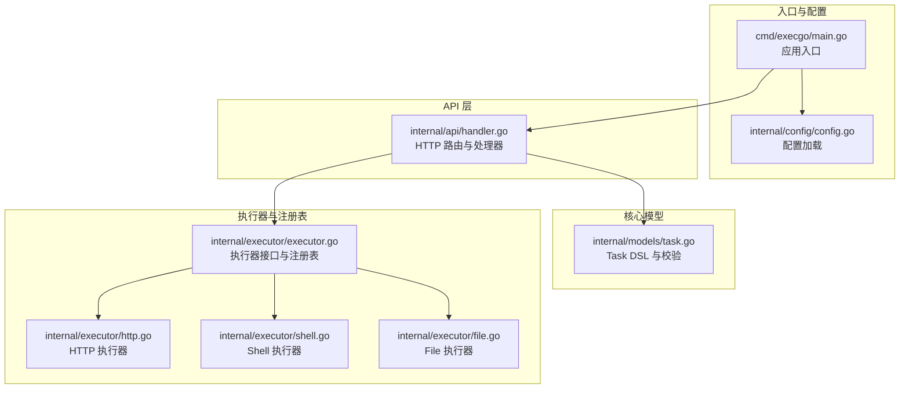
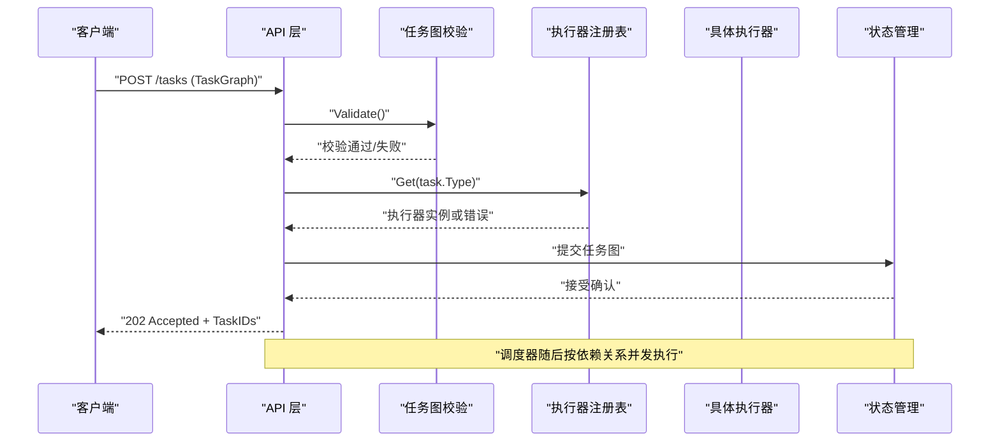
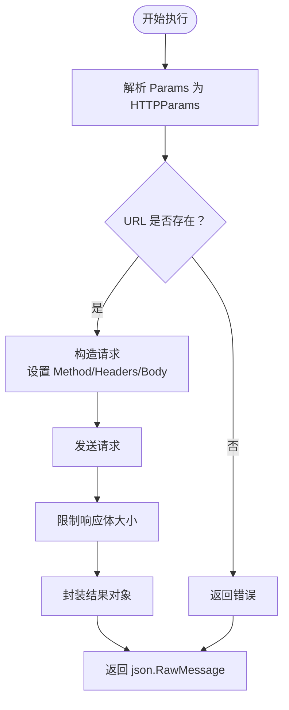
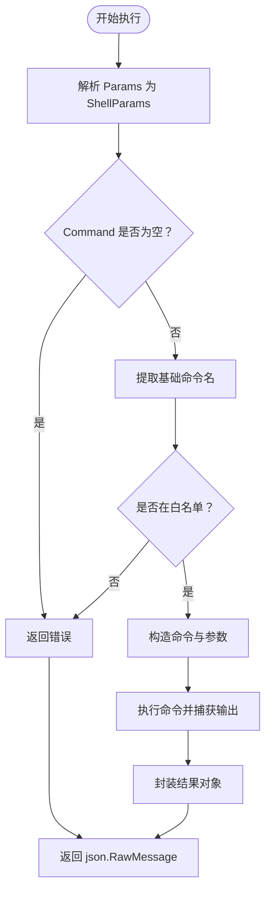
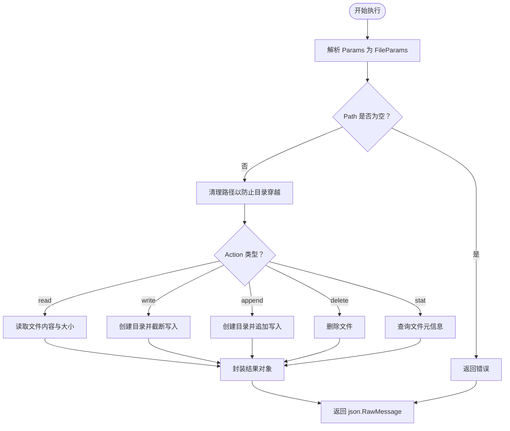
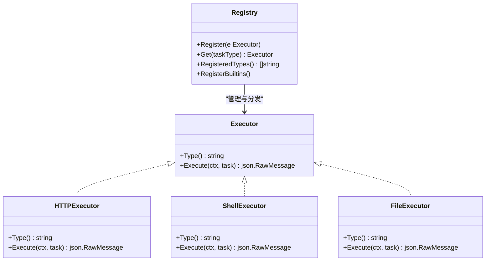

# 执行参数规范

<cite>
**本文档引用的文件**
- [cmd/execgo/main.go](file://cmd/execgo/main.go)
- [internal/models/task.go](file://internal/models/task.go)
- [internal/executor/executor.go](file://internal/executor/executor.go)
- [internal/executor/http.go](file://internal/executor/http.go)
- [internal/executor/shell.go](file://internal/executor/shell.go)
- [internal/executor/file.go](file://internal/executor/file.go)
- [internal/api/handler.go](file://internal/api/handler.go)
- [internal/config/config.go](file://internal/config/config.go)
- [README.md](file://README.md)
</cite>

## 目录
1. [简介](#简介)
2. [项目结构](#项目结构)
3. [核心组件](#核心组件)
4. [架构总览](#架构总览)
5. [详细组件分析](#详细组件分析)
6. [依赖关系分析](#依赖关系分析)
7. [性能考虑](#性能考虑)
8. [故障排除指南](#故障排除指南)
9. [结论](#结论)
10. [附录](#附录)

## 简介
本规范文档面向 ExecGo 执行参数的设计与使用，重点阐述 Task.Params 字段的通用结构与类型约束，并给出三种内置执行器（HTTP、Shell、File）的具体参数规范、序列化注意事项、安全限制与最佳实践。文档同时提供参数示例与常见问题排查建议，帮助开发者在不深入源码的情况下正确使用 ExecGo 的执行参数体系。

## 项目结构
ExecGo 采用分层架构，核心围绕 Task DSL 与执行器注册表展开。API 层负责接收任务图并进行校验，调度器按依赖关系并发执行，执行器根据任务类型解析 Params 并执行具体操作。

图表来源
- [cmd/execgo/main.go:25-104](file://cmd/execgo/main.go#L25-L104)
- [internal/api/handler.go:39-52](file://internal/api/handler.go#L39-L52)
- [internal/models/task.go:21-39](file://internal/models/task.go#L21-L39)
- [internal/executor/executor.go:14-67](file://internal/executor/executor.go#L14-L67)
- [internal/executor/http.go:14-75](file://internal/executor/http.go#L14-L75)
- [internal/executor/shell.go:14-79](file://internal/executor/shell.go#L14-L79)
- [internal/executor/file.go:13-113](file://internal/executor/file.go#L13-L113)

章节来源
- [cmd/execgo/main.go:25-104](file://cmd/execgo/main.go#L25-L104)
- [internal/api/handler.go:39-52](file://internal/api/handler.go#L39-L52)
- [internal/models/task.go:21-39](file://internal/models/task.go#L21-L39)
- [internal/executor/executor.go:14-67](file://internal/executor/executor.go#L14-L67)

## 核心组件
- Task.Params 字段类型为 json.RawMessage，表示“原始 JSON 文本”，不进行解码即保存，便于执行器按需解析为各自类型的参数结构体。
- Task.DSL 包含 id、type、params、depends_on、retry、timeout、status 等字段，其中 type 决定使用哪个执行器，params 为该执行器的参数载体。
- 执行器注册表通过 Type() 识别执行器类型，Get(task.Type) 获取对应执行器实例，Execute(ctx, task) 将 Params 解析为具体参数结构后执行。

章节来源
- [internal/models/task.go:22-34](file://internal/models/task.go#L22-L34)
- [internal/executor/executor.go:14-20](file://internal/executor/executor.go#L14-L20)
- [internal/executor/executor.go:38-48](file://internal/executor/executor.go#L38-L48)

## 架构总览
ExecGo 的执行参数在 API 层接收后，进入调度器，再由执行器根据 Task.Type 解析 Params 并执行。下图展示了从请求到执行的关键流程。

图表来源
- [internal/api/handler.go:58-99](file://internal/api/handler.go#L58-L99)
- [internal/models/task.go:41-79](file://internal/models/task.go#L41-L79)
- [internal/executor/executor.go:38-48](file://internal/executor/executor.go#L38-L48)

## 详细组件分析

### 通用 Params 结构与序列化注意事项
- Params 类型：json.RawMessage，表示原始 JSON 文本，不进行自动解码。执行器在执行前自行解析为具体参数结构体。
- 序列化注意事项：
  - 不要对 Params 进行二次编码；保持原始 JSON 文本即可。
  - 若需要在执行器内部返回结果，应将结果序列化为 JSON 字节，再以 json.RawMessage 形式赋给 Task.Result。
  - 错误处理：当 Params 解析失败或参数缺失时，执行器应返回明确的错误信息，避免吞掉异常。
- 与 Task.Result 的关系：Task.Result 同样为 json.RawMessage，用于承载执行器返回的结果对象。

章节来源
- [internal/models/task.go:22-34](file://internal/models/task.go#L22-L34)
- [internal/executor/executor.go:19](file://internal/executor/executor.go#L19)

### HTTP 执行器参数规范
- 参数结构：包含 url、method、headers、body 四个字段。
  - url：必填，目标 HTTP 地址。
  - method：可选，默认 GET。
  - headers：可选，键值对形式的请求头。
  - body：可选，字符串形式的请求体。
- 执行行为：
  - 使用 http.NewRequestWithContext 创建请求，支持上下文取消与超时。
  - 设置请求头后调用 http.DefaultClient.Do 发送请求。
  - 限制响应体大小（最多 1MB），避免内存膨胀。
  - 即使 HTTP 状态码大于等于 400，仍返回结果对象，但调用方需根据状态码判断成功与否。
- 参数示例（路径参考）
  - [HTTPParams 定义:14-20](file://internal/executor/http.go#L14-L20)
  - [Execute 实现:27-75](file://internal/executor/http.go#L27-L75)
- 最佳实践
  - 明确设置 method，避免默认 GET 导致的副作用。
  - 对敏感头（如 Authorization）谨慎传递，必要时在服务端做脱敏。
  - 控制 body 大小，避免超过限制。
  - 在调用方根据返回的状态码与 body 判断业务结果。

图表来源
- [internal/executor/http.go:27-75](file://internal/executor/http.go#L27-L75)

章节来源
- [internal/executor/http.go:14-20](file://internal/executor/http.go#L14-L20)
- [internal/executor/http.go:27-75](file://internal/executor/http.go#L27-L75)

### Shell 执行器参数规范（白名单机制）
- 参数结构：包含 command、args、dir 三个字段。
  - command：必填，基础命令名用于白名单校验；支持绝对路径或相对路径，会提取最后的文件名进行匹配。
  - args：可选，字符串数组形式的参数列表。
  - dir：可选，执行工作目录。
- 白名单机制：
  - 仅允许预定义的一组命令执行，防止任意命令注入。
  - 基础命令名提取规则：若包含路径分隔符，则取最后一个片段作为基础名。
  - 若不在白名单中，直接拒绝执行。
- 执行行为：
  - 使用 exec.CommandContext 创建命令，支持上下文取消。
  - 捕获标准输出与标准错误，记录退出码。
  - 返回包含 stdout、stderr、exit_code 的结果对象。
- 参数示例（路径参考）
  - [ShellParams 定义:24-29](file://internal/executor/shell.go#L24-L29)
  - [Allowed Commands 白名单:14-22](file://internal/executor/shell.go#L14-L22)
  - [Execute 实现:36-79](file://internal/executor/shell.go#L36-L79)
- 安全限制与最佳实践
  - 严禁传入非白名单命令，避免系统命令注入。
  - 不要将用户输入直接拼接到命令中；如需参数化，请使用 args 数组。
  - 限制工作目录范围，避免越权访问。
  - 注意命令执行的副作用（如文件写入、网络访问等），在调用方做好审计与隔离。

图表来源
- [internal/executor/shell.go:36-79](file://internal/executor/shell.go#L36-L79)

章节来源
- [internal/executor/shell.go:14-22](file://internal/executor/shell.go#L14-L22)
- [internal/executor/shell.go:24-29](file://internal/executor/shell.go#L24-L29)
- [internal/executor/shell.go:36-79](file://internal/executor/shell.go#L36-L79)

### File 执行器参数规范（读写权限与路径安全）
- 参数结构：包含 action、path、content 三个字段。
  - action：必填，支持 read、write、append、delete、stat。
  - path：必填，目标文件路径，执行前会进行清理以防止目录穿越。
  - content：可选，写入或追加的内容（字符串）。
- 执行行为：
  - read：读取文件内容与大小，返回 content 与 size。
  - write：确保父目录存在，打开文件并截断写入，返回 bytes_written。
  - append：确保父目录存在，打开文件并追加写入，返回 bytes_written。
  - delete：删除文件，返回 deleted=true。
  - stat：返回文件名、大小、权限模式、修改时间、是否目录等元信息。
- 路径安全与权限
  - 使用 filepath.Clean 清理路径，防止 ../ 等目录穿越。
  - 写入时自动创建目录（权限 0755），文件权限 0644。
  - 读取与统计使用标准 os 包函数，保证跨平台一致性。
- 参数示例（路径参考）
  - [FileParams 定义:13-18](file://internal/executor/file.go#L13-L18)
  - [Execute 实现:25-52](file://internal/executor/file.go#L25-L52)
  - [read 实现:54-63](file://internal/executor/file.go#L54-L63)
  - [write 实现:65-92](file://internal/executor/file.go#L65-L92)
  - [delete 实现:94-99](file://internal/executor/file.go#L94-L99)
  - [stat 实现:101-113](file://internal/executor/file.go#L101-L113)
- 最佳实践
  - 严格限定可访问的根目录，避免越权访问系统关键路径。
  - 对写入内容进行长度与字符集限制，避免恶意内容。
  - 在调用方对 action 与 path 进行业务层面的白名单校验。
  - 对敏感文件操作增加审计日志与权限控制。

图表来源
- [internal/executor/file.go:25-52](file://internal/executor/file.go#L25-L52)
- [internal/executor/file.go:54-113](file://internal/executor/file.go#L54-L113)

章节来源
- [internal/executor/file.go:13-18](file://internal/executor/file.go#L13-L18)
- [internal/executor/file.go:25-52](file://internal/executor/file.go#L25-L52)
- [internal/executor/file.go:54-113](file://internal/executor/file.go#L54-L113)

## 依赖关系分析
- 执行器注册表与执行器实现之间通过接口耦合，新增执行器只需实现接口并通过注册表暴露 Type() 与 Execute()。
- API 层只依赖注册表与状态管理，不关心具体执行器实现，具备良好的扩展性。
- Task 模型与执行器参数结构相互独立，Params 以原始 JSON 传递，降低耦合度。

图表来源
- [internal/executor/executor.go:14-67](file://internal/executor/executor.go#L14-L67)
- [internal/executor/http.go:22-25](file://internal/executor/http.go#L22-L25)
- [internal/executor/shell.go:31-34](file://internal/executor/shell.go#L31-L34)
- [internal/executor/file.go:20-23](file://internal/executor/file.go#L20-L23)

章节来源
- [internal/executor/executor.go:14-67](file://internal/executor/executor.go#L14-L67)

## 性能考虑
- HTTP 执行器对响应体设置了大小限制，避免大响应导致内存占用过高。
- Shell 执行器通过白名单减少潜在的高开销命令，降低系统负载。
- File 执行器在写入前确保目录存在，减少多次系统调用带来的开销。
- 建议在调用方对 Params 的大小与复杂度进行预检，避免触发执行器内部的资源限制。

## 故障排除指南
- Params 解析失败
  - 现象：执行器返回“解析参数失败”类错误。
  - 排查：确认 Params 是否为有效的 JSON 文本；核对字段名称与类型是否匹配执行器期望。
  - 参考实现：[HTTP 执行器参数解析:28-31](file://internal/executor/http.go#L28-L31)、[Shell 执行器参数解析:37-40](file://internal/executor/shell.go#L37-L40)、[File 执行器参数解析:26-29](file://internal/executor/file.go#L26-L29)
- 缺少必填字段
  - 现象：执行器返回“缺少必填字段”类错误。
  - 排查：核对每个执行器的必填字段（如 HTTP 的 url、Shell 的 command、File 的 path）。
  - 参考实现：[HTTP 必填校验:33-35](file://internal/executor/http.go#L33-L35)、[Shell 必填校验:42-44](file://internal/executor/shell.go#L42-L44)、[File 必填校验:31-33](file://internal/executor/file.go#L31-L33)
- 白名单命令被拒绝
  - 现象：Shell 执行器返回“命令未在白名单中”。
  - 排查：确认命令是否在允许列表内；注意路径分隔符提取基础命令名的规则。
  - 参考实现：[Allowed Commands:14-22](file://internal/executor/shell.go#L14-L22)、[命令提取与校验:46-54](file://internal/executor/shell.go#L46-L54)
- 目录穿越或权限问题
  - 现象：File 执行器返回“读取/写入失败”。
  - 排查：确认路径是否被清理；检查工作目录与文件权限；避免访问受限路径。
  - 参考实现：[路径清理:35-36](file://internal/executor/file.go#L35-L36)、[写入权限与目录创建:65-76](file://internal/executor/file.go#L65-L76)
- HTTP 请求失败或超时
  - 现象：HTTP 执行器返回“请求失败”或状态码异常。
  - 排查：检查 URL、Method、Headers、Body；确认网络可达性与超时设置。
  - 参考实现：[请求构造与发送:45-57](file://internal/executor/http.go#L45-L57)、[响应体限制:60-63](file://internal/executor/http.go#L60-L63)

章节来源
- [internal/executor/http.go:27-75](file://internal/executor/http.go#L27-L75)
- [internal/executor/shell.go:36-79](file://internal/executor/shell.go#L36-L79)
- [internal/executor/file.go:25-113](file://internal/executor/file.go#L25-L113)

## 结论
ExecGo 的执行参数体系以 Task.Params 为核心，采用 json.RawMessage 保留原始 JSON 文本，由具体执行器按类型解析为强类型参数结构体。HTTP、Shell、File 三类执行器分别覆盖网络请求、系统命令与文件操作场景，配套严格的参数校验、安全限制与错误处理。遵循本文档的参数规范与最佳实践，可在保证安全性的同时获得清晰、可维护的执行参数设计。

## 附录
- 参数示例（路径参考）
  - HTTP 示例：[HTTP 参数示例:197-200](file://README.md#L197-L200)
  - Shell 示例：[Shell 参数示例:202-205](file://README.md#L202-L205)
  - File 示例：[File 参数示例:209-212](file://README.md#L209-L212)
- 配置项（路径参考）
  - 配置加载与优先级：[配置加载:18-30](file://internal/config/config.go#L18-L30)、[环境变量与默认值:32-46](file://internal/config/config.go#L32-L46)
- 扩展自定义执行器（路径参考）
  - 接口与注册：[执行器接口与注册:14-67](file://internal/executor/executor.go#L14-L67)、[示例扩展:229-249](file://README.md#L229-L249)