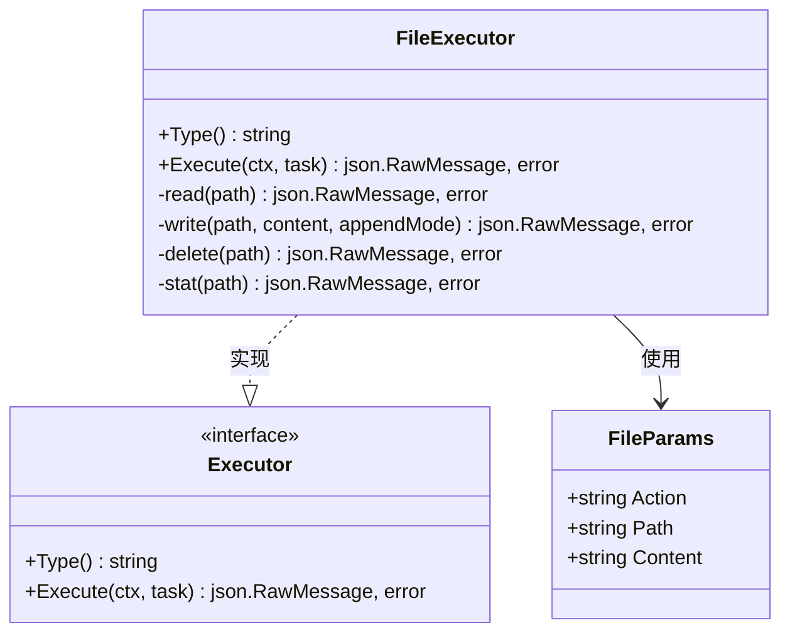
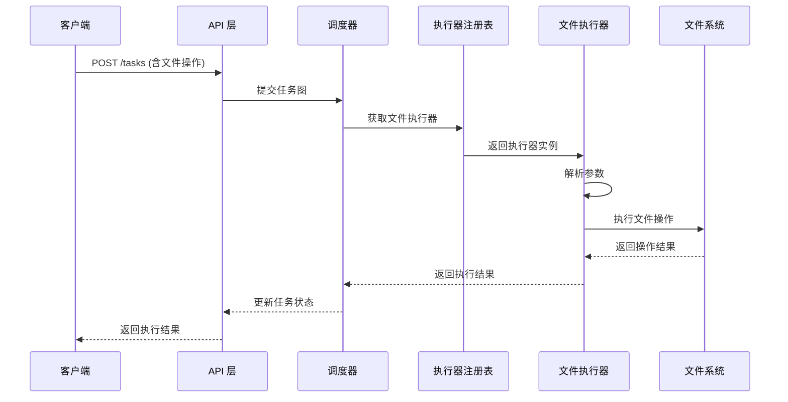
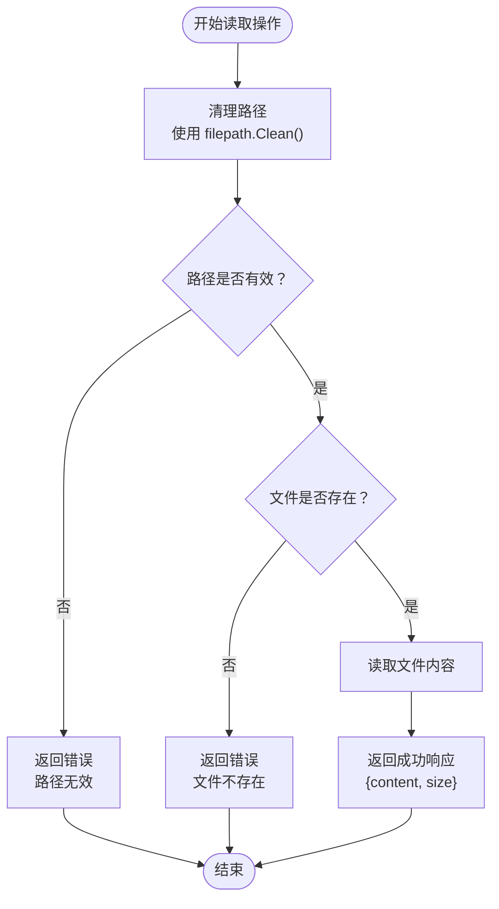
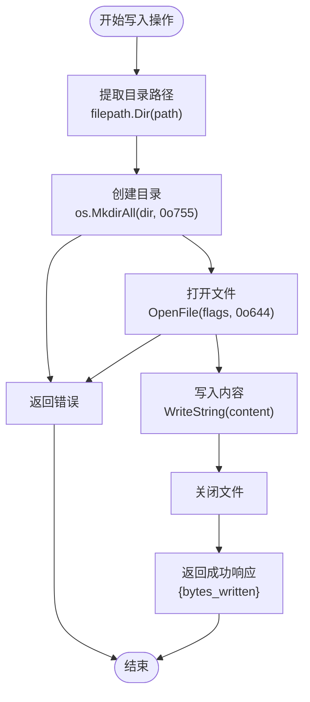
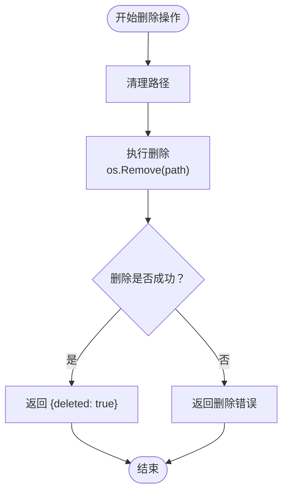
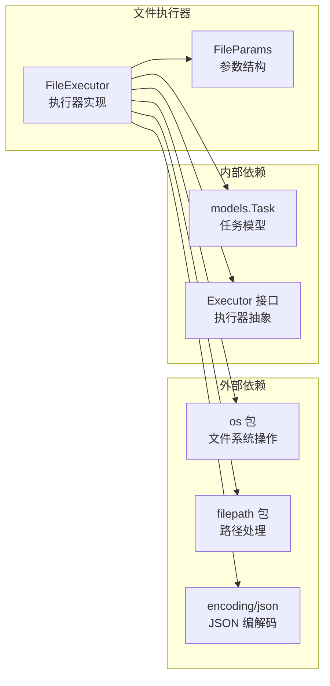
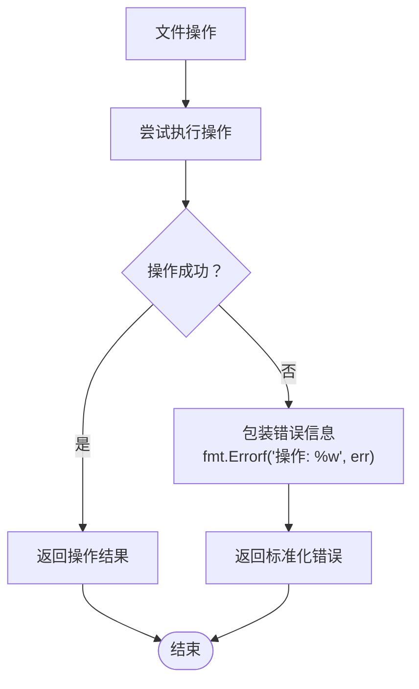

# 文件执行器参数

<cite>
**本文档中引用的文件**
- [main.go](file://cmd/execgo/main.go)
- [file.go](file://internal/executor/file.go)
- [executor.go](file://internal/executor/executor.go)
- [task.go](file://internal/models/task.go)
- [handler.go](file://internal/api/handler.go)
- [config.go](file://internal/config/config.go)
- [state.json](file://data/state.json)
- [README.md](file://README.md)
</cite>

## 目录
1. [简介](#简介)
2. [项目结构](#项目结构)
3. [核心组件](#核心组件)
4. [架构概览](#架构概览)
5. [详细组件分析](#详细组件分析)
6. [依赖关系分析](#依赖关系分析)
7. [性能考虑](#性能考虑)
8. [故障排除指南](#故障排除指南)
9. [结论](#结论)

## 简介

ExecGo 是一个使用纯 Go 标准库构建的极简 AI 执行引擎，专为 AI Agent 提供任务提交、DAG 调度、并发执行和可观测性的 HTTP 服务。本文档专注于文件执行器参数规范，详细说明文件操作支持的参数类型、路径规范、权限要求、安全机制以及最佳实践。

## 项目结构

ExecGo 采用分层架构设计，主要包含以下核心模块：

```mermaid
graph TB
subgraph "入口层"
Main[main.go<br/>应用入口]
end
subgraph "API 层"
Handler[handler.go<br/>HTTP API 处理器]
end
subgraph "执行器层"
Executor[executor.go<br/>执行器接口]
FileExecutor[file.go<br/>文件执行器实现]
end
subgraph "模型层"
Task[task.go<br/>任务模型]
end
subgraph "配置层"
Config[config.go<br/>配置管理]
end
Main --> Handler
Handler --> Executor
Executor --> FileExecutor
Handler --> Task
Main --> Config
```

**图表来源**
- [main.go:25-105](file://cmd/execgo/main.go#L25-L105)
- [handler.go:39-52](file://internal/api/handler.go#L39-L52)
- [executor.go:14-68](file://internal/executor/executor.go#L14-L68)
- [file.go:20-52](file://internal/executor/file.go#L20-L52)

**章节来源**
- [main.go:1-105](file://cmd/execgo/main.go#L1-L105)
- [README.md:149-177](file://README.md#L149-L177)

## 核心组件

### 文件执行器参数结构

文件执行器通过 `FileParams` 结构体定义所有支持的操作参数：

**图表来源**
- [file.go:13-21](file://internal/executor/file.go#L13-L21)
- [executor.go:14-20](file://internal/executor/executor.go#L14-L20)

### 支持的操作类型

文件执行器支持以下五种核心操作：

| 操作类型 | 功能描述 | 参数要求 | 返回值 |
|---------|----------|----------|--------|
| `read` | 读取文件内容 | `path`: 必需 | `{content: string, size: number}` |
| `write` | 写入文件内容 | `path`: 必需, `content`: 必需 | `{bytes_written: number}` |
| `append` | 追加内容到文件末尾 | `path`: 必需, `content`: 必需 | `{bytes_written: number}` |
| `delete` | 删除文件 | `path`: 必需 | `{deleted: boolean}` |
| `stat` | 获取文件状态信息 | `path`: 必需 | `{name, size, mode, mod_time, is_dir}` |

**章节来源**
- [file.go:13-52](file://internal/executor/file.go#L13-L52)
- [README.md:209-212](file://README.md#L209-L212)

## 架构概览

ExecGo 的文件执行器在整体架构中的位置如下：

**图表来源**
- [handler.go:58-99](file://internal/api/handler.go#L58-L99)
- [executor.go:38-67](file://internal/executor/executor.go#L38-L67)
- [file.go:25-52](file://internal/executor/file.go#L25-L52)

## 详细组件分析

### 文件读取操作

文件读取操作通过 `read` 方法实现，具有以下特性：

#### 参数规范
- **必需参数**: `path` - 目标文件的绝对或相对路径
- **可选参数**: 无额外参数

#### 路径处理机制
文件执行器实现了严格的路径清理和安全验证：

**图表来源**
- [file.go:35-40](file://internal/executor/file.go#L35-L40)
- [file.go:54-63](file://internal/executor/file.go#L54-L63)

#### 权限要求
- 读取权限：需要对目标文件具有读取权限
- 目录权限：需要对包含目录具有执行权限以遍历路径

**章节来源**
- [file.go:54-63](file://internal/executor/file.go#L54-L63)

### 文件写入操作

文件写入操作通过 `write` 方法实现，支持两种模式：

#### 参数规范
- **必需参数**: `path` - 目标文件路径, `content` - 写入内容
- **可选参数**: 无

#### 写入策略
文件执行器自动处理目录创建和文件写入：

**图表来源**
- [file.go:65-92](file://internal/executor/file.go#L65-L92)

#### 覆盖策略
- **非追加模式** (`write`): 使用 `O_TRUNC` 标志，会完全覆盖现有文件
- **追加模式** (`append`): 使用 `O_APPEND` 标志，在文件末尾追加内容

#### 权限设置
- **目录权限**: `0o755` - 允许所有用户读取和执行，所有者可写
- **文件权限**: `0o644` - 允许所有用户读取，所有者可写

**章节来源**
- [file.go:65-92](file://internal/executor/file.go#L65-L92)

### 文件删除操作

文件删除操作通过 `delete` 方法实现：

#### 安全确认机制
文件删除操作采用直接删除策略，不包含额外的安全确认步骤：

**图表来源**
- [file.go:94-99](file://internal/executor/file.go#L94-L99)

#### 安全考虑
- 删除操作不可逆，建议在生产环境中谨慎使用
- 不包含回收站或备份机制

**章节来源**
- [file.go:94-99](file://internal/executor/file.go#L94-L99)

### 文件状态查询

文件状态查询通过 `stat` 方法实现：

#### 返回信息
- **基础信息**: 文件名、大小、修改时间
- **权限信息**: 文件模式字符串表示
- **类型信息**: 是否为目录

**章节来源**
- [file.go:101-113](file://internal/executor/file.go#L101-L113)

## 依赖关系分析

文件执行器的依赖关系如下：

**图表来源**
- [file.go:3-11](file://internal/executor/file.go#L3-L11)
- [executor.go:14-20](file://internal/executor/executor.go#L14-L20)

**章节来源**
- [file.go:3-11](file://internal/executor/file.go#L3-L11)
- [executor.go:14-20](file://internal/executor/executor.go#L14-L20)

## 性能考虑

### 并发安全性
- 文件执行器使用 Go 标准库的文件操作，天然支持并发访问
- 每个文件操作都是独立的系统调用，避免长时间持有文件句柄

### 内存使用
- 读取操作会将整个文件内容加载到内存中
- 对于大型文件，建议使用流式处理或分块读取策略

### 错误处理
文件执行器采用统一的错误处理模式：

**图表来源**
- [file.go:27-51](file://internal/executor/file.go#L27-L51)

**章节来源**
- [file.go:25-52](file://internal/executor/file.go#L25-L52)

## 故障排除指南

### 常见错误类型

| 错误类型 | 可能原因 | 解决方案 |
|---------|----------|----------|
| 路径无效 | `path` 参数为空或包含非法字符 | 确保提供有效的文件路径，使用 `filepath.Clean()` 处理 |
| 权限不足 | 缺少必要的文件系统权限 | 检查文件和目录的读写权限 |
| 文件不存在 | 目标文件未创建 | 使用 `write` 操作先创建文件 |
| 目录不存在 | 包含目录未创建 | 系统会自动创建缺失的目录 |
| 超时错误 | 操作超过指定超时时间 | 增加任务的 `timeout` 参数 |

### 调试技巧

1. **使用 `stat` 操作** 验证文件存在性和权限
2. **检查工作目录** 确认相对路径的解析
3. **查看系统日志** 获取详细的错误信息

**章节来源**
- [file.go:31-33](file://internal/executor/file.go#L31-L33)
- [file.go:56-58](file://internal/executor/file.go#L56-L58)

## 结论

ExecGo 的文件执行器提供了简洁而强大的文件操作能力，支持基本的 CRUD 文件操作，并具备以下特点：

### 优势
- **简单易用**: 参数结构清晰，操作直观
- **安全可靠**: 内置路径清理和验证机制
- **标准兼容**: 完全基于 Go 标准库实现
- **可观测性**: 详细的日志记录和错误报告

### 限制
- **功能有限**: 仅支持基本的文件操作，不包含高级功能
- **无安全确认**: 删除操作缺少确认机制
- **无权限管理**: 不支持细粒度的文件权限设置

### 建议
对于生产环境使用，建议：
1. 在部署前充分测试文件操作权限
2. 为敏感操作添加额外的业务逻辑验证
3. 使用适当的日志级别监控文件操作
4. 考虑为删除操作添加备份机制