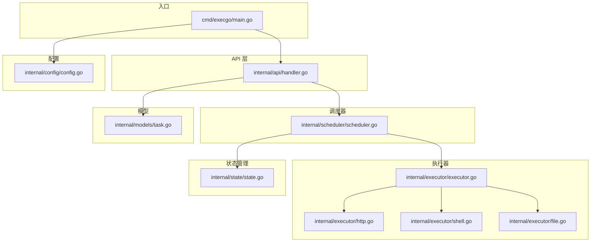
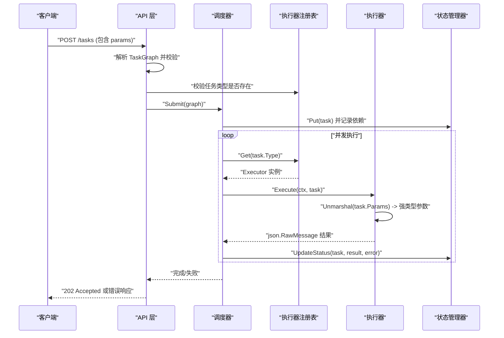
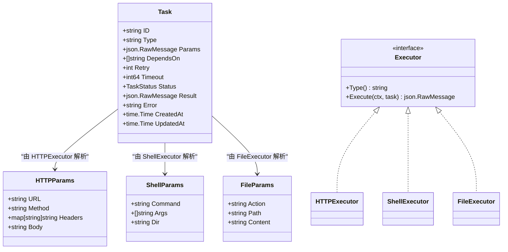
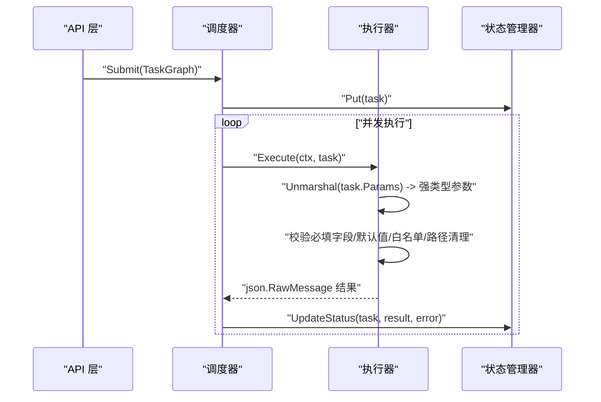
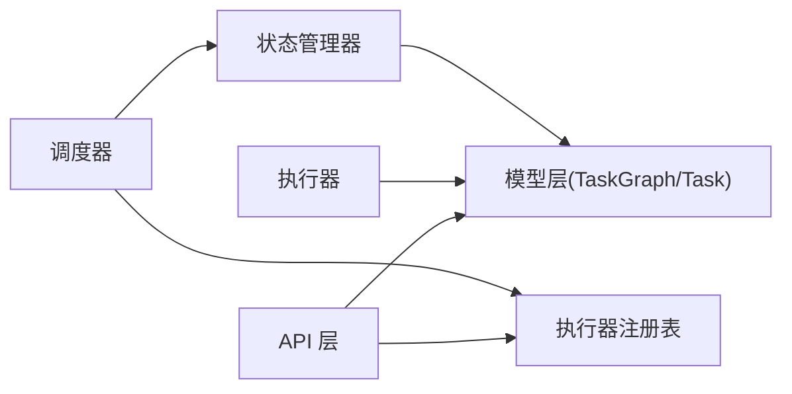

# 通用参数格式

<cite>
**本文引用的文件**
- [main.go](file://cmd/execgo/main.go)
- [task.go](file://internal/models/task.go)
- [executor.go](file://internal/executor/executor.go)
- [http.go](file://internal/executor/http.go)
- [shell.go](file://internal/executor/shell.go)
- [file.go](file://internal/executor/file.go)
- [handler.go](file://internal/api/handler.go)
- [scheduler.go](file://internal/scheduler/scheduler.go)
- [state.go](file://internal/state/state.go)
- [config.go](file://internal/config/config.go)
- [README.md](file://README.md)
</cite>

## 目录
1. [简介](#简介)
2. [项目结构](#项目结构)
3. [核心组件](#核心组件)
4. [架构总览](#架构总览)
5. [详细组件分析](#详细组件分析)
6. [依赖分析](#依赖分析)
7. [性能考虑](#性能考虑)
8. [故障排查指南](#故障排查指南)
9. [结论](#结论)
10. [附录](#附录)

## 简介
本文件围绕 ExecGo 的“通用参数格式”进行深入说明，重点阐述 Task.Params 字段采用 json.RawMessage 类型的设计原理与优势，并给出参数序列化与反序列化的最佳实践、空值处理、类型转换与错误处理机制，以及针对不同执行器类型的参数示例与验证规则，帮助开发者在不破坏类型安全的前提下，灵活传递与处理参数。

## 项目结构
ExecGo 采用分层架构：入口程序负责初始化与启动；API 层负责请求解析与路由；调度器负责 DAG 编排与并发控制；执行器负责具体任务执行；状态管理器负责内存与持久化；配置模块负责外部化配置。

图表来源
- [main.go:25-104](file://cmd/execgo/main.go#L25-L104)
- [handler.go:39-52](file://internal/api/handler.go#L39-L52)
- [scheduler.go:18-45](file://internal/scheduler/scheduler.go#L18-L45)
- [executor.go:14-67](file://internal/executor/executor.go#L14-L67)
- [http.go:22-75](file://internal/executor/http.go#L22-L75)
- [shell.go:31-79](file://internal/executor/shell.go#L31-L79)
- [file.go:20-113](file://internal/executor/file.go#L20-L113)
- [state.go:17-53](file://internal/state/state.go#L17-L53)
- [task.go:22-34](file://internal/models/task.go#L22-L34)
- [config.go:18-30](file://internal/config/config.go#L18-L30)

章节来源
- [main.go:25-104](file://cmd/execgo/main.go#L25-L104)
- [README.md:149-177](file://README.md#L149-L177)

## 核心组件
- Task.Params 使用 json.RawMessage 类型，允许以原始字节形式保存任意 JSON 参数，避免在 API 层对参数进行强制解码，从而实现“通用参数格式”的灵活性与可扩展性。
- 执行器在需要时自行对 Params 进行解码，结合各自参数结构体（如 HTTPParams、ShellParams、FileParams），实现强类型参数访问与校验。
- 调度器在执行前根据任务类型获取执行器，然后调用执行器的 Execute 方法，将 Task 传入，执行器内部完成参数解析与执行。

章节来源
- [task.go:22-34](file://internal/models/task.go#L22-L34)
- [executor.go:14-20](file://internal/executor/executor.go#L14-L20)
- [scheduler.go:127-190](file://internal/scheduler/scheduler.go#L127-L190)

## 架构总览
下图展示了“通用参数格式”在整体流程中的位置与作用：API 层接收请求后，将 Params 以原始 JSON 保存；调度器按类型选择执行器；执行器对 Params 进行强类型解析与执行；最终结果以 json.RawMessage 形式回填至 Task.Result。

图表来源
- [handler.go:58-99](file://internal/api/handler.go#L58-L99)
- [scheduler.go:69-97](file://internal/scheduler/scheduler.go#L69-L97)
- [executor.go:38-48](file://internal/executor/executor.go#L38-L48)
- [http.go:27-75](file://internal/executor/http.go#L27-L75)
- [shell.go:36-79](file://internal/executor/shell.go#L36-L79)
- [file.go:25-113](file://internal/executor/file.go#L25-L113)
- [state.go:94-108](file://internal/state/state.go#L94-L108)

## 详细组件分析

### 通用参数格式设计：json.RawMessage 的原理与优势
- 设计原理
  - 将参数以原始 JSON 字节保存，避免在 API 层对参数进行强制解码，从而实现“通用参数格式”。这样，API 层只负责任务契约的校验与路由，而参数的具体语义由执行器自行解析。
  - Task 结构体中 Params 字段声明为 json.RawMessage，既保证了 JSON 的完整性，也便于后续在执行器中按需解码。
- 优势
  - 解耦：API 层与执行器实现解耦，新增执行器无需修改 API 层。
  - 可扩展：新增执行器类型时，只需实现对应的参数结构体与 Execute 方法，即可无缝接入。
  - 灵活：不同执行器可以使用完全不同的参数结构，且不会影响其他执行器。
  - 可观测：由于参数以原始 JSON 存储，便于日志与审计。

章节来源
- [task.go:22-34](file://internal/models/task.go#L22-L34)
- [executor.go:14-20](file://internal/executor/executor.go#L14-L20)

### 参数序列化与反序列化的最佳实践
- 序列化（API 层）
  - API 层在解析请求时，直接将请求体解码为 TaskGraph，Params 字段保持为原始 JSON 字节，不进行二次解码。
  - 在响应中，Task 的 Params 会以原始 JSON 输出，确保客户端看到的与提交的一致。
- 反序列化（执行器层）
  - 执行器在 Execute 方法中，先对 Task.Params 进行 json.Unmarshal，得到强类型参数结构体（如 HTTPParams、ShellParams、FileParams）。
  - 对于每个执行器，建议：
    - 显式校验必填字段；
    - 对可选字段设置默认值；
    - 对输入进行范围与格式校验；
    - 将错误信息包装为可读的错误消息，便于上层处理。
- 错误处理
  - 若 Params 不是合法 JSON，执行器应返回明确的错误信息，避免静默失败。
  - 对于未知字段或非法值，应在执行器内部进行校验并返回错误，避免传播到下游。

章节来源
- [handler.go:63-68](file://internal/api/handler.go#L63-L68)
- [http.go:27-31](file://internal/executor/http.go#L27-L31)
- [shell.go:36-44](file://internal/executor/shell.go#L36-L44)
- [file.go:25-33](file://internal/executor/file.go#L25-L33)

### 空值处理、类型转换与错误处理机制
- 空值处理
  - 若 Params 为空（null 或未提供），执行器应显式判断并返回错误，提示缺少必要参数。
  - 对于可选字段，执行器应提供合理的默认值，避免因缺失导致执行失败。
- 类型转换
  - 执行器内部使用结构体字段进行类型转换，确保字段类型与预期一致（例如字符串、整数、布尔、对象、数组等）。
  - 对于复杂类型（如嵌套对象、数组），建议在执行器内部进行细粒度校验。
- 错误处理
  - 执行器应捕获解码与执行过程中的错误，并将其包装为可读的错误消息，便于上层记录与返回。
  - 对于非致命错误（如 HTTP 4xx），执行器仍应返回结果，但上层可根据状态码决定是否视为失败。

章节来源
- [http.go:33-38](file://internal/executor/http.go#L33-L38)
- [shell.go:42-54](file://internal/executor/shell.go#L42-L54)
- [file.go:31-50](file://internal/executor/file.go#L31-L50)

### 通用参数格式示例与验证规则
- 示例（来自 README）
  - HTTP 执行器参数：包含 url、method、headers、body 等字段。
  - Shell 执行器参数：包含 command、args、dir 等字段，并提供白名单命令列表。
  - File 执行器参数：包含 action、path、content 等字段。
- 验证规则
  - API 层对 TaskGraph 进行验证：任务 ID 必填且唯一；任务类型必填；依赖引用必须存在且不能自依赖；DAG 不能有环。
  - 执行器层对参数进行强类型校验：必填字段校验、默认值设置、白名单校验（Shell）、路径清理（File）等。
  - 调度器层对任务生命周期进行管理：并发控制、超时与重试、结果回填与状态更新。

章节来源
- [README.md:195-213](file://README.md#L195-L213)
- [task.go:41-79](file://internal/models/task.go#L41-L79)
- [shell.go:14-22](file://internal/executor/shell.go#L14-L22)
- [file.go:35-36](file://internal/executor/file.go#L35-L36)

### 执行器参数结构与解析流程（类图）

图表来源
- [task.go:22-34](file://internal/models/task.go#L22-L34)
- [executor.go:14-20](file://internal/executor/executor.go#L14-L20)
- [http.go:14-20](file://internal/executor/http.go#L14-L20)
- [shell.go:24-29](file://internal/executor/shell.go#L24-L29)
- [file.go:13-18](file://internal/executor/file.go#L13-L18)
- [http.go:22-25](file://internal/executor/http.go#L22-L25)
- [shell.go:31-34](file://internal/executor/shell.go#L31-L34)
- [file.go:20-23](file://internal/executor/file.go#L20-L23)

### 参数解析与执行流程（序列图）

图表来源
- [scheduler.go:127-190](file://internal/scheduler/scheduler.go#L127-L190)
- [http.go:27-75](file://internal/executor/http.go#L27-L75)
- [shell.go:36-79](file://internal/executor/shell.go#L36-L79)
- [file.go:25-113](file://internal/executor/file.go#L25-L113)
- [state.go:94-108](file://internal/state/state.go#L94-L108)

### 参数解析算法流程（流程图）

```mermaid
flowchart TD
Start(["进入执行器"]) --> CheckRaw["检查 Params 是否为空"]
CheckRaw --> IsNull{"为空？"}
IsNull --> |是| ErrEmpty["返回错误：缺少必要参数"]
IsNull --> |否| Unmarshal["执行 json.Unmarshal 到强类型参数结构体"]
Unmarshal --> ParseOK{"解码成功？"}
ParseOK --> |否| ErrParse["返回错误：参数格式无效"]
ParseOK --> |是| Validate["执行器内校验必填/默认/白名单/路径等"]
Validate --> Valid{"校验通过？"}
Valid --> |否| ErrValidate["返回错误：参数校验失败"]
Valid --> |是| Execute["执行具体操作HTTP/Shell/File"]
Execute --> Result["封装结果为 json.RawMessage"]
Result --> Done(["返回给调度器"])
ErrEmpty --> Done
ErrParse --> Done
ErrValidate --> Done
```

图表来源
- [http.go:27-31](file://internal/executor/http.go#L27-L31)
- [shell.go:36-44](file://internal/executor/shell.go#L36-L44)
- [file.go:25-33](file://internal/executor/file.go#L25-L33)

## 依赖分析
- API 层依赖模型层（TaskGraph、Task）与执行器注册表，负责请求解析与校验。
- 调度器依赖状态管理器与执行器注册表，负责并发控制、超时与重试、结果回填。
- 执行器依赖模型层（Task），负责参数解析与执行。
- 状态管理器依赖模型层（Task），负责内存存储与持久化。

图表来源
- [handler.go:58-99](file://internal/api/handler.go#L58-L99)
- [scheduler.go:69-97](file://internal/scheduler/scheduler.go#L69-L97)
- [executor.go:38-48](file://internal/executor/executor.go#L38-L48)
- [state.go:94-108](file://internal/state/state.go#L94-L108)

章节来源
- [handler.go:58-99](file://internal/api/handler.go#L58-L99)
- [scheduler.go:69-97](file://internal/scheduler/scheduler.go#L69-L97)
- [executor.go:38-48](file://internal/executor/executor.go#L38-L48)
- [state.go:94-108](file://internal/state/state.go#L94-L108)

## 性能考虑
- json.RawMessage 的使用避免了在 API 层对参数进行重复解码，减少 CPU 开销与内存拷贝。
- 执行器内部的参数解析与校验应尽量轻量，避免在热路径上进行昂贵操作。
- 调度器的并发控制通过信号量与 goroutine 协程池实现，合理设置最大并发度以平衡吞吐与资源占用。
- 状态持久化采用周期性写入与原子重命名策略，降低磁盘写入开销与数据损坏风险。

## 故障排查指南
- 提交任务时报错“未知任务类型”
  - 检查任务类型是否已在执行器注册表中注册；确认大小写与拼写。
- 提交任务时报错“参数格式无效”
  - 检查 Params 是否为合法 JSON；确认必填字段是否存在；核对字段类型与取值范围。
- 执行器报错“命令不在白名单中”
  - 检查 Shell 执行器的命令是否在允许列表中；注意路径包含的基名提取逻辑。
- 执行器报错“路径穿越”
  - 检查 File 执行器的路径是否经过清理；避免使用相对路径或 ../ 等危险路径。
- 任务长时间处于 running
  - 检查任务是否设置了超时；查看调度器日志与执行器日志；确认并发度与资源占用情况。

章节来源
- [handler.go:76-85](file://internal/api/handler.go#L76-L85)
- [http.go:33-38](file://internal/executor/http.go#L33-L38)
- [shell.go:46-54](file://internal/executor/shell.go#L46-L54)
- [file.go:35-36](file://internal/executor/file.go#L35-L36)
- [scheduler.go:163-179](file://internal/scheduler/scheduler.go#L163-L179)

## 结论
通过将 Task.Params 设计为 json.RawMessage，ExecGo 实现了“通用参数格式”，在保持 API 层简洁的同时，赋予执行器充分的灵活性与可扩展性。配合强类型参数结构体与严格的校验机制，ExecGo 能够在不同执行器之间安全地传递与处理参数，满足多样化任务场景的需求。

## 附录
- 任务 DSL 规范与内置执行器参数示例可参考项目 README 的相应章节。
- 配置项可通过命令行标志与环境变量进行外部化配置，优先级为：命令行 > 环境变量 > 默认值。

章节来源
- [README.md:181-213](file://README.md#L181-L213)
- [config.go:18-30](file://internal/config/config.go#L18-L30)