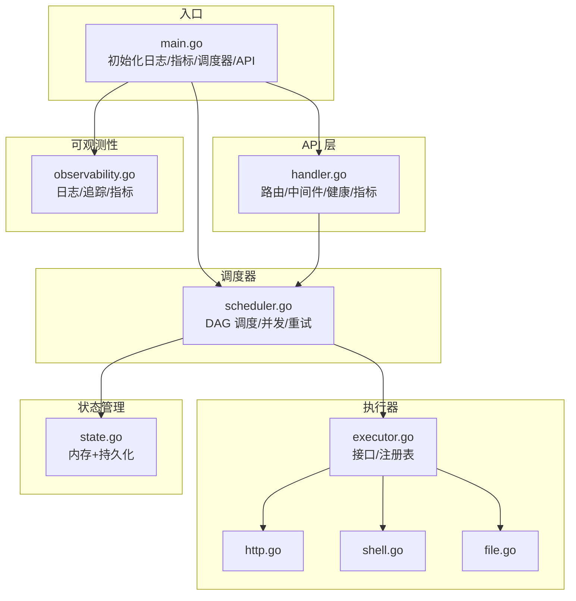
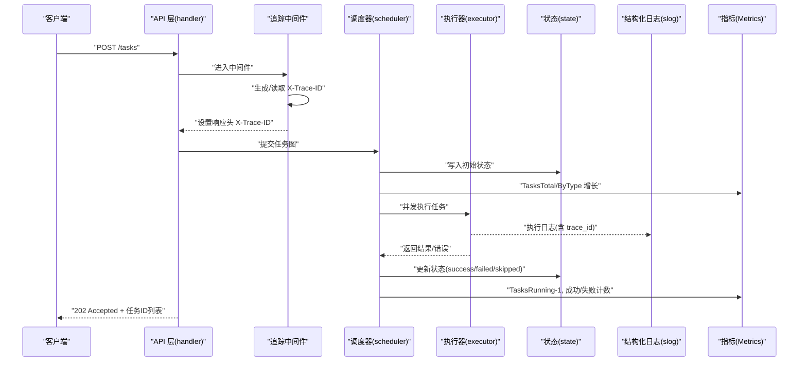
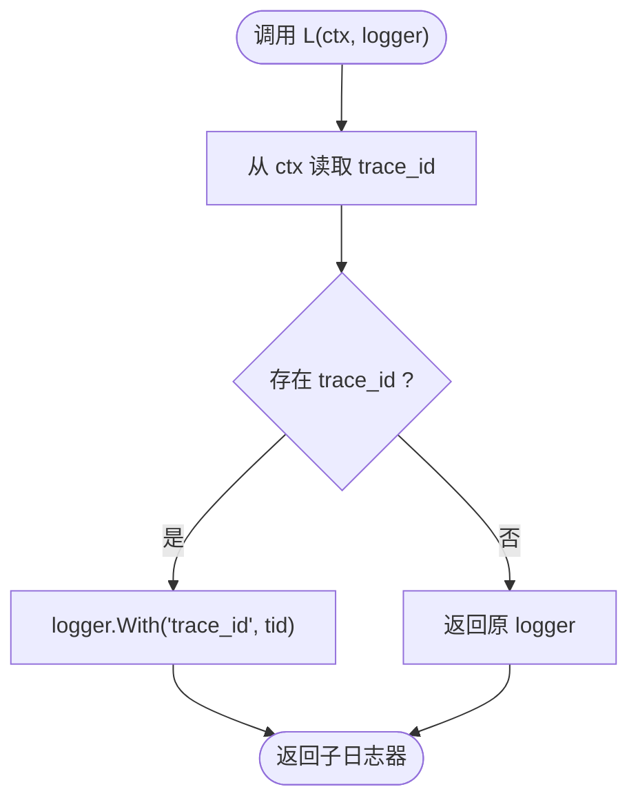
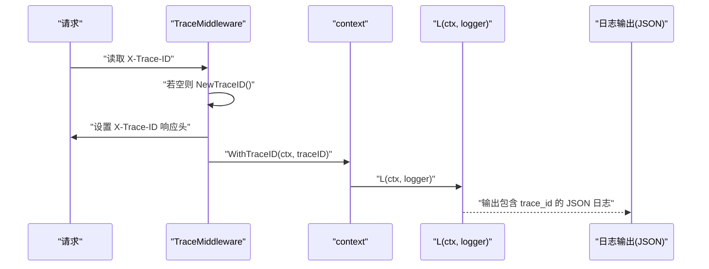
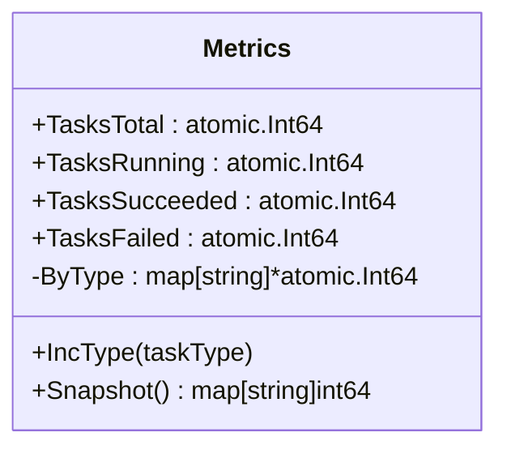
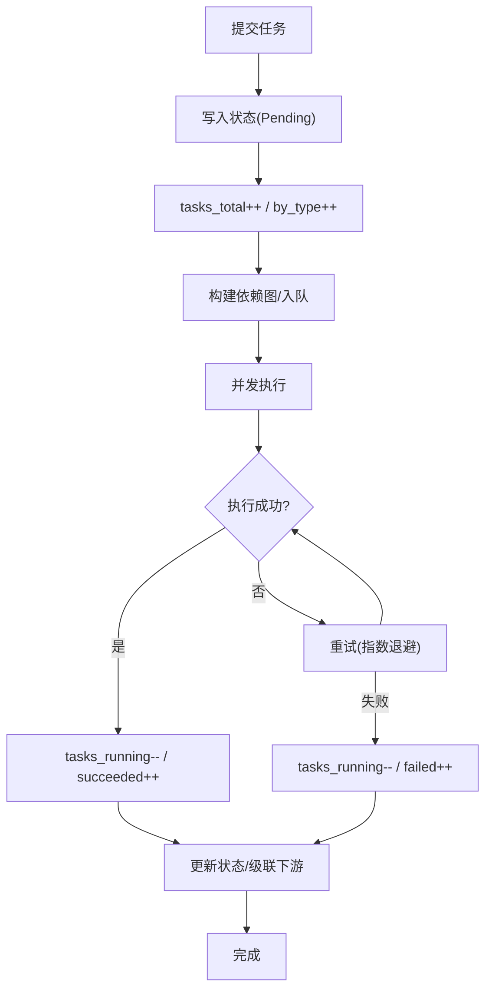
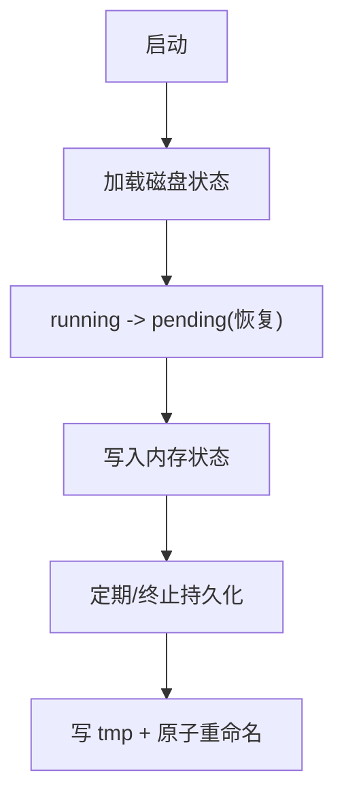
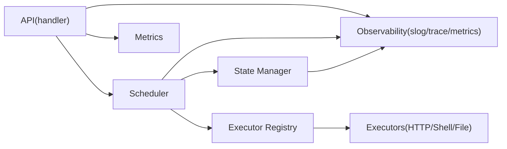

# 可观测性

<cite>
**本文引用的文件列表**
- [main.go](file://cmd/execgo/main.go)
- [observability.go](file://internal/observability/observability.go)
- [handler.go](file://internal/api/handler.go)
- [scheduler.go](file://internal/scheduler/scheduler.go)
- [executor.go](file://internal/executor/executor.go)
- [http.go](file://internal/executor/http.go)
- [shell.go](file://internal/executor/shell.go)
- [file.go](file://internal/executor/file.go)
- [task.go](file://internal/models/task.go)
- [state.go](file://internal/state/state.go)
- [config.go](file://internal/config/config.go)
- [README.md](file://README.md)
</cite>

## 目录
1. [简介](#简介)
2. [项目结构](#项目结构)
3. [核心组件](#核心组件)
4. [架构总览](#架构总览)
5. [详细组件分析](#详细组件分析)
6. [依赖分析](#依赖分析)
7. [性能考量](#性能考量)
8. [故障排查指南](#故障排查指南)
9. [结论](#结论)
10. [附录](#附录)

## 简介
本文件面向 ExecGo 的可观测性实现，围绕结构化日志、请求追踪与指标收集展开，覆盖 traceID 的生成、传播与关联，/metrics 端点的指标定义与采集方式，并给出监控指标含义、阈值建议、告警配置思路与故障排查最佳实践。同时说明在分布式环境中的应用与扩展方案。

## 项目结构
ExecGo 采用分层架构，可观测性贯穿入口、API、调度器、执行器与状态管理等模块。关键位置如下：
- 入口程序负责初始化日志、指标、调度器与 API 服务器，并统一处理优雅关闭。
- API 层提供路由与 /metrics 端点，使用中间件注入 traceID。
- 调度器负责任务生命周期与并发控制，记录任务状态变更与重试行为。
- 执行器负责具体任务执行，返回结构化结果或错误。
- 状态管理器负责内存状态与文件持久化，周期性落盘以保证恢复能力。
- 配置模块提供运行参数与环境变量解析。

图表来源
- [main.go:25-104](file://cmd/execgo/main.go#L25-L104)
- [handler.go:39-52](file://internal/api/handler.go#L39-L52)
- [scheduler.go:18-45](file://internal/scheduler/scheduler.go#L18-L45)
- [executor.go:14-67](file://internal/executor/executor.go#L14-L67)
- [state.go:17-53](file://internal/state/state.go#L17-L53)
- [observability.go:50-80](file://internal/observability/observability.go#L50-L80)

章节来源
- [README.md:32-57](file://README.md#L32-L57)
- [main.go:25-104](file://cmd/execgo/main.go#L25-L104)
- [handler.go:39-52](file://internal/api/handler.go#L39-L52)
- [scheduler.go:18-45](file://internal/scheduler/scheduler.go#L18-L45)
- [executor.go:14-67](file://internal/executor/executor.go#L14-L67)
- [state.go:17-53](file://internal/state/state.go#L17-L53)
- [observability.go:50-80](file://internal/observability/observability.go#L50-L80)

## 核心组件
- 结构化日志与日志格式
  - 使用标准库 slog，输出 JSON 格式，便于机器解析与日志平台接入。
  - 在 API 层与调度器中广泛使用，结合 traceID 串联请求链路。
- 请求追踪
  - traceID 生成：随机字节编码为十六进制字符串。
  - traceID 传播：HTTP 中间件从请求头读取或生成，注入响应头，贯穿后续日志与指标。
- 指标收集
  - 内存指标：总任务数、运行中、成功、失败；按任务类型计数。
  - /metrics 端点：暴露当前指标快照，便于 Prometheus 等拉取。

章节来源
- [observability.go:50-80](file://internal/observability/observability.go#L50-L80)
- [observability.go:86-134](file://internal/observability/observability.go#L86-L134)
- [handler.go:137-146](file://internal/api/handler.go#L137-L146)
- [scheduler.go:128-190](file://internal/scheduler/scheduler.go#L128-L190)

## 架构总览
下图展示从客户端到执行器的完整可观测路径，包括 traceID 的生成与传播、日志结构化输出以及指标更新。

图表来源
- [handler.go:58-99](file://internal/api/handler.go#L58-L99)
- [observability.go:69-80](file://internal/observability/observability.go#L69-L80)
- [scheduler.go:69-97](file://internal/scheduler/scheduler.go#L69-L97)
- [scheduler.go:128-190](file://internal/scheduler/scheduler.go#L128-L190)
- [state.go:94-108](file://internal/state/state.go#L94-L108)
- [observability.go:86-134](file://internal/observability/observability.go#L86-L134)

## 详细组件分析

### 结构化日志系统与 slog 使用
- 日志器创建
  - 使用 JSON 处理器，默认级别为 Info。
- 日志上下文增强
  - L 函数根据 context 中的 traceID 动态附加字段，确保跨模块日志可关联。
- 使用场景
  - 入口程序、API 路由、调度器执行、状态更新、错误与警告信息均通过结构化日志输出。

图表来源
- [observability.go:57-63](file://internal/observability/observability.go#L57-L63)

章节来源
- [observability.go:50-63](file://internal/observability/observability.go#L50-L63)
- [main.go:29-37](file://cmd/execgo/main.go#L29-L37)
- [handler.go:58-99](file://internal/api/handler.go#L58-L99)
- [scheduler.go:128-190](file://internal/scheduler/scheduler.go#L128-L190)
- [state.go:161-179](file://internal/state/state.go#L161-L179)

### 请求追踪机制：traceID 的生成、传播与关联
- 生成
  - 通过随机字节生成 16 字节十六进制字符串作为 traceID。
- 传播
  - 中间件从请求头读取 X-Trace-ID，若为空则生成并写入响应头。
  - 通过 WithTraceID 将 traceID 注入 context，供后续日志与指标使用。
- 关联
  - API 层与调度器均使用 L(ctx, logger) 输出结构化日志，自动携带 trace_id。
  - 调度器在执行任务时，日志中包含 task_id 与 task_type，形成“请求-任务”双维度关联。

图表来源
- [observability.go:24-44](file://internal/observability/observability.go#L24-L44)
- [observability.go:69-80](file://internal/observability/observability.go#L69-L80)
- [observability.go:57-63](file://internal/observability/observability.go#L57-L63)

章节来源
- [observability.go:24-44](file://internal/observability/observability.go#L24-L44)
- [observability.go:69-80](file://internal/observability/observability.go#L69-L80)
- [handler.go:58-99](file://internal/api/handler.go#L58-L99)
- [scheduler.go:128-190](file://internal/scheduler/scheduler.go#L128-L190)

### /metrics 端点：指标定义与采集
- 指标定义
  - tasks_total：累计提交的任务总数（原子计数）。
  - tasks_running：当前正在执行的任务数（原子计数）。
  - tasks_succeeded：成功完成的任务数（原子计数）。
  - tasks_failed：失败的任务数（原子计数）。
  - by_type：按任务类型细分的计数映射（类型首次出现时懒创建原子计数）。
- 采集方式
  - /metrics 端点直接读取原子计数与快照映射，返回 JSON。
  - 调度器在任务提交、执行与完成阶段更新上述指标。
- 指标含义与阈值建议
  - tasks_total：反映系统吞吐；建议结合速率与峰值观察。
  - tasks_running：反映并发压力；建议与 MaxConcurrency 对比，超过阈值需扩容或限流。
  - tasks_succeeded/times_failed：失败率异常升高需报警；建议失败率阈值 1%-5%（视业务而定）。
  - by_type：识别热点任务类型，定位性能瓶颈或资源消耗热点。

图表来源
- [observability.go:86-134](file://internal/observability/observability.go#L86-L134)

章节来源
- [observability.go:86-134](file://internal/observability/observability.go#L86-L134)
- [handler.go:137-146](file://internal/api/handler.go#L137-L146)
- [scheduler.go:69-97](file://internal/scheduler/scheduler.go#L69-L97)
- [scheduler.go:128-190](file://internal/scheduler/scheduler.go#L128-L190)

### 调度器与执行器的可观测性集成
- 调度器
  - 提交任务时：更新 tasks_total 与按类型计数；构建依赖图并入就绪队列。
  - 执行任务时：更新 tasks_running；按重试策略指数退避；最终更新成功/失败计数并级联下游。
  - 完成任务时：更新状态、写入结果或错误信息，并根据依赖关系决定下游执行或跳过。
- 执行器
  - HTTP/Shell/File 执行器均通过 context 传递超时与取消信号，避免阻塞。
  - 执行器返回结构化结果，调度器将其写入状态并参与指标更新。

图表来源
- [scheduler.go:69-97](file://internal/scheduler/scheduler.go#L69-L97)
- [scheduler.go:128-190](file://internal/scheduler/scheduler.go#L128-L190)
- [scheduler.go:192-222](file://internal/scheduler/scheduler.go#L192-L222)
- [http.go:27-75](file://internal/executor/http.go#L27-L75)
- [shell.go:36-79](file://internal/executor/shell.go#L36-L79)
- [file.go:25-52](file://internal/executor/file.go#L25-L52)

章节来源
- [scheduler.go:69-97](file://internal/scheduler/scheduler.go#L69-L97)
- [scheduler.go:128-190](file://internal/scheduler/scheduler.go#L128-L190)
- [scheduler.go:192-222](file://internal/scheduler/scheduler.go#L192-L222)
- [http.go:27-75](file://internal/executor/http.go#L27-L75)
- [shell.go:36-79](file://internal/executor/shell.go#L36-L79)
- [file.go:25-52](file://internal/executor/file.go#L25-L52)

### 状态管理与持久化
- 内存状态
  - 使用互斥锁保护共享状态，提供原子化的状态更新。
- 文件持久化
  - 定期将内存状态写入磁盘，采用临时文件+原子重命名，降低损坏风险。
  - 启动时从磁盘加载状态，恢复时将 running 状态重置为 pending，避免不一致。

图表来源
- [state.go:25-53](file://internal/state/state.go#L25-L53)
- [state.go:110-134](file://internal/state/state.go#L110-L134)
- [state.go:137-158](file://internal/state/state.go#L137-L158)
- [state.go:161-179](file://internal/state/state.go#L161-L179)

章节来源
- [state.go:25-53](file://internal/state/state.go#L25-L53)
- [state.go:110-134](file://internal/state/state.go#L110-L134)
- [state.go:137-158](file://internal/state/state.go#L137-L158)
- [state.go:161-179](file://internal/state/state.go#L161-L179)

## 依赖分析
- 组件耦合
  - API 层依赖调度器与指标；调度器依赖状态管理器与执行器注册表；执行器通过接口与注册表解耦。
  - 可观测性模块被多处使用，形成高内聚低耦合的日志与追踪基础设施。
- 外部依赖
  - 仅使用标准库，零第三方依赖，便于部署与审计。

图表来源
- [handler.go:29-36](file://internal/api/handler.go#L29-L36)
- [scheduler.go:18-45](file://internal/scheduler/scheduler.go#L18-L45)
- [executor.go:26-67](file://internal/executor/executor.go#L26-L67)
- [observability.go:50-80](file://internal/observability/observability.go#L50-L80)

章节来源
- [handler.go:29-36](file://internal/api/handler.go#L29-L36)
- [scheduler.go:18-45](file://internal/scheduler/scheduler.go#L18-L45)
- [executor.go:26-67](file://internal/executor/executor.go#L26-L67)
- [observability.go:50-80](file://internal/observability/observability.go#L50-L80)

## 性能考量
- 并发与背压
  - 调度器使用信号量控制最大并发，避免资源耗尽；就绪队列容量与阻塞行为需结合负载评估。
- 指标采集
  - 指标均为原子计数，读取开销极小；快照复制映射时注意规模增长带来的内存占用。
- 日志与追踪
  - JSON 日志利于日志平台聚合；建议在高吞吐场景下控制日志级别与字段数量，避免 I/O 压力。
- 持久化
  - 定期持久化频率与磁盘性能匹配，避免频繁写入影响执行延迟。

[本节为通用性能讨论，不直接分析特定文件]

## 故障排查指南
- 常见问题定位步骤
  - 使用 traceID 在日志中检索请求全链路：从 API 中间件到调度器执行再到执行器返回。
  - 查看 /metrics 的 tasks_failed 与 by_type，识别失败热点与类型分布。
  - 检查状态管理器的持久化日志，确认崩溃恢复是否将 running 重置为 pending。
- 典型场景
  - 任务长时间处于 running：检查并发上限、执行器超时与重试策略。
  - 失败率异常升高：核对执行器参数、网络连通性与外部服务可用性。
  - /metrics 无法拉取：确认中间件已正确包裹路由，且未被上游代理拦截。
- 建议工具
  - 使用日志平台进行 traceID 聚合查询与告警联动。
  - 使用 Prometheus 抓取 /metrics，结合 Grafana 可视化。

章节来源
- [handler.go:137-146](file://internal/api/handler.go#L137-L146)
- [state.go:161-179](file://internal/state/state.go#L161-L179)
- [scheduler.go:128-190](file://internal/scheduler/scheduler.go#L128-L190)

## 结论
ExecGo 的可观测性以结构化日志、traceID 追踪与内存指标为核心，贯穿 API、调度器与执行器，形成清晰的请求-任务关联链路。通过 /metrics 端点与定期持久化，系统具备良好的可运维性与恢复能力。建议在生产环境中结合日志平台与监控系统，建立基于失败率、并发利用率与延迟的告警策略，并持续优化并发与持久化策略以满足业务需求。

[本节为总结性内容，不直接分析特定文件]

## 附录

### /metrics 指标定义与含义
- tasks_total
  - 含义：累计提交的任务总数。
  - 用途：衡量系统吞吐与历史总量。
- tasks_running
  - 含义：当前正在执行的任务数。
  - 用途：评估并发压力与资源占用。
- tasks_succeeded
  - 含义：成功完成的任务数。
  - 用途：计算成功率与稳定性。
- tasks_failed
  - 含义：失败的任务数。
  - 用途：识别异常与故障趋势。
- by_type
  - 含义：按任务类型细分的计数映射。
  - 用途：定位热点类型与资源消耗。

章节来源
- [task.go:141-149](file://internal/models/task.go#L141-L149)
- [observability.go:86-134](file://internal/observability/observability.go#L86-L134)

### 告警配置建议（示例）
- 失败率阈值：当 tasks_failed 增长速率超过基线的 3σ 或绝对值超过阈值（例如每分钟超过 N），触发告警。
- 并发饱和：当 tasks_running 接近 MaxConcurrency 且持续时间较长，触发扩容或限流。
- 延迟与超时：结合执行器日志中的超时事件，设置延迟告警。
- 指标不可用：/metrics 拉取失败或返回异常，触发服务可用性告警。

[本节为通用建议，不直接分析特定文件]

### 分布式环境中的应用与扩展
- 跨服务追踪
  - 在上游服务同样注入/透传 X-Trace-ID，形成跨服务链路。
- 指标聚合
  - 多实例聚合 by_type，识别全局热点类型。
- 日志中心化
  - 将 JSON 日志导入日志平台，统一检索与告警。
- 扩展执行器
  - 通过实现 Executor 接口并注册，新增执行器时保持日志与指标一致性。

章节来源
- [executor.go:14-67](file://internal/executor/executor.go#L14-L67)
- [README.md:229-249](file://README.md#L229-L249)