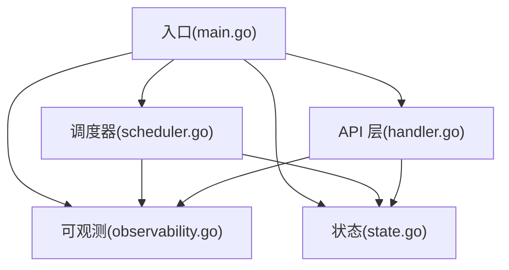
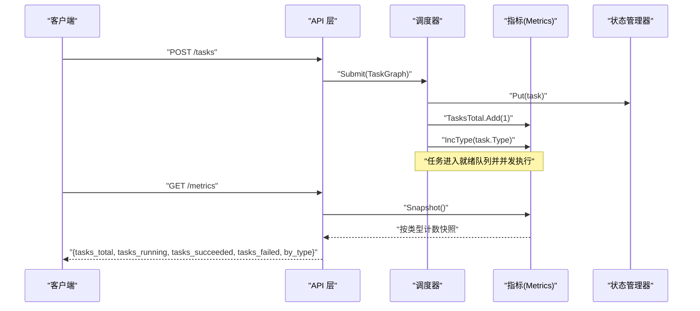
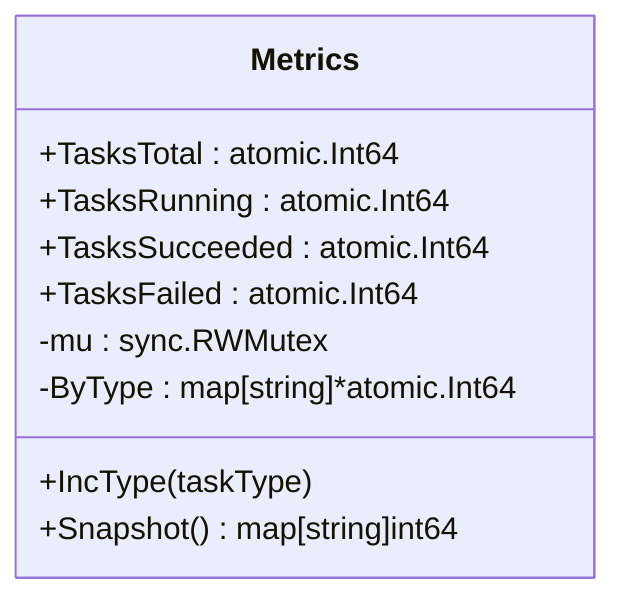
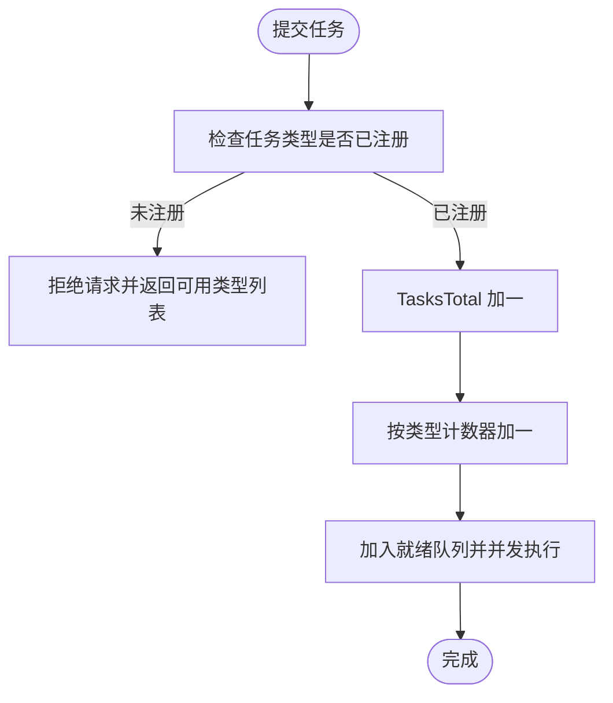
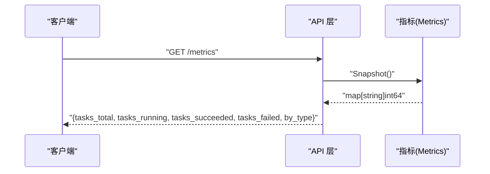
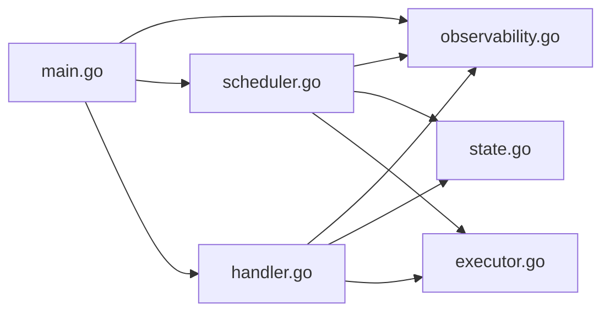

# 指标收集

<cite>
**本文引用的文件**
- [main.go](file://cmd/execgo/main.go)
- [observability.go](file://internal/observability/observability.go)
- [task.go](file://internal/models/task.go)
- [scheduler.go](file://internal/scheduler/scheduler.go)
- [state.go](file://internal/state/state.go)
- [handler.go](file://internal/api/handler.go)
- [executor.go](file://internal/executor/executor.go)
- [http.go](file://internal/executor/http.go)
- [shell.go](file://internal/executor/shell.go)
- [file.go](file://internal/executor/file.go)
- [README.md](file://README.md)
</cite>

## 目录
1. [简介](#简介)
2. [项目结构](#项目结构)
3. [核心组件](#核心组件)
4. [架构总览](#架构总览)
5. [详细组件分析](#详细组件分析)
6. [依赖关系分析](#依赖关系分析)
7. [性能考量](#性能考量)
8. [故障排查指南](#故障排查指南)
9. [结论](#结论)
10. [附录](#附录)

## 简介
本文件聚焦于 ExecGo 的指标收集系统，系统通过原子计数器记录任务总量、运行中任务数以及成功/失败任务数，并按任务类型进行动态统计。指标通过 /metrics 端点以 JSON 形式对外暴露，同时在调度器执行流程中实时更新，确保指标的实时性与准确性。本文将深入解析 Metrics 结构体设计、原子操作使用、类型维度统计机制、快照获取方法、/metrics 端点实现原理，并给出最佳实践、阈值与告警建议及性能优化注意事项。

## 项目结构
ExecGo 采用分层架构，指标系统位于 observability 包中，被调度器与 API 层共同消费：
- 入口程序负责初始化配置、日志、执行器注册、指标、状态管理器、调度器与 HTTP 服务
- 调度器在任务提交、执行、完成等关键节点更新指标
- API 层提供 /metrics 端点，聚合并返回指标快照
- 执行器注册表支持动态类型注册，从而支持按类型维度的指标统计

图表来源
- [main.go:25-104](file://cmd/execgo/main.go#L25-L104)
- [handler.go:39-52](file://internal/api/handler.go#L39-L52)
- [scheduler.go:34-45](file://internal/scheduler/scheduler.go#L34-L45)
- [observability.go:86-134](file://internal/observability/observability.go#L86-L134)
- [state.go:17-53](file://internal/state/state.go#L17-L53)

章节来源
- [main.go:25-104](file://cmd/execgo/main.go#L25-L104)
- [README.md:32-57](file://README.md#L32-L57)

## 核心组件
- 指标收集器 Metrics：使用原子计数器维护全局指标与按类型统计，并提供快照导出
- 调度器 Scheduler：在任务生命周期的关键阶段更新指标
- API Server：提供 /metrics 端点，聚合并返回指标
- 执行器注册表：支持动态注册与查询，驱动按类型统计

章节来源
- [observability.go:86-134](file://internal/observability/observability.go#L86-L134)
- [scheduler.go:69-97](file://internal/scheduler/scheduler.go#L69-L97)
- [handler.go:137-146](file://internal/api/handler.go#L137-L146)
- [executor.go:31-67](file://internal/executor/executor.go#L31-L67)

## 架构总览
指标系统贯穿 API、调度器与可观测模块，形成闭环的数据流：
- API 层接收请求，调用调度器提交任务，随后在 /metrics 端点返回指标
- 调度器在提交、执行、完成阶段更新原子计数器
- 指标快照通过 Snapshot 方法读取当前类型计数

图表来源
- [handler.go:58-99](file://internal/api/handler.go#L58-L99)
- [scheduler.go:69-97](file://internal/scheduler/scheduler.go#L69-L97)
- [observability.go:104-133](file://internal/observability/observability.go#L104-L133)

## 详细组件分析

### 指标结构体与原子操作设计
- 全局指标字段：任务总数、运行中任务数、成功任务数、失败任务数，均使用原子整型以保证并发安全
- 类型维度统计：ByType 映射任务类型到原子计数器，首次访问时惰性创建
- 读写锁保护：ByType 的读写使用 RWMutex，读多写少场景下提升并发性能
- 快照导出：Snapshot 在读锁下遍历 ByType，读取各类型计数并返回只读映射

图表来源
- [observability.go:86-134](file://internal/observability/observability.go#L86-L134)

章节来源
- [observability.go:86-134](file://internal/observability/observability.go#L86-L134)

### 指标含义与计算方式
- 任务总数（TasksTotal）：每次提交任务图时累加，反映系统累计处理的任务数量
- 运行中任务数（TasksRunning）：任务开始执行时加一，结束执行时减一；用于衡量系统并发负载
- 成功任务数（TasksSucceeded）：任务成功完成时加一
- 失败任务数（TasksFailed）：任务失败或因上游依赖失败而跳过时加一
- 按类型统计（ByType）：每提交一个任务即按其类型递增对应计数器，支持动态类型注册

章节来源
- [scheduler.go:70-97](file://internal/scheduler/scheduler.go#L70-L97)
- [scheduler.go:139-142](file://internal/scheduler/scheduler.go#L139-L142)
- [scheduler.go:196-200](file://internal/scheduler/scheduler.go#L196-L200)
- [scheduler.go:207-212](file://internal/scheduler/scheduler.go#L207-L212)
- [observability.go:104-120](file://internal/observability/observability.go#L104-L120)

### 动态类型注册与按类型统计机制
- 执行器注册：通过注册表支持动态注册内置与自定义执行器
- 类型维度统计：提交任务时根据 task.Type 调用 IncType，若该类型计数器不存在则惰性创建
- 类型可用性校验：API 层在提交任务前检查任务类型是否已注册，避免未注册类型导致的统计缺失

图表来源
- [executor.go:31-67](file://internal/executor/executor.go#L31-L67)
- [handler.go:76-85](file://internal/api/handler.go#L76-L85)
- [scheduler.go:76-82](file://internal/scheduler/scheduler.go#L76-L82)
- [observability.go:104-120](file://internal/observability/observability.go#L104-L120)

章节来源
- [executor.go:31-67](file://internal/executor/executor.go#L31-L67)
- [handler.go:76-85](file://internal/api/handler.go#L76-L85)
- [scheduler.go:76-82](file://internal/scheduler/scheduler.go#L76-L82)
- [observability.go:104-120](file://internal/observability/observability.go#L104-L120)

### 指标快照获取方法与数据结构
- 快照方法：Snapshot 在读锁下遍历 ByType，读取各类型计数并返回映射
- 数据结构：ByType 为 map[string]int64，键为任务类型，值为对应计数
- API 响应：/metrics 端点返回包含全局指标与按类型统计的 JSON 对象

图表来源
- [observability.go:122-133](file://internal/observability/observability.go#L122-L133)
- [handler.go:137-146](file://internal/api/handler.go#L137-L146)

章节来源
- [observability.go:122-133](file://internal/observability/observability.go#L122-L133)
- [handler.go:137-146](file://internal/api/handler.go#L137-L146)
- [task.go:141-148](file://internal/models/task.go#L141-L148)

### /metrics 端点实现原理与数据格式
- 路由注册：/metrics 由 API 层注册为 GET 路由
- 实现逻辑：读取各原子计数器当前值与快照映射，封装为统一响应对象
- 数据格式：包含全局指标与按类型统计字段，便于 Prometheus 等监控系统抓取

章节来源
- [handler.go:40-52](file://internal/api/handler.go#L40-L52)
- [handler.go:137-146](file://internal/api/handler.go#L137-L146)
- [task.go:141-148](file://internal/models/task.go#L141-L148)

### 实时性与准确性保证机制
- 原子计数：全局与类型计数均使用原子整型，避免竞态条件
- 读写分离：ByType 使用读写锁，读多写少场景下减少锁竞争
- 任务生命周期更新：在提交、开始执行、完成（成功/失败/跳过）等关键节点更新指标，确保统计准确
- 快照一致性：Snapshot 在读锁下一次性读取，避免跨读取期间的计数漂移

章节来源
- [observability.go:86-134](file://internal/observability/observability.go#L86-L134)
- [scheduler.go:76-82](file://internal/scheduler/scheduler.go#L76-L82)
- [scheduler.go:139-142](file://internal/scheduler/scheduler.go#L139-L142)
- [scheduler.go:196-200](file://internal/scheduler/scheduler.go#L196-L200)
- [scheduler.go:207-212](file://internal/scheduler/scheduler.go#L207-L212)

## 依赖关系分析
- 入口程序初始化指标并传入调度器与 API 层
- 调度器在任务生命周期中更新指标
- API 层在 /metrics 路由中读取指标并返回
- 执行器注册表为按类型统计提供类型来源

图表来源
- [main.go:44-62](file://cmd/execgo/main.go#L44-L62)
- [scheduler.go:34-45](file://internal/scheduler/scheduler.go#L34-L45)
- [handler.go:29-36](file://internal/api/handler.go#L29-L36)
- [executor.go:31-67](file://internal/executor/executor.go#L31-L67)

章节来源
- [main.go:44-62](file://cmd/execgo/main.go#L44-L62)
- [scheduler.go:34-45](file://internal/scheduler/scheduler.go#L34-L45)
- [handler.go:29-36](file://internal/api/handler.go#L29-L36)
- [executor.go:31-67](file://internal/executor/executor.go#L31-L67)

## 性能考量
- 原子计数器：全局与类型计数均使用原子整型，避免锁竞争，适合高并发场景
- 读写锁：ByType 使用 RWMutex，在读多写少场景下提升吞吐
- 快照读取：Snapshot 在读锁下一次性读取，避免跨读取期间的计数波动
- 内存占用：ByType 映射随任务类型增长，建议控制任务类型数量或周期性清理不活跃类型
- I/O 与网络：/metrics 端点为纯内存读取，开销极低；注意监控系统抓取频率，避免过度拉取

章节来源
- [observability.go:86-134](file://internal/observability/observability.go#L86-L134)

## 故障排查指南
- 指标异常为负：确认并发更新逻辑正确，避免重复 Add(-1) 或误用减量
- 类型计数缺失：检查任务类型是否已注册，API 层在提交前会校验类型可用性
- /metrics 返回空类型映射：确认任务已提交，否则 ByType 为空
- 并发冲突：若出现竞态，检查是否直接读取原子计数器而非快照，或在外部自行加锁

章节来源
- [handler.go:76-85](file://internal/api/handler.go#L76-L85)
- [scheduler.go:181](file://internal/scheduler/scheduler.go#L181)

## 结论
ExecGo 的指标系统以原子计数器为核心，结合读写锁与惰性类型计数，实现了高并发下的实时、准确统计。通过在任务生命周期的关键节点更新指标，并提供 /metrics 端点与快照导出，系统满足了可观测性需求。配合合理的监控策略与告警阈值，可有效保障系统稳定性与可运维性。

## 附录

### 指标字段定义与含义
- tasks_total：系统累计提交的任务总数
- tasks_running：当前正在执行的任务数
- tasks_succeeded：成功完成的任务数
- tasks_failed：失败或因上游依赖失败而跳过的任务数
- by_type：按任务类型划分的计数映射

章节来源
- [task.go:141-148](file://internal/models/task.go#L141-L148)

### /metrics 端点数据格式
- 返回 JSON 对象，包含上述字段
- 适用于 Prometheus 等监控系统抓取

章节来源
- [handler.go:137-146](file://internal/api/handler.go#L137-L146)
- [task.go:141-148](file://internal/models/task.go#L141-L148)

### 最佳实践与告警建议
- 指标采集
  - 使用 /metrics 端点定期抓取，建议频率不超过 15s
  - 结合任务类型分布，关注异常类型占比
- 阈值设置建议
  - tasks_running > 0 且长时间维持高位：可能并发过高，需调整 MaxConcurrency
  - tasks_failed / (tasks_succeeded + tasks_failed) 比例持续上升：检查执行器与任务参数
  - by_type 中某类型计数异常飙升：核查该类型任务的输入与执行器行为
- 告警配置
  - 连续 5 分钟 tasks_running 达到上限阈值
  - 失败率超过 5%
  - 某类型任务失败率超过 10%

章节来源
- [main.go:25-104](file://cmd/execgo/main.go#L25-L104)
- [scheduler.go:139-142](file://internal/scheduler/scheduler.go#L139-L142)
- [scheduler.go:196-200](file://internal/scheduler/scheduler.go#L196-L200)

### 执行器类型与动态注册
- 内置执行器：HTTP、Shell、File
- 动态注册：通过注册表支持新增自定义执行器，按类型统计随之生效

章节来源
- [executor.go:62-67](file://internal/executor/executor.go#L62-L67)
- [http.go:22-25](file://internal/executor/http.go#L22-L25)
- [shell.go:31-34](file://internal/executor/shell.go#L31-L34)
- [file.go:20-23](file://internal/executor/file.go#L20-L23)