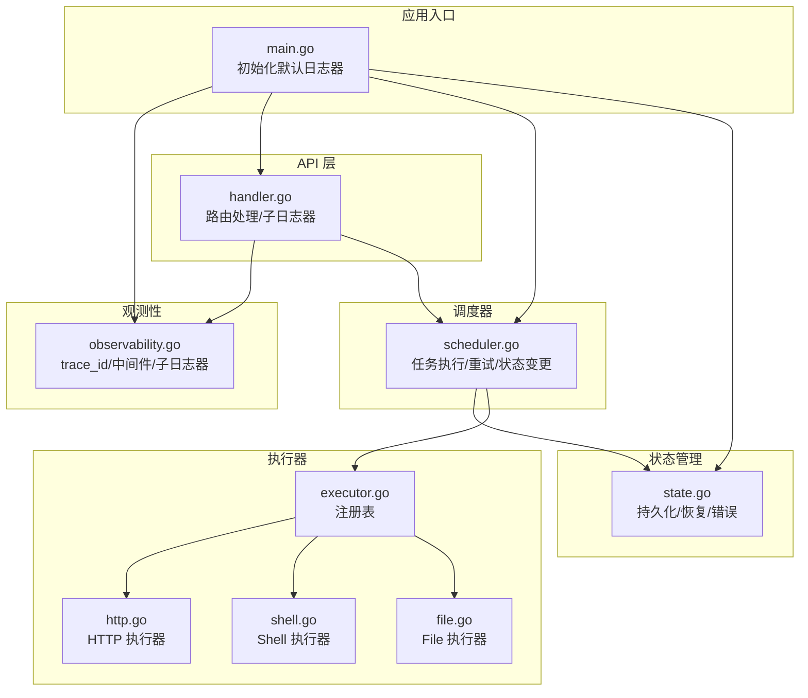
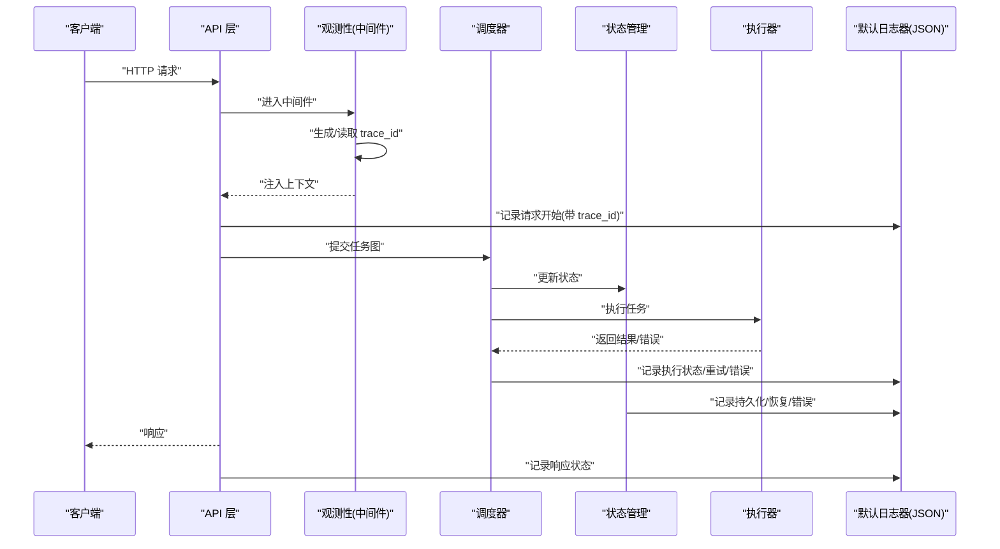
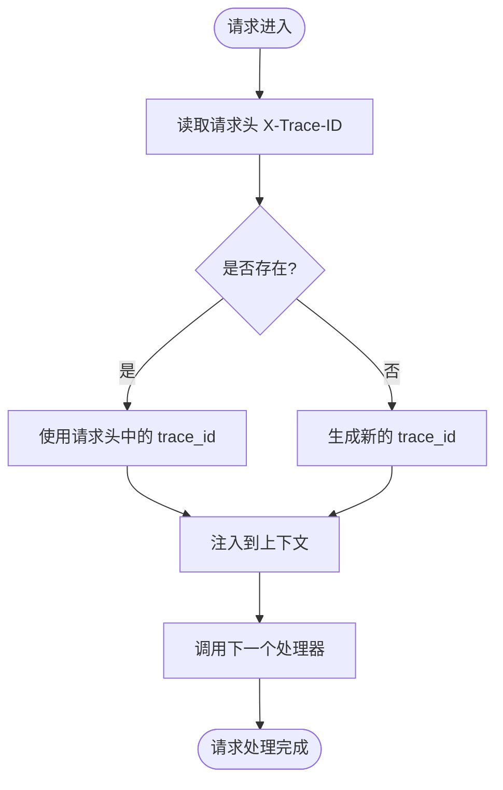
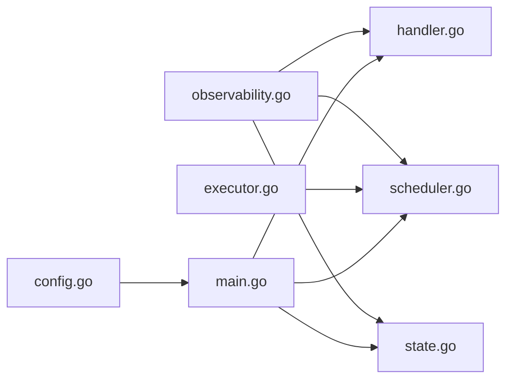

# 日志系统

<cite>
**本文档引用的文件**
- [cmd/execgo/main.go](file://cmd/execgo/main.go)
- [internal/observability/observability.go](file://internal/observability/observability.go)
- [internal/api/handler.go](file://internal/api/handler.go)
- [internal/scheduler/scheduler.go](file://internal/scheduler/scheduler.go)
- [internal/state/state.go](file://internal/state/state.go)
- [internal/executor/executor.go](file://internal/executor/executor.go)
- [internal/executor/http.go](file://internal/executor/http.go)
- [internal/executor/shell.go](file://internal/executor/shell.go)
- [internal/executor/file.go](file://internal/executor/file.go)
- [internal/models/task.go](file://internal/models/task.go)
- [internal/config/config.go](file://internal/config/config.go)
- [README.md](file://README.md)
- [go.mod](file://go.mod)
</cite>

## 目录
1. [简介](#简介)
2. [项目结构](#项目结构)
3. [核心组件](#核心组件)
4. [架构总览](#架构总览)
5. [详细组件分析](#详细组件分析)
6. [依赖分析](#依赖分析)
7. [性能考虑](#性能考虑)
8. [故障排查指南](#故障排查指南)
9. [结论](#结论)
10. [附录](#附录)

## 简介
本项目采用 Go 标准库的日志包 log/slog 实现结构化日志，并以 JSON 格式输出。日志系统贯穿应用入口、API 层、调度器、状态管理器以及执行器模块，统一通过默认日志器进行输出，并在 HTTP 中间件中自动注入 trace_id，便于跨组件追踪请求链路。本文档将系统性说明结构化日志的设计与实现、slog 使用方式、JSON 输出、日志级别配置、字段标准化、上下文传递机制、最佳实践、格式规范、常见场景示例与调试技巧。

## 项目结构
日志系统主要分布在以下位置：
- 应用入口：初始化默认日志器并设置为 JSON 格式，随后在各组件中直接使用默认日志器记录关键事件。
- 观测性模块：提供 trace_id 生成、注入、提取，以及基于 trace_id 的子日志器封装；提供 HTTP 中间件为每个请求注入 trace_id。
- API 层：路由处理函数中通过上下文获取 trace_id，构造带 trace_id 的子日志器进行记录。
- 调度器：在任务执行前后记录状态变更、重试、超时等关键事件。
- 状态管理器：记录持久化、恢复、错误等事件。
- 执行器：在执行具体任务时记录参数解析、执行结果与错误信息。

图表来源
- [cmd/execgo/main.go:25-104](file://cmd/execgo/main.go#L25-L104)
- [internal/observability/observability.go:50-80](file://internal/observability/observability.go#L50-L80)
- [internal/api/handler.go:58-99](file://internal/api/handler.go#L58-L99)
- [internal/scheduler/scheduler.go:127-190](file://internal/scheduler/scheduler.go#L127-L190)
- [internal/state/state.go:110-179](file://internal/state/state.go#L110-L179)
- [internal/executor/executor.go:31-67](file://internal/executor/executor.go#L31-L67)

章节来源
- [cmd/execgo/main.go:25-104](file://cmd/execgo/main.go#L25-L104)
- [internal/observability/observability.go:50-80](file://internal/observability/observability.go#L50-L80)
- [internal/api/handler.go:58-99](file://internal/api/handler.go#L58-L99)
- [internal/scheduler/scheduler.go:127-190](file://internal/scheduler/scheduler.go#L127-L190)
- [internal/state/state.go:110-179](file://internal/state/state.go#L110-L179)
- [internal/executor/executor.go:31-67](file://internal/executor/executor.go#L31-L67)

## 核心组件
- 结构化日志器：通过 JSON 处理器创建，默认级别为 Info。
- trace_id 上下文：在 HTTP 中间件中生成或读取 X-Trace-ID，注入到请求上下文并在日志中自动携带。
- 子日志器：根据上下文中的 trace_id 动态附加 trace_id 字段，确保跨组件日志关联。
- 日志级别：默认 Info，错误使用 Error，警告使用 Warn，一般性事件使用 Info。
- 字段标准化：统一使用小写短横线风格键名，如 task_id、task_type、error、addr 等，便于检索与聚合。

章节来源
- [internal/observability/observability.go:50-63](file://internal/observability/observability.go#L50-L63)
- [internal/observability/observability.go:69-80](file://internal/observability/observability.go#L69-L80)
- [internal/api/handler.go:58-61](file://internal/api/handler.go#L58-L61)
- [cmd/execgo/main.go:33-37](file://cmd/execgo/main.go#L33-L37)

## 架构总览
日志系统在应用启动时设置默认日志器，随后在各模块中直接使用默认日志器记录事件。HTTP 中间件负责 trace_id 的注入与传播，API 层在处理请求时使用带 trace_id 的子日志器记录请求生命周期事件。调度器在任务执行过程中记录状态变更、重试与错误；状态管理器记录持久化与恢复过程中的异常；执行器在执行具体任务时记录参数解析与执行结果。

图表来源
- [internal/observability/observability.go:69-80](file://internal/observability/observability.go#L69-L80)
- [internal/api/handler.go:58-99](file://internal/api/handler.go#L58-L99)
- [internal/scheduler/scheduler.go:127-190](file://internal/scheduler/scheduler.go#L127-L190)
- [internal/state/state.go:110-179](file://internal/state/state.go#L110-L179)
- [internal/executor/http.go:27-75](file://internal/executor/http.go#L27-L75)
- [internal/executor/shell.go:36-79](file://internal/executor/shell.go#L36-L79)
- [internal/executor/file.go:25-113](file://internal/executor/file.go#L25-L113)

## 详细组件分析

### 观测性与 trace_id 管理
- trace_id 生成：使用随机字节生成 16 字节十六进制字符串，失败时回退为 "unknown"。
- 上下文注入与提取：通过 WithTraceID 注入，TraceIDFromContext 提取，避免重复生成。
- 子日志器：L(ctx, logger) 在上下文存在 trace_id 时自动附加到日志字段。
- HTTP 中间件：优先读取请求头 X-Trace-ID，不存在则生成新的 trace_id；同时在响应头中回传该 ID，便于客户端与下游服务复用。

图表来源
- [internal/observability/observability.go:69-80](file://internal/observability/observability.go#L69-L80)
- [internal/observability/observability.go:58-63](file://internal/observability/observability.go#L58-L63)

章节来源
- [internal/observability/observability.go:24-44](file://internal/observability/observability.go#L24-L44)
- [internal/observability/observability.go:58-63](file://internal/observability/observability.go#L58-L63)
- [internal/observability/observability.go:69-80](file://internal/observability/observability.go#L69-L80)

### 结构化日志器与 JSON 输出
- 默认日志器：通过 JSON 处理器创建，级别默认为 Info。
- 使用方式：在 main.go 中设置为默认日志器，后续各模块直接使用默认日志器记录事件。
- 字段规范：统一使用小写短横线风格键名，如 addr、data_dir、max_concurrency、task_id、task_type、error 等。

章节来源
- [internal/observability/observability.go:50-55](file://internal/observability/observability.go#L50-L55)
- [cmd/execgo/main.go:30-31](file://cmd/execgo/main.go#L30-L31)

### API 层日志记录
- 路由处理：在每个路由处理函数中，先从上下文获取子日志器，然后围绕请求生命周期记录关键事件。
- 错误处理：对无效请求体、校验失败、未知任务类型等情况记录警告日志并返回相应状态码。
- 成功路径：记录任务提交成功、任务数量等信息。

章节来源
- [internal/api/handler.go:58-99](file://internal/api/handler.go#L58-L99)

### 调度器日志记录
- 启动与停止：记录调度器启动与停止事件。
- 任务执行：在执行前更新状态为 running，记录任务开始；在重试时记录尝试次数与退避时间；在失败时记录错误；在成功时记录完成。
- 状态变更：记录依赖失败导致的级联跳过与下游触发。

章节来源
- [internal/scheduler/scheduler.go:47-67](file://internal/scheduler/scheduler.go#L47-L67)
- [internal/scheduler/scheduler.go:127-190](file://internal/scheduler/scheduler.go#L127-L190)
- [internal/scheduler/scheduler.go:192-230](file://internal/scheduler/scheduler.go#L192-L230)

### 状态管理器日志记录
- 初始化：记录从磁盘加载状态失败时的警告与恢复时将 running 状态重置为 pending 的信息。
- 持久化：记录定期持久化与最终持久化的错误。
- 加载：记录从磁盘加载的状态数量。

章节来源
- [internal/state/state.go:37-52](file://internal/state/state.go#L37-L52)
- [internal/state/state.go:110-179](file://internal/state/state.go#L110-L179)

### 执行器日志记录
- HTTP 执行器：记录参数解析失败、请求创建失败、读取响应失败、状态码大于等于 400 的情况。
- Shell 执行器：记录参数解析失败、命令不在白名单、命令执行失败、输出与退出码。
- File 执行器：记录参数解析失败、读写删除统计等操作的错误与结果。

章节来源
- [internal/executor/http.go:27-75](file://internal/executor/http.go#L27-L75)
- [internal/executor/shell.go:36-79](file://internal/executor/shell.go#L36-L79)
- [internal/executor/file.go:25-113](file://internal/executor/file.go#L25-L113)

### 日志级别配置
- 默认级别：Info。可通过 HandlerOptions.Level 调整，例如在生产环境中提升到 Warn 或 Error 以减少日志量。
- 建议：开发阶段使用 Info，生产阶段根据需要调整到 Warn 或 Error，并结合外部日志系统进行分级采集。

章节来源
- [internal/observability/observability.go:52-54](file://internal/observability/observability.go#L52-L54)

### 日志字段标准化
- 统一键名：使用小写短横线风格，如 task_id、task_type、error、addr、data_dir、max_concurrency、retry、timeout、status 等。
- 字段含义：
  - trace_id：请求追踪标识，用于跨组件关联日志。
  - task_id：任务唯一标识。
  - task_type：任务类型，如 http、shell、file。
  - error：错误信息。
  - addr、data_dir、max_concurrency：配置项。
  - retry、timeout：任务重试次数与超时（毫秒）。
  - status：任务状态，如 pending、running、success、failed、skipped。
- 建议：新增字段遵循相同命名规范，避免混用驼峰或下划线风格。

章节来源
- [internal/observability/observability.go:58-63](file://internal/observability/observability.go#L58-L63)
- [internal/models/task.go:22-34](file://internal/models/task.go#L22-L34)
- [internal/config/config.go:11-16](file://internal/config/config.go#L11-L16)

### 日志上下文传递机制
- trace_id 注入：HTTP 中间件在请求进入时注入 trace_id 到上下文，并在响应头中回传。
- 子日志器：L(ctx, logger) 会自动从上下文中提取 trace_id 并附加到日志字段。
- 使用方式：在 API 层、调度器、状态管理器、执行器中均通过 L(ctx, logger) 获取带 trace_id 的子日志器，确保同一请求链路的日志具备相同的 trace_id。

章节来源
- [internal/observability/observability.go:69-80](file://internal/observability/observability.go#L69-L80)
- [internal/observability/observability.go:58-63](file://internal/observability/observability.go#L58-L63)
- [internal/api/handler.go:58-61](file://internal/api/handler.go#L58-L61)

### 日志记录最佳实践
- 在关键节点记录：启动、停止、提交、执行、完成、失败、重试、持久化、恢复等。
- 使用合适的级别：Info 记录正常流程，Warn 记录可恢复问题，Error 记录严重错误。
- 字段标准化：统一键名与语义，便于检索与聚合。
- trace_id：始终使用 L(ctx, logger) 获取子日志器，保证跨组件关联。
- 错误处理：对输入校验失败、未知类型、执行失败等情况记录详细错误信息与上下文字段。

章节来源
- [internal/api/handler.go:58-99](file://internal/api/handler.go#L58-L99)
- [internal/scheduler/scheduler.go:127-190](file://internal/scheduler/scheduler.go#L127-L190)
- [internal/state/state.go:110-179](file://internal/state/state.go#L110-L179)

### 日志格式规范与字段含义
- 输出格式：JSON。字段均为小写短横线风格。
- 常用字段：
  - time：日志时间戳（由 JSON 处理器自动添加）。
  - level：日志级别（info/warn/error）。
  - msg：消息文本。
  - trace_id：请求追踪标识。
  - 其他业务字段：如 task_id、task_type、error、addr、data_dir、max_concurrency、retry、timeout、status 等。
- 建议：在外部日志系统中建立字段映射，以便快速检索与告警。

章节来源
- [internal/observability/observability.go:50-55](file://internal/observability/observability.go#L50-L55)
- [internal/observability/observability.go:58-63](file://internal/observability/observability.go#L58-L63)
- [internal/models/task.go:22-34](file://internal/models/task.go#L22-L34)
- [internal/config/config.go:11-16](file://internal/config/config.go#L11-L16)

### 常见日志场景与示例代码路径
- 应用启动与配置：记录监听地址、数据目录、最大并发等。
  - 示例路径：[cmd/execgo/main.go:33-37](file://cmd/execgo/main.go#L33-L37)
- API 请求处理：记录请求体无效、校验失败、未知任务类型、提交成功等。
  - 示例路径：[internal/api/handler.go:64-84](file://internal/api/handler.go#L64-L84)
- 任务执行：记录任务开始、重试、超时、失败、成功等。
  - 示例路径：[internal/scheduler/scheduler.go:140-189](file://internal/scheduler/scheduler.go#L140-L189)
- 状态持久化：记录定期持久化与最终持久化的错误。
  - 示例路径：[internal/state/state.go:168-174](file://internal/state/state.go#L168-L174)
- 执行器错误：记录参数解析失败、命令不在白名单、执行失败等。
  - 示例路径：[internal/executor/http.go:29-56](file://internal/executor/http.go#L29-L56)
  - 示例路径：[internal/executor/shell.go:38-54](file://internal/executor/shell.go#L38-L54)
  - 示例路径：[internal/executor/file.go:27-51](file://internal/executor/file.go#L27-L51)

### 调试技巧
- 使用 trace_id 关联请求链路：在日志中搜索同一 trace_id，即可串联起从 API 到调度器再到执行器的完整调用链。
- 分级查看：在开发阶段使用 Info 级别，定位问题后切换到 Warn 或 Error 以减少噪声。
- 字段过滤：在外部日志系统中按 task_id、task_type、error 等字段过滤，快速定位问题。
- 健康检查与指标：通过 /health 与 /metrics 端点辅助判断系统健康状况与任务执行趋势。

章节来源
- [internal/api/handler.go:129-145](file://internal/api/handler.go#L129-L145)
- [internal/observability/observability.go:69-80](file://internal/observability/observability.go#L69-L80)

## 依赖分析
- 观测性模块被 API 层、调度器、状态管理器广泛依赖，形成统一的日志与追踪基础设施。
- 执行器模块通过注册表被调度器使用，日志记录发生在执行器内部，便于定位具体任务执行问题。
- 配置模块提供运行参数，影响日志输出的初始配置（如监听地址、数据目录、并发数等）。

图表来源
- [internal/observability/observability.go:50-80](file://internal/observability/observability.go#L50-L80)
- [internal/api/handler.go:58-99](file://internal/api/handler.go#L58-L99)
- [internal/scheduler/scheduler.go:127-190](file://internal/scheduler/scheduler.go#L127-L190)
- [internal/state/state.go:110-179](file://internal/state/state.go#L110-L179)
- [internal/executor/executor.go:31-67](file://internal/executor/executor.go#L31-L67)
- [internal/config/config.go:18-30](file://internal/config/config.go#L18-L30)
- [cmd/execgo/main.go:25-104](file://cmd/execgo/main.go#L25-L104)

章节来源
- [internal/observability/observability.go:50-80](file://internal/observability/observability.go#L50-L80)
- [internal/api/handler.go:58-99](file://internal/api/handler.go#L58-L99)
- [internal/scheduler/scheduler.go:127-190](file://internal/scheduler/scheduler.go#L127-L190)
- [internal/state/state.go:110-179](file://internal/state/state.go#L110-L179)
- [internal/executor/executor.go:31-67](file://internal/executor/executor.go#L31-L67)
- [internal/config/config.go:18-30](file://internal/config/config.go#L18-L30)
- [cmd/execgo/main.go:25-104](file://cmd/execgo/main.go#L25-L104)

## 性能考虑
- JSON 处理器开销：结构化日志输出为 JSON，相比文本日志有一定 CPU 开销，建议在高吞吐场景下调低日志级别或启用外部日志系统异步采集。
- trace_id 生成：使用随机字节生成，性能开销较小，且失败回退为 "unknown"，不影响稳定性。
- 子日志器附加：每次记录都会附加 trace_id，成本较低，建议在所有关键路径使用以保持一致性。
- 建议：在生产环境中结合外部日志系统（如 Loki、ELK、Cloud Logging）进行异步采集与索引，避免阻塞业务线程。

## 故障排查指南
- 无法找到执行器：检查任务类型是否在注册表中，确认已注册内置执行器或自定义执行器。
  - 参考路径：[internal/scheduler/scheduler.go:132-137](file://internal/scheduler/scheduler.go#L132-L137)
  - 参考路径：[internal/executor/executor.go:38-47](file://internal/executor/executor.go#L38-L47)
- 任务提交失败：检查请求体 JSON 是否有效、任务图校验是否通过、任务类型是否已注册。
  - 参考路径：[internal/api/handler.go:64-84](file://internal/api/handler.go#L64-L84)
- 执行器错误：针对 HTTP、Shell、File 执行器分别检查参数解析、URL/命令/路径合法性、权限与资源限制。
  - 参考路径：[internal/executor/http.go:29-56](file://internal/executor/http.go#L29-L56)
  - 参考路径：[internal/executor/shell.go:38-54](file://internal/executor/shell.go#L38-L54)
  - 参考路径：[internal/executor/file.go:27-51](file://internal/executor/file.go#L27-L51)
- 持久化失败：检查数据目录权限、磁盘空间、文件写入与原子重命名过程。
  - 参考路径：[internal/state/state.go:119-133](file://internal/state/state.go#L119-L133)
- trace_id 不一致：检查中间件是否正确注入与回传，确认客户端是否复用 X-Trace-ID。
  - 参考路径：[internal/observability/observability.go:69-80](file://internal/observability/observability.go#L69-L80)

章节来源
- [internal/scheduler/scheduler.go:132-137](file://internal/scheduler/scheduler.go#L132-L137)
- [internal/executor/executor.go:38-47](file://internal/executor/executor.go#L38-L47)
- [internal/api/handler.go:64-84](file://internal/api/handler.go#L64-L84)
- [internal/executor/http.go:29-56](file://internal/executor/http.go#L29-L56)
- [internal/executor/shell.go:38-54](file://internal/executor/shell.go#L38-L54)
- [internal/executor/file.go:27-51](file://internal/executor/file.go#L27-L51)
- [internal/state/state.go:119-133](file://internal/state/state.go#L119-L133)
- [internal/observability/observability.go:69-80](file://internal/observability/observability.go#L69-L80)

## 结论
本项目采用 Go 标准库 slog 实现结构化日志，以 JSON 格式输出，并通过 HTTP 中间件自动注入 trace_id，形成统一的跨组件日志追踪体系。通过在关键节点记录事件、标准化字段命名、合理使用日志级别，能够有效支撑可观测性需求。建议在生产环境中结合外部日志系统进行异步采集与索引，以获得更好的性能与可维护性。

## 附录
- 配置项与优先级：命令行标志 > 环境变量 > 默认值。
  - 参考路径：[internal/config/config.go:18-30](file://internal/config/config.go#L18-L30)
- 项目版本与 Go 版本：Go 1.24.5。
  - 参考路径：[go.mod:1-4](file://go.mod#L1-4)
- 项目概述与架构图：参见 README。
  - 参考路径：[README.md:11-57](file://README.md#L11-L57)