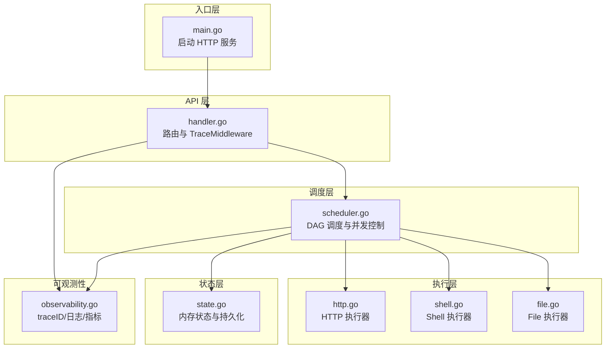
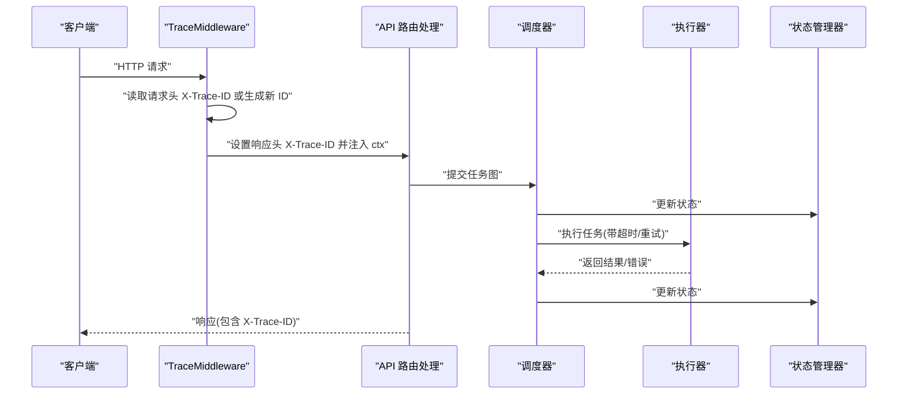
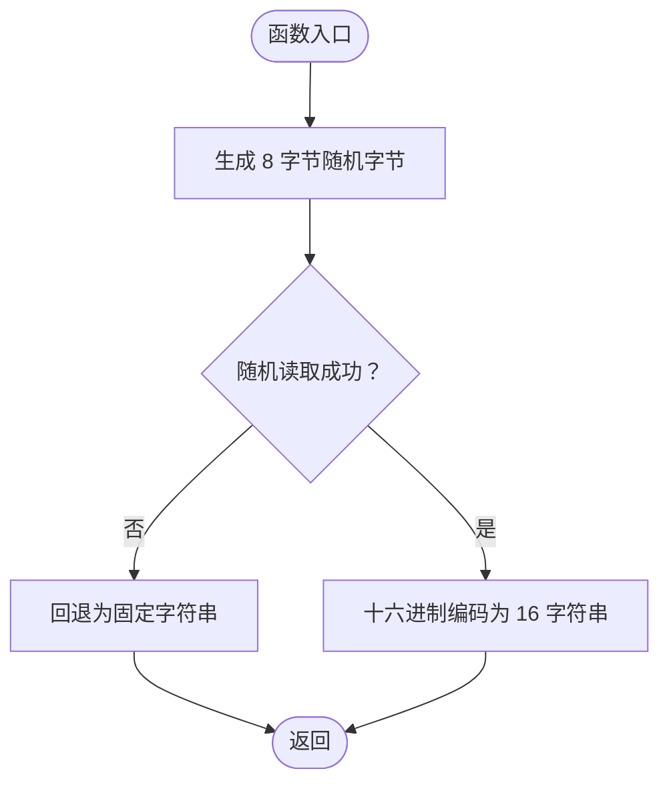
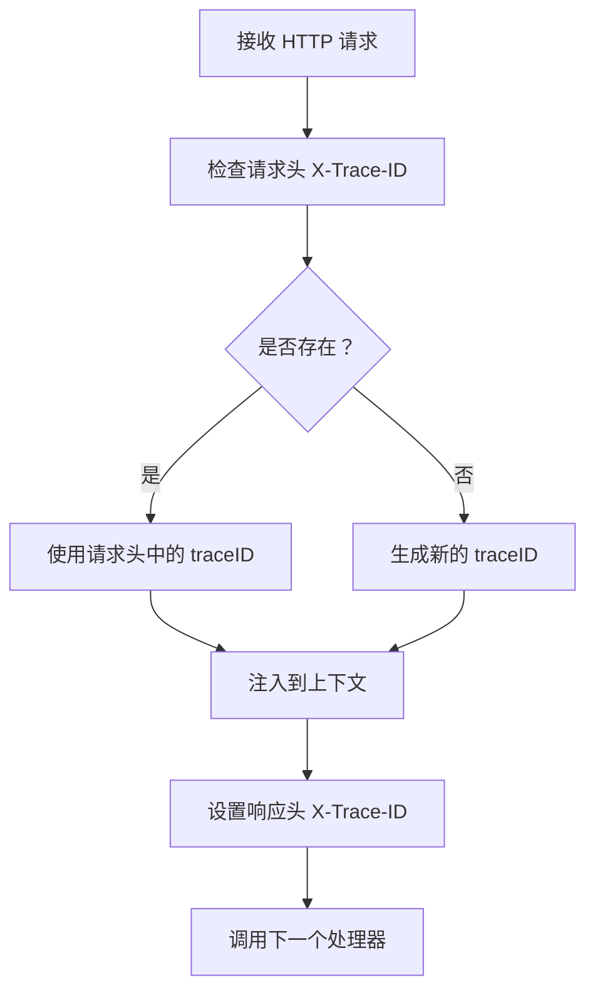
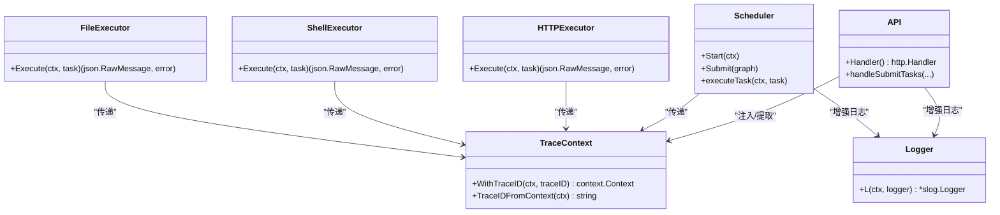
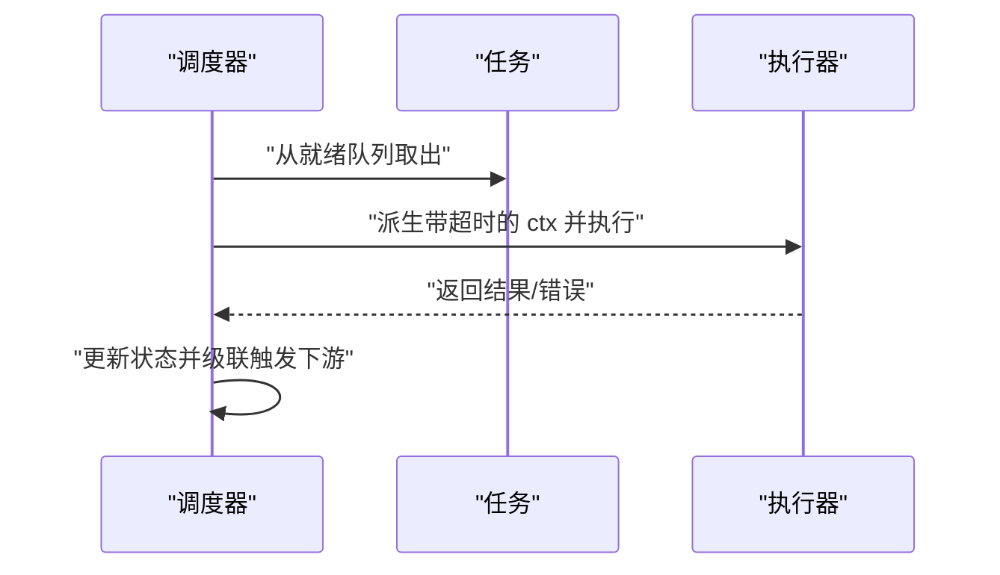
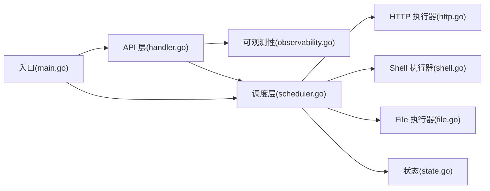

# 请求追踪

<cite>
**本文档引用的文件**
- [main.go](file://cmd/execgo/main.go)
- [observability.go](file://internal/observability/observability.go)
- [handler.go](file://internal/api/handler.go)
- [scheduler.go](file://internal/scheduler/scheduler.go)
- [task.go](file://internal/models/task.go)
- [state.go](file://internal/state/state.go)
- [http.go](file://internal/executor/http.go)
- [shell.go](file://internal/executor/shell.go)
- [file.go](file://internal/executor/file.go)
- [config.go](file://internal/config/config.go)
- [README.md](file://README.md)
- [go.mod](file://go.mod)
</cite>

## 目录
1. [简介](#简介)
2. [项目结构](#项目结构)
3. [核心组件](#核心组件)
4. [架构总览](#架构总览)
5. [详细组件分析](#详细组件分析)
6. [依赖关系分析](#依赖关系分析)
7. [性能考虑](#性能考虑)
8. [故障排查指南](#故障排查指南)
9. [结论](#结论)
10. [附录](#附录)

## 简介
本文件围绕请求追踪系统进行深入解析，重点覆盖以下方面：
- traceID 的生成算法与唯一性保障机制
- TraceMiddleware 中间件的工作原理（traceID 的注入、传播与响应头设置）
- traceID 在不同组件间的传递方式与获取方法
- 异步与并发场景下追踪上下文的一致性策略
- 分布式追踪场景的最佳实践与扩展方案
- 追踪 ID 的分析工具与调试技巧
- 与其他监控系统的集成方法

该系统采用纯 Go 标准库实现，具备零外部依赖、结构化日志、traceID 追踪与指标端点等可观测性能力。

## 项目结构
ExecGo 采用清晰的分层架构：
- 入口层：cmd/execgo/main.go 启动 HTTP 服务、初始化调度器与状态管理器
- API 层：internal/api/handler.go 提供 HTTP 路由与 TraceMiddleware 包装
- 调度层：internal/scheduler/scheduler.go 实现 DAG 任务调度与并发控制
- 执行层：internal/executor/* 提供 HTTP/Shell/File 等内置执行器
- 状态层：internal/state/state.go 管理内存状态与文件持久化
- 可观测性：internal/observability/observability.go 提供 traceID、日志与指标

图表来源
- [main.go:64-70](file://cmd/execgo/main.go#L64-L70)
- [handler.go:40-52](file://internal/api/handler.go#L40-L52)
- [scheduler.go:18-45](file://internal/scheduler/scheduler.go#L18-L45)
- [http.go:22-76](file://internal/executor/http.go#L22-L76)
- [shell.go:31-80](file://internal/executor/shell.go#L31-L80)
- [file.go:20-114](file://internal/executor/file.go#L20-L114)
- [state.go:17-53](file://internal/state/state.go#L17-L53)
- [observability.go:69-80](file://internal/observability/observability.go#L69-L80)

章节来源
- [README.md:32-57](file://README.md#L32-L57)
- [main.go:25-104](file://cmd/execgo/main.go#L25-L104)
- [handler.go:19-52](file://internal/api/handler.go#L19-L52)

## 核心组件
- traceID 生成与上下文传播：通过随机字节生成 16 字符十六进制字符串，并借助 context.Context 与自定义键进行注入与提取
- TraceMiddleware：为每个请求注入 traceID，若请求头携带则透传，否则生成新的 traceID；同时在响应头设置 X-Trace-ID
- 日志增强：L 函数根据 context 中的 traceID 动态附加到日志输出
- 指标收集：提供内存级指标聚合，便于追踪系统集成

章节来源
- [observability.go:24-44](file://internal/observability/observability.go#L24-L44)
- [observability.go:69-80](file://internal/observability/observability.go#L69-L80)
- [observability.go:57-63](file://internal/observability/observability.go#L57-L63)
- [observability.go:87-133](file://internal/observability/observability.go#L87-L133)

## 架构总览
请求从 HTTP 入口进入，TraceMiddleware 为每个请求生成或透传 traceID，并将其注入到请求上下文中。随后，API 层与调度层均通过 L(ctx, logger) 或直接从 ctx 提取 traceID，确保日志与业务流程的可追踪性。执行器在执行任务时也通过 context 传递 traceID，从而在异步与并发场景中保持一致的追踪上下文。

图表来源
- [observability.go:69-80](file://internal/observability/observability.go#L69-L80)
- [handler.go:40-52](file://internal/api/handler.go#L40-L52)
- [scheduler.go:69-97](file://internal/scheduler/scheduler.go#L69-L97)
- [http.go:27-75](file://internal/executor/http.go#L27-L75)
- [shell.go:36-79](file://internal/executor/shell.go#L36-L79)
- [file.go:25-113](file://internal/executor/file.go#L25-L113)
- [state.go:94-108](file://internal/state/state.go#L94-L108)

## 详细组件分析

### traceID 生成算法与唯一性保证
- 生成算法：使用加密安全的随机源生成 8 字节随机字节，再以十六进制编码为 16 字符字符串
- 唯一性保障：随机源熵高，十六进制长度为 16，理论上冲突概率极低；当随机源不可用时回退为固定字符串，确保系统可用性
- 上下文键：使用自定义键将 traceID 与请求上下文绑定，避免键冲突

图表来源
- [observability.go:24-31](file://internal/observability/observability.go#L24-L31)

章节来源
- [observability.go:20-31](file://internal/observability/observability.go#L20-L31)

### TraceMiddleware 中间件工作原理
- 注入：若请求头未携带 X-Trace-ID，则生成新的 traceID；若存在则透传
- 传播：将 traceID 注入到请求上下文中
- 响应：在响应头设置 X-Trace-ID，便于客户端与下游服务识别
- 包装：API 层在路由上统一包裹 TraceMiddleware，确保所有请求均被追踪

图表来源
- [observability.go:69-80](file://internal/observability/observability.go#L69-L80)
- [handler.go:40-52](file://internal/api/handler.go#L40-L52)

章节来源
- [observability.go:69-80](file://internal/observability/observability.go#L69-L80)
- [handler.go:40-52](file://internal/api/handler.go#L40-L52)

### traceID 在不同组件间的传递与获取
- API 层：通过 L(ctx, logger) 将 traceID 注入日志；handleSubmitTasks 等处理器从 ctx 提取 traceID
- 调度层：在任务执行前后记录日志并使用 traceID；执行器通过 context 传递 traceID
- 执行器：HTTP/Shell/File 执行器均通过 context 传递 traceID，确保跨组件一致性

图表来源
- [observability.go:33-44](file://internal/observability/observability.go#L33-L44)
- [observability.go:57-63](file://internal/observability/observability.go#L57-L63)
- [handler.go:58-99](file://internal/api/handler.go#L58-L99)
- [scheduler.go:127-190](file://internal/scheduler/scheduler.go#L127-L190)
- [http.go:27-75](file://internal/executor/http.go#L27-L75)
- [shell.go:36-79](file://internal/executor/shell.go#L36-L79)
- [file.go:25-113](file://internal/executor/file.go#L25-L113)

章节来源
- [handler.go:58-99](file://internal/api/handler.go#L58-L99)
- [scheduler.go:127-190](file://internal/scheduler/scheduler.go#L127-L190)
- [http.go:27-75](file://internal/executor/http.go#L27-L75)
- [shell.go:36-79](file://internal/executor/shell.go#L36-L79)
- [file.go:25-113](file://internal/executor/file.go#L25-L113)

### 异步与并发场景下的追踪上下文一致性
- 并发控制：调度器使用信号量控制最大并发，goroutine 执行任务时通过 context 传递 traceID
- 超时与重试：执行器在每次尝试前基于父上下文派生带超时的子上下文，确保 traceID 在超时/重试链路中保持一致
- 级联触发：完成任务后按依赖图级联触发下游任务，traceID 在整条链路中贯穿

图表来源
- [scheduler.go:109-125](file://internal/scheduler/scheduler.go#L109-L125)
- [scheduler.go:127-190](file://internal/scheduler/scheduler.go#L127-L190)
- [http.go:45-57](file://internal/executor/http.go#L45-L57)
- [shell.go:56-65](file://internal/executor/shell.go#L56-L65)
- [file.go:35-51](file://internal/executor/file.go#L35-L51)

章节来源
- [scheduler.go:109-125](file://internal/scheduler/scheduler.go#L109-L125)
- [scheduler.go:127-190](file://internal/scheduler/scheduler.go#L127-L190)

### 分布式追踪场景的最佳实践与扩展方案
- 头部规范：统一使用 X-Trace-ID 作为追踪 ID 的请求/响应头字段
- 透传策略：上游服务透传 X-Trace-ID，下游服务可选择复用或生成新的 traceID
- 与 OpenTelemetry 集成：可将 traceID 映射为 traceId，结合采样策略与导出器实现分布式追踪
- 与指标系统集成：利用 /metrics 端点与 traceID 进行关联查询，实现端到端性能分析

章节来源
- [observability.go:69-80](file://internal/observability/observability.go#L69-L80)
- [handler.go:137-146](file://internal/api/handler.go#L137-L146)

## 依赖关系分析
- 组件耦合：API 层与可观测性模块强耦合（TraceMiddleware），调度层与可观测性模块弱耦合（通过日志与指标）
- 外部依赖：纯标准库，无第三方依赖
- 循环依赖：未发现循环导入

图表来源
- [handler.go:40-52](file://internal/api/handler.go#L40-L52)
- [observability.go:69-80](file://internal/observability/observability.go#L69-L80)
- [scheduler.go:18-45](file://internal/scheduler/scheduler.go#L18-L45)
- [http.go:22-76](file://internal/executor/http.go#L22-L76)
- [shell.go:31-80](file://internal/executor/shell.go#L31-L80)
- [file.go:20-114](file://internal/executor/file.go#L20-L114)
- [state.go:17-53](file://internal/state/state.go#L17-L53)
- [main.go:62-69](file://cmd/execgo/main.go#L62-L69)

章节来源
- [go.mod:1-4](file://go.mod#L1-L4)
- [main.go:17-22](file://cmd/execgo/main.go#L17-L22)

## 性能考虑
- traceID 生成成本极低：仅一次随机读取与一次十六进制编码
- 中间件开销最小：仅在请求进入时进行一次头读取/生成与一次上下文注入
- 日志增强无额外网络开销：仅在日志输出时附加 traceID
- 指标收集使用原子计数器，避免锁竞争

## 故障排查指南
- traceID 缺失：确认请求头是否正确设置 X-Trace-ID；检查 TraceMiddleware 是否正确包裹路由
- 日志未显示 traceID：确认 L(ctx, logger) 是否在日志输出前调用
- 并发执行异常：检查调度器的最大并发配置与任务超时设置
- 指标不更新：确认 /metrics 端点访问权限与指标初始化

章节来源
- [observability.go:69-80](file://internal/observability/observability.go#L69-L80)
- [observability.go:57-63](file://internal/observability/observability.go#L57-L63)
- [handler.go:137-146](file://internal/api/handler.go#L137-L146)
- [scheduler.go:34-45](file://internal/scheduler/scheduler.go#L34-L45)

## 结论
ExecGo 的请求追踪系统以简洁高效为核心设计目标：通过标准库实现的 traceID 生成与上下文传播，配合 TraceMiddleware 的统一注入与响应头设置，实现了端到端的可追踪性。在异步与并发场景中，通过 context 与 goroutine 的组合，确保了追踪上下文的一致性。结合 /metrics 端点与结构化日志，系统具备良好的可观测性基础，可进一步扩展至分布式追踪与更广泛的监控体系。

## 附录
- 配置项参考：HTTP 地址、数据目录、最大并发、优雅关闭超时
- 扩展自定义执行器：实现 Executor 接口并通过注册表注册
- 任务 DSL 规范：id、type、params、depends_on、retry、timeout、status

章节来源
- [config.go:10-30](file://internal/config/config.go#L10-L30)
- [README.md:229-249](file://README.md#L229-L249)
- [task.go:21-39](file://internal/models/task.go#L21-L39)