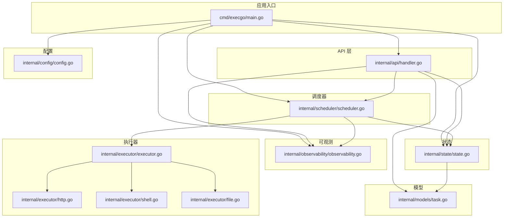
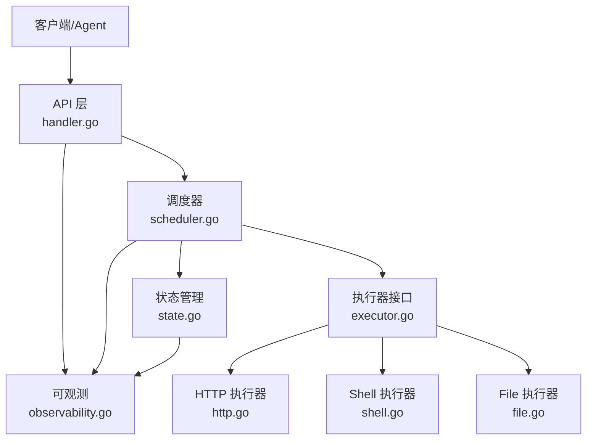
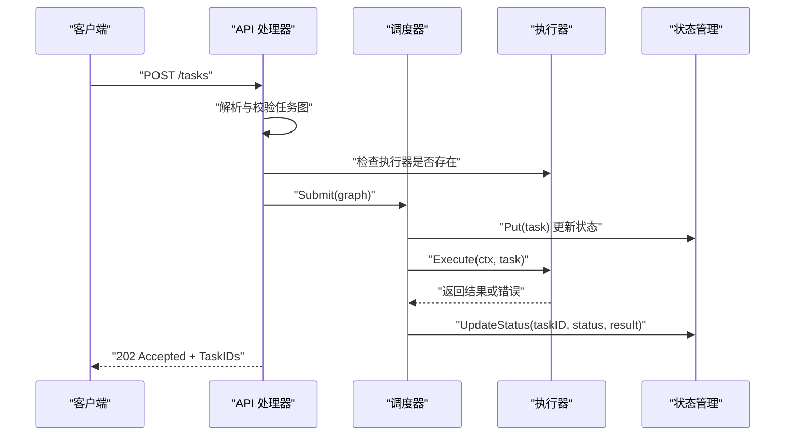
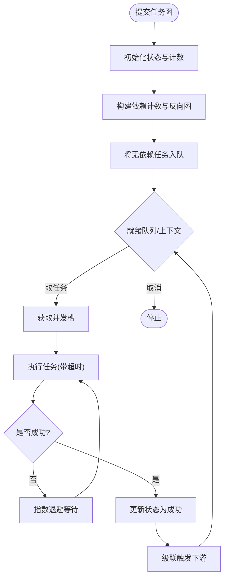
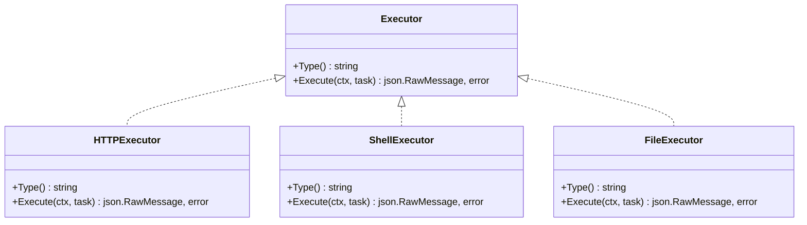
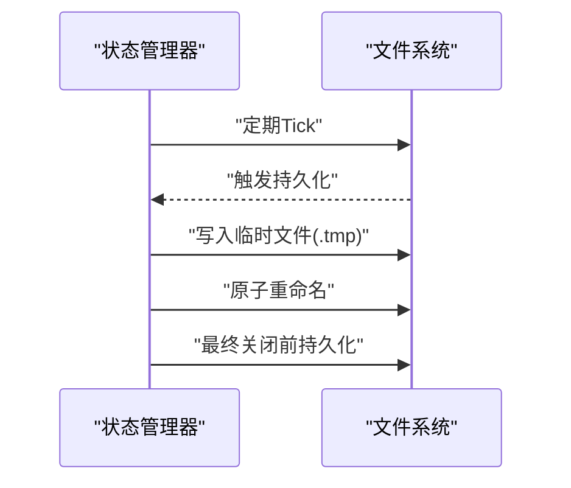
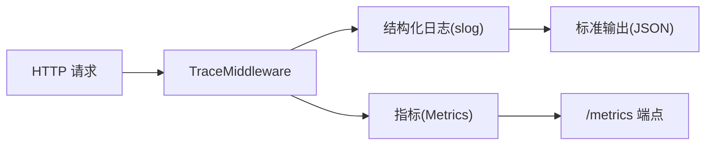
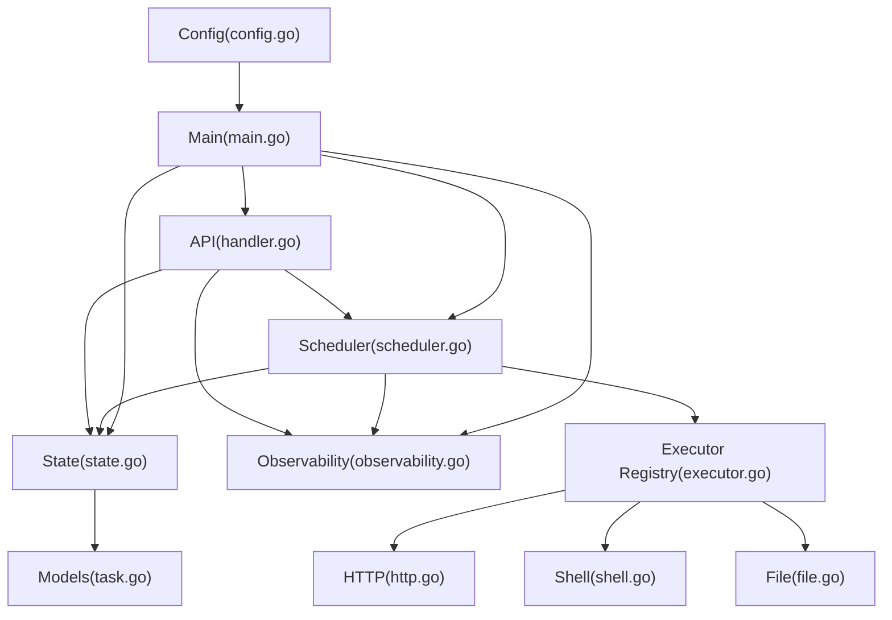

# 开发指南

<cite>
**本文档引用的文件**
- [main.go](file://cmd/execgo/main.go)
- [handler.go](file://internal/api/handler.go)
- [config.go](file://internal/config/config.go)
- [executor.go](file://internal/executor/executor.go)
- [http.go](file://internal/executor/http.go)
- [shell.go](file://internal/executor/shell.go)
- [file.go](file://internal/executor/file.go)
- [task.go](file://internal/models/task.go)
- [observability.go](file://internal/observability/observability.go)
- [scheduler.go](file://internal/scheduler/scheduler.go)
- [state.go](file://internal/state/state.go)
- [go.mod](file://go.mod)
- [README.md](file://README.md)
</cite>

## 目录
1. [简介](#简介)
2. [项目结构](#项目结构)
3. [核心组件](#核心组件)
4. [架构总览](#架构总览)
5. [详细组件分析](#详细组件分析)
6. [依赖分析](#依赖分析)
7. [性能考量](#性能考量)
8. [故障排查指南](#故障排查指南)
9. [结论](#结论)
10. [附录](#附录)

## 简介
ExecGo 是一个使用纯 Go 标准库构建的极简 AI 执行引擎，提供任务提交、DAG 调度、并发执行与可观测性能力。项目采用分层架构，包含 API 层、调度器、执行器、状态管理与可观测模块，支持零第三方依赖、可插拔执行器与优雅关闭。

## 项目结构
项目采用按功能域划分的包组织方式，主要目录如下：
- cmd/execgo：应用入口，负责初始化配置、组件与 HTTP 服务
- internal/api：HTTP API 层，提供任务提交、查询、删除、健康检查与指标端点
- internal/config：配置管理，支持命令行参数与环境变量
- internal/executor：执行器接口与内置执行器（HTTP、Shell、File），支持注册表扩展
- internal/models：核心数据结构（任务、任务图、状态枚举等）
- internal/observability：结构化日志、请求追踪与指标收集
- internal/scheduler：DAG 任务调度器，基于依赖计数与并发信号量
- internal/state：任务状态内存管理与 JSON 文件持久化

图表来源
- [main.go:25-104](file://cmd/execgo/main.go#L25-L104)
- [handler.go:29-52](file://internal/api/handler.go#L29-L52)
- [config.go:20-30](file://internal/config/config.go#L20-L30)
- [executor.go:31-67](file://internal/executor/executor.go#L31-L67)
- [http.go:23-75](file://internal/executor/http.go#L23-75)
- [shell.go:32-79](file://internal/executor/shell.go#L32-79)
- [file.go:21-113](file://internal/executor/file.go#L21-113)
- [task.go:22-39](file://internal/models/task.go#L22-L39)
- [observability.go:50-80](file://internal/observability/observability.go#L50-L80)
- [scheduler.go:35-58](file://internal/scheduler/scheduler.go#L35-L58)
- [state.go:26-53](file://internal/state/state.go#L26-L53)

章节来源
- [README.md:149-177](file://README.md#L149-L177)
- [go.mod:1-4](file://go.mod#L1-L4)

## 核心组件
- 应用入口：加载配置、初始化日志、注册执行器、启动调度器与 HTTP 服务，并处理优雅关闭
- API 层：提供任务提交、查询、删除、健康检查与指标端点，统一错误响应
- 配置管理：支持命令行参数与环境变量，优先级为 flag > env > default
- 执行器：定义统一接口与全局注册表，内置 HTTP、Shell、File 执行器
- 调度器：基于 Kahn 算法的 DAG 调度，支持并发控制、重试与超时
- 状态管理：内存存储与 JSON 文件持久化，支持周期性与最终持久化
- 可观测：结构化日志、请求追踪（traceID）、指标收集与 /metrics 端点

章节来源
- [main.go:25-104](file://cmd/execgo/main.go#L25-L104)
- [handler.go:29-157](file://internal/api/handler.go#L29-L157)
- [config.go:20-46](file://internal/config/config.go#L20-L46)
- [executor.go:14-67](file://internal/executor/executor.go#L14-L67)
- [scheduler.go:18-231](file://internal/scheduler/scheduler.go#L18-L231)
- [state.go:17-180](file://internal/state/state.go#L17-L180)
- [observability.go:86-134](file://internal/observability/observability.go#L86-L134)

## 架构总览
ExecGo 采用分层架构，API 层负责请求接入与校验，调度器负责任务编排与并发控制，执行器负责具体任务执行，状态管理负责内存与持久化，可观测模块贯穿各层提供日志、追踪与指标。

图表来源
- [handler.go:40-52](file://internal/api/handler.go#L40-L52)
- [scheduler.go:35-58](file://internal/scheduler/scheduler.go#L35-L58)
- [executor.go:31-67](file://internal/executor/executor.go#L31-L67)
- [http.go:23-75](file://internal/executor/http.go#L23-75)
- [shell.go:32-79](file://internal/executor/shell.go#L32-79)
- [file.go:21-113](file://internal/executor/file.go#L21-113)
- [state.go:26-53](file://internal/state/state.go#L26-L53)
- [observability.go:50-80](file://internal/observability/observability.go#L50-L80)

## 详细组件分析

### API 层组件分析
- 职责：路由定义、请求解析与校验、调用调度器、返回统一响应格式
- 关键流程：handleSubmitTasks 校验任务图合法性与执行器存在性，提交到调度器；handleGetTask/handleListTasks/handleDeleteTask 提供状态查询与删除；handleHealth/handleMetrics 提供健康检查与指标
- 错误处理：对无效 JSON、校验失败、未知执行器类型返回相应错误码与消息

图表来源
- [handler.go:59-99](file://internal/api/handler.go#L59-L99)
- [scheduler.go:70-97](file://internal/scheduler/scheduler.go#L70-L97)
- [executor.go:38-48](file://internal/executor/executor.go#L38-L48)
- [state.go:56-108](file://internal/state/state.go#L56-L108)

章节来源
- [handler.go:29-157](file://internal/api/handler.go#L29-L157)

### 调度器组件分析
- 职责：接收任务图，构建依赖计数与反向依赖图，维护就绪队列与并发信号量，执行任务并级联处理下游依赖
- 关键算法：Kahn 算法拓扑排序检测环；指数退避重试；超时控制；失败级联跳过
- 并发模型：goroutine + channel + 信号量；使用 WaitGroup 管理工作协程生命周期

图表来源
- [scheduler.go:69-231](file://internal/scheduler/scheduler.go#L69-L231)

章节来源
- [scheduler.go:18-231](file://internal/scheduler/scheduler.go#L18-L231)

### 执行器组件分析
- 接口：Executor(Type, Execute)，全局注册表支持动态扩展
- 内置执行器：
  - HTTPExecutor：支持指定 URL、Method、Headers、Body，限制响应体大小，状态码>=400仍返回结果
  - ShellExecutor：白名单命令安全执行，支持工作目录，返回 stdout/stderr/exit_code
  - FileExecutor：支持 read/write/append/delete/stat，路径清理防止目录穿越
- 扩展方式：实现 Executor 接口并通过 Register 注册

图表来源
- [executor.go:14-67](file://internal/executor/executor.go#L14-L67)
- [http.go:23-75](file://internal/executor/http.go#L23-75)
- [shell.go:32-79](file://internal/executor/shell.go#L32-79)
- [file.go:21-113](file://internal/executor/file.go#L21-113)

章节来源
- [executor.go:14-67](file://internal/executor/executor.go#L14-L67)
- [http.go:14-75](file://internal/executor/http.go#L14-L75)
- [shell.go:14-79](file://internal/executor/shell.go#L14-L79)
- [file.go:13-113](file://internal/executor/file.go#L13-L113)

### 状态管理组件分析
- 职责：内存存储任务，提供原子更新状态、查询、删除；定期与最终持久化到 JSON 文件
- 恢复策略：启动时加载磁盘状态，将 running 状态重置为 pending
- 持久化策略：先写临时文件再原子重命名，避免部分写入

图表来源
- [state.go:160-179](file://internal/state/state.go#L160-L179)
- [state.go:110-134](file://internal/state/state.go#L110-L134)
- [state.go:137-158](file://internal/state/state.go#L137-L158)

章节来源
- [state.go:17-180](file://internal/state/state.go#L17-L180)

### 可观测组件分析
- 结构化日志：JSON 格式输出，支持 traceID 注入与提取
- 请求追踪：中间件为每个请求注入 traceID，响应头回传
- 指标收集：原子计数器统计任务总数、运行中、成功、失败及按类型分布

图表来源
- [observability.go:69-80](file://internal/observability/observability.go#L69-L80)
- [observability.go:50-63](file://internal/observability/observability.go#L50-L63)
- [observability.go:86-134](file://internal/observability/observability.go#L86-L134)

章节来源
- [observability.go:1-134](file://internal/observability/observability.go#L1-L134)

## 依赖分析
- 内部依赖：API 层依赖调度器、状态管理与可观测；调度器依赖状态管理、可观测与执行器注册表；执行器注册表依赖模型；状态管理依赖模型；可观测模块独立
- 外部依赖：纯 Go 标准库，零第三方依赖
- 配置来源：命令行参数优先于环境变量，再回退到默认值

图表来源
- [handler.go:12-17](file://internal/api/handler.go#L12-L17)
- [scheduler.go:12-16](file://internal/scheduler/scheduler.go#L12-L16)
- [executor.go:5-12](file://internal/executor/executor.go#L5-L12)
- [state.go:14](file://internal/state/state.go#L14)
- [config.go:4-8](file://internal/config/config.go#L4-L8)
- [main.go:17-23](file://cmd/execgo/main.go#L17-L23)

章节来源
- [go.mod:1-4](file://go.mod#L1-L4)
- [config.go:20-46](file://internal/config/config.go#L20-L46)

## 性能考量
- 并发控制：通过信号量限制最大并发，避免资源争用；就绪队列容量与背压策略需结合业务负载调整
- 调度开销：Kahn 算法拓扑排序在任务较多时可能成为瓶颈，建议控制单次提交任务数量
- I/O 优化：文件执行器写入使用追加/截断标志，减少不必要的覆盖；HTTP 执行器限制响应体大小避免内存膨胀
- 持久化频率：定期持久化间隔与优雅关闭前最终持久化平衡数据安全与性能
- 指标采样：指标使用原子计数器，读写开销低，适合高频访问

## 故障排查指南
- 健康检查：通过 /health 端点确认服务可用性与运行时间
- 指标监控：通过 /metrics 端点查看任务总数、运行中、成功、失败与按类型分布
- 日志定位：启用结构化日志，结合 traceID 在日志中快速定位请求链路
- 常见问题：
  - 任务提交失败：检查任务图合法性（空图、重复 ID、自依赖、环依赖）
  - 执行器不存在：确认执行器类型是否正确且已注册
  - 超时/重试：根据任务超时设置与重试次数调整，观察指数退避效果
  - 状态不一致：重启后 running 状态会重置为 pending，确保持久化正常

章节来源
- [handler.go:129-146](file://internal/api/handler.go#L129-L146)
- [observability.go:50-80](file://internal/observability/observability.go#L50-L80)
- [task.go:42-79](file://internal/models/task.go#L42-L79)

## 结论
ExecGo 以极简设计实现了生产级的 AI 执行引擎，具备良好的扩展性、可观测性与韧性。通过清晰的分层架构与标准库实现，开发者可以快速扩展执行器、定制调度策略并集成到 AI Agent 生态中。

## 附录

### 开发环境搭建
- Go 版本要求：参考模块声明的 Go 版本
- 依赖管理：纯标准库，无需额外依赖
- 构建与运行：使用命令行参数或环境变量进行配置

章节来源
- [go.mod:3](file://go.mod#L3)
- [README.md:63-77](file://README.md#L63-L77)

### 扩展开发指南
- 添加新的执行器：
  - 实现 Executor 接口（Type、Execute）
  - 在 init 中调用 Register 注册
  - 在任务图中使用该类型
- 修改调度算法：
  - 可在调度器中调整并发信号量、就绪队列容量与重试策略
  - 如需更复杂的调度策略，可在现有 DAG 基础上扩展
- 扩展现有功能：
  - 在 API 层增加新路由与处理器
  - 在状态管理中新增字段或行为
  - 在可观测模块中新增指标或日志字段

章节来源
- [executor.go:14-67](file://internal/executor/executor.go#L14-L67)
- [scheduler.go:35-58](file://internal/scheduler/scheduler.go#L35-L58)
- [handler.go:29-52](file://internal/api/handler.go#L29-L52)
- [state.go:56-108](file://internal/state/state.go#L56-L108)
- [observability.go:86-134](file://internal/observability/observability.go#L86-L134)

### 测试策略与用例编写
- 单元测试：
  - 对执行器的 Execute 方法进行参数校验与边界条件测试
  - 对调度器 Submit 与 completeTask 进行 DAG 正确性与级联行为验证
  - 对状态管理的 Put/Get/Update/Delete/持久化进行并发与一致性测试
- 集成测试：
  - 通过 API 层发起任务提交，验证调度与执行链路
  - 验证健康检查与指标端点的正确性
- 性能测试：
  - 并发场景下测试调度器吞吐与延迟
  - 持久化频率对性能的影响评估

### 代码贡献流程与编码规范
- 提交流程：遵循仓库的提交与审查流程（建议在仓库中补充）
- 编码规范：遵循 Go 社区通用规范，保持简洁与可读性，注释清晰描述职责与边界

### 调试技巧与性能分析
- 调试技巧：利用结构化日志与 traceID 快速定位问题；通过 /metrics 与 /health 辅助诊断
- 性能分析：使用 Go pprof 分析 CPU 与内存热点；结合指标观察并发与持久化开销

### 常见问题与最佳实践
- 任务图合法性：始终在提交前进行校验，避免环依赖与自依赖
- 安全性：Shell 执行器使用白名单命令，File 执行器进行路径清理
- 可靠性：合理设置重试与超时，关注失败级联跳过策略
- 可观测性：统一使用结构化日志与 traceID，定期导出指标

### 版本发布流程与兼容性
- 发布流程：建议在仓库中补充版本标签与变更记录
- 向后兼容：扩展执行器与新增 API 时注意保持现有接口稳定，必要时引入版本化策略