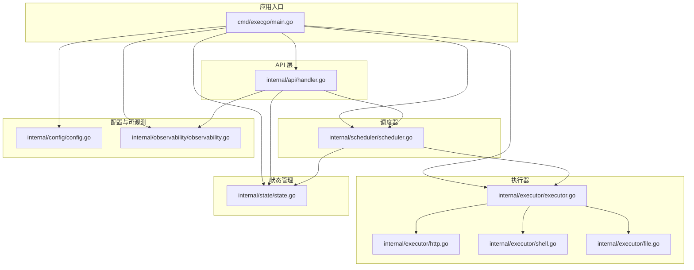
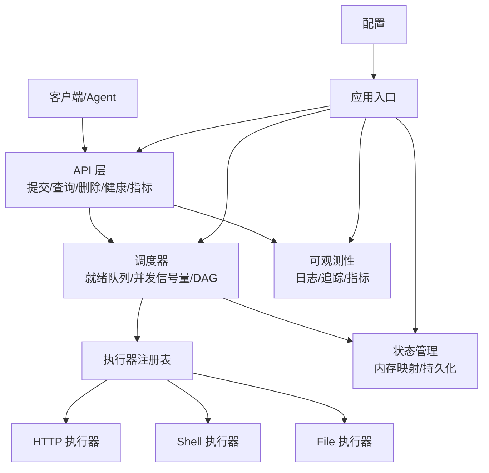
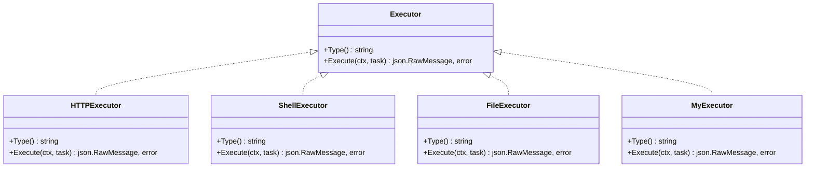
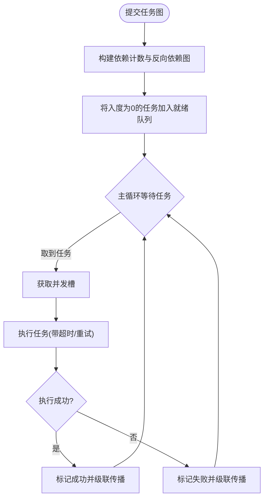
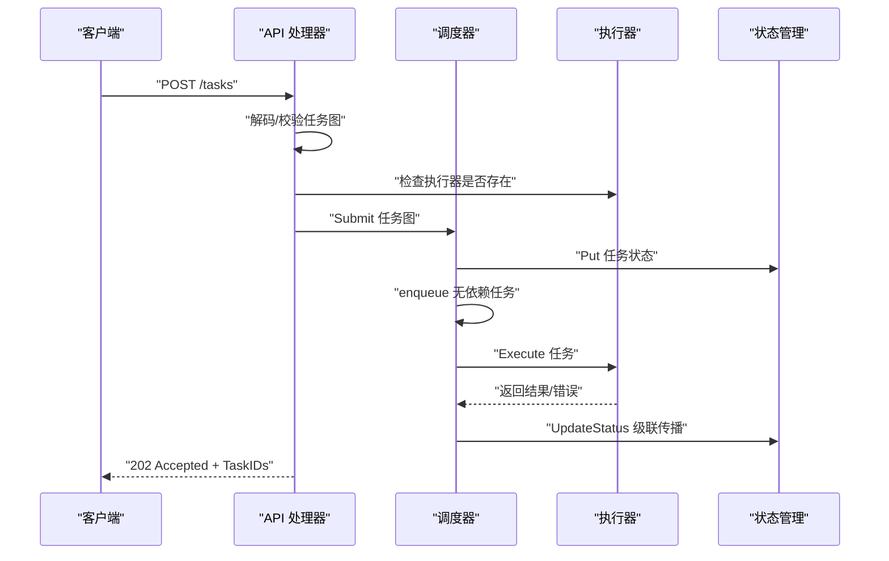
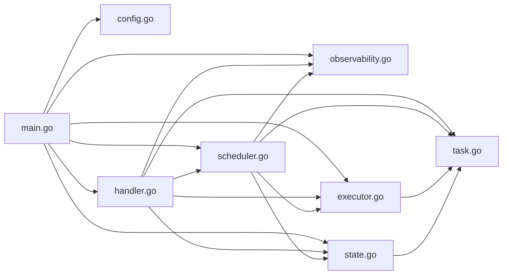

# 扩展开发指南

<cite>
**本文档引用的文件**
- [main.go](file://cmd/execgo/main.go)
- [executor.go](file://internal/executor/executor.go)
- [http.go](file://internal/executor/http.go)
- [shell.go](file://internal/executor/shell.go)
- [file.go](file://internal/executor/file.go)
- [scheduler.go](file://internal/scheduler/scheduler.go)
- [handler.go](file://internal/api/handler.go)
- [task.go](file://internal/models/task.go)
- [state.go](file://internal/state/state.go)
- [config.go](file://internal/config/config.go)
- [observability.go](file://internal/observability/observability.go)
- [README.md](file://README.md)
</cite>

## 目录
1. [简介](#简介)
2. [项目结构](#项目结构)
3. [核心组件](#核心组件)
4. [架构总览](#架构总览)
5. [详细组件分析](#详细组件分析)
6. [依赖关系分析](#依赖关系分析)
7. [性能考量](#性能考量)
8. [故障排查指南](#故障排查指南)
9. [结论](#结论)
10. [附录](#附录)

## 简介
本指南面向希望在 ExecGo 上进行扩展开发的工程师，涵盖以下主题：
- 如何添加自定义执行器（实现 Executor 接口、注册新执行器类型）
- 如何扩展调度器功能（自定义调度算法、优先级队列、并发控制策略）
- 如何扩展现有 API 接口（新增 HTTP 端点、修改现有接口行为）
- 插件系统的使用方法与最佳实践
- 扩展点的设计原则与向后兼容性考虑

ExecGo 采用纯 Go 标准库实现，具备零第三方依赖、分层架构、可观测性、韧性设计等特性，适合在生产环境中作为 AI Agent 的执行内核。

## 项目结构
ExecGo 的核心模块按职责清晰分层：
- cmd/execgo：应用入口，负责初始化配置、日志、执行器注册、调度器与 API 服务器启动、优雅关闭
- internal/api：HTTP API 层，提供任务提交、查询、删除、健康检查、指标等端点
- internal/scheduler：DAG 任务调度器，基于依赖图与并发信号量驱动执行
- internal/executor：执行器接口与内置执行器（HTTP、Shell、File），支持通过注册表扩展
- internal/models：任务 DSL 与核心数据结构（Task、TaskGraph、状态枚举等）
- internal/state：任务状态的内存存储与文件持久化
- internal/config：配置加载（命令行参数、环境变量、默认值）
- internal/observability：结构化日志、请求追踪、指标收集

图表来源
- [main.go:25-104](file://cmd/execgo/main.go#L25-L104)
- [handler.go:29-52](file://internal/api/handler.go#L29-L52)
- [scheduler.go:35-58](file://internal/scheduler/scheduler.go#L35-L58)
- [executor.go:31-67](file://internal/executor/executor.go#L31-L67)
- [state.go:26-53](file://internal/state/state.go#L26-L53)
- [config.go:20-30](file://internal/config/config.go#L20-L30)
- [observability.go:50-80](file://internal/observability/observability.go#L50-L80)

章节来源
- [README.md:149-177](file://README.md#L149-L177)
- [main.go:25-104](file://cmd/execgo/main.go#L25-L104)

## 核心组件
- Executor 接口与注册表：定义统一的执行器抽象，并提供全局注册表与内置执行器注册函数
- Scheduler：基于 DAG 的任务调度器，包含就绪队列、并发信号量、依赖计数与反向依赖图
- API Server：提供任务提交、查询、删除、健康检查、指标等 HTTP 端点
- State Manager：内存任务映射与 JSON 文件持久化，支持周期性持久化与恢复
- Models：任务 DSL 与状态枚举，包含 DAG 校验与拓扑排序环检测
- Observability：结构化日志、请求追踪（traceID）、指标收集
- Config：命令行参数与环境变量优先级配置加载

章节来源
- [executor.go:14-67](file://internal/executor/executor.go#L14-L67)
- [scheduler.go:18-45](file://internal/scheduler/scheduler.go#L18-L45)
- [handler.go:19-52](file://internal/api/handler.go#L19-L52)
- [state.go:17-53](file://internal/state/state.go#L17-L53)
- [task.go:10-39](file://internal/models/task.go#L10-L39)
- [observability.go:86-134](file://internal/observability/observability.go#L86-L134)
- [config.go:10-30](file://internal/config/config.go#L10-L30)

## 架构总览
ExecGo 的整体架构遵循“API → Scheduler → Executor → State”的分层设计，通过 channel 与信号量实现并发控制，通过注册表实现执行器扩展，通过 DAG 依赖图实现任务编排。

图表来源
- [main.go:25-104](file://cmd/execgo/main.go#L25-L104)
- [handler.go:39-52](file://internal/api/handler.go#L39-L52)
- [scheduler.go:47-58](file://internal/scheduler/scheduler.go#L47-L58)
- [executor.go:62-67](file://internal/executor/executor.go#L62-L67)
- [state.go:160-179](file://internal/state/state.go#L160-L179)
- [observability.go:69-80](file://internal/observability/observability.go#L69-L80)

## 详细组件分析

### 执行器扩展：实现 Executor 接口与注册
- 扩展目标：为 ExecGo 添加新的执行器类型（如数据库执行器、容器执行器等）
- 关键接口与注册表
  - Executor 接口：包含 Type() 与 Execute(ctx, task) 方法
  - 注册表：提供 Register、Get、RegisteredTypes、RegisterBuiltins 等函数
- 实现步骤
  1) 定义执行器类型字符串与参数结构体
  2) 实现 Executor 接口的 Type 与 Execute 方法
  3) 在 init 函数中调用 executor.Register 注册执行器
  4) 在 main.go 中调用 executor.RegisterBuiltins 或确保自定义执行器被注册
- 注意事项
  - Execute 方法需正确处理 context 超时与错误返回
  - 参数解析需健壮，避免无效输入导致 panic
  - 返回结果应为 json.RawMessage，便于 API 层序列化

图表来源
- [executor.go:14-20](file://internal/executor/executor.go#L14-L20)
- [http.go:22-25](file://internal/executor/http.go#L22-L25)
- [shell.go:31-34](file://internal/executor/shell.go#L31-L34)
- [file.go:20-23](file://internal/executor/file.go#L20-L23)

章节来源
- [executor.go:14-67](file://internal/executor/executor.go#L14-L67)
- [http.go:27-75](file://internal/executor/http.go#L27-L75)
- [shell.go:36-79](file://internal/executor/shell.go#L36-L79)
- [file.go:25-113](file://internal/executor/file.go#L25-L113)
- [main.go:39-41](file://cmd/execgo/main.go#L39-L41)

### 调度器扩展：自定义调度算法、优先级队列与并发控制
- 当前调度器特性
  - DAG 依赖图：构建入度计数与反向依赖图，拓扑排序检测环
  - 并发控制：基于通道的就绪队列与信号量，限制最大并发
  - 重试与超时：指数退避重试与 context 超时
  - 级联传播：成功/失败/跳过状态向下游传播
- 扩展方向
  - 自定义调度算法：在 enqueue 与 loop 中插入优先级队列（如按任务权重、截止时间、资源需求）
  - 并发控制策略：动态调整信号量大小、按任务类型分组并发、资源配额
  - 依赖处理增强：支持条件依赖、依赖失败策略、依赖超时
- 实现建议
  - 在 Submit 中预处理依赖图，计算任务优先级
  - 在 loop 中替换就绪队列为优先队列，按优先级出队
  - 在 completeTask 中根据策略决定是否级联跳过或延迟执行

图表来源
- [scheduler.go:69-97](file://internal/scheduler/scheduler.go#L69-L97)
- [scheduler.go:109-125](file://internal/scheduler/scheduler.go#L109-L125)
- [scheduler.go:127-190](file://internal/scheduler/scheduler.go#L127-L190)
- [scheduler.go:192-230](file://internal/scheduler/scheduler.go#L192-L230)

章节来源
- [scheduler.go:18-45](file://internal/scheduler/scheduler.go#L18-L45)
- [scheduler.go:69-97](file://internal/scheduler/scheduler.go#L69-L97)
- [scheduler.go:109-190](file://internal/scheduler/scheduler.go#L109-L190)
- [scheduler.go:192-230](file://internal/scheduler/scheduler.go#L192-L230)

### API 扩展：新增 HTTP 端点与修改现有接口行为
- 现有端点
  - POST /tasks：提交任务图（含校验与执行器存在性检查）
  - GET /tasks/{id}：查询单个任务
  - GET /tasks：列出所有任务
  - DELETE /tasks/{id}：删除任务
  - GET /health：健康检查
  - GET /metrics：指标端点
- 新增端点建议
  - GET /tasks/{id}/logs：获取任务执行日志（结合可观测性）
  - POST /tasks/batch：批量提交任务
  - PUT /tasks/{id}/cancel：取消任务（需要在执行器侧支持 context 取消）
  - GET /executors/types：返回已注册执行器类型列表
- 修改现有接口行为
  - 在 handleSubmitTasks 中增加对任务类型白名单/黑名单的校验
  - 在 handleListTasks 中支持分页、过滤、排序参数
  - 在 handleMetrics 中增加按时间窗口的聚合指标

图表来源
- [handler.go:58-99](file://internal/api/handler.go#L58-L99)
- [scheduler.go:69-97](file://internal/scheduler/scheduler.go#L69-L97)
- [scheduler.go:127-190](file://internal/scheduler/scheduler.go#L127-L190)
- [state.go:55-108](file://internal/state/state.go#L55-L108)

章节来源
- [handler.go:39-52](file://internal/api/handler.go#L39-L52)
- [handler.go:58-99](file://internal/api/handler.go#L58-L99)
- [handler.go:101-146](file://internal/api/handler.go#L101-L146)

### 插件系统使用与最佳实践
- 插件机制
  - 执行器注册表：通过 Register 注册自定义执行器；RegisterBuiltins 注册内置执行器
  - 执行器类型：Type() 返回唯一标识，API 层据此校验任务类型
- 最佳实践
  - 在 init 函数中注册执行器，确保尽早可用
  - 参数结构体与 JSON 解析要健壮，避免无效输入
  - Execute 方法需支持 context 超时，避免阻塞
  - 返回结果应包含必要的元信息（如状态码、耗时、输出长度等）
  - 对外部系统调用（HTTP/Shell/File）进行安全限制（白名单、路径清理）

章节来源
- [executor.go:31-67](file://internal/executor/executor.go#L31-L67)
- [http.go:14-20](file://internal/executor/http.go#L14-L20)
- [shell.go:14-22](file://internal/executor/shell.go#L14-L22)
- [file.go:13-18](file://internal/executor/file.go#L13-L18)
- [main.go:39-41](file://cmd/execgo/main.go#L39-L41)

## 依赖关系分析
ExecGo 的模块间依赖清晰，遵循单一职责与低耦合原则：
- main.go 依赖 config、observability、executor、state、scheduler、api
- api 依赖 scheduler、state、observability、models、executor
- scheduler 依赖 executor、state、observability、models
- executor 依赖 models
- state 依赖 models
- observability 不依赖业务模块

图表来源
- [main.go:17-23](file://cmd/execgo/main.go#L17-L23)
- [handler.go:5-17](file://internal/api/handler.go#L5-L17)
- [scheduler.go:5-16](file://internal/scheduler/scheduler.go#L5-L16)
- [executor.go:5-12](file://internal/executor/executor.go#L5-L12)
- [state.go:5-15](file://internal/state/state.go#L5-L15)
- [task.go:4-8](file://internal/models/task.go#L4-L8)

章节来源
- [main.go:17-23](file://cmd/execgo/main.go#L17-L23)
- [handler.go:5-17](file://internal/api/handler.go#L5-L17)
- [scheduler.go:5-16](file://internal/scheduler/scheduler.go#L5-L16)
- [executor.go:5-12](file://internal/executor/executor.go#L5-L12)
- [state.go:5-15](file://internal/state/state.go#L5-L15)
- [task.go:4-8](file://internal/models/task.go#L4-L8)

## 性能考量
- 并发模型
  - 调度器使用 goroutine + channel + 信号量控制最大并发，避免过度占用系统资源
  - 就绪队列容量为 1024，可根据负载调整
- 重试与超时
  - 指数退避重试，上限 10 秒，减少对上游系统的压力
  - 任务级超时通过 context 控制，避免长时间阻塞
- 状态持久化
  - 定期持久化（默认 30 秒），使用临时文件 + 原子重命名，保证一致性
- 指标与可观测性
  - 提供 /metrics 端点，便于监控任务总量、运行中数量、成功/失败统计与按类型分布
  - 结构化日志与 traceID 追踪，便于问题定位

章节来源
- [scheduler.go:35-45](file://internal/scheduler/scheduler.go#L35-L45)
- [scheduler.go:144-180](file://internal/scheduler/scheduler.go#L144-L180)
- [state.go:160-179](file://internal/state/state.go#L160-L179)
- [observability.go:86-134](file://internal/observability/observability.go#L86-L134)

## 故障排查指南
- 常见问题
  - 未知任务类型：API 层会返回可用执行器类型列表，检查任务 type 是否正确
  - 任务图校验失败：检查任务 ID、重复 ID、未知依赖、自依赖、环依赖
  - 执行器未找到：确认执行器已注册且类型字符串一致
  - 并发过高导致阻塞：调整 -max-concurrency 参数
  - 状态未持久化：检查 data-dir 权限与磁盘空间
- 调试建议
  - 使用 /health 与 /metrics 确认服务状态与指标
  - 查看结构化日志，关注 trace_id 定位请求链路
  - 在执行器中记录关键参数与返回结果，便于回溯

章节来源
- [handler.go:76-85](file://internal/api/handler.go#L76-L85)
- [task.go:41-79](file://internal/models/task.go#L41-L79)
- [scheduler.go:131-137](file://internal/scheduler/scheduler.go#L131-L137)
- [state.go:160-179](file://internal/state/state.go#L160-L179)

## 结论
ExecGo 通过清晰的分层架构与注册表模式，提供了高度可扩展的执行内核。开发者可以轻松添加新的执行器类型、定制调度策略、扩展 API 端点，并在不破坏现有功能的前提下保持向后兼容。建议在扩展时遵循零依赖、并发安全、可观测性与韧性设计的原则，确保生产环境的稳定性与可维护性。

## 附录

### 扩展点设计原则
- 单一职责：每个模块只负责一个核心功能
- 低耦合：通过接口与注册表实现松耦合扩展
- 可观测性：日志、追踪、指标三件套贯穿始终
- 韧性设计：重试、超时、优雅关闭、崩溃恢复
- 向后兼容：新增功能不破坏既有接口与行为

章节来源
- [README.md:253-261](file://README.md#L253-L261)

### 向后兼容性考虑
- 执行器类型：新增类型不影响旧类型，注册表自动识别
- API 接口：新增端点不改变现有端点语义，保持 HTTP 方法与路径不变
- 配置项：新增配置项提供默认值，不影响现有部署
- 数据结构：任务字段扩展（如新增元数据）不影响已有任务解析

章节来源
- [executor.go:31-67](file://internal/executor/executor.go#L31-L67)
- [handler.go:39-52](file://internal/api/handler.go#L39-L52)
- [config.go:18-30](file://internal/config/config.go#L18-L30)
- [task.go:22-34](file://internal/models/task.go#L22-L34)