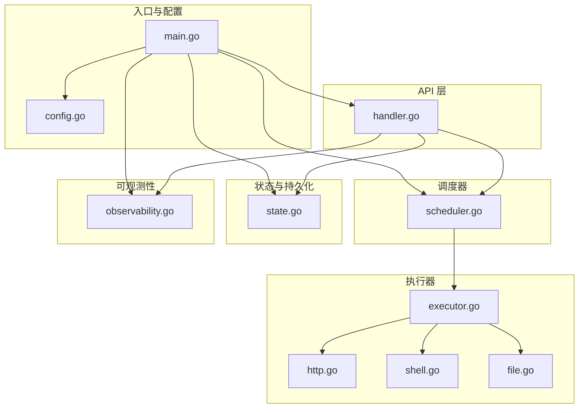
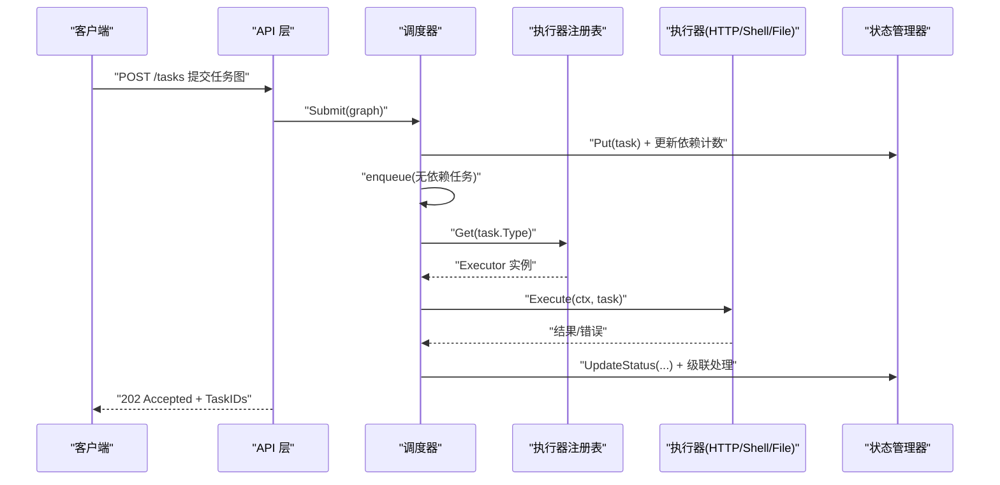
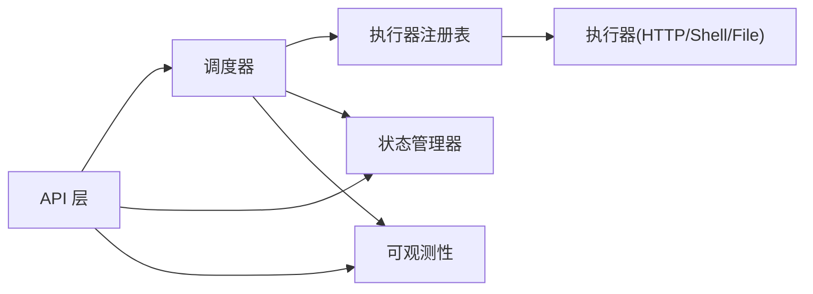

# 测试策略与实践

<cite>
**本文引用的文件列表**
- [main.go](file://cmd/execgo/main.go)
- [handler.go](file://internal/api/handler.go)
- [scheduler.go](file://internal/scheduler/scheduler.go)
- [executor.go](file://internal/executor/executor.go)
- [http.go](file://internal/executor/http.go)
- [shell.go](file://internal/executor/shell.go)
- [file.go](file://internal/executor/file.go)
- [task.go](file://internal/models/task.go)
- [state.go](file://internal/state/state.go)
- [observability.go](file://internal/observability/observability.go)
- [config.go](file://internal/config/config.go)
- [state.json](file://data/state.json)
- [README.md](file://README.md)
- [go.mod](file://go.mod)
</cite>

## 目录
1. [简介](#简介)
2. [项目结构](#项目结构)
3. [核心组件](#核心组件)
4. [架构总览](#架构总览)
5. [详细组件测试策略](#详细组件测试策略)
6. [依赖关系与耦合分析](#依赖关系与耦合分析)
7. [性能与并发测试](#性能与并发测试)
8. [测试数据准备与清理](#测试数据准备与清理)
9. [质量门禁与覆盖率要求](#质量门禁与覆盖率要求)
10. [故障排查指南](#故障排查指南)
11. [结论](#结论)
12. [附录：测试工具与示例路径](#附录测试工具与示例路径)

## 简介
本指南面向 ExecGo 的测试策略与实践，覆盖单元测试、集成测试、并发测试、性能与负载测试、测试数据准备与清理、覆盖率与质量门禁，并提供具体测试代码示例的“路径指引”，帮助开发者在不直接粘贴代码的前提下快速定位参考实现。

## 项目结构
ExecGo 采用清晰的分层架构：入口程序负责初始化配置、日志、指标、状态管理、调度器与 HTTP 服务；API 层处理 HTTP 请求；调度器负责 DAG 任务调度与并发控制；执行器模块提供可插拔的执行器；状态模块负责内存与持久化；可观测性模块提供日志、追踪与指标；配置模块负责参数加载。

图表来源
- [main.go:1-105](file://cmd/execgo/main.go#L1-L105)
- [handler.go:1-157](file://internal/api/handler.go#L1-L157)
- [scheduler.go:1-231](file://internal/scheduler/scheduler.go#L1-L231)
- [executor.go:1-68](file://internal/executor/executor.go#L1-L68)
- [http.go:1-76](file://internal/executor/http.go#L1-L76)
- [shell.go:1-80](file://internal/executor/shell.go#L1-L80)
- [file.go:1-114](file://internal/executor/file.go#L1-L114)
- [state.go:1-180](file://internal/state/state.go#L1-L180)
- [observability.go:1-134](file://internal/observability/observability.go#L1-L134)
- [config.go:1-47](file://internal/config/config.go#L1-L47)

章节来源
- [README.md:149-177](file://README.md#L149-L177)
- [go.mod:1-4](file://go.mod#L1-L4)

## 核心组件
- 入口与生命周期：负责配置加载、日志与指标初始化、状态管理器创建、调度器启动、HTTP 服务启动与优雅关闭。
- API 层：提供任务提交、查询、删除、健康检查与指标端点，统一错误响应与 JSON 编码。
- 调度器：基于 DAG 的任务调度，维护就绪队列、并发信号量、依赖计数与反向依赖图，支持重试与超时。
- 执行器：HTTP、Shell（白名单）、File 三类内置执行器，注册表模式便于扩展。
- 状态管理：内存 Map + RWMutex，支持原子状态更新与周期性/最终持久化。
- 可观测性：结构化日志、请求追踪（traceID）、指标收集与快照。
- 配置：命令行标志与环境变量优先级加载。

章节来源
- [main.go:25-104](file://cmd/execgo/main.go#L25-L104)
- [handler.go:19-157](file://internal/api/handler.go#L19-L157)
- [scheduler.go:18-231](file://internal/scheduler/scheduler.go#L18-L231)
- [executor.go:14-68](file://internal/executor/executor.go#L14-L68)
- [state.go:17-180](file://internal/state/state.go#L17-L180)
- [observability.go:16-134](file://internal/observability/observability.go#L16-L134)
- [config.go:10-47](file://internal/config/config.go#L10-L47)

## 架构总览
下图展示测试关注的关键交互：API 层调用调度器提交任务图；调度器通过执行器注册表获取执行器并执行；状态管理器负责状态读写与持久化；可观测性贯穿请求与执行过程。

图表来源
- [handler.go:58-99](file://internal/api/handler.go#L58-L99)
- [scheduler.go:69-190](file://internal/scheduler/scheduler.go#L69-L190)
- [executor.go:38-48](file://internal/executor/executor.go#L38-L48)
- [state.go:55-108](file://internal/state/state.go#L55-L108)

## 详细组件测试策略

### 单元测试（Unit Tests）
目标：验证核心逻辑正确性、边界条件、错误路径与并发安全。

- 模型与校验
  - 测试任务图校验：空图、重复 ID、缺失字段、未知依赖、自依赖、环依赖等。
  - 断言策略：对非法输入返回错误；对合法输入通过。
  - 示例路径
    - [任务图校验函数:41-79](file://internal/models/task.go#L41-L79)
    - [拓扑排序环检测:81-121](file://internal/models/task.go#L81-L121)

- 执行器注册表
  - 测试注册、获取、类型列表与内置注册。
  - 断言策略：注册后可按类型获取；未注册类型报错；RegisteredTypes 返回预期集合。
  - 示例路径
    - [注册与获取:31-48](file://internal/executor/executor.go#L31-L48)
    - [内置注册:62-67](file://internal/executor/executor.go#L62-L67)

- HTTP 执行器
  - 测试参数解析、URL/Method 校验、请求构造、响应读取与状态码处理。
  - 断言策略：非法参数返回错误；HTTP 错误返回结果但标记失败；成功返回状态码与响应体摘要。
  - 示例路径
    - [HTTP 执行器实现:27-75](file://internal/executor/http.go#L27-L75)

- Shell 执行器（白名单）
  - 测试命令解析、白名单校验、上下文取消、输出捕获、退出码。
  - 断言策略：未在白名单的命令报错；命令不存在返回错误；成功返回 stdout/stderr/exit_code。
  - 示例路径
    - [Shell 执行器实现:36-79](file://internal/executor/shell.go#L36-L79)

- File 执行器
  - 测试路径清理、动作分支（read/write/append/delete/stat）、错误处理。
  - 断言策略：非法动作报错；读写 stat 成功返回相应字段；删除/统计返回确认信息。
  - 示例路径
    - [File 执行器实现:25-113](file://internal/executor/file.go#L25-L113)

- 状态管理器
  - 测试 Put/Get/GetAll/Delete/UpdateStatus 的原子性与并发一致性。
  - 断言策略：并发读写不崩溃；UpdateStatus 返回存在性布尔；持久化前后状态一致。
  - 示例路径
    - [状态管理器实现:55-108](file://internal/state/state.go#L55-L108)
    - [持久化与恢复:110-158](file://internal/state/state.go#L110-L158)

- 调度器
  - 测试 Submit/DAG 依赖传播、就绪队列入队、并发信号量、重试与超时、级联失败/跳过。
  - 断言策略：无依赖任务立即入队；依赖满足后入队；并发上限受控；失败后级联跳过；成功后级联触发。
  - 示例路径
    - [提交与依赖图构建:69-97](file://internal/scheduler/scheduler.go#L69-L97)
    - [主循环与并发执行:109-125](file://internal/scheduler/scheduler.go#L109-L125)
    - [执行与重试/超时:127-190](file://internal/scheduler/scheduler.go#L127-L190)
    - [完成与级联处理:192-230](file://internal/scheduler/scheduler.go#L192-L230)

- API 层
  - 测试路由处理：提交、查询、列表、删除、健康、指标；错误响应与状态码。
  - 断言策略：非法 JSON 返回 400；校验失败返回 400；未知类型返回 400；成功返回 202/200/204/404；指标返回聚合值。
  - 示例路径
    - [路由与处理器:39-157](file://internal/api/handler.go#L39-L157)

- 可观测性
  - 测试 traceID 注入与提取、日志结构化、指标原子计数与快照。
  - 断言策略：中间件注入 X-Trace-ID；L(ctx, logger) 包含 trace_id；指标快照非负且可累加。
  - 示例路径
    - [追踪中间件:69-80](file://internal/observability/observability.go#L69-L80)
    - [指标快照:122-133](file://internal/observability/observability.go#L122-L133)

- 配置
  - 测试命令行优先级、环境变量回退、默认值。
  - 断言策略：flag > env > default；非法整型环境变量回退默认。
  - 示例路径
    - [配置加载:18-46](file://internal/config/config.go#L18-L46)

### 集成测试（Integration Tests）
目标：验证端到端流程、API 与调度器协作、执行器与外部系统交互、状态持久化与恢复。

- API + 调度器 + 执行器
  - 场景：提交 DAG 任务图，验证任务状态流转、依赖级联、重试与超时行为。
  - 断言策略：提交返回 202；查询返回最终状态；指标计数符合预期；失败任务被级联跳过。
  - 示例路径
    - [API 处理器:58-99](file://internal/api/handler.go#L58-L99)
    - [调度器执行:127-190](file://internal/scheduler/scheduler.go#L127-L190)

- API + 状态持久化
  - 场景：提交任务后触发定期持久化，优雅关闭后重启恢复。
  - 断言策略：持久化文件存在且内容可解析；重启后 running 状态重置为 pending；GetAll 返回恢复数据。
  - 示例路径
    - [状态持久化:110-134](file://internal/state/state.go#L110-L134)
    - [恢复逻辑:25-53](file://internal/state/state.go#L25-L53)
    - [入口优雅关闭:81-104](file://cmd/execgo/main.go#L81-L104)

- 调度器 + 执行器 + 外部系统
  - 场景：HTTP 执行器访问真实/模拟服务；Shell 执行器在白名单内命令；File 执行器读写临时文件。
  - 断言策略：HTTP 成功返回状态码与响应体；Shell 成功返回 exit_code；File 成功返回 bytes_written/stat。
  - 示例路径
    - [HTTP 执行器:27-75](file://internal/executor/http.go#L27-L75)
    - [Shell 执行器:36-79](file://internal/executor/shell.go#L36-L79)
    - [File 执行器:25-113](file://internal/executor/file.go#L25-L113)

- 指标与健康检查
  - 场景：多次提交任务，查询 /metrics 与 /health。
  - 断言策略：/metrics 返回非负计数与快照；/health 返回版本与运行时间。
  - 示例路径
    - [指标端点:137-146](file://internal/api/handler.go#L137-L146)
    - [健康检查:128-135](file://internal/api/handler.go#L128-L135)

### 并发测试（Race Conditions & Synchronization）
挑战与对策：
- 共享状态竞争：状态管理器使用 RWMutex；调度器使用互斥锁保护依赖图；指标使用原子计数。
- 并发执行：就绪队列与信号量控制最大并发；goroutine + WaitGroup 管理生命周期。
- 级联传播：完成任务后使用互斥锁保护依赖图更新，避免竞态。
- 解决方案：使用 go test -race；对关键临界区进行压力测试；确保所有共享状态访问均受保护。

断言与验证要点：
- 并发读写不崩溃；状态一致性；指标单调递增；任务状态最终收敛。
- 示例路径
  - [状态锁:18-23](file://internal/state/state.go#L18-L23)
  - [调度器互斥:28-32](file://internal/scheduler/scheduler.go#L28-L32)
  - [原子指标:87-102](file://internal/observability/observability.go#L87-L102)

### 性能与负载测试
- 单机吞吐：构造大规模 DAG，测量提交速率、并发执行速率、延迟分布。
- 资源占用：CPU、内存、磁盘 IO；观察定期持久化的开销与抖动。
- 超时与重试：设置不同超时与重试参数，评估失败率与恢复时间。
- 指标采集：通过 /metrics 与日志追踪关键指标，定位瓶颈。
- 示例路径
  - [调度器并发控制:47-67](file://internal/scheduler/scheduler.go#L47-L67)
  - [状态持久化周期:160-179](file://internal/state/state.go#L160-L179)
  - [指标快照:122-133](file://internal/observability/observability.go#L122-L133)

## 依赖关系与耦合分析
- 组件耦合
  - API 层依赖调度器与状态管理器；调度器依赖执行器注册表与状态管理器；执行器依赖模型；状态管理器依赖模型与文件系统；可观测性贯穿各层。
- 外部依赖
  - 标准库：net/http、context、os、encoding/json、sync、time 等。
- 循环依赖
  - 无显式循环依赖；通过接口与注册表解耦执行器与调度器。
- 可测试性
  - 通过接口与注册表实现可替换性；状态管理器支持持久化；可观测性提供可观测手段。

图表来源
- [handler.go:19-52](file://internal/api/handler.go#L19-L52)
- [scheduler.go:18-45](file://internal/scheduler/scheduler.go#L18-L45)
- [executor.go:26-67](file://internal/executor/executor.go#L26-L67)
- [state.go:17-53](file://internal/state/state.go#L17-L53)
- [observability.go:16-80](file://internal/observability/observability.go#L16-L80)

## 性能与并发测试
- 并发测试建议
  - 使用 go test -race 验证竞态；构造高并发 Submit 场景；验证就绪队列与信号量上限。
  - 对关键路径（Submit、enqueue、executeTask、UpdateStatus）进行压力测试。
- 性能测试建议
  - 使用基准测试（Benchmark）评估执行器与状态持久化性能；对比不同 MaxConcurrency 下的吞吐与延迟。
- 负载测试建议
  - 模拟生产流量，观察 /metrics 指标变化；监控 CPU/内存/IO；评估优雅关闭与恢复时间。

[本节为通用指导，无需列出章节来源]

## 测试数据准备与清理
- 临时目录与文件
  - 使用临时目录存放 data-dir，避免污染测试环境；测试结束后清理。
- 持久化数据
  - 使用独立 state.json 或临时文件；测试前加载样例数据，测试后恢复或删除。
- 执行器测试隔离
  - HTTP 执行器：使用本地 echo 服务或 httpbin 模拟；Shell 执行器：仅使用白名单命令；File 执行器：在临时目录读写。
- 清理策略
  - 测试结束删除临时文件与目录；关闭 HTTP 服务与调度器；等待持久化完成。

章节来源
- [state.json:1-76](file://data/state.json#L1-L76)
- [state.go:110-158](file://internal/state/state.go#L110-L158)

## 质量门禁与覆盖率要求
- 覆盖率要求
  - 单元测试：核心包（internal/*）行覆盖率不低于 80%，关键路径不低于 90%。
  - 集成测试：API、调度器、执行器关键路径覆盖。
- 质量门禁
  - 通过 go test -race；通过静态分析（如 unused、ineffassign 等）；通过覆盖率报告。
  - 代码审查中重点关注并发安全、错误处理与可观测性。

[本节为通用指导，无需列出章节来源]

## 故障排查指南
- 常见问题
  - 提交任务返回 400：检查 JSON 格式与 TaskGraph 校验；确认执行器类型可用。
  - 任务状态卡住：检查依赖图是否成环；查看日志中的 trace_id 定位。
  - 并发异常：启用 -race；检查信号量与就绪队列容量。
  - 持久化失败：检查 data-dir 权限与磁盘空间；确认原子重命名流程。
- 可观测性辅助
  - 使用 /metrics 查看任务总数、运行中、成功/失败计数；使用 /health 检查运行状态。
  - 在关键路径打点，结合 traceID 追踪请求链路。

章节来源
- [handler.go:58-99](file://internal/api/handler.go#L58-L99)
- [scheduler.go:127-190](file://internal/scheduler/scheduler.go#L127-L190)
- [state.go:160-179](file://internal/state/state.go#L160-L179)

## 结论
ExecGo 的测试策略应以“单元测试打地基、集成测试保流程、并发与性能测试强韧性”为核心，结合可观测性与质量门禁，确保在零第三方依赖的前提下实现稳定、可观测、可扩展的执行引擎。

[本节为总结，无需列出章节来源]

## 附录：测试工具与示例路径
- 测试工具推荐
  - 单元测试：go test（-race、-coverprofile、-bench）
  - 集成测试：go test + httptest/httptest.NewServer（或使用本地 echo 服务）
  - 并发与性能：go test -bench、pprof、expvar（结合 /metrics）
  - 静态分析：revive、unused、ineffassign
- 示例路径（不包含代码内容，仅提供定位）
  - [入口与优雅关闭:25-104](file://cmd/execgo/main.go#L25-L104)
  - [API 路由与处理器:39-157](file://internal/api/handler.go#L39-L157)
  - [调度器提交与执行:69-190](file://internal/scheduler/scheduler.go#L69-L190)
  - [执行器注册与内置实现:31-67](file://internal/executor/executor.go#L31-L67)
  - [HTTP 执行器:27-75](file://internal/executor/http.go#L27-L75)
  - [Shell 执行器:36-79](file://internal/executor/shell.go#L36-L79)
  - [File 执行器:25-113](file://internal/executor/file.go#L25-L113)
  - [状态管理器与持久化:55-158](file://internal/state/state.go#L55-L158)
  - [可观测性指标与追踪:69-133](file://internal/observability/observability.go#L69-L133)
  - [配置加载:18-46](file://internal/config/config.go#L18-L46)
  - [任务模型与校验:41-121](file://internal/models/task.go#L41-L121)