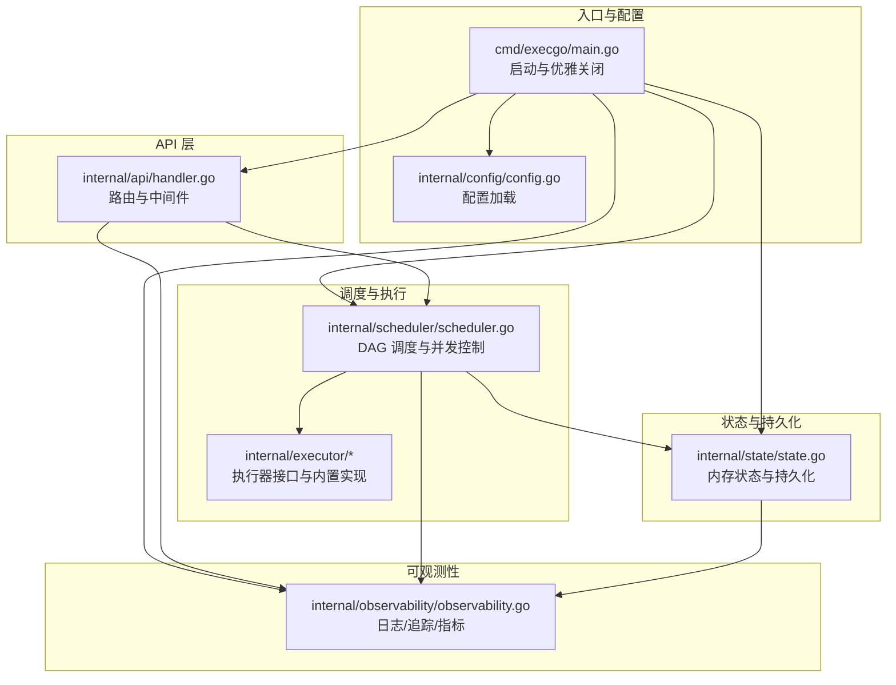
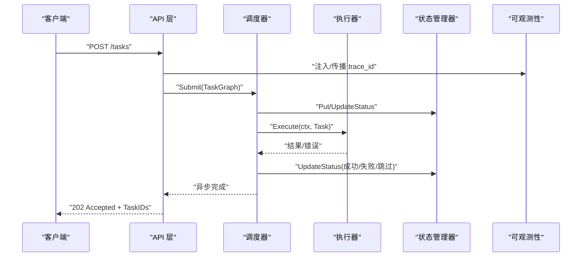
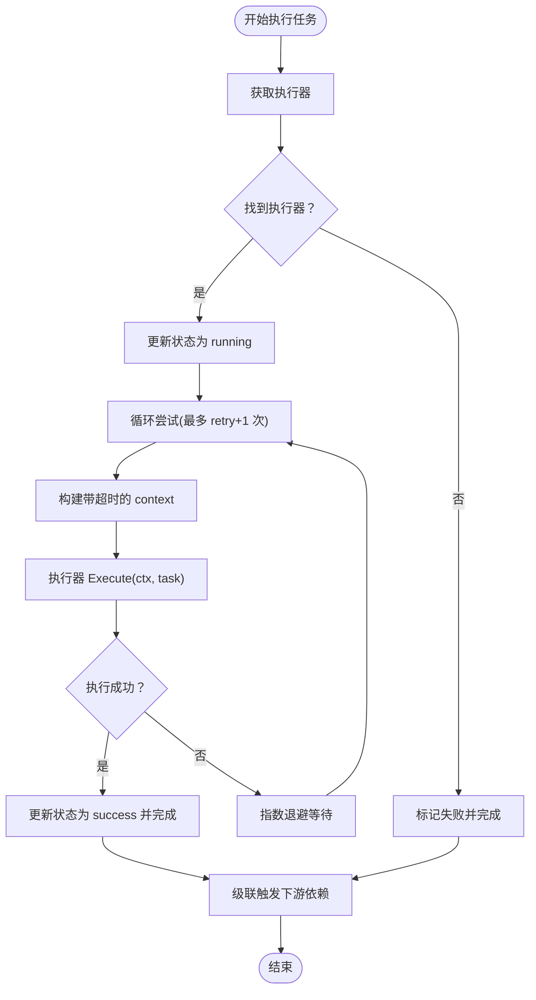
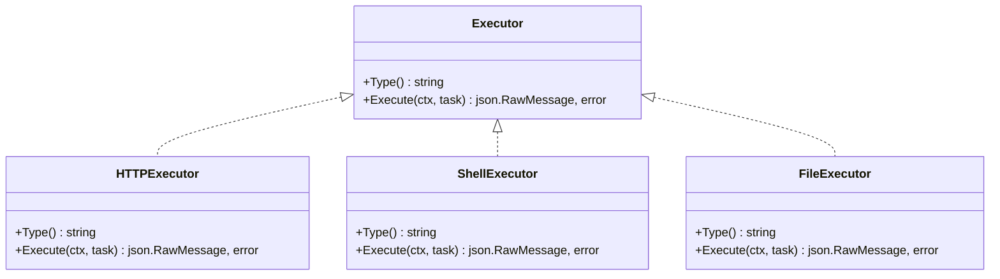
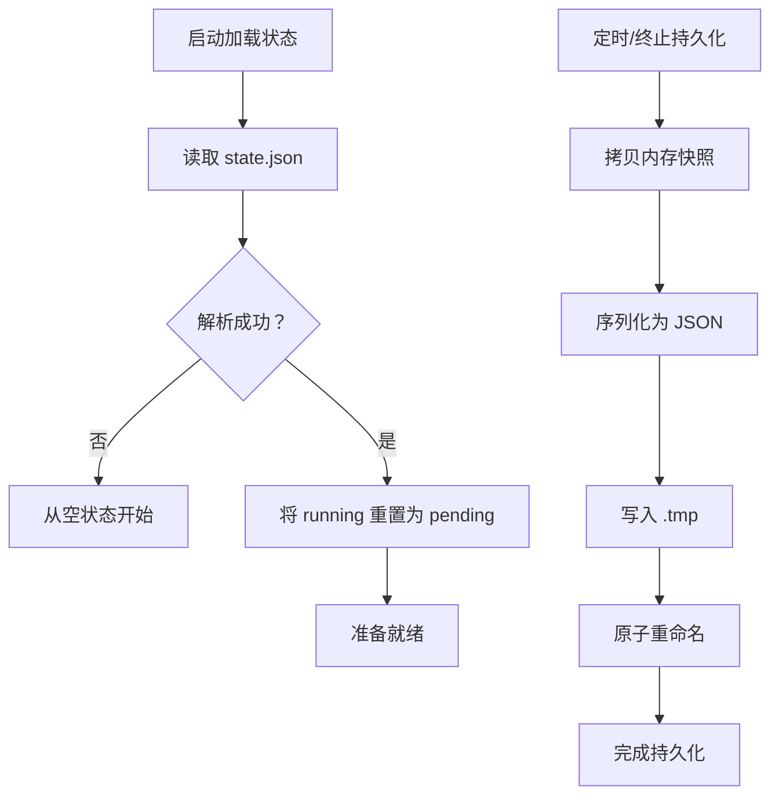
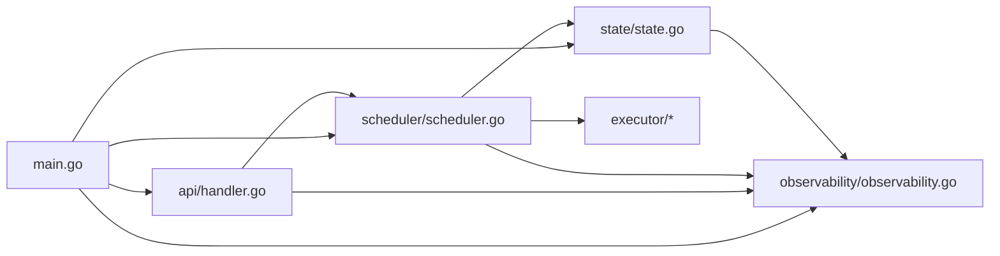

# 调试与性能优化

<cite>
**本文引用的文件列表**
- [cmd/execgo/main.go](file://cmd/execgo/main.go)
- [internal/config/config.go](file://internal/config/config.go)
- [internal/api/handler.go](file://internal/api/handler.go)
- [internal/observability/observability.go](file://internal/observability/observability.go)
- [internal/scheduler/scheduler.go](file://internal/scheduler/scheduler.go)
- [internal/state/state.go](file://internal/state/state.go)
- [internal/executor/executor.go](file://internal/executor/executor.go)
- [internal/executor/http.go](file://internal/executor/http.go)
- [internal/executor/shell.go](file://internal/executor/shell.go)
- [internal/executor/file.go](file://internal/executor/file.go)
- [internal/models/task.go](file://internal/models/task.go)
- [README.md](file://README.md)
- [go.mod](file://go.mod)
</cite>

## 目录
1. [简介](#简介)
2. [项目结构](#项目结构)
3. [核心组件](#核心组件)
4. [架构总览](#架构总览)
5. [详细组件分析](#详细组件分析)
6. [依赖关系分析](#依赖关系分析)
7. [性能考虑](#性能考虑)
8. [故障排查指南](#故障排查指南)
9. [结论](#结论)
10. [附录](#附录)

## 简介
本指南面向运维与开发人员，围绕 ExecGo 的调试与性能优化展开，覆盖日志分析、错误追踪、问题定位、性能分析工具使用（pprof、trace）、自定义指标监控、常见瓶颈识别与解决、生产环境安全实践与监控策略、故障排查流程与应急响应、性能基准测试与优化建议，以及可观测性在调试中的应用与最佳实践。

## 项目结构
ExecGo 采用分层架构：入口程序负责初始化配置、日志、指标、状态管理、调度器与 HTTP 服务；API 层处理请求并调用调度器；调度器基于 DAG 与并发信号量驱动任务执行；执行器模块提供可插拔的执行器（HTTP/Shell/File），并通过注册表扩展；状态管理器负责内存与文件持久化；可观测性模块提供结构化日志、追踪与指标。

图表来源
- [cmd/execgo/main.go:25-104](file://cmd/execgo/main.go#L25-L104)
- [internal/config/config.go:18-30](file://internal/config/config.go#L18-L30)
- [internal/api/handler.go:39-52](file://internal/api/handler.go#L39-L52)
- [internal/scheduler/scheduler.go:34-58](file://internal/scheduler/scheduler.go#L34-L58)
- [internal/state/state.go:25-53](file://internal/state/state.go#L25-L53)
- [internal/observability/observability.go:50-63](file://internal/observability/observability.go#L50-L63)

章节来源
- [README.md:149-177](file://README.md#L149-L177)
- [cmd/execgo/main.go:25-104](file://cmd/execgo/main.go#L25-L104)

## 核心组件
- 入口与生命周期：初始化配置、日志、指标、状态管理器、调度器与 HTTP 服务，支持优雅关闭与信号处理。
- API 层：提供任务提交、查询、删除、健康检查与指标端点，并通过追踪中间件注入 trace_id。
- 调度器：基于 DAG 的并发调度器，使用通道与信号量控制并发，支持指数退避重试与超时。
- 执行器：统一接口与注册表，内置 HTTP/Shell/File 执行器，支持参数解析与错误返回。
- 状态管理：内存映射 + RWMutex 保护，定期持久化至 JSON 文件，崩溃后恢复并将运行中任务重置为待定。
- 可观测性：结构化 JSON 日志、trace_id 注入与传播、/metrics 指标端点。

章节来源
- [cmd/execgo/main.go:25-104](file://cmd/execgo/main.go#L25-L104)
- [internal/api/handler.go:39-52](file://internal/api/handler.go#L39-L52)
- [internal/scheduler/scheduler.go:18-58](file://internal/scheduler/scheduler.go#L18-L58)
- [internal/executor/executor.go:14-67](file://internal/executor/executor.go#L14-L67)
- [internal/state/state.go:17-53](file://internal/state/state.go#L17-L53)
- [internal/observability/observability.go:50-133](file://internal/observability/observability.go#L50-L133)

## 架构总览
下图展示从客户端到执行器的完整调用链路与关键可观测点。

图表来源
- [internal/api/handler.go:58-99](file://internal/api/handler.go#L58-L99)
- [internal/scheduler/scheduler.go:69-97](file://internal/scheduler/scheduler.go#L69-L97)
- [internal/scheduler/scheduler.go:127-190](file://internal/scheduler/scheduler.go#L127-L190)
- [internal/state/state.go:55-108](file://internal/state/state.go#L55-L108)
- [internal/observability/observability.go:69-80](file://internal/observability/observability.go#L69-L80)

## 详细组件分析

### 调度器与并发控制
- 并发控制：使用固定容量的信号量通道限制最大并发，避免资源耗尽。
- 就绪队列：使用带缓冲的通道存放可执行任务，满载时采用异步回填策略。
- DAG 依赖：构建入度计数与反向依赖图，依赖满足即入队执行。
- 重试与超时：对每次执行构建带超时的 context，失败按指数退避重试，上限保护。
- 级联失败：上游失败时跳过下游并递归级联，保证一致性。

图表来源
- [internal/scheduler/scheduler.go:127-222](file://internal/scheduler/scheduler.go#L127-L222)

章节来源
- [internal/scheduler/scheduler.go:18-231](file://internal/scheduler/scheduler.go#L18-L231)

### 执行器接口与内置实现
- 接口设计：统一 Type()/Execute()，通过注册表集中管理。
- HTTP 执行器：解析参数构造请求，限制响应大小，4xx 仍返回结果但标记错误。
- Shell 执行器：白名单命令安全控制，捕获 stdout/stderr/退出码。
- File 执行器：路径清理防穿越，支持读写追加删除统计。

图表来源
- [internal/executor/executor.go:14-67](file://internal/executor/executor.go#L14-L67)
- [internal/executor/http.go:22-75](file://internal/executor/http.go#L22-L75)
- [internal/executor/shell.go:31-79](file://internal/executor/shell.go#L31-L79)
- [internal/executor/file.go:20-113](file://internal/executor/file.go#L20-L113)

章节来源
- [internal/executor/executor.go:14-67](file://internal/executor/executor.go#L14-L67)
- [internal/executor/http.go:22-75](file://internal/executor/http.go#L22-L75)
- [internal/executor/shell.go:31-79](file://internal/executor/shell.go#L31-L79)
- [internal/executor/file.go:20-113](file://internal/executor/file.go#L20-L113)

### 状态管理与持久化
- 内存状态：RWMutex 保护 map，Put/Get/UpdateStatus/Delete 原子更新。
- 持久化策略：定期持久化与最终持久化，先写临时文件再原子重命名，保证一致性。
- 恢复逻辑：启动时将运行中任务重置为待定，避免脏状态。

图表来源
- [internal/state/state.go:25-53](file://internal/state/state.go#L25-L53)
- [internal/state/state.go:110-134](file://internal/state/state.go#L110-L134)
- [internal/state/state.go:137-158](file://internal/state/state.go#L137-L158)
- [internal/state/state.go:160-179](file://internal/state/state.go#L160-L179)

章节来源
- [internal/state/state.go:17-180](file://internal/state/state.go#L17-L180)

### API 层与中间件
- 路由：提交任务、查询任务、列出任务、删除任务、健康检查、指标端点。
- 中间件：TraceMiddleware 注入/透传 trace_id，便于跨组件关联日志与指标。
- 参数校验：任务图校验、未知类型检查、执行器可用性验证。

章节来源
- [internal/api/handler.go:39-157](file://internal/api/handler.go#L39-L157)
- [internal/observability/observability.go:69-80](file://internal/observability/observability.go#L69-L80)
- [internal/models/task.go:41-79](file://internal/models/task.go#L41-L79)

### 配置与启动流程
- 配置项：监听地址、数据目录、最大并发、优雅关闭超时，支持 flag/env/default 优先级。
- 启动顺序：注册执行器 → 初始化指标 → 创建状态管理器并启动定期持久化 → 启动调度器 → 启动 HTTP 服务 → 信号监听与优雅关闭。

章节来源
- [internal/config/config.go:18-47](file://internal/config/config.go#L18-L47)
- [cmd/execgo/main.go:25-104](file://cmd/execgo/main.go#L25-L104)

## 依赖关系分析
- 组件耦合：API 层依赖调度器；调度器依赖执行器注册表与状态管理器；可观测性贯穿各层。
- 外部依赖：纯标准库，零第三方依赖，降低供应链风险。
- 循环依赖：未发现直接循环依赖，模块职责清晰。

图表来源
- [cmd/execgo/main.go:17-23](file://cmd/execgo/main.go#L17-L23)
- [internal/api/handler.go:12-17](file://internal/api/handler.go#L12-L17)
- [internal/scheduler/scheduler.go:12-16](file://internal/scheduler/scheduler.go#L12-L16)
- [internal/state/state.go:14](file://internal/state/state.go#L14)
- [internal/observability/observability.go:5-14](file://internal/observability/observability.go#L5-L14)

章节来源
- [go.mod:1-4](file://go.mod#L1-L4)

## 性能考虑
- 并发与背压：通过信号量限制并发，就绪队列缓冲与异步回填避免阻塞；合理设置最大并发以匹配硬件与外部依赖。
- I/O 限制：HTTP 执行器限制响应大小，防止内存膨胀；Shell 执行器捕获输出并返回退出码，避免长时间阻塞。
- 指标监控：内置指标包括总任务、运行中、成功、失败与按类型计数；结合 trace_id 进行端到端追踪。
- 持久化开销：定期持久化采用原子重命名，减少锁持有时间；建议根据吞吐量调整周期。
- 超时与重试：为每个任务设置合理超时与重试策略，避免资源被长尾任务占用。

章节来源
- [internal/scheduler/scheduler.go:110-125](file://internal/scheduler/scheduler.go#L110-L125)
- [internal/scheduler/scheduler.go:144-179](file://internal/scheduler/scheduler.go#L144-L179)
- [internal/executor/http.go:60-75](file://internal/executor/http.go#L60-L75)
- [internal/state/state.go:160-179](file://internal/state/state.go#L160-L179)
- [internal/observability/observability.go:87-133](file://internal/observability/observability.go#L87-L133)

## 故障排查指南
- 日志分析
  - 使用结构化 JSON 日志，结合 trace_id 关联请求全链路。
  - 关注启动日志、执行器注册、任务提交、状态变更与持久化错误。
- 错误追踪
  - 在 API 层与调度器中记录关键事件与错误上下文，确保 trace_id 透传。
  - 对未知任务类型、参数解析失败、执行器缺失等情况进行明确告警。
- 问题定位
  - 任务状态：通过 /tasks/{id} 与 /tasks 列表核对状态流转。
  - 指标核对：对比 /metrics 中 total/running/success/failed 与业务预期。
  - 持久化：确认 state.json 是否存在且内容一致，必要时手动备份。
- 常见问题
  - 任务卡住：检查并发是否达到上限、是否存在死循环或外部依赖阻塞。
  - 依赖失败导致级联跳过：确认上游任务状态与错误信息。
  - 超时与重试：适当提高超时或减少重试次数，避免资源浪费。
- 生产安全与监控
  - 限制执行器权限：Shell 执行器使用白名单命令；File 执行器路径清理。
  - 限流与隔离：合理设置最大并发与外部依赖超时，避免级联故障。
  - 健康检查与指标：定期检查 /health 与 /metrics，建立告警阈值。
- 应急响应
  - 快速降级：临时降低最大并发或禁用高风险执行器类型。
  - 快速恢复：优雅关闭后重启，利用持久化恢复状态。
  - 事后复盘：结合 trace_id 与日志回放，定位根因并完善防护。

章节来源
- [internal/api/handler.go:58-99](file://internal/api/handler.go#L58-L99)
- [internal/scheduler/scheduler.go:127-222](file://internal/scheduler/scheduler.go#L127-L222)
- [internal/state/state.go:110-134](file://internal/state/state.go#L110-L134)
- [internal/observability/observability.go:50-63](file://internal/observability/observability.go#L50-L63)

## 结论
ExecGo 以极简设计实现高可用的任务执行内核，具备完善的可观测性与韧性机制。通过合理的并发控制、I/O 限制、指标监控与安全策略，可在生产环境中稳定运行。建议在部署前完成性能基线测试与应急预案演练，持续优化执行器参数与系统配置。

## 附录

### 性能分析工具与使用建议
- pprof
  - 使用 net/http/pprof 包装 HTTP 服务，暴露 /debug/pprof 端点，采集 CPU/内存/阻塞等 profile。
  - 建议在低峰期采集，避免影响线上性能。
- trace
  - 使用 runtime/trace 记录执行轨迹，结合浏览器 trace viewer 分析热点。
- 自定义指标
  - 基于现有指标结构扩展，增加任务耗时直方图、执行器耗时分布、队列长度等。
  - 通过 /metrics 端点对外暴露，配合 Prometheus 抓取。

章节来源
- [internal/observability/observability.go:87-133](file://internal/observability/observability.go#L87-L133)

### 常见性能瓶颈与解决
- CPU 密集型任务
  - 识别：执行器内部计算密集或外部进程 CPU 占用高。
  - 解决：拆分任务、引入缓存、优化算法、降低并发或迁移至专用节点。
- I/O 瓶颈
  - 识别：HTTP/Shell/File 执行器频繁阻塞。
  - 解决：设置合理超时、限制响应大小、使用连接池、优化外部依赖。
- 内存泄漏检测
  - 使用 pprof heap profile 与内存分配跟踪，排查未释放的缓冲区与长生命周期对象。
  - 关注执行器输出缓冲与状态管理器快照拷贝。

章节来源
- [internal/executor/http.go:60-75](file://internal/executor/http.go#L60-L75)
- [internal/executor/shell.go:61-78](file://internal/executor/shell.go#L61-L78)
- [internal/state/state.go:110-134](file://internal/state/state.go#L110-L134)

### 生产环境调试安全实践
- 执行器安全
  - Shell 白名单命令；File 路径清理；HTTP 限制响应大小与超时。
- 配置安全
  - 通过环境变量与 flag 控制敏感参数，避免硬编码。
- 监控与告警
  - 健康检查、指标阈值、异常日志级别告警。
- 优雅关闭与恢复
  - 信号处理、有序关闭、最终持久化，确保状态一致。

章节来源
- [internal/executor/shell.go:14-22](file://internal/executor/shell.go#L14-L22)
- [internal/executor/file.go:35-51](file://internal/executor/file.go#L35-L51)
- [internal/config/config.go:18-47](file://internal/config/config.go#L18-L47)
- [cmd/execgo/main.go:81-104](file://cmd/execgo/main.go#L81-L104)

### 故障排查流程
- 快速定位
  - 使用 trace_id 在日志中检索请求全链路。
  - 核对 /metrics 与 /health，判断系统整体健康状况。
- 深入分析
  - 检查任务状态与错误信息，定位失败环节。
  - 分析执行器参数与外部依赖行为。
- 修复与验证
  - 调整配置与参数，验证修复效果。
  - 回归测试与指标回归。

章节来源
- [internal/api/handler.go:128-146](file://internal/api/handler.go#L128-L146)
- [internal/observability/observability.go:33-44](file://internal/observability/observability.go#L33-L44)

### 性能基准测试与优化建议
- 基准场景
  - 单任务吞吐：不同执行器类型与参数组合下的 QPS。
  - DAG 场景：不同深度/宽度的依赖图与并发设置下的延迟与吞吐。
  - I/O 场景：HTTP/Shell/File 的 I/O 限制与超时对性能的影响。
- 优化建议
  - 合理设置最大并发，避免过度竞争。
  - 优化外部依赖（网络、文件系统）与执行器参数。
  - 引入缓存与批处理，减少重复 I/O。
  - 使用更高效的执行器实现或外部加速器。

章节来源
- [internal/scheduler/scheduler.go:34-58](file://internal/scheduler/scheduler.go#L34-L58)
- [internal/executor/http.go:27-75](file://internal/executor/http.go#L27-L75)
- [internal/executor/shell.go:36-79](file://internal/executor/shell.go#L36-L79)
- [internal/executor/file.go:25-113](file://internal/executor/file.go#L25-L113)

### 可观测性在调试中的应用与最佳实践
- 结构化日志
  - 使用 slog 输出 JSON 日志，统一字段格式，便于检索与聚合。
- 追踪与关联
  - trace_id 注入与透传，跨组件关联请求与任务。
- 指标体系
  - 覆盖总量、运行中、成功/失败、按类型分布与关键路径耗时。
- 告警与仪表盘
  - 基于指标建立阈值告警，结合 trace_id 与日志进行快速定位。

章节来源
- [internal/observability/observability.go:50-133](file://internal/observability/observability.go#L50-L133)
- [internal/api/handler.go:39-52](file://internal/api/handler.go#L39-L52)