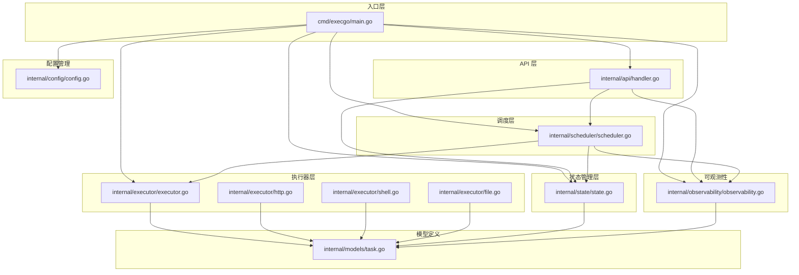
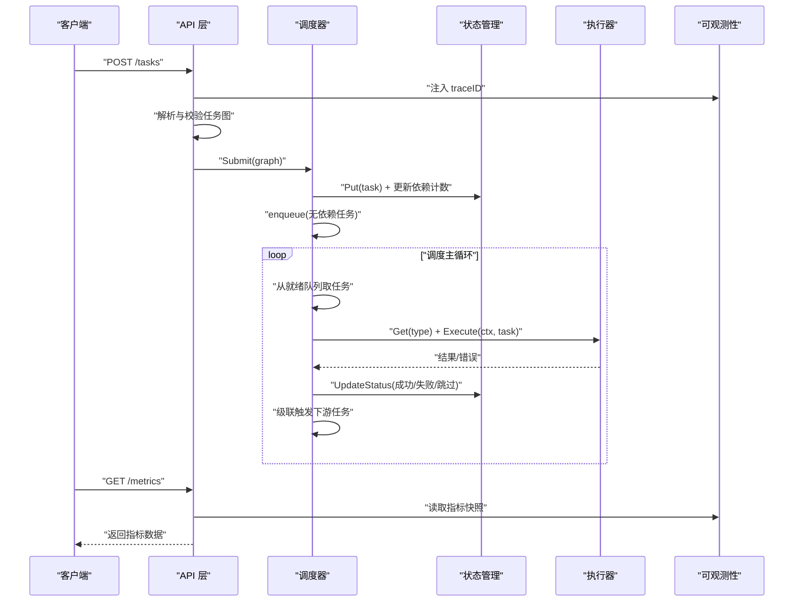
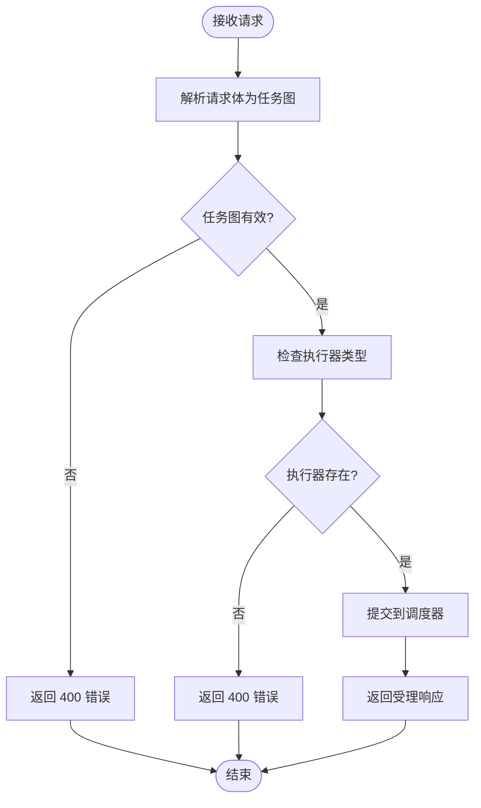
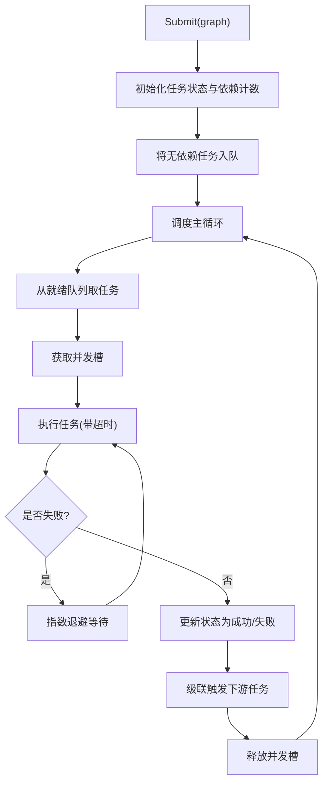
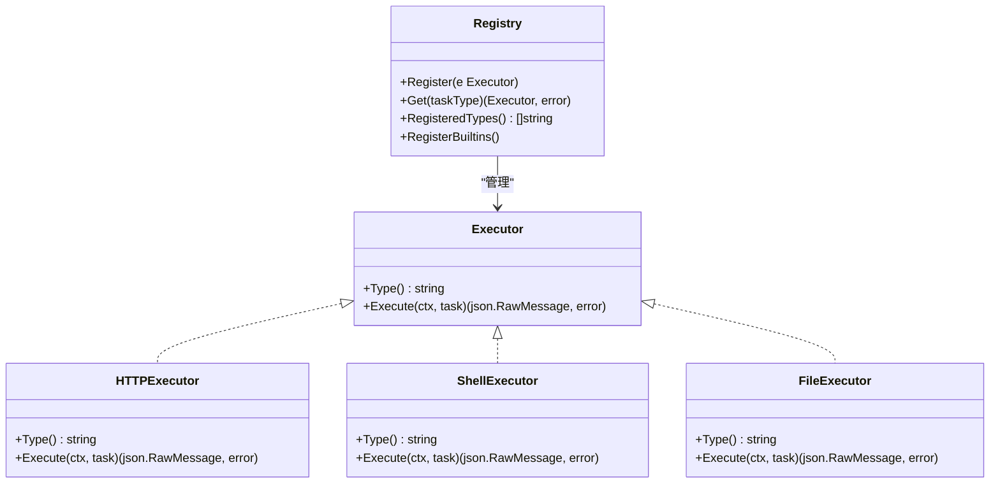
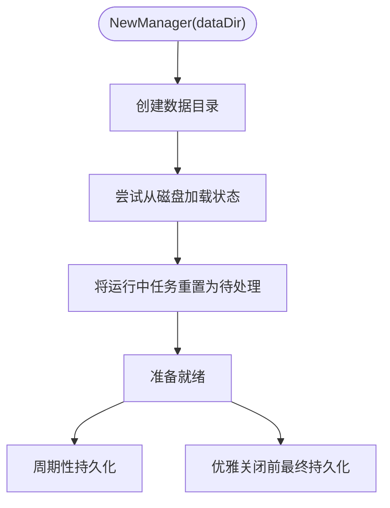
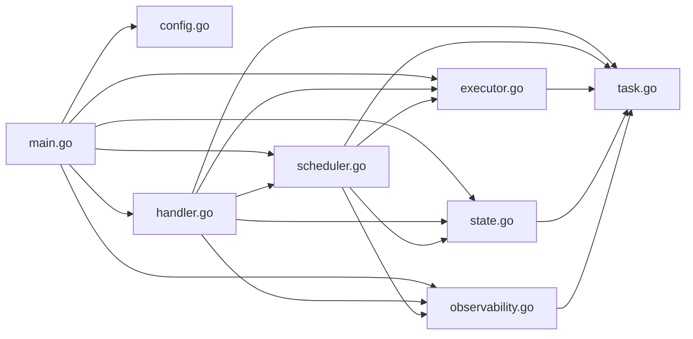

# 项目结构说明

<cite>
**本文档引用的文件**
- [main.go](file://cmd/execgo/main.go)
- [handler.go](file://internal/api/handler.go)
- [scheduler.go](file://internal/scheduler/scheduler.go)
- [executor.go](file://internal/executor/executor.go)
- [http.go](file://internal/executor/http.go)
- [shell.go](file://internal/executor/shell.go)
- [file.go](file://internal/executor/file.go)
- [state.go](file://internal/state/state.go)
- [config.go](file://internal/config/config.go)
- [observability.go](file://internal/observability/observability.go)
- [task.go](file://internal/models/task.go)
- [go.mod](file://go.mod)
- [README.md](file://README.md)
</cite>

## 目录
1. [简介](#简介)
2. [项目结构](#项目结构)
3. [核心组件](#核心组件)
4. [架构总览](#架构总览)
5. [详细组件分析](#详细组件分析)
6. [依赖关系分析](#依赖关系分析)
7. [性能考量](#性能考量)
8. [故障排查指南](#故障排查指南)
9. [结论](#结论)
10. [附录](#附录)

## 简介
ExecGo 是一个使用纯 Go 标准库构建的极简 AI 执行引擎，采用分层架构设计，提供任务提交、DAG 调度、并发执行与可观测性能力。项目通过清晰的包边界划分，实现了高内聚、低耦合的模块化设计，便于扩展与维护。

## 项目结构
项目采用按功能域分层的包组织方式，主要分为入口层、API 层、调度层、执行器层、状态管理层、配置管理、可观测性以及模型定义等模块。这种组织方式有利于：
- 明确职责边界，降低模块间耦合
- 支持插件式扩展（执行器注册表）
- 便于单元测试与集成测试
- 提升代码可读性与可维护性

**图表来源**
- [main.go:25-104](file://cmd/execgo/main.go#L25-L104)
- [handler.go:29-52](file://internal/api/handler.go#L29-L52)
- [scheduler.go:35-58](file://internal/scheduler/scheduler.go#L35-L58)
- [executor.go:31-67](file://internal/executor/executor.go#L31-L67)
- [state.go:26-53](file://internal/state/state.go#L26-L53)
- [config.go:20-30](file://internal/config/config.go#L20-L30)
- [observability.go:98-102](file://internal/observability/observability.go#L98-L102)
- [task.go:22-34](file://internal/models/task.go#L22-L34)

**章节来源**
- [README.md:149-177](file://README.md#L149-L177)
- [go.mod:1-4](file://go.mod#L1-L4)

## 核心组件
本节对各核心包进行职责与功能概述，并说明其在整体架构中的位置与作用。

- cmd/execgo/main.go
  - 应用入口，负责初始化配置、日志、执行器注册、指标、状态管理器、调度器与 HTTP 服务器，并处理优雅关闭流程。
  - 关键职责：应用生命周期管理、组件装配与协调。

- internal/api/handler.go
  - HTTP API 层，提供任务提交、查询、删除、健康检查与指标端点；使用路由中间件注入追踪 ID。
  - 关键职责：请求解析、参数校验、调用调度器与状态管理器、统一响应格式。

- internal/scheduler/scheduler.go
  - DAG 任务调度器，基于依赖图进行拓扑排序与并发控制，支持重试与超时。
  - 关键职责：任务图解析、依赖计数与反向依赖图构建、就绪队列与并发信号量、任务执行与级联完成。

- internal/executor/executor.go
  - 执行器接口与全局注册表，定义统一的执行器抽象与注册机制。
  - 关键职责：执行器接口定义、注册表读写锁保护、内置执行器注册。

- internal/state/state.go
  - 任务状态管理与持久化，提供内存存储与定期/最终持久化能力。
  - 关键职责：任务增删改查、状态原子更新、JSON 文件持久化与恢复。

- internal/config/config.go
  - 配置加载与优先级策略，支持命令行参数与环境变量。
  - 关键职责：配置项定义、优先级合并、默认值处理。

- internal/observability/observability.go
  - 结构化日志、请求追踪与指标收集，提供 traceID 注入与中间件。
  - 关键职责：日志器创建、traceID 生命周期管理、指标计数与快照。

- internal/models/task.go
  - 核心数据模型与任务图验证，定义任务状态、任务图结构与校验规则。
  - 关键职责：数据结构定义、任务图合法性校验、拓扑排序环检测。

**章节来源**
- [main.go:25-104](file://cmd/execgo/main.go#L25-L104)
- [handler.go:29-52](file://internal/api/handler.go#L29-L52)
- [scheduler.go:35-58](file://internal/scheduler/scheduler.go#L35-L58)
- [executor.go:31-67](file://internal/executor/executor.go#L31-L67)
- [state.go:26-53](file://internal/state/state.go#L26-L53)
- [config.go:20-30](file://internal/config/config.go#L20-L30)
- [observability.go:98-102](file://internal/observability/observability.go#L98-L102)
- [task.go:22-34](file://internal/models/task.go#L22-L34)

## 架构总览
ExecGo 采用典型的分层架构模式，自上而下为 API 层、调度层、执行器层与状态管理层，配合可观测性贯穿各层。整体交互流程如下：

**图表来源**
- [handler.go:59-99](file://internal/api/handler.go#L59-L99)
- [scheduler.go:70-97](file://internal/scheduler/scheduler.go#L70-L97)
- [scheduler.go:128-190](file://internal/scheduler/scheduler.go#L128-L190)
- [scheduler.go:193-222](file://internal/scheduler/scheduler.go#L193-L222)
- [observability.go:105-133](file://internal/observability/observability.go#L105-L133)

## 详细组件分析

### API 层（HTTP API 层）
- 职责
  - 提供任务提交、查询、删除、健康检查与指标端点
  - 使用路由中间件注入 traceID，统一响应格式
  - 校验任务图合法性与执行器可用性
- 关键流程
  - 提交任务：解析 JSON → 校验任务图 → 校验执行器类型 → 提交调度器 → 返回受理信息
  - 查询任务：从状态管理器获取任务或列出全部任务
  - 删除任务：从状态管理器删除指定任务
  - 健康检查与指标：返回运行状态与统计指标
- 错误处理
  - 对无效 JSON、非法任务图、未知执行器类型等情况返回相应状态码与错误信息

**图表来源**
- [handler.go:59-99](file://internal/api/handler.go#L59-L99)

**章节来源**
- [handler.go:29-52](file://internal/api/handler.go#L29-L52)
- [handler.go:59-99](file://internal/api/handler.go#L59-L99)
- [handler.go:101-146](file://internal/api/handler.go#L101-L146)

### 调度器（DAG 调度器）
- 职责
  - 解析任务图，构建依赖计数与反向依赖图
  - 控制并发度，维护就绪队列
  - 执行任务，处理重试与超时，级联完成下游任务
- 关键数据结构
  - readyQueue：存放可执行任务
  - semaphore：并发信号量
  - depCount：剩余依赖计数
  - dependents：反向依赖图
- 处理逻辑
  - Submit：初始化任务状态与计数，将无依赖任务入队
  - loop：从队列取出任务，获取并发槽，异步执行
  - executeTask：选择执行器，设置上下文超时，指数退避重试
  - completeTask：根据结果更新状态，级联触发或跳过下游任务

**图表来源**
- [scheduler.go:70-97](file://internal/scheduler/scheduler.go#L70-L97)
- [scheduler.go:110-125](file://internal/scheduler/scheduler.go#L110-L125)
- [scheduler.go:128-190](file://internal/scheduler/scheduler.go#L128-L190)
- [scheduler.go:193-222](file://internal/scheduler/scheduler.go#L193-L222)

**章节来源**
- [scheduler.go:18-45](file://internal/scheduler/scheduler.go#L18-L45)
- [scheduler.go:69-97](file://internal/scheduler/scheduler.go#L69-L97)
- [scheduler.go:109-125](file://internal/scheduler/scheduler.go#L109-L125)
- [scheduler.go:127-190](file://internal/scheduler/scheduler.go#L127-L190)
- [scheduler.go:192-231](file://internal/scheduler/scheduler.go#L192-L231)

### 执行器系统（Executor）
- 职责
  - 定义统一的执行器接口与注册表
  - 提供 HTTP、Shell、File 三种内置执行器
  - 支持扩展新的执行器类型
- 接口与注册表
  - Executor 接口：Type() 与 Execute(ctx, task)
  - 全局注册表：线程安全的 map，支持注册、获取与列举
  - RegisterBuiltins：注册内置执行器
- 内置执行器
  - HTTPExecutor：支持 URL、Method、Headers、Body 参数，限制响应体大小
  - ShellExecutor：白名单命令过滤，支持工作目录
  - FileExecutor：支持 read/write/append/delete/stat 动作，路径清理防穿越

**图表来源**
- [executor.go:14-20](file://internal/executor/executor.go#L14-L20)
- [executor.go:31-67](file://internal/executor/executor.go#L31-L67)
- [http.go:22-75](file://internal/executor/http.go#L22-L75)
- [shell.go:31-79](file://internal/executor/shell.go#L31-L79)
- [file.go:20-113](file://internal/executor/file.go#L20-L113)

**章节来源**
- [executor.go:14-67](file://internal/executor/executor.go#L14-L67)
- [http.go:14-75](file://internal/executor/http.go#L14-L75)
- [shell.go:14-79](file://internal/executor/shell.go#L14-L79)
- [file.go:13-113](file://internal/executor/file.go#L13-L113)

### 状态管理（State Manager）
- 职责
  - 提供任务的内存存储与并发安全访问
  - 支持状态原子更新与 JSON 文件持久化
  - 启动周期性持久化与最终持久化
- 关键方法
  - Put/Get/GetAll/Delete：基本 CRUD 操作
  - UpdateStatus：原子更新状态、结果与错误信息
  - Persist/loadFromDisk：序列化与反序列化
  - StartPeriodicPersist：定时持久化
- 恢复策略
  - 启动时从磁盘加载，将运行中任务重置为待处理

**图表来源**
- [state.go:26-53](file://internal/state/state.go#L26-L53)
- [state.go:110-134](file://internal/state/state.go#L110-L134)
- [state.go:137-158](file://internal/state/state.go#L137-L158)
- [state.go:160-179](file://internal/state/state.go#L160-L179)

**章节来源**
- [state.go:17-53](file://internal/state/state.go#L17-L53)
- [state.go:110-179](file://internal/state/state.go#L110-L179)

### 配置管理（Config）
- 职责
  - 定义全局配置项并从命令行与环境变量加载
  - 支持优先级：命令行 > 环境变量 > 默认值
- 配置项
  - HTTPAddr：监听地址
  - DataDir：数据目录
  - MaxConcurrency：最大并发数
  - ShutdownTimeout：优雅关闭超时（秒）

**章节来源**
- [config.go:10-16](file://internal/config/config.go#L10-L16)
- [config.go:18-30](file://internal/config/config.go#L18-L30)

### 可观测性（Observability）
- 职责
  - 提供结构化日志（slog JSON）、请求追踪（traceID）与指标收集
  - 提供 HTTP 中间件自动注入 traceID
  - 提供全局指标计数器与快照
- 关键能力
  - NewTraceID/WithTraceID/TraceIDFromContext：traceID 生命周期管理
  - TraceMiddleware：中间件注入与响应头设置
  - Metrics：原子计数器与按类型计数

**章节来源**
- [observability.go:24-44](file://internal/observability/observability.go#L24-L44)
- [observability.go:69-80](file://internal/observability/observability.go#L69-L80)
- [observability.go:86-133](file://internal/observability/observability.go#L86-L133)

### 模型定义（Models）
- 职责
  - 定义任务状态、任务与任务图的核心数据结构
  - 提供任务图合法性校验与环检测
- 关键类型
  - TaskStatus：任务状态枚举
  - Task：任务结构体（ID、Type、Params、DependsOn、Retry、Timeout、Status、Result、Error、时间戳）
  - TaskGraph：任务图（Tasks 数组）
- 校验逻辑
  - ID/Type 必填、去重、依赖引用合法性、自依赖禁止
  - 使用 Kahn 算法检测环

**章节来源**
- [task.go:10-39](file://internal/models/task.go#L10-L39)
- [task.go:41-79](file://internal/models/task.go#L41-L79)
- [task.go:82-121](file://internal/models/task.go#L82-L121)

## 依赖关系分析
- 包间依赖
  - cmd/execgo/main.go 依赖 internal/config、internal/observability、internal/executor、internal/state、internal/scheduler、internal/api
  - internal/api/handler.go 依赖 internal/state、internal/scheduler、internal/observability、internal/executor、internal/models
  - internal/scheduler/scheduler.go 依赖 internal/state、internal/executor、internal/observability、internal/models
  - internal/executor/executor.go 依赖 internal/models
  - internal/state/state.go 依赖 internal/models
  - internal/observability/observability.go 不依赖业务包，仅提供基础设施
  - internal/config/config.go 仅依赖标准库
- 耦合与内聚
  - API 层与调度层通过接口解耦，调度层与执行器层通过注册表解耦
  - 状态管理器为共享资源，通过互斥锁保证并发安全
  - 可观测性以中间件形式注入，避免侵入业务逻辑
- 循环依赖
  - 未发现循环依赖，包间依赖方向清晰

**图表来源**
- [main.go:17-22](file://cmd/execgo/main.go#L17-L22)
- [handler.go:12-16](file://internal/api/handler.go#L12-L16)
- [scheduler.go:12-15](file://internal/scheduler/scheduler.go#L12-L15)
- [executor.go:5-11](file://internal/executor/executor.go#L5-L11)
- [state.go:5-14](file://internal/state/state.go#L5-L14)
- [observability.go:5-14](file://internal/observability/observability.go#L5-L14)
- [task.go:4-8](file://internal/models/task.go#L4-L8)

**章节来源**
- [main.go:17-22](file://cmd/execgo/main.go#L17-L22)
- [handler.go:12-16](file://internal/api/handler.go#L12-L16)
- [scheduler.go:12-15](file://internal/scheduler/scheduler.go#L12-L15)
- [executor.go:5-11](file://internal/executor/executor.go#L5-L11)
- [state.go:5-14](file://internal/state/state.go#L5-L14)
- [observability.go:5-14](file://internal/observability/observability.go#L5-L14)
- [task.go:4-8](file://internal/models/task.go#L4-L8)

## 性能考量
- 并发模型
  - 调度器使用 goroutine + channel + 信号量控制并发，避免阻塞与过度竞争
  - 状态管理器使用 RWMutex 提供读多写少场景下的高效并发
- 资源管理
  - HTTP 客户端默认连接池复用，减少连接开销
  - Shell 执行器限制输出大小，防止内存膨胀
- 持久化策略
  - 定时持久化降低崩溃风险，最终持久化确保优雅关闭时数据落盘
- 指标与监控
  - 原子计数器避免锁竞争，快照读取不阻塞执行路径

[本节为通用性能讨论，无需特定文件来源]

## 故障排查指南
- 常见问题与定位
  - 提交任务返回 400：检查任务图 JSON 是否合法、执行器类型是否存在、依赖引用是否正确
  - 任务长时间处于 pending：确认上游依赖是否完成、并发槽是否被占满
  - 任务失败：查看状态管理器中的错误信息与重试记录
  - 健康检查异常：检查 HTTP 服务器监听地址与端口占用情况
- 日志与追踪
  - 使用 traceID 在日志中关联请求链路，便于定位问题
  - 查看指标端点了解任务总数、运行中数量与按类型分布
- 数据恢复
  - 启动时若发现运行中任务，会自动重置为待处理，确保一致性

**章节来源**
- [handler.go:63-85](file://internal/api/handler.go#L63-L85)
- [scheduler.go:128-190](file://internal/scheduler/scheduler.go#L128-L190)
- [state.go:41-50](file://internal/state/state.go#L41-L50)
- [observability.go:105-133](file://internal/observability/observability.go#L105-L133)

## 结论
ExecGo 通过清晰的分层架构与模块化设计，实现了任务提交、DAG 调度、并发执行与可观测性的完整闭环。其插件式执行器体系与严格的依赖管理，使得系统具备良好的扩展性与可维护性。建议在生产环境中结合指标与日志进行持续监控，并根据业务需求扩展更多执行器类型。

[本节为总结性内容，无需特定文件来源]

## 附录

### 项目导航指南
- 入口与启动
  - [cmd/execgo/main.go](file://cmd/execgo/main.go)：应用入口与组件装配
- API 层
  - [internal/api/handler.go](file://internal/api/handler.go)：HTTP 路由与处理器
- 调度层
  - [internal/scheduler/scheduler.go](file://internal/scheduler/scheduler.go)：DAG 调度与并发控制
- 执行器层
  - [internal/executor/executor.go](file://internal/executor/executor.go)：执行器接口与注册表
  - [internal/executor/http.go](file://internal/executor/http.go)：HTTP 执行器
  - [internal/executor/shell.go](file://internal/executor/shell.go)：Shell 执行器（白名单）
  - [internal/executor/file.go](file://internal/executor/file.go)：文件执行器
- 状态管理层
  - [internal/state/state.go](file://internal/state/state.go)：状态管理与持久化
- 配置管理
  - [internal/config/config.go](file://internal/config/config.go)：配置加载与优先级
- 可观测性
  - [internal/observability/observability.go](file://internal/observability/observability.go)：日志、追踪与指标
- 模型定义
  - [internal/models/task.go](file://internal/models/task.go)：任务与任务图模型

**章节来源**
- [README.md:149-177](file://README.md#L149-L177)