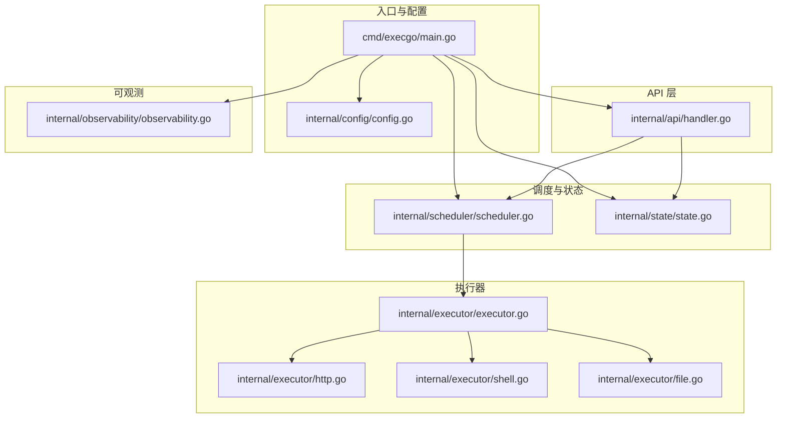
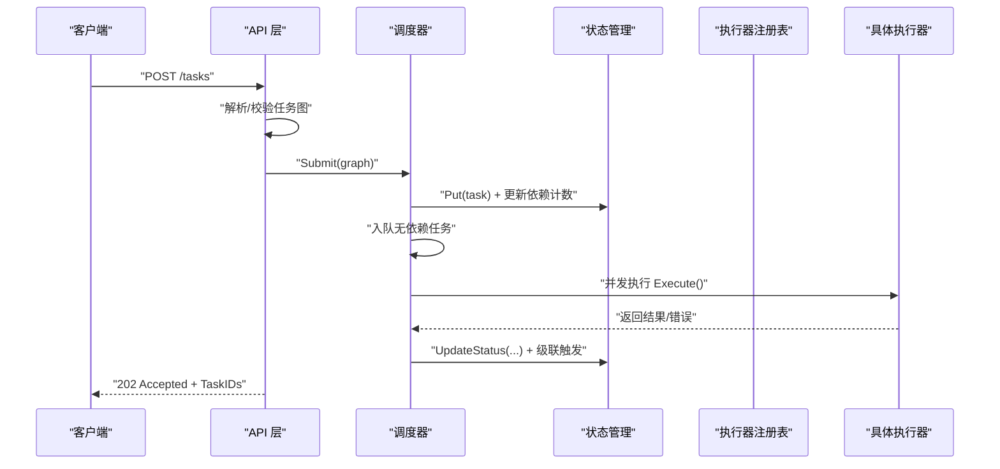
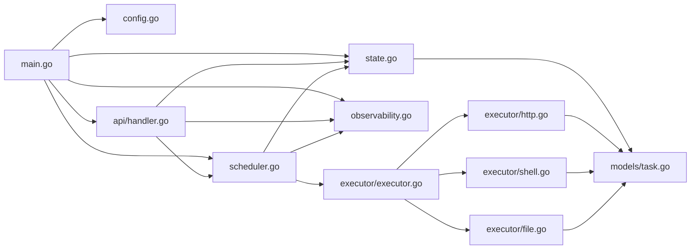

# 快速开始

<cite>
**本文引用的文件列表**
- [README.md](file://README.md)
- [go.mod](file://go.mod)
- [cmd/execgo/main.go](file://cmd/execgo/main.go)
- [internal/config/config.go](file://internal/config/config.go)
- [internal/api/handler.go](file://internal/api/handler.go)
- [internal/models/task.go](file://internal/models/task.go)
- [internal/executor/executor.go](file://internal/executor/executor.go)
- [internal/executor/http.go](file://internal/executor/http.go)
- [internal/executor/shell.go](file://internal/executor/shell.go)
- [internal/executor/file.go](file://internal/executor/file.go)
- [internal/scheduler/scheduler.go](file://internal/scheduler/scheduler.go)
- [internal/state/state.go](file://internal/state/state.go)
- [internal/observability/observability.go](file://internal/observability/observability.go)
</cite>

## 目录
1. [简介](#简介)
2. [项目结构](#项目结构)
3. [核心组件](#核心组件)
4. [架构总览](#架构总览)
5. [详细组件解析](#详细组件解析)
6. [依赖关系分析](#依赖关系分析)
7. [性能与并发特性](#性能与并发特性)
8. [安装与构建](#安装与构建)
9. [运行与配置](#运行与配置)
10. [任务提交示例](#任务提交示例)
11. [常用操作示例](#常用操作示例)
12. [环境变量与命令行参数](#环境变量与命令行参数)
13. [故障排查](#故障排查)
14. [结论](#结论)

## 简介
ExecGo 是一个使用纯 Go 标准库构建的极简 AI 执行引擎，零第三方依赖。它作为 AI Agent 的执行层，通过 HTTP API 暴露任务提交与管理能力，支持任务 DSL、DAG 调度、并发执行、可观测性与优雅关闭。

## 项目结构
仓库采用按领域分层的组织方式，入口在 cmd/execgo/main.go，核心业务分布在 internal 下的 api、config、executor、models、scheduler、state、observability 等包中。

图表来源
- [cmd/execgo/main.go:1-105](file://cmd/execgo/main.go#L1-L105)
- [internal/config/config.go:1-47](file://internal/config/config.go#L1-L47)
- [internal/api/handler.go:1-157](file://internal/api/handler.go#L1-L157)
- [internal/scheduler/scheduler.go:1-231](file://internal/scheduler/scheduler.go#L1-L231)
- [internal/state/state.go:1-180](file://internal/state/state.go#L1-L180)
- [internal/executor/executor.go:1-68](file://internal/executor/executor.go#L1-L68)
- [internal/executor/http.go:1-76](file://internal/executor/http.go#L1-L76)
- [internal/executor/shell.go:1-80](file://internal/executor/shell.go#L1-L80)
- [internal/executor/file.go:1-114](file://internal/executor/file.go#L1-L114)
- [internal/observability/observability.go:1-134](file://internal/observability/observability.go#L1-L134)

章节来源
- [README.md:149-177](file://README.md#L149-L177)
- [go.mod:1-4](file://go.mod#L1-L4)

## 核心组件
- 配置管理：从命令行与环境变量加载配置，支持优先级覆盖。
- API 层：提供任务提交、查询、删除、健康检查、指标等 HTTP 接口。
- 调度器：基于 DAG 的调度器，支持并发控制、重试与超时。
- 执行器：HTTP/Shell/File 内置执行器，注册表机制便于扩展。
- 状态管理：内存存储 + JSON 文件持久化，崩溃恢复。
- 可观测：结构化日志、traceID、/metrics 指标端点。

章节来源
- [internal/config/config.go:18-30](file://internal/config/config.go#L18-L30)
- [internal/api/handler.go:39-52](file://internal/api/handler.go#L39-L52)
- [internal/scheduler/scheduler.go:18-45](file://internal/scheduler/scheduler.go#L18-L45)
- [internal/executor/executor.go:14-67](file://internal/executor/executor.go#L14-L67)
- [internal/state/state.go:17-53](file://internal/state/state.go#L17-L53)
- [internal/observability/observability.go:50-80](file://internal/observability/observability.go#L50-L80)

## 架构总览
下图展示了从客户端到执行器的整体调用链路与组件交互。

图表来源
- [internal/api/handler.go:58-99](file://internal/api/handler.go#L58-L99)
- [internal/scheduler/scheduler.go:69-97](file://internal/scheduler/scheduler.go#L69-L97)
- [internal/scheduler/scheduler.go:127-190](file://internal/scheduler/scheduler.go#L127-L190)
- [internal/executor/executor.go:31-48](file://internal/executor/executor.go#L31-L48)

## 详细组件解析

### 配置加载与优先级
- 支持的配置项：监听地址、数据目录、最大并发、优雅关闭超时。
- 优先级：命令行 > 环境变量 > 默认值。
- Go 版本要求：模块声明使用 1.24.5。

章节来源
- [internal/config/config.go:18-30](file://internal/config/config.go#L18-L30)
- [go.mod:3](file://go.mod#L3)

### API 路由与处理流程
- 路由：POST /tasks、GET /tasks/{id}、GET /tasks、DELETE /tasks/{id}、GET /health、GET /metrics。
- 提交流程：解析 JSON -> 校验任务图 -> 校验执行器类型 -> 提交调度器 -> 返回 Accepted。
- 查询/删除/健康/指标：直接读取状态管理器或指标集合。

章节来源
- [internal/api/handler.go:39-52](file://internal/api/handler.go#L39-L52)
- [internal/api/handler.go:58-99](file://internal/api/handler.go#L58-L99)
- [internal/api/handler.go:101-146](file://internal/api/handler.go#L101-L146)

### 任务模型与 DAG 校验
- 任务字段：id、type、params、depends_on、retry、timeout、status、result、error、时间戳。
- 任务图校验：非空校验、重复 id、未知依赖、自依赖、拓扑排序环检测。
- 状态枚举：pending、running、success、failed、skipped。

章节来源
- [internal/models/task.go:21-39](file://internal/models/task.go#L21-L39)
- [internal/models/task.go:41-79](file://internal/models/task.go#L41-L79)
- [internal/models/task.go:81-121](file://internal/models/task.go#L81-L121)

### 调度器与并发控制
- 就绪队列：channel 缓冲队列，避免阻塞。
- 并发信号量：控制最大并发执行数。
- 依赖计数与反向图：Kahn 算法拓扑排序，支持环检测与级联触发。
- 重试与超时：指数退避 + context 超时；失败后记录错误，成功则记录结果。

章节来源
- [internal/scheduler/scheduler.go:18-45](file://internal/scheduler/scheduler.go#L18-L45)
- [internal/scheduler/scheduler.go:69-97](file://internal/scheduler/scheduler.go#L69-L97)
- [internal/scheduler/scheduler.go:109-125](file://internal/scheduler/scheduler.go#L109-L125)
- [internal/scheduler/scheduler.go:127-190](file://internal/scheduler/scheduler.go#L127-L190)
- [internal/scheduler/scheduler.go:192-230](file://internal/scheduler/scheduler.go#L192-L230)

### 执行器注册表与内置执行器
- 接口：Type() 返回类型标识，Execute(ctx, task) 执行任务。
- 注册表：全局 map + 读写锁，支持并发安全访问。
- 内置执行器：HTTP、Shell、File，均通过 params 解析参数。
- Shell 执行器：白名单命令，防止任意命令执行。
- File 执行器：路径清理防止目录穿越，支持 read/write/append/delete/stat。

章节来源
- [internal/executor/executor.go:14-67](file://internal/executor/executor.go#L14-L67)
- [internal/executor/http.go:14-75](file://internal/executor/http.go#L14-L75)
- [internal/executor/shell.go:14-79](file://internal/executor/shell.go#L14-L79)
- [internal/executor/file.go:13-113](file://internal/executor/file.go#L13-L113)

### 状态管理与持久化
- 内存存储：map[string]*Task + RWMutex。
- 恢复策略：启动时加载 JSON，将 running 状态重置为 pending。
- 定期持久化：每 30 秒写入磁盘，优雅关闭前进行最终持久化。
- 原子写入：先写临时文件再原子重命名。

章节来源
- [internal/state/state.go:17-53](file://internal/state/state.go#L17-L53)
- [internal/state/state.go:110-134](file://internal/state/state.go#L110-L134)
- [internal/state/state.go:136-158](file://internal/state/state.go#L136-L158)
- [internal/state/state.go:160-179](file://internal/state/state.go#L160-L179)

### 可观测性
- 结构化日志：JSON 输出，统一级别。
- 请求追踪：中间件注入 X-Trace-ID，上下文携带 trace_id。
- 指标：总任务数、运行中、成功、失败、按类型统计。

章节来源
- [internal/observability/observability.go:50-80](file://internal/observability/observability.go#L50-L80)
- [internal/observability/observability.go:86-133](file://internal/observability/observability.go#L86-L133)

## 依赖关系分析
- 入口 main 依赖配置、可观测、状态、调度器与 API。
- API 依赖状态、调度器、可观测。
- 调度器依赖状态、可观测、执行器注册表。
- 执行器注册表依赖 models。
- 执行器实现依赖 models。
- 状态依赖 models。
- 可观测独立，被多处使用。

图表来源
- [cmd/execgo/main.go:17-23](file://cmd/execgo/main.go#L17-L23)
- [internal/api/handler.go:12-17](file://internal/api/handler.go#L12-L17)
- [internal/scheduler/scheduler.go:12-16](file://internal/scheduler/scheduler.go#L12-L16)
- [internal/executor/executor.go:5-12](file://internal/executor/executor.go#L5-L12)
- [internal/state/state.go:14](file://internal/state/state.go#L14)

## 性能与并发特性
- 并发模型：goroutine + channel，信号量控制最大并发。
- 调度策略：Kahn 算法拓扑排序，避免环与死锁。
- 超时与重试：context 超时 + 指数退避，降低抖动。
- 持久化：定期与最终持久化，兼顾性能与可靠性。

章节来源
- [internal/scheduler/scheduler.go:18-45](file://internal/scheduler/scheduler.go#L18-L45)
- [internal/scheduler/scheduler.go:127-190](file://internal/scheduler/scheduler.go#L127-L190)
- [internal/state/state.go:160-179](file://internal/state/state.go#L160-L179)

## 安装与构建
- Go 版本要求：模块声明使用 1.24.5，建议使用相同或更高版本。
- 构建命令：在仓库根目录执行构建，输出二进制到 ./execgo。
- 运行命令：直接运行二进制，默认监听 :8080。

章节来源
- [go.mod:3](file://go.mod#L3)
- [README.md:65-77](file://README.md#L65-L77)

## 运行与配置
- 默认行为：监听 :8080，数据目录 data，最大并发 10，优雅关闭超时 15 秒。
- 自定义配置：通过命令行参数或环境变量设置，命令行优先级最高。
- 优雅关闭：接收 SIGINT/SIGTERM 后依次关闭 HTTP 服务、调度器、持久化。

章节来源
- [internal/config/config.go:18-30](file://internal/config/config.go#L18-L30)
- [cmd/execgo/main.go:25-104](file://cmd/execgo/main.go#L25-L104)

## 任务提交示例
- 单个任务：提交一个 shell 任务，例如执行 hostname。
- DAG 工作流：包含 fetch-data（HTTP）、save-result（File，依赖 fetch-data）、verify（File，依赖 save-result）。

章节来源
- [README.md:79-126](file://README.md#L79-L126)

## 常用操作示例
- 查询任务：列出所有任务、查询单个任务、删除任务。
- 健康检查：/health 返回状态、版本、运行时长。
- 指标：/metrics 返回任务总数、运行中、成功、失败及按类型统计。

章节来源
- [README.md:128-145](file://README.md#L128-L145)
- [internal/api/handler.go:101-146](file://internal/api/handler.go#L101-L146)

## 环境变量与命令行参数
- -addr / EXECGO_ADDR：HTTP 监听地址，默认 :8080。
- -data-dir / EXECGO_DATA_DIR：数据目录，默认 data。
- -max-concurrency / EXECGO_MAX_CONCURRENCY：最大并发，默认 10。
- -shutdown-timeout / EXECGO_SHUTDOWN_TIMEOUT：优雅关闭超时（秒），默认 15。
- 优先级：flag > env > default。

章节来源
- [README.md:216-226](file://README.md#L216-L226)
- [internal/config/config.go:18-30](file://internal/config/config.go#L18-L30)

## 故障排查
- 任务提交失败：检查 JSON 格式、任务图校验（id/type/依赖/环检测）。
- 未知任务类型：确认执行器已注册，或使用内置类型 http/shell/file。
- Shell 命令被拒绝：确认命令在白名单中。
- 文件操作异常：确认路径未穿越，且有足够权限。
- 健康检查失败：查看日志与端口占用情况。
- 指标不更新：确认 /metrics 路由可达，以及调度器正常运行。

章节来源
- [internal/api/handler.go:58-99](file://internal/api/handler.go#L58-L99)
- [internal/executor/shell.go:46-54](file://internal/executor/shell.go#L46-L54)
- [internal/executor/file.go:35-51](file://internal/executor/file.go#L35-L51)
- [internal/api/handler.go:128-146](file://internal/api/handler.go#L128-L146)

## 结论
ExecGo 提供了最小可用的 AI 执行引擎能力：任务 DSL、DAG 调度、并发执行、可观测与持久化。通过 5 分钟即可完成安装、运行与首个任务提交，适合快速集成与原型验证。