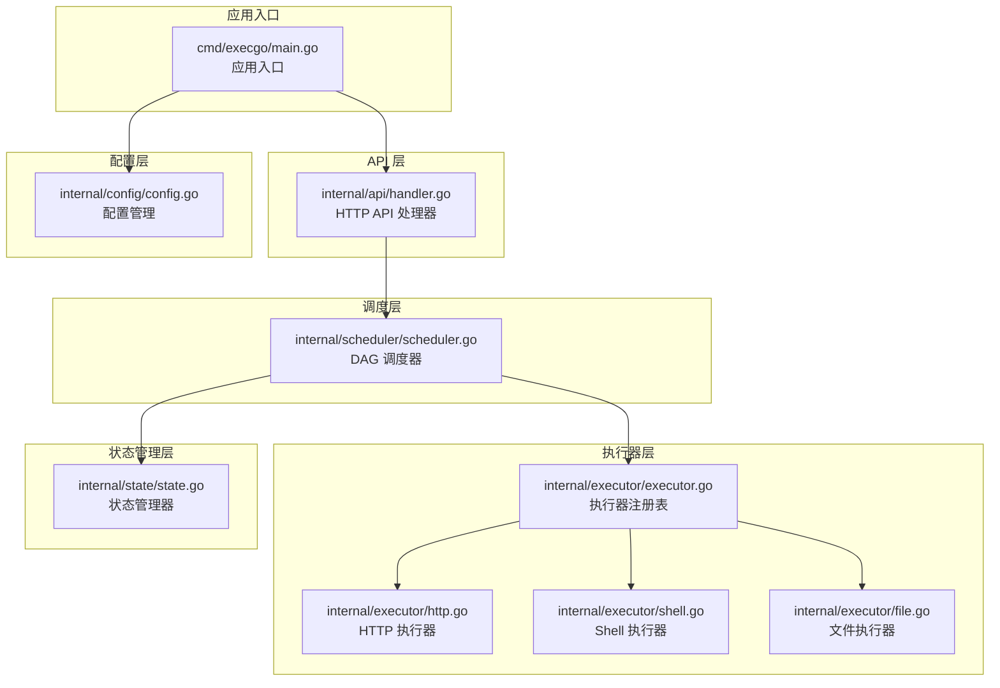
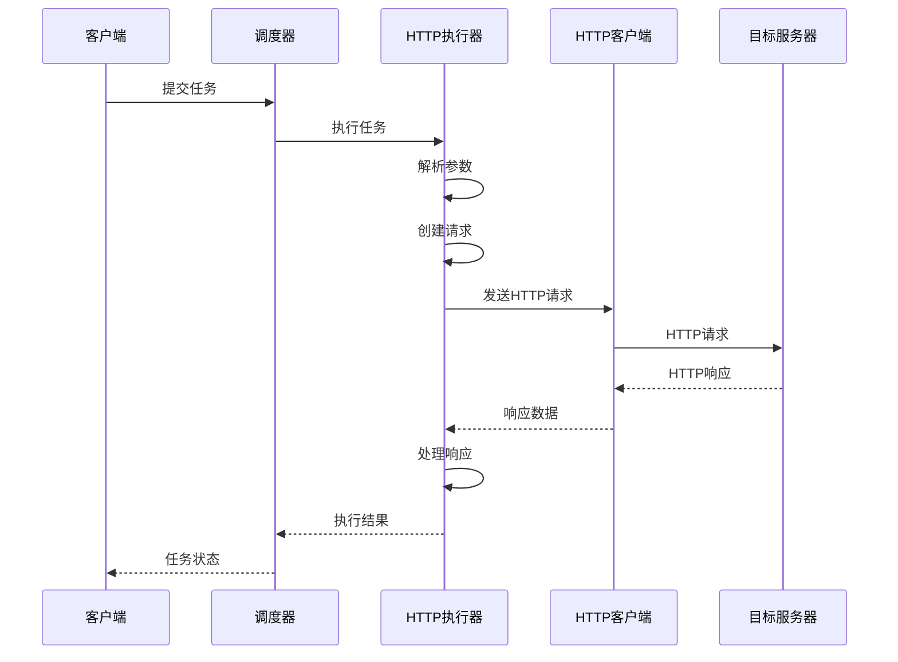
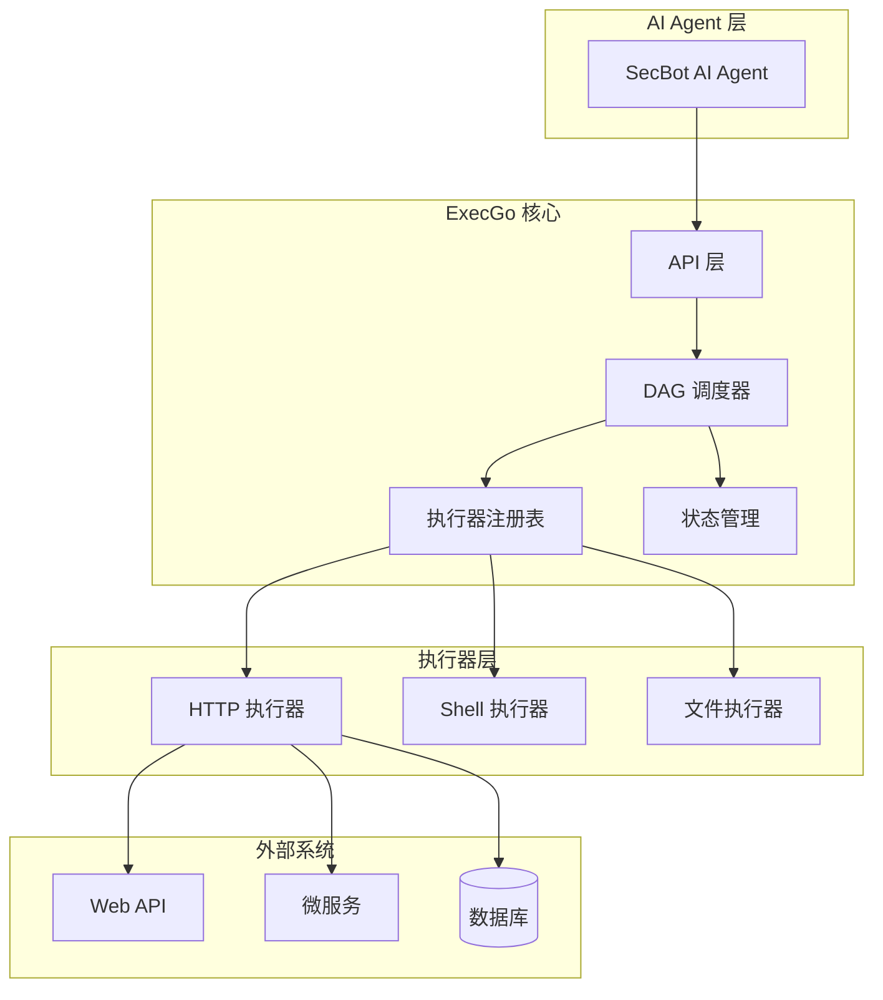
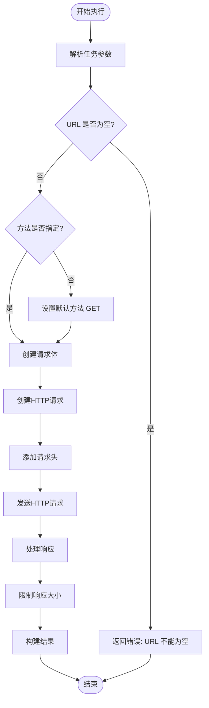
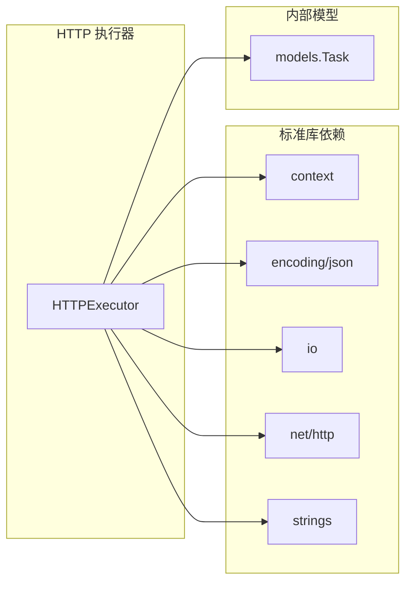

# HTTP 执行器

<cite>
**本文档引用的文件**
- [http.go](file://internal/executor/http.go)
- [executor.go](file://internal/executor/executor.go)
- [task.go](file://internal/models/task.go)
- [scheduler.go](file://internal/scheduler/scheduler.go)
- [handler.go](file://internal/api/handler.go)
- [state.go](file://internal/state/state.go)
- [config.go](file://internal/config/config.go)
- [main.go](file://cmd/execgo/main.go)
- [README.md](file://README.md)
</cite>

## 目录
1. [简介](#简介)
2. [项目结构](#项目结构)
3. [核心组件](#核心组件)
4. [架构概览](#架构概览)
5. [详细组件分析](#详细组件分析)
6. [依赖关系分析](#依赖关系分析)
7. [性能考量](#性能考量)
8. [故障排除指南](#故障排除指南)
9. [结论](#结论)
10. [附录](#附录)

## 简介

HTTP 执行器是 ExecGo 执行引擎中的一个内置执行器，专门用于通过 HTTP 协议执行任务。它实现了统一的执行器接口，能够处理各种类型的 HTTP 请求，包括 GET、POST、PUT、DELETE 等标准方法，并提供了完整的错误处理、超时控制和重试机制。

ExecGo 是一个使用纯 Go 标准库构建的极简 AI 执行引擎，零第三方依赖。它作为 AI Agent 的执行层，通过 HTTP API 暴露任务提交与管理能力，支持 DAG 任务编排、并发执行和可观测性。

## 项目结构

ExecGo 采用分层架构设计，主要包含以下核心模块：



**图表来源**
- [main.go:25-104](file://cmd/execgo/main.go#L25-L104)
- [handler.go:39-52](file://internal/api/handler.go#L39-L52)
- [scheduler.go:18-45](file://internal/scheduler/scheduler.go#L18-L45)
- [http.go:22-25](file://internal/executor/http.go#L22-L25)

**章节来源**
- [main.go:25-104](file://cmd/execgo/main.go#L25-L104)
- [README.md:149-177](file://README.md#L149-L177)

## 核心组件

### HTTP 执行器接口

HTTP 执行器实现了统一的执行器接口，具有以下关键特性：

- **类型标识**: 返回 "http" 字符串标识
- **参数解析**: 支持 JSON 格式的参数解析
- **上下文支持**: 完全支持 Go context 超时和取消
- **错误处理**: 提供详细的错误信息和状态码

### HTTP 参数结构

HTTP 执行器使用结构化的参数定义：

| 参数名称 | 类型 | 必需 | 描述 |
|---------|------|------|------|
| url | string | 是 | 目标 URL 地址 |
| method | string | 否 | HTTP 方法，默认 GET |
| headers | map[string]string | 否 | 请求头映射 |
| body | string | 否 | 请求体内容 |

### 任务执行流程

HTTP 执行器的执行流程遵循标准的 HTTP 请求生命周期：



**图表来源**
- [scheduler.go:127-190](file://internal/scheduler/scheduler.go#L127-L190)
- [http.go:27-75](file://internal/executor/http.go#L27-L75)

**章节来源**
- [http.go:14-20](file://internal/executor/http.go#L14-L20)
- [http.go:22-25](file://internal/executor/http.go#L22-L25)

## 架构概览

HTTP 执行器在整个 ExecGo 架构中扮演着关键角色，连接 AI Agent 和外部系统：



**图表来源**
- [README.md:32-57](file://README.md#L32-L57)
- [executor.go:26-67](file://internal/executor/executor.go#L26-L67)

## 详细组件分析

### HTTP 执行器实现

HTTP 执行器的核心实现位于 `internal/executor/http.go` 文件中，采用了简洁而高效的实现方式：

#### 参数验证与解析

执行器首先解析任务参数，确保必要的 URL 参数存在：



**图表来源**
- [http.go:27-75](file://internal/executor/http.go#L27-L75)

#### 请求头处理机制

HTTP 执行器支持灵活的请求头设置，所有自定义头部都会被正确传递到目标服务器：

- **Header 设置**: 通过遍历参数中的 headers 映射设置
- **覆盖行为**: 标准 HTTP 头部会被正常覆盖
- **大小写处理**: 头部键保持原始大小写传递

#### 响应处理策略

执行器采用统一的响应处理策略：

| 状态码范围 | 处理方式 | 返回内容 |
|-----------|----------|----------|
| 2xx 成功 | 正常返回 | 包含状态码和响应体 |
| 3xx 重定向 | 正常返回 | 包含状态码和响应体 |
| 4xx 客户端错误 | 返回结果但标记错误 | 包含状态码和响应体 |
| 5xx 服务器错误 | 返回结果但标记错误 | 包含状态码和响应体 |

**章节来源**
- [http.go:27-75](file://internal/executor/http.go#L27-L75)

### 超时控制机制

HTTP 执行器完全依赖 Go 标准库的 HTTP 客户端超时机制：

#### 上下文超时集成

调度器为每个任务创建独立的执行上下文，支持：

- **任务级超时**: 通过 `task.Timeout` 参数设置毫秒级超时
- **自动取消**: 超时后自动取消请求
- **资源清理**: 确保网络连接正确关闭

#### 默认客户端行为

使用 `http.DefaultClient` 的默认配置：

- **连接超时**: 无默认超时限制
- **读取超时**: 无默认超时限制  
- **写入超时**: 无默认超时限制
- **连接池**: 使用默认连接池管理

**章节来源**
- [scheduler.go:163-172](file://internal/scheduler/scheduler.go#L163-L172)
- [http.go:54-57](file://internal/executor/http.go#L54-L57)

### 错误处理策略

HTTP 执行器实现了多层次的错误处理机制：

#### 参数验证错误

- **JSON 解析失败**: 返回详细的解析错误信息
- **必需参数缺失**: URL 参数为空时返回明确错误
- **方法默认值**: 未指定方法时自动设置为 GET

#### 网络请求错误

- **请求创建失败**: 返回底层网络错误
- **连接失败**: 网络不可达或超时
- **协议错误**: HTTP 协议层面的问题

#### 响应处理错误

- **响应体读取失败**: IO 错误或网络中断
- **响应体过大**: 自动限制为 1MB，避免内存溢出

**章节来源**
- [http.go:29-35](file://internal/executor/http.go#L29-L35)
- [http.go:47-48](file://internal/executor/http.go#L47-L48)
- [http.go:61-63](file://internal/executor/http.go#L61-L63)

### 重试机制实现

虽然 HTTP 执行器本身不直接实现重试逻辑，但整个 ExecGo 系统提供了完善的重试机制：

#### 指数退避算法

重试采用指数退避策略：

- **首次延迟**: 100ms
- **退避公式**: 100ms × 2^(attempt-2)
- **最大延迟**: 10 秒
- **总尝试次数**: `task.Retry + 1`

#### 重试触发条件

- **网络错误**: 连接超时、DNS 解析失败
- **HTTP 错误**: 5xx 服务器错误
- **上下文取消**: 超时导致的取消

**章节来源**
- [scheduler.go:144-179](file://internal/scheduler/scheduler.go#L144-L179)

## 依赖关系分析

HTTP 执行器的依赖关系相对简单，主要依赖于标准库：



**图表来源**
- [http.go:3-12](file://internal/executor/http.go#L3-L12)

### 外部依赖分析

HTTP 执行器的外部依赖极其有限：

| 依赖包 | 版本要求 | 用途 | 作用域 |
|--------|----------|------|--------|
| context | Go 1.22+ | 上下文管理 | 全局 |
| encoding/json | Go 1.22+ | JSON 编解码 | 全局 |
| io | Go 1.22+ | IO 操作 | 全局 |
| net/http | Go 1.22+ | HTTP 客户端 | 全局 |
| strings | Go 1.22+ | 字符串处理 | 全局 |

**章节来源**
- [http.go:3-12](file://internal/executor/http.go#L3-L12)

## 性能考量

### 内存使用优化

HTTP 执行器采用了多项内存优化措施：

#### 响应体大小限制

- **默认限制**: 1MB
- **目的**: 防止大型响应占用过多内存
- **实现**: 使用 `io.LimitReader` 限制读取大小

#### 连接复用

- **默认客户端**: 使用 `http.DefaultClient`
- **连接池**: 自动管理 HTTP 连接复用
- **Keep-Alive**: 默认启用连接保持

### 并发性能

HTTP 执行器本身是无状态的，适合高并发场景：

- **线程安全**: 无共享可变状态
- **快速执行**: 主要进行网络 I/O
- **资源隔离**: 每个请求独立的上下文

**章节来源**
- [http.go:60-63](file://internal/executor/http.go#L60-L63)

## 故障排除指南

### 常见问题诊断

#### URL 相关错误

**问题**: "url is required"
**原因**: 任务参数中缺少 URL 字段
**解决方案**: 确保在任务参数中提供有效的 URL

#### 网络连接问题

**问题**: "http request failed"
**原因**: 网络连接超时或 DNS 解析失败
**解决方案**: 
- 检查网络连通性
- 验证目标服务器可达性
- 调整超时设置

#### 响应体过大

**问题**: 响应被截断
**原因**: 超过 1MB 限制
**解决方案**: 
- 优化 API 响应大小
- 使用分页或流式传输
- 调整客户端处理逻辑

### 调试技巧

#### 启用详细日志

通过配置日志级别获取更多调试信息：

```bash
# 设置更详细的日志输出
export EXECGO_LOG_LEVEL=debug
./execgo
```

#### 监控执行状态

使用 `/metrics` 端点监控系统性能：

```bash
curl http://localhost:8080/metrics
```

**章节来源**
- [http.go:29-35](file://internal/executor/http.go#L29-L35)
- [http.go:55-57](file://internal/executor/http.go#L55-L57)

## 结论

HTTP 执行器作为 ExecGo 的核心组件之一，展现了极简设计的优势：

### 主要优势

1. **零依赖设计**: 完全基于 Go 标准库，无第三方依赖
2. **简洁实现**: 代码量少，易于理解和维护
3. **功能完整**: 支持主流 HTTP 方法和参数
4. **性能优秀**: 内存使用优化，适合高并发场景

### 应用场景

HTTP 执行器适用于以下典型场景：

- **API 调用**: 调用外部 Web API 获取数据
- **服务集成**: 与其他微服务进行通信
- **外部系统交互**: 与第三方系统进行数据交换
- **数据采集**: 从远程服务拉取数据

### 最佳实践

1. **合理设置超时**: 根据 API 响应时间设置合适的超时值
2. **监控响应大小**: 避免处理过大的响应体
3. **使用重试机制**: 对于关键 API 调用启用适当的重试
4. **关注错误码**: 正确处理不同 HTTP 状态码

## 附录

### 配置参数说明

| 参数名称 | 类型 | 默认值 | 描述 |
|---------|------|--------|------|
| addr | string | :8080 | HTTP 监听地址 |
| data-dir | string | data | 数据持久化目录 |
| max-concurrency | int | 10 | 最大并发执行数 |
| shutdown-timeout | int | 15 | 优雅关闭超时(秒) |

### 使用示例

#### 基本 HTTP GET 请求

```json
{
  "tasks": [
    {
      "id": "fetch-data",
      "type": "http",
      "params": {
        "url": "https://httpbin.org/json",
        "method": "GET"
      },
      "timeout": 10000
    }
  ]
}
```

#### 带请求头的 POST 请求

```json
{
  "tasks": [
    {
      "id": "submit-data",
      "type": "http",
      "params": {
        "url": "https://httpbin.org/post",
        "method": "POST",
        "headers": {
          "Content-Type": "application/json",
          "Authorization": "Bearer token"
        },
        "body": "{\"key\":\"value\"}"
      },
      "retry": 3
    }
  ]
}
```

### 安全考虑

#### 网络安全

- **TLS 支持**: 默认支持 HTTPS，自动处理证书验证
- **超时控制**: 防止长时间连接占用资源
- **响应限制**: 防止内存溢出攻击

#### 输入验证

- **URL 验证**: 确保 URL 格式正确
- **方法白名单**: 仅支持标准 HTTP 方法
- **头部过滤**: 允许自定义头部，但不验证具体内容

**章节来源**
- [README.md:195-213](file://README.md#L195-L213)
- [config.go:10-16](file://internal/config/config.go#L10-L16)