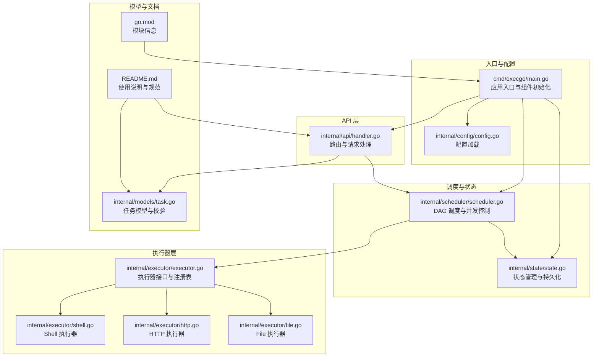
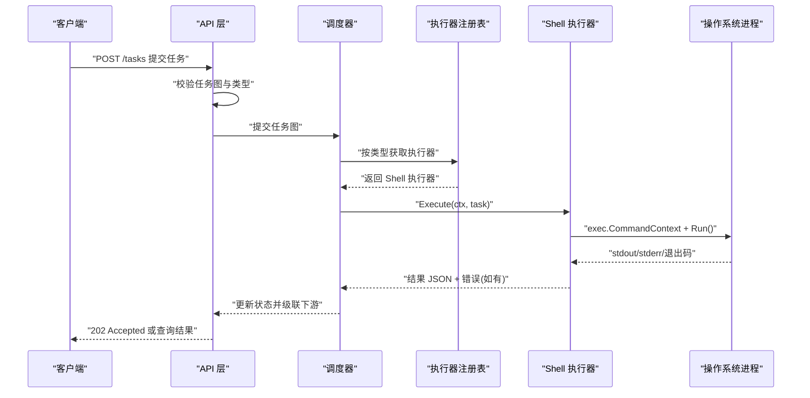
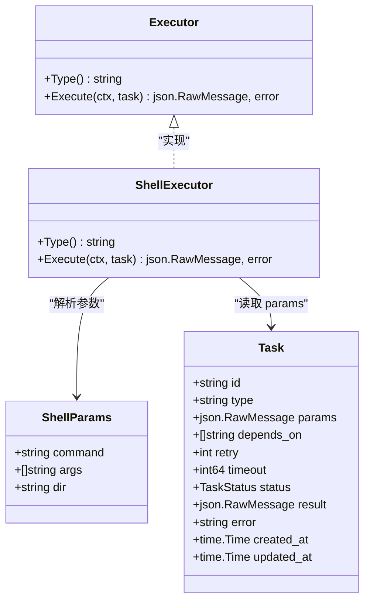
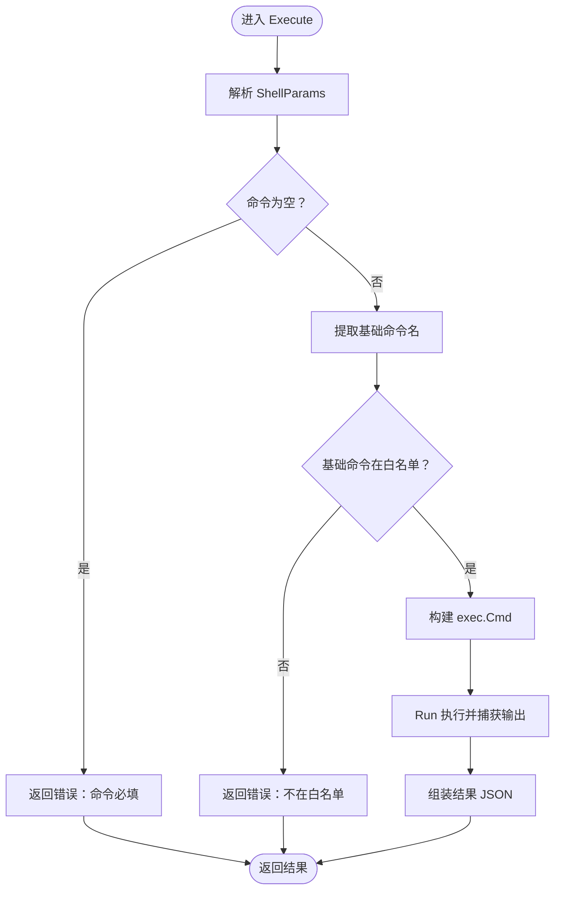
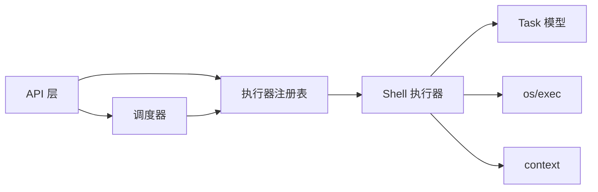

# Shell 执行器

<cite>
**本文引用的文件**
- [cmd/execgo/main.go](file://cmd/execgo/main.go)
- [internal/executor/executor.go](file://internal/executor/executor.go)
- [internal/executor/shell.go](file://internal/executor/shell.go)
- [internal/executor/http.go](file://internal/executor/http.go)
- [internal/executor/file.go](file://internal/executor/file.go)
- [internal/models/task.go](file://internal/models/task.go)
- [internal/config/config.go](file://internal/config/config.go)
- [internal/scheduler/scheduler.go](file://internal/scheduler/scheduler.go)
- [internal/state/state.go](file://internal/state/state.go)
- [internal/api/handler.go](file://internal/api/handler.go)
- [README.md](file://README.md)
- [go.mod](file://go.mod)
</cite>

## 目录
1. [简介](#简介)
2. [项目结构](#项目结构)
3. [核心组件](#核心组件)
4. [架构总览](#架构总览)
5. [详细组件分析](#详细组件分析)
6. [依赖分析](#依赖分析)
7. [性能考量](#性能考量)
8. [故障排查指南](#故障排查指南)
9. [结论](#结论)
10. [附录](#附录)

## 简介
本文件聚焦于 Shell 执行器的实现与使用，解释其命令执行机制、白名单设计与安全防护、参数处理、环境变量与工作目录设置、进程管理、输出捕获与错误处理，并提供配置选项、使用示例与安全最佳实践。Shell 执行器通过“白名单”机制限制可执行命令集，确保在受控范围内执行系统命令，避免任意命令注入风险。

## 项目结构
ExecGo 采用分层架构：API 层负责接收任务请求并进行校验；调度器按 DAG 依赖与并发策略执行任务；执行器层包含多种内置执行器（HTTP、Shell、File），并通过注册表机制扩展；状态管理器负责内存状态与持久化；可观测性模块提供日志、追踪与指标。

图表来源
- [cmd/execgo/main.go:1-105](file://cmd/execgo/main.go#L1-L105)
- [internal/config/config.go:1-47](file://internal/config/config.go#L1-L47)
- [internal/api/handler.go:50-156](file://internal/api/handler.go#L50-L156)
- [internal/scheduler/scheduler.go:1-230](file://internal/scheduler/scheduler.go#L1-L230)
- [internal/state/state.go:1-179](file://internal/state/state.go#L1-L179)
- [internal/executor/executor.go:1-68](file://internal/executor/executor.go#L1-L68)
- [internal/executor/shell.go:1-80](file://internal/executor/shell.go#L1-L80)
- [internal/executor/http.go:1-76](file://internal/executor/http.go#L1-L76)
- [internal/executor/file.go:1-114](file://internal/executor/file.go#L1-L114)
- [internal/models/task.go:1-149](file://internal/models/task.go#L1-L149)
- [README.md:1-267](file://README.md#L1-L267)
- [go.mod:1-4](file://go.mod#L1-L4)

章节来源
- [cmd/execgo/main.go:1-105](file://cmd/execgo/main.go#L1-L105)
- [README.md:149-177](file://README.md#L149-L177)

## 核心组件
- 执行器接口与注册表：定义统一的执行器接口，提供注册、获取与内置执行器注册方法，便于扩展新的执行器类型。
- Shell 执行器：实现白名单命令执行、参数解析、工作目录设置、输出捕获与错误封装。
- HTTP 执行器：基于标准库 HTTP 客户端发起请求，限制响应体大小，返回状态码与响应体。
- File 执行器：提供读写追加删除统计等文件操作，路径清理防止目录穿越。
- 任务模型与校验：定义任务契约、DAG 校验、拓扑排序与环检测。
- 配置管理：从命令行标志与环境变量加载配置，支持监听地址、数据目录、最大并发与优雅关闭超时。
- 调度器：基于依赖图与信号量控制并发，支持重试与超时，执行完成后级联更新下游任务状态。
- 状态管理：内存状态 + JSON 文件定期持久化，崩溃恢复时重置运行中任务为待执行。

章节来源
- [internal/executor/executor.go:14-68](file://internal/executor/executor.go#L14-L68)
- [internal/executor/shell.go:24-80](file://internal/executor/shell.go#L24-L80)
- [internal/executor/http.go:14-76](file://internal/executor/http.go#L14-L76)
- [internal/executor/file.go:13-114](file://internal/executor/file.go#L13-L114)
- [internal/models/task.go:21-79](file://internal/models/task.go#L21-L79)
- [internal/config/config.go:10-47](file://internal/config/config.go#L10-L47)
- [internal/scheduler/scheduler.go:18-230](file://internal/scheduler/scheduler.go#L18-L230)
- [internal/state/state.go:17-179](file://internal/state/state.go#L17-L179)

## 架构总览
下图展示 Shell 执行器在整体系统中的位置与交互流程：API 层接收任务请求，校验任务类型后交由调度器；调度器根据并发与依赖策略选择执行器；执行器通过上下文控制生命周期，执行命令并返回结果。

图表来源
- [internal/api/handler.go:58-88](file://internal/api/handler.go#L58-L88)
- [internal/scheduler/scheduler.go:69-190](file://internal/scheduler/scheduler.go#L69-L190)
- [internal/executor/executor.go:38-48](file://internal/executor/executor.go#L38-L48)
- [internal/executor/shell.go:36-79](file://internal/executor/shell.go#L36-L79)

## 详细组件分析

### Shell 执行器类图

图表来源
- [internal/executor/executor.go:14-20](file://internal/executor/executor.go#L14-L20)
- [internal/executor/shell.go:24-29](file://internal/executor/shell.go#L24-L29)
- [internal/models/task.go:22-34](file://internal/models/task.go#L22-L34)

章节来源
- [internal/executor/executor.go:14-20](file://internal/executor/executor.go#L14-L20)
- [internal/executor/shell.go:24-29](file://internal/executor/shell.go#L24-L29)
- [internal/models/task.go:22-34](file://internal/models/task.go#L22-L34)

### 命令白名单机制
- 白名单定义：通过映射表维护允许执行的命令集合，覆盖常用系统工具与跨平台命令。
- 命令提取：从传入的完整命令路径中提取基础命令名，避免路径污染导致绕过。
- 校验规则：若基础命令不在白名单内，则拒绝执行并返回错误。
- 安全防护：仅允许白名单内的命令，有效降低命令注入与任意代码执行风险。

图表来源
- [internal/executor/shell.go:36-79](file://internal/executor/shell.go#L36-L79)

章节来源
- [internal/executor/shell.go:14-22](file://internal/executor/shell.go#L14-L22)
- [internal/executor/shell.go:42-54](file://internal/executor/shell.go#L42-L54)

### 命令参数处理、环境变量与工作目录
- 参数处理：从任务参数中解析命令、参数数组与工作目录；参数数组直接透传给底层命令。
- 环境变量：当前实现未显式设置额外环境变量，保持默认环境；如需扩展可在构建命令时设置。
- 工作目录：若提供了 dir 字段，则设置到命令对象的工作目录，影响命令执行的相对路径行为。

章节来源
- [internal/executor/shell.go:24-29](file://internal/executor/shell.go#L24-L29)
- [internal/executor/shell.go:56-59](file://internal/executor/shell.go#L56-L59)

### 进程管理、输出捕获与错误处理
- 进程管理：使用带上下文的命令构造函数，支持取消与超时；通过进程状态获取退出码。
- 输出捕获：使用缓冲区捕获标准输出与标准错误，避免阻塞与丢失数据。
- 错误处理：执行失败时仍返回包含 stdout、stderr 与 exit_code 的结果，便于上层判断与记录。

章节来源
- [internal/executor/shell.go:56-79](file://internal/executor/shell.go#L56-L79)

### 与调度器的协作
- 调度器在执行前会校验任务类型是否存在对应执行器；执行过程中通过上下文控制生命周期；完成后根据结果更新状态并级联触发下游任务。
- Shell 执行器返回的结果会被调度器用于状态更新与指标统计。

章节来源
- [internal/api/handler.go:76-85](file://internal/api/handler.go#L76-L85)
- [internal/scheduler/scheduler.go:131-190](file://internal/scheduler/scheduler.go#L131-L190)

## 依赖分析
- Shell 执行器依赖任务模型以读取参数，依赖标准库进程包执行命令，依赖上下文控制生命周期。
- 注册表提供按类型获取执行器的能力，调度器通过注册表选择具体执行器。
- API 层负责任务图校验与未知类型提示，确保只提交已注册的执行器类型。

图表来源
- [internal/executor/shell.go:36-79](file://internal/executor/shell.go#L36-L79)
- [internal/executor/executor.go:38-48](file://internal/executor/executor.go#L38-L48)
- [internal/api/handler.go:76-85](file://internal/api/handler.go#L76-L85)
- [internal/scheduler/scheduler.go:69-190](file://internal/scheduler/scheduler.go#L69-L190)

章节来源
- [internal/executor/executor.go:38-48](file://internal/executor/executor.go#L38-L48)
- [internal/api/handler.go:76-85](file://internal/api/handler.go#L76-L85)
- [internal/scheduler/scheduler.go:69-190](file://internal/scheduler/scheduler.go#L69-L190)

## 性能考量
- 并发控制：调度器通过信号量限制最大并发，避免资源争用与系统过载。
- 超时与取消：任务与执行器均支持上下文超时与取消，防止长时间阻塞。
- 输出限制：Shell 执行器捕获 stdout/stderr，建议结合日志与指标监控输出大小与耗时。
- 持久化：状态管理器定期持久化，减少崩溃后重跑成本，但需注意磁盘 IO 对吞吐的影响。

章节来源
- [internal/config/config.go:10-16](file://internal/config/config.go#L10-L16)
- [internal/scheduler/scheduler.go:34-45](file://internal/scheduler/scheduler.go#L34-L45)
- [internal/state/state.go:160-179](file://internal/state/state.go#L160-L179)

## 故障排查指南
- 常见错误
  - 未知任务类型：API 层会提示可用的执行器类型，确认任务 type 是否正确。
  - 命令不在白名单：检查命令是否在允许列表中，必要时扩展白名单或改用其他执行器。
  - 命令参数解析失败：确认 params 符合 ShellParams 结构。
  - 执行失败：查看返回结果中的 stdout、stderr 与 exit_code，定位问题。
- 日志与指标
  - 使用结构化日志与 /metrics 端点观察任务总数、运行中数量、成功/失败计数与按类型分布。
- 优雅关闭
  - 应用收到信号后按顺序关闭 HTTP 服务、调度器与持久化，确保状态一致。

章节来源
- [internal/api/handler.go:76-85](file://internal/api/handler.go#L76-L85)
- [internal/executor/shell.go:36-79](file://internal/executor/shell.go#L36-L79)
- [cmd/execgo/main.go:81-104](file://cmd/execgo/main.go#L81-L104)

## 结论
Shell 执行器通过严格的白名单机制与上下文控制，实现了安全可控的命令执行能力。配合调度器的并发与超时控制、状态管理的持久化与可观测性模块，形成完整的任务执行闭环。建议在生产环境中谨慎扩展白名单，结合日志与指标持续监控执行行为与系统健康状况。

## 附录

### 配置选项
- 监听地址：支持命令行与环境变量设置，默认 :8080。
- 数据目录：持久化目录，默认 data。
- 最大并发：控制调度器并发执行上限，默认 10。
- 优雅关闭超时：单位秒，默认 15。

章节来源
- [internal/config/config.go:18-30](file://internal/config/config.go#L18-L30)
- [README.md:216-226](file://README.md#L216-L226)

### 使用示例
- 单任务 Shell：提交一个执行主机名的 Shell 任务。
- DAG 工作流：先发起 HTTP 请求，再写入文件，最后读取文件内容。

章节来源
- [README.md:79-145](file://README.md#L79-L145)

### Shell 执行器参数规范
- 参数结构：包含命令字符串、参数数组与工作目录字段。
- 允许命令：详见文档列出的白名单命令集合。

章节来源
- [internal/executor/shell.go:24-29](file://internal/executor/shell.go#L24-L29)
- [README.md:202-208](file://README.md#L202-L208)

### 安全最佳实践
- 仅保留必要的命令到白名单，避免过度开放。
- 不要信任外部输入直接拼接到命令中，优先使用参数数组。
- 如需自定义环境变量，应在执行器内部集中设置，避免污染默认环境。
- 对输出进行截断与限流，防止异常输出导致内存压力。
- 结合日志与指标监控异常命令与高耗时任务，及时告警与处置。

章节来源
- [internal/executor/shell.go:14-22](file://internal/executor/shell.go#L14-L22)
- [internal/executor/shell.go:61-71](file://internal/executor/shell.go#L61-L71)
- [README.md:253-261](file://README.md#L253-L261)