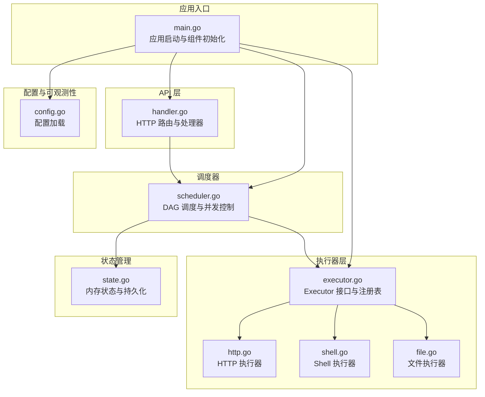
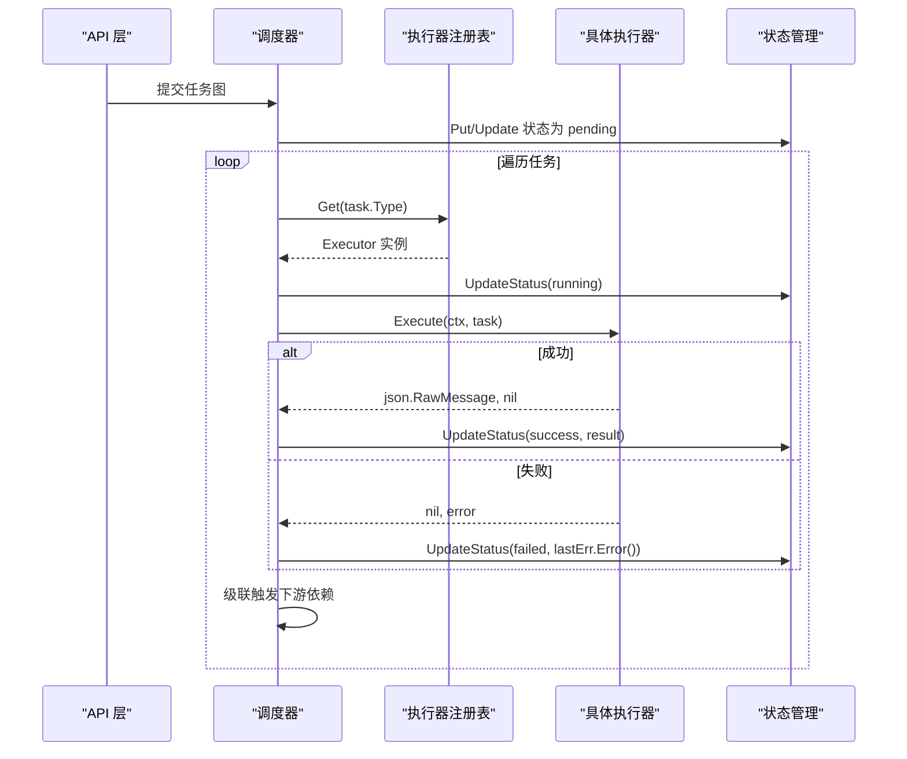
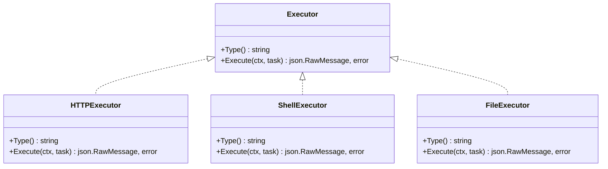
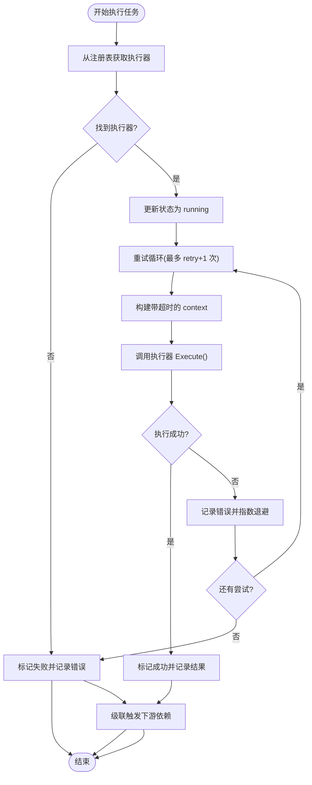
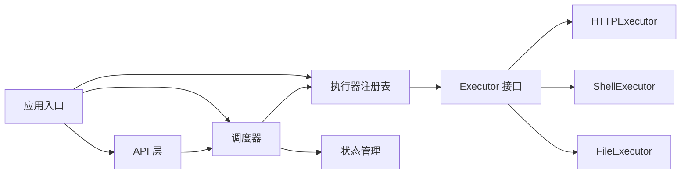

# 执行器接口设计

<cite>
**本文档引用的文件**
- [executor.go](file://internal/executor/executor.go)
- [scheduler.go](file://internal/scheduler/scheduler.go)
- [task.go](file://internal/models/task.go)
- [http.go](file://internal/executor/http.go)
- [shell.go](file://internal/executor/shell.go)
- [file.go](file://internal/executor/file.go)
- [handler.go](file://internal/api/handler.go)
- [state.go](file://internal/state/state.go)
- [config.go](file://internal/config/config.go)
- [main.go](file://cmd/execgo/main.go)
- [README.md](file://README.md)
</cite>

## 目录
1. [简介](#简介)
2. [项目结构](#项目结构)
3. [核心组件](#核心组件)
4. [架构总览](#架构总览)
5. [详细组件分析](#详细组件分析)
6. [依赖关系分析](#依赖关系分析)
7. [性能考虑](#性能考虑)
8. [故障排除指南](#故障排除指南)
9. [结论](#结论)
10. [附录](#附录)

## 简介
本文件聚焦于执行器接口设计，系统性阐述 Executor 接口的职责、方法定义、设计原则与约束条件，并结合调度器调用流程与生命周期管理进行深入解析。同时提供实现最佳实践与注意事项，帮助开发者正确扩展新的执行器类型。

## 项目结构
ExecGo 采用清晰的分层架构：API 层负责请求接入与校验；调度器负责 DAG 任务编排与并发控制；执行器层负责具体任务执行；状态管理层负责内存与持久化存储；可观测性模块提供日志、追踪与指标。

图表来源
- [main.go:25-104](file://cmd/execgo/main.go#L25-L104)
- [handler.go:39-52](file://internal/api/handler.go#L39-L52)
- [scheduler.go:18-45](file://internal/scheduler/scheduler.go#L18-L45)
- [executor.go:14-67](file://internal/executor/executor.go#L14-L67)
- [http.go:22-75](file://internal/executor/http.go#L22-L75)
- [shell.go:31-79](file://internal/executor/shell.go#L31-L79)
- [file.go:20-113](file://internal/executor/file.go#L20-L113)
- [state.go:17-53](file://internal/state/state.go#L17-L53)
- [config.go:18-30](file://internal/config/config.go#L18-L30)

章节来源
- [README.md:32-57](file://README.md#L32-L57)
- [main.go:25-104](file://cmd/execgo/main.go#L25-L104)

## 核心组件
- 执行器接口 Executor：定义统一的 Type() 与 Execute() 方法，确保不同执行器的可替换性与可扩展性。
- 调度器 Scheduler：负责任务图的拓扑构建、并发控制、重试与超时、状态推进与级联触发。
- 任务模型 Task：描述任务的契约字段（id、type、params、depends_on、retry、timeout、status、result、error 等），并提供校验与 DAG 环检测。
- 状态管理 State Manager：提供内存存储与 JSON 文件持久化，支持周期性持久化与崩溃恢复。
- 注册表：全局注册与按类型检索执行器，支持内置执行器注册与扩展。

章节来源
- [executor.go:14-67](file://internal/executor/executor.go#L14-L67)
- [scheduler.go:18-231](file://internal/scheduler/scheduler.go#L18-L231)
- [task.go:21-79](file://internal/models/task.go#L21-L79)
- [state.go:17-180](file://internal/state/state.go#L17-L180)

## 架构总览
下图展示执行器接口在调度器中的调用位置与关键交互点，体现上下文传递、错误处理与返回值格式要求。

图表来源
- [scheduler.go:69-97](file://internal/scheduler/scheduler.go#L69-L97)
- [scheduler.go:127-190](file://internal/scheduler/scheduler.go#L127-L190)
- [executor.go:38-48](file://internal/executor/executor.go#L38-L48)
- [state.go:94-108](file://internal/state/state.go#L94-L108)

## 详细组件分析

### 执行器接口设计
Executor 接口是整个执行层的抽象核心，要求实现两个方法：
- Type() string：返回执行器类型标识符，用于注册表检索与路由选择。
- Execute(ctx context.Context, task *models.Task) (json.RawMessage, error)：执行任务并返回 JSON 格式的结果，错误信息通过 error 表达。

设计原则与约束条件：
- 类型标识唯一且稳定，建议使用小写英文标识，便于 API 与配置一致。
- Execute 的返回值必须是有效的 JSON，以便调度器直接写入状态管理器的 Result 字段；即使业务失败也应返回包含错误信息的 JSON，以保持一致性。
- 上下文传递：执行器应尊重传入的 context，支持取消与超时，避免阻塞。
- 错误处理：错误通过 error 返回，调度器会将其记录到状态的 Error 字段；成功但业务错误（如 HTTP 4xx）也应返回结果 JSON，但标记为失败状态。
- 参数解析：执行器应自行解析 task.Params，对非法参数返回明确错误。

生命周期管理：
- 注册阶段：应用启动时注册内置执行器，后续可通过 Register 扩展。
- 运行阶段：调度器根据任务类型从注册表获取执行器实例，执行后更新状态并推进依赖。
- 关闭阶段：优雅关闭时，调度器停止接收新任务，等待在执行中的任务完成或超时。

图表来源
- [executor.go:14-20](file://internal/executor/executor.go#L14-L20)
- [http.go:22-25](file://internal/executor/http.go#L22-L25)
- [shell.go:31-34](file://internal/executor/shell.go#L31-L34)
- [file.go:20-23](file://internal/executor/file.go#L20-L23)

章节来源
- [executor.go:14-20](file://internal/executor/executor.go#L14-L20)
- [executor.go:31-67](file://internal/executor/executor.go#L31-L67)

### 调度器中的调用流程与生命周期
调度器在执行单个任务时的关键步骤：
- 从注册表按任务类型获取执行器实例。
- 更新状态为 running，并增加运行中计数。
- 为每次尝试构建带超时的 context（若任务未设置超时则使用取消 context）。
- 调用执行器的 Execute 方法，记录最后一次错误与结果。
- 若多次尝试均失败，标记为 failed；否则标记为 success。
- 完成后更新状态并级联触发下游依赖；若上游失败则跳过下游并级联跳过。

图表来源
- [scheduler.go:127-190](file://internal/scheduler/scheduler.go#L127-L190)
- [scheduler.go:192-222](file://internal/scheduler/scheduler.go#L192-L222)

章节来源
- [scheduler.go:127-190](file://internal/scheduler/scheduler.go#L127-L190)
- [scheduler.go:192-222](file://internal/scheduler/scheduler.go#L192-L222)

### 内置执行器实现要点
- HTTP 执行器：解析 URL、Method、Headers、Body；使用 http.DefaultClient 发起请求；限制响应体大小；将状态码与响应体封装为 JSON 返回。
- Shell 执行器：基于白名单命令集进行安全控制；支持工作目录；捕获标准输出与错误输出及退出码；失败时返回结果 JSON 与错误。
- 文件执行器：支持读、写、追加、删除、统计；路径清理防止目录穿越；返回操作结果的 JSON。

章节来源
- [http.go:27-75](file://internal/executor/http.go#L27-L75)
- [shell.go:36-79](file://internal/executor/shell.go#L36-L79)
- [file.go:25-113](file://internal/executor/file.go#L25-L113)

### API 层与调度器的集成
API 层负责请求解析、任务图校验与执行器可用性检查；校验通过后将任务图提交给调度器。调度器内部维护就绪队列、并发信号量与依赖计数，保证 DAG 正确推进。

章节来源
- [handler.go:58-99](file://internal/api/handler.go#L58-L99)
- [scheduler.go:69-97](file://internal/scheduler/scheduler.go#L69-L97)

## 依赖关系分析
- 接口与实现解耦：Executor 接口与具体执行器通过注册表解耦，新增执行器无需修改调度器核心。
- 调度器依赖：调度器依赖执行器注册表、任务模型、状态管理与可观测性模块。
- API 层依赖：API 层依赖调度器与状态管理，负责对外暴露 HTTP 接口。
- 状态管理：状态管理器提供原子更新与持久化能力，保障崩溃恢复与一致性。

图表来源
- [handler.go:28-37](file://internal/api/handler.go#L28-L37)
- [scheduler.go:18-32](file://internal/scheduler/scheduler.go#L18-L32)
- [executor.go:26-36](file://internal/executor/executor.go#L26-L36)

章节来源
- [handler.go:28-37](file://internal/api/handler.go#L28-L37)
- [scheduler.go:18-32](file://internal/scheduler/scheduler.go#L18-L32)
- [executor.go:26-36](file://internal/executor/executor.go#L26-L36)

## 性能考虑
- 并发控制：调度器通过信号量限制最大并发，避免资源争用；合理设置并发度以平衡吞吐与稳定性。
- 超时与重试：为每个任务设置合理的超时与重试策略，避免长时间阻塞；指数退避降低抖动。
- I/O 限制：HTTP 执行器限制响应体大小，防止内存膨胀；文件执行器在写入前创建目录，减少失败重试成本。
- 状态持久化：定期持久化与崩溃恢复机制降低重启成本，但需权衡 I/O 开销。

## 故障排除指南
- 未知任务类型：API 层在提交时会校验任务类型是否存在，若不存在会返回可用类型列表，便于定位问题。
- 执行器未找到：调度器在执行前会从注册表获取执行器，若未注册会标记失败并记录错误。
- 任务失败：检查执行器返回的 JSON 结果与错误信息；确认参数解析是否正确、网络或权限是否正常。
- 并发与超时：调整最大并发与任务超时配置，观察指标端点以评估系统负载。

章节来源
- [handler.go:76-85](file://internal/api/handler.go#L76-L85)
- [scheduler.go:131-137](file://internal/scheduler/scheduler.go#L131-L137)
- [scheduler.go:172-179](file://internal/scheduler/scheduler.go#L172-L179)

## 结论
Executor 接口通过最小化的契约定义实现了高度可扩展的任务执行框架。结合调度器的 DAG 编排、并发控制与可观测性，ExecGo 能够稳定地支撑复杂的工作流场景。遵循本文的设计原则与最佳实践，可以快速实现新的执行器并融入现有体系。

## 附录

### 接口方法定义与约束
- Type() string
  - 返回值：执行器类型标识符（建议小写英文）
  - 用途：注册表检索与任务路由
- Execute(ctx context.Context, task *models.Task) (json.RawMessage, error)
  - 输入：上下文（支持取消与超时）、任务对象
  - 输出：JSON 格式结果、错误
  - 约束：返回值必须是有效 JSON；错误通过 error 表达；尊重上下文生命周期

章节来源
- [executor.go:14-20](file://internal/executor/executor.go#L14-L20)

### 调度器调用流程关键节点
- 任务提交：API 层校验并通过调度器 Submit
- 依赖构建：调度器构建依赖计数与反向依赖图
- 并发控制：就绪队列与信号量协调执行
- 执行与重试：按 retry 设置进行指数退避重试
- 状态推进：成功/失败/跳过状态更新与级联触发

章节来源
- [scheduler.go:69-97](file://internal/scheduler/scheduler.go#L69-L97)
- [scheduler.go:127-190](file://internal/scheduler/scheduler.go#L127-L190)
- [scheduler.go:192-222](file://internal/scheduler/scheduler.go#L192-L222)

### 实现最佳实践与注意事项
- 实现自定义执行器时，务必：
  - 明确定义 params 结构体并进行严格校验
  - 在 Execute 中尊重 context，及时响应取消与超时
  - 返回符合预期的 JSON 结果，避免空指针或无效 JSON
  - 对外部系统（网络、文件、进程）进行必要的安全与边界控制
  - 在 init 中注册执行器，确保全局可用
- 调度器侧：
  - 合理设置 maxConcurrency，避免资源耗尽
  - 为长耗时任务设置合适的 timeout，防止阻塞
  - 监控指标端点，持续优化执行效率与稳定性

章节来源
- [http.go:27-75](file://internal/executor/http.go#L27-L75)
- [shell.go:36-79](file://internal/executor/shell.go#L36-L79)
- [file.go:25-113](file://internal/executor/file.go#L25-L113)
- [README.md:229-249](file://README.md#L229-L249)