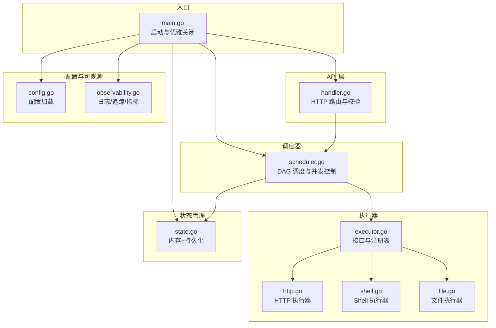
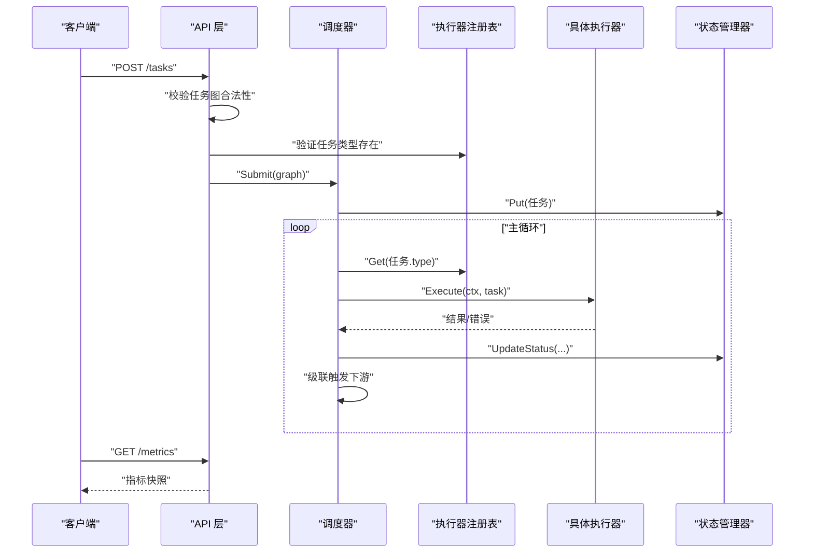
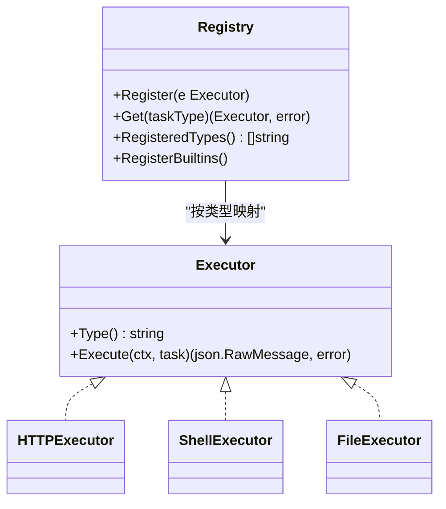
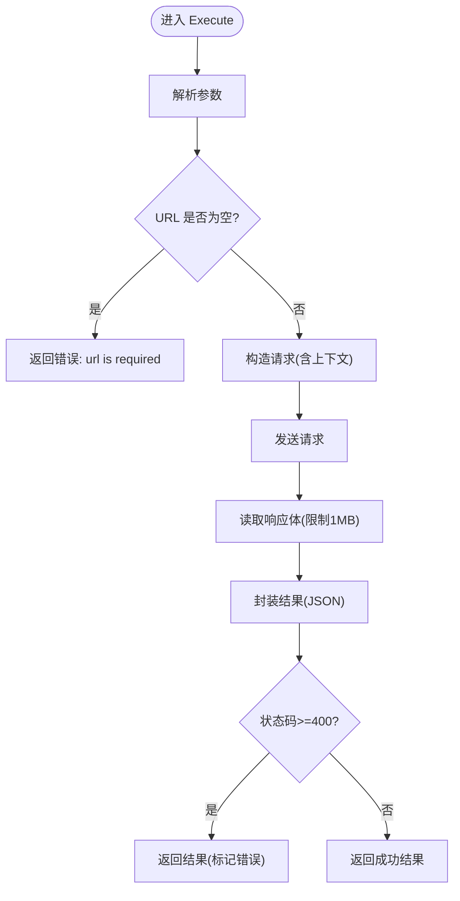
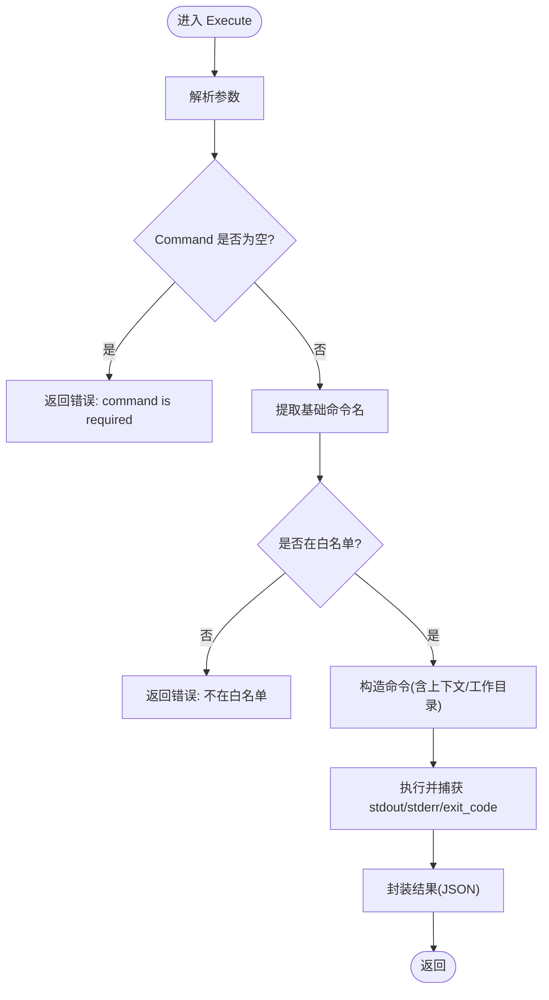
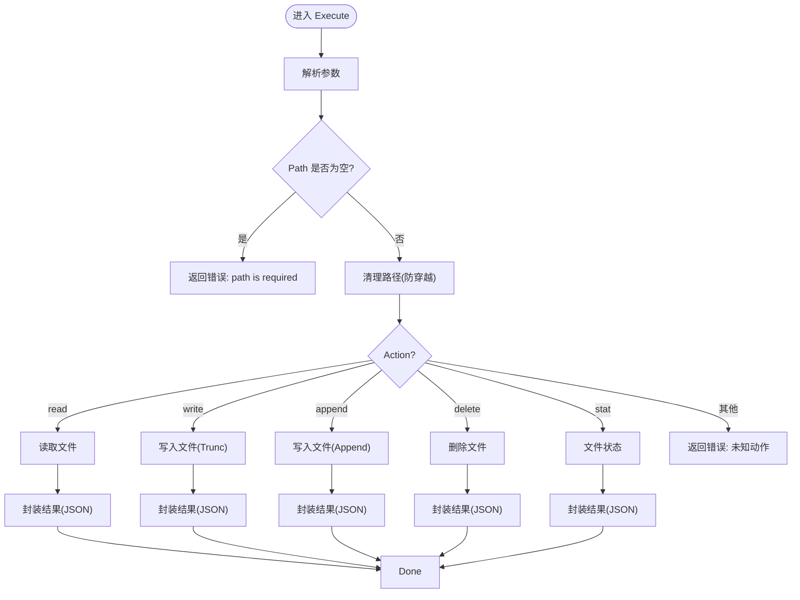
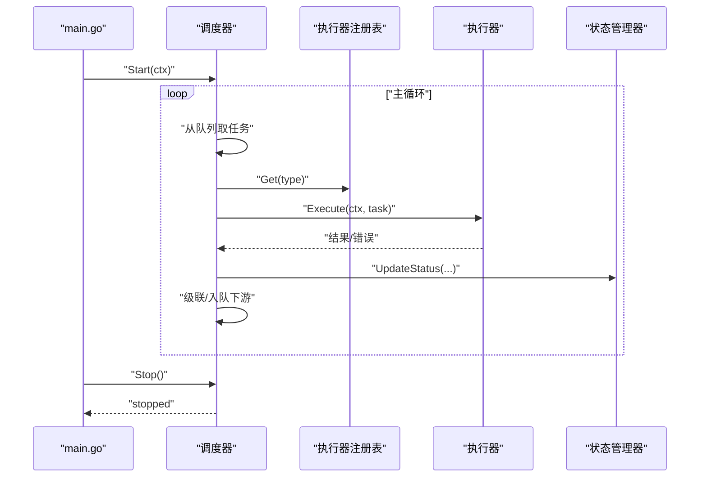
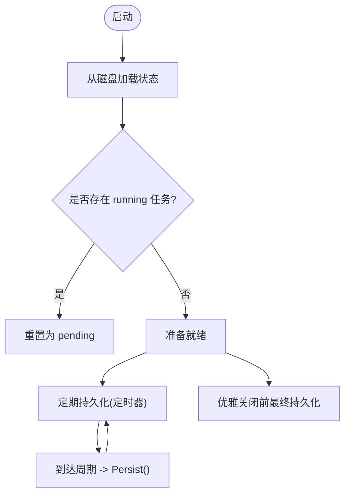
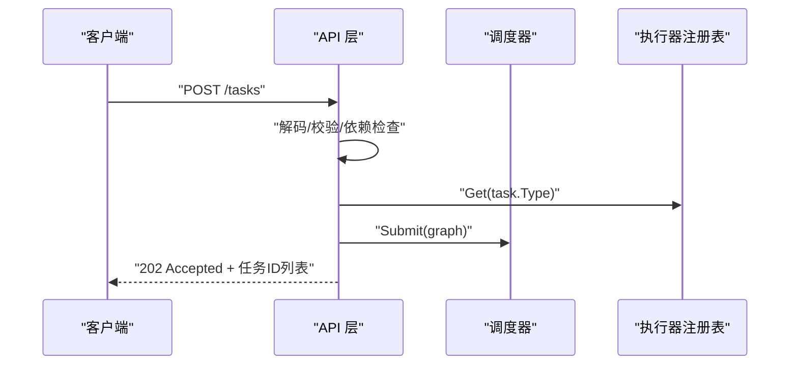
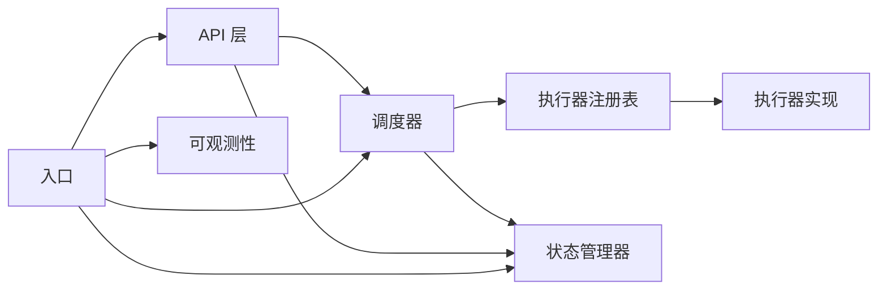

# 执行器系统

<cite>
**本文引用的文件列表**
- [main.go](file://cmd/execgo/main.go)
- [executor.go](file://internal/executor/executor.go)
- [http.go](file://internal/executor/http.go)
- [shell.go](file://internal/executor/shell.go)
- [file.go](file://internal/executor/file.go)
- [task.go](file://internal/models/task.go)
- [handler.go](file://internal/api/handler.go)
- [scheduler.go](file://internal/scheduler/scheduler.go)
- [state.go](file://internal/state/state.go)
- [config.go](file://internal/config/config.go)
- [observability.go](file://internal/observability/observability.go)
- [README.md](file://README.md)
- [go.mod](file://go.mod)
</cite>

## 目录
1. [简介](#简介)
2. [项目结构](#项目结构)
3. [核心组件](#核心组件)
4. [架构总览](#架构总览)
5. [详细组件分析](#详细组件分析)
6. [依赖关系分析](#依赖关系分析)
7. [性能考量](#性能考量)
8. [故障排查指南](#故障排查指南)
9. [结论](#结论)
10. [附录](#附录)

## 简介
本文件面向“执行器系统”的使用者与扩展开发者，系统性阐述执行器接口设计、注册表机制、内置执行器实现（HTTP、Shell、File），以及如何开发自定义执行器。同时覆盖生命周期管理、错误处理与资源清理、性能优化与安全注意事项，并提供扩展开发示例与测试策略。

## 项目结构
项目采用分层架构：入口程序负责初始化配置、日志、指标、状态管理、调度器与 HTTP 服务；API 层接收任务提交并校验；调度器按 DAG 与并发度执行任务；执行器通过注册表按任务类型选择具体实现；状态管理器负责内存与持久化；可观测性模块提供日志、追踪与指标。

图表来源
- [main.go:25-104](file://cmd/execgo/main.go#L25-L104)
- [handler.go:39-52](file://internal/api/handler.go#L39-L52)
- [scheduler.go:34-45](file://internal/scheduler/scheduler.go#L34-L45)
- [executor.go:14-67](file://internal/executor/executor.go#L14-L67)
- [http.go:22-75](file://internal/executor/http.go#L22-L75)
- [shell.go:31-79](file://internal/executor/shell.go#L31-L79)
- [file.go:20-113](file://internal/executor/file.go#L20-L113)
- [state.go:17-53](file://internal/state/state.go#L17-L53)
- [config.go:18-30](file://internal/config/config.go#L18-L30)
- [observability.go:50-80](file://internal/observability/observability.go#L50-L80)

章节来源
- [README.md:149-177](file://README.md#L149-L177)
- [main.go:25-104](file://cmd/execgo/main.go#L25-L104)

## 核心组件
- 执行器接口与注册表：统一抽象与动态发现，支持扩展。
- 内置执行器：HTTP、Shell（白名单）、File。
- 调度器：DAG 编排、并发控制、重试与超时。
- 状态管理：内存存储与 JSON 文件持久化。
- API 层：任务提交、查询、删除、健康检查与指标。
- 配置与可观测：配置加载、结构化日志、追踪与指标。

章节来源
- [executor.go:14-67](file://internal/executor/executor.go#L14-L67)
- [scheduler.go:18-45](file://internal/scheduler/scheduler.go#L18-L45)
- [state.go:17-53](file://internal/state/state.go#L17-L53)
- [handler.go:39-52](file://internal/api/handler.go#L39-L52)
- [config.go:18-30](file://internal/config/config.go#L18-L30)
- [observability.go:50-80](file://internal/observability/observability.go#L50-L80)

## 架构总览
执行器系统围绕“任务—执行器—状态—可观测”形成闭环：API 层接收任务图并进行合法性校验；调度器根据依赖关系与并发度选择执行器；执行器在上下文超时与重试策略下执行；结果回写状态并触发下游依赖。

图表来源
- [handler.go:58-99](file://internal/api/handler.go#L58-L99)
- [scheduler.go:69-97](file://internal/scheduler/scheduler.go#L69-L97)
- [scheduler.go:127-190](file://internal/scheduler/scheduler.go#L127-L190)
- [executor.go:38-48](file://internal/executor/executor.go#L38-L48)

## 详细组件分析

### 执行器接口与注册表
- 接口职责
  - Type(): 返回执行器类型字符串，作为注册表键。
  - Execute(ctx, task): 在给定上下文中执行任务，返回 JSON 结果或错误。
- 注册表机制
  - 注册：Register(e Executor) 将 e.Type() 映射到实例。
  - 获取：Get(taskType) 按类型检索执行器，不存在则报错。
  - 列表：RegisteredTypes() 返回所有已注册类型。
  - 内置注册：RegisterBuiltins() 注册 HTTP、Shell、File 三种执行器。
- 并发安全
  - 注册表使用读写锁保护，避免竞态。

图表来源
- [executor.go:14-67](file://internal/executor/executor.go#L14-L67)
- [http.go:22-25](file://internal/executor/http.go#L22-L25)
- [shell.go:31-34](file://internal/executor/shell.go#L31-L34)
- [file.go:20-23](file://internal/executor/file.go#L20-L23)

章节来源
- [executor.go:14-67](file://internal/executor/executor.go#L14-L67)

### HTTP 执行器
- 参数结构：URL、Method（默认 GET）、Headers、Body。
- 执行流程
  - 解析参数，校验 URL。
  - 构造请求（支持上下文取消/超时）。
  - 发送请求并限制响应体大小（1MB）。
  - 即使 HTTP 错误码也返回结果，便于上层判断。
- 错误处理
  - 参数解析失败、请求构造失败、网络错误、读取响应失败均返回错误。
- 性能与安全
  - 限制响应体大小，避免内存膨胀。
  - 使用 http.DefaultClient，未做额外超时设置，建议在调用方或网关层统一限流与超时。

图表来源
- [http.go:27-75](file://internal/executor/http.go#L27-L75)

章节来源
- [http.go:14-75](file://internal/executor/http.go#L14-L75)

### Shell 执行器（白名单）
- 白名单机制
  - 仅允许预定义命令集合，防止任意命令执行。
  - 从完整路径中提取基础命令名进行匹配。
- 参数结构：Command、Args、Dir。
- 执行流程
  - 解析参数，校验 Command。
  - 校验白名单，不匹配则拒绝。
  - 构造命令并执行，捕获标准输出、标准错误与退出码。
- 错误处理
  - 参数解析失败、命令不在白名单、执行失败均返回错误与结果。
- 安全与合规
  - 严格白名单是关键安全防线；建议结合容器隔离或沙箱进一步加固。

图表来源
- [shell.go:36-79](file://internal/executor/shell.go#L36-L79)

章节来源
- [shell.go:14-79](file://internal/executor/shell.go#L14-L79)

### 文件执行器
- 支持动作：read、write、append、delete、stat。
- 参数结构：Action、Path、Content。
- 执行流程
  - 解析参数，校验 Path。
  - 路径清理（防目录穿越）。
  - 分派到对应方法：read/write/append/delete/stat。
- 错误处理
  - 参数解析失败、未知动作、文件操作失败均返回错误。
- 安全与可靠性
  - 路径清理与目录创建确保安全性与健壮性。
  - 写入采用追加或截断模式，避免覆盖风险。

图表来源
- [file.go:25-52](file://internal/executor/file.go#L25-L52)
- [file.go:54-113](file://internal/executor/file.go#L54-L113)

章节来源
- [file.go:13-113](file://internal/executor/file.go#L13-L113)

### 调度器与生命周期
- 生命周期
  - 启动：创建 readyQueue、semaphore、依赖图等，启动主循环。
  - 停止：取消上下文，等待协程结束，保证有序关闭。
- 执行流程
  - Submit：写入状态、统计指标、构建依赖计数与反向图、入队无依赖任务。
  - loop：从就绪队列取出任务，获取并发槽，异步执行。
  - executeTask：获取执行器、更新状态为 running、指数退避重试、记录结果与错误。
  - completeTask：更新状态、统计指标、级联触发下游或跳过。
- 资源清理
  - 优雅关闭：HTTP 服务关闭、调度器停止、最终持久化。
  - 状态恢复：重启后将 running 状态重置为 pending。

图表来源
- [main.go:57-98](file://cmd/execgo/main.go#L57-L98)
- [scheduler.go:47-67](file://internal/scheduler/scheduler.go#L47-L67)
- [scheduler.go:109-125](file://internal/scheduler/scheduler.go#L109-L125)
- [scheduler.go:127-190](file://internal/scheduler/scheduler.go#L127-L190)
- [scheduler.go:192-230](file://internal/scheduler/scheduler.go#L192-L230)

章节来源
- [scheduler.go:18-45](file://internal/scheduler/scheduler.go#L18-L45)
- [scheduler.go:69-97](file://internal/scheduler/scheduler.go#L69-L97)
- [scheduler.go:127-190](file://internal/scheduler/scheduler.go#L127-L190)
- [scheduler.go:192-230](file://internal/scheduler/scheduler.go#L192-L230)

### 状态管理与持久化
- 内存存储：map[string]*Task + 读写锁。
- 文件持久化：JSON 序列化，先写临时文件再原子重命名，定期与最终持久化。
- 恢复策略：启动时加载磁盘状态，将 running 状态重置为 pending。

图表来源
- [state.go:25-53](file://internal/state/state.go#L25-L53)
- [state.go:136-158](file://internal/state/state.go#L136-L158)
- [state.go:160-179](file://internal/state/state.go#L160-L179)

章节来源
- [state.go:17-53](file://internal/state/state.go#L17-L53)
- [state.go:110-134](file://internal/state/state.go#L110-L134)
- [state.go:160-179](file://internal/state/state.go#L160-L179)

### API 层与可观测性
- API 路由：提交任务、查询任务、删除任务、健康检查、指标。
- 校验：任务图合法性、依赖引用、环检测；提交前校验任务类型是否存在。
- 中间件：为每个请求注入 traceID，便于跨组件追踪。
- 指标：任务总数、运行中、成功、失败、按类型统计。

图表来源
- [handler.go:58-99](file://internal/api/handler.go#L58-L99)
- [handler.go:128-146](file://internal/api/handler.go#L128-L146)
- [observability.go:69-80](file://internal/observability/observability.go#L69-L80)

章节来源
- [handler.go:39-52](file://internal/api/handler.go#L39-L52)
- [handler.go:58-99](file://internal/api/handler.go#L58-L99)
- [handler.go:128-146](file://internal/api/handler.go#L128-L146)
- [observability.go:50-80](file://internal/observability/observability.go#L50-L80)

## 依赖关系分析
- 组件耦合
  - API 层依赖调度器与状态管理器；调度器依赖执行器注册表与状态管理器；执行器依赖模型 Task；状态管理器依赖模型 Task；可观测性模块被多处使用。
- 外部依赖
  - 项目为零第三方依赖，全部使用 Go 标准库。
- 循环依赖
  - 未见直接循环依赖；通过接口与注册表解耦。

图表来源
- [main.go:17-23](file://cmd/execgo/main.go#L17-L23)
- [handler.go:12-16](file://internal/api/handler.go#L12-L16)
- [scheduler.go:12-16](file://internal/scheduler/scheduler.go#L12-L16)
- [executor.go:5-12](file://internal/executor/executor.go#L5-L12)
- [state.go:14](file://internal/state/state.go#L14)
- [observability.go:5-14](file://internal/observability/observability.go#L5-L14)

章节来源
- [go.mod:1-4](file://go.mod#L1-L4)

## 性能考量
- 并发与背压
  - 使用信号量控制最大并发；就绪队列容量为 1024，满载时会异步入队，避免阻塞。
- 重试与超时
  - 指数退避重试，上限 10 秒；任务可配置超时，避免长时间占用资源。
- I/O 限制
  - HTTP 响应体限制 1MB；Shell 输出捕获缓冲区按需增长。
- 持久化策略
  - 定期持久化（默认 30 秒），避免频繁写入；最终持久化保证数据落盘。
- 建议
  - 对高吞吐场景适当提高并发度；对 IO 密集型任务合理设置超时与重试次数；对外部 HTTP 调用建议在网关层统一限流与熔断。

[本节为通用性能建议，不直接分析具体文件]

## 故障排查指南
- 常见错误
  - 任务类型未知：提交时校验失败，返回可用类型列表。
  - 任务图非法：空图、重复 ID、自依赖、环依赖。
  - 执行器未找到：类型未注册或拼写错误。
  - Shell 命令不在白名单：拒绝执行。
  - 文件操作失败：权限不足、路径异常、磁盘空间不足。
- 排查步骤
  - 查看日志：结构化 JSON，包含 trace_id；使用 X-Trace-ID 进行关联。
  - 查询任务：GET /tasks/{id} 或 /tasks 获取状态与错误信息。
  - 指标观测：GET /metrics 查看任务总量、运行中、成功/失败分布。
  - 优雅关闭：确认 HTTP 服务关闭、调度器停止、最终持久化完成。
- 资源清理
  - 调度器在 Stop() 中取消上下文并等待协程结束；状态管理器在持久化前确保原子写入。

章节来源
- [handler.go:76-85](file://internal/api/handler.go#L76-L85)
- [task.go:41-79](file://internal/models/task.go#L41-L79)
- [scheduler.go:131-137](file://internal/scheduler/scheduler.go#L131-L137)
- [shell.go:52-54](file://internal/executor/shell.go#L52-L54)
- [state.go:160-179](file://internal/state/state.go#L160-L179)
- [main.go:81-103](file://cmd/execgo/main.go#L81-L103)

## 结论
执行器系统以“接口+注册表”实现高度可扩展的执行层，结合 DAG 调度、并发控制、重试与超时、状态持久化与可观测性，形成生产级的最小内核。内置执行器覆盖常见场景，且具备明确的安全边界（Shell 白名单、File 路径清理）。扩展开发遵循接口实现与注册即可，配合完善的生命周期与错误处理机制，能够稳定支撑 AI Agent 的多样化执行需求。

[本节为总结性内容，不直接分析具体文件]

## 附录

### 自定义执行器开发指南
- 接口实现要求
  - 实现 Type() 返回唯一类型字符串。
  - 实现 Execute(ctx, task)：解析 task.Params，执行业务逻辑，返回 JSON 结果或错误。
- 注册流程
  - 实例化执行器并在 init() 中调用 executor.Register(e) 完成注册。
  - 启动时调用 executor.RegisterBuiltins() 会注册内置执行器；自定义执行器需自行注册。
- 最佳实践
  - 参数解析失败立即返回错误，避免继续执行。
  - 使用 context 控制超时与取消，避免阻塞。
  - 对外部调用限制资源（如响应体大小、连接池、速率）。
  - 记录结构化日志，包含 trace_id 以便追踪。
  - 返回结果结构尽量标准化，便于上层消费。

章节来源
- [executor.go:14-36](file://internal/executor/executor.go#L14-L36)
- [executor.go:62-67](file://internal/executor/executor.go#L62-L67)
- [README.md:229-249](file://README.md#L229-L249)

### 执行器生命周期与资源清理
- 启动阶段
  - 加载配置、初始化日志、注册执行器、启动指标、创建状态管理器、启动调度器、启动 HTTP 服务。
- 运行阶段
  - API 层接收任务，调度器并发执行，执行器在上下文中执行，状态持续更新。
- 关闭阶段
  - 监听信号，优雅关闭 HTTP 服务、停止调度器、最终持久化状态。

章节来源
- [main.go:25-104](file://cmd/execgo/main.go#L25-L104)

### 安全考虑事项
- Shell 执行器
  - 严格白名单命令，禁止任意命令执行；路径解析仅取基础命令名。
- HTTP 执行器
  - 限制响应体大小；建议在网关层统一超时与限流。
- 文件执行器
  - 路径清理防止目录穿越；写入前确保目录存在；区分追加与覆盖模式。
- 其他
  - 使用 context 超时控制；避免长时间阻塞；对外部系统调用增加熔断与降级策略。

章节来源
- [shell.go:14-22](file://internal/executor/shell.go#L14-L22)
- [shell.go:46-54](file://internal/executor/shell.go#L46-L54)
- [http.go:60-63](file://internal/executor/http.go#L60-L63)
- [file.go:35-36](file://internal/executor/file.go#L35-L36)
- [file.go:65-76](file://internal/executor/file.go#L65-L76)

### 扩展开发示例与测试策略
- 示例
  - 参考 README 的“扩展”章节，实现自定义执行器并在 init() 中注册。
- 测试策略
  - 单元测试：针对执行器 Execute 方法，覆盖正常路径、错误路径、超时与取消。
  - 集成测试：提交任务图，验证 DAG 依赖、并发度、重试与超时行为。
  - 回归测试：模拟崩溃与重启，验证状态恢复与持久化一致性。
  - 安全测试：尝试不在白名单的命令、越权路径访问、恶意参数等。

章节来源
- [README.md:229-249](file://README.md#L229-L249)