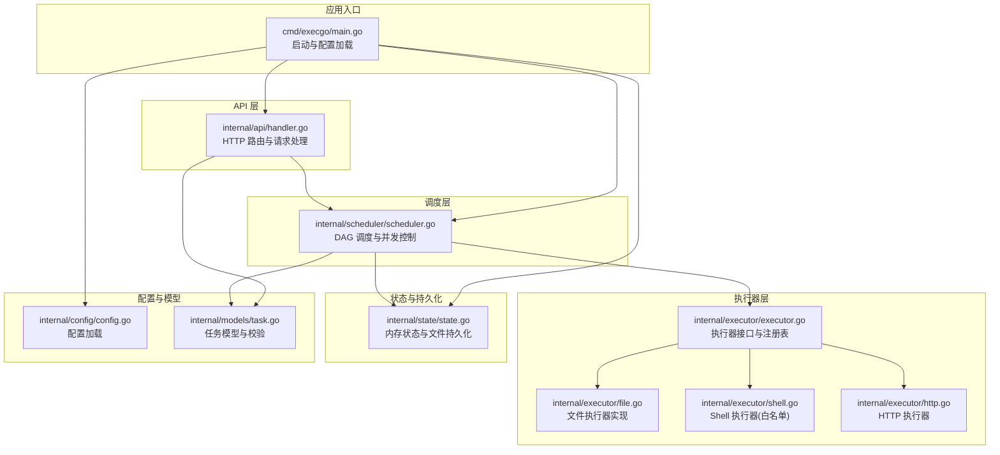
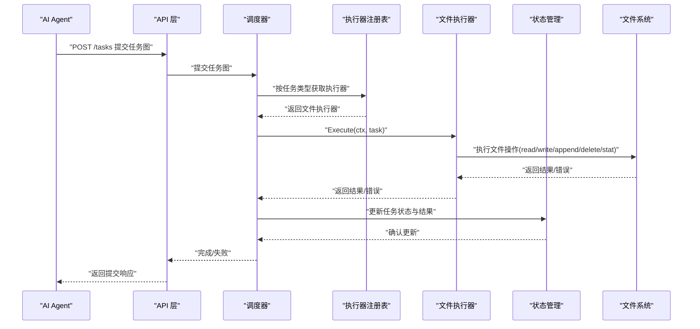
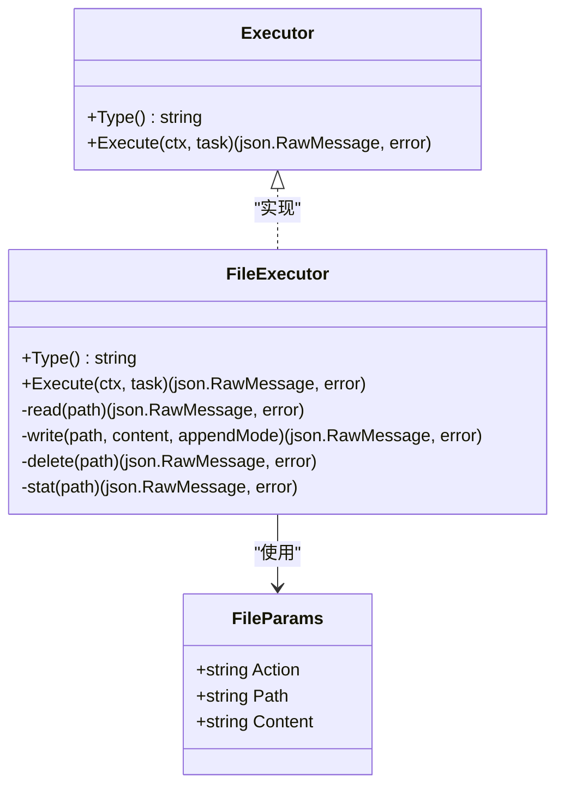
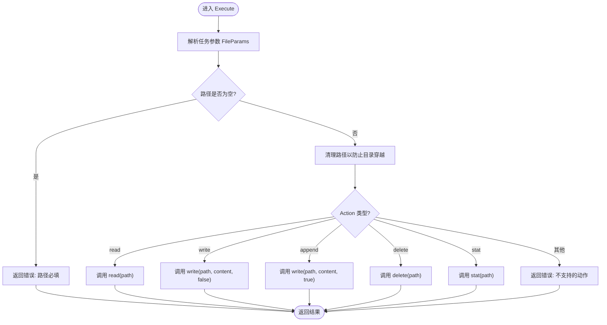
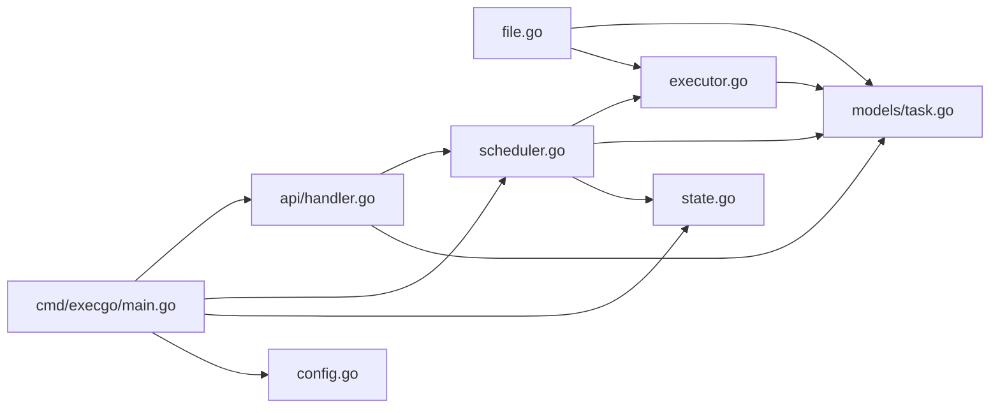

# 文件执行器

<cite>
**本文档引用的文件**
- [internal/executor/file.go](file://internal/executor/file.go)
- [internal/executor/executor.go](file://internal/executor/executor.go)
- [internal/models/task.go](file://internal/models/task.go)
- [internal/scheduler/scheduler.go](file://internal/scheduler/scheduler.go)
- [internal/state/state.go](file://internal/state/state.go)
- [internal/api/handler.go](file://internal/api/handler.go)
- [internal/config/config.go](file://internal/config/config.go)
- [cmd/execgo/main.go](file://cmd/execgo/main.go)
- [README.md](file://README.md)
</cite>

## 目录
1. [简介](#简介)
2. [项目结构](#项目结构)
3. [核心组件](#核心组件)
4. [架构总览](#架构总览)
5. [详细组件分析](#详细组件分析)
6. [依赖关系分析](#依赖关系分析)
7. [性能考量](#性能考量)
8. [故障排查指南](#故障排查指南)
9. [结论](#结论)
10. [附录](#附录)

## 简介
本文件执行器负责在受控环境中执行文件系统操作，支持读取、写入、追加、删除和文件属性查询等操作。其设计遵循最小化、零依赖的原则，并通过严格的参数校验、路径清理与上下文管理确保安全性与可靠性。本文档将深入解析其实现原理、操作类型、路径处理、权限与安全限制、上下文与错误处理、异常恢复机制、配置参数、使用示例与最佳实践，并给出文件系统安全建议与资源管理策略。

## 项目结构
ExecGo 采用分层架构，文件执行器位于执行器层，配合调度器、状态管理与 API 层共同完成任务的提交、调度、执行与持久化。文件执行器通过统一的执行器接口注册到全局注册表，被调度器按任务类型选择执行。

图表来源
- [cmd/execgo/main.go:25-104](file://cmd/execgo/main.go#L25-L104)
- [internal/api/handler.go:39-52](file://internal/api/handler.go#L39-L52)
- [internal/scheduler/scheduler.go:34-67](file://internal/scheduler/scheduler.go#L34-L67)
- [internal/executor/executor.go:26-67](file://internal/executor/executor.go#L26-L67)
- [internal/executor/file.go:20-52](file://internal/executor/file.go#L20-L52)
- [internal/state/state.go:25-53](file://internal/state/state.go#L25-L53)
- [internal/config/config.go:18-30](file://internal/config/config.go#L18-L30)
- [internal/models/task.go:21-39](file://internal/models/task.go#L21-L39)

章节来源
- [cmd/execgo/main.go:25-104](file://cmd/execgo/main.go#L25-L104)
- [internal/api/handler.go:39-52](file://internal/api/handler.go#L39-L52)
- [internal/scheduler/scheduler.go:34-67](file://internal/scheduler/scheduler.go#L34-L67)
- [internal/executor/executor.go:26-67](file://internal/executor/executor.go#L26-L67)
- [internal/state/state.go:25-53](file://internal/state/state.go#L25-L53)
- [internal/config/config.go:18-30](file://internal/config/config.go#L18-L30)
- [internal/models/task.go:21-39](file://internal/models/task.go#L21-L39)

## 核心组件
- 执行器接口与注册表：定义统一的执行器接口，提供注册、获取与内置执行器注册功能，确保扩展性与一致性。
- 文件执行器：实现文件系统操作的具体逻辑，支持读取、写入、追加、删除与属性查询。
- 任务模型：定义任务契约、状态枚举与任务图校验，保证提交任务的合法性。
- 调度器：基于 DAG 的调度器，负责并发控制、超时与重试、依赖传播与状态更新。
- 状态管理：内存状态存储与 JSON 文件持久化，支持周期性持久化与崩溃恢复。
- API 层：HTTP 路由与请求处理，负责任务提交、查询、删除、健康检查与指标端点。
- 配置：从命令行标志与环境变量加载配置，支持优雅关闭与并发控制。

章节来源
- [internal/executor/executor.go:14-67](file://internal/executor/executor.go#L14-L67)
- [internal/executor/file.go:13-114](file://internal/executor/file.go#L13-L114)
- [internal/models/task.go:10-39](file://internal/models/task.go#L10-L39)
- [internal/scheduler/scheduler.go:18-67](file://internal/scheduler/scheduler.go#L18-L67)
- [internal/state/state.go:17-53](file://internal/state/state.go#L17-L53)
- [internal/api/handler.go:19-52](file://internal/api/handler.go#L19-L52)
- [internal/config/config.go:10-30](file://internal/config/config.go#L10-L30)

## 架构总览
文件执行器在整体架构中的位置如下：AI Agent 通过 HTTP API 提交任务，API 层进行请求解析与校验后交给调度器；调度器根据任务类型从注册表中获取对应执行器，执行器在上下文中执行具体操作并将结果回传给调度器；调度器更新状态并持久化，最终通过 API 层对外提供查询与监控。

图表来源
- [internal/api/handler.go:58-99](file://internal/api/handler.go#L58-L99)
- [internal/scheduler/scheduler.go:127-190](file://internal/scheduler/scheduler.go#L127-L190)
- [internal/executor/executor.go:38-48](file://internal/executor/executor.go#L38-L48)
- [internal/executor/file.go:25-52](file://internal/executor/file.go#L25-L52)
- [internal/state/state.go:94-108](file://internal/state/state.go#L94-L108)

## 详细组件分析

### 文件执行器类图
文件执行器实现统一的执行器接口，内部通过 switch 分发不同动作，并对路径进行清理以防范目录穿越。

图表来源
- [internal/executor/executor.go:14-20](file://internal/executor/executor.go#L14-L20)
- [internal/executor/file.go:13-21](file://internal/executor/file.go#L13-L21)
- [internal/executor/file.go:25-52](file://internal/executor/file.go#L25-L52)

章节来源
- [internal/executor/executor.go:14-20](file://internal/executor/executor.go#L14-L20)
- [internal/executor/file.go:13-21](file://internal/executor/file.go#L13-L21)
- [internal/executor/file.go:25-52](file://internal/executor/file.go#L25-L52)

### 文件执行器执行流程
文件执行器的 Execute 方法负责参数解析、路径清理与动作分发。下图展示了关键步骤与决策点。

图表来源
- [internal/executor/file.go:25-52](file://internal/executor/file.go#L25-L52)
- [internal/executor/file.go:54-113](file://internal/executor/file.go#L54-L113)

章节来源
- [internal/executor/file.go:25-52](file://internal/executor/file.go#L25-L52)
- [internal/executor/file.go:54-113](file://internal/executor/file.go#L54-L113)

### 文件操作类型与行为
- 读取(read)
  - 读取指定路径的文件内容，返回内容与大小。
  - 失败时返回错误信息。
- 写入(write)
  - 确保目标目录存在，创建目录。
  - 以截断方式打开文件，写入内容并关闭。
  - 返回写入字节数。
- 追加(append)
  - 确保目标目录存在，创建目录。
  - 以追加方式打开文件，写入内容并关闭。
  - 返回写入字节数。
- 删除(delete)
  - 删除指定路径的文件。
  - 成功返回删除标记。
- 属性(stat)
  - 查询文件信息，返回名称、大小、权限模式、修改时间与是否为目录。

章节来源
- [internal/executor/file.go:54-113](file://internal/executor/file.go#L54-L113)

### 路径处理、权限检查与安全限制
- 路径清理
  - 使用路径清理函数去除相对路径段，降低目录穿越风险。
- 权限与掩码
  - 目录创建使用固定权限掩码，文件写入使用固定权限掩码。
- 上下文与超时
  - 执行器在调度器提供的上下文中运行，支持超时控制。
- 错误处理
  - 对每个操作返回明确的错误信息，便于上层识别与记录。

章节来源
- [internal/executor/file.go:35-36](file://internal/executor/file.go#L35-L36)
- [internal/executor/file.go:65-78](file://internal/executor/file.go#L65-L78)
- [internal/scheduler/scheduler.go:163-173](file://internal/scheduler/scheduler.go#L163-L173)

### 上下文管理、错误处理与异常恢复
- 上下文管理
  - 调度器为每次执行构建带超时或取消的上下文，传递给执行器。
- 错误处理
  - 执行器在参数解析、路径校验、文件操作等环节均返回错误。
  - 调度器对错误进行记录与重试，最终更新任务状态。
- 异常恢复
  - 状态管理器在启动时将运行中任务重置为待执行，避免重启后状态不一致。
  - 状态定期持久化，崩溃后可恢复。

章节来源
- [internal/scheduler/scheduler.go:127-190](file://internal/scheduler/scheduler.go#L127-L190)
- [internal/state/state.go:41-50](file://internal/state/state.go#L41-L50)
- [internal/state/state.go:110-134](file://internal/state/state.go#L110-L134)

### 配置参数与使用示例
- 配置项
  - 监听地址、数据目录、最大并发、优雅关闭超时。
- 使用示例
  - 提交包含文件操作的任务图，例如先拉取数据，再写入文件，最后读取验证。
- 最佳实践
  - 明确任务依赖，合理设置超时与重试。
  - 在数据目录内进行文件操作，避免跨目录访问。
  - 对敏感内容进行最小化暴露，必要时使用只读权限。

章节来源
- [internal/config/config.go:18-30](file://internal/config/config.go#L18-L30)
- [README.md:79-145](file://README.md#L79-L145)
- [README.md:216-226](file://README.md#L216-L226)

## 依赖关系分析
文件执行器依赖于任务模型与执行器注册表，通过调度器与状态管理器协同工作。下图展示模块间的依赖关系。

图表来源
- [internal/executor/file.go:10-11](file://internal/executor/file.go#L10-L11)
- [internal/executor/executor.go:11](file://internal/executor/executor.go#L11)
- [internal/models/task.go:4-8](file://internal/models/task.go#L4-L8)
- [internal/scheduler/scheduler.go:12-16](file://internal/scheduler/scheduler.go#L12-L16)
- [internal/state/state.go:14](file://internal/state/state.go#L14)
- [internal/api/handler.go:12-17](file://internal/api/handler.go#L12-L17)
- [cmd/execgo/main.go:17-23](file://cmd/execgo/main.go#L17-L23)
- [internal/config/config.go:4-8](file://internal/config/config.go#L4-L8)

章节来源
- [internal/executor/file.go:10-11](file://internal/executor/file.go#L10-L11)
- [internal/executor/executor.go:11](file://internal/executor/executor.go#L11)
- [internal/models/task.go:4-8](file://internal/models/task.go#L4-L8)
- [internal/scheduler/scheduler.go:12-16](file://internal/scheduler/scheduler.go#L12-L16)
- [internal/state/state.go:14](file://internal/state/state.go#L14)
- [internal/api/handler.go:12-17](file://internal/api/handler.go#L12-L17)
- [cmd/execgo/main.go:17-23](file://cmd/execgo/main.go#L17-L23)
- [internal/config/config.go:4-8](file://internal/config/config.go#L4-L8)

## 性能考量
- 并发控制
  - 调度器通过信号量限制最大并发，避免文件系统争用。
- 超时与重试
  - 每次执行前构建带超时的上下文，失败时指数退避重试，减少抖动。
- I/O 优化
  - 写入前确保目录存在，减少多次失败重试。
  - 读取与写入均为标准库调用，避免额外开销。
- 持久化策略
  - 状态定期持久化，减少崩溃后恢复成本。

章节来源
- [internal/scheduler/scheduler.go:40-44](file://internal/scheduler/scheduler.go#L40-L44)
- [internal/scheduler/scheduler.go:144-180](file://internal/scheduler/scheduler.go#L144-L180)
- [internal/state/state.go:160-179](file://internal/state/state.go#L160-L179)

## 故障排查指南
- 参数解析失败
  - 检查任务参数是否符合文件执行器参数格式。
- 路径为空或非法
  - 确保路径非空且经清理后有效。
- 目录创建失败
  - 检查目标目录权限与磁盘空间。
- 文件读写失败
  - 检查文件是否存在、权限是否足够、磁盘是否只读。
- 超时或重试过多
  - 调整任务超时与重试次数，观察日志定位问题。
- 状态未更新
  - 检查状态管理器是否正常持久化，确认数据目录可写。

章节来源
- [internal/executor/file.go:27-28](file://internal/executor/file.go#L27-L28)
- [internal/executor/file.go:31-33](file://internal/executor/file.go#L31-L33)
- [internal/executor/file.go:67-68](file://internal/executor/file.go#L67-L68)
- [internal/scheduler/scheduler.go:152-179](file://internal/scheduler/scheduler.go#L152-L179)
- [internal/state/state.go:110-134](file://internal/state/state.go#L110-L134)

## 结论
文件执行器以最小化设计实现了对文件系统的安全可控操作，结合调度器的并发控制、超时与重试机制以及状态管理的持久化与恢复能力，形成了完整的任务执行闭环。通过严格的参数校验、路径清理与上下文管理，有效降低了安全风险与资源竞争带来的不确定性。建议在生产环境中合理配置并发与超时，规范任务依赖与数据目录，持续关注日志与指标，确保系统稳定可靠。

## 附录
- 文件执行器参数
  - 动作(action): read | write | append | delete | stat
  - 路径(path): 目标文件或目录的绝对或相对路径（经清理）
  - 内容(content): 写入或追加时的文本内容（可选）
- 使用示例参考
  - 提交包含文件操作的任务图，先拉取数据，再写入文件，最后读取验证。
- 安全建议
  - 限制数据目录范围，避免跨目录访问。
  - 对写入内容进行最小化暴露，必要时使用只读权限。
  - 定期审计任务依赖与执行结果，及时发现异常。

章节来源
- [README.md:195-213](file://README.md#L195-L213)
- [README.md:79-145](file://README.md#L79-L145)