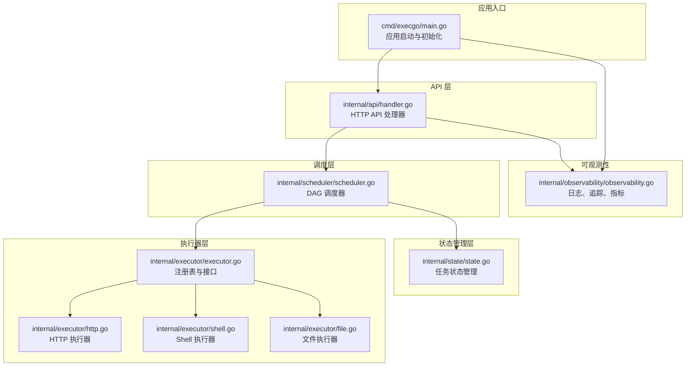
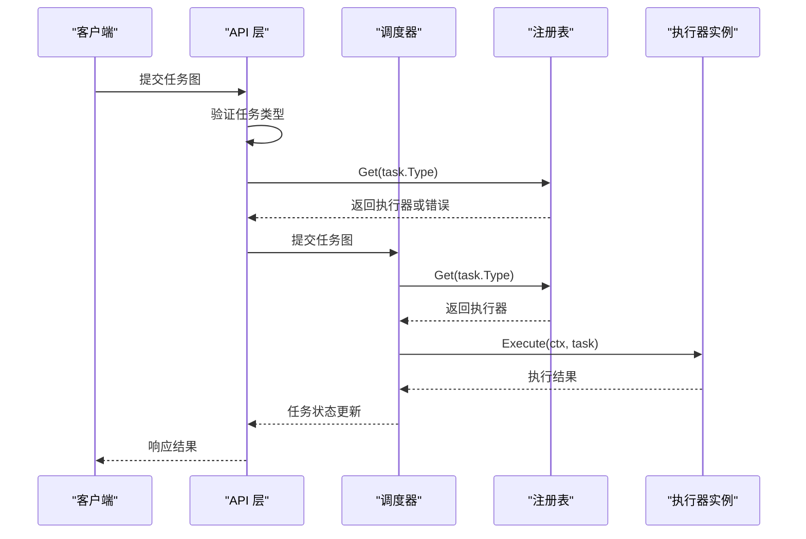
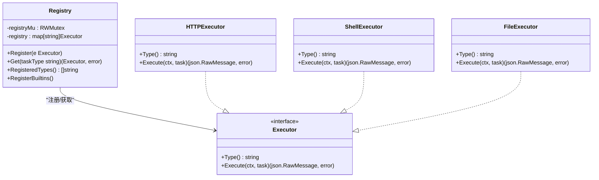
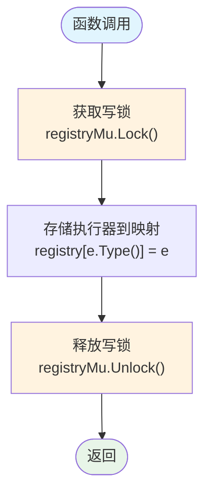
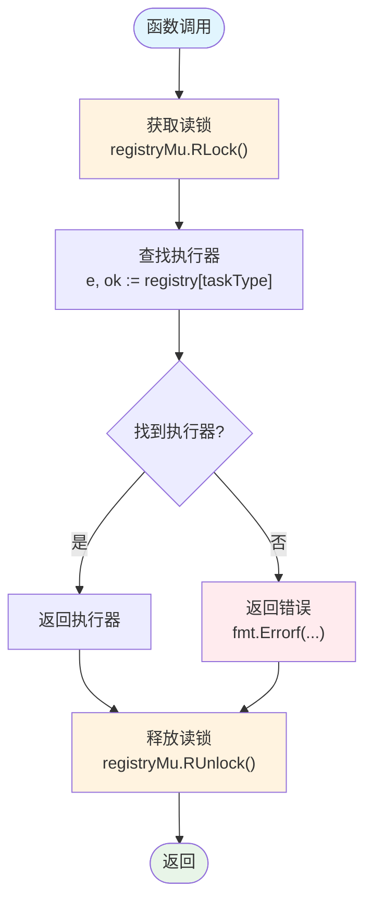
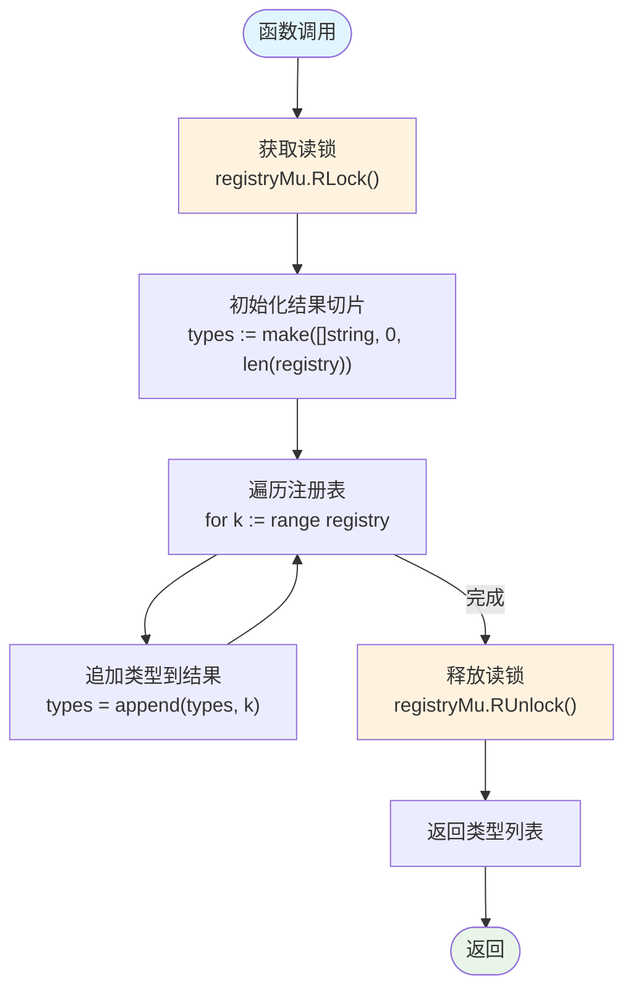
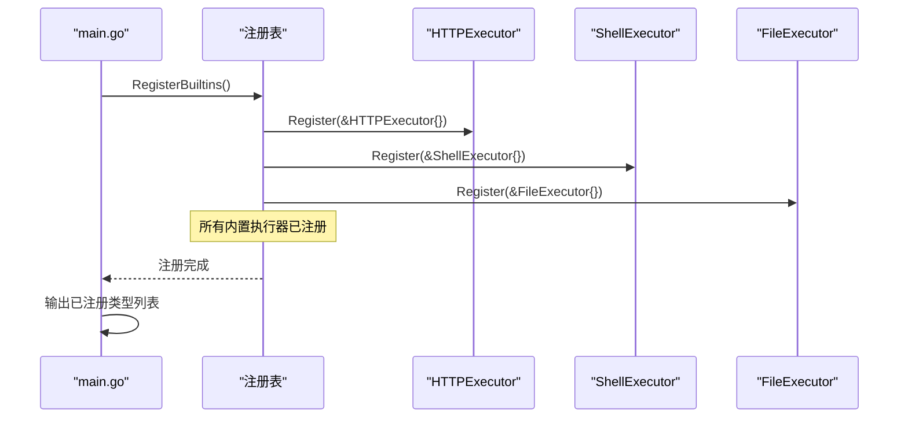
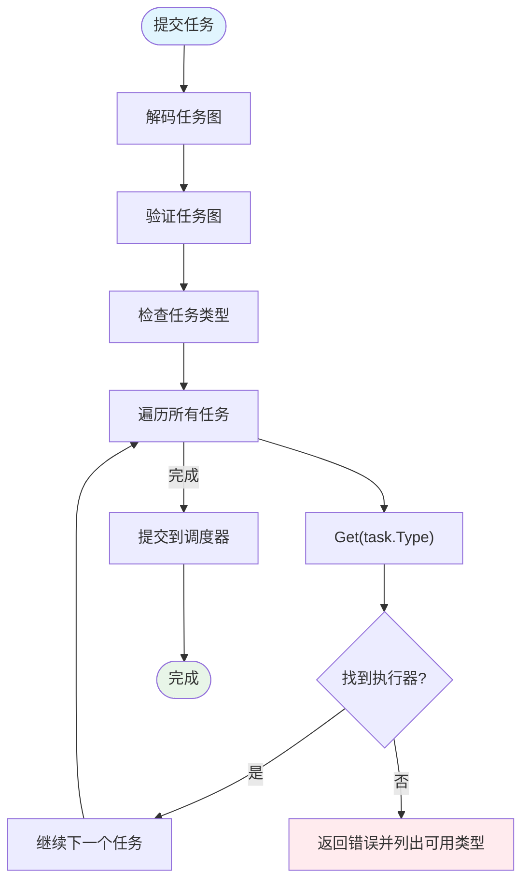
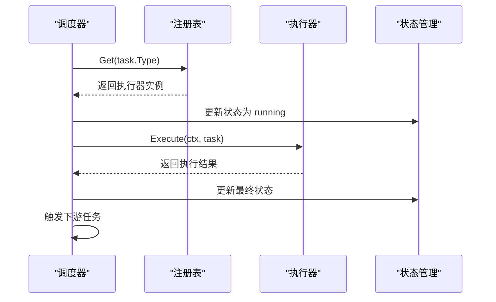
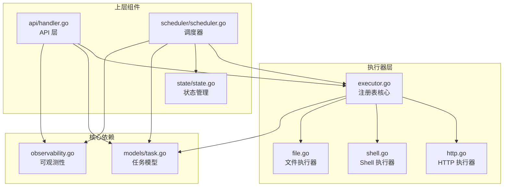

# 注册表机制

<cite>
**本文档引用的文件**
- [executor.go](file://internal/executor/executor.go)
- [http.go](file://internal/executor/http.go)
- [shell.go](file://internal/executor/shell.go)
- [file.go](file://internal/executor/file.go)
- [scheduler.go](file://internal/scheduler/scheduler.go)
- [handler.go](file://internal/api/handler.go)
- [main.go](file://cmd/execgo/main.go)
- [task.go](file://internal/models/task.go)
- [state.go](file://internal/state/state.go)
- [observability.go](file://internal/observability/observability.go)
- [README.md](file://README.md)
</cite>

## 目录
1. [简介](#简介)
2. [项目结构](#项目结构)
3. [核心组件](#核心组件)
4. [架构总览](#架构总览)
5. [详细组件分析](#详细组件分析)
6. [依赖关系分析](#依赖关系分析)
7. [性能考虑](#性能考虑)
8. [故障排除指南](#故障排除指南)
9. [结论](#结论)

## 简介
本文档深入解析 ExecGo 执行器注册表机制的设计与实现，重点涵盖：
- 全局注册表的线程安全设计（读写锁）
- 注册表的数据结构与访问模式
- 注册流程 Register() 的实现原理与类型键唯一性保证
- 并发安全的实现方式
- 获取执行器 Get() 的查找算法与错误处理策略
- 类型不存在时的异常情况处理
- 已注册类型的查询功能
- 内置执行器的自动注册流程

该机制是 ExecGo 的可扩展核心，通过统一的注册表实现执行器的动态发现与调用，支持 HTTP、Shell、File 等内置执行器，并提供扩展接口以支持自定义执行器。

## 项目结构
ExecGo 采用清晰的分层架构，注册表机制位于执行器层，为上层调度器和 API 层提供统一的执行器访问接口。

**图表来源**
- [main.go:25-104](file://cmd/execgo/main.go#L25-L104)
- [handler.go:28-52](file://internal/api/handler.go#L28-L52)
- [scheduler.go:18-45](file://internal/scheduler/scheduler.go#L18-L45)
- [executor.go:14-67](file://internal/executor/executor.go#L14-L67)

**章节来源**
- [README.md:32-57](file://README.md#L32-L57)
- [main.go:25-104](file://cmd/execgo/main.go#L25-L104)

## 核心组件
注册表机制的核心由以下组件构成：

### 执行器接口
定义了统一的执行器契约，所有执行器必须实现 Type() 和 Execute() 方法。

### 全局注册表
- 使用 `sync.RWMutex` 实现线程安全
- 基于 `map[string]Executor` 存储执行器实例
- 键为执行器类型字符串，值为执行器实例

### 内置执行器
- HTTPExecutor：通过 HTTP 请求执行任务
- ShellExecutor：白名单命令执行器
- FileExecutor：文件系统操作执行器

**章节来源**
- [executor.go:14-20](file://internal/executor/executor.go#L14-L20)
- [executor.go:26-29](file://internal/executor/executor.go#L26-L29)
- [http.go:22-25](file://internal/executor/http.go#L22-L25)
- [shell.go:31-34](file://internal/executor/shell.go#L31-L34)
- [file.go:20-23](file://internal/executor/file.go#L20-L23)

## 架构总览
注册表机制在整个系统中的位置和交互关系如下：

**图表来源**
- [handler.go:76-85](file://internal/api/handler.go#L76-L85)
- [scheduler.go:131-137](file://internal/scheduler/scheduler.go#L131-L137)
- [executor.go:38-48](file://internal/executor/executor.go#L38-L48)

## 详细组件分析

### 注册表数据结构与线程安全
注册表采用简单而高效的内存映射结构：

**图表来源**
- [executor.go:26-29](file://internal/executor/executor.go#L26-L29)
- [executor.go:14-20](file://internal/executor/executor.go#L14-L20)
- [http.go:22-25](file://internal/executor/http.go#L22-L25)
- [shell.go:31-34](file://internal/executor/shell.go#L31-L34)
- [file.go:20-23](file://internal/executor/file.go#L20-L23)

#### 线程安全机制
注册表使用读写锁实现高效并发：
- **读操作**：使用 `RLock()` 和 `RUnlock()`，允许多个并发读取
- **写操作**：使用 `Lock()` 和 `Unlock()`，确保注册和删除的原子性
- **无死锁设计**：读写锁分离，避免长时间持有写锁阻塞读操作

**章节来源**
- [executor.go:26-29](file://internal/executor/executor.go#L26-L29)
- [executor.go:32-36](file://internal/executor/executor.go#L32-L36)
- [executor.go:38-48](file://internal/executor/executor.go#L38-L48)

### 注册流程 Register() 实现
Register() 函数负责将执行器注册到全局注册表中：

**图表来源**
- [executor.go:32-36](file://internal/executor/executor.go#L32-L36)

#### 类型键值唯一性保证
- **键值来源**：执行器的 Type() 方法返回的字符串
- **唯一性约束**：注册表使用 map 作为底层存储，天然保证键的唯一性
- **覆盖行为**：如果同一类型重复注册，后注册的执行器会覆盖之前的实例
- **设计考量**：允许在应用启动阶段进行多次注册，便于测试和插件化扩展

**章节来源**
- [executor.go:32-36](file://internal/executor/executor.go#L32-L36)

### 获取执行器机制 Get()
Get() 函数实现了高效的执行器查找算法：

**图表来源**
- [executor.go:38-48](file://internal/executor/executor.go#L38-L48)

#### 查找算法复杂度
- **时间复杂度**：O(1)，基于哈希表的直接查找
- **空间复杂度**：O(n)，n 为已注册执行器数量
- **并发特性**：支持高并发读取，无锁查找

#### 错误处理策略
当执行器类型不存在时，Get() 返回明确的错误信息：
- 错误消息包含具体的类型标识
- 便于上层组件进行错误诊断和用户提示
- 错误类型为标准格式，便于统一处理

**章节来源**
- [executor.go:38-48](file://internal/executor/executor.go#L38-L48)

### 已注册类型查询功能
RegisteredTypes() 函数提供了完整的注册表查询能力：

**图表来源**
- [executor.go:50-60](file://internal/executor/executor.go#L50-L60)

#### 查询性能特征
- **时间复杂度**：O(n)，需要遍历整个注册表
- **内存分配**：预分配容量，减少切片扩容开销
- **并发安全**：只进行读操作，不影响其他并发读取

**章节来源**
- [executor.go:50-60](file://internal/executor/executor.go#L50-L60)

### 内置执行器自动注册流程
系统在启动时自动注册所有内置执行器，确保系统可用性：

**图表来源**
- [executor.go:62-67](file://internal/executor/executor.go#L62-L67)
- [main.go:39-41](file://cmd/execgo/main.go#L39-L41)

#### 注册时机与可见性
- **启动阶段**：在应用启动早期完成注册
- **日志记录**：注册完成后输出已注册类型列表
- **立即可用**：注册完成后即可被调度器和 API 层使用

**章节来源**
- [executor.go:62-67](file://internal/executor/executor.go#L62-L67)
- [main.go:39-41](file://cmd/execgo/main.go#L39-L41)

### 上层集成与使用模式

#### API 层验证流程
API 层在接收任务请求时进行类型验证：

**图表来源**
- [handler.go:58-99](file://internal/api/handler.go#L58-L99)

#### 调度器执行流程
调度器在执行任务时获取相应执行器：

**图表来源**
- [scheduler.go:127-190](file://internal/scheduler/scheduler.go#L127-L190)

**章节来源**
- [handler.go:58-99](file://internal/api/handler.go#L58-L99)
- [scheduler.go:127-190](file://internal/scheduler/scheduler.go#L127-L190)

## 依赖关系分析

**图表来源**
- [executor.go:14-20](file://internal/executor/executor.go#L14-L20)
- [handler.go:12-16](file://internal/api/handler.go#L12-L16)
- [scheduler.go:12-15](file://internal/scheduler/scheduler.go#L12-L15)
- [task.go:21-34](file://internal/models/task.go#L21-L34)

### 组件耦合度分析
- **低耦合设计**：执行器层与上层组件通过接口解耦
- **单向依赖**：上层组件依赖执行器接口，执行器不依赖上层组件
- **可替换性**：不同执行器实现可以互换使用

**章节来源**
- [executor.go:14-20](file://internal/executor/executor.go#L14-L20)
- [handler.go:12-16](file://internal/api/handler.go#L12-L16)
- [scheduler.go:12-15](file://internal/scheduler/scheduler.go#L12-L15)

## 性能考虑
注册表机制在性能方面表现出色：

### 时间复杂度优化
- **注册操作**：O(1) 哈希插入
- **查找操作**：O(1) 哈希查找
- **类型查询**：O(n) 遍历所有键
- **并发读取**：无锁读取，支持高并发场景

### 内存使用优化
- **紧凑存储**：使用原生 map，无额外元数据开销
- **预分配容量**：RegisteredTypes() 预分配切片容量
- **零依赖设计**：避免第三方库带来的内存开销

### 并发性能
- **读写分离**：读写锁分离，最大化并发吞吐
- **无阻塞读**：多个 goroutine 可同时读取
- **短临界区**：锁持有时间极短，减少竞争

## 故障排除指南

### 常见问题与解决方案

#### 1. 执行器类型不存在
**症状**：API 层返回 "unknown task type" 错误
**原因**：任务类型未正确注册
**解决**：检查注册流程，确认 RegisterBuiltins() 调用

#### 2. 注册表为空
**症状**：RegisteredTypes() 返回空列表
**原因**：注册时机问题或注册失败
**解决**：检查应用启动日志，确认注册完成

#### 3. 并发访问冲突
**症状**：偶发的竞态条件错误
**解决**：确认使用官方 API，避免直接操作底层数据结构

#### 4. 类型覆盖问题
**症状**：后注册的执行器覆盖先注册的实例
**解决**：确保类型键的唯一性，避免重复注册相同类型

**章节来源**
- [handler.go:76-85](file://internal/api/handler.go#L76-L85)
- [executor.go:62-67](file://internal/executor/executor.go#L62-L67)

### 调试建议
- **启用详细日志**：观察注册过程和执行器调用
- **监控注册表状态**：定期检查 RegisteredTypes() 输出
- **单元测试**：为自定义执行器编写注册和查找测试

## 结论
ExecGo 的执行器注册表机制展现了优秀的软件工程实践：

### 设计优势
- **简洁高效**：基于原生 Go 语言特性的轻量级实现
- **线程安全**：完善的并发控制机制
- **可扩展性**：遵循开放封闭原则，易于添加新执行器
- **可观测性**：完整的日志和错误处理机制

### 架构价值
- **解耦设计**：执行器与业务逻辑完全分离
- **可测试性**：清晰的接口定义便于单元测试
- **可维护性**：简单的数据结构和算法易于理解和维护

### 最佳实践
- 在应用启动阶段完成所有执行器注册
- 确保执行器类型键的唯一性和稳定性
- 利用注册表提供的查询功能进行健康检查
- 遵循接口约定实现自定义执行器

该注册表机制为 ExecGo 提供了坚实的基础，支持系统的可扩展性和可靠性，是构建生产级执行引擎的关键基础设施。