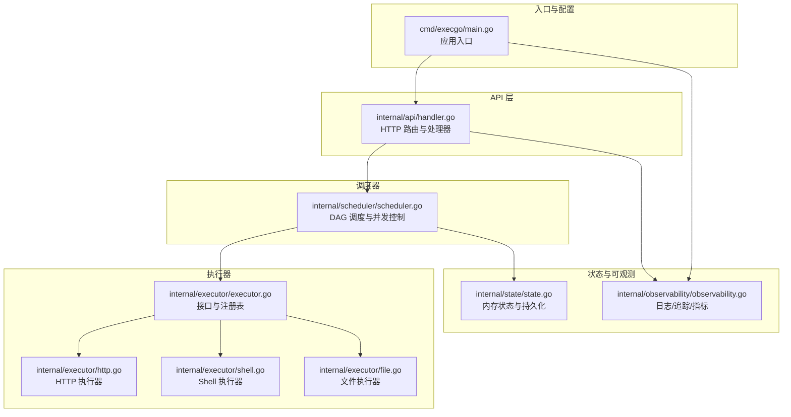
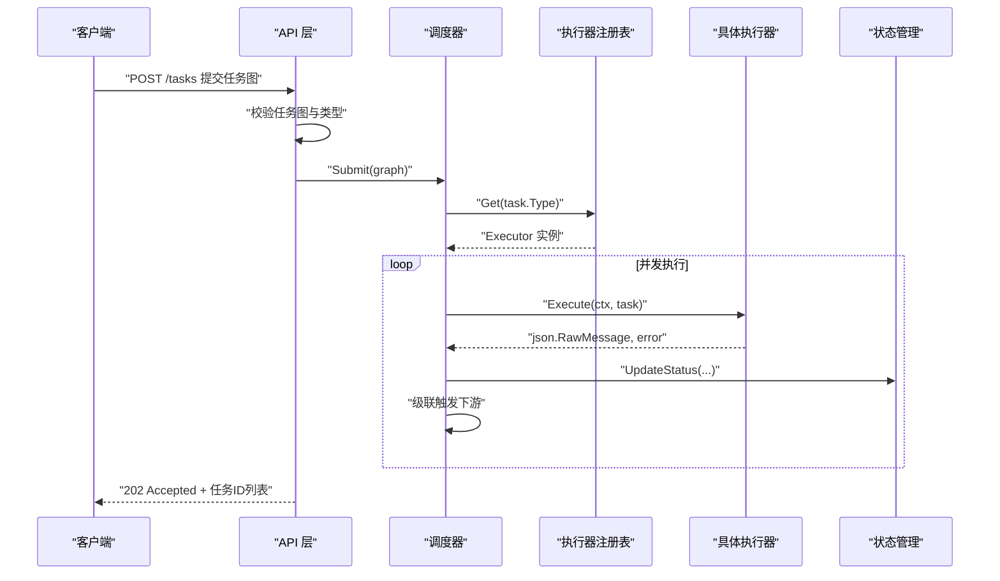
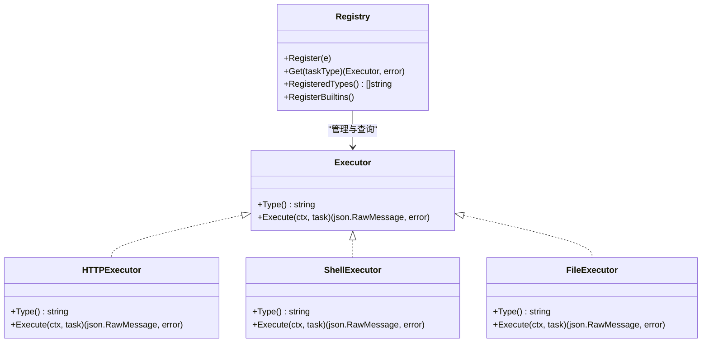
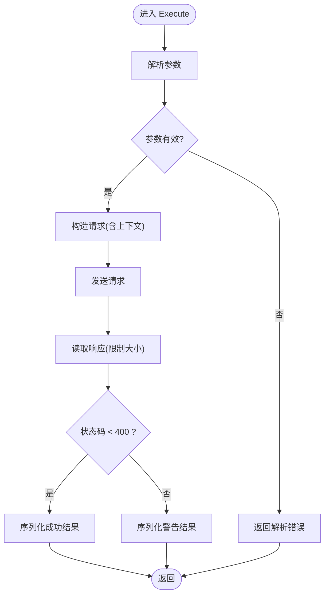
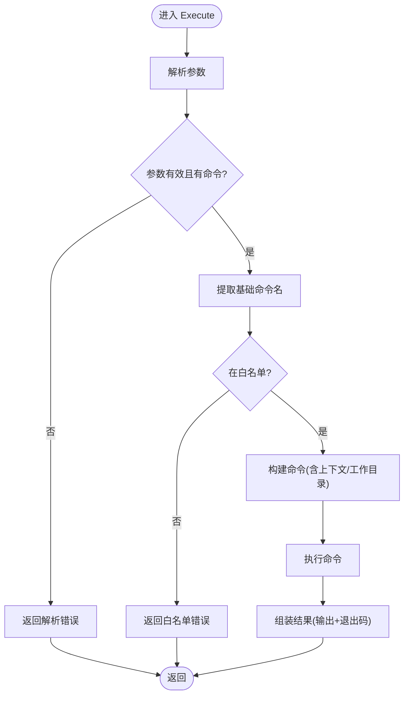
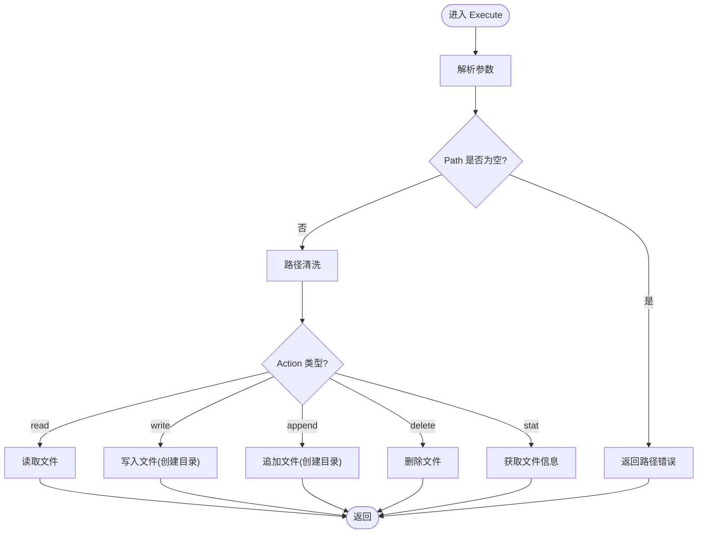
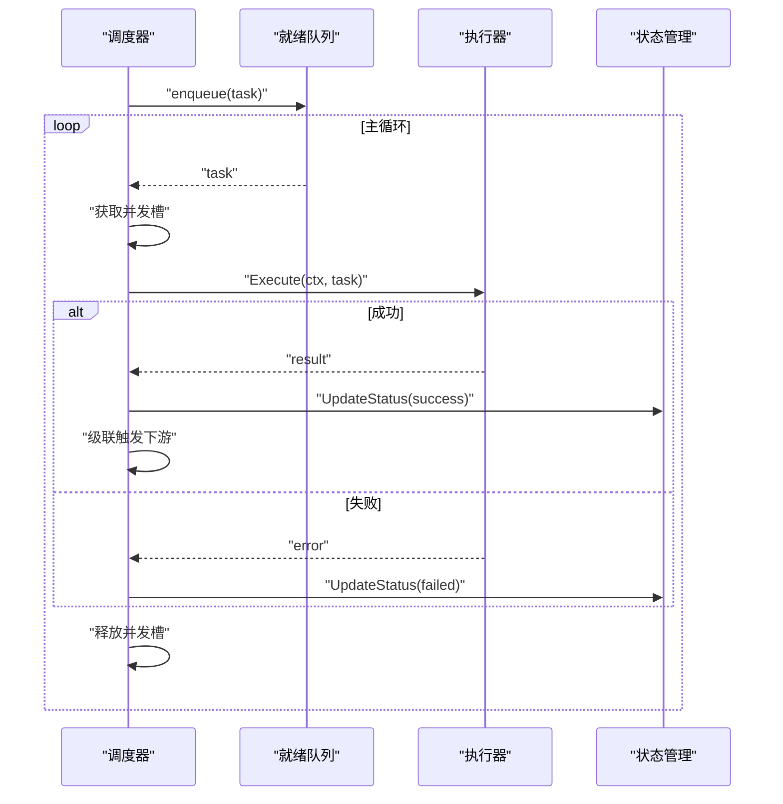
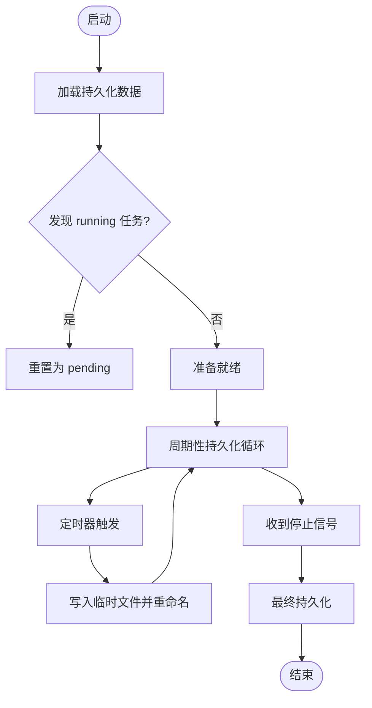
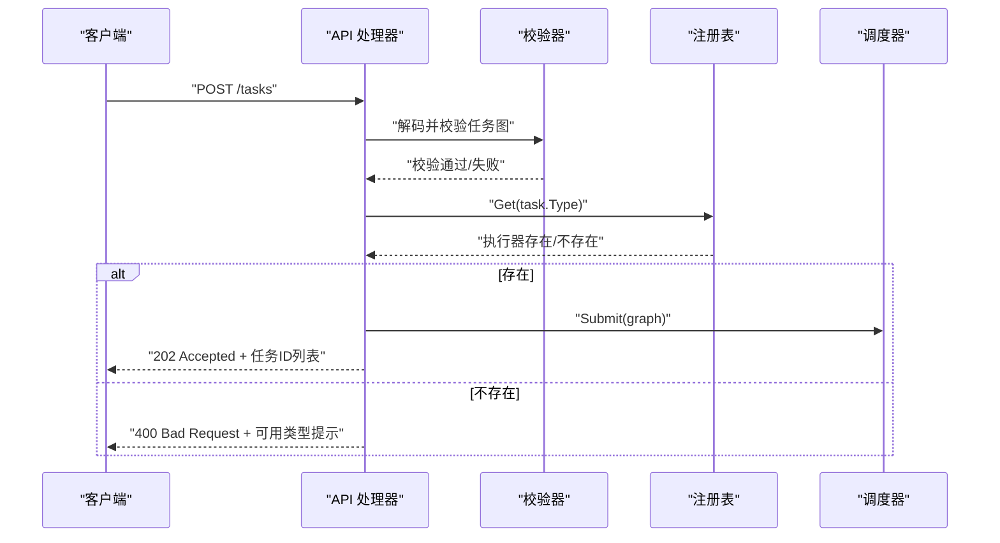
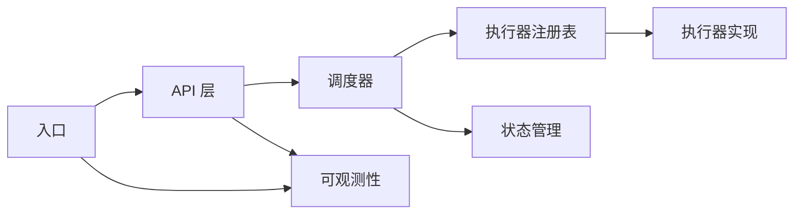

# 自定义执行器开发

<cite>
**本文档引用的文件**
- [main.go](file://cmd/execgo/main.go)
- [executor.go](file://internal/executor/executor.go)
- [http.go](file://internal/executor/http.go)
- [shell.go](file://internal/executor/shell.go)
- [file.go](file://internal/executor/file.go)
- [task.go](file://internal/models/task.go)
- [scheduler.go](file://internal/scheduler/scheduler.go)
- [state.go](file://internal/state/state.go)
- [handler.go](file://internal/api/handler.go)
- [observability.go](file://internal/observability/observability.go)
- [README.md](file://README.md)
</cite>

## 目录
1. [简介](#简介)
2. [项目结构](#项目结构)
3. [核心组件](#核心组件)
4. [架构总览](#架构总览)
5. [详细组件分析](#详细组件分析)
6. [依赖分析](#依赖分析)
7. [性能考虑](#性能考虑)
8. [故障排查指南](#故障排查指南)
9. [结论](#结论)
10. [附录](#附录)

## 简介
本指南面向需要在 ExecGo 引擎中扩展自定义执行器的开发者。ExecGo 采用“插件式执行器”设计，通过统一的 Executor 接口与全局注册表实现可扩展的任务执行能力。本文将系统讲解：
- 执行器接口的实现要求与命名规范
- 从接口实现到注册使用的完整开发流程
- 生命周期管理、资源清理与错误处理最佳实践
- 调试技巧、测试策略与性能优化建议
- 多个自定义执行器的实际开发示例（按场景与复杂度递增）

## 项目结构
ExecGo 的核心围绕“API 层 → 调度器 → 执行器 → 状态管理”的分层架构展开。执行器模块位于 internal/executor，提供统一接口与内置实现，并通过注册表对外暴露。

图表来源
- [main.go:25-104](file://cmd/execgo/main.go#L25-L104)
- [handler.go:39-52](file://internal/api/handler.go#L39-L52)
- [scheduler.go:34-45](file://internal/scheduler/scheduler.go#L34-L45)
- [executor.go:14-67](file://internal/executor/executor.go#L14-L67)
- [http.go:22-75](file://internal/executor/http.go#L22-L75)
- [shell.go:31-79](file://internal/executor/shell.go#L31-L79)
- [file.go:20-113](file://internal/executor/file.go#L20-L113)
- [state.go:17-53](file://internal/state/state.go#L17-L53)
- [observability.go:46-80](file://internal/observability/observability.go#L46-L80)

章节来源
- [README.md:149-177](file://README.md#L149-L177)
- [main.go:25-104](file://cmd/execgo/main.go#L25-L104)
- [handler.go:39-52](file://internal/api/handler.go#L39-L52)
- [scheduler.go:34-45](file://internal/scheduler/scheduler.go#L34-L45)
- [executor.go:14-67](file://internal/executor/executor.go#L14-L67)

## 核心组件
- 执行器接口与注册表
  - 接口定义包含 Type() 与 Execute() 两个方法，Type() 用于唯一标识执行器类型，Execute() 执行任务并返回 JSON 结果。
  - 注册表提供 Register、Get、RegisteredTypes 与 RegisterBuiltins 等能力，支持内置执行器注册与查询。
- 内置执行器
  - HTTPExecutor：封装 HTTP 请求，支持方法、头、体等参数，限制响应大小。
  - ShellExecutor：白名单命令执行，确保安全；支持工作目录与上下文取消。
  - FileExecutor：文件读写、追加、删除、统计，路径清洗防越狱。
- 调度器
  - 基于 DAG 的并发调度，支持重试（指数退避）、超时（context 控制）、依赖级联与状态推进。
- 状态管理
  - 内存状态 + JSON 文件持久化，支持周期性与最终持久化，崩溃后将 running 状态重置为 pending。
- API 层
  - 提交任务图、查询任务、删除任务、健康检查、指标端点；提交前校验任务类型是否存在对应执行器。

章节来源
- [executor.go:14-67](file://internal/executor/executor.go#L14-L67)
- [http.go:14-75](file://internal/executor/http.go#L14-L75)
- [shell.go:24-79](file://internal/executor/shell.go#L24-L79)
- [file.go:13-113](file://internal/executor/file.go#L13-L113)
- [scheduler.go:69-230](file://internal/scheduler/scheduler.go#L69-L230)
- [state.go:25-179](file://internal/state/state.go#L25-L179)
- [handler.go:58-99](file://internal/api/handler.go#L58-L99)

## 架构总览
ExecGo 的执行链路如下：客户端通过 API 提交任务图，API 校验任务类型并提交给调度器；调度器根据依赖关系并发执行，按类型从注册表获取执行器；执行器完成任务后返回 JSON 结果，调度器更新状态并级联触发下游任务。

图表来源
- [handler.go:58-99](file://internal/api/handler.go#L58-L99)
- [scheduler.go:127-190](file://internal/scheduler/scheduler.go#L127-L190)
- [executor.go:38-48](file://internal/executor/executor.go#L38-L48)

## 详细组件分析

### 执行器接口与注册表
- 接口职责
  - Type()：返回执行器类型字符串，用于在注册表中唯一标识该执行器。
  - Execute(ctx, task)：执行任务，返回 JSON 结果与错误。错误会触发调度器的重试与失败状态记录。
- 注册表机制
  - Register(e)：将执行器实例注册到全局映射。
  - Get(taskType)：按类型获取执行器，未找到则返回错误。
  - RegisteredTypes()：返回所有已注册类型，用于 API 校验与提示。
  - RegisterBuiltins()：注册内置执行器（HTTP、Shell、File）。

图表来源
- [executor.go:14-67](file://internal/executor/executor.go#L14-L67)
- [http.go:22-75](file://internal/executor/http.go#L22-L75)
- [shell.go:31-79](file://internal/executor/shell.go#L31-L79)
- [file.go:20-113](file://internal/executor/file.go#L20-L113)

章节来源
- [executor.go:14-67](file://internal/executor/executor.go#L14-L67)

### HTTP 执行器
- 参数结构：URL、Method、Headers、Body。
- 行为要点：
  - Method 缺省为 GET。
  - 限制响应体大小（1MB），避免内存膨胀。
  - 即使 HTTP 错误码 ≥ 400 也返回结果，便于上层判断与记录。
- 错误处理：参数解析失败、请求创建失败、网络错误、响应读取失败均返回带上下文的错误。

图表来源
- [http.go:27-75](file://internal/executor/http.go#L27-L75)

章节来源
- [http.go:14-75](file://internal/executor/http.go#L14-L75)

### Shell 执行器（白名单）
- 安全策略：仅允许预定义白名单命令，防止任意命令执行。
- 参数结构：Command、Args、Dir。
- 行为要点：
  - 提取基础命令名进行白名单校验。
  - 支持工作目录设置与上下文取消。
  - 输出 stdout/stderr 与退出码，错误时返回带上下文的错误。
- 错误处理：参数解析失败、命令不在白名单、执行失败均返回带上下文的错误。

图表来源
- [shell.go:36-79](file://internal/executor/shell.go#L36-L79)

章节来源
- [shell.go:14-79](file://internal/executor/shell.go#L14-L79)

### 文件执行器
- 参数结构：Action（read/write/append/delete/stat）、Path、Content。
- 行为要点：
  - 路径清洗（filepath.Clean）防止目录穿越。
  - write/append：自动创建目录，追加或截断写入。
  - stat：返回文件元信息。
- 错误处理：参数解析失败、路径缺失、文件操作失败均返回带上下文的错误。

图表来源
- [file.go:25-113](file://internal/executor/file.go#L25-L113)

章节来源
- [file.go:13-113](file://internal/executor/file.go#L13-L113)

### 调度器与生命周期
- 生命周期
  - Start：启动工作循环，维护就绪队列、并发信号量与依赖计数。
  - Stop：优雅关闭，等待所有工作协程结束。
  - Submit：提交任务图，构建依赖图并入队无依赖任务。
- 执行流程
  - 从就绪队列取出任务，获取并发槽，调用执行器 Execute。
  - 支持重试（指数退避，上限 10 秒），支持超时（毫秒）。
  - 成功/失败后更新状态并级联触发下游任务。
- 资源清理
  - 通过 context.WithCancel/WithTimeout 控制执行器生命周期。
  - 任务完成后释放并发槽，避免资源泄漏。

图表来源
- [scheduler.go:109-190](file://internal/scheduler/scheduler.go#L109-L190)

章节来源
- [scheduler.go:47-67](file://internal/scheduler/scheduler.go#L47-L67)
- [scheduler.go:69-97](file://internal/scheduler/scheduler.go#L69-L97)
- [scheduler.go:127-190](file://internal/scheduler/scheduler.go#L127-L190)
- [scheduler.go:192-230](file://internal/scheduler/scheduler.go#L192-L230)

### 状态管理与持久化
- 内存状态：map[string]*Task + RWMutex，提供 Put/Get/UpdateStatus/Delete/GetAll。
- 持久化策略：
  - 启动时从 data/state.json 加载，若存在 running 任务则重置为 pending。
  - 周期性持久化（默认 30 秒），最终持久化在优雅关闭时触发。
  - 使用临时文件 + 原子重命名保证一致性。

图表来源
- [state.go:25-53](file://internal/state/state.go#L25-L53)
- [state.go:110-134](file://internal/state/state.go#L110-L134)
- [state.go:160-179](file://internal/state/state.go#L160-L179)

章节来源
- [state.go:25-179](file://internal/state/state.go#L25-L179)

### API 层与可观测性
- API 层
  - 提交任务图：校验 JSON 与 TaskGraph，检查任务类型是否存在对应执行器，提交后返回 202 与任务 ID 列表。
  - 查询/删除/健康检查/指标端点。
- 可观测性
  - 结构化 JSON 日志（slog）。
  - TraceMiddleware 注入/透传 trace_id，便于跨组件关联。
  - Metrics 提供任务总数、运行中、成功、失败与按类型计数。

图表来源
- [handler.go:58-99](file://internal/api/handler.go#L58-L99)
- [executor.go:38-48](file://internal/executor/executor.go#L38-L48)

章节来源
- [handler.go:58-146](file://internal/api/handler.go#L58-L146)
- [observability.go:46-134](file://internal/observability/observability.go#L46-L134)

## 依赖分析
- 组件耦合
  - API 层依赖调度器与注册表；调度器依赖注册表与状态管理；执行器彼此独立，仅通过接口与注册表交互。
- 外部依赖
  - 项目采用纯标准库，无第三方依赖，降低维护成本与部署复杂度。
- 循环依赖
  - 未发现循环依赖；分层清晰，接口边界明确。

图表来源
- [handler.go:39-52](file://internal/api/handler.go#L39-L52)
- [scheduler.go:34-45](file://internal/scheduler/scheduler.go#L34-L45)
- [executor.go:26-29](file://internal/executor/executor.go#L26-L29)
- [state.go:17-23](file://internal/state/state.go#L17-L23)
- [main.go:25-104](file://cmd/execgo/main.go#L25-L104)

章节来源
- [go.mod:1-4](file://go.mod#L1-L4)
- [README.md:253-261](file://README.md#L253-L261)

## 性能考虑
- 并发与背压
  - 调度器通过信号量控制最大并发，避免资源争用；就绪队列容量为 1024，满载时采用异步回填策略。
- 超时与重试
  - 任务支持毫秒级超时；执行失败按指数退避重试，上限 10 秒，避免雪崩效应。
- I/O 限制
  - HTTP 执行器限制响应体大小；文件写入使用 O_TRUNC/O_APPEND 控制；Shell 执行器输出缓冲区受控。
- 持久化
  - 周期性持久化减少磁盘压力；最终持久化确保优雅关闭时数据落盘。
- 指标与日志
  - 提供任务总量、运行中、成功、失败与按类型计数；结构化日志便于定位问题。

章节来源
- [scheduler.go:40-44](file://internal/scheduler/scheduler.go#L40-L44)
- [scheduler.go:100-107](file://internal/scheduler/scheduler.go#L100-L107)
- [scheduler.go:152-179](file://internal/scheduler/scheduler.go#L152-L179)
- [http.go:60-63](file://internal/executor/http.go#L60-L63)
- [state.go:160-179](file://internal/state/state.go#L160-L179)

## 故障排查指南
- 常见错误与定位
  - 任务类型未知：API 层会返回可用类型列表，检查 Type() 返回值与注册是否一致。
  - 参数解析失败：检查 params JSON 结构与字段名称，参考内置执行器参数格式。
  - 超时/重试：查看调度器日志中的重试次数与退避间隔；必要时调整任务 timeout 与 retry。
  - 文件路径问题：确认路径清洗与权限；避免相对路径与越界访问。
  - Shell 命令被拒绝：确认命令在白名单内；注意路径分隔符与工作目录。
- 调试技巧
  - 使用 X-Trace-ID 头部贯穿请求链路，结合结构化日志快速定位。
  - 查看 /metrics 端点了解整体运行状态与按类型分布。
  - 在执行器内部记录关键步骤与耗时，便于性能分析。
- 资源清理
  - 确保执行器内部的资源（文件句柄、网络连接、子进程）在 Execute 返回后及时释放。
  - 对外部系统调用使用 context.WithTimeout/WithCancel，避免阻塞。

章节来源
- [handler.go:76-85](file://internal/api/handler.go#L76-L85)
- [scheduler.go:132-137](file://internal/scheduler/scheduler.go#L132-L137)
- [http.go:27-31](file://internal/executor/http.go#L27-L31)
- [shell.go:36-44](file://internal/executor/shell.go#L36-L44)
- [file.go:31-33](file://internal/executor/file.go#L31-L33)

## 结论
ExecGo 通过“接口 + 注册表 + 分层调度”的设计，提供了高度可扩展的执行器体系。遵循本文的实现规范与最佳实践，开发者可以快速、安全地扩展自定义执行器，并在生产环境中稳定运行。

## 附录

### 开发流程：从接口实现到注册使用
- 步骤一：实现 Executor 接口
  - 定义执行器类型常量（Type() 返回值）。
  - 解析 Task.Params，执行业务逻辑，返回 JSON 结果与错误。
- 步骤二：注册执行器
  - 在 init() 中调用 executor.Register(&YourExecutor{})。
  - 或在 main() 中调用 RegisterBuiltins() 前后注册自定义执行器。
- 步骤三：验证与测试
  - 使用 API 提交任务图，观察调度器日志与状态变化。
  - 通过 /metrics 与 /health 验证系统健康状况。
- 步骤四：上线与监控
  - 配置最大并发、优雅关闭超时、数据目录等参数。
  - 结合结构化日志与 trace_id 进行线上问题定位。

章节来源
- [executor.go:31-36](file://internal/executor/executor.go#L31-L36)
- [executor.go:62-67](file://internal/executor/executor.go#L62-L67)
- [main.go:39-41](file://cmd/execgo/main.go#L39-L41)
- [README.md:229-249](file://README.md#L229-L249)

### 实际开发示例（按场景与复杂度递增）

#### 示例一：简单 HTTP 执行器（与内置类似）
- 目标：封装外部服务调用，支持方法、头、体与超时。
- 关键点：
  - 参数结构与内置一致，便于统一管理。
  - 注意响应体大小限制与错误码处理。
- 参考实现位置
  - [http.go:14-75](file://internal/executor/http.go#L14-L75)

章节来源
- [http.go:14-75](file://internal/executor/http.go#L14-L75)

#### 示例二：受限 Shell 执行器（与内置类似）
- 目标：在白名单基础上扩展命令集，支持工作目录与上下文。
- 关键点：
  - 新增命令需同步更新白名单。
  - 注意命令路径解析与工作目录切换。
- 参考实现位置
  - [shell.go:14-22](file://internal/executor/shell.go#L14-L22)
  - [shell.go:36-79](file://internal/executor/shell.go#L36-L79)

章节来源
- [shell.go:14-22](file://internal/executor/shell.go#L14-L22)
- [shell.go:36-79](file://internal/executor/shell.go#L36-L79)

#### 示例三：文件系统执行器（与内置类似）
- 目标：扩展更多文件操作（如复制、移动、权限变更）。
- 关键点：
  - 路径清洗与权限校验。
  - 大文件处理与进度反馈。
- 参考实现位置
  - [file.go:13-19](file://internal/executor/file.go#L13-L19)
  - [file.go:25-113](file://internal/executor/file.go#L25-L113)

章节来源
- [file.go:13-19](file://internal/executor/file.go#L13-L19)
- [file.go:25-113](file://internal/executor/file.go#L25-L113)

#### 示例四：数据库执行器（高复杂度）
- 目标：执行 SQL 语句或事务，支持连接池、超时与重试。
- 设计要点：
  - 参数结构：DSN、SQL、参数绑定、事务标志。
  - 连接池管理：初始化与回收。
  - 错误分类：语法错误、连接失败、超时、死锁等。
  - 结果结构：影响行数、结果集、错误信息。
- 生命周期与资源清理：
  - 使用 context.WithTimeout 控制 SQL 执行。
  - 事务结束后释放连接。
- 参考实现位置
  - [scheduler.go:163-173](file://internal/scheduler/scheduler.go#L163-L173)
  - [state.go:94-108](file://internal/state/state.go#L94-L108)

章节来源
- [scheduler.go:163-173](file://internal/scheduler/scheduler.go#L163-L173)
- [state.go:94-108](file://internal/state/state.go#L94-L108)

#### 示例五：消息队列执行器（高复杂度）
- 目标：发布/消费消息，支持分区、偏移与幂等。
- 设计要点：
  - 参数结构：Broker、Topic、Partition、Offset、Payload。
  - 幂等：基于消息 ID 去重。
  - 错误处理：网络异常、分区不可用、重复消费。
- 参考实现位置
  - [http.go:27-31](file://internal/executor/http.go#L27-L31)
  - [scheduler.go:152-179](file://internal/scheduler/scheduler.go#L152-L179)

章节来源
- [http.go:27-31](file://internal/executor/http.go#L27-L31)
- [scheduler.go:152-179](file://internal/scheduler/scheduler.go#L152-L179)

### 测试策略
- 单元测试
  - 针对执行器的 Execute 方法，构造不同参数与错误场景（解析失败、超时、网络错误、文件权限等）。
- 集成测试
  - 通过 API 提交任务图，验证调度器的依赖推进、重试与状态更新。
- 性能测试
  - 并发压力测试，评估最大并发下的吞吐与延迟。
- 可观测性测试
  - 检查 trace_id 传播、日志结构化输出与指标准确性。

章节来源
- [handler.go:58-99](file://internal/api/handler.go#L58-L99)
- [scheduler.go:127-190](file://internal/scheduler/scheduler.go#L127-L190)

### 错误处理最佳实践
- 明确错误语义：区分参数错误、执行错误、超时错误与系统错误。
- 保持上下文：在错误中保留关键上下文（任务 ID、类型、参数片段）。
- 优雅降级：在网络/IO 不稳定时返回部分结果或重试。
- 限流与熔断：在外部依赖不稳定时主动退避或短路。

章节来源
- [http.go:27-31](file://internal/executor/http.go#L27-L31)
- [shell.go:36-44](file://internal/executor/shell.go#L36-L44)
- [file.go:31-33](file://internal/executor/file.go#L31-L33)
- [scheduler.go:152-179](file://internal/scheduler/scheduler.go#L152-L179)