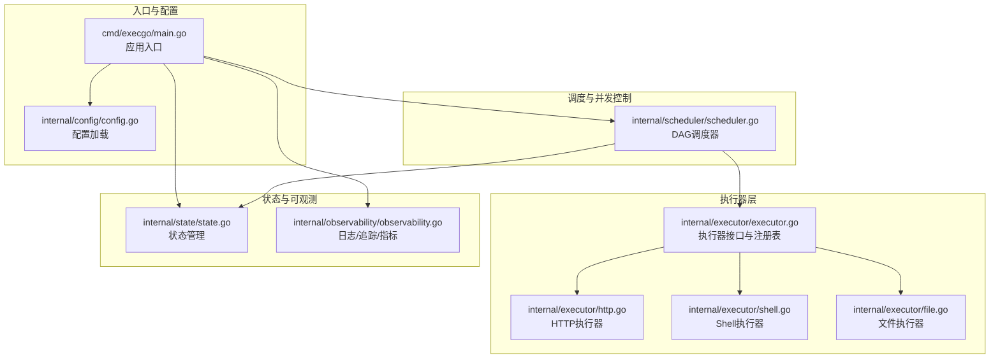
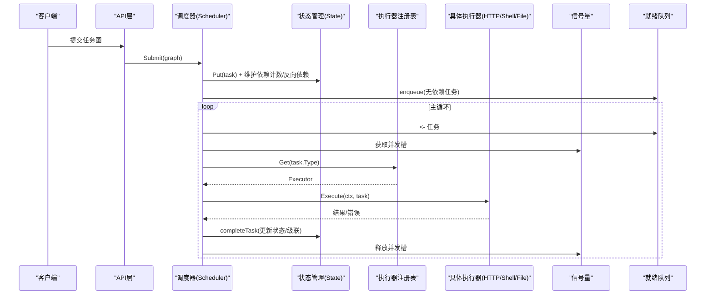
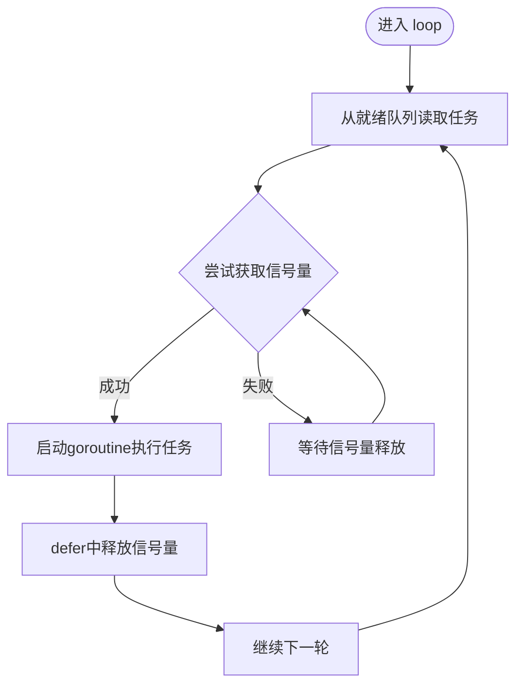
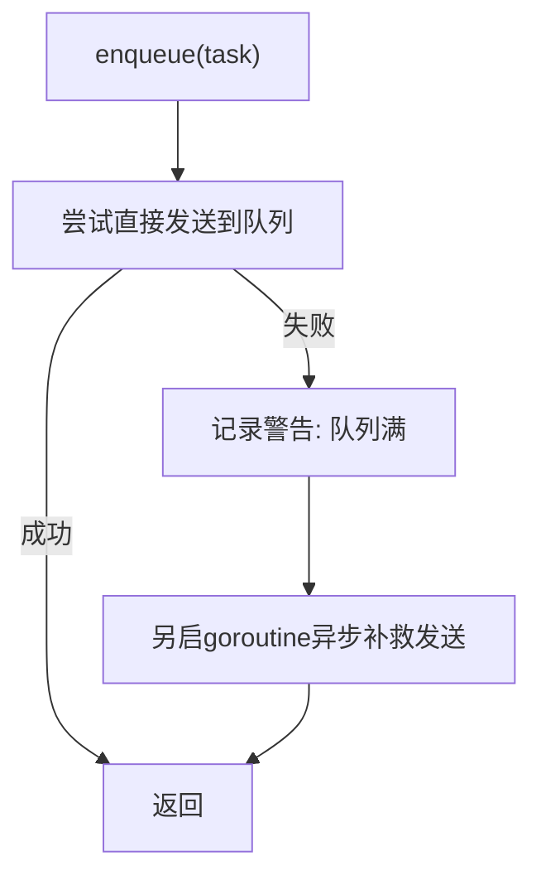
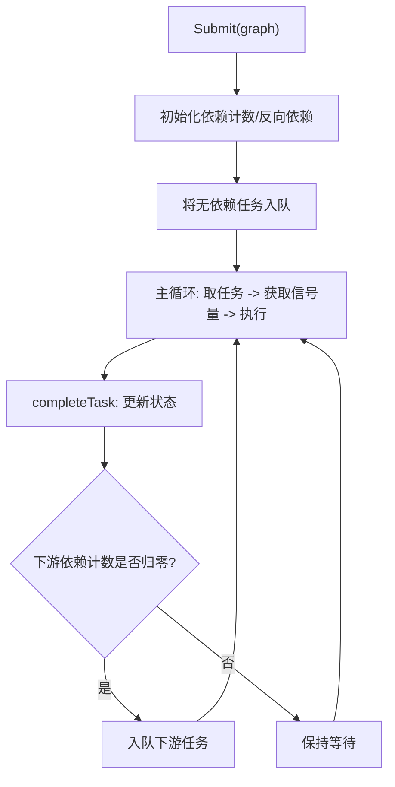
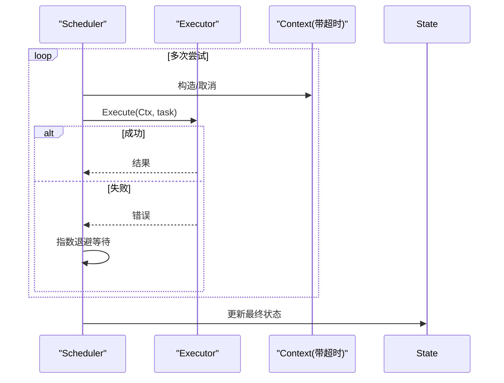
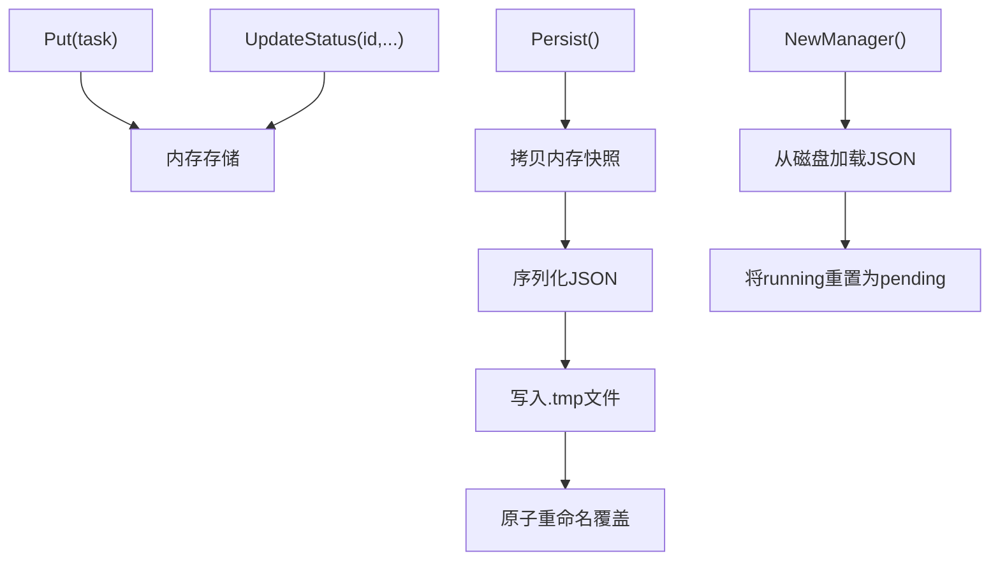
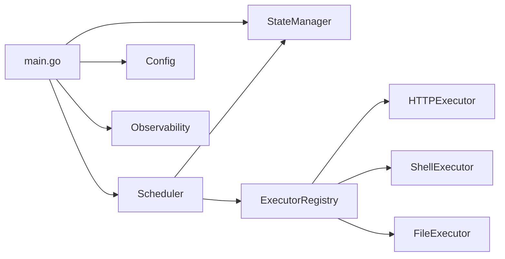

# 并发控制机制

<cite>
**本文档引用的文件**
- [scheduler.go](file://internal/scheduler/scheduler.go)
- [executor.go](file://internal/executor/executor.go)
- [config.go](file://internal/config/config.go)
- [main.go](file://cmd/execgo/main.go)
- [task.go](file://internal/models/task.go)
- [state.go](file://internal/state/state.go)
- [observability.go](file://internal/observability/observability.go)
- [http.go](file://internal/executor/http.go)
- [shell.go](file://internal/executor/shell.go)
- [file.go](file://internal/executor/file.go)
</cite>

## 目录
1. [简介](#简介)
2. [项目结构](#项目结构)
3. [核心组件](#核心组件)
4. [架构总览](#架构总览)
5. [详细组件分析](#详细组件分析)
6. [依赖分析](#依赖分析)
7. [性能考虑](#性能考虑)
8. [故障排查指南](#故障排查指南)
9. [结论](#结论)

## 简介
本文件聚焦 ExecGo 的并发控制机制，深入解析其基于信号量的并发槽位管理、goroutine 调度与资源分配策略；详细说明就绪队列的设计与容量限制及满载处理；解释 DAG 任务的并发执行模型及其对并发度的影响；并提供性能优化建议、最佳实践与故障排查要点。

## 项目结构
ExecGo 采用分层架构，核心并发控制位于调度器模块，配合状态管理、可观测性与执行器注册表共同构成完整的任务执行链路。

图表来源
- [main.go:25-105](file://cmd/execgo/main.go#L25-L105)
- [scheduler.go:18-45](file://internal/scheduler/scheduler.go#L18-L45)
- [executor.go:14-68](file://internal/executor/executor.go#L14-L68)
- [state.go:17-53](file://internal/state/state.go#L17-L53)
- [observability.go:86-134](file://internal/observability/observability.go#L86-L134)

章节来源
- [main.go:25-105](file://cmd/execgo/main.go#L25-L105)
- [config.go:18-30](file://internal/config/config.go#L18-L30)

## 核心组件
- 调度器（Scheduler）：负责 DAG 任务的提交、依赖计数维护、就绪队列与信号量并发控制、任务执行与级联完成。
- 执行器（Executor）：统一接口与注册表，内置 HTTP/Shell/File 执行器。
- 状态管理（State Manager）：内存任务状态存储与 JSON 文件持久化。
- 配置（Config）：最大并发数、优雅关闭超时等运行参数。
- 观测性（Observability）：结构化日志、traceID、指标采集。

章节来源
- [scheduler.go:18-45](file://internal/scheduler/scheduler.go#L18-L45)
- [executor.go:14-68](file://internal/executor/executor.go#L14-L68)
- [state.go:17-53](file://internal/state/state.go#L17-L53)
- [config.go:10-16](file://internal/config/config.go#L10-L16)
- [observability.go:86-134](file://internal/observability/observability.go#L86-L134)

## 架构总览
ExecGo 的并发控制以“信号量 + 有界通道”的组合实现，既保证了最大并发度，又通过就绪队列缓冲任务提交高峰。DAG 依赖图在提交阶段被解析并建立依赖计数与反向依赖映射，确保只有当上游任务完成时才将下游任务入队执行。

图表来源
- [scheduler.go:69-97](file://internal/scheduler/scheduler.go#L69-L97)
- [scheduler.go:99-125](file://internal/scheduler/scheduler.go#L99-L125)
- [scheduler.go:127-190](file://internal/scheduler/scheduler.go#L127-L190)
- [scheduler.go:192-222](file://internal/scheduler/scheduler.go#L192-L222)
- [executor.go:38-48](file://internal/executor/executor.go#L38-L48)

## 详细组件分析

### 1) 信号量与并发槽位管理
- 信号量实现：使用带缓冲区的通道作为信号量，容量即最大并发数。每次执行前获取槽位，结束后释放。
- 并发控制流程：
  - 主循环从就绪队列取出任务后，先尝试获取信号量。
  - 成功获取后启动一个 goroutine 执行任务，并在 defer 中释放信号量。
  - 该设计确保同一时刻活跃执行的任务数量不超过配置的最大并发数。

图表来源
- [scheduler.go:109-125](file://internal/scheduler/scheduler.go#L109-L125)
- [scheduler.go:116-122](file://internal/scheduler/scheduler.go#L116-L122)

章节来源
- [scheduler.go:19-32](file://internal/scheduler/scheduler.go#L19-L32)
- [scheduler.go:35-44](file://internal/scheduler/scheduler.go#L35-L44)
- [scheduler.go:109-125](file://internal/scheduler/scheduler.go#L109-L125)

### 2) 就绪队列设计与容量限制
- 队列类型：有界通道（带缓冲），容量固定为 1024。
- 入队策略：
  - 正常入队：直接发送到通道。
  - 队列满载：使用非阻塞 select，若满则记录警告并异步补救（另起 goroutine 发送）。
- 出队策略：主循环持续从通道读取任务，保证高吞吐场景下的任务及时调度。

图表来源
- [scheduler.go:99-107](file://internal/scheduler/scheduler.go#L99-L107)

章节来源
- [scheduler.go:24-41](file://internal/scheduler/scheduler.go#L24-L41)
- [scheduler.go:99-107](file://internal/scheduler/scheduler.go#L99-L107)

### 3) DAG 任务并发执行模型
- 依赖图构建：提交时遍历任务，记录每个任务的剩余依赖计数与反向依赖列表。
- 入队时机：仅当任务的剩余依赖计数归零时，将其入队。
- 完成传播：任务完成后，按反向依赖列表递减下游任务的依赖计数，一旦归零则入队执行；失败时进行级联跳过。

图表来源
- [scheduler.go:69-97](file://internal/scheduler/scheduler.go#L69-L97)
- [scheduler.go:192-222](file://internal/scheduler/scheduler.go#L192-L222)

章节来源
- [scheduler.go:69-97](file://internal/scheduler/scheduler.go#L69-L97)
- [scheduler.go:192-222](file://internal/scheduler/scheduler.go#L192-L222)
- [task.go:41-79](file://internal/models/task.go#L41-L79)

### 4) 执行器与超时/重试策略
- 执行器接口：统一的 Type() 与 Execute(ctx, task) 方法，通过注册表按类型获取。
- 超时控制：根据任务配置构造带超时的 context，超时后执行器需正确响应取消。
- 重试策略：指数退避（最多 10 秒上限），支持多次尝试直至成功或达到最大次数。
- 执行器实现示例：
  - HTTP 执行器：基于 net/http，默认客户端，限制响应体大小。
  - Shell 执行器：白名单命令安全校验，支持工作目录。
  - 文件执行器：路径清理防止目录穿越，支持读写追加删除统计。

图表来源
- [scheduler.go:127-190](file://internal/scheduler/scheduler.go#L127-L190)
- [http.go:27-75](file://internal/executor/http.go#L27-L75)
- [shell.go:36-79](file://internal/executor/shell.go#L36-L79)
- [file.go:25-52](file://internal/executor/file.go#L25-L52)

章节来源
- [executor.go:14-68](file://internal/executor/executor.go#L14-L68)
- [scheduler.go:127-190](file://internal/scheduler/scheduler.go#L127-L190)
- [http.go:27-75](file://internal/executor/http.go#L27-L75)
- [shell.go:36-79](file://internal/executor/shell.go#L36-L79)
- [file.go:25-52](file://internal/executor/file.go#L25-L52)

### 5) 状态管理与持久化
- 内存状态：以 map[string]*Task 保存任务，读写锁保护并发访问。
- 持久化：定期将内存快照序列化为 JSON 文件，采用临时文件 + 原子重命名方式降低损坏风险。
- 恢复行为：重启时将运行中的任务重置为待执行，避免重复执行。

图表来源
- [state.go:55-108](file://internal/state/state.go#L55-L108)
- [state.go:110-134](file://internal/state/state.go#L110-L134)
- [state.go:136-158](file://internal/state/state.go#L136-L158)
- [state.go:160-179](file://internal/state/state.go#L160-L179)

章节来源
- [state.go:17-53](file://internal/state/state.go#L17-L53)
- [state.go:110-134](file://internal/state/state.go#L110-L134)
- [state.go:136-158](file://internal/state/state.go#L136-L158)

### 6) 观测性与指标
- 指标：原子计数器跟踪总任务数、运行中、成功、失败及按类型分布。
- 日志：结构化 JSON 日志，支持 traceID 注入与提取。
- 指标快照：提供按类型统计的只读视图。

章节来源
- [observability.go:86-134](file://internal/observability/observability.go#L86-L134)
- [observability.go:50-63](file://internal/observability/observability.go#L50-L63)

## 依赖分析
- 调度器依赖状态管理与执行器注册表，通过接口解耦具体执行器实现。
- 执行器注册表提供类型到执行器的映射，支持扩展新的执行器类型。
- 配置模块提供最大并发数等运行参数，贯穿应用生命周期。

图表来源
- [scheduler.go:18-45](file://internal/scheduler/scheduler.go#L18-L45)
- [executor.go:38-67](file://internal/executor/executor.go#L38-L67)
- [main.go:25-105](file://cmd/execgo/main.go#L25-L105)
- [config.go:18-30](file://internal/config/config.go#L18-L30)

章节来源
- [scheduler.go:18-45](file://internal/scheduler/scheduler.go#L18-L45)
- [executor.go:38-67](file://internal/executor/executor.go#L38-L67)
- [main.go:25-105](file://cmd/execgo/main.go#L25-L105)
- [config.go:18-30](file://internal/config/config.go#L18-L30)

## 性能考虑
- 最大并发数配置
  - 通过配置项设置最大并发数，直接影响信号量容量与 CPU/GPU/网络资源占用。
  - 建议：根据执行器类型与资源瓶颈（CPU/IO/网络）动态评估，避免过度并发导致上下文切换与资源争用。
- 就绪队列容量
  - 固定容量为 1024，满载时会异步补救发送，但可能造成延迟尖峰。
  - 建议：结合任务提交速率与执行时间，评估是否需要调整队列容量或引入外部缓冲。
- 超时与重试
  - 为每个任务设置合理超时，避免长时间阻塞 goroutine。
  - 指数退避上限控制重试频率，减少对下游系统的冲击。
- 资源竞争避免
  - 使用信号量严格控制并发度，避免执行器内部再次并发造成资源竞争。
  - 对共享资源（如文件系统）尽量避免串行化热点，必要时在执行器内部做幂等处理。
- 指标监控
  - 通过 /metrics 端点观察运行中任务数、成功/失败率与按类型分布，辅助调优。

章节来源
- [config.go:25](file://internal/config/config.go#L25)
- [scheduler.go:109-125](file://internal/scheduler/scheduler.go#L109-L125)
- [scheduler.go:127-190](file://internal/scheduler/scheduler.go#L127-L190)
- [observability.go:122-133](file://internal/observability/observability.go#L122-L133)

## 故障排查指南
- 调度器未启动或停止
  - 检查启动与停止流程，确认上下文取消与等待组同步。
- 任务长时间处于 pending
  - 检查依赖计数与反向依赖映射是否正确，确认上游任务是否成功完成。
- 就绪队列满载告警
  - 查看日志中的队列满载警告，评估任务提交速率与并发配置。
- 执行器报错
  - 核对执行器类型与参数，检查超时与重试策略是否生效。
- 状态不一致或丢失
  - 检查持久化周期与最终落盘，确认运行中任务在恢复时被重置为待执行。

章节来源
- [scheduler.go:47-67](file://internal/scheduler/scheduler.go#L47-L67)
- [scheduler.go:99-107](file://internal/scheduler/scheduler.go#L99-L107)
- [scheduler.go:192-222](file://internal/scheduler/scheduler.go#L192-L222)
- [state.go:160-179](file://internal/state/state.go#L160-L179)

## 结论
ExecGo 的并发控制以“信号量 + 有界通道”为核心，结合 DAG 依赖图与状态持久化，实现了稳定、可观测且可扩展的任务执行体系。通过合理配置最大并发数、优化就绪队列与超时重试策略，可在不同负载场景下获得良好的吞吐与延迟表现。建议在生产环境中持续监控指标、评估资源瓶颈，并根据业务需求动态调整并发参数与执行器策略。