# 数据持久化策略

<cite>
**本文档中引用的文件**
- [main.go](file://cmd/execgo/main.go)
- [state.go](file://internal/state/state.go)
- [task.go](file://internal/models/task.go)
- [scheduler.go](file://internal/scheduler/scheduler.go)
- [config.go](file://internal/config/config.go)
- [state.json](file://data/state.json)
- [executor.go](file://internal/executor/executor.go)
- [file.go](file://internal/executor/file.go)
- [shell.go](file://internal/executor/shell.go)
- [http.go](file://internal/executor/http.go)
- [handler.go](file://internal/api/handler.go)
- [observability.go](file://internal/observability/observability.go)
- [go.mod](file://go.mod)
</cite>

## 目录
1. [简介](#简介)
2. [项目结构概览](#项目结构概览)
3. [核心组件架构](#核心组件架构)
4. [内存状态管理](#内存状态管理)
5. [磁盘持久化机制](#磁盘持久化机制)
6. [状态同步策略](#状态同步策略)
7. [一致性保证](#一致性保证)
8. [任务状态生命周期](#任务状态生命周期)
9. [状态恢复机制](#状态恢复机制)
10. [数据备份与迁移策略](#数据备份与迁移策略)
11. [性能优化措施](#性能优化措施)
12. [故障处理与排障](#故障处理与排障)
13. [总结](#总结)

## 简介

ExecGo 是一个极简的 AI 执行引擎，提供任务提交、DAG 调度、并发执行和可观测性的 HTTP 服务。本文档详细阐述了 ExecGo 的数据持久化策略，重点分析其内存状态管理与磁盘持久化的双重机制，包括状态同步策略、一致性保证、任务状态生命周期管理、状态恢复机制以及性能优化措施。

## 项目结构概览

ExecGo 采用模块化架构设计，主要包含以下核心模块：

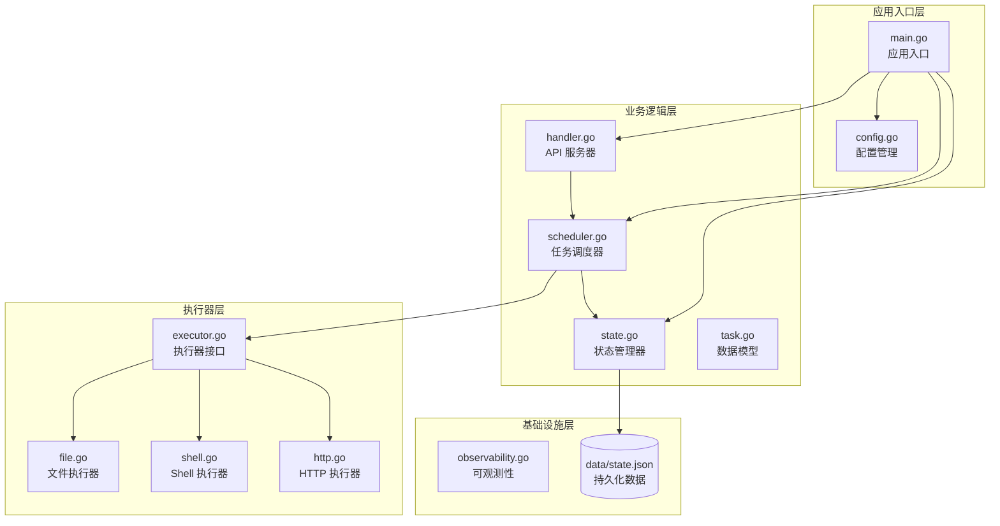

**图表来源**
- [main.go:25-104](file://cmd/execgo/main.go#L25-L104)
- [state.go:17-53](file://internal/state/state.go#L17-L53)
- [scheduler.go:18-45](file://internal/scheduler/scheduler.go#L18-L45)

## 核心组件架构

### 状态管理器架构

状态管理器是 ExecGo 的核心组件，负责维护任务状态的内存存储和磁盘持久化：

```mermaid
classDiagram
class Manager {
-sync.RWMutex mu
-map~string,*Task~ tasks
-string filePath
-*slog.Logger logger
+Put(task *Task)
+Get(id string) (*Task, bool)
+GetAll() []*Task
+Delete(id string) bool
+UpdateStatus(id string, status TaskStatus, result json.RawMessage, errMsg string) bool
+Persist() error
+StartPeriodicPersist(interval time.Duration, stop <-chan struct{})
-loadFromDisk() error
}
class Task {
+string ID
+string Type
+json.RawMessage Params
+[]string DependsOn
+int Retry
+int64 Timeout
+TaskStatus Status
+json.RawMessage Result
+string Error
+time.Time CreatedAt
+time.Time UpdatedAt
}
class TaskStatus {
<<enumeration>>
PENDING
RUNNING
SUCCESS
FAILED
SKIPPED
}
Manager --> Task : "管理"
Task --> TaskStatus : "使用"
```

**图表来源**
- [state.go:17-53](file://internal/state/state.go#L17-L53)
- [task.go:21-34](file://internal/models/task.go#L21-L34)

### 调度器与状态管理交互

调度器通过状态管理器协调任务执行和状态更新：

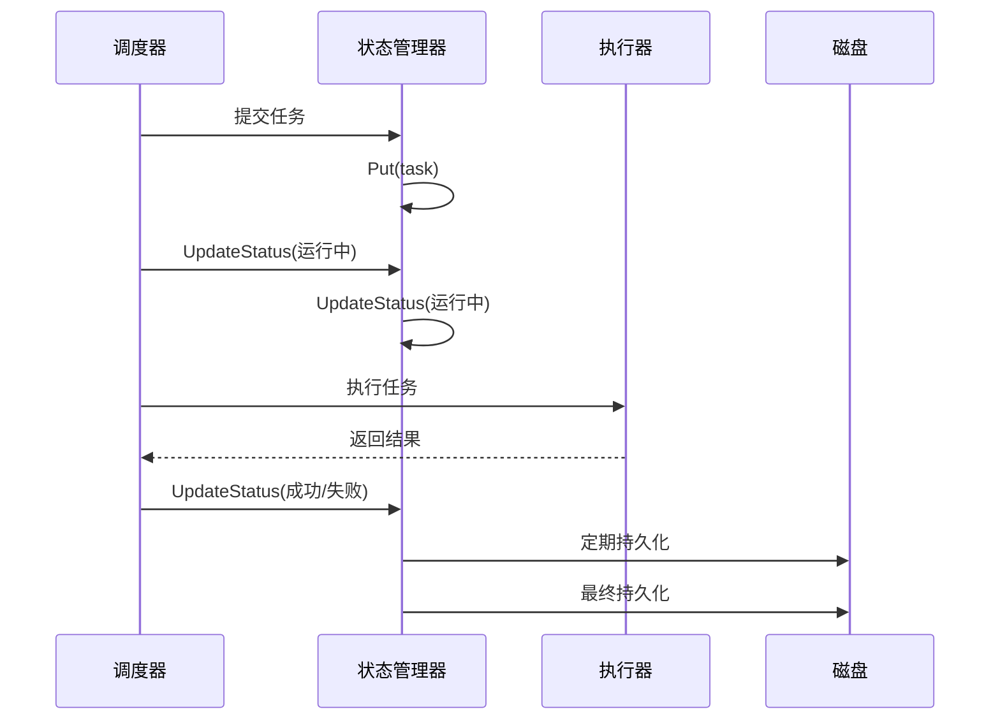

**图表来源**
- [scheduler.go:69-97](file://internal/scheduler/scheduler.go#L69-L97)
- [scheduler.go:127-190](file://internal/scheduler/scheduler.go#L127-L190)
- [state.go:110-134](file://internal/state/state.go#L110-L134)

## 内存状态管理

### 状态存储结构

ExecGo 使用内存中的哈希表来存储所有任务状态，提供高效的读写操作：

```mermaid
graph LR
subgraph "内存状态存储"
TasksMap[任务映射表<br/>map[string]*Task]
RWLock[读写锁<br/>sync.RWMutex]
end
subgraph "并发控制"
RLock[读锁]
WLock[写锁]
LockGuard[锁保护]
end
TasksMap --> RWLock
RLock --> LockGuard
WLock --> LockGuard
```

**图表来源**
- [state.go:18-23](file://internal/state/state.go#L18-L23)

### 状态访问模式

状态管理器提供了多种访问模式以满足不同场景的需求：

| 方法 | 访问模式 | 主要用途 |
|------|----------|----------|
| Put | 写入 | 存储新任务或更新现有任务 |
| Get | 读取 | 获取单个任务详情 |
| GetAll | 读取 | 获取所有任务列表 |
| Delete | 写入 | 删除指定任务 |
| UpdateStatus | 原子更新 | 更新任务状态和结果 |

**章节来源**
- [state.go:55-92](file://internal/state/state.go#L55-L92)

## 磁盘持久化机制

### 文件存储格式

ExecGo 使用 JSON 格式将内存中的任务状态持久化到磁盘文件 `state.json`：

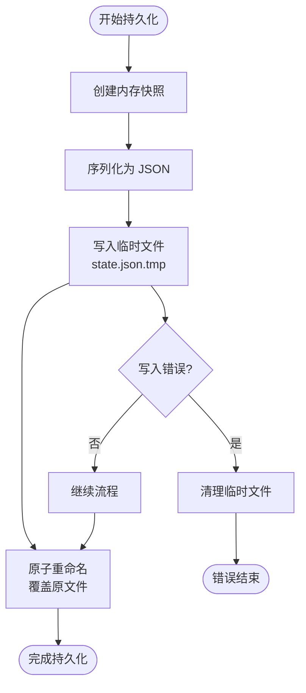

**图表来源**
- [state.go:110-134](file://internal/state/state.go#L110-L134)

### 持久化文件示例

根据示例数据，state.json 文件包含多个任务的状态信息：

| 字段 | 类型 | 描述 | 示例值 |
|------|------|------|--------|
| id | string | 任务唯一标识符 | "step1" |
| type | string | 任务类型 | "file" |
| params | object | 任务参数 | 包含具体执行参数 |
| depends_on | array | 依赖任务列表 | ["step1"] |
| status | string | 任务执行状态 | "success" |
| result | object | 执行结果 | 包含具体结果数据 |
| error | string | 错误信息 | 失败时的错误描述 |
| created_at | string | 创建时间 | ISO8601 时间戳 |
| updated_at | string | 最后更新时间 | ISO8601 时间戳 |

**章节来源**
- [state.json:1-76](file://data/state.json#L1-L76)

## 状态同步策略

### 实时同步机制

ExecGo 采用"内存优先，定期持久化"的策略，确保数据的实时性和可靠性：

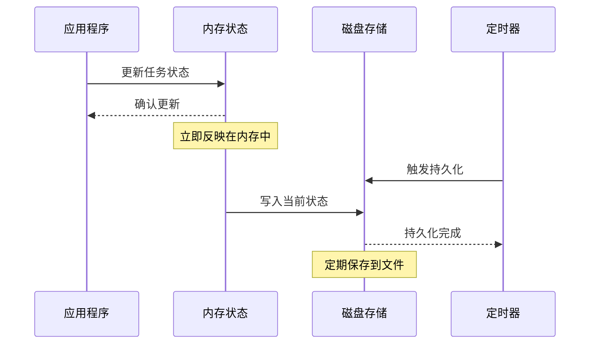

**图表来源**
- [main.go:53-55](file://cmd/execgo/main.go#L53-L55)
- [state.go:160-179](file://internal/state/state.go#L160-L179)

### 同步触发时机

状态同步在以下情况下触发：

1. **定时持久化**：每 30 秒自动触发一次
2. **优雅关闭**：应用停止前进行最终持久化
3. **异常情况**：持久化过程中出现错误时的重试

**章节来源**
- [main.go:53-103](file://cmd/execgo/main.go#L53-L103)
- [state.go:160-179](file://internal/state/state.go#L160-L179)

## 一致性保证

### 原子性保证

ExecGo 通过原子重命名操作确保持久化的一致性：

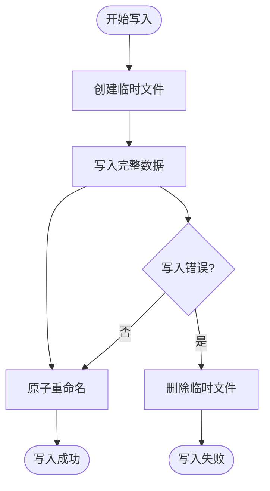

**图表来源**
- [state.go:124-131](file://internal/state/state.go#L124-L131)

### 一致性级别

系统提供以下一致性保证：

1. **强一致性**：内存中的状态变更立即生效
2. **最终一致性**：磁盘持久化确保数据不会丢失
3. **崩溃一致性**：系统重启后能恢复到一致状态

**章节来源**
- [state.go:124-131](file://internal/state/state.go#L124-L131)

## 任务状态生命周期

### 状态转换图

任务在整个生命周期中会经历以下状态转换：

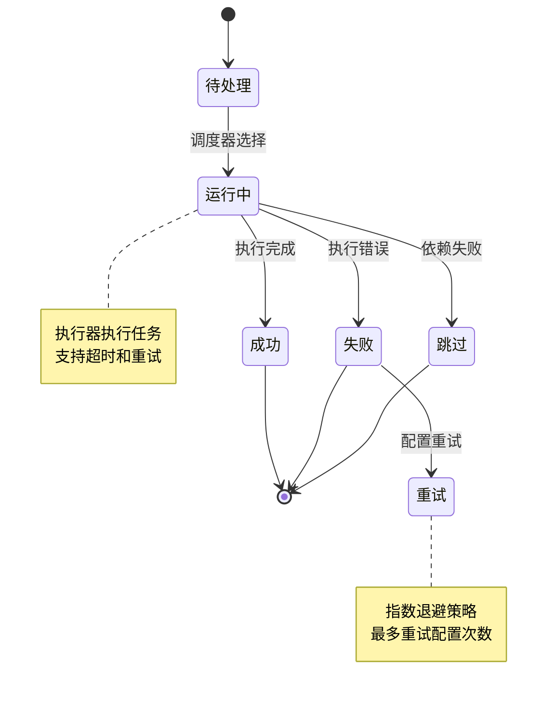

**图表来源**
- [task.go:10-19](file://internal/models/task.go#L10-L19)
- [scheduler.go:127-190](file://internal/scheduler/scheduler.go#L127-L190)

### 生命周期管理流程

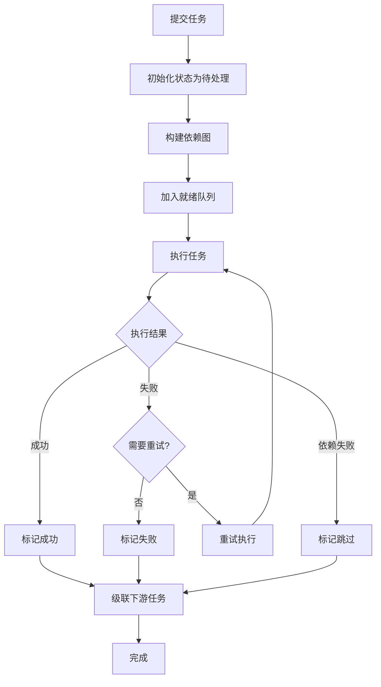

**图表来源**
- [scheduler.go:69-97](file://internal/scheduler/scheduler.go#L69-L97)
- [scheduler.go:192-230](file://internal/scheduler/scheduler.go#L192-L230)

**章节来源**
- [scheduler.go:69-230](file://internal/scheduler/scheduler.go#L69-L230)

## 状态恢复机制

### 启动时恢复流程

系统启动时会自动执行状态恢复过程：

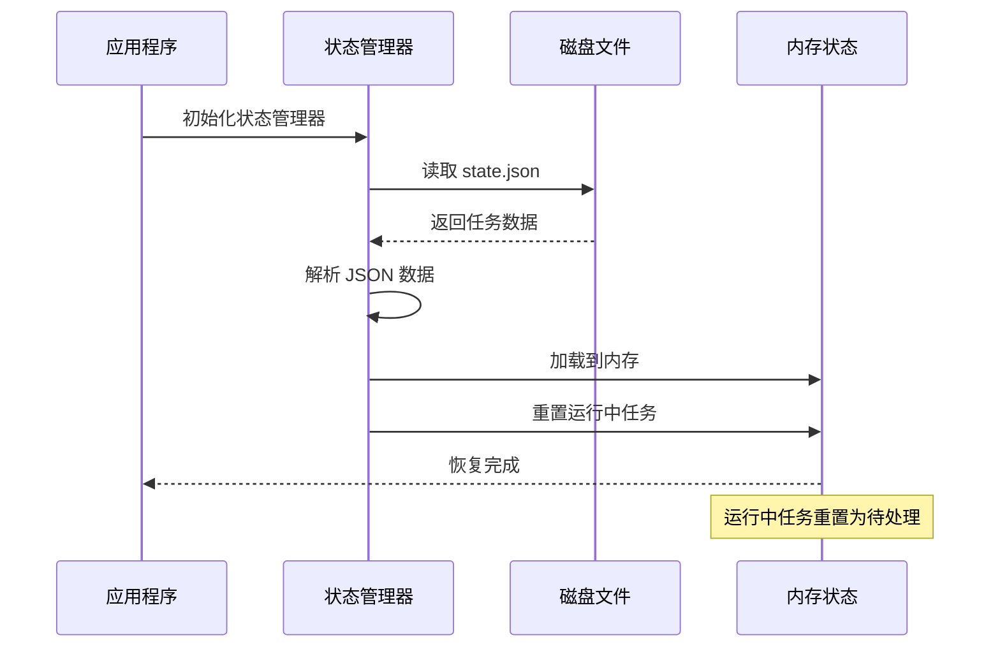

**图表来源**
- [state.go:25-53](file://internal/state/state.go#L25-L53)
- [state.go:136-158](file://internal/state/state.go#L136-L158)

### 恢复策略细节

1. **数据加载**：从磁盘读取 JSON 文件并解析为任务对象
2. **状态重置**：将所有运行中的任务重置为待处理状态
3. **时间更新**：更新最后修改时间为当前时间
4. **日志记录**：记录恢复过程中的重要信息

**章节来源**
- [state.go:25-53](file://internal/state/state.go#L25-L53)

## 数据备份与迁移策略

### 备份策略

为了确保数据安全，建议采用以下备份策略：

1. **定期备份**：基于持久化间隔进行自动备份
2. **增量备份**：只备份自上次备份以来发生变化的数据
3. **跨位置备份**：将备份文件存储在不同的物理位置
4. **版本保留**：保留多个历史版本的备份文件

### 迁移策略

当需要进行系统迁移时，可以采用以下步骤：

1. **停止写入**：确保系统处于只读状态
2. **导出数据**：从 state.json 文件导出完整数据
3. **验证完整性**：检查导出数据的完整性和一致性
4. **导入新系统**：在新环境中导入数据
5. **验证功能**：确认新系统能够正确识别和处理数据

### 版本兼容性考虑

由于当前版本使用简单的 JSON 格式，建议：

1. **向后兼容**：新增字段时保持向后兼容性
2. **版本标记**：在文件头部添加版本信息
3. **迁移工具**：提供数据格式升级工具
4. **降级支持**：确保旧版本能够读取新格式

**章节来源**
- [state.go:110-134](file://internal/state/state.go#L110-L134)

## 性能优化措施

### 缓存策略

ExecGo 采用了多层次的缓存策略来提升性能：

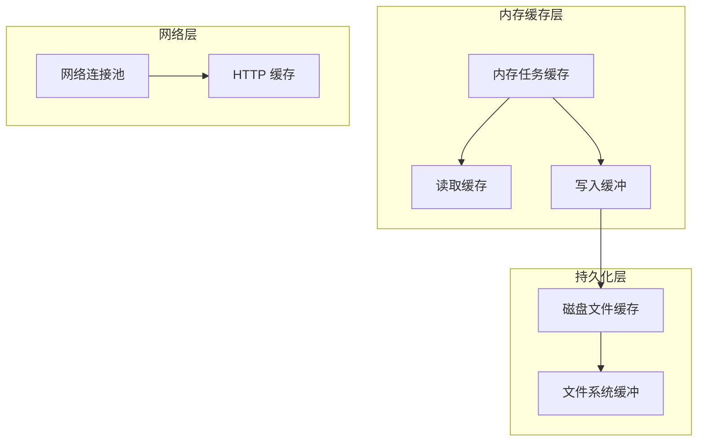

### 批量写入优化

系统通过以下方式优化批量写入性能：

1. **批量持久化**：定期批量写入而非每次状态变更都写入
2. **异步写入**：使用 goroutine 异步执行持久化操作
3. **写入合并**：合并多个写入操作减少磁盘 I/O
4. **背压控制**：防止写入速度超过磁盘处理能力

### 并发控制优化

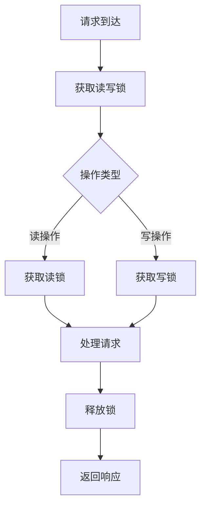

**图表来源**
- [state.go:18-23](file://internal/state/state.go#L18-L23)

**章节来源**
- [state.go:160-179](file://internal/state/state.go#L160-L179)

## 故障处理与排障

### 常见故障类型

1. **磁盘写入失败**：文件系统权限问题或磁盘空间不足
2. **JSON 解析错误**：state.json 文件损坏或格式不正确
3. **内存溢出**：大量任务导致内存占用过高
4. **持久化延迟**：磁盘性能问题导致持久化延迟

### 排障步骤

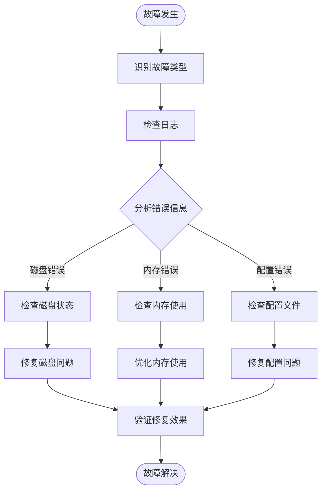

### 监控指标

系统提供以下关键监控指标：

| 指标名称 | 描述 | 类型 | 用途 |
|----------|------|------|------|
| tasks_total | 总任务数 | 计数器 | 监控任务总量 |
| tasks_running | 运行中任务数 | 计数器 | 监控并发执行 |
| tasks_succeeded | 成功任务数 | 计数器 | 监控执行成功率 |
| tasks_failed | 失败任务数 | 计数器 | 监控执行失败率 |
| by_type | 按类型统计 | 映射 | 分析不同类型任务 |

**章节来源**
- [observability.go:86-133](file://internal/observability/observability.go#L86-L133)

## 总结

ExecGo 的数据持久化策略通过内存状态管理和磁盘持久化的双重机制，实现了高性能和高可靠性的平衡。该策略的主要特点包括：

1. **实时性与可靠性并重**：内存中的即时响应和定期持久化的双重保障
2. **原子性持久化**：通过临时文件和原子重命名确保数据一致性
3. **智能恢复机制**：启动时自动恢复状态并重置运行中任务
4. **性能优化**：批量写入、异步处理和合理的并发控制
5. **可扩展性**：模块化设计便于功能扩展和维护

这种设计使得 ExecGo 能够在保证数据安全的前提下，提供高效的任务执行和管理能力，适用于各种需要可靠任务调度和执行的场景。