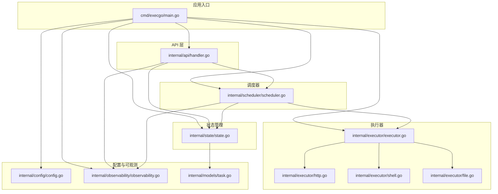
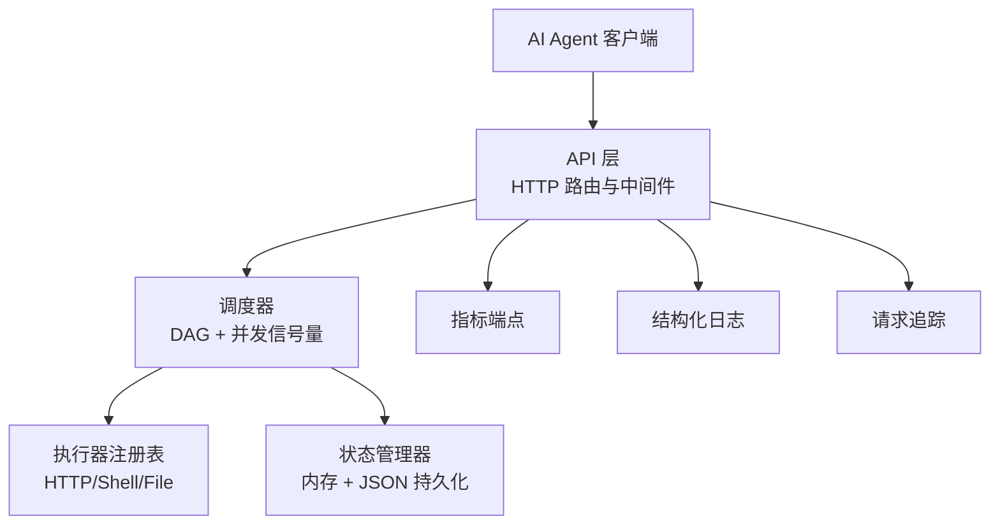
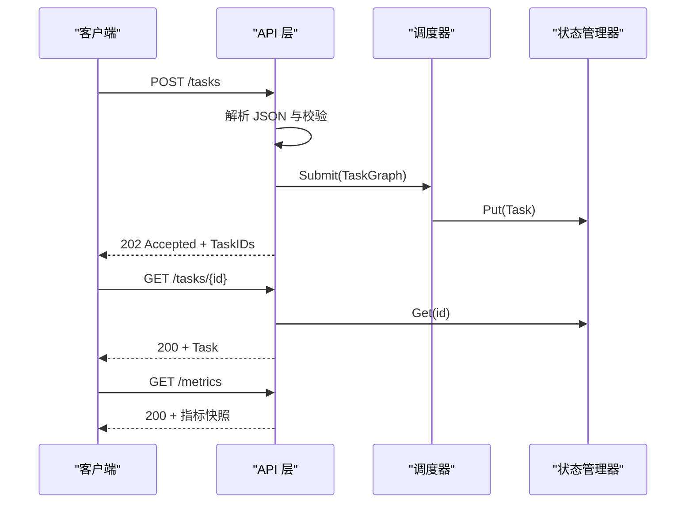
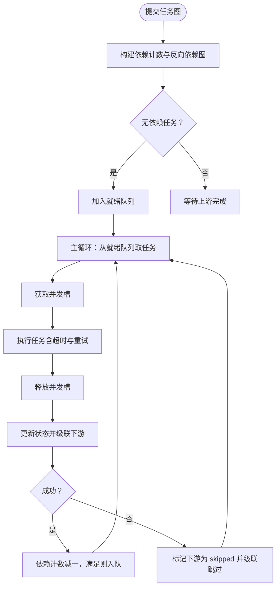
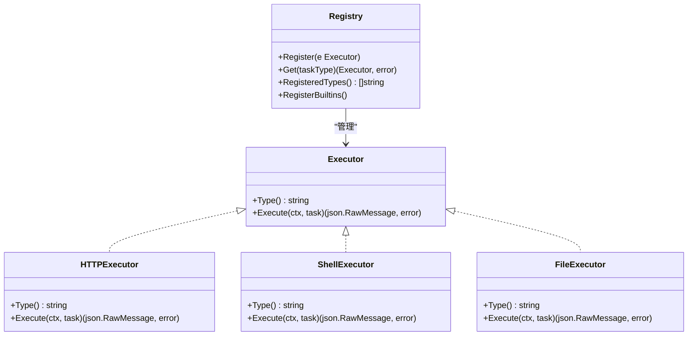
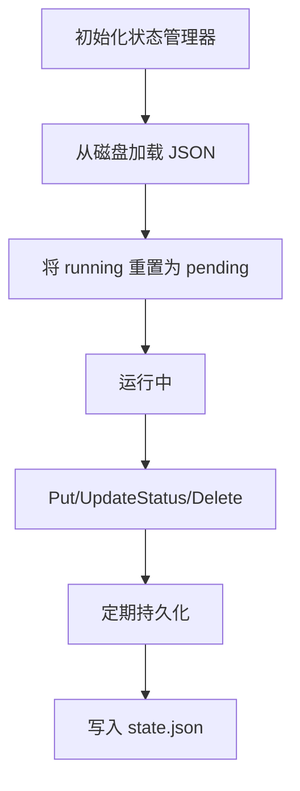
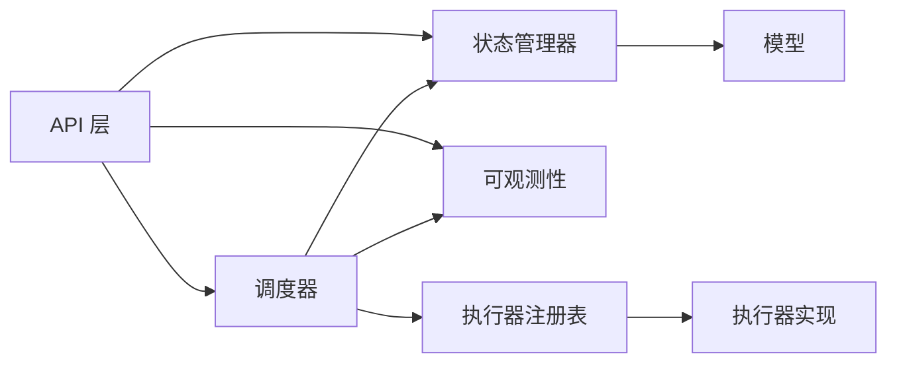

# 系统架构

<cite>
**本文档引用的文件**
- [main.go](file://cmd/execgo/main.go)
- [handler.go](file://internal/api/handler.go)
- [scheduler.go](file://internal/scheduler/scheduler.go)
- [executor.go](file://internal/executor/executor.go)
- [http.go](file://internal/executor/http.go)
- [shell.go](file://internal/executor/shell.go)
- [file.go](file://internal/executor/file.go)
- [state.go](file://internal/state/state.go)
- [config.go](file://internal/config/config.go)
- [observability.go](file://internal/observability/observability.go)
- [task.go](file://internal/models/task.go)
- [go.mod](file://go.mod)
- [README.md](file://README.md)
</cite>

## 目录
1. [简介](#简介)
2. [项目结构](#项目结构)
3. [核心组件](#核心组件)
4. [架构总览](#架构总览)
5. [详细组件分析](#详细组件分析)
6. [依赖关系分析](#依赖关系分析)
7. [性能考量](#性能考量)
8. [故障排查指南](#故障排查指南)
9. [结论](#结论)
10. [附录](#附录)

## 简介
ExecGo 是一个使用纯 Go 标准库构建的极简 AI 执行引擎，采用分层架构设计，提供任务提交、DAG 调度、并发执行与可观测性能力。系统通过 HTTP API 对外暴露，内部以调度器为核心协调执行器执行任务，并通过状态管理器进行内存与持久化存储。系统遵循接口隔离原则与注册表模式，具备良好的可扩展性与韧性设计。

## 项目结构
项目采用按职责分层的模块化组织方式：
- cmd/execgo：应用入口，负责初始化配置、组件装配与优雅关闭
- internal/api：HTTP API 层，提供任务提交、查询、删除、健康检查与指标端点
- internal/scheduler：DAG 调度器，基于依赖图与信号量控制并发执行
- internal/executor：执行器接口与注册表，内置 HTTP/Shell/File 执行器
- internal/state：状态管理器，内存存储与 JSON 文件持久化
- internal/config：配置管理，支持命令行参数与环境变量
- internal/observability：结构化日志、请求追踪与指标收集
- internal/models：核心数据结构与任务 DSL
- data：持久化数据目录

图表来源
- [main.go:25-104](file://cmd/execgo/main.go#L25-L104)
- [handler.go:29-52](file://internal/api/handler.go#L29-L52)
- [scheduler.go:35-45](file://internal/scheduler/scheduler.go#L35-L45)
- [executor.go:31-67](file://internal/executor/executor.go#L31-L67)
- [state.go:26-53](file://internal/state/state.go#L26-L53)
- [config.go:20-30](file://internal/config/config.go#L20-L30)
- [observability.go:98-133](file://internal/observability/observability.go#L98-L133)
- [task.go:36-79](file://internal/models/task.go#L36-L79)

章节来源
- [README.md:149-177](file://README.md#L149-L177)
- [go.mod:1-4](file://go.mod#L1-L4)

## 核心组件
- 应用入口：负责配置加载、组件初始化、执行器注册、指标与日志初始化、状态管理器持久化定时任务、调度器启动、HTTP 服务启动以及优雅关闭流程
- API 层：提供任务提交、查询、删除、健康检查与指标端点，使用中间件注入追踪 ID 并统一响应格式
- 调度器：基于 Kahn 算法构建依赖计数与反向依赖图，使用通道与信号量控制并发，支持重试与超时
- 执行器：定义统一接口与全局注册表，内置 HTTP/Shell/File 执行器，支持扩展
- 状态管理器：内存存储任务状态，定期持久化至 JSON 文件，崩溃后恢复并将运行中任务重置为待处理
- 配置管理：支持命令行参数与环境变量，优先级明确
- 可观测性：结构化日志、请求追踪、指标收集与快照

章节来源
- [main.go:25-104](file://cmd/execgo/main.go#L25-L104)
- [handler.go:29-52](file://internal/api/handler.go#L29-L52)
- [scheduler.go:35-45](file://internal/scheduler/scheduler.go#L35-L45)
- [executor.go:31-67](file://internal/executor/executor.go#L31-L67)
- [state.go:26-53](file://internal/state/state.go#L26-L53)
- [config.go:20-30](file://internal/config/config.go#L20-L30)
- [observability.go:98-133](file://internal/observability/observability.go#L98-L133)
- [task.go:36-79](file://internal/models/task.go#L36-L79)

## 架构总览
系统采用分层架构，从 API 层到调度器再到执行器与状态管理器形成清晰的数据流与控制流。接口隔离原则体现在执行器接口与注册表模式，使得新增执行器无需修改核心调度逻辑。调度器通过信号量控制并发，结合指数退避重试与上下文超时保障韧性。

图表来源
- [handler.go:39-52](file://internal/api/handler.go#L39-L52)
- [scheduler.go:18-32](file://internal/scheduler/scheduler.go#L18-L32)
- [executor.go:26-29](file://internal/executor/executor.go#L26-L29)
- [state.go:17-23](file://internal/state/state.go#L17-L23)
- [observability.go:69-80](file://internal/observability/observability.go#L69-L80)

## 详细组件分析

### API 层（HTTP 路由与中间件）
- 职责：接收任务提交、查询任务、删除任务、健康检查与指标查询；统一响应格式；注入追踪 ID
- 关键流程：
  - 任务提交：解析 JSON、验证任务图、校验执行器类型、提交给调度器并返回受理信息
  - 查询与删除：直接读取/更新状态管理器
  - 指标端点：聚合全局指标快照
- 中间件：TraceMiddleware 为每个请求注入 traceID 并在响应头中返回

图表来源
- [handler.go:58-99](file://internal/api/handler.go#L58-L99)
- [handler.go:101-146](file://internal/api/handler.go#L101-L146)
- [scheduler.go:69-97](file://internal/scheduler/scheduler.go#L69-L97)
- [state.go:55-80](file://internal/state/state.go#L55-L80)

章节来源
- [handler.go:29-52](file://internal/api/handler.go#L29-L52)
- [handler.go:58-99](file://internal/api/handler.go#L58-L99)
- [handler.go:101-146](file://internal/api/handler.go#L101-L146)

### 调度器（DAG 与并发控制）
- 职责：构建依赖图、维护就绪队列、控制并发、执行任务、处理重试与超时、级联完成与跳过
- 关键数据结构：
  - readyQueue：容量为 1024 的通道，存放可执行任务
  - semaphore：信号量，控制最大并发
  - depCount：剩余依赖计数映射
  - dependents：反向依赖图
- 并发模型：goroutine + channel + RWMutex 保证线程安全
- 重试策略：指数退避，最大 10 秒，支持自定义重试次数
- 超时控制：基于 context.WithTimeout 或 WithCancel

图表来源
- [scheduler.go:69-97](file://internal/scheduler/scheduler.go#L69-L97)
- [scheduler.go:109-125](file://internal/scheduler/scheduler.go#L109-L125)
- [scheduler.go:127-190](file://internal/scheduler/scheduler.go#L127-L190)
- [scheduler.go:192-222](file://internal/scheduler/scheduler.go#L192-L222)

章节来源
- [scheduler.go:18-32](file://internal/scheduler/scheduler.go#L18-L32)
- [scheduler.go:69-97](file://internal/scheduler/scheduler.go#L69-L97)
- [scheduler.go:109-125](file://internal/scheduler/scheduler.go#L109-L125)
- [scheduler.go:127-190](file://internal/scheduler/scheduler.go#L127-L190)
- [scheduler.go:192-222](file://internal/scheduler/scheduler.go#L192-L222)

### 执行器（接口与注册表）
- 接口：Executor，包含 Type 与 Execute(ctx, task)
- 注册表：全局 map + 读写锁，支持并发安全注册与获取
- 内置执行器：
  - HTTPExecutor：支持指定 URL、方法、头部与请求体，限制响应体大小
  - ShellExecutor：白名单命令执行，支持工作目录
  - FileExecutor：支持读、写、追加、删除、统计，路径清理防目录穿越

图表来源
- [executor.go:14-20](file://internal/executor/executor.go#L14-L20)
- [executor.go:26-29](file://internal/executor/executor.go#L26-L29)
- [executor.go:31-67](file://internal/executor/executor.go#L31-L67)
- [http.go:22-76](file://internal/executor/http.go#L22-L76)
- [shell.go:31-80](file://internal/executor/shell.go#L31-L80)
- [file.go:20-114](file://internal/executor/file.go#L20-L114)

章节来源
- [executor.go:14-20](file://internal/executor/executor.go#L14-L20)
- [executor.go:26-29](file://internal/executor/executor.go#L26-L29)
- [executor.go:31-67](file://internal/executor/executor.go#L31-L67)
- [http.go:22-76](file://internal/executor/http.go#L22-L76)
- [shell.go:31-80](file://internal/executor/shell.go#L31-L80)
- [file.go:20-114](file://internal/executor/file.go#L20-L114)

### 状态管理器（内存与持久化）
- 职责：提供任务的增删改查、状态原子更新、周期性持久化与崩溃恢复
- 数据结构：map[string]*Task + RWMutex
- 持久化策略：先写临时文件，再原子重命名，定期与终止时持久化
- 恢复策略：启动时加载 JSON，将运行中任务重置为待处理

图表来源
- [state.go:26-53](file://internal/state/state.go#L26-L53)
- [state.go:110-134](file://internal/state/state.go#L110-L134)
- [state.go:136-158](file://internal/state/state.go#L136-L158)
- [state.go:160-179](file://internal/state/state.go#L160-L179)

章节来源
- [state.go:17-23](file://internal/state/state.go#L17-L23)
- [state.go:26-53](file://internal/state/state.go#L26-L53)
- [state.go:110-134](file://internal/state/state.go#L110-L134)
- [state.go:136-158](file://internal/state/state.go#L136-L158)
- [state.go:160-179](file://internal/state/state.go#L160-L179)

### 配置管理与可观测性
- 配置：支持 addr、data-dir、max-concurrency、shutdown-timeout，优先级 flag > env > default
- 可观测性：结构化日志（slog JSON）、请求追踪（traceID）、指标（atomic + 快照）

章节来源
- [config.go:10-16](file://internal/config/config.go#L10-L16)
- [config.go:18-30](file://internal/config/config.go#L18-L30)
- [observability.go:50-63](file://internal/observability/observability.go#L50-L63)
- [observability.go:69-80](file://internal/observability/observability.go#L69-L80)
- [observability.go:98-133](file://internal/observability/observability.go#L98-L133)

## 依赖关系分析
- 组件耦合：
  - API 层依赖调度器、状态管理器与可观测性组件
  - 调度器依赖状态管理器、执行器注册表与可观测性组件
  - 执行器通过注册表被调度器调用
  - 状态管理器独立于外部组件，仅依赖模型与标准库
- 外部依赖：纯 Go 标准库，零第三方依赖
- 循环依赖：未发现循环依赖

图表来源
- [handler.go:12-17](file://internal/api/handler.go#L12-L17)
- [scheduler.go:12-16](file://internal/scheduler/scheduler.go#L12-L16)
- [executor.go:5-12](file://internal/executor/executor.go#L5-L12)
- [state.go:14](file://internal/state/state.go#L14)
- [task.go:21-34](file://internal/models/task.go#L21-L34)

章节来源
- [handler.go:12-17](file://internal/api/handler.go#L12-L17)
- [scheduler.go:12-16](file://internal/scheduler/scheduler.go#L12-L16)
- [executor.go:5-12](file://internal/executor/executor.go#L5-L12)
- [state.go:14](file://internal/state/state.go#L14)
- [task.go:21-34](file://internal/models/task.go#L21-L34)

## 性能考量
- 并发模型：goroutine + channel + 信号量，避免阻塞主线程，提升吞吐
- 队列容量：就绪队列容量为 1024，避免内存无限增长
- 重试与超时：指数退避减少抖动，context 超时避免资源泄漏
- 持久化策略：定期持久化降低崩溃损失，原子重命名保证一致性
- 指标收集：原子计数器避免锁竞争，快照读取无锁

章节来源
- [scheduler.go:40-44](file://internal/scheduler/scheduler.go#L40-L44)
- [scheduler.go:109-125](file://internal/scheduler/scheduler.go#L109-L125)
- [scheduler.go:152-179](file://internal/scheduler/scheduler.go#L152-L179)
- [state.go:160-179](file://internal/state/state.go#L160-L179)
- [observability.go:98-133](file://internal/observability/observability.go#L98-L133)

## 故障排查指南
- 任务提交失败：
  - 检查请求体 JSON 是否有效
  - 校验任务图是否为空、ID 是否重复、依赖是否存在且无环
  - 确认执行器类型是否已注册
- 任务执行异常：
  - 查看调度器日志中的 traceID，定位具体任务
  - 检查执行器参数是否正确（URL、命令、路径等）
  - 关注重试与超时设置
- 状态不一致：
  - 检查持久化是否成功，确认 state.json 是否存在
  - 启动时运行中任务会被重置为待处理，属预期行为
- 指标异常：
  - 通过 /metrics 端点核对总数与类型分布
  - 检查指标快照是否正确

章节来源
- [handler.go:63-85](file://internal/api/handler.go#L63-L85)
- [task.go:41-79](file://internal/models/task.go#L41-L79)
- [scheduler.go:127-190](file://internal/scheduler/scheduler.go#L127-L190)
- [state.go:136-158](file://internal/state/state.go#L136-L158)
- [observability.go:132-133](file://internal/observability/observability.go#L132-L133)

## 结论
ExecGo 通过清晰的分层架构、接口隔离与注册表模式实现了高内聚低耦合的设计。调度器的并发控制与重试超时机制确保了系统的韧性，状态管理器的持久化策略提供了可靠的崩溃恢复能力。API 层与可观测性组件完善了系统的可运维性。整体设计遵循零依赖原则，便于部署与维护。

## 附录

### 技术栈与版本兼容性
- Go 版本：1.24.5（模块声明）
- 标准库：完全依赖 Go 标准库，无第三方依赖
- 平台：跨平台（Linux/macOS/Windows），执行器参数中包含 Windows 常用命令白名单

章节来源
- [go.mod:3](file://go.mod#L3)
- [README.md:5](file://README.md#L5)
- [shell.go:14-22](file://internal/executor/shell.go#L14-L22)

### 系统边界与集成模式
- 边界：HTTP API 作为唯一外部接口，内部组件通过接口解耦
- 集成：执行器通过注册表扩展，无需修改核心调度逻辑
- 安全：Shell 执行器采用白名单命令，文件执行器进行路径清理

章节来源
- [handler.go:39-52](file://internal/api/handler.go#L39-L52)
- [executor.go:31-67](file://internal/executor/executor.go#L31-L67)
- [shell.go:14-22](file://internal/executor/shell.go#L14-L22)
- [file.go:35-36](file://internal/executor/file.go#L35-L36)

### 基础设施要求与部署拓扑
- 基础设施：单节点部署，依赖本地文件系统进行持久化
- 部署拓扑：单进程，包含 HTTP 服务、调度器与状态管理器
- 可扩展性：可通过扩展执行器实现横向扩展；并发度可通过配置调整

章节来源
- [main.go:64-70](file://cmd/execgo/main.go#L64-L70)
- [config.go:10-16](file://internal/config/config.go#L10-L16)
- [README.md:32-57](file://README.md#L32-L57)

### 关注点：安全性、监控与灾难恢复
- 安全性：Shell 白名单、文件路径清理、HTTP 执行器参数校验
- 监控：结构化日志、traceID 追踪、/metrics 指标端点
- 灾难恢复：崩溃后将 running 重置为 pending，定期持久化与最终持久化

章节来源
- [shell.go:46-54](file://internal/executor/shell.go#L46-L54)
- [file.go:35-51](file://internal/executor/file.go#L35-L51)
- [http.go:33-38](file://internal/executor/http.go#L33-L38)
- [state.go:41-50](file://internal/state/state.go#L41-L50)
- [state.go:160-179](file://internal/state/state.go#L160-L179)
- [observability.go:50-63](file://internal/observability/observability.go#L50-L63)
- [observability.go:132-133](file://internal/observability/observability.go#L132-L133)