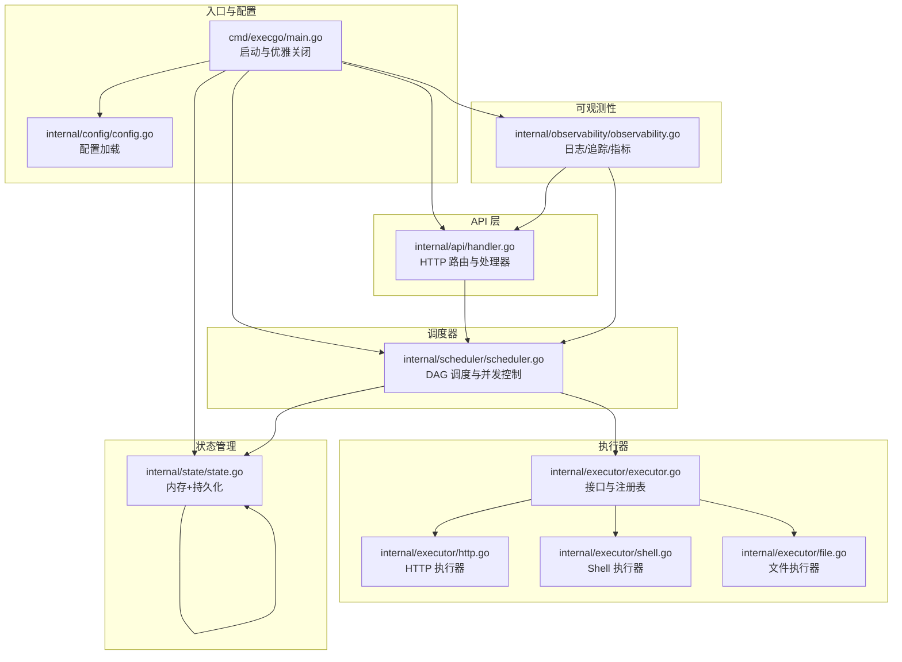
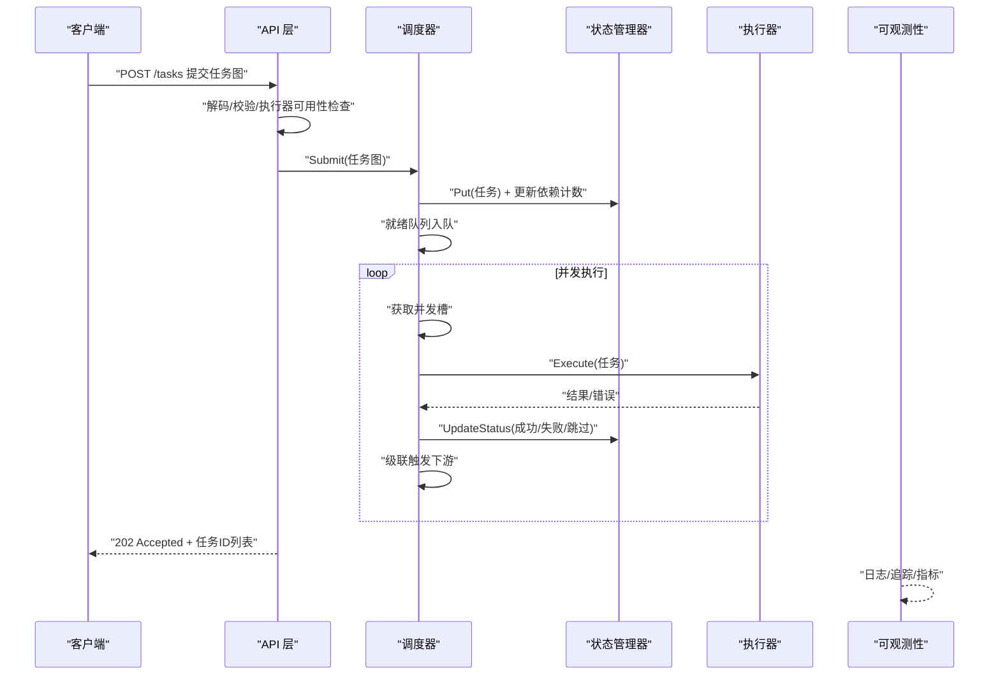
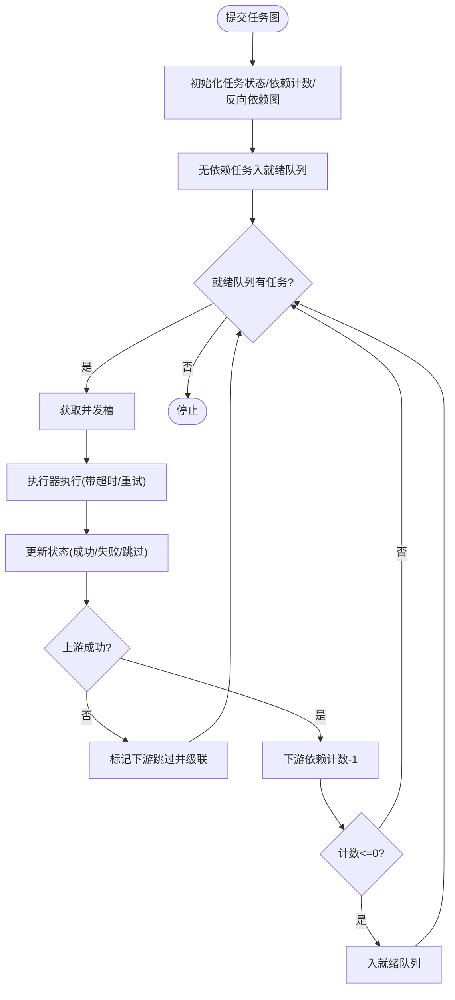
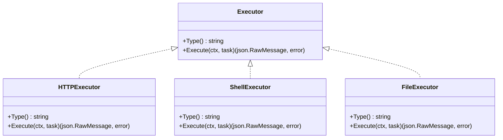
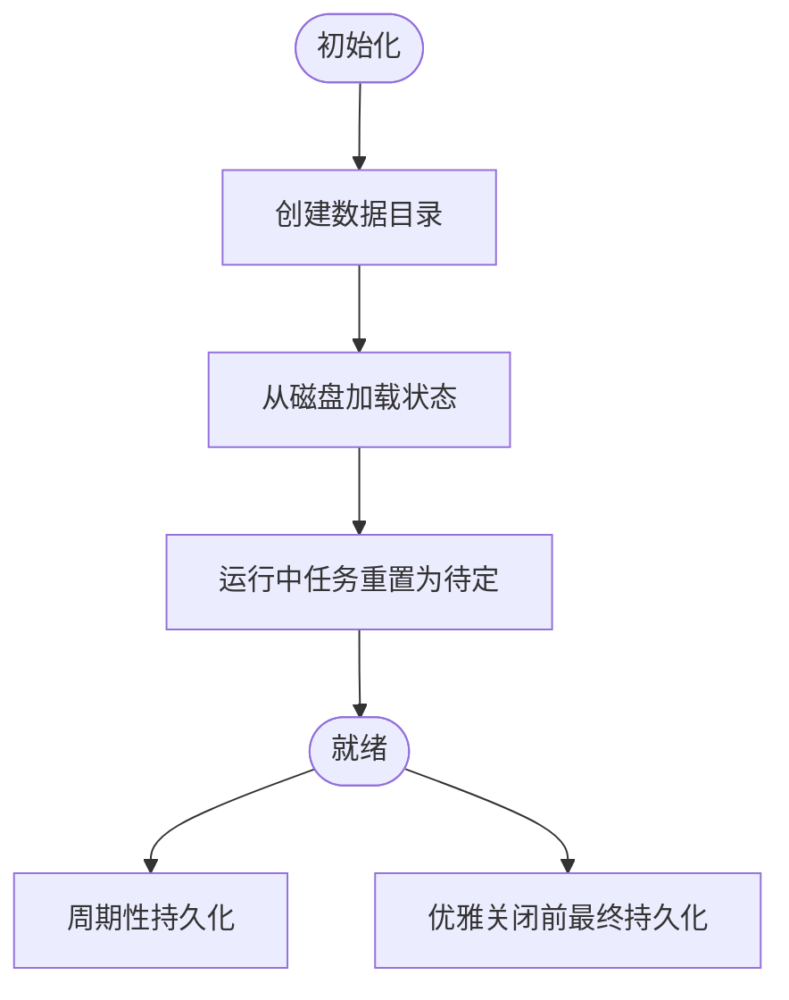
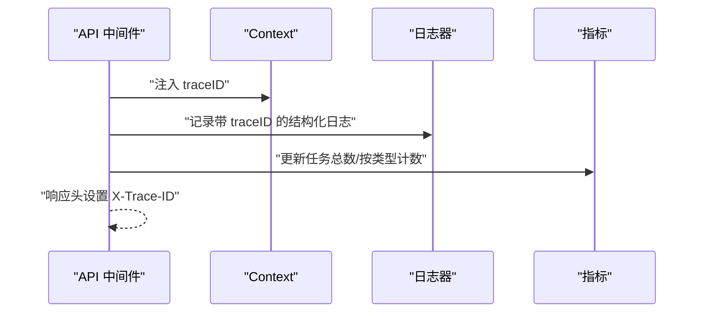
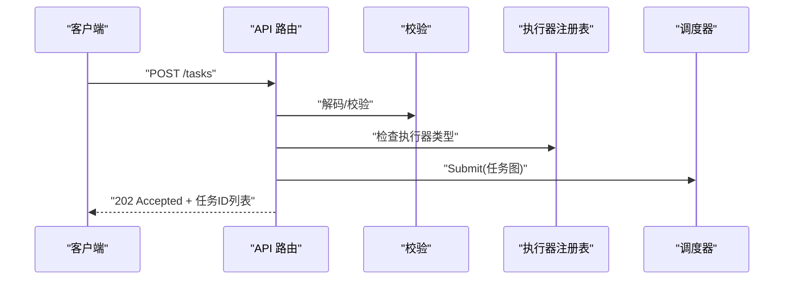
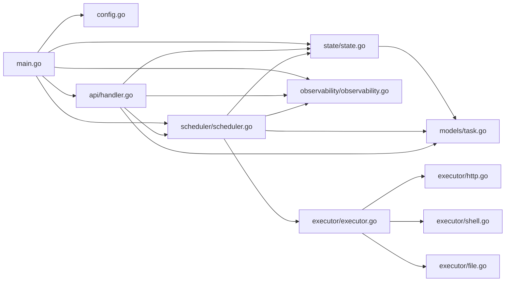

# 组件交互关系

<cite>
**本文引用的文件**
- [main.go](file://cmd/execgo/main.go)
- [handler.go](file://internal/api/handler.go)
- [scheduler.go](file://internal/scheduler/scheduler.go)
- [executor.go](file://internal/executor/executor.go)
- [http.go](file://internal/executor/http.go)
- [shell.go](file://internal/executor/shell.go)
- [file.go](file://internal/executor/file.go)
- [state.go](file://internal/state/state.go)
- [observability.go](file://internal/observability/observability.go)
- [task.go](file://internal/models/task.go)
- [config.go](file://internal/config/config.go)
- [README.md](file://README.md)
</cite>

## 目录
1. [简介](#简介)
2. [项目结构](#项目结构)
3. [核心组件](#核心组件)
4. [架构总览](#架构总览)
5. [详细组件分析](#详细组件分析)
6. [依赖关系分析](#依赖关系分析)
7. [性能考量](#性能考量)
8. [故障排查指南](#故障排查指南)
9. [结论](#结论)
10. [附录](#附录)

## 简介
本文件聚焦 ExecGo 的组件交互关系，系统性阐述调度器、执行器、状态管理器与可观测性系统之间的协作模式。内容覆盖数据流向（从 API 层接收任务请求，调度器解析 DAG 并管理并发执行，执行器按任务类型执行具体操作，状态管理器负责任务状态持久化，可观测性系统收集指标与日志），以及组件间的依赖关系、接口契约（上下文传递、错误传播、资源清理）、组件生命周期与优雅关闭流程。

## 项目结构
ExecGo 采用分层架构：入口程序负责初始化与优雅关闭；API 层处理 HTTP 请求并调用调度器；调度器负责 DAG 解析、并发控制与任务级联；执行器按类型执行具体动作；状态管理器负责内存与文件持久化；可观测性提供日志、追踪与指标。

图表来源
- [main.go:25-104](file://cmd/execgo/main.go#L25-L104)
- [handler.go:19-52](file://internal/api/handler.go#L19-L52)
- [scheduler.go:18-45](file://internal/scheduler/scheduler.go#L18-L45)
- [executor.go:14-67](file://internal/executor/executor.go#L14-L67)
- [http.go:22-76](file://internal/executor/http.go#L22-L76)
- [shell.go:31-80](file://internal/executor/shell.go#L31-L80)
- [file.go:20-114](file://internal/executor/file.go#L20-L114)
- [state.go:17-53](file://internal/state/state.go#L17-L53)
- [observability.go:16-80](file://internal/observability/observability.go#L16-L80)

章节来源
- [README.md:32-57](file://README.md#L32-L57)
- [main.go:25-104](file://cmd/execgo/main.go#L25-L104)

## 核心组件
- 调度器（Scheduler）：基于 DAG 的任务调度器，维护就绪队列、并发信号量、依赖计数与反向依赖图，负责任务的并发执行与级联推进。
- 执行器（Executor）：统一接口与注册表，内置 HTTP、Shell（白名单）、File 执行器，按任务类型选择执行器并执行。
- 状态管理器（State Manager）：内存中保存任务映射，提供原子状态更新，并周期性持久化至 JSON 文件，崩溃后恢复时将运行中任务重置为待定。
- 可观测性（Observability）：结构化日志（slog JSON）、请求追踪（traceID 注入与中间件）、指标收集（总任务、运行中、成功、失败、按类型统计）。
- API 层（API Server）：提供任务提交、查询、删除、健康检查与指标端点，路由处理器在执行前进行参数校验与执行器可用性检查，随后提交给调度器。

章节来源
- [scheduler.go:18-45](file://internal/scheduler/scheduler.go#L18-L45)
- [executor.go:14-67](file://internal/executor/executor.go#L14-L67)
- [state.go:17-53](file://internal/state/state.go#L17-L53)
- [observability.go:16-80](file://internal/observability/observability.go#L16-L80)
- [handler.go:19-52](file://internal/api/handler.go#L19-L52)

## 架构总览
ExecGo 的数据流从 API 层进入，经调度器解析 DAG 并控制并发，执行器按类型执行具体动作，状态管理器更新任务状态并持久化，可观测性贯穿全链路记录日志、追踪与指标。

图表来源
- [handler.go:58-99](file://internal/api/handler.go#L58-L99)
- [scheduler.go:69-97](file://internal/scheduler/scheduler.go#L69-L97)
- [scheduler.go:127-190](file://internal/scheduler/scheduler.go#L127-L190)
- [state.go:94-108](file://internal/state/state.go#L94-L108)
- [observability.go:69-80](file://internal/observability/observability.go#L69-L80)

## 详细组件分析

### 调度器（Scheduler）
- 职责：解析任务图、构建依赖计数与反向依赖图、维护就绪队列与并发信号量、执行任务并处理重试与超时、级联推进下游任务。
- 关键数据结构：就绪队列（channel）、并发信号量（channel）、依赖计数（map）、反向依赖图（map）。
- 并发模型：goroutine + channel，通过 WaitGroup 管理工作协程生命周期，取消函数用于优雅停止。
- 重试与超时：指数退避重试（最多 retry+1 次），按任务 timeout 构造带超时的 context。
- 错误传播：执行失败时更新状态为失败，下游任务按依赖关系跳过并级联跳过。
- 上下文传递：执行器调用使用传入的 context，必要时为其派生带超时的子 context。

图表来源
- [scheduler.go:69-97](file://internal/scheduler/scheduler.go#L69-L97)
- [scheduler.go:127-190](file://internal/scheduler/scheduler.go#L127-L190)
- [scheduler.go:192-230](file://internal/scheduler/scheduler.go#L192-L230)

章节来源
- [scheduler.go:18-45](file://internal/scheduler/scheduler.go#L18-L45)
- [scheduler.go:47-67](file://internal/scheduler/scheduler.go#L47-L67)
- [scheduler.go:69-97](file://internal/scheduler/scheduler.go#L69-L97)
- [scheduler.go:127-190](file://internal/scheduler/scheduler.go#L127-L190)
- [scheduler.go:192-230](file://internal/scheduler/scheduler.go#L192-L230)

### 执行器（Executor）
- 接口契约：统一的 Type() 与 Execute(ctx, task) 方法，通过注册表按类型获取执行器。
- 内置执行器：
  - HTTP 执行器：解析参数（URL、Method、Headers、Body），构造请求并在超时内读取响应体，4xx/5xx 仍返回结果但标记错误。
  - Shell 执行器：白名单命令校验，使用 exec.CommandContext 执行，捕获 stdout/stderr/退出码。
  - File 执行器：支持 read/write/append/delete/stat，路径清洗防止目录穿越。
- 扩展机制：实现 Executor 接口并通过 Register 注册即可。

图表来源
- [executor.go:14-20](file://internal/executor/executor.go#L14-L20)
- [http.go:22-76](file://internal/executor/http.go#L22-L76)
- [shell.go:31-80](file://internal/executor/shell.go#L31-L80)
- [file.go:20-114](file://internal/executor/file.go#L20-L114)

章节来源
- [executor.go:14-67](file://internal/executor/executor.go#L14-L67)
- [http.go:22-76](file://internal/executor/http.go#L22-L76)
- [shell.go:31-80](file://internal/executor/shell.go#L31-L80)
- [file.go:20-114](file://internal/executor/file.go#L20-L114)

### 状态管理器（State Manager）
- 职责：内存中维护任务映射，提供原子更新状态、查询、删除、持久化等能力；启动时从磁盘加载，恢复时将运行中任务重置为待定；周期性持久化，优雅关闭前进行最终持久化。
- 持久化策略：先写临时文件再原子重命名，避免部分写入导致的数据损坏。
- 并发安全：读写锁保护共享状态，保证高并发下的数据一致性。

图表来源
- [state.go:25-53](file://internal/state/state.go#L25-L53)
- [state.go:110-134](file://internal/state/state.go#L110-L134)
- [state.go:160-179](file://internal/state/state.go#L160-L179)

章节来源
- [state.go:17-53](file://internal/state/state.go#L17-L53)
- [state.go:94-108](file://internal/state/state.go#L94-L108)
- [state.go:110-134](file://internal/state/state.go#L110-L134)
- [state.go:160-179](file://internal/state/state.go#L160-L179)

### 可观测性（Observability）
- 日志：结构化 JSON 日志，便于机器解析与聚合。
- 追踪：为每个请求注入 traceID，中间件自动设置响应头，日志中携带 traceID 以便跨组件关联。
- 指标：原子计数器统计总任务、运行中、成功、失败与按类型分布，提供快照接口供 /metrics 端点使用。

图表来源
- [observability.go:69-80](file://internal/observability/observability.go#L69-L80)
- [observability.go:50-63](file://internal/observability/observability.go#L50-L63)
- [observability.go:86-133](file://internal/observability/observability.go#L86-L133)

章节来源
- [observability.go:16-80](file://internal/observability/observability.go#L16-L80)
- [observability.go:86-133](file://internal/observability/observability.go#L86-L133)

### API 层（API Server）
- 路由：/tasks（POST 提交任务图、GET 列出、DELETE 删除）、/tasks/{id}（GET 查询、DELETE 删除）、/health（健康检查）、/metrics（指标）。
- 处理流程：解码 JSON、校验任务图合法性、检查执行器是否存在、提交给调度器、返回 202 与任务 ID 列表；查询/删除直接访问状态管理器；健康检查与指标端点由可观测性提供。
- 上下文与追踪：路由处理器使用请求上下文，日志器通过中间件注入 traceID。

图表来源
- [handler.go:58-99](file://internal/api/handler.go#L58-L99)
- [executor.go:38-48](file://internal/executor/executor.go#L38-L48)

章节来源
- [handler.go:19-52](file://internal/api/handler.go#L19-L52)
- [handler.go:58-99](file://internal/api/handler.go#L58-L99)
- [handler.go:101-146](file://internal/api/handler.go#L101-L146)

## 依赖关系分析
- 组件耦合与内聚：API 层仅依赖调度器与状态管理器；调度器依赖状态管理器、可观测性与执行器注册表；执行器通过注册表被调度器间接依赖；状态管理器与可观测性彼此独立；入口程序负责组装与优雅关闭。
- 直接依赖：
  - main.go 依赖 config、api、scheduler、state、observability。
  - api/handler.go 依赖 scheduler、state、observability、models。
  - scheduler/scheduler.go 依赖 state、observability、executor、models。
  - executor/executor.go 依赖 models。
  - state/state.go 依赖 models。
  - observability/observability.go 独立提供日志、追踪、指标。
- 外部依赖：纯 Go 标准库，零第三方依赖。

图表来源
- [main.go:17-23](file://cmd/execgo/main.go#L17-L23)
- [handler.go:5-17](file://internal/api/handler.go#L5-L17)
- [scheduler.go:5-16](file://internal/scheduler/scheduler.go#L5-L16)
- [executor.go:5-12](file://internal/executor/executor.go#L5-L12)
- [state.go:5-15](file://internal/state/state.go#L5-L15)
- [observability.go:5-14](file://internal/observability/observability.go#L5-L14)

章节来源
- [main.go:17-23](file://cmd/execgo/main.go#L17-L23)
- [handler.go:5-17](file://internal/api/handler.go#L5-L17)
- [scheduler.go:5-16](file://internal/scheduler/scheduler.go#L5-L16)
- [executor.go:5-12](file://internal/executor/executor.go#L5-L12)
- [state.go:5-15](file://internal/state/state.go#L5-L15)
- [observability.go:5-14](file://internal/observability/observability.go#L5-L14)

## 性能考量
- 并发控制：通过并发信号量限制最大并发，避免资源争用；就绪队列容量与调度循环保证任务有序推进。
- 重试与超时：指数退避减少对下游系统的压力；任务级超时避免长时间阻塞。
- 持久化策略：周期性持久化降低崩溃风险；最终持久化确保优雅关闭时数据落盘。
- 日志与指标：结构化日志与原子计数器开销低，便于生产环境监控与问题定位。

## 故障排查指南
- 任务提交失败
  - 检查请求体 JSON 是否有效、任务图是否通过校验（ID/类型/依赖合法性、拓扑无环）。
  - 确认任务类型对应的执行器是否已注册。
- 任务执行失败
  - 查看可观测性日志中的 traceID，定位具体任务与执行器错误信息。
  - 检查任务 retry 与 timeout 设置是否合理。
- 状态不一致
  - 检查状态管理器持久化是否正常，确认数据目录权限与磁盘空间。
  - 重启后运行中任务会被重置为待定，属预期行为。
- 指标异常
  - 通过 /metrics 端点核对任务总数、运行中、成功、失败与按类型分布，结合日志定位瓶颈。

章节来源
- [handler.go:63-85](file://internal/api/handler.go#L63-L85)
- [scheduler.go:127-190](file://internal/scheduler/scheduler.go#L127-L190)
- [state.go:160-179](file://internal/state/state.go#L160-L179)
- [observability.go:137-146](file://internal/observability/observability.go#L137-L146)

## 结论
ExecGo 以清晰的分层架构实现了从 API 到执行再到状态与可观测性的完整闭环。调度器通过 DAG 与并发信号量保障任务有序高效执行，执行器注册表提供了良好的扩展性，状态管理器与可观测性共同确保了韧性与可运维性。整体设计遵循零依赖、并发安全、可扩展与可观测的原则，适合在生产环境中作为 AI Agent 的执行内核。

## 附录
- 组件生命周期与优雅关闭
  - 入口程序加载配置、初始化日志、注册内置执行器、初始化指标与状态管理器并启动定期持久化。
  - 启动调度器与 HTTP 服务，监听系统信号。
  - 收到关闭信号后，按顺序关闭 HTTP 服务、停止调度器、等待最终持久化完成并输出停止日志。
- 配置项
  - 监听地址、数据目录、最大并发、优雅关闭超时，支持命令行与环境变量两种方式，命令行优先级更高。

章节来源
- [main.go:25-104](file://cmd/execgo/main.go#L25-L104)
- [config.go:18-30](file://internal/config/config.go#L18-L30)