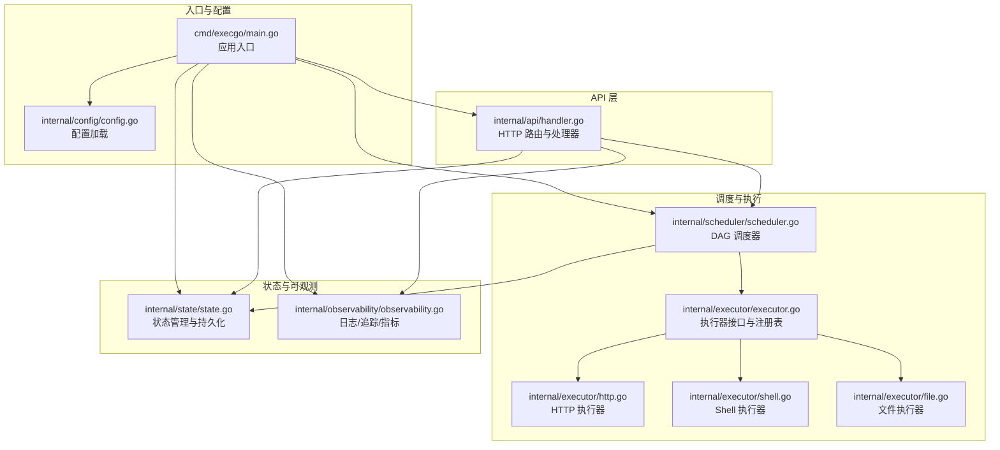
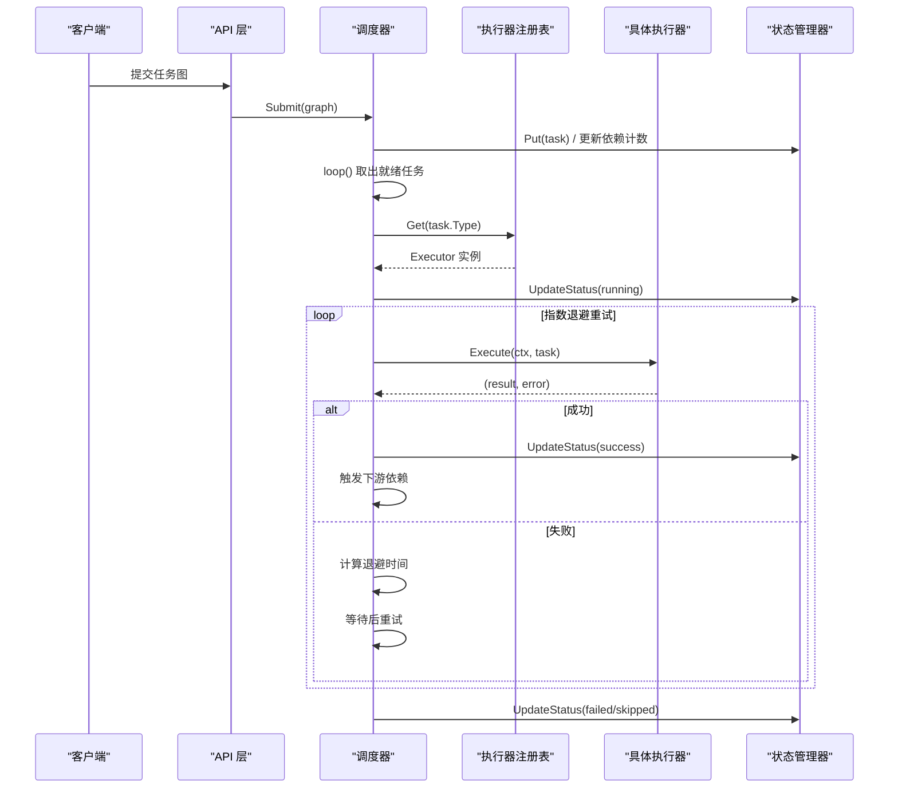
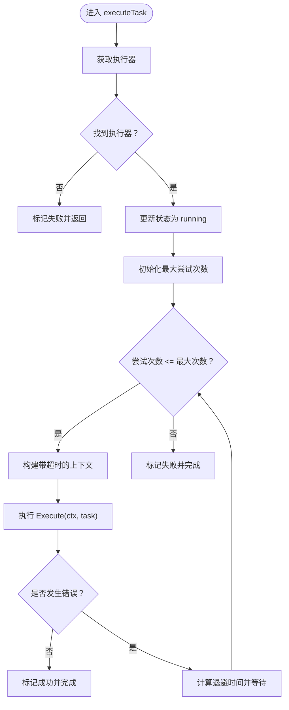
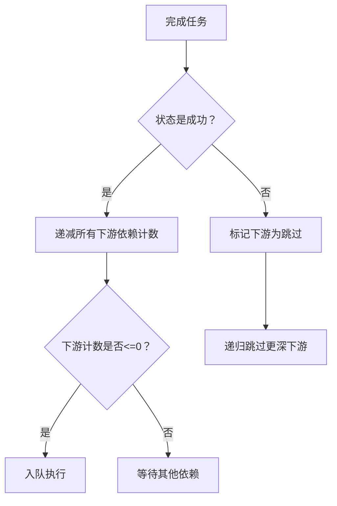
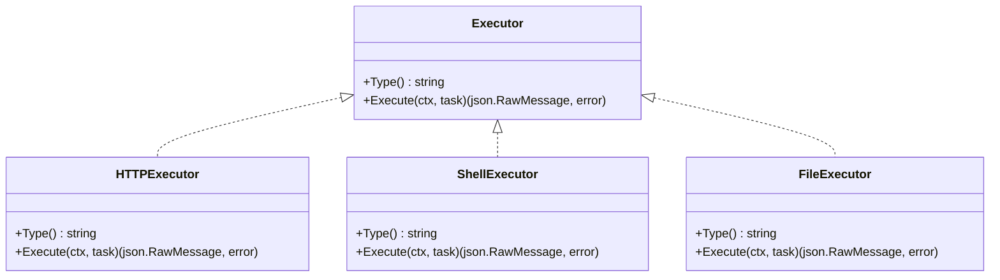
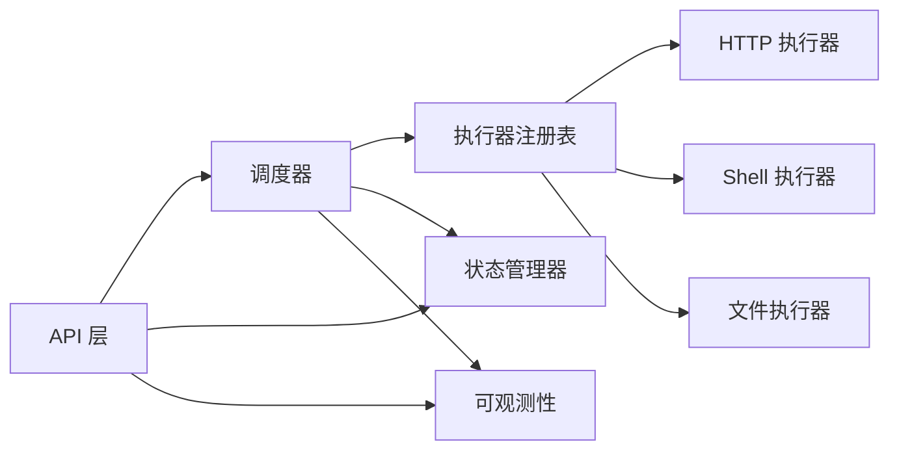

# 错误处理与重试机制

<cite>
**本文档引用的文件**
- [main.go](file://cmd/execgo/main.go)
- [config.go](file://internal/config/config.go)
- [scheduler.go](file://internal/scheduler/scheduler.go)
- [executor.go](file://internal/executor/executor.go)
- [http.go](file://internal/executor/http.go)
- [shell.go](file://internal/executor/shell.go)
- [file.go](file://internal/executor/file.go)
- [state.go](file://internal/state/state.go)
- [observability.go](file://internal/observability/observability.go)
- [handler.go](file://internal/api/handler.go)
- [task.go](file://internal/models/task.go)
- [README.md](file://README.md)
</cite>

## 目录
1. [简介](#简介)
2. [项目结构](#项目结构)
3. [核心组件](#核心组件)
4. [架构总览](#架构总览)
5. [详细组件分析](#详细组件分析)
6. [依赖分析](#依赖分析)
7. [性能考虑](#性能考虑)
8. [故障排查指南](#故障排查指南)
9. [结论](#结论)
10. [附录](#附录)

## 简介
本文件聚焦 ExecGo 的错误处理与重试机制，系统性阐述指数退避重试策略的实现细节（退避计算公式、最大重试次数、超时处理）、错误分类与处理策略（执行器不可用、网络超时、任务失败等）、级联失败传播与下游跳过策略，以及错误监控与告警配置建议。内容以源码为依据，辅以可视化图表帮助读者快速理解。

## 项目结构
ExecGo 采用分层架构：API 层负责请求接入与路由；调度器负责 DAG 任务编排与执行；执行器模块提供可插拔的执行能力；状态管理器负责内存与持久化存储；可观测性模块提供日志、追踪与指标。

**图表来源**
- [main.go:25-104](file://cmd/execgo/main.go#L25-L104)
- [config.go:18-30](file://internal/config/config.go#L18-L30)
- [handler.go:39-52](file://internal/api/handler.go#L39-L52)
- [scheduler.go:34-45](file://internal/scheduler/scheduler.go#L34-L45)
- [executor.go:14-67](file://internal/executor/executor.go#L14-L67)
- [state.go:17-53](file://internal/state/state.go#L17-L53)
- [observability.go:50-63](file://internal/observability/observability.go#L50-L63)

**章节来源**
- [README.md:32-57](file://README.md#L32-L57)
- [main.go:25-104](file://cmd/execgo/main.go#L25-L104)
- [config.go:18-30](file://internal/config/config.go#L18-L30)
- [handler.go:39-52](file://internal/api/handler.go#L39-L52)
- [scheduler.go:34-45](file://internal/scheduler/scheduler.go#L34-L45)
- [executor.go:14-67](file://internal/executor/executor.go#L14-L67)
- [state.go:17-53](file://internal/state/state.go#L17-L53)
- [observability.go:50-63](file://internal/observability/observability.go#L50-L63)

## 核心组件
- 调度器在执行任务时实现指数退避重试与超时控制，并在任务完成后进行级联状态更新与下游触发。
- 执行器模块提供三类内置执行器，均通过返回错误与结果的方式参与统一的错误处理流程。
- 状态管理器负责原子更新任务状态并在崩溃后恢复为“待处理”，确保一致性。
- 可观测性模块提供结构化日志、请求追踪与指标端点，便于监控与故障诊断。

**章节来源**
- [scheduler.go:127-190](file://internal/scheduler/scheduler.go#L127-L190)
- [http.go:27-75](file://internal/executor/http.go#L27-L75)
- [shell.go:36-79](file://internal/executor/shell.go#L36-L79)
- [file.go:25-113](file://internal/executor/file.go#L25-L113)
- [state.go:94-108](file://internal/state/state.go#L94-L108)
- [observability.go:86-133](file://internal/observability/observability.go#L86-L133)

## 架构总览
下图展示错误处理与重试在整体架构中的位置与交互。

**图表来源**
- [handler.go:58-99](file://internal/api/handler.go#L58-L99)
- [scheduler.go:69-97](file://internal/scheduler/scheduler.go#L69-L97)
- [scheduler.go:127-190](file://internal/scheduler/scheduler.go#L127-L190)
- [executor.go:38-48](file://internal/executor/executor.go#L38-L48)
- [state.go:94-108](file://internal/state/state.go#L94-L108)

## 详细组件分析

### 指数退避重试策略
- 重试次数与最大尝试次数
  - 最大尝试次数等于任务重试配置加一；若未设置则至少为一次。
  - 参考路径：[scheduler.go:144-147](file://internal/scheduler/scheduler.go#L144-L147)
- 退避计算公式
  - 指数退避：100ms × 2^(attempt-2)，上限不超过 10 秒。
  - 参考路径：[scheduler.go:154-158](file://internal/scheduler/scheduler.go#L154-L158)
- 超时控制
  - 对每次尝试构建带超时的上下文；若任务未设置超时，则使用取消上下文。
  - 参考路径：[scheduler.go:163-170](file://internal/scheduler/scheduler.go#L163-L170)
- 执行与错误处理
  - 若任一尝试成功则立即结束；否则记录最后一次错误并标记失败。
  - 参考路径：[scheduler.go:152-179](file://internal/scheduler/scheduler.go#L152-L179)

**图表来源**
- [scheduler.go:127-190](file://internal/scheduler/scheduler.go#L127-L190)

**章节来源**
- [scheduler.go:127-190](file://internal/scheduler/scheduler.go#L127-L190)

### 错误分类与处理策略
- 执行器不可用
  - 当任务类型未注册或无法获取执行器时，直接标记失败并记录错误原因。
  - 参考路径：[scheduler.go:132-137](file://internal/scheduler/scheduler.go#L132-L137)
- 网络超时
  - 通过带超时的上下文控制执行器调用；若超时则视为失败并按指数退避重试。
  - 参考路径：[scheduler.go:163-170](file://internal/scheduler/scheduler.go#L163-L170)
- 任务失败
  - 执行器返回错误即视为失败；若达到最大重试次数仍未成功，则标记失败。
  - 参考路径：[scheduler.go:172-179](file://internal/scheduler/scheduler.go#L172-L179)
- HTTP 执行器错误
  - HTTP 请求失败或读取响应体失败会返回错误；状态码 4xx/5xx 仍返回结果但标记错误。
  - 参考路径：[http.go:54-75](file://internal/executor/http.go#L54-L75)
- Shell 执行器错误
  - 命令不在白名单或执行失败会返回错误；退出码与标准输出/错误也会被记录。
  - 参考路径：[shell.go:52-79](file://internal/executor/shell.go#L52-L79)
- 文件执行器错误
  - 路径清理、读写/删除/状态查询失败均返回错误。
  - 参考路径：[file.go:35-113](file://internal/executor/file.go#L35-L113)

**章节来源**
- [scheduler.go:132-137](file://internal/scheduler/scheduler.go#L132-L137)
- [scheduler.go:163-170](file://internal/scheduler/scheduler.go#L163-L170)
- [scheduler.go:172-179](file://internal/scheduler/scheduler.go#L172-L179)
- [http.go:54-75](file://internal/executor/http.go#L54-L75)
- [shell.go:52-79](file://internal/executor/shell.go#L52-L79)
- [file.go:35-113](file://internal/executor/file.go#L35-L113)

### 级联失败处理与下游跳过策略
- 成功完成的任务会递减其下游任务的依赖计数；当计数降至零时，将下游任务重新入队执行。
- 若上游任务失败，则将其下游任务全部标记为“跳过”，并递归跳过更深层的下游节点。
- 参考路径：
  - [scheduler.go:192-222](file://internal/scheduler/scheduler.go#L192-L222)
  - [scheduler.go:224-230](file://internal/scheduler/scheduler.go#L224-L230)

**图表来源**
- [scheduler.go:192-230](file://internal/scheduler/scheduler.go#L192-L230)

**章节来源**
- [scheduler.go:192-230](file://internal/scheduler/scheduler.go#L192-L230)

### 执行器接口与内置执行器
- 执行器接口定义了类型标识与执行方法，所有执行器需实现该接口并通过注册表统一管理。
- 内置执行器包括 HTTP、Shell（白名单）与文件系统操作，均遵循统一的错误返回与结果封装。
- 参考路径：
  - [executor.go:14-20](file://internal/executor/executor.go#L14-L20)
  - [executor.go:38-48](file://internal/executor/executor.go#L38-L48)
  - [executor.go:63-67](file://internal/executor/executor.go#L63-L67)
  - [http.go:27-75](file://internal/executor/http.go#L27-L75)
  - [shell.go:36-79](file://internal/executor/shell.go#L36-L79)
  - [file.go:25-113](file://internal/executor/file.go#L25-L113)

**图表来源**
- [executor.go:14-20](file://internal/executor/executor.go#L14-L20)
- [http.go:23-25](file://internal/executor/http.go#L23-L25)
- [shell.go:32-34](file://internal/executor/shell.go#L32-L34)
- [file.go:21-23](file://internal/executor/file.go#L21-L23)

**章节来源**
- [executor.go:14-20](file://internal/executor/executor.go#L14-L20)
- [executor.go:38-48](file://internal/executor/executor.go#L38-L48)
- [executor.go:63-67](file://internal/executor/executor.go#L63-L67)
- [http.go:27-75](file://internal/executor/http.go#L27-L75)
- [shell.go:36-79](file://internal/executor/shell.go#L36-L79)
- [file.go:25-113](file://internal/executor/file.go#L25-L113)

### 状态管理与持久化
- 状态管理器提供原子更新任务状态的能力，并在崩溃恢复时将“运行中”任务重置为“待处理”，避免悬挂状态。
- 支持周期性持久化与最终持久化，保证数据可靠性。
- 参考路径：
  - [state.go:94-108](file://internal/state/state.go#L94-L108)
  - [state.go:41-50](file://internal/state/state.go#L41-L50)
  - [state.go:160-179](file://internal/state/state.go#L160-L179)

**章节来源**
- [state.go:94-108](file://internal/state/state.go#L94-L108)
- [state.go:41-50](file://internal/state/state.go#L41-L50)
- [state.go:160-179](file://internal/state/state.go#L160-L179)

### 可观测性与监控
- 结构化日志：使用 slog 输出 JSON 格式日志，便于采集与检索。
- 请求追踪：通过中间件注入 traceID，贯穿请求生命周期。
- 指标端点：提供任务总数、运行中、成功、失败及按类型计数的指标快照。
- 参考路径：
  - [observability.go:50-63](file://internal/observability/observability.go#L50-L63)
  - [observability.go:86-133](file://internal/observability/observability.go#L86-L133)
  - [handler.go:137-146](file://internal/api/handler.go#L137-L146)

**章节来源**
- [observability.go:50-63](file://internal/observability/observability.go#L50-L63)
- [observability.go:86-133](file://internal/observability/observability.go#L86-L133)
- [handler.go:137-146](file://internal/api/handler.go#L137-L146)

## 依赖分析
- 调度器依赖执行器注册表与状态管理器；执行器通过注册表被调度器动态选择。
- API 层负责校验任务图合法性与类型可用性，随后提交给调度器。
- 可观测性模块贯穿各层，提供统一的日志、追踪与指标。

**图表来源**
- [handler.go:58-99](file://internal/api/handler.go#L58-L99)
- [scheduler.go:127-190](file://internal/scheduler/scheduler.go#L127-L190)
- [executor.go:38-48](file://internal/executor/executor.go#L38-L48)
- [state.go:94-108](file://internal/state/state.go#L94-L108)
- [observability.go:50-63](file://internal/observability/observability.go#L50-L63)

**章节来源**
- [handler.go:58-99](file://internal/api/handler.go#L58-L99)
- [scheduler.go:127-190](file://internal/scheduler/scheduler.go#L127-L190)
- [executor.go:38-48](file://internal/executor/executor.go#L38-L48)
- [state.go:94-108](file://internal/state/state.go#L94-L108)
- [observability.go:50-63](file://internal/observability/observability.go#L50-L63)

## 性能考虑
- 指数退避上限为 10 秒，避免长时间阻塞；同时通过并发信号量控制最大并发，防止资源耗尽。
- 状态更新与持久化采用原子写与定期持久化策略，兼顾性能与可靠性。
- 可观测性指标使用原子计数器，降低锁竞争开销。

[本节为通用性能讨论，不直接分析具体文件]

## 故障排查指南
- 任务始终失败
  - 检查任务重试配置与超时设置；确认执行器类型是否正确注册。
  - 参考路径：[scheduler.go:144-147](file://internal/scheduler/scheduler.go#L144-L147)、[executor.go:38-48](file://internal/executor/executor.go#L38-L48)
- 级联失败导致大量任务跳过
  - 查看上游任务状态与错误信息；确认依赖链是否存在环或上游失败。
  - 参考路径：[scheduler.go:192-230](file://internal/scheduler/scheduler.go#L192-L230)
- 数据丢失或状态异常
  - 检查状态持久化是否正常；关注崩溃恢复时“运行中”任务被重置为“待处理”的行为。
  - 参考路径：[state.go:41-50](file://internal/state/state.go#L41-L50)、[state.go:160-179](file://internal/state/state.go#L160-L179)
- 监控与告警
  - 通过 /metrics 端点观察任务总数、运行中、成功、失败趋势；结合 traceID 进行问题定位。
  - 参考路径：[handler.go:137-146](file://internal/api/handler.go#L137-L146)、[observability.go:86-133](file://internal/observability/observability.go#L86-L133)

**章节来源**
- [scheduler.go:144-147](file://internal/scheduler/scheduler.go#L144-L147)
- [executor.go:38-48](file://internal/executor/executor.go#L38-L48)
- [scheduler.go:192-230](file://internal/scheduler/scheduler.go#L192-L230)
- [state.go:41-50](file://internal/state/state.go#L41-L50)
- [state.go:160-179](file://internal/state/state.go#L160-L179)
- [handler.go:137-146](file://internal/api/handler.go#L137-L146)
- [observability.go:86-133](file://internal/observability/observability.go#L86-L133)

## 结论
ExecGo 的错误处理与重试机制以指数退避为核心，结合任务超时与最大重试次数，有效提升任务成功率；通过级联失败传播与下游跳过策略，确保 DAG 的健壮性；配合可观测性与状态持久化，实现可诊断、可恢复的执行内核。建议在生产环境中合理配置重试与超时参数，并结合指标与日志建立完善的告警体系。

[本节为总结性内容，不直接分析具体文件]

## 附录
- 配置项参考
  - 监听地址、数据目录、最大并发、优雅关闭超时等配置项可通过命令行标志或环境变量设置。
  - 参考路径：[config.go:18-30](file://internal/config/config.go#L18-L30)
- 任务 DSL 与内置执行器参数
  - 任务字段包含 id、type、params、depends_on、retry、timeout、status 等；内置执行器参数详见 HTTP、Shell、File 执行器实现。
  - 参考路径：[task.go:22-34](file://internal/models/task.go#L22-L34)、[http.go:14-20](file://internal/executor/http.go#L14-L20)、[shell.go:24-29](file://internal/executor/shell.go#L24-L29)、[file.go:13-18](file://internal/executor/file.go#L13-L18)

**章节来源**
- [config.go:18-30](file://internal/config/config.go#L18-L30)
- [task.go:22-34](file://internal/models/task.go#L22-L34)
- [http.go:14-20](file://internal/executor/http.go#L14-L20)
- [shell.go:24-29](file://internal/executor/shell.go#L24-L29)
- [file.go:13-18](file://internal/executor/file.go#L13-L18)