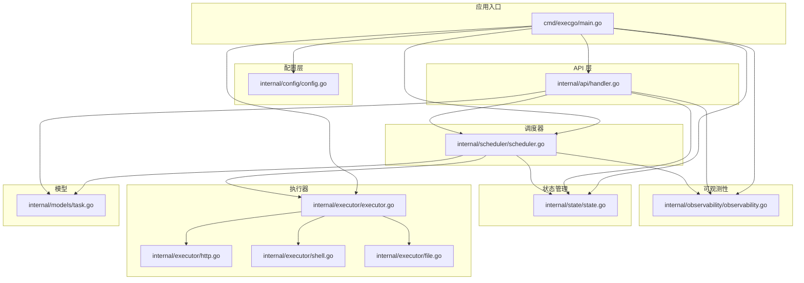
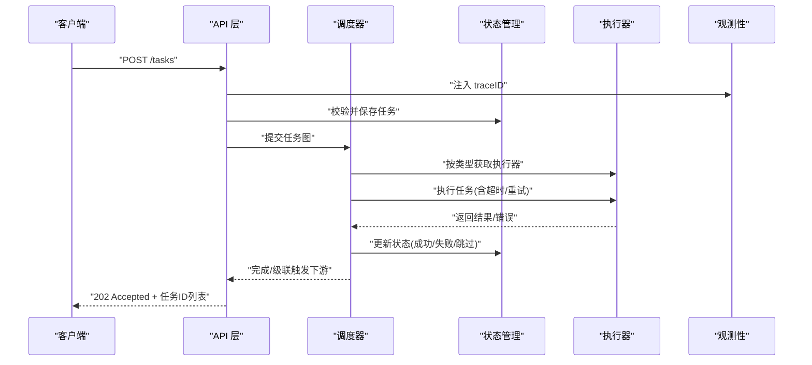
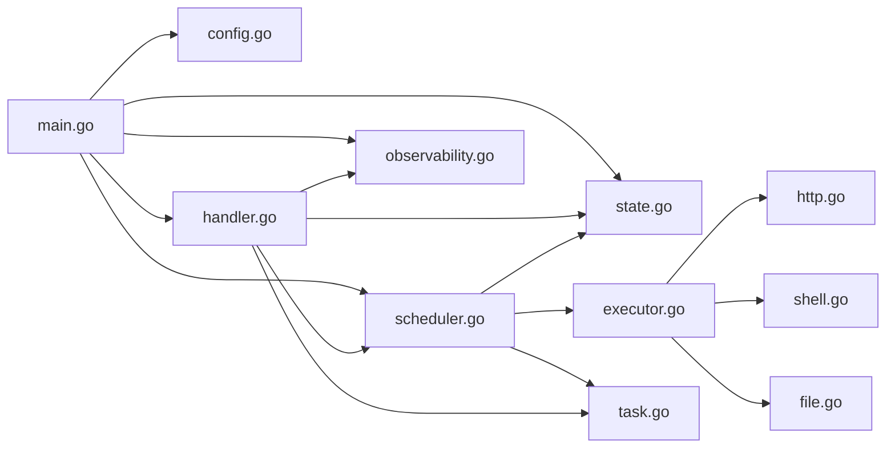

# 构建与部署

<cite>
**本文档引用的文件**
- [README.md](file://README.md)
- [go.mod](file://go.mod)
- [cmd/execgo/main.go](file://cmd/execgo/main.go)
- [internal/config/config.go](file://internal/config/config.go)
- [internal/api/handler.go](file://internal/api/handler.go)
- [internal/scheduler/scheduler.go](file://internal/scheduler/scheduler.go)
- [internal/state/state.go](file://internal/state/state.go)
- [internal/executor/executor.go](file://internal/executor/executor.go)
- [internal/executor/http.go](file://internal/executor/http.go)
- [internal/executor/shell.go](file://internal/executor/shell.go)
- [internal/executor/file.go](file://internal/executor/file.go)
- [internal/observability/observability.go](file://internal/observability/observability.go)
- [internal/models/task.go](file://internal/models/task.go)
</cite>

## 目录
1. [简介](#简介)
2. [项目结构](#项目结构)
3. [核心组件](#核心组件)
4. [架构总览](#架构总览)
5. [详细组件分析](#详细组件分析)
6. [依赖分析](#依赖分析)
7. [性能考虑](#性能考虑)
8. [故障排查指南](#故障排查指南)
9. [结论](#结论)
10. [附录](#附录)

## 简介
本指南面向运维与开发人员，提供 ExecGo 的多平台构建与部署方案，涵盖：
- 多种构建方式：本地编译、交叉编译、容器化构建
- 构建参数与优化选项
- 多种部署方式：二进制部署、Docker 容器部署、Kubernetes 部署
- 部署脚本示例与自动化部署流程
- 配置文件与环境变量管理
- 部署验证与健康检查方法

## 项目结构
ExecGo 采用模块化分层设计，入口程序负责初始化配置、日志、执行器注册、指标、状态管理、调度器与 HTTP 服务，并在收到系统信号时进行优雅关闭。

**图表来源**
- [cmd/execgo/main.go:25-104](file://cmd/execgo/main.go#L25-L104)
- [internal/config/config.go:20-30](file://internal/config/config.go#L20-L30)
- [internal/api/handler.go:29-52](file://internal/api/handler.go#L29-L52)
- [internal/scheduler/scheduler.go:35-45](file://internal/scheduler/scheduler.go#L35-L45)
- [internal/state/state.go:26-53](file://internal/state/state.go#L26-L53)
- [internal/executor/executor.go:32-67](file://internal/executor/executor.go#L32-L67)
- [internal/executor/http.go:27-75](file://internal/executor/http.go#L27-L75)
- [internal/executor/shell.go:36-79](file://internal/executor/shell.go#L36-L79)
- [internal/executor/file.go:25-52](file://internal/executor/file.go#L25-L52)
- [internal/models/task.go:36-79](file://internal/models/task.go#L36-L79)

**章节来源**
- [README.md:149-177](file://README.md#L149-L177)
- [go.mod:1-4](file://go.mod#L1-L4)

## 核心组件
- 配置管理：从命令行标志与环境变量加载配置，支持优先级覆盖。
- 观测性：结构化日志、请求追踪、指标统计。
- API 层：提供任务提交、查询、删除、健康检查、指标端点。
- 调度器：基于 DAG 的并发调度，支持重试与超时。
- 执行器：HTTP、Shell（白名单）、File 三类内置执行器，支持注册扩展。
- 状态管理：内存状态 + JSON 文件定期持久化，崩溃恢复。

**章节来源**
- [internal/config/config.go:10-47](file://internal/config/config.go#L10-L47)
- [internal/observability/observability.go:86-134](file://internal/observability/observability.go#L86-L134)
- [internal/api/handler.go:19-52](file://internal/api/handler.go#L19-L52)
- [internal/scheduler/scheduler.go:18-67](file://internal/scheduler/scheduler.go#L18-L67)
- [internal/state/state.go:17-53](file://internal/state/state.go#L17-L53)
- [internal/executor/executor.go:14-67](file://internal/executor/executor.go#L14-L67)

## 架构总览
下图展示从客户端到执行器的完整调用链路与关键组件交互。

**图表来源**
- [internal/api/handler.go:58-99](file://internal/api/handler.go#L58-L99)
- [internal/scheduler/scheduler.go:127-190](file://internal/scheduler/scheduler.go#L127-L190)
- [internal/state/state.go:94-108](file://internal/state/state.go#L94-L108)
- [internal/executor/executor.go:38-48](file://internal/executor/executor.go#L38-L48)
- [internal/observability/observability.go:69-80](file://internal/observability/observability.go#L69-L80)

## 详细组件分析

### 构建与打包

- 本地编译
  - 使用标准 Go 构建工具，输出可执行文件。
  - 支持通过命令行标志与环境变量定制运行参数。
  - 参考路径：[README 快速开始:63-77](file://README.md#L63-L77)

- 交叉编译
  - 通过设置 GOOS 与 GOARCH 环境变量进行跨平台构建。
  - 示例命令（Linux/amd64）：GOOS=linux GOARCH=amd64 go build -o execgo-linux-amd64 ./cmd/execgo
  - 参考路径：[go.mod Go 版本:3-3](file://go.mod#L3-L3)

- 容器化构建
  - 使用多阶段 Dockerfile，先在构建阶段编译，再将产物复制到精简镜像中。
  - 构建参数建议：
    - 构建阶段：设置 CGO_ENABLED=0、GOFLAGS="-ldflags=-s -w" 以减小体积
    - 运行阶段：使用非 root 用户与只读根文件系统
  - 参考路径：[cmd/execgo/main.go 入口:25-104](file://cmd/execgo/main.go#L25-L104)

- 构建参数与优化
  - 常用 ldflags：-s -w（去除符号与调试信息）
  - CGO_ENABLED=0（禁用 CGO，减少依赖）
  - 参考路径：[go.mod Go 版本:3-3](file://go.mod#L3-L3)

**章节来源**
- [README.md:63-77](file://README.md#L63-L77)
- [go.mod:3-3](file://go.mod#L3-L3)

### 部署方式

- 二进制文件部署
  - 在目标主机上放置可执行文件与数据目录（默认 data/），通过命令行参数或环境变量配置。
  - 建议使用 systemd 或类似进程管理器守护进程。
  - 参考路径：[internal/config/config.go 配置项:11-16](file://internal/config/config.go#L11-L16)

- Docker 容器部署
  - 使用官方镜像或自建镜像，挂载数据卷至数据目录。
  - 建议：
    - 设置资源限制（CPU/内存）
    - 使用只读根文件系统与 drop capabilities
    - 通过环境变量配置监听地址、并发数等
  - 参考路径：[cmd/execgo/main.go HTTP 服务:64-70](file://cmd/execgo/main.go#L64-L70)

- Kubernetes 部署
  - 使用 Deployment + Service，暴露 8080 端口。
  - 建议：
    - 使用 ReadinessProbe/ LivenessProbe 指向 /health
    - 挂载持久化卷到数据目录
    - 设置资源请求与限制
  - 参考路径：[internal/api/handler.go 健康检查:128-135](file://internal/api/handler.go#L128-L135)

**章节来源**
- [internal/config/config.go:11-16](file://internal/config/config.go#L11-L16)
- [cmd/execgo/main.go:64-70](file://cmd/execgo/main.go#L64-L70)
- [internal/api/handler.go:128-135](file://internal/api/handler.go#L128-L135)

### 配置文件与环境变量

- 配置项与优先级
  - 命令行标志优先于环境变量，环境变量优先于默认值。
  - 参考路径：[internal/config/config.go 加载逻辑:18-30](file://internal/config/config.go#L18-L30)

- 关键配置
  - 监听地址：-addr 或 EXECGO_ADDR，默认 :8080
  - 数据目录：-data-dir 或 EXECGO_DATA_DIR，默认 data
  - 最大并发：-max-concurrency 或 EXECGO_MAX_CONCURRENCY，默认 10
  - 关闭超时：-shutdown-timeout 或 EXECGO_SHUTDOWN_TIMEOUT，默认 15 秒
  - 参考路径：[README 配置表格:216-226](file://README.md#L216-L226)

- 环境变量示例
  - EXECGO_ADDR=:9090 EXECGO_MAX_CONCURRENCY=20 ./execgo
  - 参考路径：[README 环境变量示例:75-77](file://README.md#L75-L77)

**章节来源**
- [internal/config/config.go:18-30](file://internal/config/config.go#L18-L30)
- [README.md:216-226](file://README.md#L216-L226)
- [README.md:75-77](file://README.md#L75-L77)

### 部署验证与健康检查

- 健康检查
  - GET /health 返回状态、版本与运行时长
  - 参考路径：[internal/api/handler.go 健康检查:128-135](file://internal/api/handler.go#L128-L135)

- 指标端点
  - GET /metrics 返回任务总数、运行中、成功、失败及按类型统计
  - 参考路径：[internal/api/handler.go 指标端点:137-146](file://internal/api/handler.go#L137-L146)

- 任务生命周期验证
  - 提交任务 → 查询状态 → 成功/失败/跳过 → 删除任务
  - 参考路径：[README 提交与查询示例:79-145](file://README.md#L79-L145)

**章节来源**
- [internal/api/handler.go:128-146](file://internal/api/handler.go#L128-L146)
- [README.md:79-145](file://README.md#L79-L145)

### 自动化部署流程（示例）

- GitOps 流程（Kubernetes）
  - 提交代码 → 触发 CI 构建 → 生成镜像 → 推送镜像仓库 → Argo/Kustomize 应用清单 → 滚动更新
  - 建议：
    - 使用 Helm Chart 或 Kustomize 管理多环境
    - 配置蓝绿/金丝雀发布策略
    - 使用 HPA 根据 CPU/内存或自定义指标自动扩缩容

- 蓝绿部署（二进制）
  - 预热新版本实例 → 健康检查通过 → 切换流量 → 停止旧实例
  - 建议：
    - 使用负载均衡器健康检查
    - 事务性切换，失败回滚

- Docker Compose（单机）
  - docker-compose up -d → docker-compose logs -f → curl http://localhost:8080/health
  - 建议：
    - 挂载数据卷持久化
    - 设置 restart policy

**章节来源**
- [internal/api/handler.go:128-135](file://internal/api/handler.go#L128-L135)

## 依赖分析

**图表来源**
- [cmd/execgo/main.go:17-23](file://cmd/execgo/main.go#L17-L23)
- [internal/api/handler.go:5-17](file://internal/api/handler.go#L5-L17)
- [internal/scheduler/scheduler.go:5-16](file://internal/scheduler/scheduler.go#L5-L16)
- [internal/state/state.go:5-15](file://internal/state/state.go#L5-L15)
- [internal/executor/executor.go:5-12](file://internal/executor/executor.go#L5-L12)
- [internal/executor/http.go:3-12](file://internal/executor/http.go#L3-L12)
- [internal/executor/shell.go:3-12](file://internal/executor/shell.go#L3-L12)
- [internal/executor/file.go:3-11](file://internal/executor/file.go#L3-L11)
- [internal/models/task.go:4-8](file://internal/models/task.go#L4-L8)

**章节来源**
- [cmd/execgo/main.go:17-23](file://cmd/execgo/main.go#L17-L23)
- [internal/api/handler.go:5-17](file://internal/api/handler.go#L5-L17)
- [internal/scheduler/scheduler.go:5-16](file://internal/scheduler/scheduler.go#L5-L16)
- [internal/state/state.go:5-15](file://internal/state/state.go#L5-L15)
- [internal/executor/executor.go:5-12](file://internal/executor/executor.go#L5-L12)
- [internal/executor/http.go:3-12](file://internal/executor/http.go#L3-L12)
- [internal/executor/shell.go:3-12](file://internal/executor/shell.go#L3-L12)
- [internal/executor/file.go:3-11](file://internal/executor/file.go#L3-L11)
- [internal/models/task.go:4-8](file://internal/models/task.go#L4-L8)

## 性能考虑
- 并发控制
  - 调度器使用信号量控制最大并发，避免资源争用。
  - 参考路径：[internal/scheduler/scheduler.go 并发信号量:40-41](file://internal/scheduler/scheduler.go#L40-L41)

- 超时与重试
  - 任务执行支持超时与指数退避重试，提升鲁棒性。
  - 参考路径：[internal/scheduler/scheduler.go 超时与重试:163-179](file://internal/scheduler/scheduler.go#L163-L179)

- 指标与可观测性
  - 提供任务总量、运行中、成功、失败与按类型统计，便于性能监控。
  - 参考路径：[internal/observability/observability.go 指标:86-134](file://internal/observability/observability.go#L86-L134)

- 状态持久化
  - 定期持久化与崩溃恢复，降低重启成本。
  - 参考路径：[internal/state/state.go 定期持久化:160-179](file://internal/state/state.go#L160-L179)

**章节来源**
- [internal/scheduler/scheduler.go:40-41](file://internal/scheduler/scheduler.go#L40-L41)
- [internal/scheduler/scheduler.go:163-179](file://internal/scheduler/scheduler.go#L163-L179)
- [internal/observability/observability.go:86-134](file://internal/observability/observability.go#L86-L134)
- [internal/state/state.go:160-179](file://internal/state/state.go#L160-L179)

## 故障排查指南
- 常见问题
  - 无法访问 /health：检查监听地址与防火墙；确认容器/节点端口映射正确。
  - 任务一直 pending：检查依赖是否存在、是否形成环；查看 DAG 校验错误。
  - 执行器未知：确认执行器类型拼写正确，或已注册自定义执行器。
  - 并发过高导致资源紧张：降低 -max-concurrency 或增加节点资源。

- 排查步骤
  - 查看日志：结构化 JSON 日志包含 trace_id，便于关联请求链路。
  - 抓取指标：GET /metrics 分析任务分布与失败率。
  - 校验配置：对比命令行参数与环境变量，确认优先级生效。
  - 参考路径：[internal/observability/observability.go 日志与追踪:50-63](file://internal/observability/observability.go#L50-L63)

**章节来源**
- [internal/observability/observability.go:50-63](file://internal/observability/observability.go#L50-L63)

## 结论
ExecGo 以零依赖、分层清晰、可观测性强为特点，适合在单节点场景下作为 AI Agent 的执行内核。通过合理的构建与部署策略、完善的配置与监控体系，可在生产环境中稳定运行并快速迭代。

## 附录

### API 定义概览
- POST /tasks：提交任务图，返回 202 与任务 ID 列表
- GET /tasks/{id}：查询单个任务
- GET /tasks：列出所有任务
- DELETE /tasks/{id}：删除任务
- GET /health：健康检查
- GET /metrics：指标端点

**章节来源**
- [internal/api/handler.go:40-52](file://internal/api/handler.go#L40-L52)

### 任务 DSL 与内置执行器参数
- 任务字段：id、type、params、depends_on、retry、timeout、status
- 内置执行器：
  - HTTP：url、method、headers、body
  - Shell：command（白名单）、args、dir
  - File：action（read/write/append/delete/stat）、path、content

**章节来源**
- [internal/models/task.go:21-34](file://internal/models/task.go#L21-L34)
- [internal/executor/http.go:14-20](file://internal/executor/http.go#L14-L20)
- [internal/executor/shell.go:24-29](file://internal/executor/shell.go#L24-L29)
- [internal/executor/file.go:13-18](file://internal/executor/file.go#L13-L18)
- [README.md:181-213](file://README.md#L181-L213)