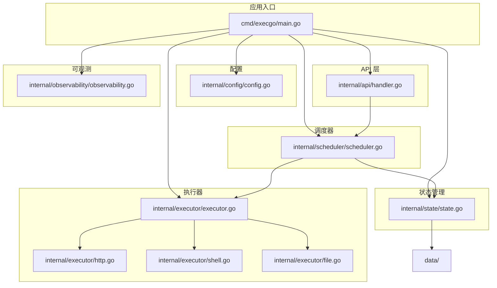
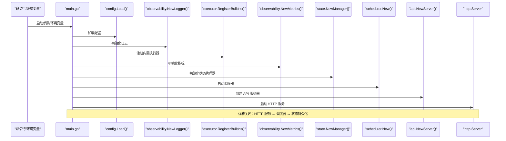
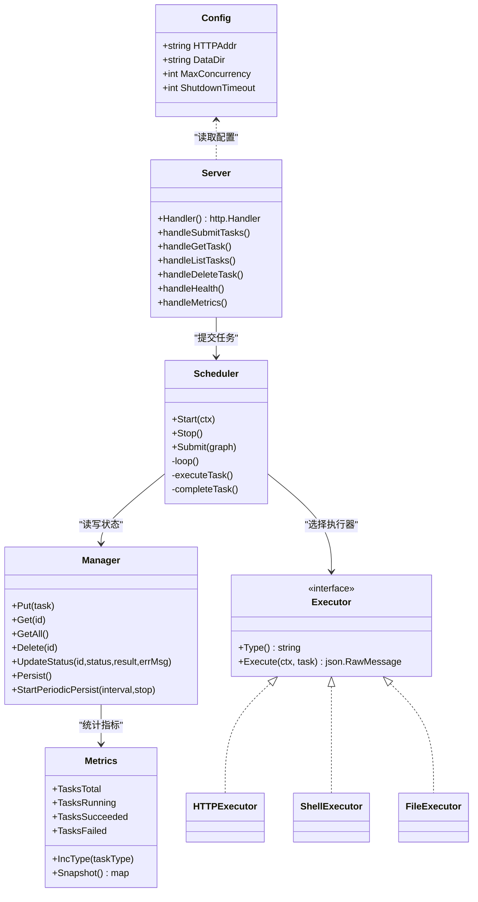

# 环境准备

<cite>
**本文引用的文件列表**
- [README.md](file://README.md)
- [go.mod](file://go.mod)
- [cmd/execgo/main.go](file://cmd/execgo/main.go)
- [internal/config/config.go](file://internal/config/config.go)
- [internal/api/handler.go](file://internal/api/handler.go)
- [internal/scheduler/scheduler.go](file://internal/scheduler/scheduler.go)
- [internal/state/state.go](file://internal/state/state.go)
- [internal/executor/executor.go](file://internal/executor/executor.go)
- [internal/executor/http.go](file://internal/executor/http.go)
- [internal/executor/shell.go](file://internal/executor/shell.go)
- [internal/executor/file.go](file://internal/executor/file.go)
- [internal/observability/observability.go](file://internal/observability/observability.go)
</cite>

## 目录
1. [简介](#简介)
2. [项目结构](#项目结构)
3. [核心组件](#核心组件)
4. [架构总览](#架构总览)
5. [详细组件分析](#详细组件分析)
6. [依赖关系分析](#依赖关系分析)
7. [性能考虑](#性能考虑)
8. [故障排查指南](#故障排查指南)
9. [结论](#结论)
10. [附录](#附录)

## 简介
本指南面向在不同操作系统上部署与运行 ExecGo 的用户，提供从 Go 版本要求、系统兼容性、硬件资源到安装步骤、系统依赖与网络配置的完整说明，并给出开发与生产环境差异对比、环境验证方法以及常见问题排查方案。ExecGo 是一个零第三方依赖的极简 AI 执行引擎，通过 HTTP API 暴露任务提交与管理能力，内部采用纯 Go 标准库实现并发调度、可观测与状态持久化。

## 项目结构
ExecGo 采用模块化分层设计，主要目录与职责如下：
- cmd/execgo：应用入口，负责初始化配置、日志、执行器注册、状态管理、调度器与 HTTP 服务启动及优雅关闭。
- internal/api：HTTP API 层，提供任务提交、查询、删除、健康检查与指标端点。
- internal/config：配置加载与优先级处理（命令行标志 > 环境变量 > 默认值）。
- internal/scheduler：基于 DAG 的任务调度器，支持并发控制、超时与指数退避重试。
- internal/state：任务状态的内存存储与 JSON 文件持久化。
- internal/executor：执行器接口与注册表，内置 HTTP、Shell、File 执行器。
- internal/observability：结构化日志、请求追踪与指标收集。
- data：默认数据目录，用于持久化状态文件。

图表来源
- [cmd/execgo/main.go:25-104](file://cmd/execgo/main.go#L25-L104)
- [internal/config/config.go:20-30](file://internal/config/config.go#L20-L30)
- [internal/api/handler.go:39-52](file://internal/api/handler.go#L39-L52)
- [internal/scheduler/scheduler.go:34-67](file://internal/scheduler/scheduler.go#L34-L67)
- [internal/state/state.go:25-53](file://internal/state/state.go#L25-L53)
- [internal/executor/executor.go:31-67](file://internal/executor/executor.go#L31-L67)
- [internal/executor/http.go:27-75](file://internal/executor/http.go#L27-L75)
- [internal/executor/shell.go:36-79](file://internal/executor/shell.go#L36-L79)
- [internal/executor/file.go:25-113](file://internal/executor/file.go#L25-L113)
- [internal/observability/observability.go:50-63](file://internal/observability/observability.go#L50-L63)

章节来源
- [README.md:149-177](file://README.md#L149-L177)
- [cmd/execgo/main.go:25-104](file://cmd/execgo/main.go#L25-L104)

## 核心组件
- 配置管理：支持命令行标志与环境变量，优先级为“标志 > 环境变量 > 默认值”，涵盖监听地址、数据目录、最大并发与优雅关闭超时。
- API 层：提供任务提交、查询、删除、健康检查与指标端点；统一结构化日志与请求追踪。
- 调度器：基于 DAG 的并发调度，支持超时、重试（指数退避）、依赖完成后的级联触发。
- 执行器：注册表模式，内置 HTTP、Shell、File 执行器；Shell 执行器具备命令白名单。
- 状态管理：内存存储 + JSON 文件定期持久化，崩溃后恢复时将运行中任务重置为待处理。
- 可观测：结构化 JSON 日志、traceID 追踪、/metrics 指标端点。

章节来源
- [internal/config/config.go:18-30](file://internal/config/config.go#L18-L30)
- [internal/api/handler.go:58-99](file://internal/api/handler.go#L58-L99)
- [internal/scheduler/scheduler.go:69-97](file://internal/scheduler/scheduler.go#L69-L97)
- [internal/executor/executor.go:31-67](file://internal/executor/executor.go#L31-L67)
- [internal/state/state.go:110-134](file://internal/state/state.go#L110-L134)
- [internal/observability/observability.go:50-63](file://internal/observability/observability.go#L50-L63)

## 架构总览
ExecGo 的运行时架构围绕“配置 → 日志 → 执行器注册 → 状态管理 → 调度器 → API → HTTP 服务”的链路展开，同时在优雅关闭阶段按序停止 HTTP 服务、调度器与持久化。

图表来源
- [cmd/execgo/main.go:25-104](file://cmd/execgo/main.go#L25-L104)
- [internal/config/config.go:20-30](file://internal/config/config.go#L20-L30)
- [internal/executor/executor.go:63-67](file://internal/executor/executor.go#L63-L67)
- [internal/state/state.go:25-53](file://internal/state/state.go#L25-L53)
- [internal/scheduler/scheduler.go:34-67](file://internal/scheduler/scheduler.go#L34-L67)
- [internal/api/handler.go:28-37](file://internal/api/handler.go#L28-L37)

## 详细组件分析

### Go 版本要求与模块约束
- 模块声明的最低 Go 版本为 1.24.5，建议在该版本及以上进行构建与运行，以确保标准库功能与行为一致。
- README 中也展示了 Go 版本徽章与构建示例，进一步印证版本要求。

章节来源
- [go.mod:3](file://go.mod#L3)
- [README.md:5](file://README.md#L5)
- [README.md:65-77](file://README.md#L65-L77)

### 操作系统兼容性
- 代码使用纯 Go 标准库，理论上可在任意支持 Go 1.24.5+ 的平台运行（Linux、macOS、Windows）。
- Shell 执行器对命令进行了白名单限制，并对路径进行清理以防止目录穿越，这在多平台路径分隔符与命令可用性方面有差异，需结合平台实际命令集与权限策略评估。

章节来源
- [internal/executor/shell.go:14-22](file://internal/executor/shell.go#L14-L22)
- [internal/executor/shell.go:46-50](file://internal/executor/shell.go#L46-L50)
- [internal/executor/file.go:35-36](file://internal/executor/file.go#L35-L36)

### 硬件资源要求
- CPU：调度器基于 goroutine + 信号量并发模型，CPU 核心越多，吞吐越高；可根据业务负载调整最大并发参数。
- 内存：状态管理器使用内存映射存储任务，任务数量与大小决定内存占用；定期持久化会触发 JSON 序列化与磁盘写入。
- 磁盘：默认数据目录为 data/，包含 state.json；建议预留足够空间以避免持久化失败。
- 网络：HTTP API 监听地址可配置；HTTP 执行器需要访问外部网络；Shell 执行器可能调用系统命令与网络工具。

章节来源
- [internal/scheduler/scheduler.go:40-44](file://internal/scheduler/scheduler.go#L40-L44)
- [internal/state/state.go:31-35](file://internal/state/state.go#L31-L35)
- [internal/api/handler.go:43-48](file://internal/api/handler.go#L43-L48)
- [internal/executor/http.go:54-58](file://internal/executor/http.go#L54-L58)

### 不同操作系统的安装步骤
以下步骤基于仓库提供的构建与运行方式，适用于 Linux、macOS 与 Windows（WSL2 或原生环境）：
- 准备 Go 环境：安装 Go 1.24.5+。
- 获取源码：克隆仓库至本地。
- 构建二进制：在根目录执行构建命令，输出可执行文件。
- 运行服务：直接运行二进制，默认监听 8080 端口；可通过命令行标志或环境变量自定义监听地址、并发与数据目录等。
- 验证服务：使用健康检查端点确认服务正常。

章节来源
- [README.md:65-77](file://README.md#L65-L77)
- [README.md:140-145](file://README.md#L140-L145)

### 必要系统依赖与网络配置
- 系统依赖：纯 Go 标准库，无需额外系统依赖；Shell 执行器依赖系统命令（白名单内），需确保命令在 PATH 中可用。
- 网络配置：HTTP 监听地址可自定义；若需对外暴露，需开放相应端口；HTTP 执行器会发起外部请求，需确保网络可达与代理设置正确。
- 权限与隔离：Shell 执行器对命令进行白名单限制，但仍建议在受控环境中运行，避免执行高风险命令。

章节来源
- [internal/executor/shell.go:14-22](file://internal/executor/shell.go#L14-L22)
- [internal/executor/http.go:54-58](file://internal/executor/http.go#L54-L58)
- [internal/config/config.go:23-26](file://internal/config/config.go#L23-L26)

### 开发环境与生产环境差异对比
- 监听地址：开发环境可使用本地回环地址与随机端口；生产环境建议绑定到内网或公网 IP，并启用防火墙策略。
- 并发与资源：生产环境根据负载调整最大并发；监控内存与磁盘使用，合理设置持久化间隔。
- 日志与指标：生产环境建议集中化日志与指标采集；开启更细粒度的可观测性。
- 优雅关闭：生产环境需保证优雅关闭流程完整，避免任务中断与数据丢失。
- 数据目录：生产环境建议将数据目录置于独立挂载卷，确保持久化可靠性。

章节来源
- [internal/config/config.go:23-26](file://internal/config/config.go#L23-L26)
- [internal/state/state.go:160-179](file://internal/state/state.go#L160-L179)
- [cmd/execgo/main.go:87-103](file://cmd/execgo/main.go#L87-L103)

### 环境验证方法
- 健康检查：访问健康端点，确认返回状态为健康与版本信息。
- 指标查询：访问指标端点，确认任务总数、运行中、成功与失败计数。
- 任务提交：提交一个简单任务（如 shell echo），查询任务状态确认执行成功。
- 日志观察：查看结构化日志输出，确认 traceID 与关键事件记录。

章节来源
- [README.md:140-145](file://README.md#L140-L145)
- [internal/api/handler.go:128-135](file://internal/api/handler.go#L128-L135)
- [internal/api/handler.go:137-146](file://internal/api/handler.go#L137-L146)
- [internal/observability/observability.go:50-63](file://internal/observability/observability.go#L50-L63)

## 依赖关系分析
ExecGo 的核心依赖关系如下：
- main.go 依赖配置、日志、执行器注册、状态管理、调度器与 API。
- API 层依赖调度器与状态管理；调度器依赖执行器与状态管理。
- 执行器注册表集中管理内置执行器类型。
- 状态管理器负责任务持久化与恢复。
- 可观测模块提供日志、追踪与指标。

图表来源
- [internal/config/config.go:11-16](file://internal/config/config.go#L11-L16)
- [internal/api/handler.go:20-26](file://internal/api/handler.go#L20-L26)
- [internal/scheduler/scheduler.go:18-32](file://internal/scheduler/scheduler.go#L18-L32)
- [internal/state/state.go:17-23](file://internal/state/state.go#L17-L23)
- [internal/executor/executor.go:14-20](file://internal/executor/executor.go#L14-L20)
- [internal/executor/http.go:22-23](file://internal/executor/http.go#L22-L23)
- [internal/executor/shell.go:32-34](file://internal/executor/shell.go#L32-L34)
- [internal/executor/file.go:20-21](file://internal/executor/file.go#L20-L21)
- [internal/observability/observability.go:87-95](file://internal/observability/observability.go#L87-L95)

## 性能考虑
- 并发控制：通过信号量限制最大并发，避免资源争用；根据 CPU 与 I/O 特性调整并发上限。
- 调度策略：DAG 无依赖任务进入就绪队列，goroutine 并发执行；指数退避重试降低抖动。
- 持久化策略：定期持久化与最终持久化保障崩溃恢复；注意磁盘写入开销。
- 指标监控：利用 /metrics 端点观察任务吞吐与失败率，指导容量规划。

章节来源
- [internal/scheduler/scheduler.go:40-44](file://internal/scheduler/scheduler.go#L40-L44)
- [internal/scheduler/scheduler.go:110-125](file://internal/scheduler/scheduler.go#L110-L125)
- [internal/state/state.go:160-179](file://internal/state/state.go#L160-L179)
- [internal/api/handler.go:137-146](file://internal/api/handler.go#L137-L146)

## 故障排查指南
- 构建失败（Go 版本过低）
  - 现象：构建报错提示不兼容的 Go 版本。
  - 处理：升级到 Go 1.24.5+。
  - 参考：模块声明与 README 示例。
- 端口占用
  - 现象：启动 HTTP 服务失败，提示端口被占用。
  - 处理：修改监听地址或释放端口。
  - 参考：配置加载与 HTTP 服务器初始化。
- 任务提交失败（无效 JSON 或校验错误）
  - 现象：提交任务返回 400，提示 JSON 无效或任务图校验失败。
  - 处理：检查任务 DSL 结构与依赖关系，确保无环与依赖存在。
  - 参考：API 处理器与任务图校验。
- 未知任务类型
  - 现象：提交任务返回未知类型，提示可用执行器列表。
  - 处理：确认任务类型与已注册执行器一致。
  - 参考：执行器注册与 API 校验。
- Shell 命令不在白名单
  - 现象：执行 shell 任务失败，提示命令不在白名单。
  - 处理：使用白名单内命令或在受控环境下扩展白名单（谨慎）。
  - 参考：Shell 执行器白名单与参数解析。
- HTTP 请求失败
  - 现象：执行 http 任务失败或返回错误状态码。
  - 处理：检查目标 URL、网络连通性与超时设置。
  - 参考：HTTP 执行器请求与响应处理。
- 状态持久化失败
  - 现象：崩溃恢复或定期持久化报错。
  - 处理：检查数据目录权限与磁盘空间。
  - 参考：状态管理器持久化与恢复逻辑。
- 优雅关闭异常
  - 现象：服务关闭过程中出现错误或未完全停止。
  - 处理：确认关闭顺序与超时设置，确保资源释放。
  - 参考：main.go 中的优雅关闭流程。

章节来源
- [go.mod:3](file://go.mod#L3)
- [README.md:65-77](file://README.md#L65-L77)
- [internal/config/config.go:23-26](file://internal/config/config.go#L23-L26)
- [cmd/execgo/main.go:64-70](file://cmd/execgo/main.go#L64-L70)
- [internal/api/handler.go:63-74](file://internal/api/handler.go#L63-L74)
- [internal/api/handler.go:76-85](file://internal/api/handler.go#L76-L85)
- [internal/executor/shell.go:52-54](file://internal/executor/shell.go#L52-L54)
- [internal/executor/http.go:54-58](file://internal/executor/http.go#L54-L58)
- [internal/state/state.go:110-134](file://internal/state/state.go#L110-L134)
- [cmd/execgo/main.go:87-103](file://cmd/execgo/main.go#L87-L103)

## 结论
ExecGo 以纯 Go 标准库实现，具备良好的跨平台兼容性与零依赖特性。遵循 Go 1.24.5+ 的版本要求，结合合理的并发与持久化策略，可在开发与生产环境中稳定运行。通过健康检查、指标查询与日志追踪，可快速验证与定位问题。建议在生产环境强化网络与权限控制，并根据负载动态调整并发与持久化策略。

## 附录
- 快速开始与配置参考：见 README 的构建与运行、配置表格与示例。
- 任务 DSL 与内置执行器参数：见 README 的 Task DSL 规范与内置执行器参数说明。

章节来源
- [README.md:61-77](file://README.md#L61-L77)
- [README.md:216-226](file://README.md#L216-L226)
- [README.md:181-213](file://README.md#L181-L213)