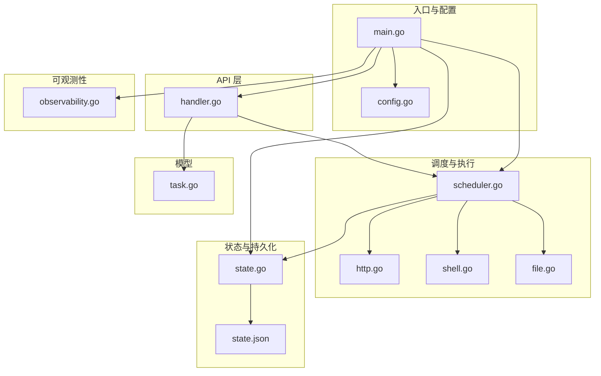
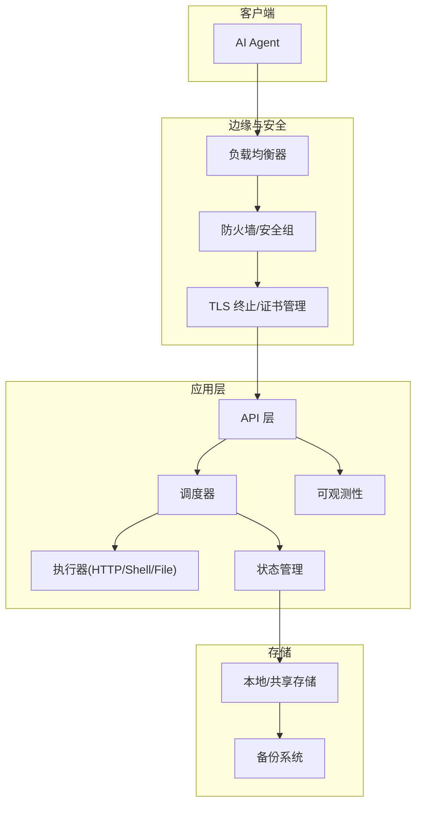
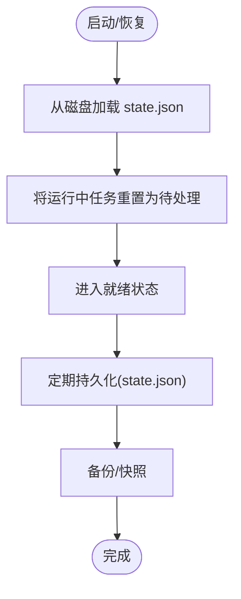
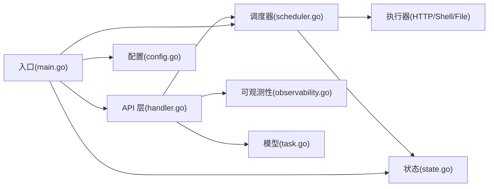

# 生产环境加固

<cite>
**本文档引用的文件**
- [main.go](file://cmd/execgo/main.go)
- [config.go](file://internal/config/config.go)
- [handler.go](file://internal/api/handler.go)
- [state.go](file://internal/state/state.go)
- [scheduler.go](file://internal/scheduler/scheduler.go)
- [observability.go](file://internal/observability/observability.go)
- [task.go](file://internal/models/task.go)
- [http.go](file://internal/executor/http.go)
- [shell.go](file://internal/executor/shell.go)
- [file.go](file://internal/executor/file.go)
- [state.json](file://data/state.json)
- [README.md](file://README.md)
- [go.mod](file://go.mod)
</cite>

## 目录
1. [简介](#简介)
2. [项目结构](#项目结构)
3. [核心组件](#核心组件)
4. [架构总览](#架构总览)
5. [详细组件分析](#详细组件分析)
6. [依赖关系分析](#依赖关系分析)
7. [性能考量](#性能考量)
8. [故障排查指南](#故障排查指南)
9. [结论](#结论)
10. [附录](#附录)

## 简介
本指南面向在生产环境中部署 ExecGo 的工程团队，提供系统化的安全加固与运维最佳实践。内容涵盖访问控制、TLS 加密、认证与授权、资源限制与进程管理、网络安全与防火墙、数据备份与恢复、高可用与负载均衡、以及灾难恢复与故障切换等关键主题。文档同时结合代码实现，给出可落地的配置建议与风险控制措施。

## 项目结构
ExecGo 采用纯 Go 标准库实现，零第三方依赖，具备极简、可观察、可扩展与韧性设计原则。核心模块包括：
- 入口与生命周期管理：cmd/execgo/main.go
- 配置管理：internal/config/config.go
- API 层：internal/api/handler.go
- 调度器：internal/scheduler/scheduler.go
- 执行器：HTTP/Shell/File 执行器
- 状态管理与持久化：internal/state/state.go
- 可观测性：internal/observability/observability.go
- 数据模型：internal/models/task.go
- 示例状态数据：data/state.json

图表来源
- [main.go:25-104](file://cmd/execgo/main.go#L25-L104)
- [config.go:20-47](file://internal/config/config.go#L20-L47)
- [handler.go:39-52](file://internal/api/handler.go#L39-L52)
- [scheduler.go:34-67](file://internal/scheduler/scheduler.go#L34-L67)
- [state.go:25-53](file://internal/state/state.go#L25-L53)
- [observability.go:50-80](file://internal/observability/observability.go#L50-L80)
- [task.go:21-39](file://internal/models/task.go#L21-L39)

章节来源
- [README.md:149-177](file://README.md#L149-L177)
- [go.mod:1-4](file://go.mod#L1-L4)

## 核心组件
- 配置系统：支持命令行标志与环境变量，优先级为 flag > env > default，便于容器化与云原生部署。
- API 层：提供任务提交、查询、删除、健康检查与指标端点，并集成请求追踪中间件。
- 调度器：基于 DAG 的并发调度，支持重试与超时，具备优雅关闭与级联失败处理。
- 执行器：HTTP/Shell/File 三类内置执行器，Shell 执行器采用白名单机制提升安全性。
- 状态管理：内存状态 + JSON 文件定期持久化，崩溃后自动恢复并将运行中任务重置为待处理。
- 可观测性：结构化 JSON 日志、请求追踪 ID、指标收集与导出端点。

章节来源
- [config.go:18-47](file://internal/config/config.go#L18-L47)
- [handler.go:39-52](file://internal/api/handler.go#L39-L52)
- [scheduler.go:18-67](file://internal/scheduler/scheduler.go#L18-L67)
- [executor.go:14-68](file://internal/executor/executor.go#L14-L68)
- [state.go:17-53](file://internal/state/state.go#L17-L53)
- [observability.go:50-134](file://internal/observability/observability.go#L50-L134)

## 架构总览
ExecGo 的生产部署建议采用“单节点 + 外部负载均衡 + 多副本”的组合方式，结合网络隔离与访问控制，确保高可用与安全。

图表来源
- [main.go:64-70](file://cmd/execgo/main.go#L64-L70)
- [handler.go:39-52](file://internal/api/handler.go#L39-L52)
- [scheduler.go:47-67](file://internal/scheduler/scheduler.go#L47-L67)
- [state.go:110-134](file://internal/state/state.go#L110-L134)

## 详细组件分析

### 访问控制与认证授权
- 当前实现未内置认证与授权机制，API 层对所有路由开放。
- 生产加固建议：
  - 在边缘层（如反向代理或网关）启用基于令牌的认证（如 JWT），并强制 HTTPS。
  - 对敏感端点（如 /tasks/{id} 的删除）实施细粒度授权策略。
  - 引入速率限制与 IP 白名单，降低滥用风险。
  - 使用只读账户访问 /health 与 /metrics，避免误删任务。

章节来源
- [handler.go:43-48](file://internal/api/handler.go#L43-L48)

### TLS 加密与传输安全
- 当前 HTTP 服务未启用 TLS，建议在边缘层统一终止 TLS 并配置强密码套件与协议版本。
- 建议：
  - 使用现代 TLS 1.2/1.3，禁用弱加密套件。
  - 配置 HSTS、OCSP Stapling 与证书链验证。
  - 在容器编排中通过 Secret 管理证书，避免明文存储。

章节来源
- [main.go:64-70](file://cmd/execgo/main.go#L64-L70)

### 用户认证与授权机制
- 无内置认证/授权，需在上游接入统一身份系统（如 OIDC/OAuth2）。
- 建议：
  - 在反向代理或 API 网关中启用认证与授权，将用户上下文注入到请求头。
  - 对不同租户/项目实施命名空间隔离，结合 RBAC 控制任务提交与删除权限。
  - 记录审计日志（含用户、IP、时间戳、操作类型）。

章节来源
- [handler.go:43-48](file://internal/api/handler.go#L43-L48)

### 系统资源限制与进程管理
- 进程管理：
  - 使用 systemd 或容器编排平台设置 CPU/内存限额与重启策略。
  - 配置优雅关闭超时，确保在 SIGTERM 下有序停止 HTTP 服务与调度器。
- 资源限制：
  - 通过 MaxConcurrency 控制并发执行上限，避免资源争抢。
  - 为 Shell 执行器设置更严格的超时与重试次数，防止长时间阻塞。
  - 限制文件读写大小与目录范围，结合路径清理与白名单策略。

章节来源
- [main.go:81-104](file://cmd/execgo/main.go#L81-L104)
- [config.go:20-47](file://internal/config/config.go#L20-L47)
- [scheduler.go:127-190](file://internal/scheduler/scheduler.go#L127-L190)
- [shell.go:14-22](file://internal/executor/shell.go#L14-L22)

### 网络安全配置与防火墙规则
- 建议：
  - 仅开放对外端口（如 8080），内部仅允许健康检查与指标端口访问。
  - 在安全组/防火墙中仅放行必要的源 IP/网段。
  - 对外暴露的 API 仅允许 HTTPS，内部服务间通信可使用 mTLS。
  - 配置 WAF/DDoS 防护，限制请求体大小与并发连接数。

章节来源
- [handler.go:43-48](file://internal/api/handler.go#L43-L48)

### 数据备份与恢复策略
- 现状：
  - 状态数据以 JSON 文件形式持久化至 data/state.json，支持定期持久化与崩溃恢复。
  - 恢复时会将运行中任务重置为待处理，避免数据不一致。
- 生产建议：
  - 将 data 目录挂载到持久化卷（如 NFS/PV），并开启快照/备份。
  - 增加 WAL/增量备份策略，缩短 RPO/RTO。
  - 定期校验备份完整性与可恢复性，演练恢复流程。
  - 对备份进行加密与访问控制，遵循最小权限原则。

图表来源
- [state.go:137-158](file://internal/state/state.go#L137-L158)
- [state.go:160-179](file://internal/state/state.go#L160-L179)
- [state.json:1-76](file://data/state.json#L1-L76)

章节来源
- [state.go:110-134](file://internal/state/state.go#L110-L134)
- [state.go:137-158](file://internal/state/state.go#L137-L158)
- [state.go:160-179](file://internal/state/state.go#L160-L179)
- [state.json:1-76](file://data/state.json#L1-L76)

### 高可用部署架构与负载均衡
- 单节点 vs 多副本：
  - 单节点适合小规模或开发测试；生产建议至少 2-3 副本。
  - 副本间不共享状态，使用共享存储或外部数据库保存任务元数据。
- 负载均衡：
  - 使用 L7 负载均衡器（支持健康检查与会话亲和），配置权重与熔断。
  - 对 /health 与 /metrics 路径进行独立健康探针，避免业务流量影响。
- 故障切换：
  - 主节点故障时，LB 将流量切至备用节点；备用节点接管后，原主恢复后自动同步状态。

章节来源
- [handler.go:128-135](file://internal/api/handler.go#L128-L135)
- [main.go:64-70](file://cmd/execgo/main.go#L64-L70)

### 灾难恢复计划与故障切换机制
- DRP 建议：
  - 定义 RTO/RPO 指标，明确恢复步骤与责任人。
  - 周期性演练，验证备份恢复与跨区域切换。
  - 使用蓝绿/金丝雀发布，降低变更风险。
- 故障切换：
  - 通过外部监控告警触发自动切换，记录切换原因与耗时。
  - 切换后进行一致性校验，确保任务状态与数据完整。

章节来源
- [main.go:81-104](file://cmd/execgo/main.go#L81-L104)
- [state.go:137-158](file://internal/state/state.go#L137-L158)

## 依赖关系分析
ExecGo 采用分层架构，API 层负责路由与中间件，调度器协调执行器与状态管理，执行器实现具体任务逻辑，可观测性贯穿各层。

图表来源
- [handler.go:39-52](file://internal/api/handler.go#L39-L52)
- [scheduler.go:34-67](file://internal/scheduler/scheduler.go#L34-L67)
- [state.go:25-53](file://internal/state/state.go#L25-L53)
- [observability.go:50-80](file://internal/observability/observability.go#L50-L80)
- [task.go:21-39](file://internal/models/task.go#L21-L39)
- [main.go:25-104](file://cmd/execgo/main.go#L25-L104)
- [config.go:20-47](file://internal/config/config.go#L20-L47)

章节来源
- [README.md:32-57](file://README.md#L32-L57)

## 性能考量
- 并发控制：通过 MaxConcurrency 限制同时执行的任务数量，避免资源耗尽。
- 超时与重试：为任务设置合理超时与指数退避重试，减少抖动与雪崩效应。
- I/O 优化：文件执行器限制读取大小，HTTP 执行器限制响应大小，避免内存压力。
- 指标监控：利用 /metrics 端点持续观测任务总数、运行中、成功/失败数量，及时发现异常。

章节来源
- [config.go:20-47](file://internal/config/config.go#L20-L47)
- [scheduler.go:127-190](file://internal/scheduler/scheduler.go#L127-L190)
- [http.go:60-64](file://internal/executor/http.go#L60-L64)
- [observability.go:134](file://internal/observability/observability.go#L134)

## 故障排查指南
- 健康检查：调用 /health 确认服务可用，查看版本与运行时长。
- 指标分析：通过 /metrics 查看任务总量、运行中、成功/失败分布，定位瓶颈。
- 日志追踪：结合 X-Trace-ID 在日志中串联请求链路，快速定位问题。
- 状态核对：检查 data/state.json 是否按预期持久化，必要时手动恢复。
- 调度异常：确认 MaxConcurrency 设置是否过低导致积压，或任务依赖是否存在环。

章节来源
- [handler.go:128-146](file://internal/api/handler.go#L128-L146)
- [observability.go:69-80](file://internal/observability/observability.go#L69-L80)
- [state.go:110-134](file://internal/state/state.go#L110-L134)
- [state.json:1-76](file://data/state.json#L1-L76)

## 结论
ExecGo 以极简设计实现了任务提交、DAG 调度、并发执行与可观测性。生产部署需重点补齐访问控制、TLS 加密、认证授权、资源限制与网络隔离，并建立完善的备份与灾难恢复体系。通过合理的高可用与负载均衡策略，可在保证安全的前提下实现稳定可靠的在线服务。

## 附录

### 安全加固清单
- 在边缘层启用 HTTPS/TLS 终止与证书管理
- 引入认证/授权（如 OIDC/OAuth2）与细粒度授权
- 配置防火墙/安全组，限制访问源与端口
- 设置速率限制、WAF/DDoS 防护
- 为 Shell 执行器配置白名单与更严格超时
- 开启审计日志与访问日志
- 定期演练备份与恢复

### 配置参考
- 监听地址与数据目录：通过命令行标志或环境变量配置
- 最大并发：根据 CPU/内存与 IO 能力调整
- 优雅关闭超时：确保在关闭前完成状态持久化

章节来源
- [config.go:20-47](file://internal/config/config.go#L20-L47)
- [main.go:25-104](file://cmd/execgo/main.go#L25-L104)