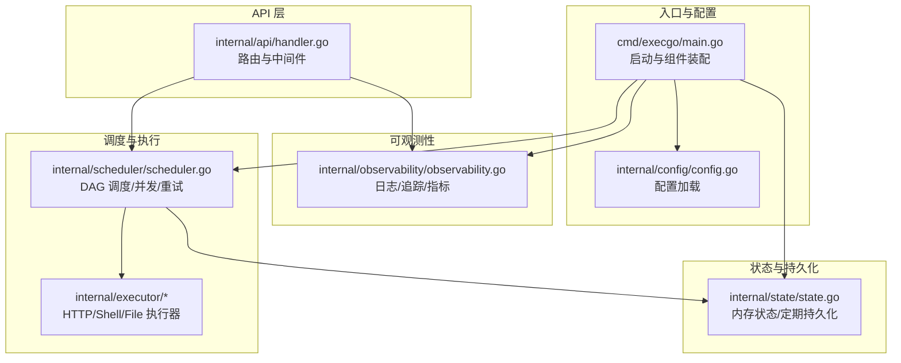
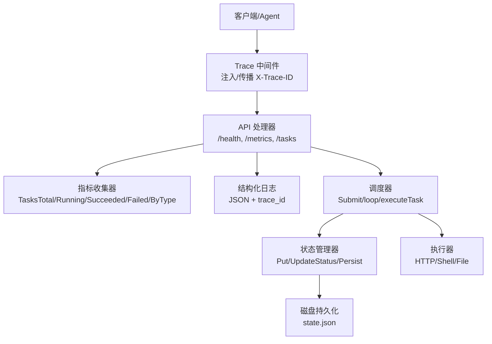
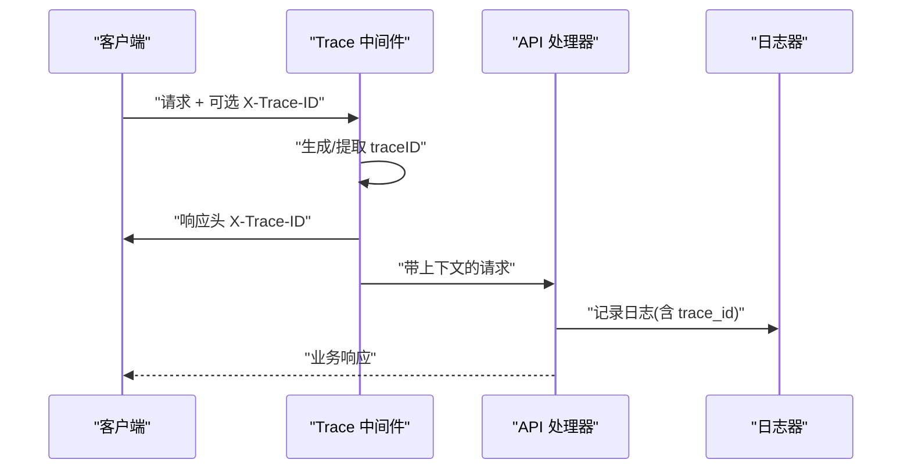
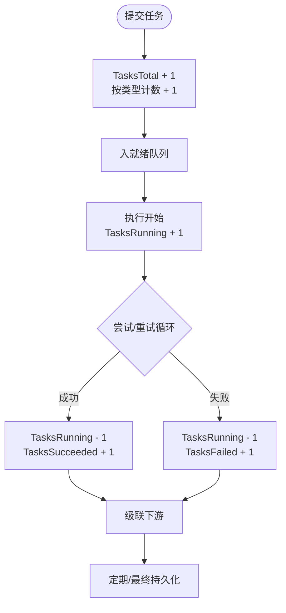
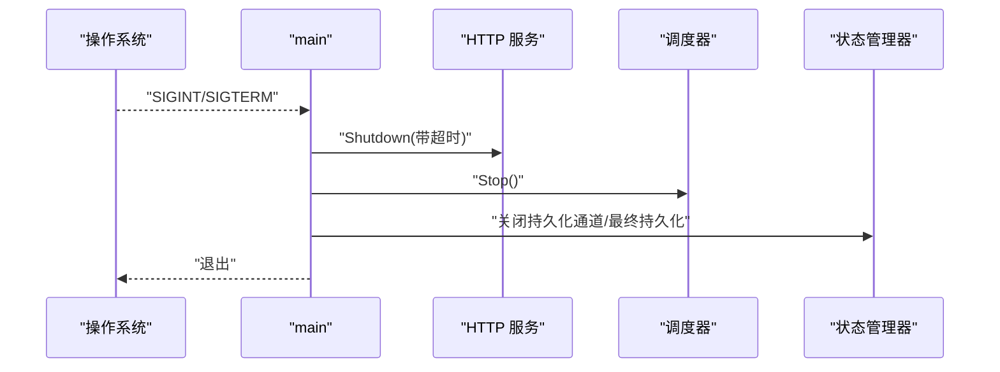
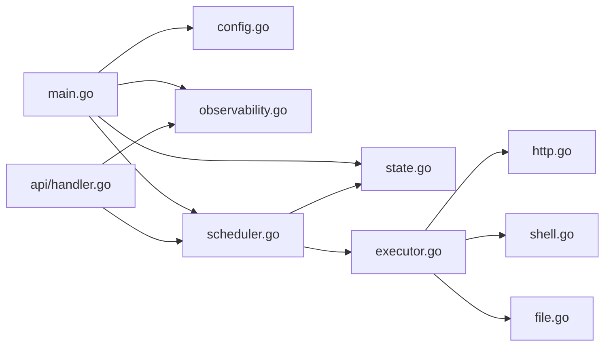

# 监控与日志

<cite>
**本文档引用的文件**
- [cmd/execgo/main.go](file://cmd/execgo/main.go)
- [internal/observability/observability.go](file://internal/observability/observability.go)
- [internal/api/handler.go](file://internal/api/handler.go)
- [internal/config/config.go](file://internal/config/config.go)
- [internal/scheduler/scheduler.go](file://internal/scheduler/scheduler.go)
- [internal/state/state.go](file://internal/state/state.go)
- [internal/models/task.go](file://internal/models/task.go)
- [internal/executor/executor.go](file://internal/executor/executor.go)
- [internal/executor/http.go](file://internal/executor/http.go)
- [internal/executor/shell.go](file://internal/executor/shell.go)
- [internal/executor/file.go](file://internal/executor/file.go)
- [README.md](file://README.md)
</cite>

## 目录
1. [简介](#简介)
2. [项目结构](#项目结构)
3. [核心组件](#核心组件)
4. [架构总览](#架构总览)
5. [详细组件分析](#详细组件分析)
6. [依赖分析](#依赖分析)
7. [性能考虑](#性能考虑)
8. [故障排查指南](#故障排查指南)
9. [结论](#结论)
10. [附录](#附录)

## 简介
本指南聚焦 ExecGo 的监控与日志能力，覆盖以下方面：
- 内置指标收集：任务总数、运行中、成功、失败及按任务类型统计
- 日志记录：结构化 JSON 日志与请求级 traceID 追踪
- 追踪功能：HTTP 中间件自动注入与传播 traceID
- 指标导出与可视化：/metrics 端点与 Grafana 面板建议
- 健康检查：/health 端点
- 故障诊断：日志字段、错误处理与常见问题定位
- 性能监控与告警：关键指标阈值与告警建议
- 日志聚合与分析最佳实践：结构化日志与轮转策略

## 项目结构
ExecGo 采用分层架构，核心监控与日志分布在入口、可观测性模块、API 层、调度器与状态管理等模块中。

图表来源
- [cmd/execgo/main.go:25-104](file://cmd/execgo/main.go#L25-L104)
- [internal/config/config.go:18-30](file://internal/config/config.go#L18-L30)
- [internal/observability/observability.go:50-80](file://internal/observability/observability.go#L50-L80)
- [internal/api/handler.go:39-52](file://internal/api/handler.go#L39-L52)
- [internal/scheduler/scheduler.go:34-67](file://internal/scheduler/scheduler.go#L34-L67)
- [internal/state/state.go:25-53](file://internal/state/state.go#L25-L53)

章节来源
- [cmd/execgo/main.go:25-104](file://cmd/execgo/main.go#L25-L104)
- [README.md:32-57](file://README.md#L32-L57)

## 核心组件
- 结构化日志：使用标准库 slog 输出 JSON 格式日志，默认级别为 Info
- 请求追踪：HTTP 中间件为每个请求生成 traceID，并在响应头与后续日志中传播
- 指标收集：内存中的原子计数器，记录任务总量、运行中、成功、失败以及按类型统计
- 健康检查：/health 返回服务状态、版本与运行时长
- 指标导出：/metrics 返回当前指标快照
- 状态持久化：定期将内存状态写入磁盘，崩溃后恢复

章节来源
- [internal/observability/observability.go:50-80](file://internal/observability/observability.go#L50-L80)
- [internal/observability/observability.go:86-133](file://internal/observability/observability.go#L86-L133)
- [internal/api/handler.go:128-146](file://internal/api/handler.go#L128-L146)
- [internal/state/state.go:160-179](file://internal/state/state.go#L160-L179)

## 架构总览
下图展示监控与日志在系统中的交互关系。

图表来源
- [internal/api/handler.go:39-52](file://internal/api/handler.go#L39-L52)
- [internal/observability/observability.go:69-80](file://internal/observability/observability.go#L69-L80)
- [internal/scheduler/scheduler.go:69-97](file://internal/scheduler/scheduler.go#L69-L97)
- [internal/state/state.go:110-134](file://internal/state/state.go#L110-L134)
- [internal/executor/executor.go:31-67](file://internal/executor/executor.go#L31-L67)

## 详细组件分析

### 结构化日志与日志轮转
- 日志格式：使用 slog 的 JSON 处理器输出结构化日志，便于解析与聚合
- 日志级别：默认 Info；可在部署时通过环境变量调整
- 日志字段：在 API 层与调度器中统一注入 trace_id，便于跨组件关联
- 日志轮转：当前实现未内置轮转；建议结合系统级工具（如 systemd/journald、logrotate、Fluent Bit/Vector）进行轮转与归档

章节来源
- [internal/observability/observability.go:50-63](file://internal/observability/observability.go#L50-L63)
- [internal/api/handler.go:59-68](file://internal/api/handler.go#L59-L68)
- [internal/scheduler/scheduler.go:128-142](file://internal/scheduler/scheduler.go#L128-L142)

### 请求追踪（TraceID）
- 生成与注入：中间件从请求头读取或生成新的 traceID，并设置响应头，同时注入到上下文
- 传播：后续日志与指标均携带 trace_id，便于端到端追踪
- 使用建议：客户端可复用 X-Trace-ID 头，便于跨服务串联

图表来源
- [internal/observability/observability.go:69-80](file://internal/observability/observability.go#L69-L80)
- [internal/api/handler.go:59-68](file://internal/api/handler.go#L59-L68)

章节来源
- [internal/observability/observability.go:24-44](file://internal/observability/observability.go#L24-L44)
- [internal/observability/observability.go:69-80](file://internal/observability/observability.go#L69-L80)

### 指标收集与导出
- 指标类型：
  - TasksTotal：任务总数
  - TasksRunning：运行中任务数
  - TasksSucceeded：成功任务数
  - TasksFailed：失败任务数
  - ByType：按任务类型计数
- 更新位置：
  - 提交任务时增加 TasksTotal 与按类型计数
  - 执行开始/结束时维护 TasksRunning
  - 成功/失败时分别增加相应计数
- 导出端点：/metrics 返回当前指标快照

图表来源
- [internal/scheduler/scheduler.go:69-97](file://internal/scheduler/scheduler.go#L69-L97)
- [internal/scheduler/scheduler.go:127-190](file://internal/scheduler/scheduler.go#L127-L190)
- [internal/scheduler/scheduler.go:192-222](file://internal/scheduler/scheduler.go#L192-L222)
- [internal/state/state.go:160-179](file://internal/state/state.go#L160-L179)

章节来源
- [internal/observability/observability.go:86-133](file://internal/observability/observability.go#L86-L133)
- [internal/api/handler.go:137-146](file://internal/api/handler.go#L137-L146)
- [internal/scheduler/scheduler.go:70-97](file://internal/scheduler/scheduler.go#L70-L97)
- [internal/scheduler/scheduler.go:127-190](file://internal/scheduler/scheduler.go#L127-L190)

### 健康检查与优雅停机
- /health：返回状态、版本与运行时长，便于探活
- 优雅停机：接收系统信号后，依次关闭 HTTP 服务、停止调度器、等待最终持久化

图表来源
- [cmd/execgo/main.go:81-104](file://cmd/execgo/main.go#L81-L104)
- [internal/api/handler.go:128-135](file://internal/api/handler.go#L128-L135)

章节来源
- [cmd/execgo/main.go:81-104](file://cmd/execgo/main.go#L81-L104)
- [internal/api/handler.go:128-135](file://internal/api/handler.go#L128-L135)

### 执行器与日志
- HTTP 执行器：构造请求、发送、读取响应体并返回状态码与内容
- Shell 执行器：白名单命令执行，捕获 stdout/stderr/exit_code
- File 执行器：读写/追加/删除/统计，防目录穿越

章节来源
- [internal/executor/http.go:27-75](file://internal/executor/http.go#L27-L75)
- [internal/executor/shell.go:36-78](file://internal/executor/shell.go#L36-L78)
- [internal/executor/file.go:25-113](file://internal/executor/file.go#L25-L113)

## 依赖分析
- 入口 main 依赖配置、可观测性、调度器与状态管理器
- API 层依赖可观测性中间件与指标
- 调度器依赖状态管理器、指标与执行器注册表
- 执行器通过注册表被调度器按类型获取

图表来源
- [cmd/execgo/main.go:17-23](file://cmd/execgo/main.go#L17-L23)
- [internal/api/handler.go:5-17](file://internal/api/handler.go#L5-L17)
- [internal/executor/executor.go:5-12](file://internal/executor/executor.go#L5-L12)

章节来源
- [cmd/execgo/main.go:17-23](file://cmd/execgo/main.go#L17-L23)
- [internal/api/handler.go:5-17](file://internal/api/handler.go#L5-L17)
- [internal/executor/executor.go:5-12](file://internal/executor/executor.go#L5-L12)

## 性能考虑
- 并发控制：调度器使用信号量限制最大并发，避免资源争用
- 就绪队列：有界通道，满载时采用异步回填，避免阻塞
- 指标更新：原子计数器，低开销
- 磁盘写入：定期持久化，避免频繁 IO；最终落盘保证一致性
- 建议：根据负载调优最大并发与持久化间隔；对高吞吐场景建议外置数据库以替代 JSON 文件

章节来源
- [internal/scheduler/scheduler.go:34-45](file://internal/scheduler/scheduler.go#L34-L45)
- [internal/scheduler/scheduler.go:99-107](file://internal/scheduler/scheduler.go#L99-L107)
- [internal/state/state.go:160-179](file://internal/state/state.go#L160-L179)

## 故障排查指南
- 常见错误与定位
  - 提交任务失败：检查任务图合法性（空图、重复 ID、未知依赖、环依赖），查看 API 层日志中的错误字段
  - 未知任务类型：确认执行器已注册，或检查任务 type 是否正确
  - 执行失败：查看执行器返回的错误信息与 trace_id，结合调度器日志定位
  - 健康检查异常：检查 /health 响应与进程日志
- 日志字段参考
  - trace_id：请求级追踪标识
  - task_id、task_type：任务级上下文
  - error：错误详情
  - status、version、uptime：健康检查响应字段
- 诊断步骤
  - 使用 /metrics 对比 TasksRunning/TasksFailed 与 ByType，判断瓶颈与失败分布
  - 通过 trace_id 在日志中检索完整链路
  - 检查状态持久化是否成功，观察最终落盘

章节来源
- [internal/api/handler.go:63-85](file://internal/api/handler.go#L63-L85)
- [internal/models/task.go:42-79](file://internal/models/task.go#L42-L79)
- [internal/scheduler/scheduler.go:132-137](file://internal/scheduler/scheduler.go#L132-L137)
- [internal/api/handler.go:128-146](file://internal/api/handler.go#L128-L146)

## 结论
ExecGo 提供了轻量而完备的可观测性基础：结构化日志、请求追踪与内存指标。结合 /health 与 /metrics 端点，可快速实现运行态监控与故障定位。对于生产环境，建议配合系统级日志轮转与外部监控系统（Prometheus/Grafana）实现长期观测与告警。

## 附录

### Prometheus 指标导出与 Grafana 面板配置
- 导出方式
  - 使用 Prometheus 抓取 /metrics 端点，抓取间隔建议 15s~30s
  - 指标名称映射（示例）：
    - execgo_tasks_total -> TasksTotal
    - execgo_tasks_running -> TasksRunning
    - execgo_tasks_succeeded -> TasksSucceeded
    - execgo_tasks_failed -> TasksFailed
    - execgo_tasks_by_type_total -> ByType
- Grafana 面板建议
  - 总览面板：运行中/成功/失败任务趋势
  - 任务类型分布：按 type 的计数与占比
  - 错误率：失败任务占比与失败原因分布
  - 健康状态：/health 返回状态与 uptime

### 结构化日志格式与字段
- 字段示例（按模块）
  - API 层：trace_id、error、task_count、status、version、uptime
  - 调度器：trace_id、task_id、task_type、error、attempt、backoff
  - 状态管理器：trace_id、task_count、error
- 建议：统一字段命名，便于日志聚合平台（如 ELK/Vector/Fluent Bit）解析

### 健康检查端点
- 端点：GET /health
- 响应字段：status、version、uptime
- 用途：存活探针、滚动升级与自动恢复

### 性能监控与告警示例
- 关键指标
  - TasksRunning：超过阈值需扩容或限流
  - TasksFailed：持续升高需检查执行器与依赖服务
  - ByType：识别热点类型与异常分布
- 告警规则（示例）
  - 运行中任务长时间未变化：可能死锁或阻塞
  - 失败率超过阈值：触发重试与告警
  - /health 不可用：立即告警

### 日志聚合与分析最佳实践
- 结构化输出：保持 JSON 格式，字段稳定
- 轮转策略：按大小/时间轮转，保留历史以便回溯
- 归档与索引：集中存储并建立索引，支持 trace_id 聚合查询
- 安全：避免敏感信息进入日志；必要时脱敏

章节来源
- [internal/api/handler.go:128-146](file://internal/api/handler.go#L128-L146)
- [internal/observability/observability.go:50-63](file://internal/observability/observability.go#L50-L63)
- [internal/state/state.go:160-179](file://internal/state/state.go#L160-L179)