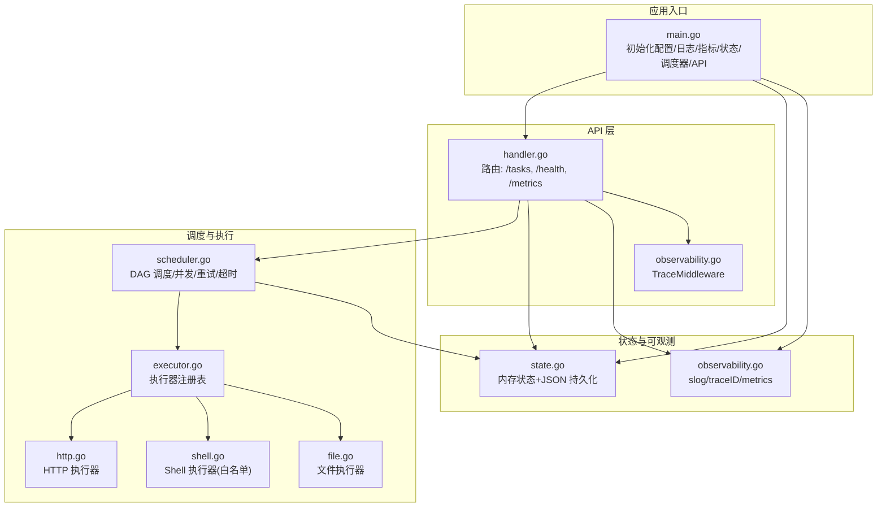
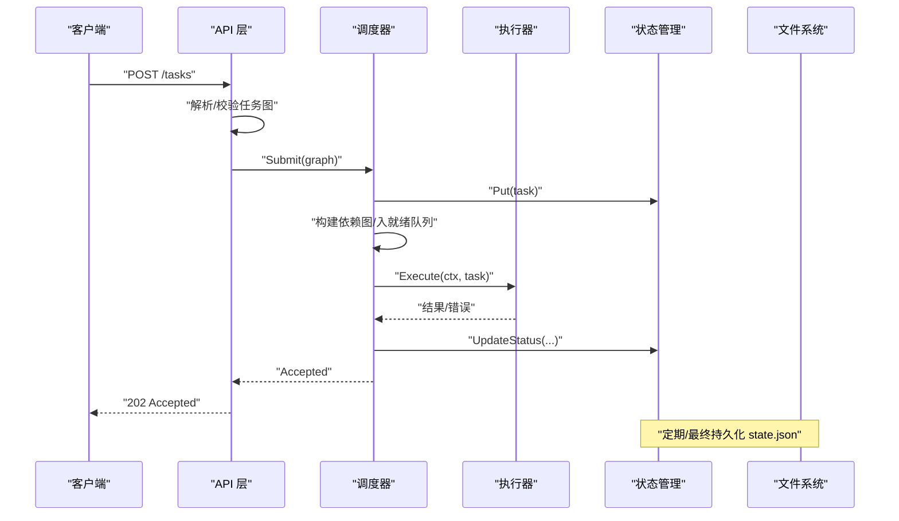
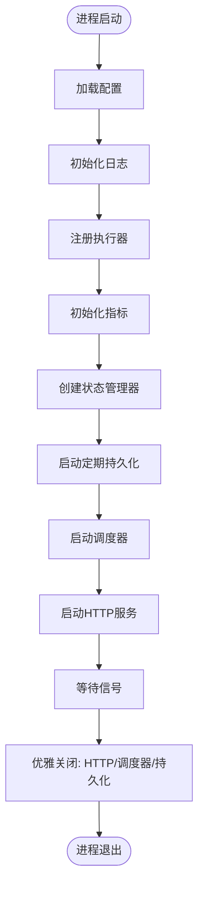
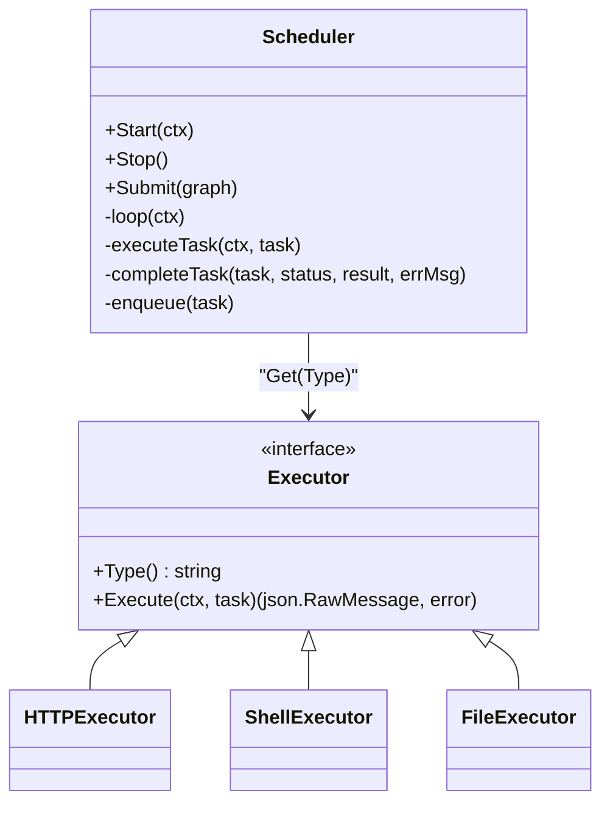
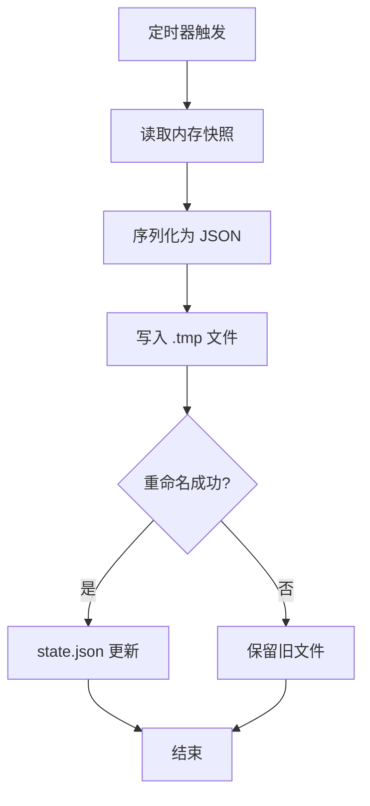
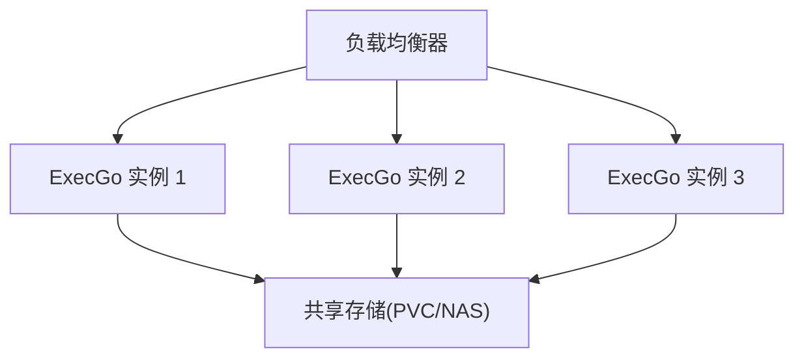

# 部署指南

<cite>
**本文档引用的文件**
- [main.go](file://cmd/execgo/main.go)
- [config.go](file://internal/config/config.go)
- [state.go](file://internal/state/state.go)
- [observability.go](file://internal/observability/observability.go)
- [handler.go](file://internal/api/handler.go)
- [scheduler.go](file://internal/scheduler/scheduler.go)
- [task.go](file://internal/models/task.go)
- [executor.go](file://internal/executor/executor.go)
- [shell.go](file://internal/executor/shell.go)
- [http.go](file://internal/executor/http.go)
- [file.go](file://internal/executor/file.go)
- [go.mod](file://go.mod)
- [README.md](file://README.md)
</cite>

## 目录
1. [简介](#简介)
2. [项目结构](#项目结构)
3. [核心组件](#核心组件)
4. [架构总览](#架构总览)
5. [详细组件分析](#详细组件分析)
6. [部署方案](#部署方案)
7. [生产环境配置与安全加固](#生产环境配置与安全加固)
8. [高可用与负载均衡](#高可用与负载均衡)
9. [监控与日志](#监控与日志)
10. [备份与灾难恢复](#备份与灾难恢复)
11. [性能调优与容量规划](#性能调优与容量规划)
12. [故障排查](#故障排查)
13. [自动化部署与CI/CD](#自动化部署与cicd)
14. [结论](#结论)

## 简介
ExecGo 是一个使用纯 Go 标准库构建的极简 AI 执行引擎，提供任务提交、DAG 调度、并发执行与可观测性。它通过 HTTP API 暴露任务管理能力，适合在单节点环境中作为 AI Agent 的执行内核。

## 项目结构
ExecGo 采用清晰的分层架构：
- cmd/execgo：应用入口与生命周期管理
- internal/api：HTTP API 层，路由与中间件
- internal/scheduler：DAG 调度器，负责并发与依赖管理
- internal/executor：执行器接口与内置执行器（HTTP/Shell/File）
- internal/state：任务状态管理与持久化
- internal/observability：结构化日志、追踪与指标
- internal/models：核心数据结构与校验

图表来源
- [main.go:25-104](file://cmd/execgo/main.go#L25-L104)
- [handler.go:39-52](file://internal/api/handler.go#L39-L52)
- [scheduler.go:34-67](file://internal/scheduler/scheduler.go#L34-L67)
- [executor.go:31-67](file://internal/executor/executor.go#L31-L67)
- [state.go:26-53](file://internal/state/state.go#L26-L53)
- [observability.go:50-80](file://internal/observability/observability.go#L50-L80)

章节来源
- [README.md:149-177](file://README.md#L149-L177)
- [go.mod:1-4](file://go.mod#L1-L4)

## 核心组件
- 配置管理：支持命令行参数与环境变量，优先级为 flag > env > default。
- 状态管理：内存中维护任务映射，定期与崩溃后从 JSON 文件恢复。
- 调度器：基于 Kahn 算法的 DAG 调度，goroutine + 信号量控制并发，指数退避重试与超时。
- 执行器：HTTP/Shell/File 三类内置执行器，Shell 命令白名单保障安全。
- 观测性：结构化 JSON 日志、请求追踪 ID、/metrics 指标端点。

章节来源
- [config.go:18-30](file://internal/config/config.go#L18-L30)
- [state.go:17-53](file://internal/state/state.go#L17-L53)
- [scheduler.go:18-45](file://internal/scheduler/scheduler.go#L18-L45)
- [executor.go:14-20](file://internal/executor/executor.go#L14-L20)
- [observability.go:50-63](file://internal/observability/observability.go#L50-L63)

## 架构总览
ExecGo 的核心流程：
- 应用启动：加载配置、初始化日志、注册执行器、启动调度器与 HTTP 服务。
- API 请求：接收任务提交，进行校验与执行器存在性检查，提交到调度器。
- 调度执行：根据依赖关系与并发限制执行任务，支持重试与超时。
- 状态持久化：定期将内存状态写入 JSON 文件，确保崩溃恢复。
- 观测性：记录结构化日志、追踪请求、暴露指标。

图表来源
- [handler.go:58-99](file://internal/api/handler.go#L58-L99)
- [scheduler.go:69-97](file://internal/scheduler/scheduler.go#L69-L97)
- [state.go:110-134](file://internal/state/state.go#L110-L134)

## 详细组件分析

### 配置与启动流程
- 配置加载：支持监听地址、数据目录、最大并发、优雅关闭超时等参数。
- 启动顺序：注册执行器 → 初始化指标 → 创建状态管理器 → 启动定期持久化 → 启动调度器 → 启动 HTTP 服务 → 信号监听与优雅关闭。

图表来源
- [main.go:25-104](file://cmd/execgo/main.go#L25-L104)
- [config.go:18-30](file://internal/config/config.go#L18-L30)
- [state.go:160-179](file://internal/state/state.go#L160-L179)

章节来源
- [main.go:25-104](file://cmd/execgo/main.go#L25-L104)
- [config.go:18-30](file://internal/config/config.go#L18-L30)

### API 层与路由
- 路由：/tasks (POST/GET/DELETE)，/health (GET)，/metrics (GET)。
- 中间件：TraceMiddleware 为每个请求注入/透传 trace_id，便于日志关联。
- 错误处理：统一的错误响应格式，状态码与错误信息明确。

章节来源
- [handler.go:39-52](file://internal/api/handler.go#L39-L52)
- [handler.go:58-99](file://internal/api/handler.go#L58-L99)
- [handler.go:128-146](file://internal/api/handler.go#L128-L146)
- [observability.go:69-80](file://internal/observability/observability.go#L69-L80)

### 调度器与执行
- DAG 调度：构建入度与反向依赖图，Kahn 算法检测环，无依赖任务进入就绪队列。
- 并发控制：信号量限制最大并发；goroutine 并行执行任务。
- 重试与超时：指数退避重试，支持任务级超时；失败后级联跳过下游。
- 执行器选择：按任务 type 从注册表获取执行器并执行。

图表来源
- [scheduler.go:18-45](file://internal/scheduler/scheduler.go#L18-L45)
- [executor.go:14-20](file://internal/executor/executor.go#L14-L20)
- [http.go:22-25](file://internal/executor/http.go#L22-L25)
- [shell.go:31-34](file://internal/executor/shell.go#L31-L34)
- [file.go:20-23](file://internal/executor/file.go#L20-L23)

章节来源
- [scheduler.go:47-67](file://internal/scheduler/scheduler.go#L47-L67)
- [scheduler.go:69-97](file://internal/scheduler/scheduler.go#L69-L97)
- [scheduler.go:109-125](file://internal/scheduler/scheduler.go#L109-L125)
- [scheduler.go:127-190](file://internal/scheduler/scheduler.go#L127-L190)
- [scheduler.go:192-231](file://internal/scheduler/scheduler.go#L192-L231)

### 状态管理与持久化
- 内存状态：map[string]*Task + RWMutex 保证并发安全。
- 持久化策略：定期（默认 30 秒）与最终持久化；写临时文件后原子重命名，避免损坏。
- 恢复逻辑：启动时从 state.json 加载，将 running 状态重置为 pending。

图表来源
- [state.go:110-134](file://internal/state/state.go#L110-L134)
- [state.go:160-179](file://internal/state/state.go#L160-L179)
- [state.go:136-158](file://internal/state/state.go#L136-L158)

章节来源
- [state.go:17-53](file://internal/state/state.go#L17-L53)
- [state.go:110-134](file://internal/state/state.go#L110-L134)
- [state.go:136-158](file://internal/state/state.go#L136-L158)

### 观测性与指标
- 日志：slog JSON 格式，默认 Info 级别；L(ctx, logger) 带 trace_id。
- 追踪：TraceMiddleware 注入/透传 X-Trace-ID。
- 指标：TasksTotal/TasksRunning/TasksSucceeded/TasksFailed，按类型计数。

章节来源
- [observability.go:50-63](file://internal/observability/observability.go#L50-L63)
- [observability.go:69-80](file://internal/observability/observability.go#L69-L80)
- [observability.go:86-134](file://internal/observability/observability.go#L86-L134)

## 部署方案

### Docker 容器化部署
- 构建镜像：基于官方 Go 镜像构建二进制，再复制到精简镜像中。
- 运行参数：通过环境变量或命令行参数设置监听地址、数据目录、并发数与关闭超时。
- 数据卷：挂载数据目录以持久化 state.json。
- 健康检查：使用 /health 端点进行健康探测。

章节来源
- [config.go:23-26](file://internal/config/config.go#L23-L26)
- [state.go:26-53](file://internal/state/state.go#L26-L53)
- [handler.go:128-135](file://internal/api/handler.go#L128-L135)

### Kubernetes 部署
- Deployment：单副本或无状态多副本（需外部状态持久化）。
- PersistentVolume：挂载 PVC 到数据目录，确保 state.json 持久化。
- Service：ClusterIP 或 LoadBalancer，结合 Ingress 对外暴露。
- Readiness/Liveness：使用 /health 作为探针。
- 资源限制：根据并发与任务类型设置 CPU/内存配额。

章节来源
- [state.go:26-53](file://internal/state/state.go#L26-L53)
- [handler.go:128-135](file://internal/api/handler.go#L128-L135)

### 传统服务器部署
- 二进制部署：在目标机器上放置可执行文件与数据目录。
- 系统服务：使用 systemd 管理进程生命周期，自动重启与日志输出。
- 端口与权限：确保监听端口开放，数据目录具备读写权限。
- 备份策略：定期复制数据目录至备份介质。

章节来源
- [main.go:25-104](file://cmd/execgo/main.go#L25-L104)
- [state.go:26-53](file://internal/state/state.go#L26-L53)

## 生产环境配置与安全加固

### 配置要求
- 监听地址：绑定内网 IP 或通过反向代理暴露。
- 数据目录：独立分区，具备足够空间与高可用。
- 最大并发：根据 CPU/IO 能力与任务类型合理设置。
- 关闭超时：确保优雅关闭期间有足够时间完成持久化。

章节来源
- [config.go:23-26](file://internal/config/config.go#L23-L26)

### 安全加固
- Shell 执行器白名单：仅允许预定义命令，避免任意命令执行。
- 文件执行器路径清理：防止目录穿越，严格限制可访问路径。
- HTTP 执行器：限制请求体大小，避免过大响应。
- 日志脱敏：避免在日志中输出敏感参数。
- 网络隔离：在容器/K8s 中使用网络策略限制访问。

章节来源
- [shell.go:14-22](file://internal/executor/shell.go#L14-L22)
- [shell.go:46-54](file://internal/executor/shell.go#L46-L54)
- [file.go:35-36](file://internal/executor/file.go#L35-L36)
- [http.go:60-63](file://internal/executor/http.go#L60-L63)

## 高可用与负载均衡

### 单节点局限性
- ExecGo 默认为单节点执行内核，不自带跨节点状态同步。
- 若需要高可用，建议采用“多实例 + 共享存储”的方案。

### 推荐架构
- 多实例：多个 ExecGo 实例，共享同一数据目录（NAS/SAN）。
- 负载均衡：Nginx/HAProxy/Ingress 将请求分发至多个实例。
- 健康检查：使用 /health 端点进行探活。
- 状态一致性：共享存储确保 state.json 一致；注意并发写入冲突。

[此图为概念性架构示意，不直接映射具体源文件]

## 监控与日志

### 指标端点
- /metrics：返回任务总数、运行中、成功、失败以及按类型计数。
- 建议：Prometheus 抓取 /metrics，Grafana 可视化。

章节来源
- [handler.go:137-146](file://internal/api/handler.go#L137-L146)
- [observability.go:86-134](file://internal/observability/observability.go#L86-L134)

### 日志采集
- 标准输出：容器/系统日志收集器（如 Fluent Bit/Fluentd/Vector）采集 stdout。
- 结构化字段：trace_id 便于跨服务关联日志。
- 建议：集中式日志平台（如 ELK/EFK/Loki）聚合与检索。

章节来源
- [observability.go:50-63](file://internal/observability/observability.go#L50-L63)
- [main.go:30-37](file://cmd/execgo/main.go#L30-L37)

## 备份与灾难恢复

### 数据持久化
- state.json：定期持久化与最终持久化，确保崩溃恢复。
- 备份策略：周期性复制数据目录至异地存储（对象存储/磁带）。
- 恢复流程：停止服务 → 恢复 state.json → 启动服务 → 验证任务状态。

章节来源
- [state.go:110-134](file://internal/state/state.go#L110-L134)
- [state.go:160-179](file://internal/state/state.go#L160-L179)

### 灾难恢复计划
- RTO/RPO：根据备份频率设定恢复目标。
- 测试演练：定期验证备份数据完整性与恢复流程。
- 故障场景：磁盘损坏、网络分区、共享存储不可用。

[本节为通用运维建议，不直接分析具体源文件]

## 性能调优与容量规划

### 并发与资源
- 最大并发：根据 CPU 核心数与任务类型（CPU 密集/IO 密集）调整。
- 调度队列：就绪队列容量与信号量共同决定吞吐。
- 超时与重试：合理设置任务超时与重试次数，避免资源浪费。

章节来源
- [config.go:25-26](file://internal/config/config.go#L25-L26)
- [scheduler.go:40-44](file://internal/scheduler/scheduler.go#L40-L44)
- [scheduler.go:144-179](file://internal/scheduler/scheduler.go#L144-L179)

### 容量规划
- 任务类型占比：统计按类型计数，评估资源分配。
- 磁盘 IO：频繁文件操作需关注磁盘延迟与带宽。
- 网络 IO：HTTP 执行器需考虑带宽与连接数限制。

章节来源
- [observability.go:123-133](file://internal/observability/observability.go#L123-L133)

## 故障排查

### 常见问题
- 任务无法提交：检查 /tasks 提交格式与执行器类型是否存在。
- 任务卡住：查看 /metrics 中 running 数量与任务日志。
- 状态未持久化：确认数据目录权限与磁盘空间。
- 健康检查失败：检查 /health 是否可达，日志中是否有致命错误。

章节来源
- [handler.go:58-99](file://internal/api/handler.go#L58-L99)
- [handler.go:128-135](file://internal/api/handler.go#L128-L135)
- [state.go:110-134](file://internal/state/state.go#L110-L134)

### 排查步骤
- 查看日志：定位 trace_id，关联请求链路。
- 抓取指标：确认任务状态分布与类型占比。
- 检查持久化：确认 state.json 是否更新。
- 验证执行器：确认任务类型对应的执行器已注册。

章节来源
- [observability.go:58-63](file://internal/observability/observability.go#L58-L63)
- [executor.go:31-67](file://internal/executor/executor.go#L31-L67)

## 自动化部署与CI/CD

### 构建与打包
- 多阶段构建：先在 Go 镜像中编译，再复制到精简镜像。
- 版本标签：使用 Git 标签或构建元数据标注版本。

章节来源
- [go.mod:1-4](file://go.mod#L1-L4)

### CI/CD 最佳实践
- 分支策略：主分支保护，PR 审查与测试。
- 自动化测试：单元测试覆盖关键模块。
- 安全扫描：镜像漏洞扫描与依赖审计。
- 发布流程：蓝绿/滚动发布，配合健康检查与回滚策略。

[本节为通用 DevOps 建议，不直接分析具体源文件]

## 结论
ExecGo 提供了简洁可靠的单节点任务执行内核，适合在生产环境中通过容器化或 K8s 部署。通过合理的配置、安全加固、监控与备份策略，可以满足大多数 AI Agent 的执行需求。对于需要更高可用的场景，建议采用多实例与共享存储的架构，并结合完善的运维体系保障稳定性与可恢复性。