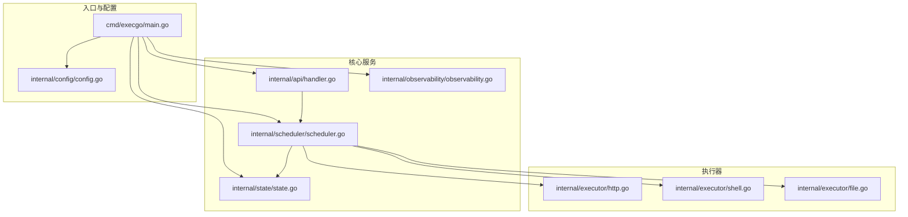
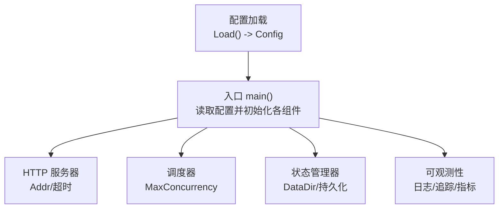
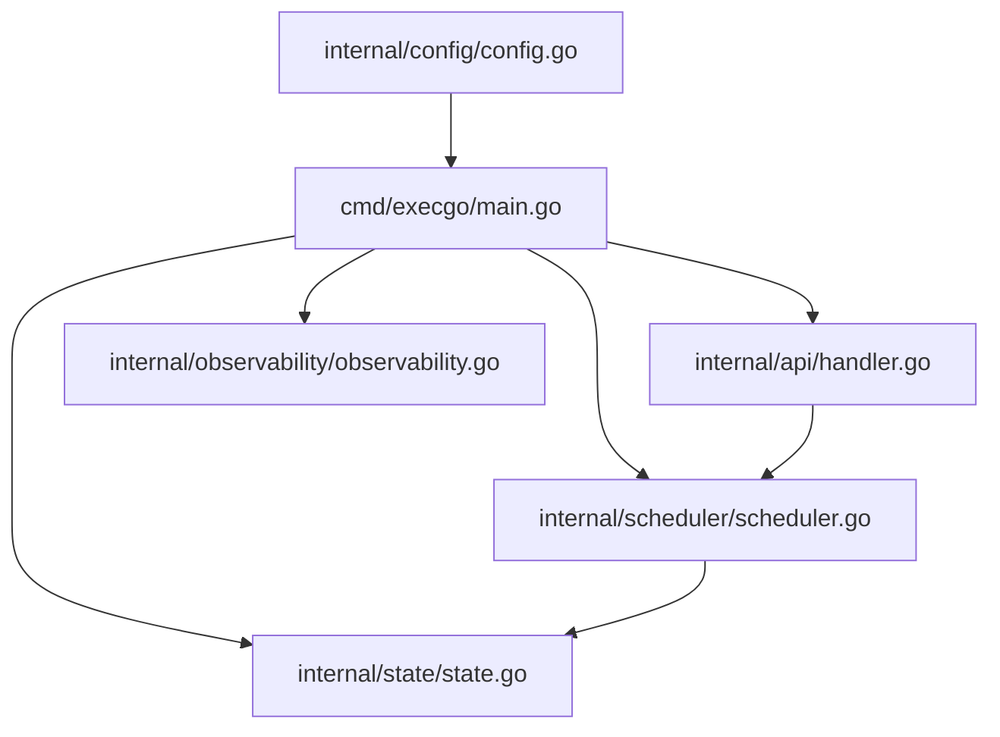
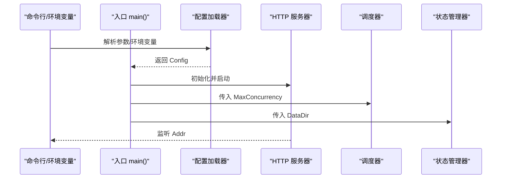

# 配置管理

<cite>
**本文引用的文件**
- [main.go](file://cmd/execgo/main.go)
- [config.go](file://internal/config/config.go)
- [scheduler.go](file://internal/scheduler/scheduler.go)
- [state.go](file://internal/state/state.go)
- [handler.go](file://internal/api/handler.go)
- [observability.go](file://internal/observability/observability.go)
- [task.go](file://internal/models/task.go)
- [http.go](file://internal/executor/http.go)
- [shell.go](file://internal/executor/shell.go)
- [file.go](file://internal/executor/file.go)
- [README.md](file://README.md)
</cite>

## 目录
1. [简介](#简介)
2. [项目结构](#项目结构)
3. [核心组件](#核心组件)
4. [架构总览](#架构总览)
5. [详细组件分析](#详细组件分析)
6. [依赖分析](#依赖分析)
7. [性能考虑](#性能考虑)
8. [故障排查指南](#故障排查指南)
9. [结论](#结论)
10. [附录](#附录)

## 简介
本指南面向运维与开发人员，系统阐述 ExecGo 的配置管理方案，包括：
- 所有配置参数的含义、默认值与优先级
- 配置文件格式与环境变量映射
- 运行时配置变更与热重载机制现状
- 不同环境的配置模板与最佳实践
- 配置验证与错误处理方法
- 配置安全与敏感信息保护建议

## 项目结构
ExecGo 采用“入口程序 + 分层模块”的组织方式，配置主要集中在入口与配置模块中，并贯穿调度器、状态管理与可观测性模块。

图表来源
- [main.go:25-104](file://cmd/execgo/main.go#L25-L104)
- [config.go:18-30](file://internal/config/config.go#L18-L30)
- [scheduler.go:34-45](file://internal/scheduler/scheduler.go#L34-L45)
- [state.go:25-53](file://internal/state/state.go#L25-L53)
- [handler.go:28-52](file://internal/api/handler.go#L28-L52)
- [observability.go:50-80](file://internal/observability/observability.go#L50-L80)
- [http.go:23-76](file://internal/executor/http.go#L23-L76)
- [shell.go:31-79](file://internal/executor/shell.go#L31-L79)
- [file.go:20-114](file://internal/executor/file.go#L20-L114)

章节来源
- [main.go:25-104](file://cmd/execgo/main.go#L25-L104)
- [config.go:18-30](file://internal/config/config.go#L18-L30)

## 核心组件
- 配置加载器：负责从命令行参数、环境变量与默认值加载配置，优先级为“flag > env > default”。
- HTTP 服务器：根据配置的监听地址启动，设置读/写/空闲超时。
- 调度器：根据配置的最大并发数初始化信号量，控制任务执行并发。
- 状态管理器：根据配置的数据目录初始化持久化文件，周期性持久化状态。
- 可观测性：提供结构化日志、请求追踪与指标，辅助配置验证与问题定位。

章节来源
- [config.go:18-30](file://internal/config/config.go#L18-L30)
- [main.go:64-70](file://cmd/execgo/main.go#L64-L70)
- [scheduler.go:34-45](file://internal/scheduler/scheduler.go#L34-L45)
- [state.go:25-53](file://internal/state/state.go#L25-L53)
- [observability.go:50-80](file://internal/observability/observability.go#L50-L80)

## 架构总览
下图展示配置在系统中的作用与影响范围。

图表来源
- [config.go:18-30](file://internal/config/config.go#L18-L30)
- [main.go:25-104](file://cmd/execgo/main.go#L25-L104)

## 详细组件分析

### 配置参数与优先级
- 参数清单与默认值
  - HTTP 监听地址：默认值见下文“默认值”
  - 数据目录：默认值见下文“默认值”
  - 最大并发数：默认值见下文“默认值”
  - 关停超时（秒）：默认值见下文“默认值”
- 优先级：命令行参数 > 环境变量 > 默认值
- 默认值来源与行为
  - HTTP 监听地址：未指定时默认监听本地端口
  - 数据目录：未指定时默认使用本地 data 目录
  - 最大并发数：未指定时默认并发上限
  - 关停超时：未指定时默认超时时间

章节来源
- [config.go:18-30](file://internal/config/config.go#L18-L30)
- [config.go:32-46](file://internal/config/config.go#L32-L46)
- [README.md:216-226](file://README.md#L216-L226)

### 配置文件格式与环境变量映射
- 配置文件格式
  - ExecGo 未内置独立的配置文件格式；配置通过命令行参数与环境变量注入。
  - 若需以文件形式管理配置，可在启动脚本或容器编排中将环境变量写入文件后以环境变量方式传递。
- 环境变量映射
  - HTTP 监听地址：EXECGO_ADDR
  - 数据目录：EXECGO_DATA_DIR
  - 最大并发数：EXECGO_MAX_CONCURRENCY
  - 关停超时（秒）：EXECGO_SHUTDOWN_TIMEOUT
- 优先级说明
  - 命令行参数覆盖环境变量，环境变量覆盖默认值。

章节来源
- [config.go:23-26](file://internal/config/config.go#L23-L26)
- [config.go:32-46](file://internal/config/config.go#L32-L46)
- [README.md:216-226](file://README.md#L216-L226)

### 运行时配置变更与热重载机制
- 当前机制
  - ExecGo 在启动阶段一次性加载配置并初始化各组件，未提供内置的运行时动态重载机制。
  - 若需调整配置，通常需要重启进程。
- 建议的替代方案
  - 通过外部编排工具（如 systemd、Docker、Kubernetes）在启动参数或环境变量层面进行切换。
  - 对于并发与数据目录等参数，可通过滚动重启的方式平滑过渡。
- 与可观测性的配合
  - 可通过 /metrics 端点监控运行状态，结合日志与追踪 ID 辅助定位配置变更带来的影响。

章节来源
- [main.go:25-104](file://cmd/execgo/main.go#L25-L104)
- [handler.go:137-146](file://internal/api/handler.go#L137-L146)
- [observability.go:50-80](file://internal/observability/observability.go#L50-L80)

### 不同环境的配置模板与最佳实践
- 开发环境
  - 监听地址：本地回环或内网地址
  - 数据目录：本地临时目录
  - 最大并发数：适中值，便于调试
  - 关停超时：较短，便于快速重启
- 生产环境
  - 监听地址：绑定到特定网络接口或容器端口
  - 数据目录：持久化卷挂载，确保高可用
  - 最大并发数：根据 CPU/IO 能力与任务类型评估
  - 关停超时：根据任务执行时长与持久化耗时设定
- 安全加固
  - 限制监听地址，避免暴露至公网
  - 使用只读权限的数据目录
  - 通过编排平台注入敏感参数，避免明文写入镜像或脚本

章节来源
- [main.go:64-70](file://cmd/execgo/main.go#L64-L70)
- [state.go:25-53](file://internal/state/state.go#L25-L53)
- [README.md:216-226](file://README.md#L216-L226)

### 配置验证与错误处理方法
- 配置加载阶段
  - 环境变量解析失败时回退到默认值；整型解析失败时同样回退。
- HTTP API 层
  - 提交任务时对任务图进行校验（如空图、重复 ID、未知依赖、自依赖、环依赖等），并返回明确错误信息。
- 执行器层
  - HTTP 执行器要求提供 URL；Shell 执行器要求命令在白名单内；文件执行器要求提供路径与有效动作。
- 错误处理
  - 对于无效请求体、非法任务图、未知执行器类型等情况，API 层返回结构化错误响应。
  - 调度器在执行任务时按指数退避重试，最终失败会记录错误并标记状态。

章节来源
- [config.go:39-46](file://internal/config/config.go#L39-L46)
- [handler.go:58-99](file://internal/api/handler.go#L58-L99)
- [task.go:41-79](file://internal/models/task.go#L41-L79)
- [http.go:27-76](file://internal/executor/http.go#L27-L76)
- [shell.go:36-79](file://internal/executor/shell.go#L36-L79)
- [file.go:25-114](file://internal/executor/file.go#L25-L114)

### 配置安全与敏感信息保护
- 敏感参数建议
  - 通过环境变量注入，避免硬编码在镜像或脚本中。
  - 使用编排平台的密钥管理功能（如 Kubernetes Secret）注入敏感值。
- 网络与访问控制
  - 限制 HTTP 监听地址，必要时启用 TLS（可在反向代理层实现）。
  - 控制数据目录权限，避免非授权访问。
- 执行器安全
  - Shell 执行器仅允许白名单命令，防止任意命令执行。
  - 文件执行器对路径进行清理，防止目录穿越。

章节来源
- [shell.go:14-22](file://internal/executor/shell.go#L14-L22)
- [file.go:35-51](file://internal/executor/file.go#L35-L51)
- [README.md:216-226](file://README.md#L216-L226)

## 依赖分析
配置在系统中的依赖关系如下：

图表来源
- [config.go:18-30](file://internal/config/config.go#L18-L30)
- [main.go:25-104](file://cmd/execgo/main.go#L25-L104)
- [scheduler.go:34-45](file://internal/scheduler/scheduler.go#L34-L45)
- [state.go:25-53](file://internal/state/state.go#L25-L53)
- [handler.go:28-52](file://internal/api/handler.go#L28-L52)
- [observability.go:50-80](file://internal/observability/observability.go#L50-L80)

章节来源
- [config.go:18-30](file://internal/config/config.go#L18-L30)
- [main.go:25-104](file://cmd/execgo/main.go#L25-L104)

## 性能考虑
- 并发控制
  - 调度器通过信号量限制最大并发，避免资源争用导致的性能抖动。
- 持久化策略
  - 状态管理器定期持久化，减少崩溃后的数据丢失风险；生产环境建议合理设置持久化间隔。
- HTTP 超时
  - 服务器设置了读/写/空闲超时，有助于避免慢请求占用资源。

章节来源
- [scheduler.go:34-45](file://internal/scheduler/scheduler.go#L34-L45)
- [state.go:160-179](file://internal/state/state.go#L160-L179)
- [main.go:64-70](file://cmd/execgo/main.go#L64-L70)

## 故障排查指南
- 启动失败
  - 检查监听地址是否被占用；确认数据目录权限正确。
- 任务提交失败
  - 查看 API 层返回的结构化错误信息，定位任务图校验失败原因。
- 执行器异常
  - HTTP 执行器：确认 URL、方法与头部配置；关注响应状态码。
  - Shell 执行器：确认命令在白名单内；检查上下文取消或超时。
  - 文件执行器：确认路径清理与动作类型有效。
- 指标与日志
  - 通过 /metrics 端点查看任务总数、运行中数量、成功/失败计数与按类型分布。
  - 使用结构化日志与追踪 ID 定位具体请求链路。

章节来源
- [handler.go:58-99](file://internal/api/handler.go#L58-L99)
- [http.go:27-76](file://internal/executor/http.go#L27-L76)
- [shell.go:36-79](file://internal/executor/shell.go#L36-L79)
- [file.go:25-114](file://internal/executor/file.go#L25-L114)
- [observability.go:50-80](file://internal/observability/observability.go#L50-L80)
- [observability.go:122-133](file://internal/observability/observability.go#L122-L133)

## 结论
ExecGo 的配置管理简洁而实用：通过命令行参数与环境变量统一注入，优先级清晰，便于在不同环境中灵活部署。当前版本未提供运行时热重载，建议通过外部编排实现平滑切换。结合内置的可观测性能力，可高效完成配置验证与问题定位。

## 附录

### 配置参数对照表
- HTTP 监听地址
  - 命令行参数：-addr
  - 环境变量：EXECGO_ADDR
  - 默认值：未指定时默认监听本地端口
- 数据目录
  - 命令行参数：-data-dir
  - 环境变量：EXECGO_DATA_DIR
  - 默认值：未指定时默认使用本地 data 目录
- 最大并发数
  - 命令行参数：-max-concurrency
  - 环境变量：EXECGO_MAX_CONCURRENCY
  - 默认值：未指定时默认并发上限
- 关停超时（秒）
  - 命令行参数：-shutdown-timeout
  - 环境变量：EXECGO_SHUTDOWN_TIMEOUT
  - 默认值：未指定时默认超时时间

章节来源
- [config.go:23-26](file://internal/config/config.go#L23-L26)
- [config.go:39-46](file://internal/config/config.go#L39-L46)
- [README.md:216-226](file://README.md#L216-L226)

### 配置流程时序图

图表来源
- [config.go:18-30](file://internal/config/config.go#L18-L30)
- [main.go:25-104](file://cmd/execgo/main.go#L25-L104)