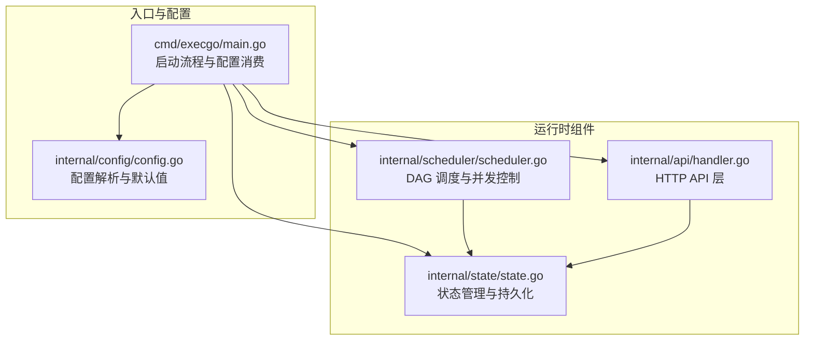
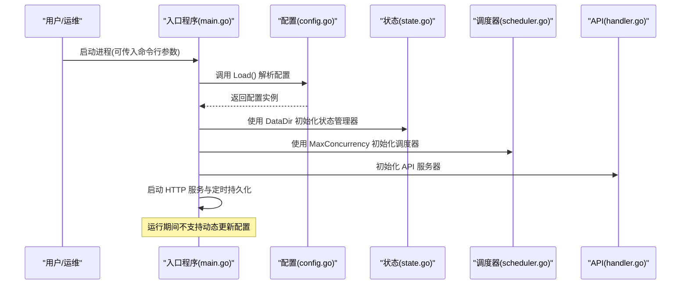
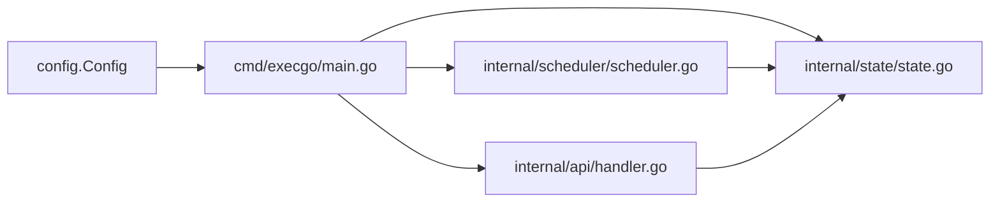

# 配置管理

<cite>
**本文档引用的文件**
- [cmd/execgo/main.go](file://cmd/execgo/main.go)
- [internal/config/config.go](file://internal/config/config.go)
- [internal/state/state.go](file://internal/state/state.go)
- [internal/scheduler/scheduler.go](file://internal/scheduler/scheduler.go)
- [internal/api/handler.go](file://internal/api/handler.go)
- [README.md](file://README.md)
- [go.mod](file://go.mod)
</cite>

## 目录
1. [简介](#简介)
2. [项目结构](#项目结构)
3. [核心组件](#核心组件)
4. [架构总览](#架构总览)
5. [详细组件分析](#详细组件分析)
6. [依赖分析](#依赖分析)
7. [性能考量](#性能考量)
8. [故障排查指南](#故障排查指南)
9. [结论](#结论)
10. [附录](#附录)

## 简介
本文件系统性阐述 ExecGo 的配置管理系统，覆盖命令行参数与环境变量的定义、默认值、优先级规则、运行时行为、动态更新机制与限制、配置验证与错误处理策略，以及生产环境的安全与性能优化建议。目标是帮助用户在不同部署场景下正确、安全地配置系统，并在出现问题时快速定位与解决。

## 项目结构
ExecGo 的配置管理集中在入口程序与配置模块中，其余组件通过配置进行初始化与运行。关键交互如下：
- 入口程序读取配置并初始化日志、状态管理、调度器与 HTTP 服务。
- 配置模块负责解析命令行与环境变量，提供默认值与类型转换。
- 状态管理器根据数据目录进行持久化；调度器根据并发上限控制执行并发。
- API 层不直接参与配置解析，但会使用配置中的监听地址等信息。

图表来源
- [cmd/execgo/main.go:25-104](file://cmd/execgo/main.go#L25-L104)
- [internal/config/config.go:18-30](file://internal/config/config.go#L18-L30)
- [internal/state/state.go:26-53](file://internal/state/state.go#L26-L53)
- [internal/scheduler/scheduler.go:35-45](file://internal/scheduler/scheduler.go#L35-L45)
- [internal/api/handler.go:29-37](file://internal/api/handler.go#L29-L37)

章节来源
- [cmd/execgo/main.go:25-104](file://cmd/execgo/main.go#L25-L104)
- [internal/config/config.go:18-30](file://internal/config/config.go#L18-L30)

## 核心组件
- 配置结构体：包含 HTTP 监听地址、数据目录、最大并发、优雅关闭超时四个字段。
- 配置加载函数：从命令行标志与环境变量加载，遵循“命令行 > 环境变量 > 默认值”的优先级。
- 环境变量解析：字符串与整数类型的环境变量解析，非数字环境变量回退到默认值。
- 入口程序消费配置：初始化日志、状态管理器、调度器与 HTTP 服务，并在优雅关闭阶段使用关闭超时。

章节来源
- [internal/config/config.go:10-16](file://internal/config/config.go#L10-L16)
- [internal/config/config.go:18-30](file://internal/config/config.go#L18-L30)
- [internal/config/config.go:32-46](file://internal/config/config.go#L32-L46)
- [cmd/execgo/main.go:25-104](file://cmd/execgo/main.go#L25-L104)

## 架构总览
配置系统在启动阶段一次性加载，随后被各运行时组件以只读方式使用。配置不会在运行时动态热更新，若需变更，需重启进程以重新加载最新配置。

图表来源
- [cmd/execgo/main.go:25-104](file://cmd/execgo/main.go#L25-L104)
- [internal/config/config.go:18-30](file://internal/config/config.go#L18-L30)
- [internal/state/state.go:26-53](file://internal/state/state.go#L26-L53)
- [internal/scheduler/scheduler.go:35-45](file://internal/scheduler/scheduler.go#L35-L45)
- [internal/api/handler.go:29-37](file://internal/api/handler.go#L29-L37)

## 详细组件分析

### 配置定义与默认值
- HTTP 监听地址
  - 命令行参数：-addr
  - 环境变量：EXECGO_ADDR
  - 默认值：:8080
- 数据目录
  - 命令行参数：-data-dir
  - 环境变量：EXECGO_DATA_DIR
  - 默认值：data
- 最大并发
  - 命令行参数：-max-concurrency
  - 环境变量：EXECGO_MAX_CONCURRENCY
  - 默认值：10
- 优雅关闭超时（秒）
  - 命令行参数：-shutdown-timeout
  - 环境变量：EXECGO_SHUTDOWN_TIMEOUT
  - 默认值：15

章节来源
- [internal/config/config.go:23-26](file://internal/config/config.go#L23-L26)
- [README.md:218-225](file://README.md#L218-L225)

### 配置优先级规则
- 优先级顺序：命令行参数 > 环境变量 > 默认值
- 当命令行参数存在时，忽略环境变量与默认值；当仅设置环境变量时，忽略默认值；否则使用默认值。
- 整数型环境变量解析失败时回退到默认值。

章节来源
- [internal/config/config.go:18-30](file://internal/config/config.go#L18-L30)
- [internal/config/config.go:39-46](file://internal/config/config.go#L39-L46)

### 配置加载与类型转换
- 字符串型配置：envOrDefault 返回环境变量或默认值。
- 整数型配置：envOrDefaultInt 优先尝试解析环境变量为整数，失败则回退默认值。
- 命令行解析：flag.Var 支持字符串与整数类型，分别绑定到对应字段。

章节来源
- [internal/config/config.go:32-46](file://internal/config/config.go#L32-L46)

### 运行时消费与使用
- HTTP 监听地址用于初始化 HTTP 服务器。
- 数据目录用于初始化状态管理器与持久化文件路径。
- 最大并发用于初始化调度器的并发信号量容量。
- 优雅关闭超时用于构造上下文超时，控制优雅关闭过程的最长等待时间。

章节来源
- [cmd/execgo/main.go:64-70](file://cmd/execgo/main.go#L64-L70)
- [cmd/execgo/main.go:47-51](file://cmd/execgo/main.go#L47-L51)
- [cmd/execgo/main.go:58](file://cmd/execgo/main.go#L58)
- [cmd/execgo/main.go:87-88](file://cmd/execgo/main.go#L87-L88)

### 运行时配置的动态更新机制与限制
- 动态更新机制：未实现。配置在启动时一次性加载，运行期间不支持动态热更新。
- 限制与影响：
  - 修改监听地址、数据目录、最大并发、关闭超时后，需要重启进程以生效。
  - 若在运行中调整最大并发，不会影响已启动的调度器并发上限，需重启以应用新值。
  - 数据目录变更不会自动迁移已有持久化文件，需手动处理。

章节来源
- [cmd/execgo/main.go:25-104](file://cmd/execgo/main.go#L25-L104)
- [internal/config/config.go:18-30](file://internal/config/config.go#L18-L30)

### 配置验证规则与错误处理策略
- 配置层面的验证：
  - 整数型环境变量解析失败时回退默认值，避免进程启动失败。
  - 未发现对监听地址格式的显式校验。
- 运行时错误处理：
  - 状态管理器初始化失败时记录错误并退出进程。
  - HTTP 服务启动错误时记录错误并退出进程。
  - 优雅关闭过程中若 HTTP 服务器关闭失败，记录错误但继续后续关闭步骤。
  - 定期持久化失败时记录错误，不影响运行。
- 任务图提交时的输入验证（与配置相关）：
  - API 层对任务图进行校验，不符合规范的请求返回 400。
  - 未知任务类型时返回 400，并提示可用类型列表。

章节来源
- [internal/config/config.go:39-46](file://internal/config/config.go#L39-L46)
- [cmd/execgo/main.go:48-51](file://cmd/execgo/main.go#L48-L51)
- [cmd/execgo/main.go:75-78](file://cmd/execgo/main.go#L75-L78)
- [cmd/execgo/main.go:92-94](file://cmd/execgo/main.go#L92-L94)
- [internal/state/state.go:168-170](file://internal/state/state.go#L168-L170)
- [internal/api/handler.go:64-74](file://internal/api/handler.go#L64-L74)
- [internal/api/handler.go:76-85](file://internal/api/handler.go#L76-L85)

### 不同部署场景下的配置示例与最佳实践
- 单机开发/测试
  - 使用默认配置即可满足基本需求。
  - 如需自定义端口，可通过命令行参数或环境变量进行覆盖。
- 生产单节点
  - 设置合理的最大并发，结合 CPU 与任务类型评估。
  - 将数据目录指向持久化卷，确保崩溃后状态可恢复。
  - 设置合适的优雅关闭超时，避免长时间阻塞导致进程无法退出。
- 容器化部署
  - 通过环境变量进行配置覆盖，便于在不同环境中统一管理。
  - 将数据目录映射到持久化存储，避免容器重启丢失状态。
- 多实例部署
  - 通过不同的监听地址区分实例，或使用反向代理进行路由。
  - 各实例独立的数据目录，避免状态冲突。

章节来源
- [README.md:61-77](file://README.md#L61-L77)
- [internal/state/state.go:26-53](file://internal/state/state.go#L26-L53)

## 依赖分析
配置模块与运行时组件之间的耦合关系清晰，职责分离明确：
- 配置模块仅负责解析与提供配置，不依赖运行时组件。
- 入口程序在启动阶段一次性消费配置，后续组件通过依赖注入使用配置。
- 调度器与状态管理器均依赖配置中的并发与数据目录，API 层依赖监听地址。

图表来源
- [internal/config/config.go:10-16](file://internal/config/config.go#L10-L16)
- [cmd/execgo/main.go:25-104](file://cmd/execgo/main.go#L25-L104)
- [internal/state/state.go:26-53](file://internal/state/state.go#L26-L53)
- [internal/scheduler/scheduler.go:35-45](file://internal/scheduler/scheduler.go#L35-L45)
- [internal/api/handler.go:29-37](file://internal/api/handler.go#L29-L37)

章节来源
- [internal/config/config.go:10-16](file://internal/config/config.go#L10-L16)
- [cmd/execgo/main.go:25-104](file://cmd/execgo/main.go#L25-L104)

## 性能考量
- 最大并发设置
  - 过高可能导致资源争用与上下文切换开销增加；过低可能造成吞吐受限。
  - 建议结合任务类型（CPU 密集、IO 密集）与硬件资源进行压测确定最优值。
- 数据目录与持久化
  - 定时持久化采用临时文件+原子重命名策略，减少部分写入失败的风险。
  - 建议将数据目录置于高性能存储上，避免磁盘 I/O 成为瓶颈。
- 优雅关闭超时
  - 适当增大超时可确保正在执行的任务有足够时间完成或取消，避免数据不一致。
  - 过小可能导致进程提前终止，影响状态落盘。

章节来源
- [internal/state/state.go:111-134](file://internal/state/state.go#L111-L134)
- [cmd/execgo/main.go:87-88](file://cmd/execgo/main.go#L87-L88)

## 故障排查指南
- 启动失败：状态管理器初始化失败
  - 现象：进程退出，日志记录创建数据目录失败。
  - 处理：检查数据目录权限与路径是否存在，确保具备写权限。
- 启动失败：HTTP 服务启动失败
  - 现象：进程退出，日志记录 HTTP 服务器错误。
  - 处理：检查监听地址是否被占用，确认端口权限与防火墙设置。
- 运行中持久化失败
  - 现象：日志出现定期持久化失败。
  - 处理：检查磁盘空间、权限与存储稳定性；必要时调整持久化间隔。
- 优雅关闭异常
  - 现象：HTTP 服务器关闭失败或进程长时间无法退出。
  - 处理：增大优雅关闭超时，检查是否有长连接或未完成请求；确认调度器已停止。
- 配置解析问题
  - 现象：整数型环境变量解析失败导致使用默认值。
  - 处理：确保环境变量为有效整数；或改用命令行参数覆盖。

章节来源
- [cmd/execgo/main.go:48-51](file://cmd/execgo/main.go#L48-L51)
- [cmd/execgo/main.go:75-78](file://cmd/execgo/main.go#L75-L78)
- [cmd/execgo/main.go:92-94](file://cmd/execgo/main.go#L92-L94)
- [internal/state/state.go:168-170](file://internal/state/state.go#L168-L170)
- [internal/config/config.go:39-46](file://internal/config/config.go#L39-L46)

## 结论
ExecGo 的配置管理设计简洁、职责单一：入口程序在启动时一次性加载配置，运行时各组件按需消费。其优先级规则明确，环境变量解析具备容错能力。由于未实现运行时动态更新，任何配置变更均需重启生效。生产环境建议结合硬件与业务特征合理设置并发与持久化策略，并通过环境变量或命令行参数进行可控的配置覆盖。

## 附录
- 版本与工具链
  - 项目使用 Go 1.24.5，未声明第三方依赖，符合“零依赖”原则。
- 相关文件
  - 配置定义与加载：[internal/config/config.go](file://internal/config/config.go)
  - 启动与消费：[cmd/execgo/main.go](file://cmd/execgo/main.go)
  - 状态管理与持久化：[internal/state/state.go](file://internal/state/state.go)
  - 调度器与并发控制：[internal/scheduler/scheduler.go](file://internal/scheduler/scheduler.go)
  - API 层与错误处理：[internal/api/handler.go](file://internal/api/handler.go)
  - 项目说明与配置表格：[README.md](file://README.md)