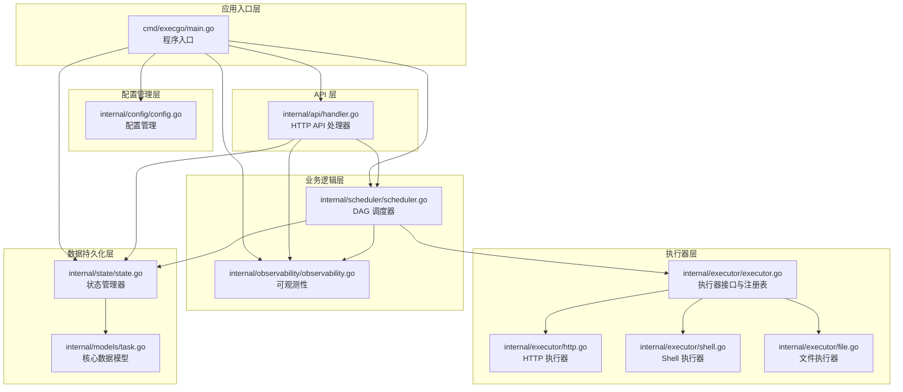
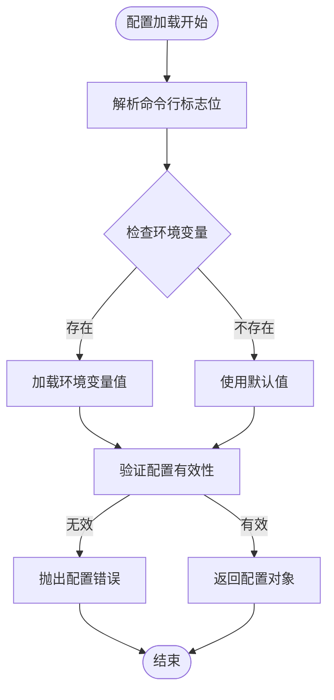
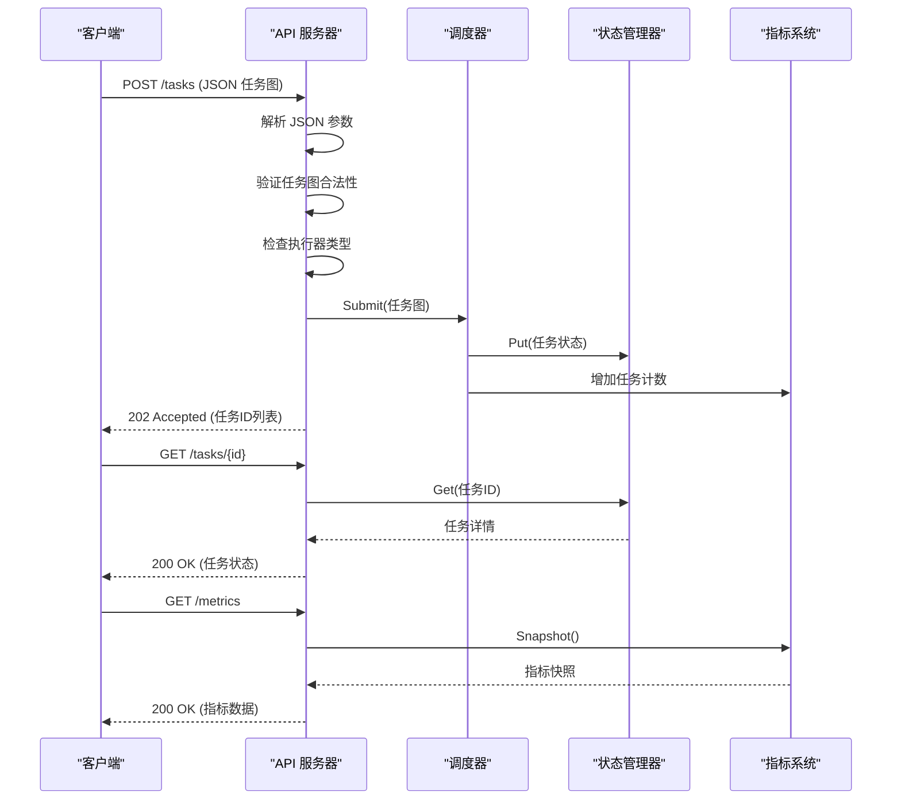
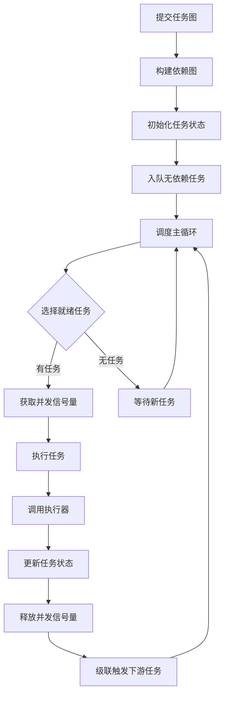
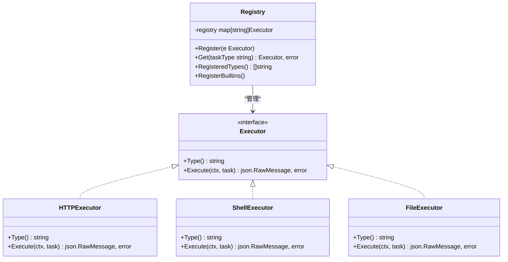
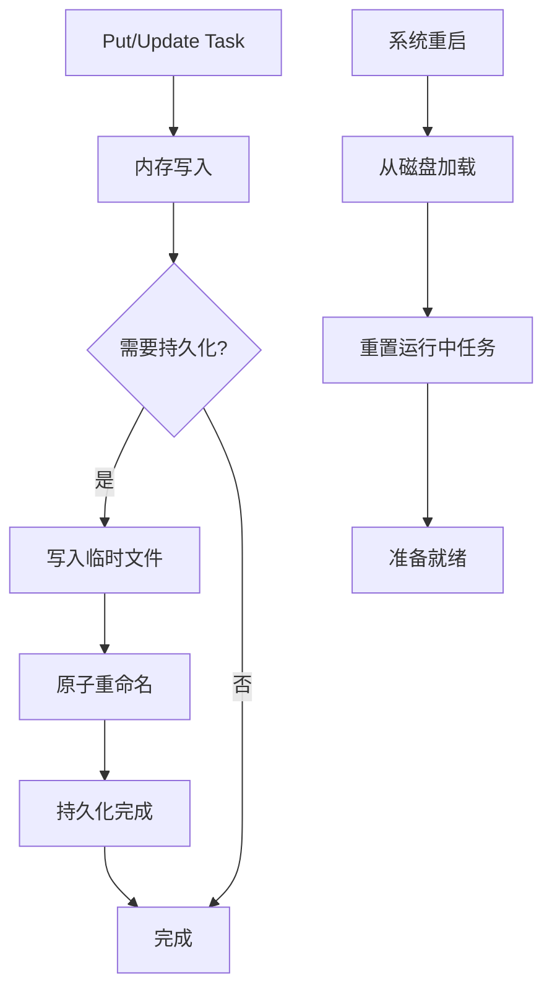
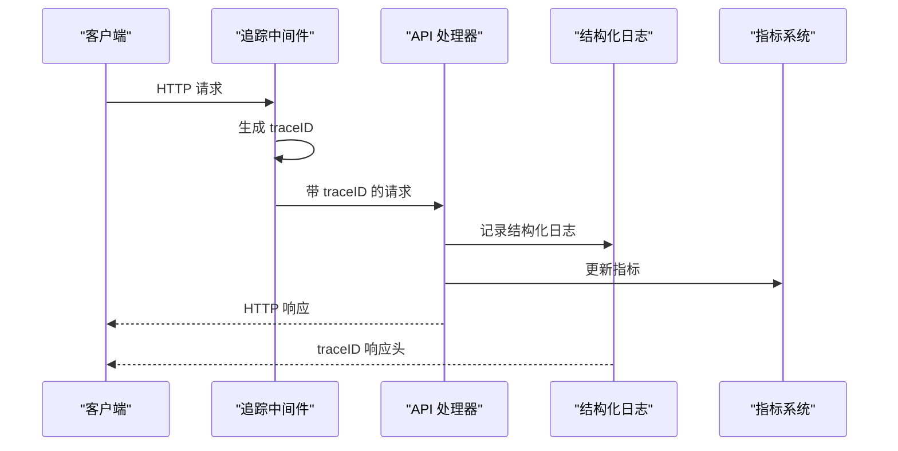
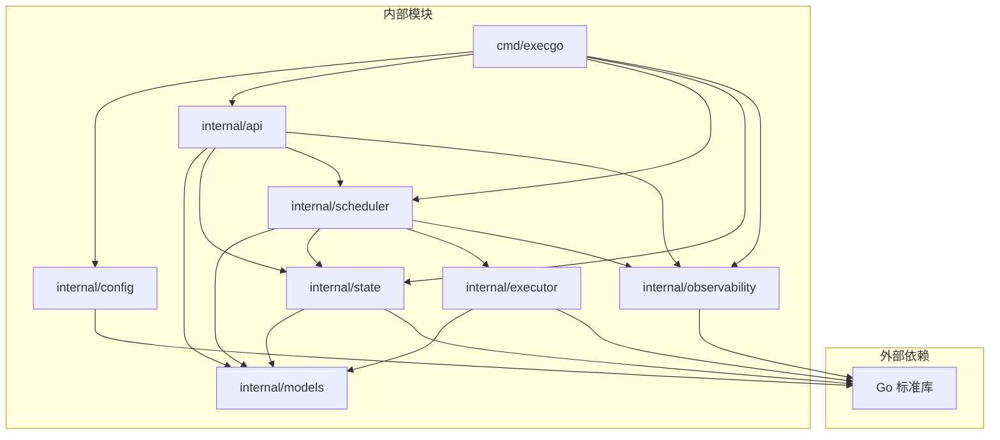

# 技术栈

<cite>
**本文档引用的文件**
- [go.mod](file://go.mod)
- [README.md](file://README.md)
- [cmd/execgo/main.go](file://cmd/execgo/main.go)
- [internal/config/config.go](file://internal/config/config.go)
- [internal/api/handler.go](file://internal/api/handler.go)
- [internal/observability/observability.go](file://internal/observability/observability.go)
- [internal/scheduler/scheduler.go](file://internal/scheduler/scheduler.go)
- [internal/state/state.go](file://internal/state/state.go)
- [internal/models/task.go](file://internal/models/task.go)
- [internal/executor/executor.go](file://internal/executor/executor.go)
- [internal/executor/http.go](file://internal/executor/http.go)
- [internal/executor/shell.go](file://internal/executor/shell.go)
- [internal/executor/file.go](file://internal/executor/file.go)
</cite>

## 目录
1. [简介](#简介)
2. [项目结构](#项目结构)
3. [核心组件](#核心组件)
4. [架构总览](#架构总览)
5. [详细组件分析](#详细组件分析)
6. [依赖关系分析](#依赖关系分析)
7. [性能考虑](#性能考虑)
8. [故障排除指南](#故障排除指南)
9. [结论](#结论)
10. [附录](#附录)

## 简介

ExecGo 是一个基于 Go 1.24+ 标准库构建的极简 AI 执行引擎，采用零第三方依赖的设计理念。该项目专为 AI Agent（如 secbot）设计，通过 HTTP API 暴露任务提交与管理能力，实现了高性能、高并发、内存安全且部署简单的执行内核。

### 技术栈优势

**Go 语言选择的核心优势：**
- **卓越性能**：编译型语言，接近 C/C++ 的执行效率，同时具备现代语言的开发体验
- **强大并发模型**：goroutine + channel 的轻量级并发模型，天然支持高并发场景
- **内存安全**：自动垃圾回收，避免内存泄漏和缓冲区溢出等常见问题
- **简单部署**：单二进制文件，无需运行时依赖，跨平台支持
- **生态成熟**：标准库丰富，社区活跃，工具链完善

**零依赖架构的独特价值：**
- **降低攻击面**：减少潜在的安全漏洞和供应链风险
- **简化维护**：无需处理第三方依赖的版本冲突和安全补丁
- **提升稳定性**：避免外部依赖的不兼容性和意外变更
- **避免供应商锁定**：完全掌控技术栈，不受任何外部厂商影响

## 项目结构

ExecGo 采用清晰的分层架构设计，遵循单一职责原则和依赖倒置原则：



**图表来源**
- [cmd/execgo/main.go:1-105](file://cmd/execgo/main.go#L1-L105)
- [internal/config/config.go:1-47](file://internal/config/config.go#L1-L47)
- [internal/api/handler.go:1-157](file://internal/api/handler.go#L1-L157)
- [internal/scheduler/scheduler.go:1-231](file://internal/scheduler/scheduler.go#L1-L231)
- [internal/state/state.go:1-180](file://internal/state/state.go#L1-L180)
- [internal/executor/executor.go:1-68](file://internal/executor/executor.go#L1-L68)

**章节来源**
- [README.md:149-177](file://README.md#L149-L177)
- [go.mod:1-4](file://go.mod#L1-L4)

## 核心组件

### 标准库组件详解

ExecGo 严格使用 Go 标准库构建，主要组件包括：

**网络与 HTTP 服务**
- `net/http`：构建高性能 HTTP 服务器，支持路由注册、中间件、超时控制
- `net/http/httptest`：用于测试（在相关文件中使用）
- `net/url`：URL 解析和处理（在相关文件中使用）

**并发与同步**
- `sync`：互斥锁、读写锁、等待组等并发原语
- `sync/atomic`：原子操作，用于高效指标统计
- `context`：上下文管理，支持超时、取消和请求追踪

**数据序列化**
- `encoding/json`：JSON 编码解码，用于 API 通信和状态持久化
- `encoding/hex`：十六进制编码，用于追踪 ID 生成

**系统交互**
- `os`：文件系统操作、进程管理、环境变量访问
- `os/signal`：信号处理，实现优雅关闭
- `time`：时间管理、定时器、休眠控制

**日志与调试**
- `log/slog`：结构化日志记录，支持 JSON 输出格式
- `crypto/rand`：安全随机数生成，用于追踪 ID

**章节来源**
- [cmd/execgo/main.go:8-23](file://cmd/execgo/main.go#L8-L23)
- [internal/observability/observability.go:5-14](file://internal/observability/observability.go#L5-L14)

## 架构总览

ExecGo 采用分层架构设计，每层职责明确，依赖方向清晰：

```mermaid
graph TB
subgraph "客户端层"
CLIENT[AI Agent<br/>HTTP 客户端]
end
subgraph "API 层"
ROUTER[HTTP 路由<br/>/tasks, /health, /metrics]
MIDDLEWARE[追踪中间件<br/>traceID 注入]
end
subgraph "业务逻辑层"
SCHEDULER[DAG 调度器<br/>并发控制 + 依赖管理]
EXEC_REGISTRY[执行器注册表<br/>动态扩展]
end
subgraph "执行层"
HTTP_EXEC[HTTP 执行器]
SHELL_EXEC[Shell 执行器<br/>白名单安全]
FILE_EXEC[文件执行器]
end
subgraph "数据层"
STATE_MEM[内存状态<br/>map[string]*Task]
PERSIST[文件持久化<br/>state.json]
end
subgraph "可观测性层"
LOGGING[结构化日志<br/>slog JSON]
METRICS[指标收集<br/>atomic 计数器]
TRACE[请求追踪<br/>traceID]
end
CLIENT --> ROUTER
ROUTER --> MIDDLEWARE
MIDDLEWARE --> SCHEDULER
SCHEDULER --> EXEC_REGISTRY
EXEC_REGISTRY --> HTTP_EXEC
EXEC_REGISTRY --> SHELL_EXEC
EXEC_REGISTRY --> FILE_EXEC
SCHEDULER --> STATE_MEM
STATE_MEM --> PERSIST
ROUTER --> LOGGING
ROUTER --> METRICS
ROUTER --> TRACE
```

**图表来源**
- [internal/api/handler.go:19-52](file://internal/api/handler.go#L19-L52)
- [internal/scheduler/scheduler.go:18-45](file://internal/scheduler/scheduler.go#L18-L45)
- [internal/state/state.go:17-53](file://internal/state/state.go#L17-L53)
- [internal/observability/observability.go:86-134](file://internal/observability/observability.go#L86-L134)

## 详细组件分析

### 配置管理系统

配置管理采用标志位 + 环境变量 + 默认值的三层优先级策略：



**图表来源**
- [internal/config/config.go:18-30](file://internal/config/config.go#L18-L30)
- [internal/config/config.go:32-46](file://internal/config/config.go#L32-L46)

配置项说明：
- `HTTPAddr`：监听地址，默认 `:8080`
- `DataDir`：数据持久化目录，默认 `data`
- `MaxConcurrency`：最大并发数，默认 `10`
- `ShutdownTimeout`：优雅关闭超时，默认 `15` 秒

**章节来源**
- [internal/config/config.go:10-16](file://internal/config/config.go#L10-L16)
- [internal/config/config.go:20-30](file://internal/config/config.go#L20-L30)

### HTTP API 层

API 层提供 RESTful 接口，支持任务提交、查询、删除和健康检查：



**图表来源**
- [internal/api/handler.go:58-99](file://internal/api/handler.go#L58-L99)
- [internal/api/handler.go:101-116](file://internal/api/handler.go#L101-L116)
- [internal/api/handler.go:137-146](file://internal/api/handler.go#L137-L146)

**章节来源**
- [internal/api/handler.go:19-52](file://internal/api/handler.go#L19-L52)
- [internal/api/handler.go:58-146](file://internal/api/handler.go#L58-L146)

### DAG 调度器

调度器实现基于有向无环图(DAG)的任务调度，支持并发控制和依赖管理：



**图表来源**
- [internal/scheduler/scheduler.go:69-97](file://internal/scheduler/scheduler.go#L69-L97)
- [internal/scheduler/scheduler.go:109-125](file://internal/scheduler/scheduler.go#L109-L125)
- [internal/scheduler/scheduler.go:192-222](file://internal/scheduler/scheduler.go#L192-L222)

并发控制机制：
- 使用通道(channel)实现就绪队列
- 使用信号量控制最大并发数
- 使用等待组确保优雅关闭

**章节来源**
- [internal/scheduler/scheduler.go:18-45](file://internal/scheduler/scheduler.go#L18-L45)
- [internal/scheduler/scheduler.go:109-190](file://internal/scheduler/scheduler.go#L109-L190)

### 执行器系统

执行器采用插件化设计，支持动态注册和扩展：



**图表来源**
- [internal/executor/executor.go:14-20](file://internal/executor/executor.go#L14-L20)
- [internal/executor/executor.go:31-48](file://internal/executor/executor.go#L31-L48)
- [internal/executor/http.go:22-25](file://internal/executor/http.go#L22-L25)
- [internal/executor/shell.go:31-34](file://internal/executor/shell.go#L31-L34)
- [internal/executor/file.go:20-23](file://internal/executor/file.go#L20-L23)

安全机制：
- Shell 执行器采用白名单命令机制
- HTTP 执行器支持超时控制
- 文件执行器防止目录遍历攻击

**章节来源**
- [internal/executor/executor.go:14-68](file://internal/executor/executor.go#L14-L68)
- [internal/executor/http.go:27-75](file://internal/executor/http.go#L27-L75)
- [internal/executor/shell.go:36-79](file://internal/executor/shell.go#L36-L79)
- [internal/executor/file.go:25-113](file://internal/executor/file.go#L25-L113)

### 状态管理系统

状态管理器提供内存存储和文件持久化的双重保障：



**图表来源**
- [internal/state/state.go:55-108](file://internal/state/state.go#L55-L108)
- [internal/state/state.go:110-134](file://internal/state/state.go#L110-L134)
- [internal/state/state.go:136-158](file://internal/state/state.go#L136-L158)

持久化策略：
- 使用临时文件 + 原子重命名确保数据一致性
- 支持定期持久化和优雅关闭时的最终持久化
- 系统恢复时自动重置运行中任务状态

**章节来源**
- [internal/state/state.go:17-53](file://internal/state/state.go#L17-L53)
- [internal/state/state.go:160-179](file://internal/state/state.go#L160-L179)

### 可观测性系统

可观测性系统提供完整的监控和诊断能力：



**图表来源**
- [internal/observability/observability.go:69-80](file://internal/observability/observability.go#L69-L80)
- [internal/observability/observability.go:50-63](file://internal/observability/observability.go#L50-L63)
- [internal/observability/observability.go:86-134](file://internal/observability/observability.go#L86-L134)

指标类型：
- 总任务数、运行中任务数、成功/失败任务数
- 按执行器类型分类的任务计数
- 原子操作保证并发安全性

**章节来源**
- [internal/observability/observability.go:16-45](file://internal/observability/observability.go#L16-L45)
- [internal/observability/observability.go:86-134](file://internal/observability/observability.go#L86-L134)

## 依赖关系分析

ExecGo 采用严格的单向依赖关系，避免循环依赖：



**图表来源**
- [cmd/execgo/main.go:17-22](file://cmd/execgo/main.go#L17-L22)
- [internal/api/handler.go:12-16](file://internal/api/handler.go#L12-L16)
- [internal/scheduler/scheduler.go:12-15](file://internal/scheduler/scheduler.go#L12-L15)

**章节来源**
- [cmd/execgo/main.go:17-22](file://cmd/execgo/main.go#L17-L22)
- [internal/api/handler.go:12-16](file://internal/api/handler.go#L12-L16)

## 性能考虑

### 并发模型优化

ExecGo 采用多层并发优化策略：

**goroutine 池管理**
- 使用信号量控制最大并发数，避免资源耗尽
- 任务执行采用独立 goroutine，充分利用 CPU 核心
- 等待组确保优雅关闭时的资源清理

**内存优化**
- 使用 `json.RawMessage` 避免重复解码
- 读写锁分离读写操作，提升并发性能
- 原子操作保证指标统计的线程安全

**I/O 优化**
- HTTP 请求设置合理的超时时间
- 文件操作使用缓冲区减少系统调用
- JSON 序列化使用缩进格式便于调试

### 内存安全保证

- 自动垃圾回收避免内存泄漏
- 上下文取消机制确保 goroutine 正确退出
- 只读共享状态使用读写锁保护

## 故障排除指南

### 常见问题诊断

**HTTP 服务无法启动**
- 检查端口占用情况
- 验证配置参数的有效性
- 查看日志中的错误信息

**任务执行失败**
- 检查执行器类型是否正确
- 验证任务参数的合法性
- 查看执行器返回的错误信息

**数据持久化异常**
- 检查数据目录权限
- 验证磁盘空间充足
- 查看持久化日志

**章节来源**
- [internal/api/handler.go:63-85](file://internal/api/handler.go#L63-L85)
- [internal/state/state.go:110-134](file://internal/state/state.go#L110-L134)

## 结论

ExecGo 通过采用 Go 1.24+ 标准库和零第三方依赖的设计理念，成功构建了一个高性能、高可用、易维护的 AI 执行引擎。该技术栈具有以下显著优势：

**技术优势**
- 基于成熟的 Go 生态系统，性能优异且稳定可靠
- 标准库功能完整，无需额外依赖
- 并发模型先进，天然支持高并发场景

**架构优势**
- 分层清晰，职责明确，易于理解和维护
- 插件化设计，支持灵活扩展
- 完善的可观测性，便于运维监控

**运维优势**
- 零依赖部署，简化运维复杂度
- 优雅关闭机制，确保数据一致性
- 结构化日志和指标，便于问题定位

对于需要构建生产级 AI 执行引擎的团队，ExecGo 提供了优秀的参考实现和技术方案。

## 附录

### 版本兼容性

**Go 版本要求**
- 最低版本：Go 1.24.5
- 推荐版本：Go 1.24.x 系列
- 兼容性：向后兼容 Go 1.22+

**升级注意事项**
- 升级前备份数据目录
- 测试执行器兼容性
- 验证配置参数有效性
- 监控指标变化趋势

### 配置选项详解

| 配置项 | 环境变量 | 默认值 | 说明 |
|--------|----------|--------|------|
| `-addr` | `EXECGO_ADDR` | `:8080` | HTTP 监听地址 |
| `-data-dir` | `EXECGO_DATA_DIR` | `data` | 数据持久化目录 |
| `-max-concurrency` | `EXECGO_MAX_CONCURRENCY` | `10` | 最大并发执行数 |
| `-shutdown-timeout` | `EXECGO_SHUTDOWN_TIMEOUT` | `15` | 优雅关闭超时(秒) |

### 扩展指南

添加自定义执行器的步骤：
1. 实现 `Executor` 接口
2. 在 `init()` 函数中注册执行器
3. 在任务参数中使用新的执行器类型
4. 测试执行器的功能和安全性