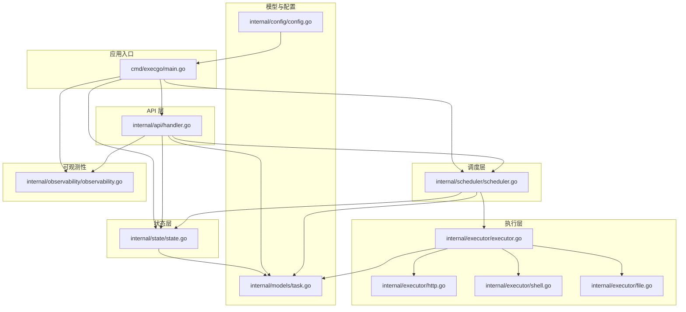
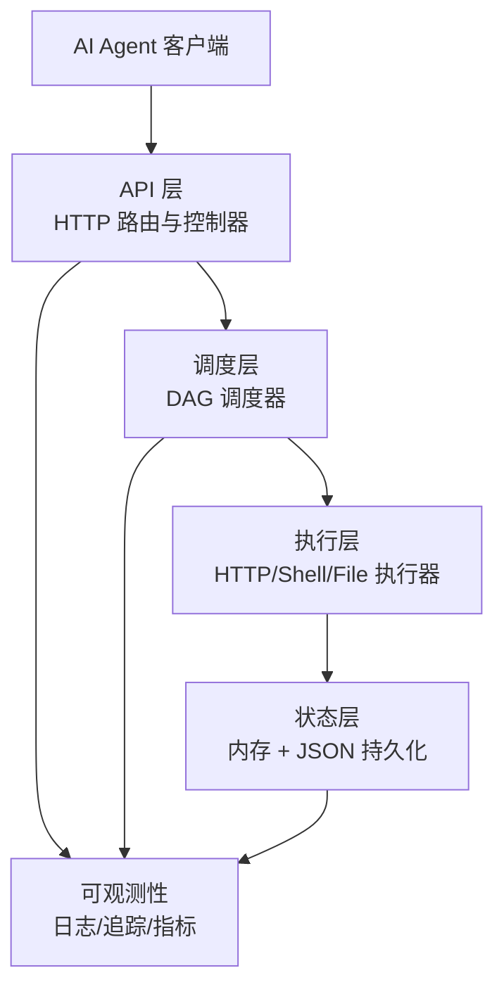
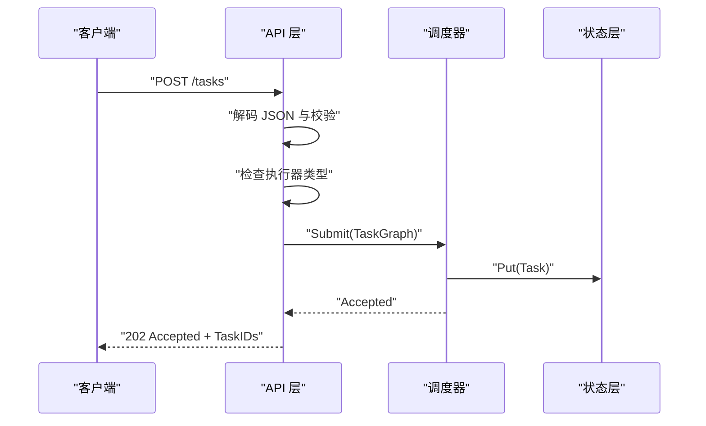
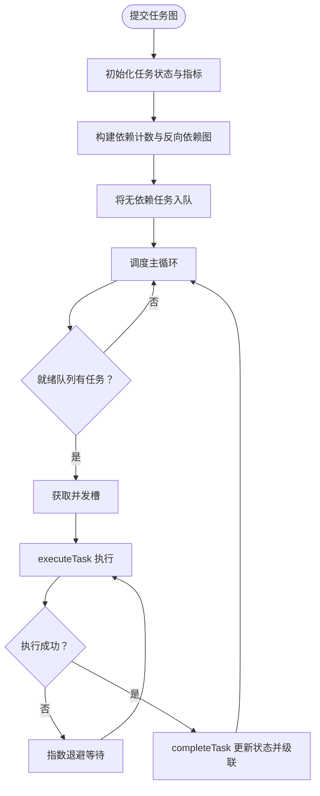
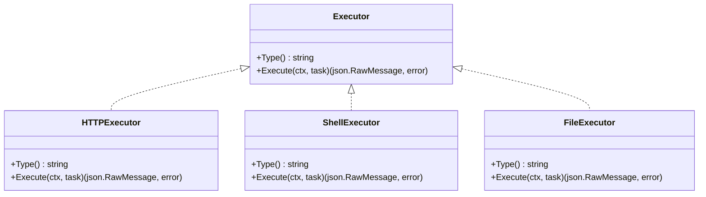
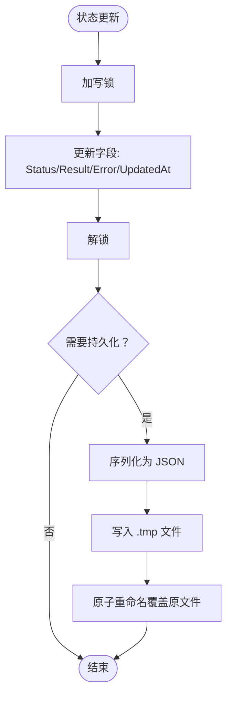
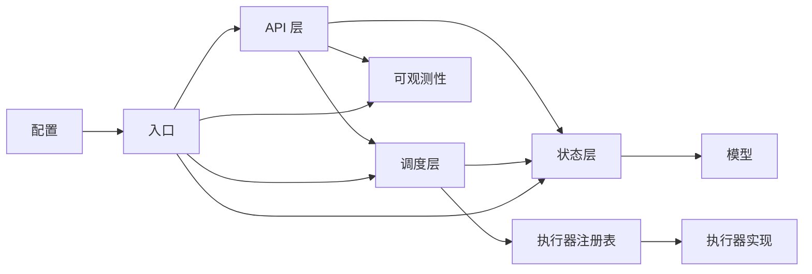

# 架构概览

<cite>
**本文档引用的文件**
- [main.go](file://cmd/execgo/main.go)
- [handler.go](file://internal/api/handler.go)
- [scheduler.go](file://internal/scheduler/scheduler.go)
- [executor.go](file://internal/executor/executor.go)
- [http.go](file://internal/executor/http.go)
- [shell.go](file://internal/executor/shell.go)
- [file.go](file://internal/executor/file.go)
- [state.go](file://internal/state/state.go)
- [task.go](file://internal/models/task.go)
- [config.go](file://internal/config/config.go)
- [observability.go](file://internal/observability/observability.go)
- [go.mod](file://go.mod)
- [README.md](file://README.md)
</cite>

## 目录
1. [简介](#简介)
2. [项目结构](#项目结构)
3. [核心组件](#核心组件)
4. [架构总览](#架构总览)
5. [详细组件分析](#详细组件分析)
6. [依赖关系分析](#依赖关系分析)
7. [性能考量](#性能考量)
8. [故障排查指南](#故障排查指南)
9. [结论](#结论)
10. [附录](#附录)

## 简介
ExecGo 是一个使用纯 Go 标准库构建的极简 AI 执行引擎，提供任务提交、DAG 调度、并发执行与可观测性能力。系统采用分层架构（API Layer → Scheduler → Executor → State），通过 HTTP API 暴露任务提交与查询接口，内部以 DAG 依赖图驱动任务执行，并通过注册表机制扩展执行器类型。系统具备零第三方依赖、结构化日志、请求追踪、指标采集、优雅关闭与崩溃恢复等特性。

## 项目结构
项目采用按功能域划分的分层组织方式，入口位于 cmd/execgo/main.go，核心业务逻辑分布在 internal 下的各子包中：
- cmd/execgo：应用入口与生命周期管理
- internal/api：HTTP API 层，路由与控制器
- internal/scheduler：DAG 调度器，负责并发与依赖控制
- internal/executor：执行器接口与内置实现（HTTP/Shell/File）
- internal/state：任务状态管理与持久化
- internal/models：任务 DSL 与核心数据结构
- internal/config：配置加载与环境变量解析
- internal/observability：日志、追踪与指标
- data：持久化数据目录（state.json）

**图表来源**
- [main.go:25-104](file://cmd/execgo/main.go#L25-L104)
- [handler.go:39-52](file://internal/api/handler.go#L39-L52)
- [scheduler.go:34-45](file://internal/scheduler/scheduler.go#L34-L45)
- [executor.go:31-67](file://internal/executor/executor.go#L31-L67)
- [state.go:25-53](file://internal/state/state.go#L25-L53)
- [task.go:36-79](file://internal/models/task.go#L36-L79)
- [config.go:18-30](file://internal/config/config.go#L18-L30)
- [observability.go:49-80](file://internal/observability/observability.go#L49-L80)

**章节来源**
- [README.md:149-177](file://README.md#L149-L177)
- [go.mod:1-4](file://go.mod#L1-L4)

## 核心组件
- 应用入口与生命周期：负责配置加载、日志初始化、执行器注册、状态管理器初始化、调度器启动、HTTP 服务启动与优雅关闭。
- API 层：提供任务提交、查询、删除、健康检查与指标端点；统一错误响应与健康响应；通过追踪中间件注入 traceID。
- 调度器：基于 DAG 的并发调度器，维护就绪队列、并发信号量、依赖计数与反向依赖图，支持指数退避重试与超时控制。
- 执行器：定义统一接口与全局注册表，内置 HTTP/Shell/File 执行器，支持扩展。
- 状态管理：内存映射存储任务，支持原子状态更新；定期持久化至 JSON 文件，崩溃后恢复时将 running 状态重置为 pending。
- 模型与验证：Task/TaskGraph 数据结构与校验（去重、依赖合法性、环检测），统一响应结构。
- 配置：支持命令行参数与环境变量，优先级为 flag > env > default。
- 可观测性：结构化 JSON 日志、请求追踪（traceID）、指标采集（总数、运行中、成功、失败、按类型统计）。

**章节来源**
- [main.go:25-104](file://cmd/execgo/main.go#L25-L104)
- [handler.go:19-52](file://internal/api/handler.go#L19-L52)
- [scheduler.go:18-45](file://internal/scheduler/scheduler.go#L18-L45)
- [executor.go:14-67](file://internal/executor/executor.go#L14-L67)
- [state.go:17-53](file://internal/state/state.go#L17-L53)
- [task.go:21-79](file://internal/models/task.go#L21-L79)
- [config.go:10-30](file://internal/config/config.go#L10-L30)
- [observability.go:86-134](file://internal/observability/observability.go#L86-L134)

## 架构总览
ExecGo 采用清晰的分层架构，系统边界明确，数据流从 API 层进入，经调度层处理后分发到执行层，执行结果回传并更新状态层，同时通过可观测性模块输出日志、追踪与指标。

**图表来源**
- [README.md:32-57](file://README.md#L32-L57)
- [handler.go:39-52](file://internal/api/handler.go#L39-L52)
- [scheduler.go:47-58](file://internal/scheduler/scheduler.go#L47-L58)
- [executor.go:62-67](file://internal/executor/executor.go#L62-L67)
- [state.go:160-179](file://internal/state/state.go#L160-L179)
- [observability.go:69-80](file://internal/observability/observability.go#L69-L80)

## 详细组件分析

### API 层（HTTP API）
职责
- 提供任务提交、查询、删除、健康检查与指标端点
- 统一错误响应与健康响应
- 通过追踪中间件注入 traceID，便于跨组件关联

关键流程
- 提交任务图：解码 JSON、校验 TaskGraph、检查执行器类型、提交到调度器并返回 Accepted 与 TaskIDs
- 查询任务：按 ID 获取或列出全部任务
- 删除任务：按 ID 删除
- 健康检查：返回状态、版本与运行时长
- 指标端点：返回任务总数、运行中、成功、失败与按类型统计

**图表来源**
- [handler.go:58-99](file://internal/api/handler.go#L58-L99)
- [scheduler.go:69-97](file://internal/scheduler/scheduler.go#L69-L97)
- [state.go:55-60](file://internal/state/state.go#L55-L60)

**章节来源**
- [handler.go:39-146](file://internal/api/handler.go#L39-L146)

### 调度层（DAG 调度器）
职责
- 维护就绪队列与并发信号量，控制最大并发
- 构建依赖计数与反向依赖图，实现拓扑排序与级联触发
- 支持任务超时与指数退避重试
- 失败时级联跳过下游依赖

关键数据结构
- readyQueue：容量为 1024 的通道，存放可执行任务
- semaphore：信号量，控制最大并发
- depCount：任务剩余依赖计数
- dependents：反向依赖图，记录谁依赖该任务完成

执行流程
- Submit：初始化任务状态、计数指标、构建依赖图，将无依赖任务入队
- loop：从就绪队列取出任务，获取并发槽，异步执行
- executeTask：选择执行器、更新状态为 running、按 retry 次数与超时执行、记录结果与错误
- completeTask：根据结果更新状态，成功则级联触发下游，失败则跳过并级联

**图表来源**
- [scheduler.go:69-97](file://internal/scheduler/scheduler.go#L69-L97)
- [scheduler.go:109-125](file://internal/scheduler/scheduler.go#L109-L125)
- [scheduler.go:127-190](file://internal/scheduler/scheduler.go#L127-L190)
- [scheduler.go:192-222](file://internal/scheduler/scheduler.go#L192-L222)

**章节来源**
- [scheduler.go:18-231](file://internal/scheduler/scheduler.go#L18-L231)

### 执行层（执行器）
职责
- 定义统一 Executor 接口与全局注册表
- 内置 HTTP/Shell/File 执行器，支持扩展

接口与注册表
- Executor：Type() 返回类型标识，Execute(ctx, task) 执行并返回结果
- 注册表：线程安全的 map，支持注册、获取与列举类型

内置执行器
- HTTPExecutor：解析参数、构造请求、发送请求、读取响应、限制响应大小
- ShellExecutor：白名单命令校验、执行命令、捕获 stdout/stderr/exit_code
- FileExecutor：路径清理防穿越、支持 read/write/append/delete/stat

**图表来源**
- [executor.go:14-67](file://internal/executor/executor.go#L14-L67)
- [http.go:22-76](file://internal/executor/http.go#L22-L76)
- [shell.go:31-80](file://internal/executor/shell.go#L31-L80)
- [file.go:20-114](file://internal/executor/file.go#L20-L114)

**章节来源**
- [executor.go:14-67](file://internal/executor/executor.go#L14-L67)
- [http.go:14-76](file://internal/executor/http.go#L14-L76)
- [shell.go:14-80](file://internal/executor/shell.go#L14-L80)
- [file.go:13-114](file://internal/executor/file.go#L13-L114)

### 状态层（任务状态管理与持久化）
职责
- 内存映射存储任务，提供原子更新
- 定期持久化至 JSON 文件，崩溃恢复时将 running 状态重置为 pending

关键方法
- Put/Get/GetAll/Delete：任务 CRUD
- UpdateStatus：原子更新状态、结果与错误信息
- Persist：序列化并原子写入临时文件后重命名
- StartPeriodicPersist：周期性持久化与优雅关闭前最终持久化

**图表来源**
- [state.go:94-108](file://internal/state/state.go#L94-L108)
- [state.go:110-134](file://internal/state/state.go#L110-L134)
- [state.go:160-179](file://internal/state/state.go#L160-L179)

**章节来源**
- [state.go:17-180](file://internal/state/state.go#L17-L180)

### 模型与验证（Task DSL）
职责
- 定义 Task/TaskGraph 数据结构与状态枚举
- 校验任务图合法性：非空、唯一 ID、类型存在、依赖引用合法、无环

校验算法
- 环检测采用 Kahn 算法：计算入度、入度为 0 的节点入队、BFS 遍历，若访问数不等于节点数则存在环

**章节来源**
- [task.go:10-79](file://internal/models/task.go#L10-L79)

### 配置（Config）
职责
- 从命令行参数与环境变量加载配置，支持优先级：flag > env > default
- 主要配置项：监听地址、数据目录、最大并发、优雅关闭超时

**章节来源**
- [config.go:10-47](file://internal/config/config.go#L10-L47)

### 可观测性（Logging/Tracing/Metrics）
职责
- 结构化 JSON 日志：slog.NewJSONHandler，默认级别 Info
- 请求追踪：生成与注入 traceID，中间件设置响应头
- 指标：任务总数、运行中、成功、失败、按类型统计，支持快照

**章节来源**
- [observability.go:49-134](file://internal/observability/observability.go#L49-L134)

## 依赖关系分析
组件耦合与内聚
- API 层依赖调度器、状态管理器与可观测性模块，保持对执行器的解耦（通过注册表间接依赖）
- 调度器依赖状态管理器与执行器注册表，内部通过接口隔离具体执行器实现
- 执行器实现彼此独立，通过统一接口与注册表进行组合
- 状态层与模型层低耦合，仅在状态更新时使用模型类型
- 配置与入口模块为系统提供外部输入，其余模块尽量避免直接依赖配置

**图表来源**
- [handler.go:19-37](file://internal/api/handler.go#L19-L37)
- [scheduler.go:19-44](file://internal/scheduler/scheduler.go#L19-L44)
- [executor.go:26-67](file://internal/executor/executor.go#L26-L67)
- [state.go:17-53](file://internal/state/state.go#L17-L53)
- [task.go:21-39](file://internal/models/task.go#L21-L39)
- [config.go:18-30](file://internal/config/config.go#L18-L30)
- [main.go:25-62](file://cmd/execgo/main.go#L25-L62)

**章节来源**
- [main.go:25-62](file://cmd/execgo/main.go#L25-L62)
- [handler.go:19-37](file://internal/api/handler.go#L19-L37)
- [scheduler.go:19-44](file://internal/scheduler/scheduler.go#L19-L44)
- [executor.go:26-67](file://internal/executor/executor.go#L26-L67)
- [state.go:17-53](file://internal/state/state.go#L17-L53)
- [task.go:21-39](file://internal/models/task.go#L21-L39)
- [config.go:18-30](file://internal/config/config.go#L18-L30)

## 性能考量
- 并发控制：通过信号量限制最大并发，避免资源争用；就绪队列容量为 1024，防止阻塞导致内存膨胀
- 重试策略：指数退避（上限 10 秒），降低抖动对下游的影响
- 超时控制：基于 context.WithTimeout/WithCancel，确保长时间阻塞任务可被及时终止
- 状态更新：使用 RWMutex 保证读多写少场景下的高并发读取性能
- 持久化：定期持久化（默认 30 秒），最终一致性与崩溃恢复平衡
- I/O 限制：HTTP 执行器限制响应大小（1MB），防止异常响应占用过多内存
- 白名单安全：Shell 执行器仅允许预定义命令，降低安全风险

[本节为通用性能讨论，不直接分析特定文件]

## 故障排查指南
常见问题与定位
- 提交任务报错 unknown task type：确认执行器已注册且类型正确
- 任务未执行：检查依赖图是否存在环、依赖任务是否成功
- 任务超时：调整任务 timeout 参数或优化执行器实现
- 状态未持久化：检查 data 目录权限与磁盘空间
- 指标异常：确认 /metrics 端点可用，检查指标快照是否正确

定位手段
- 查看结构化日志（traceID 关联请求链路）
- 使用 /health 与 /metrics 快速判断服务状态与负载
- 通过 /tasks/{id} 与 /tasks 列表核对任务状态与错误信息

**章节来源**
- [handler.go:76-85](file://internal/api/handler.go#L76-L85)
- [scheduler.go:127-190](file://internal/scheduler/scheduler.go#L127-L190)
- [state.go:160-179](file://internal/state/state.go#L160-L179)
- [observability.go:69-80](file://internal/observability/observability.go#L69-L80)

## 结论
ExecGo 通过清晰的分层架构与严格的职责分离，实现了从任务提交到执行、从状态管理到可观测性的完整闭环。其零依赖的设计降低了复杂度与维护成本，注册表机制使扩展新的执行器变得简单。调度器的 DAG 控制与并发信号量保障了系统的稳定性与可扩展性。建议在生产环境中结合监控与告警体系，合理设置并发与超时参数，并对执行器进行安全审计与合规审查。

[本节为总结性内容，不直接分析特定文件]

## 附录

### 技术栈与版本兼容性
- 语言与工具链：Go 1.24.5（go.mod 指定）
- 标准库：完全依赖 Go 标准库，无第三方依赖
- 平台：跨平台（Linux/macOS/Windows），注意 Shell 执行器的命令白名单差异

**章节来源**
- [go.mod:1-4](file://go.mod#L1-L4)
- [README.md:5-7](file://README.md#L5-L7)

### 部署拓扑与基础设施需求
- 单节点部署：适合小型 AI Agent 执行场景
- 基础设施：CPU/内存按并发与任务复杂度评估；磁盘用于持久化 JSON 文件
- 网络：暴露 HTTP 监听地址，建议置于内网或受控网络
- 安全：启用最小权限的数据目录；Shell 执行器仅允许白名单命令

[本节为概念性内容，不直接分析特定文件]

### 横切关注点
- 安全性：Shell 命令白名单、文件路径清理防止目录穿越、HTTP 响应大小限制
- 监控：结构化日志、traceID 追踪、/metrics 指标端点
- 灾难恢复：定期持久化、崩溃恢复时将 running 状态重置为 pending

**章节来源**
- [shell.go:14-22](file://internal/executor/shell.go#L14-L22)
- [file.go:35-51](file://internal/executor/file.go#L35-L51)
- [http.go:60-75](file://internal/executor/http.go#L60-L75)
- [state.go:160-179](file://internal/state/state.go#L160-L179)
- [observability.go:49-134](file://internal/observability/observability.go#L49-L134)