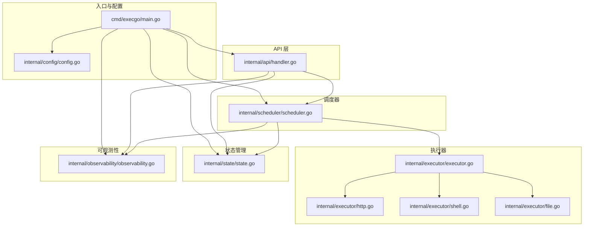
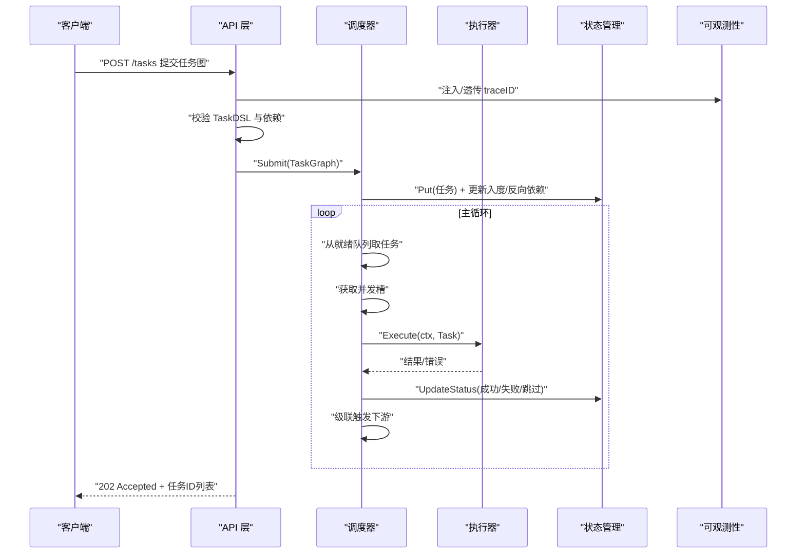
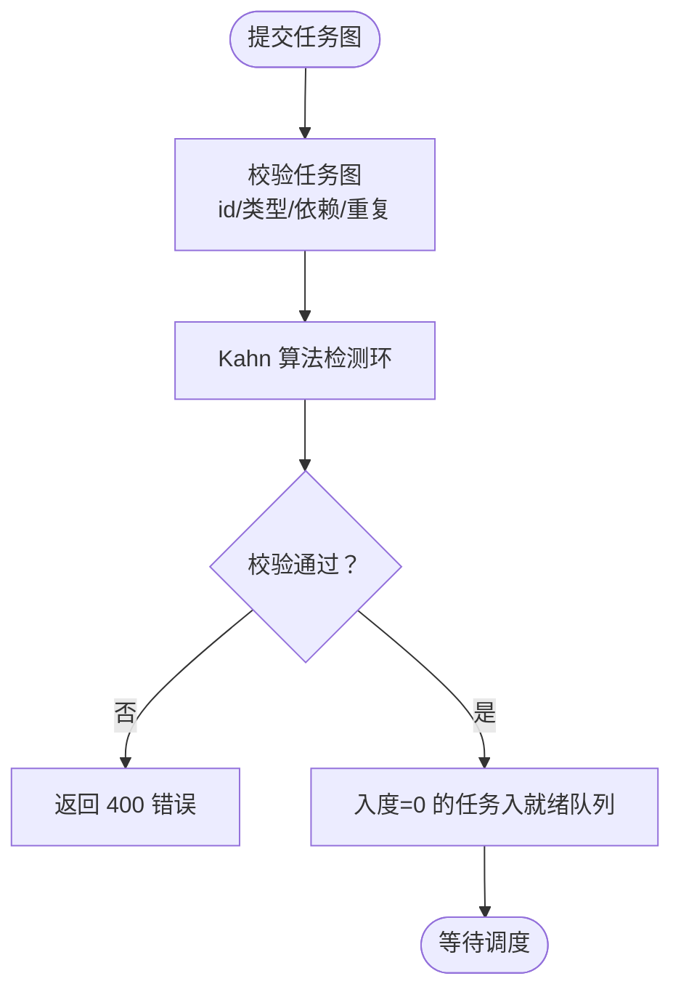
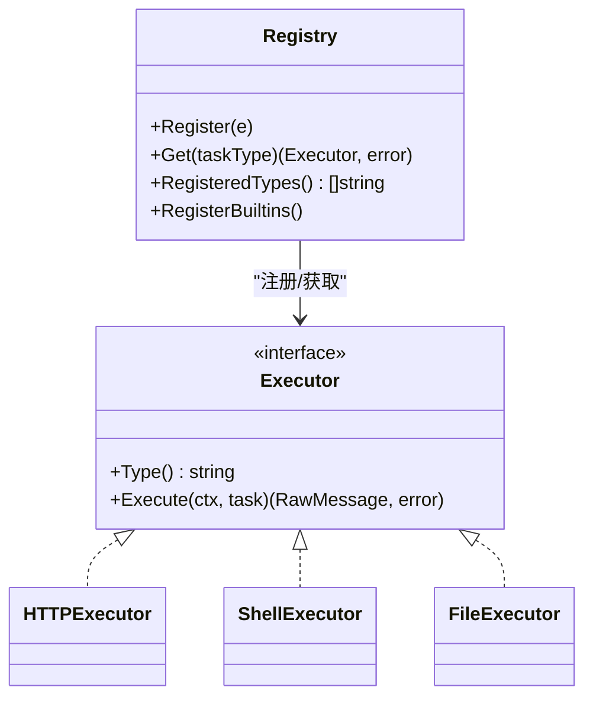
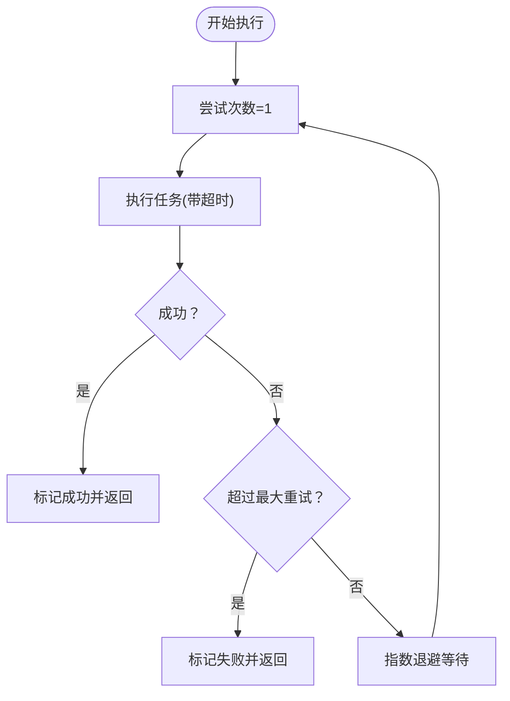
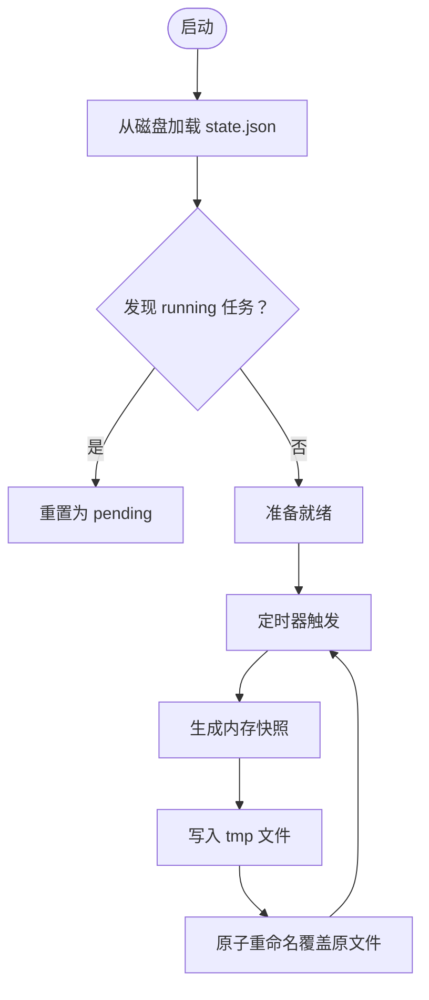
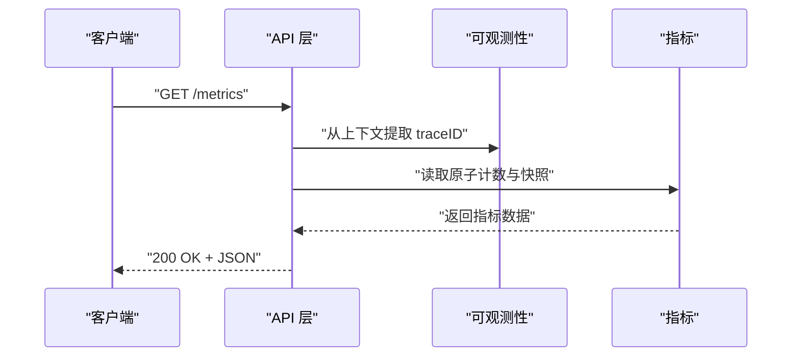
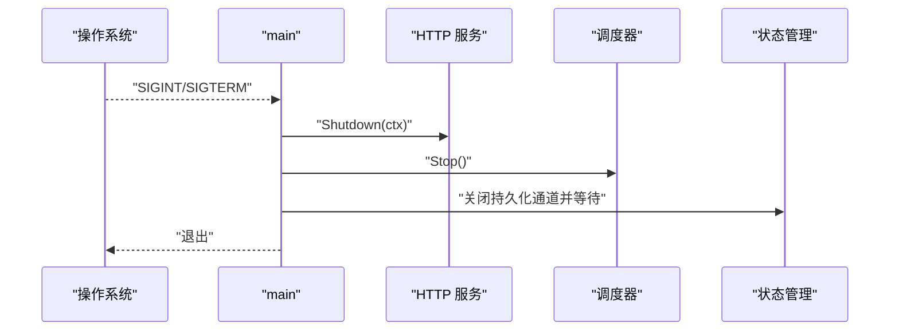
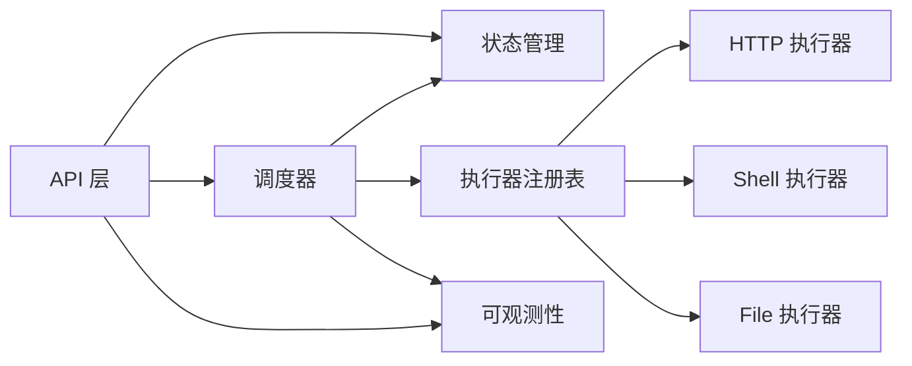

# 核心特性

<cite>
**本文引用的文件**
- [main.go](file://cmd/execgo/main.go)
- [config.go](file://internal/config/config.go)
- [task.go](file://internal/models/task.go)
- [scheduler.go](file://internal/scheduler/scheduler.go)
- [executor.go](file://internal/executor/executor.go)
- [http.go](file://internal/executor/http.go)
- [shell.go](file://internal/executor/shell.go)
- [file.go](file://internal/executor/file.go)
- [state.go](file://internal/state/state.go)
- [handler.go](file://internal/api/handler.go)
- [observability.go](file://internal/observability/observability.go)
- [README.md](file://README.md)
</cite>

## 目录
1. [简介](#简介)
2. [项目结构](#项目结构)
3. [核心组件](#核心组件)
4. [架构总览](#架构总览)
5. [详细组件分析](#详细组件分析)
6. [依赖分析](#依赖分析)
7. [性能考虑](#性能考虑)
8. [故障排查指南](#故障排查指南)
9. [结论](#结论)
10. [附录](#附录)

## 简介
本章节概述 ExecGo 的核心特性与设计目标：以极简、零依赖的纯 Go 标准库实现，提供面向 AI Agent 的任务执行内核，具备严格的任务契约（Task DSL）、DAG 调度（Kahn 算法）、并发执行（goroutine + channel + 信号量）、可插拔执行器（HTTP/Shell/File + 注册表）、重试与超时（指数退避 + context 超时）、状态持久化（内存 + JSON 文件定期持久化）、可观测性（结构化 JSON 日志 + traceID + /metrics）以及优雅关闭（信号监听 → HTTP 关闭 → 调度器停止 → 状态持久化）。

## 项目结构
ExecGo 采用清晰的分层架构：入口程序负责初始化与优雅关闭；API 层处理 HTTP 请求；调度器负责 DAG 编排与并发控制；执行器模块提供可插拔的执行能力；状态管理器负责内存与持久化；可观测性模块提供日志、追踪与指标；配置模块统一管理运行参数。



图表来源
- [main.go:25-104](file://cmd/execgo/main.go#L25-L104)
- [config.go:18-30](file://internal/config/config.go#L18-L30)
- [handler.go:39-52](file://internal/api/handler.go#L39-L52)
- [scheduler.go:18-45](file://internal/scheduler/scheduler.go#L18-L45)
- [executor.go:14-67](file://internal/executor/executor.go#L14-L67)
- [state.go:17-53](file://internal/state/state.go#L17-L53)
- [observability.go:50-80](file://internal/observability/observability.go#L50-L80)

章节来源
- [README.md:149-177](file://README.md#L149-L177)
- [main.go:25-104](file://cmd/execgo/main.go#L25-L104)

## 核心组件
- 任务 DSL（严格的任务契约）：定义 Task 与 TaskGraph 的字段、校验规则与拓扑排序环检测。
- DAG 调度（Kahn 算法）：构建入度与反向依赖图，维护就绪队列与并发信号量，按拓扑序推进。
- 并发执行：goroutine + channel + 信号量，控制最大并发与背压。
- 可插拔执行器：统一 Executor 接口 + 注册表，内置 HTTP/Shell/File 执行器。
- 重试与超时：指数退避重试 + context 超时控制。
- 状态持久化：内存存储 + JSON 文件定期持久化，崩溃恢复时重置 running 为 pending。
- 可观测性：结构化 JSON 日志 + traceID 追踪 + /metrics 端点。
- 优雅关闭：信号监听 → HTTP 关闭 → 调度器停止 → 状态最终持久化。

章节来源
- [task.go:21-79](file://internal/models/task.go#L21-L79)
- [scheduler.go:18-231](file://internal/scheduler/scheduler.go#L18-L231)
- [executor.go:14-67](file://internal/executor/executor.go#L14-L67)
- [state.go:17-180](file://internal/state/state.go#L17-L180)
- [observability.go:50-134](file://internal/observability/observability.go#L50-L134)
- [main.go:25-104](file://cmd/execgo/main.go#L25-L104)

## 架构总览
下图展示 ExecGo 的端到端流程：客户端通过 HTTP API 提交任务图，API 层进行校验与路由，调度器根据 DAG 与并发策略执行任务，执行器按类型执行具体动作，状态管理器负责内存与持久化，可观测性贯穿始终。



图表来源
- [handler.go:58-99](file://internal/api/handler.go#L58-L99)
- [scheduler.go:69-231](file://internal/scheduler/scheduler.go#L69-L231)
- [executor.go:14-67](file://internal/executor/executor.go#L14-L67)
- [state.go:55-108](file://internal/state/state.go#L55-L108)
- [observability.go:69-80](file://internal/observability/observability.go#L69-L80)

## 详细组件分析

### 任务 DSL（严格的任务契约）
- 核心数据结构
  - Task：包含 id、type、params、depends_on、retry、timeout、status、result、error、createdAt、updatedAt。
  - TaskGraph：包含 tasks 列表。
- 校验规则
  - 任务非空、id 唯一且非空、type 非空、依赖引用合法且无自依赖。
  - 使用 Kahn 算法检测环：统计入度、BFS 遍历，若访问数不等于任务数则存在环。
- 使用场景
  - 保证提交的任务图在进入调度前即满足约束，避免无效 DAG。
- 最佳实践
  - 明确设置 retry 与 timeout，合理规划 depends_on 形成 DAG。
  - 对于外部系统调用使用 http 执行器，对本地操作使用 file 或 shell 执行器。



图表来源
- [task.go:41-79](file://internal/models/task.go#L41-L79)
- [task.go:81-121](file://internal/models/task.go#L81-L121)

章节来源
- [task.go:21-79](file://internal/models/task.go#L21-L79)
- [task.go:81-121](file://internal/models/task.go#L81-L121)

### DAG 调度（基于 Kahn 算法的依赖图编排）
- 关键结构
  - readyQueue：容量为 1024 的通道，承载可执行任务。
  - semaphore：长度为 MaxConcurrency 的通道，控制并发槽。
  - depCount：记录每个任务剩余依赖数。
  - dependents：反向依赖图，记录谁依赖该任务。
- 工作流程
  - Submit：初始化任务状态、入度与反向依赖图，并将入度为 0 的任务入队。
  - loop：从 readyQueue 取任务，获取并发槽后异步执行。
  - executeTask：获取执行器、标记 running、指数退避重试、context 超时控制。
  - completeTask：更新状态，成功则级联触发下游，失败则标记下游 skipped 并递归级联。
- 使用场景
  - 复杂工作流：先拉取数据，再写入文件，最后校验结果。
- 最佳实践
  - 控制 MaxConcurrency，避免资源争用。
  - 为长耗时任务设置合理 timeout，防止阻塞。

```mermaid
classDiagram
class Scheduler {
-readyQueue chan Task
-semaphore chan struct{}
-depCount map[string]int
-dependents map[string][]string
+Start(ctx)
+Stop()
+Submit(graph)
-enqueue(task)
-loop(ctx)
-executeTask(ctx, task)
-completeTask(task, status, result, errMsg)
-cascadeSkip(taskID)
}
```

图表来源
- [scheduler.go:18-45](file://internal/scheduler/scheduler.go#L18-L45)

章节来源
- [scheduler.go:47-231](file://internal/scheduler/scheduler.go#L47-L231)

### 并发执行（goroutine + channel 并发模型 + 信号量控制）
- 并发模型
  - readyQueue：缓冲通道，避免阻塞提交线程。
  - semaphore：固定容量通道，确保最多同时执行 N 个任务。
  - wg：等待组，保证优雅关闭时所有 goroutine 完成。
- 背压与限流
  - 当 readyQueue 满时，异步补入，避免阻塞。
  - 通过信号量限制并发，防止资源耗尽。
- 使用场景
  - 大批量任务并行执行，同时控制资源占用。
- 最佳实践
  - 根据机器 CPU/IO 能力调整 MaxConcurrency。
  - 对 IO 密集型任务（HTTP/文件）可适当提高并发。

章节来源
- [scheduler.go:18-67](file://internal/scheduler/scheduler.go#L18-L67)
- [scheduler.go:99-125](file://internal/scheduler/scheduler.go#L99-L125)

### 可插拔执行器（HTTP/Shell/File 内置执行器 + 注册表机制）
- 接口与注册表
  - Executor 接口：Type() 返回类型标识，Execute(ctx, task) 执行任务。
  - 注册表：全局 map，支持并发读写，提供 Register、Get、RegisteredTypes、RegisterBuiltins。
- 内置执行器
  - HTTPExecutor：解析 params（url/method/headers/body），构造请求，限制响应大小，返回状态码与 body。
  - ShellExecutor：白名单命令校验（echo、cat、ls、date、curl、grep、find 等），支持 dir 参数，捕获 stdout/stderr/exit_code。
  - FileExecutor：支持 read/write/append/delete/stat，清理路径防止目录穿越，自动创建目录。
- 使用场景
  - HTTP：调用外部 API 获取数据。
  - Shell：执行受限命令进行系统信息查询或简单处理。
  - File：读写文件、统计文件信息。
- 最佳实践
  - 优先使用白名单命令，避免任意命令执行风险。
  - 对外部 HTTP 调用设置合理 timeout，避免长时间阻塞。



图表来源
- [executor.go:14-67](file://internal/executor/executor.go#L14-L67)
- [http.go:22-76](file://internal/executor/http.go#L22-L76)
- [shell.go:31-80](file://internal/executor/shell.go#L31-L80)
- [file.go:20-114](file://internal/executor/file.go#L20-L114)

章节来源
- [executor.go:14-67](file://internal/executor/executor.go#L14-L67)
- [http.go:22-76](file://internal/executor/http.go#L22-L76)
- [shell.go:31-80](file://internal/executor/shell.go#L31-L80)
- [file.go:20-114](file://internal/executor/file.go#L20-L114)

### 重试与超时（指数退避重试 + context 超时控制）
- 指数退避
  - 第 1 次直接尝试，第 2 次起按 100ms*2^(attempt-2) 回退，上限 10 秒。
- 超时控制
  - 若 task.Timeout > 0，则为每次尝试创建带超时的 context；否则使用取消上下文。
- 执行流程
  - executeTask：循环尝试，记录每次错误，成功则退出；失败则等待回退时间。
- 使用场景
  - 外部服务不稳定、网络抖动、文件写入竞争。
- 最佳实践
  - 对易失败的外部调用设置 retry；对内部操作设置较短 timeout。



图表来源
- [scheduler.go:144-190](file://internal/scheduler/scheduler.go#L144-L190)

章节来源
- [scheduler.go:127-190](file://internal/scheduler/scheduler.go#L127-L190)

### 状态持久化（内存存储 + JSON 文件定期持久化）
- 内存存储
  - Manager 使用 map[string]*Task + RWMutex 保存当前状态。
- 文件持久化
  - 定期（默认 30 秒）将内存快照写入 state.json，先写 tmp 再原子重命名，保证一致性。
  - 启动时从磁盘加载，若发现 running 状态则重置为 pending。
- 使用场景
  - 服务重启后恢复任务状态，避免丢失。
- 最佳实践
  - 数据目录可配置，生产环境建议使用独立磁盘或持久卷。



图表来源
- [state.go:25-53](file://internal/state/state.go#L25-L53)
- [state.go:110-134](file://internal/state/state.go#L110-L134)
- [state.go:136-158](file://internal/state/state.go#L136-L158)
- [state.go:160-179](file://internal/state/state.go#L160-L179)

章节来源
- [state.go:17-180](file://internal/state/state.go#L17-L180)

### 可观测性（结构化 JSON 日志 + traceID 追踪 + /metrics 端点）
- 结构化日志
  - 使用 slog JSON Handler 输出结构化日志，便于日志聚合与检索。
- TraceID 追踪
  - TraceMiddleware 为每个请求注入 X-Trace-ID，日志中携带 trace_id，便于跨组件关联。
- 指标端点
  - /metrics 返回任务总数、运行中、成功、失败及按类型分布。
- 使用场景
  - 生产监控、问题定位、性能分析。
- 最佳实践
  - 在关键路径打点，结合 traceID 进行端到端追踪。



图表来源
- [handler.go:137-146](file://internal/api/handler.go#L137-L146)
- [observability.go:69-80](file://internal/observability/observability.go#L69-L80)
- [observability.go:86-134](file://internal/observability/observability.go#L86-L134)

章节来源
- [observability.go:50-134](file://internal/observability/observability.go#L50-L134)
- [handler.go:137-146](file://internal/api/handler.go#L137-L146)

### 优雅关闭（信号监听 → HTTP 关闭 → 调度器停止 → 状态持久化）
- 关闭顺序
  - 监听 SIGINT/SIGTERM，收到信号后：
    - 设置 shutdownCtx 超时，优雅关闭 HTTP 服务。
    - 停止调度器，等待工作循环退出。
    - 关闭持久化通道，等待最终持久化完成。
- 使用场景
  - Kubernetes 滚动升级、手动维护、异常退出。
- 最佳实践
  - 合理设置 shutdown-timeout，确保有足够时间完成收尾。



图表来源
- [main.go:81-104](file://cmd/execgo/main.go#L81-L104)

章节来源
- [main.go:25-104](file://cmd/execgo/main.go#L25-L104)

## 依赖分析
- 组件耦合
  - API 层依赖调度器与状态管理器，通过接口解耦。
  - 调度器依赖执行器注册表、状态管理器与可观测性模块。
  - 执行器彼此独立，通过注册表被调度器调用。
- 外部依赖
  - 仅使用 Go 标准库，零第三方依赖，降低供应链风险。
- 循环依赖
  - 未发现循环导入；模块职责清晰，接口边界明确。



图表来源
- [handler.go:39-52](file://internal/api/handler.go#L39-L52)
- [scheduler.go:18-45](file://internal/scheduler/scheduler.go#L18-L45)
- [executor.go:14-67](file://internal/executor/executor.go#L14-L67)
- [state.go:17-53](file://internal/state/state.go#L17-L53)
- [observability.go:50-80](file://internal/observability/observability.go#L50-L80)

章节来源
- [handler.go:39-52](file://internal/api/handler.go#L39-L52)
- [scheduler.go:18-45](file://internal/scheduler/scheduler.go#L18-L45)
- [executor.go:14-67](file://internal/executor/executor.go#L14-L67)
- [state.go:17-53](file://internal/state/state.go#L17-L53)
- [observability.go:50-80](file://internal/observability/observability.go#L50-L80)

## 性能考虑
- 并发与背压
  - 合理设置 MaxConcurrency，避免过多 goroutine 导致上下文切换开销增大。
  - 使用带缓冲的 readyQueue 与信号量，平衡吞吐与延迟。
- I/O 优化
  - HTTP 执行器限制响应大小，防止内存膨胀。
  - 文件执行器自动创建目录，减少失败重试。
- 指标与监控
  - 通过 /metrics 持续观察任务速率、成功率与类型分布，及时发现异常。
- 配置建议
  - 根据 CPU/IO 特性调整并发与超时，结合压测结果优化。

## 故障排查指南
- 提交任务报错
  - 检查 TaskDSL 是否合法（id/类型/依赖/重复），确认依赖引用是否存在且无自依赖。
  - 确认任务类型是否已注册，或是否拼写错误。
- 任务卡住
  - 查看 /metrics 中 running 数量是否异常增长，检查 MaxConcurrency 是否过低。
  - 检查任务 timeout 是否过短导致频繁超时。
- 执行器失败
  - HTTP：检查 url/method/headers/body，关注状态码与响应体。
  - Shell：确认命令在白名单中，必要时指定工作目录。
  - File：确认路径清理与权限，避免目录穿越。
- 日志与追踪
  - 使用 X-Trace-ID 关联请求链路，结合结构化日志定位问题。
- 优雅关闭
  - 如出现关闭超时，检查 shutdown-timeout 是否过小，或是否存在长时间阻塞的任务。

章节来源
- [handler.go:58-99](file://internal/api/handler.go#L58-L99)
- [http.go:27-76](file://internal/executor/http.go#L27-L76)
- [shell.go:36-80](file://internal/executor/shell.go#L36-L80)
- [file.go:25-114](file://internal/executor/file.go#L25-L114)
- [observability.go:69-80](file://internal/observability/observability.go#L69-L80)

## 结论
ExecGo 以极简设计实现了面向 AI Agent 的任务执行内核：严格的 Task DSL 确保输入质量，Kahn 算法驱动的 DAG 调度保障有序执行，goroutine + channel + 信号量提供高效并发，可插拔执行器满足多样化需求，指数退避与超时提升韧性，内存 + 文件持久化与可观测性增强可靠性与可运维性，优雅关闭确保平滑演进。整体架构层次清晰、扩展性强、零依赖，适合在生产环境中稳定运行。

## 附录
- 配置项
  - addr：HTTP 监听地址，默认 :8080。
  - data-dir：数据目录，默认 data。
  - max-concurrency：最大并发，默认 10。
  - shutdown-timeout：优雅关闭超时（秒），默认 15。
- API 端点
  - POST /tasks：提交任务图。
  - GET /tasks/{id}：查询单个任务。
  - GET /tasks：列出所有任务。
  - DELETE /tasks/{id}：删除任务。
  - GET /health：健康检查。
  - GET /metrics：指标端点。

章节来源
- [config.go:18-30](file://internal/config/config.go#L18-L30)
- [handler.go:39-52](file://internal/api/handler.go#L39-L52)
- [README.md:216-226](file://README.md#L216-L226)