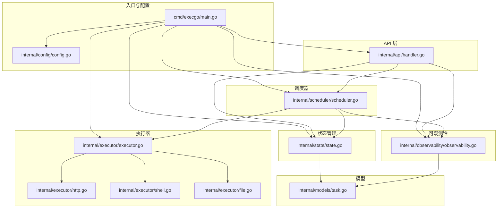
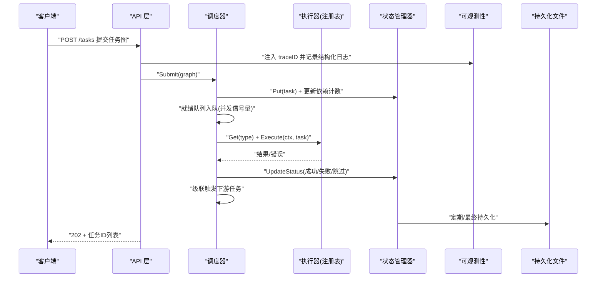
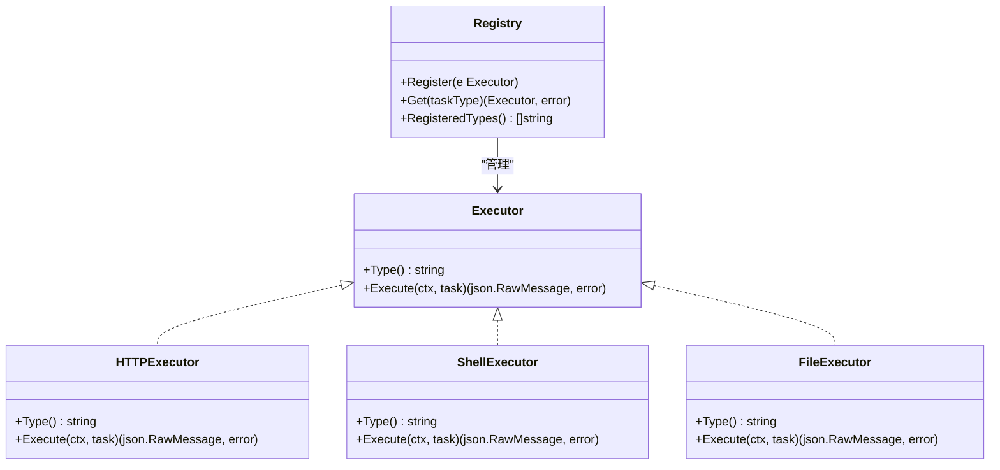
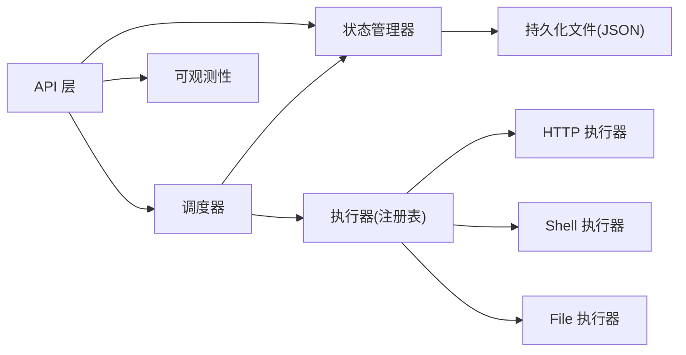

# 设计理念

<cite>
**本文引用的文件列表**
- [main.go](file://cmd/execgo/main.go)
- [handler.go](file://internal/api/handler.go)
- [scheduler.go](file://internal/scheduler/scheduler.go)
- [executor.go](file://internal/executor/executor.go)
- [http.go](file://internal/executor/http.go)
- [shell.go](file://internal/executor/shell.go)
- [file.go](file://internal/executor/file.go)
- [state.go](file://internal/state/state.go)
- [observability.go](file://internal/observability/observability.go)
- [task.go](file://internal/models/task.go)
- [config.go](file://internal/config/config.go)
- [README.md](file://README.md)
- [go.mod](file://go.mod)
</cite>

## 目录
1. [引言](#引言)
2. [项目结构](#项目结构)
3. [核心组件](#核心组件)
4. [架构总览](#架构总览)
5. [详细组件分析](#详细组件分析)
6. [依赖分析](#依赖分析)
7. [性能考量](#性能考量)
8. [故障排查指南](#故障排查指南)
9. [结论](#结论)
10. [附录](#附录)

## 引言
本文件围绕 ExecGo 的六大核心设计原则展开，结合源码逐条阐释其实现方式、带来的收益以及在实际场景中的应用，并给出设计背景与权衡考量，帮助读者全面理解项目的设计思路与架构取舍。

## 项目结构
ExecGo 采用清晰的分层组织：入口程序负责初始化与优雅关闭；API 层提供 HTTP 接口；调度器负责 DAG 编排与并发控制；执行器模块以注册表模式支持多种执行器；状态管理器负责内存与持久化；可观测性模块提供日志、追踪与指标；配置模块统一加载参数；模型定义任务契约与校验。

图表来源
- [main.go:25-104](file://cmd/execgo/main.go#L25-L104)
- [handler.go:29-52](file://internal/api/handler.go#L29-L52)
- [scheduler.go:35-45](file://internal/scheduler/scheduler.go#L35-L45)
- [executor.go:31-67](file://internal/executor/executor.go#L31-L67)
- [state.go:26-53](file://internal/state/state.go#L26-L53)
- [observability.go:50-80](file://internal/observability/observability.go#L50-L80)
- [task.go:22-39](file://internal/models/task.go#L22-L39)
- [config.go:20-30](file://internal/config/config.go#L20-L30)

章节来源
- [README.md:32-57](file://README.md#L32-L57)
- [go.mod:1-4](file://go.mod#L1-L4)

## 核心组件
- 零依赖（纯 Go 标准库，无供应商锁定）
  - 实现要点：未引入任何第三方依赖，全部功能基于标准库实现。
  - 好处：降低外部风险、简化部署、便于审计与升级。
  - 应用：日志使用 slog、网络使用 net/http、并发使用 sync 与 channel、持久化使用 os 与 json。
- 分层架构（API → Scheduler → Executor → State）
  - 实现要点：API 层只负责路由与参数校验；调度器负责 DAG 编排与并发；执行器通过注册表解耦；状态管理器负责内存与持久化。
  - 好处：职责清晰、易测试、易扩展。
  - 应用：提交任务经 API 校验后进入调度器，调度器按依赖与并发策略执行，执行器返回结果，状态被更新并持久化。
- 并发安全（sync.RWMutex + channel 保护所有共享状态）
  - 实现要点：状态管理器使用 RWMutex 保护内存映射；调度器使用 channel 作为就绪队列与并发信号量；执行器注册表使用 RWMutex 读写锁。
  - 好处：避免竞态、保证一致性、提升吞吐。
  - 应用：状态更新、注册表查询、就绪队列入队等均受锁保护。
- 可扩展（注册表模式，添加新执行器无需修改核心代码）
  - 实现要点：定义统一 Executor 接口；通过全局注册表进行注册与获取；API 层在提交时校验类型存在。
  - 好处：新增执行器仅需实现接口并注册，不侵入调度器与状态管理器。
  - 应用：内置 HTTP、Shell、File 执行器，用户可自行扩展。
- 可观测（结构化日志 + traceID + 指标端点）
  - 实现要点：slog 输出 JSON 日志；中间件注入 traceID；指标使用原子计数与快照。
  - 好益处：便于日志聚合、链路追踪、运行时监控。
  - 应用：API 路由、调度器执行、状态持久化均有结构化日志；/metrics 提供实时指标。
- 韧性（重试、超时、崩溃恢复、优雅关闭）
  - 实现要点：指数退避重试、context 超时、崩溃恢复将 running 状态重置为 pending、优雅关闭顺序停机。
  - 好处：提高系统稳定性与可用性。
  - 应用：任务执行失败自动重试，超时控制，重启后恢复未完成任务，关闭前持久化最终状态。

章节来源
- [README.md:253-261](file://README.md#L253-L261)
- [main.go:8-23](file://cmd/execgo/main.go#L8-L23)
- [state.go:17-23](file://internal/state/state.go#L17-L23)
- [scheduler.go:18-32](file://internal/scheduler/scheduler.go#L18-L32)
- [executor.go:14-20](file://internal/executor/executor.go#L14-L20)
- [observability.go:87-95](file://internal/observability/observability.go#L87-L95)

## 架构总览
下图展示从客户端到执行器再到状态持久化的完整调用链，体现六大设计原则在整体架构中的落地。

图表来源
- [handler.go:59-99](file://internal/api/handler.go#L59-L99)
- [scheduler.go:70-97](file://internal/scheduler/scheduler.go#L70-L97)
- [scheduler.go:128-190](file://internal/scheduler/scheduler.go#L128-L190)
- [executor.go:38-48](file://internal/executor/executor.go#L38-L48)
- [state.go:55-108](file://internal/state/state.go#L55-L108)
- [state.go:160-179](file://internal/state/state.go#L160-L179)
- [observability.go:69-80](file://internal/observability/observability.go#L69-L80)

## 详细组件分析

### 零依赖（纯 Go 标志库，无供应商锁定）
- 实现方式
  - 日志：使用 log/slog 输出 JSON 格式日志。
  - 网络：使用 net/http 提供 HTTP 服务与超时控制。
  - 并发：使用 sync.RWMutex 与 channel 控制共享状态与并发。
  - 持久化：使用 os 与 encoding/json 进行文件读写与序列化。
  - 配置：使用 flag 与环境变量组合加载配置。
- 好处
  - 无第三方依赖，降低供应链风险与版本冲突。
  - 易于在受限环境中部署与审计。
- 权衡
  - 缺少成熟的第三方生态，部分高级特性需要自行实现。
- 应用
  - 入口程序中直接导入标准库并初始化各组件。
  
章节来源
- [main.go:8-23](file://cmd/execgo/main.go#L8-L23)
- [go.mod:1-4](file://go.mod#L1-L4)

### 分层架构（API → Scheduler → Executor → State）
- 实现方式
  - API 层：定义路由、参数解析、校验与响应封装。
  - 调度器：构建依赖图、并发信号量、就绪队列、执行与级联。
  - 执行器：统一接口与注册表，按类型动态选择执行器。
  - 状态管理器：内存映射 + RWMutex + JSON 文件持久化。
- 好处
  - 职责分离，便于单元测试与独立演进。
  - 易于替换与扩展某一层。
- 应用
  - 提交任务经 API 校验后进入调度器，调度器根据依赖与并发策略执行，执行器返回结果，状态被更新并持久化。

章节来源
- [handler.go:29-52](file://internal/api/handler.go#L29-L52)
- [scheduler.go:35-45](file://internal/scheduler/scheduler.go#L35-L45)
- [executor.go:31-67](file://internal/executor/executor.go#L31-L67)
- [state.go:26-53](file://internal/state/state.go#L26-L53)

### 并发安全（sync.RWMutex + channel 保护所有共享状态）
- 实现方式
  - 状态管理器：RWMutex 保护内存映射，读多写少场景下提升并发性能。
  - 调度器：channel 作为就绪队列，goroutine 并发执行；semaphore 控制最大并发。
  - 执行器注册表：RWMutex 保护注册表读写。
- 好处
  - 避免竞态条件，保证状态一致性。
  - channel 作为无阻塞队列，降低锁竞争。
- 应用
  - 状态更新、注册表查询、就绪队列入队均受锁保护。

章节来源
- [state.go:17-23](file://internal/state/state.go#L17-L23)
- [scheduler.go:18-32](file://internal/scheduler/scheduler.go#L18-L32)
- [executor.go:26-29](file://internal/executor/executor.go#L26-L29)

### 可扩展（注册表模式，添加新执行器无需修改核心代码）
- 实现方式
  - 定义 Executor 接口，包含 Type 与 Execute 两个方法。
  - 提供全局注册表，支持注册、获取与列出已注册类型。
  - API 层在提交任务时校验类型是否存在。
- 好处
  - 新增执行器仅需实现接口并注册，不侵入调度器与状态管理器。
  - 便于按需扩展不同执行域（如数据库、消息队列等）。
- 应用
  - 内置 HTTP、Shell、File 执行器，用户可自行扩展。

图表来源
- [executor.go:14-20](file://internal/executor/executor.go#L14-L20)
- [executor.go:31-67](file://internal/executor/executor.go#L31-L67)
- [http.go:22-25](file://internal/executor/http.go#L22-L25)
- [shell.go:31-34](file://internal/executor/shell.go#L31-L34)
- [file.go:20-23](file://internal/executor/file.go#L20-L23)

章节来源
- [executor.go:14-67](file://internal/executor/executor.go#L14-L67)
- [handler.go:76-85](file://internal/api/handler.go#L76-L85)

### 可观测（结构化日志 + traceID + 指标端点）
- 实现方式
  - 结构化日志：slog 输出 JSON，携带 traceID 与上下文信息。
  - 请求追踪：中间件为每个请求注入 traceID，API 层在处理函数中使用。
  - 指标端点：原子计数器统计任务总数、运行中、成功、失败与按类型分布。
- 好处
  - 便于日志聚合与链路追踪，快速定位问题。
  - 提供实时运行指标，辅助容量规划与告警。
- 应用
  - API 路由、调度器执行、状态持久化均有结构化日志；/metrics 提供实时指标。

章节来源
- [observability.go:50-80](file://internal/observability/observability.go#L50-L80)
- [observability.go:87-133](file://internal/observability/observability.go#L87-L133)
- [handler.go:59-99](file://internal/api/handler.go#L59-L99)
- [scheduler.go:128-190](file://internal/scheduler/scheduler.go#L128-L190)

### 韧性（重试、超时、崩溃恢复、优雅关闭）
- 实现方式
  - 重试：指数退避（100ms*2^(attempt-2)，上限10s），最多尝试次数为 retry+1。
  - 超时：基于 context.WithTimeout 或 WithCancel 控制执行时间。
  - 崩溃恢复：启动时将 running 状态重置为 pending，避免悬挂任务。
  - 优雅关闭：监听系统信号，按顺序关闭 HTTP、调度器、持久化。
- 好处
  - 提升系统稳定性与可用性，减少人工干预。
  - 在异常情况下尽快恢复服务。
- 应用
  - 任务执行失败自动重试，超时控制，重启后恢复未完成任务，关闭前持久化最终状态。

章节来源
- [scheduler.go:128-190](file://internal/scheduler/scheduler.go#L128-L190)
- [state.go:41-50](file://internal/state/state.go#L41-L50)
- [main.go:81-104](file://cmd/execgo/main.go#L81-L104)

## 依赖分析
- 组件耦合与内聚
  - API 层与调度器通过状态管理器与指标进行松耦合交互。
  - 调度器与执行器通过注册表解耦，新增执行器不影响调度器。
  - 状态管理器与持久化文件通过定时器与最终持久化保障一致性。
- 外部依赖
  - 仅使用 Go 标准库，无第三方依赖。
- 循环依赖
  - 未发现循环依赖，模块边界清晰。

图表来源
- [handler.go:29-52](file://internal/api/handler.go#L29-L52)
- [scheduler.go:35-45](file://internal/scheduler/scheduler.go#L35-L45)
- [executor.go:31-67](file://internal/executor/executor.go#L31-L67)
- [state.go:160-179](file://internal/state/state.go#L160-L179)

章节来源
- [main.go:8-23](file://cmd/execgo/main.go#L8-L23)
- [go.mod:1-4](file://go.mod#L1-L4)

## 性能考量
- 并发模型
  - 调度器使用 goroutine + channel + 信号量控制并发，适合 CPU 密集与 I/O 密集混合场景。
  - 就绪队列采用有缓冲通道，避免频繁阻塞；满载时采用异步回补策略。
- 锁粒度
  - 状态管理器使用 RWMutex，读多写少场景下提升吞吐。
  - 注册表使用 RWMutex，读多写少场景下降低锁竞争。
- 指标与日志
  - 指标使用原子计数器，避免锁争用；快照时一次性读取，降低开销。
  - 日志输出 JSON，便于外部日志系统高效解析。
- 持久化
  - 定期持久化与最终持久化相结合，平衡性能与可靠性。
  - 采用临时文件 + 原子重命名，确保写入一致性。

[本节为通用性能讨论，不直接分析具体文件]

## 故障排查指南
- 提交任务失败
  - 检查任务图校验：ID、类型、依赖引用、自依赖与环检测。
  - 检查执行器类型：确认类型已在注册表中。
- 执行超时或失败
  - 查看重试日志与退避间隔；确认超时设置是否合理。
  - 检查执行器参数（如 URL、命令、路径）。
- 状态不一致
  - 检查持久化是否成功；重启后 running 状态会被重置为 pending。
- 观测性
  - 通过 /metrics 查看任务总数、运行中、成功、失败与按类型分布。
  - 通过结构化日志与 traceID 进行链路追踪。

章节来源
- [task.go:41-79](file://internal/models/task.go#L41-L79)
- [handler.go:76-85](file://internal/api/handler.go#L76-L85)
- [scheduler.go:128-190](file://internal/scheduler/scheduler.go#L128-L190)
- [state.go:137-158](file://internal/state/state.go#L137-L158)
- [observability.go:137-146](file://internal/observability/observability.go#L137-L146)

## 结论
ExecGo 通过六大设计原则实现了“极简而稳健”的执行引擎：零依赖确保可控与可审计；分层架构使职责清晰、易于维护；并发安全与可观测性保障了稳定与可见；可扩展与韧性进一步提升了系统的适应性与鲁棒性。这些设计取舍在保证工程可用性的同时，也兼顾了开发效率与运维成本。

[本节为总结性内容，不直接分析具体文件]

## 附录
- 配置项与优先级
  - 命令行标志优先于环境变量，再优于默认值。
- 扩展执行器
  - 实现 Executor 接口并注册即可无缝接入调度器。
- 任务 DSL
  - 支持 id、type、params、depends_on、retry、timeout、status 等字段。

章节来源
- [config.go:18-30](file://internal/config/config.go#L18-L30)
- [README.md:229-249](file://README.md#L229-L249)
- [task.go:22-39](file://internal/models/task.go#L22-L39)