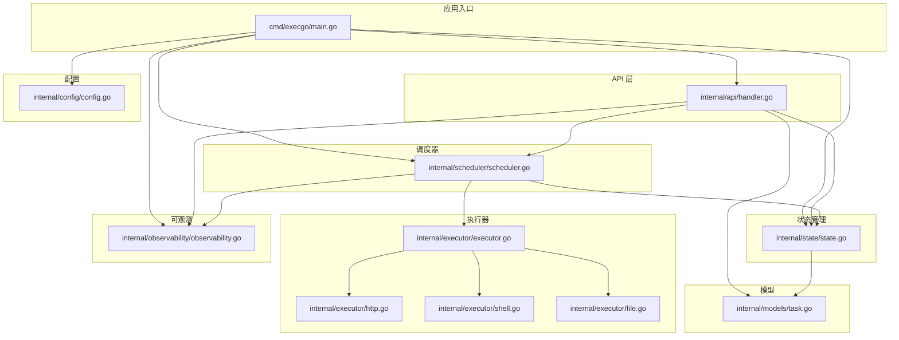
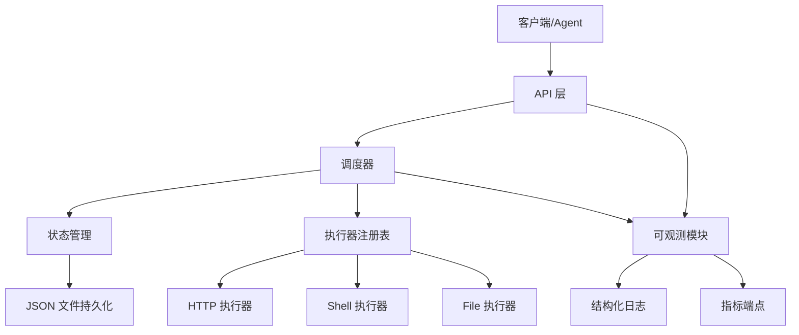
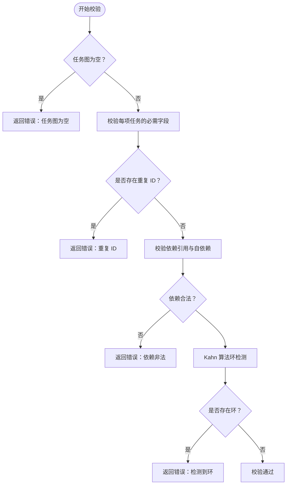
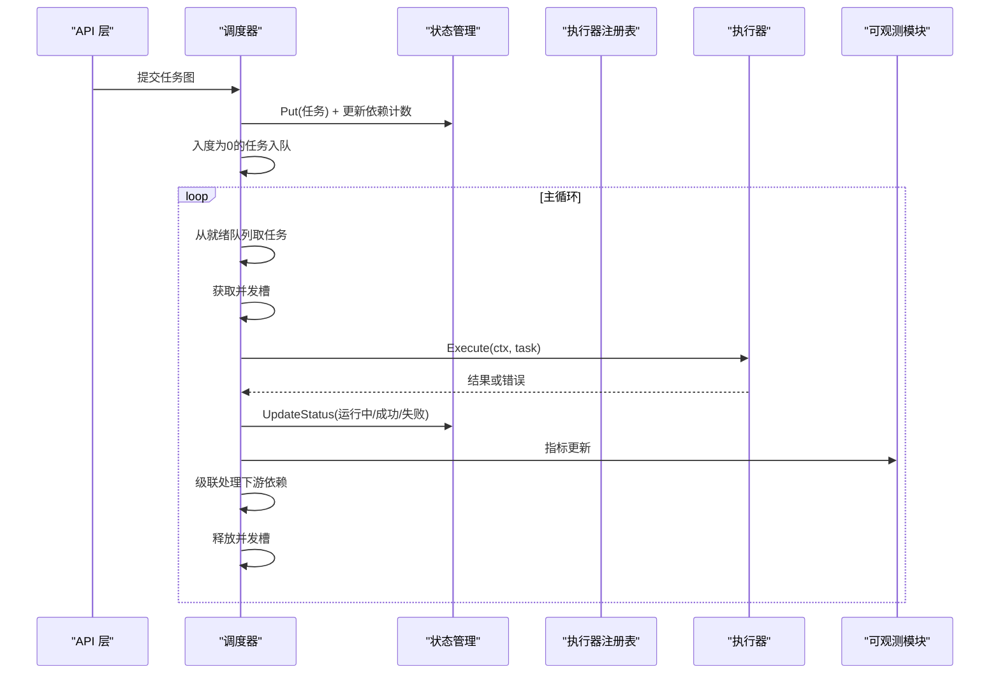
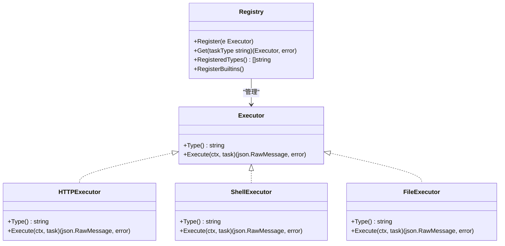
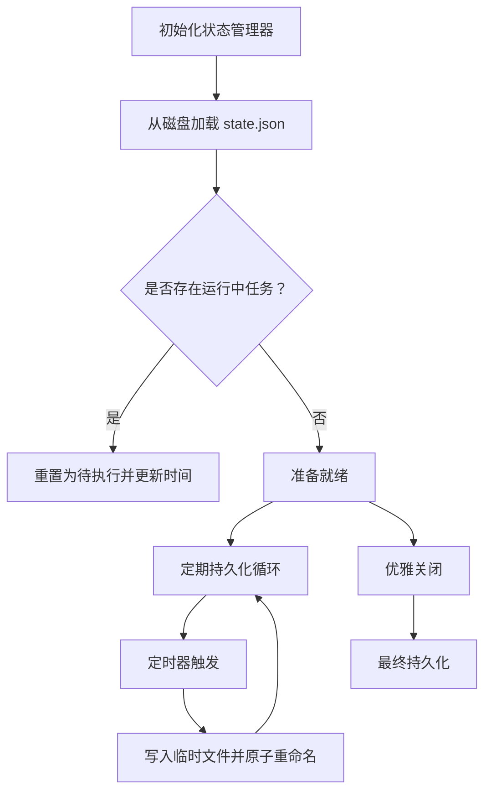
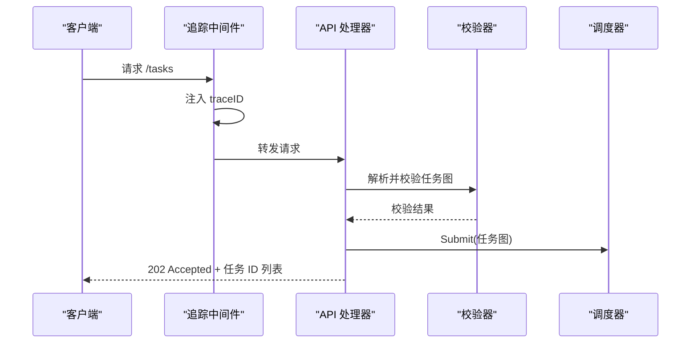
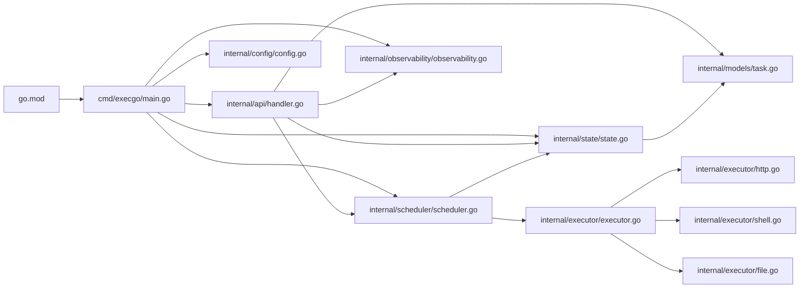

# 项目概述

<cite>
**本文档引用的文件**
- [README.md](file://README.md)
- [go.mod](file://go.mod)
- [cmd/execgo/main.go](file://cmd/execgo/main.go)
- [internal/models/task.go](file://internal/models/task.go)
- [internal/scheduler/scheduler.go](file://internal/scheduler/scheduler.go)
- [internal/executor/executor.go](file://internal/executor/executor.go)
- [internal/executor/http.go](file://internal/executor/http.go)
- [internal/executor/shell.go](file://internal/executor/shell.go)
- [internal/executor/file.go](file://internal/executor/file.go)
- [internal/state/state.go](file://internal/state/state.go)
- [internal/api/handler.go](file://internal/api/handler.go)
- [internal/observability/observability.go](file://internal/observability/observability.go)
- [internal/config/config.go](file://internal/config/config.go)
</cite>

## 目录
1. [简介](#简介)
2. [项目结构](#项目结构)
3. [核心组件](#核心组件)
4. [架构总览](#架构总览)
5. [详细组件分析](#详细组件分析)
6. [依赖关系分析](#依赖关系分析)
7. [性能考量](#性能考量)
8. [故障排查指南](#故障排查指南)
9. [结论](#结论)
10. [附录](#附录)

## 简介
ExecGo 是一个使用纯 Go 标准库构建的极简 AI 执行引擎，零第三方依赖。它作为 AI Agent（例如 secbot）的执行层，通过 HTTP API 暴露任务提交与管理能力。项目强调“零依赖、分层架构、并发安全、可扩展性、可观测性和韧性”六大设计原则，提供任务 DSL、DAG 调度、并发执行、可插拔执行器、重试与超时机制、状态持久化、可观测性和优雅关闭等核心能力。

- 零依赖：完全基于 Go 标准库，避免供应商锁定与复杂依赖管理。
- 分层架构：清晰的 API → 调度器 → 执行器 → 状态管理分层，职责分离。
- 并发安全：使用互斥锁与通道保护共享状态，保证高并发下的正确性。
- 可扩展：执行器注册表模式，新增执行器无需改动核心代码。
- 可观测：结构化日志、请求追踪、指标端点，便于运维与问题定位。
- 韧性：指数退避重试、上下文超时、崩溃恢复、优雅关闭，提升系统稳定性。

**章节来源**
- [README.md:11-29](file://README.md#L11-L29)
- [README.md:253-261](file://README.md#L253-L261)

## 项目结构
项目采用按功能域划分的分层组织方式，核心模块如下：
- cmd/execgo：应用入口，负责初始化配置、组件装配、HTTP 服务与优雅关闭。
- internal/api：HTTP API 层，提供任务提交、查询、删除、健康检查与指标端点。
- internal/scheduler：DAG 调度器，负责任务拓扑排序、并发控制、重试与级联处理。
- internal/executor：执行器接口与内置执行器（HTTP、Shell、File），支持注册表扩展。
- internal/state：状态管理与持久化，内存存储 + JSON 文件定期持久化。
- internal/observability：结构化日志、请求追踪、指标收集。
- internal/config：配置加载，支持命令行参数与环境变量。
- internal/models：任务 DSL 与核心数据结构，包含任务图校验与 DAG 环检测。

**图表来源**
- [cmd/execgo/main.go:25-104](file://cmd/execgo/main.go#L25-L104)
- [internal/api/handler.go:29-52](file://internal/api/handler.go#L29-L52)
- [internal/scheduler/scheduler.go:35-45](file://internal/scheduler/scheduler.go#L35-L45)
- [internal/executor/executor.go:31-67](file://internal/executor/executor.go#L31-L67)
- [internal/state/state.go:26-53](file://internal/state/state.go#L26-L53)
- [internal/observability/observability.go:50-80](file://internal/observability/observability.go#L50-L80)
- [internal/config/config.go:20-30](file://internal/config/config.go#L20-L30)
- [internal/models/task.go:22-39](file://internal/models/task.go#L22-L39)

**章节来源**
- [README.md:149-177](file://README.md#L149-L177)

## 核心组件
- 任务 DSL：定义任务 ID、类型、参数、依赖、重试次数、超时时间与状态字段；提供任务图校验与 DAG 环检测。
- DAG 调度器：基于 Kahn 算法进行拓扑排序与环检测，维护就绪队列、并发信号量与依赖计数，支持指数退避重试与超时控制。
- 可插拔执行器：统一的 Executor 接口与注册表，内置 HTTP、Shell、File 执行器，支持扩展自定义执行器。
- 状态管理：内存存储 + JSON 文件持久化，崩溃后恢复并将运行中任务重置为待执行，支持周期性持久化。
- 可观测性：结构化 JSON 日志、请求追踪（traceID）、指标端点（总任务、运行中、成功、失败、按类型统计）。
- 配置管理：支持命令行参数与环境变量，优先级为 flag > env > default。
- 优雅关闭：信号监听 → HTTP 关闭 → 调度器停止 → 状态持久化，确保资源有序释放。

**章节来源**
- [internal/models/task.go:22-79](file://internal/models/task.go#L22-L79)
- [internal/scheduler/scheduler.go:18-97](file://internal/scheduler/scheduler.go#L18-L97)
- [internal/executor/executor.go:14-67](file://internal/executor/executor.go#L14-L67)
- [internal/state/state.go:17-53](file://internal/state/state.go#L17-L53)
- [internal/observability/observability.go:86-133](file://internal/observability/observability.go#L86-L133)
- [internal/config/config.go:18-30](file://internal/config/config.go#L18-L30)
- [cmd/execgo/main.go:81-104](file://cmd/execgo/main.go#L81-L104)

## 架构总览
ExecGo 采用分层架构，组件间交互清晰：
- 应用入口负责初始化配置、日志、指标、状态管理、调度器与 HTTP 服务，并在收到信号时执行优雅关闭。
- API 层接收外部请求，进行任务图校验与执行器可用性检查，随后提交给调度器。
- 调度器负责任务状态推进、并发控制、重试与超时、以及依赖满足后的级联触发。
- 执行器根据任务类型执行具体动作（HTTP 请求、Shell 命令、文件操作），并返回结构化结果。
- 状态管理器负责内存存储与磁盘持久化，支持周期性与最终持久化。
- 可观测模块提供日志、追踪与指标，贯穿整个系统。

**图表来源**
- [cmd/execgo/main.go:25-104](file://cmd/execgo/main.go#L25-L104)
- [internal/api/handler.go:58-99](file://internal/api/handler.go#L58-L99)
- [internal/scheduler/scheduler.go:69-97](file://internal/scheduler/scheduler.go#L69-L97)
- [internal/state/state.go:110-134](file://internal/state/state.go#L110-L134)
- [internal/executor/executor.go:31-67](file://internal/executor/executor.go#L31-L67)
- [internal/observability/observability.go:50-80](file://internal/observability/observability.go#L50-L80)

## 详细组件分析

### 任务 DSL 与 DAG 校验
- 任务结构包含 ID、类型、参数、依赖列表、重试次数、超时时间、状态、结果、错误信息及时间戳。
- 任务图校验包括：非空校验、重复 ID、未知依赖、自依赖与环检测。
- 环检测使用 Kahn 算法：计算入度、入度为 0 的节点入队、BFS 遍历，若访问数量不等于任务总数则存在环。

**图表来源**
- [internal/models/task.go:42-79](file://internal/models/task.go#L42-L79)
- [internal/models/task.go:82-121](file://internal/models/task.go#L82-L121)

**章节来源**
- [internal/models/task.go:22-79](file://internal/models/task.go#L22-L79)
- [internal/models/task.go:82-121](file://internal/models/task.go#L82-L121)

### 调度器：DAG 与并发控制
- 初始化：创建就绪队列（带缓冲）、并发信号量、依赖计数映射与反向依赖图。
- 提交流程：设置任务状态为待执行、记录创建与更新时间、构建依赖计数与反向依赖图，并将入度为 0 的任务入队。
- 主循环：从就绪队列取出任务，获取并发槽位，异步执行；执行完成后释放槽位并级联处理下游依赖。
- 重试与超时：指数退避（上限 10 秒），每次尝试前构建带超时的上下文；任一成功即标记成功，否则累计失败。
- 级联处理：当上游任务失败时，标记下游为跳过并递归级联跳过。

**图表来源**
- [internal/scheduler/scheduler.go:69-97](file://internal/scheduler/scheduler.go#L69-L97)
- [internal/scheduler/scheduler.go:109-125](file://internal/scheduler/scheduler.go#L109-L125)
- [internal/scheduler/scheduler.go:127-190](file://internal/scheduler/scheduler.go#L127-L190)
- [internal/scheduler/scheduler.go:192-230](file://internal/scheduler/scheduler.go#L192-L230)

**章节来源**
- [internal/scheduler/scheduler.go:18-97](file://internal/scheduler/scheduler.go#L18-L97)
- [internal/scheduler/scheduler.go:109-190](file://internal/scheduler/scheduler.go#L109-L190)
- [internal/scheduler/scheduler.go:192-230](file://internal/scheduler/scheduler.go#L192-L230)

### 执行器：接口与内置实现
- 接口：统一的 Type() 与 Execute(ctx, task) 方法，支持注册表动态获取。
- 注册表：线程安全的全局注册表，支持注册、获取与列出已注册类型。
- 内置执行器：
  - HTTP 执行器：解析参数（URL、Method、Headers、Body），构造请求并发送，限制响应大小，状态码 ≥ 400 仍返回结果但标记错误。
  - Shell 执行器：白名单命令校验（覆盖 Linux/Windows 常用命令），执行命令并收集标准输出、标准错误与退出码。
  - File 执行器：支持读取、写入（覆盖/追加）、删除、状态查询，路径清理防止目录穿越。

**图表来源**
- [internal/executor/executor.go:14-67](file://internal/executor/executor.go#L14-L67)
- [internal/executor/http.go:22-75](file://internal/executor/http.go#L22-L75)
- [internal/executor/shell.go:31-79](file://internal/executor/shell.go#L31-L79)
- [internal/executor/file.go:20-113](file://internal/executor/file.go#L20-L113)

**章节来源**
- [internal/executor/executor.go:14-67](file://internal/executor/executor.go#L14-L67)
- [internal/executor/http.go:22-75](file://internal/executor/http.go#L22-L75)
- [internal/executor/shell.go:31-79](file://internal/executor/shell.go#L31-L79)
- [internal/executor/file.go:20-113](file://internal/executor/file.go#L20-L113)

### 状态管理与持久化
- 内存存储：以任务 ID 为键的映射，提供 Put、Get、GetAll、Delete、UpdateStatus 等操作。
- 崩溃恢复：启动时加载 JSON 文件，若存在运行中任务则重置为待执行。
- 持久化策略：定期持久化（默认 30 秒）与最终持久化（优雅关闭前），采用临时文件 + 原子重命名，保证一致性。

**图表来源**
- [internal/state/state.go:26-53](file://internal/state/state.go#L26-L53)
- [internal/state/state.go:137-158](file://internal/state/state.go#L137-L158)
- [internal/state/state.go:160-179](file://internal/state/state.go#L160-L179)

**章节来源**
- [internal/state/state.go:17-53](file://internal/state/state.go#L17-L53)
- [internal/state/state.go:110-134](file://internal/state/state.go#L110-L134)
- [internal/state/state.go:137-158](file://internal/state/state.go#L137-L158)
- [internal/state/state.go:160-179](file://internal/state/state.go#L160-L179)

### API 层：路由与中间件
- 路由：POST /tasks（提交任务图）、GET /tasks/{id}（查询单个）、GET /tasks（列出所有）、DELETE /tasks/{id}（删除）、GET /health（健康检查）、GET /metrics（指标）。
- 中间件：追踪中间件为每个请求注入 traceID，便于日志关联与问题定位。
- 校验：对任务图进行合法性校验，确保任务类型均有对应执行器可用。

**图表来源**
- [internal/api/handler.go:39-52](file://internal/api/handler.go#L39-L52)
- [internal/api/handler.go:58-99](file://internal/api/handler.go#L58-L99)
- [internal/observability/observability.go:69-80](file://internal/observability/observability.go#L69-L80)

**章节来源**
- [internal/api/handler.go:39-52](file://internal/api/handler.go#L39-L52)
- [internal/api/handler.go:58-99](file://internal/api/handler.go#L58-L99)
- [internal/api/handler.go:101-146](file://internal/api/handler.go#L101-L146)
- [internal/observability/observability.go:69-80](file://internal/observability/observability.go#L69-L80)

### 可观测性：日志、追踪与指标
- 结构化日志：使用 slog JSON Handler 输出，统一格式便于采集与检索。
- 请求追踪：为每个请求生成 traceID，注入响应头并在日志中携带，支持跨组件关联。
- 指标：原子计数器记录总任务、运行中、成功、失败与按类型统计，提供快照接口。

**章节来源**
- [internal/observability/observability.go:50-80](file://internal/observability/observability.go#L50-L80)
- [internal/observability/observability.go:86-133](file://internal/observability/observability.go#L86-L133)

### 配置管理
- 支持命令行参数：-addr、-data-dir、-max-concurrency、-shutdown-timeout。
- 支持环境变量：EXECGO_ADDR、EXECGO_DATA_DIR、EXECGO_MAX_CONCURRENCY、EXECGO_SHUTDOWN_TIMEOUT。
- 优先级：flag > env > default。

**章节来源**
- [internal/config/config.go:18-30](file://internal/config/config.go#L18-L30)

## 依赖关系分析
- 语言与工具链：Go 1.24.5，纯标准库，无第三方依赖。
- 组件耦合：API 层依赖调度器与状态管理；调度器依赖状态管理与执行器注册表；执行器注册表管理具体执行器实现；状态管理依赖模型定义；可观测模块被多处使用。
- 外部集成点：HTTP API、文件系统、网络请求（HTTP 执行器）。

**图表来源**
- [go.mod:1-4](file://go.mod#L1-L4)
- [cmd/execgo/main.go:17-23](file://cmd/execgo/main.go#L17-L23)
- [internal/api/handler.go:5-17](file://internal/api/handler.go#L5-L17)
- [internal/scheduler/scheduler.go:5-16](file://internal/scheduler/scheduler.go#L5-L16)
- [internal/state/state.go:5-15](file://internal/state/state.go#L5-L15)
- [internal/executor/executor.go:5-12](file://internal/executor/executor.go#L5-L12)

**章节来源**
- [go.mod:1-4](file://go.mod#L1-L4)
- [cmd/execgo/main.go:17-23](file://cmd/execgo/main.go#L17-L23)

## 性能考量
- 并发模型：goroutine + channel + 信号量控制最大并发，避免过度并发导致资源争用。
- 调度效率：Kahn 算法拓扑排序与依赖计数映射，确保无环任务图下高效推进。
- I/O 优化：HTTP 执行器限制响应大小，Shell 执行器捕获标准输出与错误，文件执行器按需打开文件。
- 持久化策略：定期持久化降低崩溃风险，最终持久化确保优雅关闭时状态落盘。
- 指标与日志：原子计数器与结构化日志，减少锁竞争与格式化开销。

[本节为通用性能讨论，不直接分析具体文件]

## 故障排查指南
- 任务提交失败：检查任务图是否为空、ID 是否重复、依赖是否指向未知任务、是否存在自依赖或环；确认任务类型是否在执行器注册表中。
- 执行器不可用：确认执行器已注册且类型拼写正确；查看注册的执行器类型列表。
- Shell 命令失败：确认命令在白名单内；检查命令参数与工作目录；查看标准输出与错误信息。
- HTTP 执行器异常：检查 URL、方法、头部与请求体；关注响应状态码与响应体大小限制。
- 状态未持久化：检查数据目录权限与磁盘空间；确认定期持久化与优雅关闭流程是否正常执行。
- 指标异常：确认指标快照读取时机与并发安全；核对类型计数器初始化逻辑。

**章节来源**
- [internal/models/task.go:42-79](file://internal/models/task.go#L42-L79)
- [internal/api/handler.go:76-85](file://internal/api/handler.go#L76-L85)
- [internal/executor/shell.go:52-54](file://internal/executor/shell.go#L52-L54)
- [internal/executor/http.go:33-38](file://internal/executor/http.go#L33-L38)
- [internal/state/state.go:160-179](file://internal/state/state.go#L160-L179)
- [internal/observability/observability.go:122-133](file://internal/observability/observability.go#L122-L133)

## 结论
ExecGo 以“零依赖、分层架构、并发安全、可扩展性、可观测性和韧性”为核心设计原则，提供了简洁而强大的 AI 执行引擎。通过任务 DSL、DAG 调度、并发执行、可插拔执行器、重试与超时、状态持久化与可观测性，满足生产级单节点执行内核的需求。其纯标准库实现降低了部署与维护成本，适合需要稳定、可控、可审计的 AI Agent 执行层场景。

[本节为总结性内容，不直接分析具体文件]

## 附录
- 适用场景：AI Agent 的任务编排与执行、自动化脚本与文件操作、轻量级微服务编排、安全合规的受限执行环境。
- 目标用户：需要在受控环境中执行 AI 任务的工程师与平台团队，关注零依赖与可观测性的运维人员。

**章节来源**
- [README.md:11-29](file://README.md#L11-L29)
- [README.md:253-261](file://README.md#L253-L261)