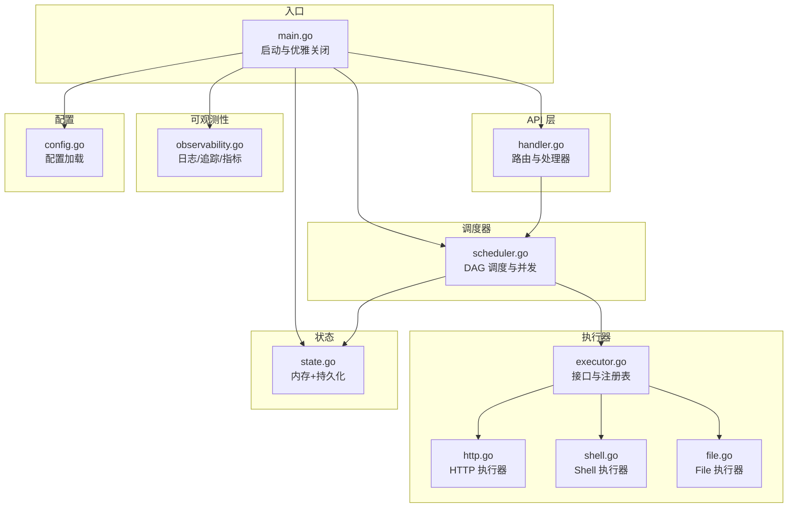
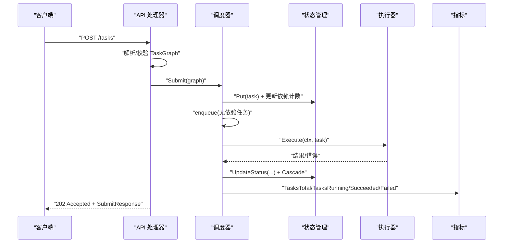
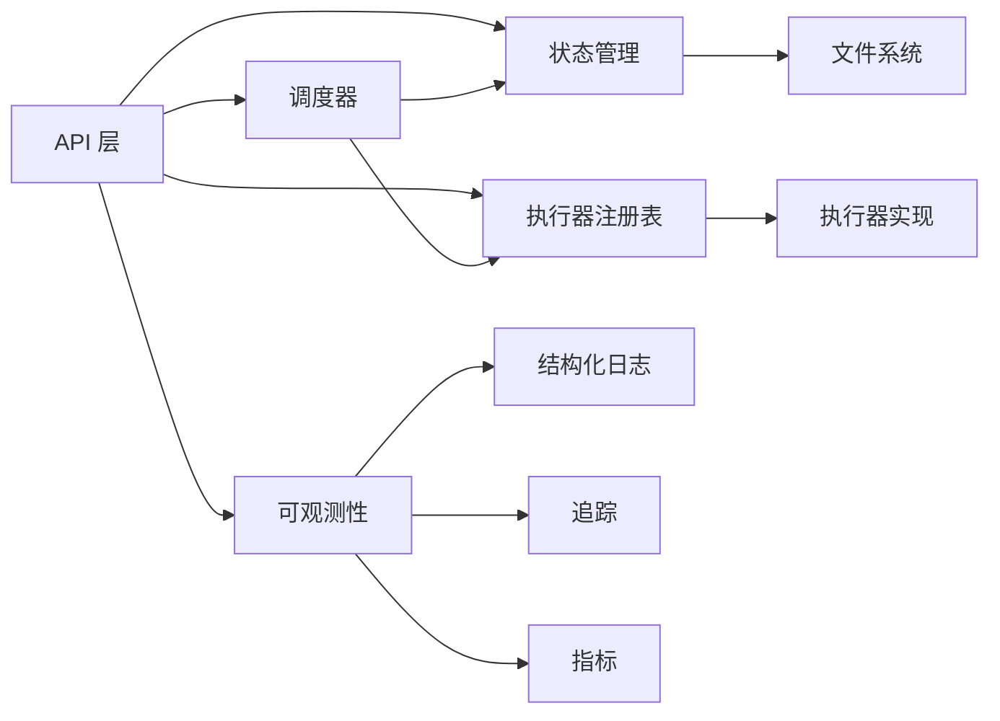

# API 参考

<cite>
**本文引用的文件**
- [main.go](file://cmd/execgo/main.go)
- [handler.go](file://internal/api/handler.go)
- [task.go](file://internal/models/task.go)
- [executor.go](file://internal/executor/executor.go)
- [http.go](file://internal/executor/http.go)
- [shell.go](file://internal/executor/shell.go)
- [file.go](file://internal/executor/file.go)
- [scheduler.go](file://internal/scheduler/scheduler.go)
- [state.go](file://internal/state/state.go)
- [observability.go](file://internal/observability/observability.go)
- [config.go](file://internal/config/config.go)
- [README.md](file://README.md)
</cite>

## 目录
1. [简介](#简介)
2. [项目结构](#项目结构)
3. [核心组件](#核心组件)
4. [架构总览](#架构总览)
5. [详细组件分析](#详细组件分析)
6. [依赖分析](#依赖分析)
7. [性能考量](#性能考量)
8. [故障排查指南](#故障排查指南)
9. [结论](#结论)
10. [附录](#附录)

## 简介
本文件为 ExecGo 的 HTTP API 参考文档，覆盖主要公开 RESTful 端点：POST /tasks、GET /adapters/capabilities、GET /adapters/tools、POST /adapters/translate、POST /adapters/actions、GET /tasks/{id}、GET /tasks、DELETE /tasks/{id}、GET /health、GET /metrics。文档提供每个端点的 HTTP 方法、URL 模式、请求/响应格式、参数说明、返回值定义、错误处理与状态码、认证方式、速率限制、安全考虑、最佳实践以及客户端实现与性能优化建议。

## 项目结构
ExecGo 采用分层架构：入口程序负责初始化配置、日志、指标、状态管理、调度器与 HTTP 服务器；API 层提供 HTTP 路由与处理器；调度器负责 DAG 任务调度与并发控制；执行器模块提供可插拔的执行器（HTTP/Shell/File）；状态模块负责内存与持久化存储；可观测性模块提供结构化日志、追踪与指标。

图表来源
- [main.go:25-104](file://cmd/execgo/main.go#L25-L104)
- [handler.go:39-52](file://internal/api/handler.go#L39-L52)
- [scheduler.go:34-67](file://internal/scheduler/scheduler.go#L34-L67)
- [executor.go:14-67](file://internal/executor/executor.go#L14-L67)
- [state.go:17-53](file://internal/state/state.go#L17-L53)
- [observability.go:50-80](file://internal/observability/observability.go#L50-L80)
- [config.go:18-30](file://internal/config/config.go#L18-L30)

章节来源
- [README.md:32-57](file://README.md#L32-L57)
- [main.go:25-104](file://cmd/execgo/main.go#L25-L104)

## 核心组件
- API 层：提供路由与处理器，统一输出 JSON，封装错误响应与健康检查、指标端点。
- 调度器：基于 DAG 的任务调度，Kahn 算法拓扑排序与环检测，信号量控制并发，指数退避重试与超时。
- 执行器：HTTP/Shell/File 三种内置执行器，支持参数校验与安全策略（Shell 白名单、File 路径清理）。
- 状态管理：内存映射 + JSON 文件定期持久化，崩溃后将 running 状态重置为 pending。
- 可观测性：结构化 JSON 日志、请求追踪（traceID）、/metrics 指标端点。
- 配置：支持命令行参数与环境变量，优先级为 flag > env > default。

章节来源
- [handler.go:19-52](file://internal/api/handler.go#L19-L52)
- [scheduler.go:18-67](file://internal/scheduler/scheduler.go#L18-L67)
- [executor.go:14-67](file://internal/executor/executor.go#L14-L67)
- [state.go:17-53](file://internal/state/state.go#L17-L53)
- [observability.go:50-134](file://internal/observability/observability.go#L50-L134)
- [config.go:18-47](file://internal/config/config.go#L18-L47)

## 架构总览
下图展示 API 调用到任务执行的关键流程：客户端请求 → API 处理器 → 调度器提交 → 状态更新 → 执行器执行 → 结果回写 → 指标统计。

图表来源
- [handler.go:58-99](file://internal/api/handler.go#L58-L99)
- [scheduler.go:69-97](file://internal/scheduler/scheduler.go#L69-L97)
- [scheduler.go:127-190](file://internal/scheduler/scheduler.go#L127-L190)
- [state.go:55-108](file://internal/state/state.go#L55-L108)
- [observability.go:86-133](file://internal/observability/observability.go#L86-L133)

## 详细组件分析

### POST /tasks
- 方法与路径：POST /tasks
- 功能：提交一个任务图（TaskGraph），包含多个任务及其依赖关系。服务端进行校验、检查执行器可用性，并将任务提交给调度器。
- 请求头：
  - Content-Type: application/json
- 请求体（TaskGraph）：
  - tasks: 数组，元素为 Task 对象
    - id: 字符串，唯一标识
    - type: 字符串，执行器类型（http、shell、file）
    - params: 对象，按 type 定义的参数
    - depends_on: 字符串数组，依赖的任务 ID
    - retry: 整数，重试次数（默认 0）
    - timeout: 整数，毫秒，超时时间
- 成功响应：
  - 状态码：202 Accepted
  - 响应体：SubmitResponse
    - accepted: 整数，接受的任务数量
    - task_ids: 字符串数组，提交的任务 ID 列表
- 错误响应：
  - 400 Bad Request：请求体非 JSON、TaskGraph 校验失败、未知执行器类型
  - 500 Internal Server Error：内部错误（极少发生）
- 示例请求（DAG 工作流）：
  - 参考：[README.md:101-126](file://README.md#L101-L126)
- 示例响应：
  - accepted: 3
  - task_ids: ["fetch-data","save-result","verify"]

章节来源
- [handler.go:58-99](file://internal/api/handler.go#L58-L99)
- [task.go:36-79](file://internal/models/task.go#L36-L79)
- [executor.go:38-48](file://internal/executor/executor.go#L38-L48)

### Agent Adapter 端点
- 方法与路径：
  - GET /adapters/capabilities
  - GET /adapters/tools
  - POST /adapters/translate
  - POST /adapters/actions
- 功能：为 Claude Code / Codex / OpenClaw 这类成熟 agent 提供结构化 action 接入层。AdapterKernel 会把 action 翻译为现有 TaskGraph，再复用 scheduler、executor 与 store。
- 请求体（POST /adapters/actions 与 POST /adapters/translate）：
  - adapter: 字符串，可选，支持 generic、claudecode、codex、openclaw 等 profile 名称
  - agent_id: 字符串，可选，agent 标识
  - session_id: 字符串，可选，会话标识
  - action_id: 字符串，可选，若提供则作为翻译后任务 ID
  - action: 对象，必填
    - kind: 字符串，action 类型，例如 os.shell、runtime.command、mcp.call、task_graph.submit
    - tool_name: 字符串，部分 action 需要，例如 mcp.call
    - input: 对象，具体工具输入
    - depends_on、retry、timeout: 与 Task DSL 语义一致
- 成功响应：
  - /adapters/translate：200 OK，只返回翻译后的 TaskGraph，不提交执行
  - /adapters/actions：202 Accepted，返回 accepted、task_ids、task_graph、translation_trace
- 错误响应：
  - 400 Bad Request：请求体非 JSON、未知 action kind、翻译后 TaskGraph 校验失败、未知执行器类型
- 支持的 action kind：
  - OS：os.shell、os.file、os.http、os.dns、os.tcp、os.sleep、os.noop
  - Runtime：runtime.command、runtime.script
  - 扩展：mcp.call、cli.run
  - 直通：task_graph.submit
- 说明：直接使用 Task DSL 的开发者继续调用 POST /tasks；成熟 agent 可先调用 GET /adapters/tools 获取工具清单，再提交 action。
- 详细示例：参考 [成熟 Agent Adapter 接入](../../integration/agent-adapter.md)

### GET /tasks/{id}
- 方法与路径：GET /tasks/{id}
- 功能：查询指定任务的当前状态与结果。
- 成功响应：
  - 状态码：200 OK
  - 响应体：Task 对象
- 错误响应：
  - 404 Not Found：任务不存在
- 示例响应：
  - 包含 id、type、params、depends_on、retry、timeout、status、result、error、created_at、updated_at

章节来源
- [handler.go:101-110](file://internal/api/handler.go#L101-L110)
- [state.go:62-68](file://internal/state/state.go#L62-L68)

### GET /tasks
- 方法与路径：GET /tasks
- 功能：列出所有任务。
- 成功响应：
  - 状态码：200 OK
  - 响应体：Task 数组
- 示例响应：
  - 数组中每个元素为 Task 对象

章节来源
- [handler.go:112-116](file://internal/api/handler.go#L112-L116)
- [state.go:70-80](file://internal/state/state.go#L70-L80)

### DELETE /tasks/{id}
- 方法与路径：DELETE /tasks/{id}
- 功能：删除指定任务。
- 成功响应：
  - 状态码：204 No Content
- 错误响应：
  - 404 Not Found：任务不存在
- 注意：删除不会影响正在执行中的任务；仅影响内存状态与持久化文件。

章节来源
- [handler.go:118-126](file://internal/api/handler.go#L118-L126)
- [state.go:82-92](file://internal/state/state.go#L82-L92)

### GET /health
- 方法与路径：GET /health
- 功能：健康检查，返回服务状态、版本与运行时长。
- 成功响应：
  - 状态码：200 OK
  - 响应体：HealthResponse
    - status: 字符串，固定为 "ok"
    - version: 字符串，版本号
    - uptime: 字符串，运行时长（秒）
- 示例响应：
  - status: "ok"
  - version: "v1.0.0"
  - uptime: "120s"

章节来源
- [handler.go:128-135](file://internal/api/handler.go#L128-L135)

### GET /metrics
- 方法与路径：GET /metrics
- 功能：返回当前指标快照。
- 成功响应：
  - 状态码：200 OK
  - 响应体：MetricsResponse
    - tasks_total: 总任务数
    - tasks_running: 正在运行的任务数
    - tasks_succeeded: 成功的任务数
    - tasks_failed: 失败的任务数
    - by_type: 映射，键为任务类型，值为该类型任务计数
- 示例响应：
  - tasks_total: 10
  - tasks_running: 2
  - tasks_succeeded: 6
  - tasks_failed: 2
  - by_type: {"http": 4,"shell": 3,"file": 3}

章节来源
- [handler.go:137-146](file://internal/api/handler.go#L137-L146)
- [observability.go:86-133](file://internal/observability/observability.go#L86-L133)

## 依赖分析
- API 层依赖调度器、状态管理、可观测性模块与执行器注册表。
- 调度器依赖状态管理、可观测性与执行器接口。
- 执行器模块提供接口与三种内置实现，注册表集中管理。
- 状态模块提供内存与持久化能力，支持周期性持久化。
- 可观测性模块提供日志、追踪与指标，贯穿整个调用链。

图表来源
- [handler.go:19-52](file://internal/api/handler.go#L19-L52)
- [scheduler.go:18-45](file://internal/scheduler/scheduler.go#L18-L45)
- [executor.go:26-67](file://internal/executor/executor.go#L26-L67)
- [state.go:110-134](file://internal/state/state.go#L110-L134)
- [observability.go:50-80](file://internal/observability/observability.go#L50-L80)

## 性能考量
- 并发控制：调度器使用信号量限制最大并发，避免资源争用与过载。
- 背压与队列：就绪队列容量为 1024，满载时采用异步回补策略，避免阻塞。
- 指数退避：失败重试采用指数退避，上限 10 秒，降低抖动。
- 超时控制：每个任务可设置毫秒级超时，结合 context 控制执行生命周期。
- 指标监控：/metrics 提供实时指标，便于观察吞吐与失败率。
- 持久化：定期持久化（默认 30 秒），保证崩溃恢复与一致性。

章节来源
- [scheduler.go:40-44](file://internal/scheduler/scheduler.go#L40-L44)
- [scheduler.go:99-107](file://internal/scheduler/scheduler.go#L99-L107)
- [scheduler.go:144-161](file://internal/scheduler/scheduler.go#L144-L161)
- [scheduler.go:164-170](file://internal/scheduler/scheduler.go#L164-L170)
- [state.go:160-179](file://internal/state/state.go#L160-L179)

## 故障排查指南
- 常见错误与状态码
  - 400 Bad Request：请求体非 JSON、TaskGraph 校验失败（空图、重复 ID、未知依赖、自依赖、环依赖）、未知执行器类型
  - 404 Not Found：查询/删除任务不存在
  - 202 Accepted：任务已接收，等待调度执行
  - 200 OK：成功响应
- 日志与追踪
  - 服务端使用结构化 JSON 日志，每个请求注入 X-Trace-ID 响应头，便于端到端追踪。
  - 可通过日志查看任务状态变更、执行器缺失、执行失败等信息。
- 指标诊断
  - /metrics 查看 tasks_running、tasks_failed、by_type 分布，定位瓶颈与异常类型。
- 健康检查
  - /health 返回服务状态与运行时长，确认服务存活。

章节来源
- [handler.go:64-85](file://internal/api/handler.go#L64-L85)
- [handler.go:105-107](file://internal/api/handler.go#L105-L107)
- [handler.go:120-123](file://internal/api/handler.go#L120-L123)
- [observability.go:69-80](file://internal/observability/observability.go#L69-L80)
- [observability.go:137-146](file://internal/observability/observability.go#L137-L146)

## 结论
ExecGo 提供简洁而强大的 HTTP API，支持 DAG 任务编排、并发执行与可观测性。通过清晰的错误处理、指标与健康检查，便于在生产环境中稳定运行。建议结合 /metrics 与日志进行持续监控，并根据业务负载调整并发与持久化间隔。

## 附录

### 认证与安全
- 认证：未实现内置认证机制。建议在网关或反向代理层启用认证与授权（如 Basic/Digest、Token、OAuth）后再接入 ExecGo。
- 安全考虑：
  - Shell 执行器仅允许白名单命令，防止任意命令执行。
  - File 执行器对路径进行清理，防止目录穿越。
  - HTTP 执行器不限制 URL，建议在上游网关做访问控制与速率限制。
- 速率限制：未内置限流。建议在网关层实施基于 IP 或令牌的限流策略。

章节来源
- [shell.go:14-22](file://internal/executor/shell.go#L14-L22)
- [shell.go:46-54](file://internal/executor/shell.go#L46-L54)
- [file.go:35-36](file://internal/executor/file.go#L35-L36)
- [http.go:33-38](file://internal/executor/http.go#L33-L38)

### 配置项
- 命令行参数与环境变量（优先级：flag > env > default）
  - addr: 监听地址，默认 :8080
  - data-dir: 数据目录，默认 data
  - max-concurrency: 最大并发数，默认 10
  - shutdown-timeout: 优雅关闭超时（秒），默认 15

章节来源
- [config.go:18-47](file://internal/config/config.go#L18-L47)
- [main.go:25-104](file://cmd/execgo/main.go#L25-L104)

### Task DSL 与内置执行器参数
- Task DSL 字段
  - id: 唯一标识
  - type: 执行器类型（http、shell、file）
  - params: 参数对象（按 type 定义）
  - depends_on: 依赖任务 ID 数组
  - retry: 重试次数
  - timeout: 毫秒
  - status: 状态（pending、running、success、failed、skipped）
  - result/error: 执行结果与错误信息
  - created_at/updated_at: 时间戳
- 内置执行器参数
  - HTTP 执行器：url、method、headers、body
  - Shell 执行器：command（白名单）、args、dir
  - File 执行器：action（read/write/append/delete/stat）、path、content

章节来源
- [task.go:21-34](file://internal/models/task.go#L21-L34)
- [task.go:36-79](file://internal/models/task.go#L36-L79)
- [http.go:14-20](file://internal/executor/http.go#L14-L20)
- [shell.go:24-29](file://internal/executor/shell.go#L24-L29)
- [file.go:13-18](file://internal/executor/file.go#L13-L18)

### 客户端实现与性能优化建议
- 客户端实现要点
  - 使用幂等与可重试策略提交任务，利用 202 响应与 /tasks/{id} 轮询状态。
  - 在网关层实现限流与熔断，避免突发流量冲击。
  - 使用 X-Trace-ID 头部便于跨服务追踪。
- 性能优化
  - 合理设置 max-concurrency，避免过度并发导致资源争用。
  - 将大任务拆分为 DAG，充分利用并行与依赖控制。
  - 使用 /metrics 监控 tasks_running 与 by_type，动态调整并发与资源。
  - 定期持久化间隔可根据数据重要性调整，兼顾性能与可靠性。

章节来源
- [config.go:23-26](file://internal/config/config.go#L23-L26)
- [scheduler.go:40-44](file://internal/scheduler/scheduler.go#L40-L44)
- [handler.go:137-146](file://internal/api/handler.go#L137-L146)
